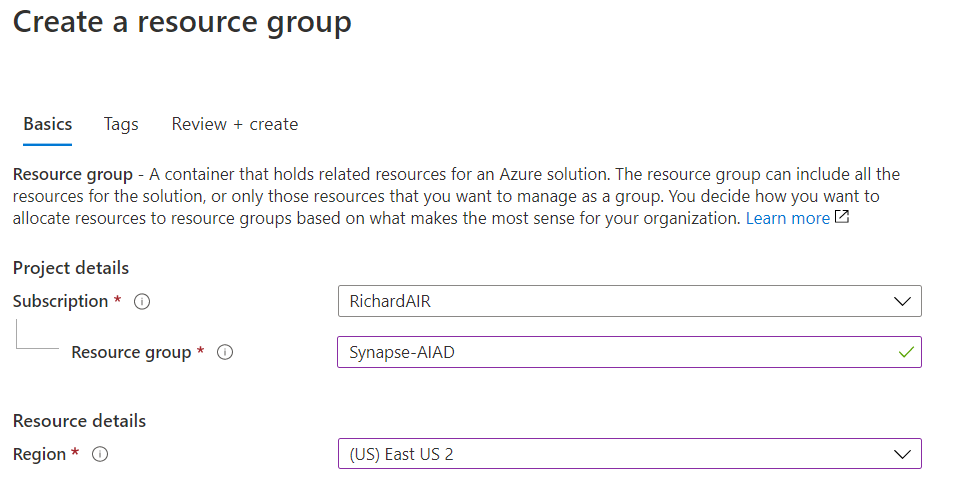
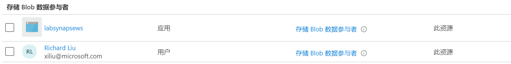

## **创建Synapse工作区**

## Task 1: 准备存储帐户

1. 在Microsoft Edge浏览器中, 浏览并登陆Azure门户(https://portal.azure.com)

2. 新建资源组**Synapse-AIAD**, 区域选择**East US 2**

3. 创建新的Datalake V2存储账户

    选项卡 | 设置|建议的值
    --- | ---| ---
    基本|存储帐户名称|`合适的账户名, 账户名必须唯一`
    基本|帐户种类|`StorageV2`
    基本|位置|`East US 2`
    基本|复制|`本地冗余存储(LRS)`
    高级|Data Lake Storage Gen2层次结构命名空间|`已启用`

4. 创建存储账户后, 从左侧菜单中选择"访问控制(标识和访问管理)", 分配"存储 Blob数据参与者"角色给当前用户并保存

5. 在新建的数据湖储存账号中新建**容器**, 接受默认设置“公共访问级别”，然后选择“创建”, 这个容器后面会作为Synapse工作区的日志和作业输出位置
    
    我们需要创建三个容器
    容器名 | 用途
    --- | ---
    labdata | 用于存储本次实验测试数据
    staging | 用于Pipeline存储临时数据
    synapsews | 用于存储Azure Synapse工作数据

在下面的步骤中，你将配置 Azure Synapse 工作区以使用此存储帐户作为“主要”存储帐户，并使用容器来存储工作区数据。将Github中的[labdata](https://github.com/Azure/OCPCHINATECH/tree/master/OCPOpenHack/Azure_Synapse/labdata)文件夹下的文件都下载下来，然后上传到刚刚新建的labdata的容器中

## Task 2: 创建Synapse工作区

1.  在Azure门户顶部搜索"Synapse"

2. 在搜索结果中，选择"Azure Synapse Analytics (工作区预览)"

3. 选择"添加"并使用如下设置来创建Synapse工作区

    选项卡|设置|建议的值
    --- | ---| ---
    基本|资源组|`Synapse-AIAD`
    基本|工作区名称|`合适的工作区名, 工作区名必须唯一, 本实验为labsynapsews`
    基本|区域|`East US 2`
    基本|Data Lake Storage Gen2账户名|`aiadatalake`
    基本|Data Lake Storage Gen2文件系统名称|`synapsews`

4. 选择"查看 + 创建" -> "创建". 你的工作区将在几分钟内准备就绪

验证对存储帐户的访问权限
1. 打开 Azure 门户和为工作区所选的主存储帐户

2. 从左侧菜单中选择"访问控制(标识和访问管理)"

3. 分配"存储 Blob数据参与者"角色给当前用户以及刚刚创建的Synapse工作区 labsynapsews

4. 选择"保存"

## Task 3: 打开Synapse Studio
创建Azure Synapse工作区后，可以通过两种方式打开Synapse Studio：
- 在 Azure 门户中打开创建的Synapse 工作区。 在"概述"页的顶部，选择"启动 Synapse Studio"
- 访问 https://web.azuresynapse.net，然后登录到工作区

## Task 4: 创建SQL池
1. 在Synapse Portal的左侧菜单中(非先前打开的Synapse 工作区)，选择"分析池" > "SQL池" 

2. 选择"新建"
    选项卡|设置|建议的值
    --- | ---| ---
    基本|Apache Spark 池名称|`sqlpool01`
    基本|性能级别|`DW100c`
    
3. 选择"查看 + 创建" > "创建"

## Task 5: 创建Spark池

1. 在Synapse Studio的左侧菜单中，选择"Synapse 资源" > "Apache Spark池" 

2. 选择"新建"
    选项卡|设置|建议的值
    --- | ---| ---
    基本|Apache Spark 池名称|`sparkpool01`
    基本|节点大小|`Small (4 个 vCPU/32 GB)`
    基本|节点数|`3 个节点`

3. 选择"查看 + 创建" > "创建"
