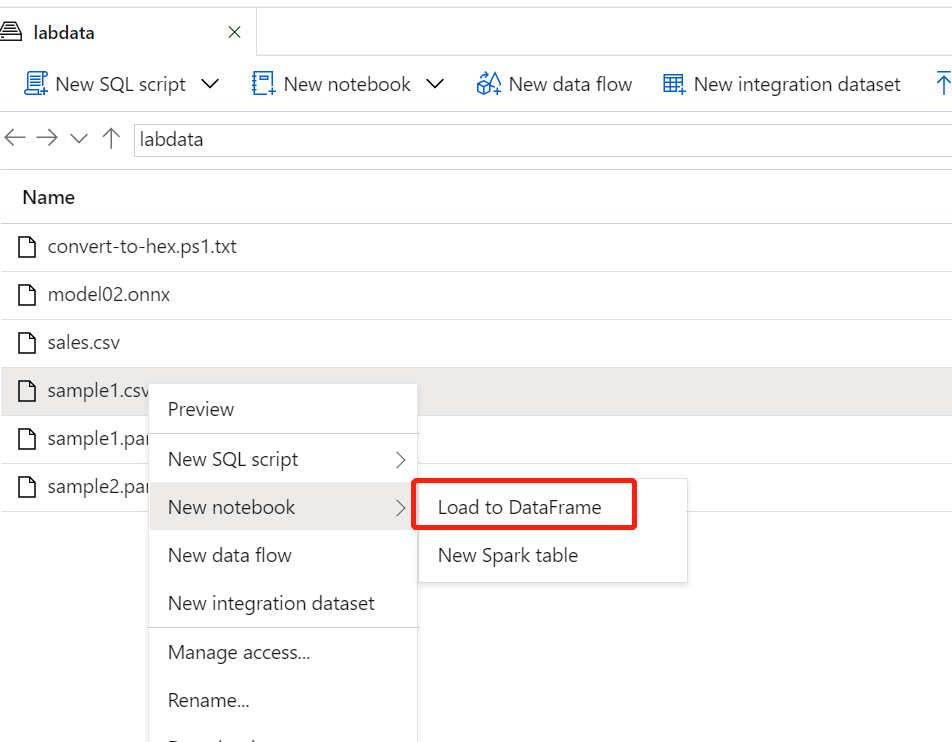

## **使用 Synapse 进行数据分析**

在这个实验中, 我们将通过不同的数据引擎在Synapse Studio中进行数据分析

## Task 1: 使用按需SQL进行数据分析

在这个实验中我们将通过无服务的按需SQL来分析存储在数据湖中的数据

1. 在Microsoft Edge浏览器中, 浏览并登陆Azure门户(https://portal.azure.com), 选择资源组


2. 选择之前创建的**Synapse Analytics**资源组 **Synapse-AIAD**

3. 选择之前创建的Synapse工作区 **labsynapsews**


4. 点击**启动Synapse Studio**


5. 在Synapse Studio左侧菜单中选择Data项


6. 切换至**Linked**标签, 并在**Storage accounts**下选择之前创建的存储账户**aiaddatalake**

7. 选择 labdata -> sample1.parquet, 右击sample1.parquet文件并选择 **New SQL script - Select TOP 100 rows**

    Synapse Studio会自动生成SQL脚本并返回Parquet数据文件中的前100行记录

8. 确认数据库引擎连接至**SQL on-demand**, 并点击**Run**


9. 将第二行更改为**Count(*)** 再次进行执行, 获得数据文件中的记录数, 将第五行更改为使用通配符后再次执行, 通过通配符我们可以读取多个parquet文件
```sql
BULK 'https://aiaddatalake.dfs.core.windows.net/labdata/sample*.parquet'
```
    **注意**: 请将存储账户名更改为你们自己创建的唯一的存储账户名


10. 将SQL语句更换为如下语句, 演示如何检索数据湖上的CSV文件, 并可以指定表结构信息

```SQL
SELECT
    COUNT(*)
FROM
    OPENROWSET(
        BULK 'https://aiaddatalake.dfs.core.windows.net/labdata/sample1.csv',
 		FORMAT = 'CSV', 
		FIELDTERMINATOR ='|', 
        FIELDQUOTE = '',
		FIRSTROW = 2
    ) 
WITH 
    (
        SalesKey BIGINT,
        CityKey INT,
        CustomerKey INT,
        BillToCustomerKey INT,
        StockItemKey INT,
        DeliveryDateKey DATE,
        SalesPersonKey INT,
        WWIInvoiceID INT,
        Description VARCHAR(200),
        Package VARCHAR(10),
        Quantity INT,
        UnitPrice DECIMAL(6,2),
        TaxRate DECIMAL(6,2),
        TotalExcludingTax DECIMAL(6,2),
        TaxAmount DECIMAL(6,2),
        Profit DECIMAL(6,2),
        TotalIncludingTax DECIMAL(6,2),
        TotalDryItems INT,
        TotalChillerItems INT,
        LineageKey INT
    ) as S
```

## Task 2: 使用SQL池分析数据

## 通过Polybase方式将数据从数据湖导入到SQL池

1. 在Synapse Studio左侧菜单中选择Develop项, 新建**SQL Script**


2. 确认数据库引擎连接至sqlpool01, 顺序执行下列SQL语句

**创建SQL池中的sales表**

```sql
CREATE TABLE [dbo].[sales]
(
	[SaleKey] [bigint] NOT NULL,
	[CityKey] [int] NOT NULL,
	[CustomerKey] [varchar](50) NULL,
	[BillToCustomerKey] [int] NOT NULL,
	[StockItemKey] [int] NOT NULL,
	[InvoiceDateKey] [date] NOT NULL,
	[DeliveryDateKey] [date] NULL,
	[SalespersonKey] [int] NOT NULL,
	[WWIInvoiceID] [int] NOT NULL,
	[Description] [nvarchar](100) NOT NULL,
	[Package] [nvarchar](50) NOT NULL,
	[Quantity] [int] NOT NULL,
	[UnitPrice] [decimal](18, 2) NOT NULL,
	[TaxRate] [decimal](18, 3) NOT NULL,
	[TotalExcludingTax] [decimal](18, 2) NOT NULL,
	[TaxAmount] [decimal](18, 2) NOT NULL,
	[Profit] [decimal](18, 2) NOT NULL,
	[TotalIncludingTax] [decimal](18, 2) NOT NULL,
	[TotalDryItems] [int] NOT NULL,
	[TotalChillerItems] [int] NOT NULL,
	[LineageKey] [int] NOT NULL,
	[ProductId] [bigint] NULL
)
WITH
(
	DISTRIBUTION = ROUND_ROBIN,
	HEAP
)
```
**创建外部表**
```sql
CREATE MASTER KEY ENCRYPTION BY PASSWORD = '<yourPassword>'

CREATE DATABASE SCOPED CREDENTIAL StorageCredential
WITH
IDENTITY = 'SHARED ACCESS SIGNATURE',
SECRET = '<Storage Account key of datalake>';
```
```sql
CREATE EXTERNAL DATA SOURCE LabStorage
WITH
(
	TYPE = HADOOP,
	CREDENTIAL = StorageCredential,
	LOCATION = 'abfss://labfile@casperdatalake.dfs.core.windows.net'
);

CREATE EXTERNAL FILE FORMAT csvFormat
WITH (
	FORMAT_TYPE = DELIMITEDTEXT,
	FORMAT_OPTIONS (
		FIELD_TERMINATOR = ',',
        First_Row = 2,
        STRING_DELIMITER = '',
        DATE_FORMAT = '',
		USE_TYPE_DEFAULT = False
	)
);

CREATE SCHEMA labexternal

CREATE EXTERNAL TABLE [labexternal].[Sales]
(
	[SaleKey] [bigint] NOT NULL,
	[CityKey] [int] NOT NULL,
	[CustomerKey] [varchar](50) NULL,
	[BillToCustomerKey] [int] NOT NULL,
	[StockItemKey] [int] NOT NULL,
	[InvoiceDateKey] [date] NOT NULL,
	[DeliveryDateKey] [date] NULL,
	[SalespersonKey] [int] NOT NULL,
	[WWIInvoiceID] [int] NOT NULL,
	[Description] [nvarchar](100) NOT NULL,
	[Package] [nvarchar](50) NOT NULL,
	[Quantity] [int] NOT NULL,
	[UnitPrice] [decimal](18, 2) NOT NULL,
	[TaxRate] [decimal](18, 3) NOT NULL,
	[TotalExcludingTax] [decimal](18, 2) NOT NULL,
	[TaxAmount] [decimal](18, 2) NOT NULL,
	[Profit] [decimal](18, 2) NOT NULL,
	[TotalIncludingTax] [decimal](18, 2) NOT NULL,
	[TotalDryItems] [int] NOT NULL,
	[TotalChillerItems] [int] NOT NULL,
	[LineageKey] [int] NOT NULL,
	[ProductId] [bigint] NULL
)
WITH
(
	LOCATION = '/sales.csv',
	DATA_SOURCE = LabStorage,
	FILE_FORMAT = [csvFormat]  
)  
GO
```
**查看外部表[labexternal].[Sales]中的记录数**
```sql
select count(1) from [labexternal].[Sales]
```
**将外部表数据导入至SQL池中的sales表**
```sql
INSERT INTO [dbo].[sales]
SELECT *
FROM [labexternal].[Sales]
```
**确认数据表是否正确导入**
```sql
select count(1) from sales
```

## 通过COPY方式将数据从数据湖导入到SQL池

1. 在Synapse Studio左侧菜单中选择Develop项, 新建**SQL Script**

2. 确认数据库引擎连接至sqlpool01, 顺序执行下列SQL语句

**删除之前创建的sales表**
```sql
Drop TABLE [dbo].[sales]
```

**创建新sales表
```sql
CREATE TABLE [dbo].[sales]
(
	[SaleKey] [bigint] NOT NULL,
	[CityKey] [int] NOT NULL,
	[CustomerKey] [varchar](50) NULL,
	[BillToCustomerKey] [int] NOT NULL,
	[StockItemKey] [int] NOT NULL,
	[InvoiceDateKey] [date] NOT NULL,
	[DeliveryDateKey] [date] NULL,
	[SalespersonKey] [int] NOT NULL,
	[WWIInvoiceID] [int] NOT NULL,
	[Description] [nvarchar](100) NOT NULL,
	[Package] [nvarchar](50) NOT NULL,
	[Quantity] [int] NOT NULL,
	[UnitPrice] [decimal](18, 2) NOT NULL,
	[TaxRate] [decimal](18, 3) NOT NULL,
	[TotalExcludingTax] [decimal](18, 2) NOT NULL,
	[TaxAmount] [decimal](18, 2) NOT NULL,
	[Profit] [decimal](18, 2) NOT NULL,
	[TotalIncludingTax] [decimal](18, 2) NOT NULL,
	[TotalDryItems] [int] NOT NULL,
	[TotalChillerItems] [int] NOT NULL,
	[LineageKey] [int] NOT NULL,
	[ProductId] [bigint] NULL
)
WITH
(
	DISTRIBUTION = ROUND_ROBIN,
	HEAP
)
```
**将数据湖中的数据复制到数据表中
```sql
COPY INTO [dbo].[sales]
From 'https://casperdatalake.dfs.core.windows.net/labfile/sales.csv'
WITH
(
    CREDENTIAL=(IDENTITY= 'Storage Account Key', SECRET='xHx8IKAp/9wgEIXosBLnTpEOabeVaIRm6J7XO/BBkHU30ZkwPkI2mMiW0FosyUreHfqfs1OkokE9a3U7TAeaxg=='),
    FILE_TYPE = 'CSV',
    FIELDTERMINATOR = ',',
    FIRSTROW=2
)OPTION (LABEL = 'COPY: Sales tutorial');
```
**确认数据表是否正确导入**
```sql
select count(1) from [dbo].[sales]
```


## Task 3: 使用Spark池分析数据

1. 在Synapse Studio左侧菜单中选择Data项

2. 切换至**Linked**标签, 并在**Storage accounts**下选择之前创建的存储账户**aiaddatalake**

3. 选择 labdata -> sample1.csv, 右击sample1.csv文件并选择 **New Notebook** --> **Load to DataFrame**



系统会自动生成相应的Python语句, 确认数据库引擎连接至**sparkpool01**, 并取消**header=True**前面的注释, 添加一行 **,sep="|"** （注意，包含逗号），点击 **Run All**


4. 将视图切换为图表方式, 查看针对**StockItemKey**的平均**UnitPrice**的直方表


