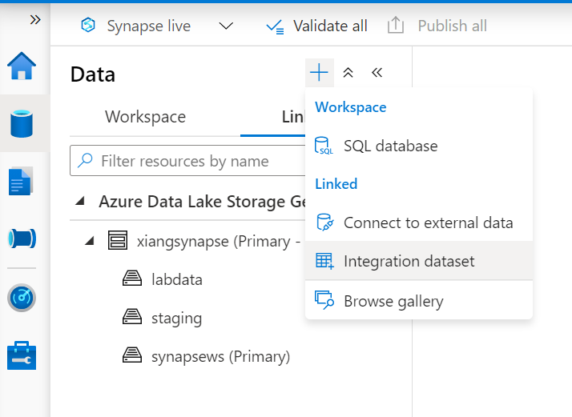
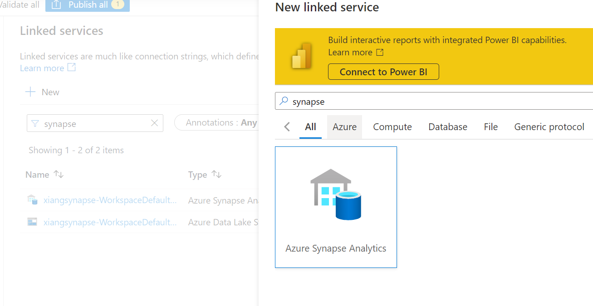
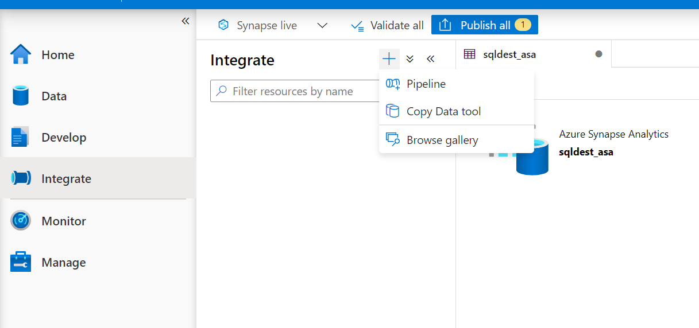
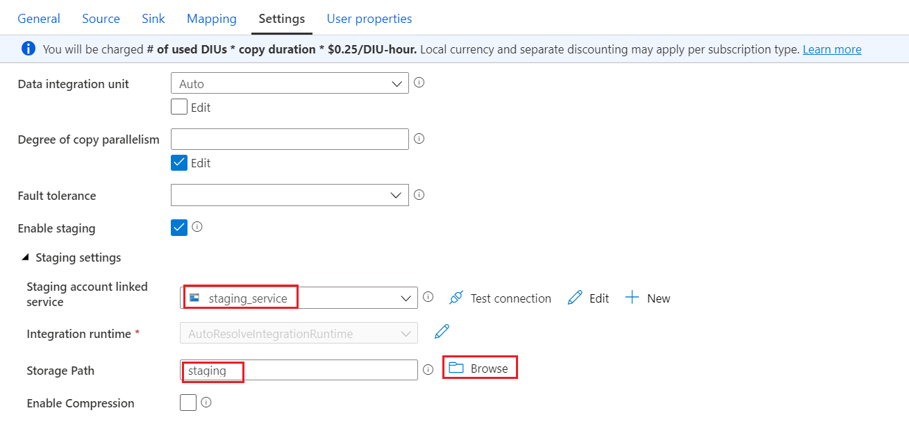

## 通过管道进行数据注入

## Task 1: 创建数据表

1. 在Synapse Studio左侧菜单中选择Develop项, 新建**SQL Script**

2. 确定数据库引擎连接至**sqlpool01**, 执行下列SQL语句创建**sales_import**表

```sql
CREATE TABLE [dbo].[sales_import]
( 
	[SaleKey] [bigint]  NOT NULL,
	[CityKey] [int]  NOT NULL,
	[CustomerKey] [int]  NOT NULL,
	[BillToCustomerKey] [int]  NOT NULL,
	[StockItemKey] [int]  NOT NULL,
	[InvoiceDateKey] [date]  NOT NULL,
	[DeliveryDateKey] [date]  NULL,
	[SalespersonKey] [int]  NOT NULL,
	[WWIInvoiceID] [int]  NOT NULL,
	[Description] [nvarchar](100)  NOT NULL,
	[Package] [nvarchar](50)  NOT NULL,
	[Quantity] [int]  NOT NULL,
	[UnitPrice] [decimal](18,2)  NOT NULL,
	[TaxRate] [decimal](18,3)  NOT NULL,
	[TotalExcludingTax] [decimal](18,2)  NOT NULL,
	[TaxAmount] [decimal](18,2)  NOT NULL,
	[Profit] [decimal](18,2)  NOT NULL,
	[TotalIncludingTax] [decimal](18,2)  NOT NULL,
	[TotalDryItems] [int]  NOT NULL,
	[TotalChillerItems] [int]  NOT NULL,
	[LineageKey] [int]  NOT NULL,
    [ProductID] [int]
)
WITH
(
	DISTRIBUTION = ROUND_ROBIN,
	HEAP
)
GO
```

## Task 2: 创建原数据集

1. 在Synapse Studio左侧菜单中选择Data项

2. 切换至**Linked**标签, 创建**Integration dataset**



3. 在搜索框中输入**lake**, 并选择**Azure Data Lake Storage Gen2**, 点击**Continue**

4. 在接下来的文件类型中选择**DelimitedText - CSV**

5. 设置数据集属性如下, 并点击**OK**


## Task 3: 创建数据连接服务

1. 在Synapse Studio左侧菜单中选择Manage项, 并选择**Linked Service**

2. 在搜索框中输入**synapse**, 并选择**Azure Synapse Analytics**, 点击**Continue**

3. 在属性对话框中属性下列信息, 并点击**Create**

    设置|建议的值
    --- | ---
    Name|**sqlpool01_service**
    Account selection method|**From Azure subscription**
    Azure subscription|**选择你的订阅**
    Server name|**选择你的Synapse工作区**
    Database name|**选择sqlpool01**
    User name|**sqladminuser**
    Password|**SQL管理员密码**

## Task 4: 创建目的数据集

1. 继续点击创建**Dataset**

2. 在搜索框中输入**synapse**, 并选择**Azure Synapse Analytics**, 点击**Continue**



3. 在属性对话框中选择之前创建的数据连接服务**sqlpool01_service**, 并选择之前创建的数据表**sales_import**, 点击**OK**


## Task 5: 创建管道

1. 在Synapse Studio左侧菜单中选择Integrate项, 新建**Pipeline**, 并取名为**Copy Sales**



2. 在左侧菜单中选择**Move & transform**, 并将**Copy data**拖拽至工作区


3. 将复制操作命名为**Copy Sales Data**


4. 在**Source**选项页, 选择**salessource_adls**为Source dataset


5. 在**Sink**选项页, 选择**sqldest_asa**为Sink dataset


6. 在**Mapping**选项页, 根据下表设置数据映射关系及数据类型


列名 | 类型
--- | ---
Sale Key | String
City Key | String
Customer Key | String
Bill To Customer Key | Int32
Stock Item Key | Int32
Invoice Date Key | DateTime
Delivery Date Key | DateTime
Salesperson Key | Int32
WWI Invoice ID | Int32
Description | String
Package | String
Quantity | Decimal
Unit Price | Decimal
Tax Rate | Decimal
Total Excluding Tax | Decimal
Tax Amount | Decimal
Profit | Decimal
Total Including Tax | Decimal
Total Dry Items | Int32
Total Chiller Items | Int32
Lineage Key | Int32
ProductID | Int32


7. 在**Setting**选项页, 创建**Staging account linked service**


在数据湖中选择**staging**容器做为**Storage Path**



8. 点击**Publish all**, 发布**Pipeline**


9. 点击**Add trigger->Tigger Now**, 启动数据复制 Pipeline


10. 在Synapse Studio左侧菜单中选择Monitor项, 查看Pipeline复制的进度


