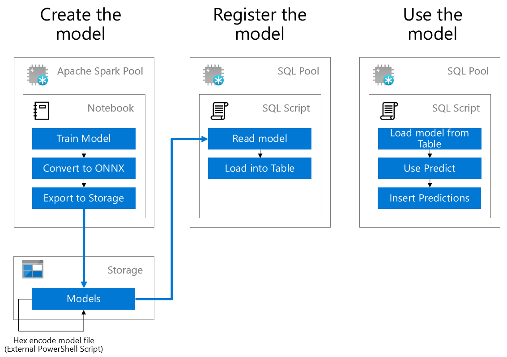
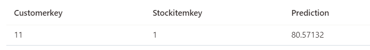

## 在SQL中使用预训练模型

在Synapse中我们可以使用Notebook来调用机器学习库进行模型训练, 也可以使用预先训练好的模型, 对数据库数据进行预测, 目前支持ONNX模式的训练模型, 我们可以通过脚本将模型转换为16进制的二进制对象存储在数据库中并使用PREDICT来进行数据预测. 在下面的实验中我们将通过一个简单的线性回归模型对测试数据进行预测, 并保存在新增数据列中. 



1. 在Synapse Studio左侧菜单中选择**Develop**项, 并新建**SQL Script**

2. 连接数据库引擎至**sqlpool01**, 并执行下列SQL语句

3. 创建用于测试的数据表**SampleData**, 及测试数据

```sql
CREATE TABLE SampleData
(
    [customerkey] REAL, 
    [stockitemkey] REAL
);

INSERT INTO SampleData VALUES (11,1)
```

4. 从数据湖中读取已经转为十六进制的ONNX模型并存入外部表[labexternal].[MLModelExt]中

```sql
CREATE EXTERNAL FILE FORMAT modelCSV
WITH (
FORMAT_TYPE = DELIMITEDTEXT,
FORMAT_OPTIONS (
    FIELD_TERMINATOR = ',',
    STRING_DELIMITER = '',
    DATE_FORMAT = '',
    USE_TYPE_DEFAULT = False
    )
);

CREATE DATABASE SCOPED CREDENTIAL modelStorageCredential
WITH
IDENTITY = 'SHARED ACCESS SIGNATURE',
SECRET = 'b0YgCH/qc+POtb+orJrqF4kVPP2k+4DE36je1m3NfLcGb9NFkltGkOYvJ2E7X3+dAs/F0I+MqKooP/LuhBPVmQ==';

CREATE EXTERNAL DATA SOURCE modelStorage
WITH
( 
    LOCATION = 'abfss://labdata@aiaddatalake.dfs.core.windows.net'
    , CREDENTIAL = modelStorageCredential
    , TYPE = HADOOP
);

CREATE EXTERNAL TABLE [labexternal].[MLModelExt]
(
    [Model] [varbinary](max) NULL
)
WITH
(
    LOCATION='/model02.onnx.hex' ,
    DATA_SOURCE = modelStorage ,
    FILE_FORMAT = modelCSV ,
    REJECT_TYPE = VALUE,
    REJECT_VALUE = 0
)
GO
```

5. 创建MLModel表, 用于存储ONNX模型数据

```sql
CREATE TABLE MLModel
(
    [Id] [int] IDENTITY(1,1) NOT NULL,
    [Model] [varbinary](max) NULL,
    [Description] [varchar](200) NULL
)
WITH
(
    DISTRIBUTION = REPLICATE,
    HEAP
)
GO

INSERT INTO MLModel
SELECT Model, 'A linear regression model.'
FROM [labexternal].[MLModelExt]
```

6. 使用**PREDICT**语句获取模型预测值
```sql
DECLARE @model varbinary(max) = (SELECT Model FROM MLModel WHERE Id = (SELECT Top(1) max(ID) FROM MLModel));

SELECT d.*, p.Variable1 as Prediction
FROM PREDICT(model=@model, DATA=SampleData AS d, RUNTIME=ONNX) WITH (Variable1 real) AS p;
```

7. 运行结果如下

