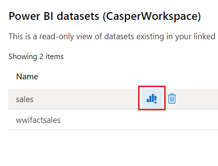

## 使用Power BI可视化数据

## Task 1: 在Synapse Studio中创建PowerBI数据集

1. 在Synapse Studio左侧菜单中选择Manage项, 并选择**Linked Service** -> **New**

2. 在搜索框中搜索**Power**, 选择**Power BI**并点击**Continue**

3. 选择所拥有的 PowerBI Pro 账号所对应的Tenant ID和PowerBI Workspace

4. 成功创建Power BI Linked Service后, 在Synapse Studio左侧菜单中选择Develop项, 这时菜单中会出现PowerBI选项, 选择**Power BI datasets**

5. 选择**New Power BI dataset**, 并下载相应SQL Pool的**pbids**文件

6. 使用PowerBI Desktop打开下载的pbids文件, 并登陆PowerBI Pro账号. 如果还没有安装Power BI Desktop可以根据提示下载安装, 或直接通过 https://powerbi.microsoft.com/en-us/downloads/ 下载

7. 登陆后, 选择需要连接的Synapse SQL数据库, 点击**Connect**, 选择需要使用的数据表项, 点击**Load**

8. 连接模式选择**DirectQuery**, 并点击**OK**

9. 成功后, 在Power BI Desktop中可以看到选中的数据表出现在Field列表中

10. 在Power BI Desktop中选择File -> Publish, 将dataset发布到Power BI云端

11. 发布后, 在Synapse Studio中就可以看到Dataset出现在列表中, 如果没有出现可以点击**Refresh**

## Task 2: 从Synapse Studio中创建Power BI Report

1. 选中在Task 1中新建的Dataset, 点击**New Power BI Report**按钮

2. 在Power BI设计界面中, 我们可以非常方便的在数据表中选择需要展示的数据列

3. 选择用于数据展现的可视化组件

4. 之后选择File -> Save As 保存当前报表, 发布至Power BI, 所有有权限的人都可以通过Synapse Studio或Power BI 来查阅报表了

## **注意事项:**

如果你在Data Fields看不到, 加载的数据表信息, 需要通过下列方式设置正确的数据源访问秘钥

1. 访问app.powerbi.com, 并使用Power BI Pro的账号登陆

2. 选择 Workspace 并搜寻当前正在使用的工作区

3. 在菜单中选择 Setting -> Settings -> Datasets -> Data source credentials

4. 输入正确的用户名和密码后点击**Sign in**