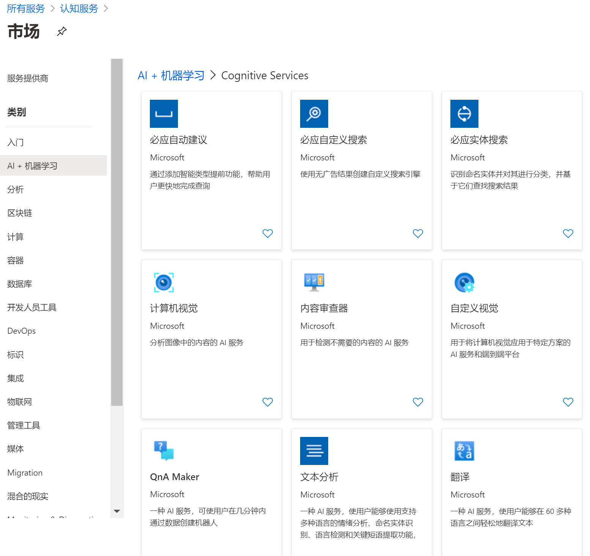
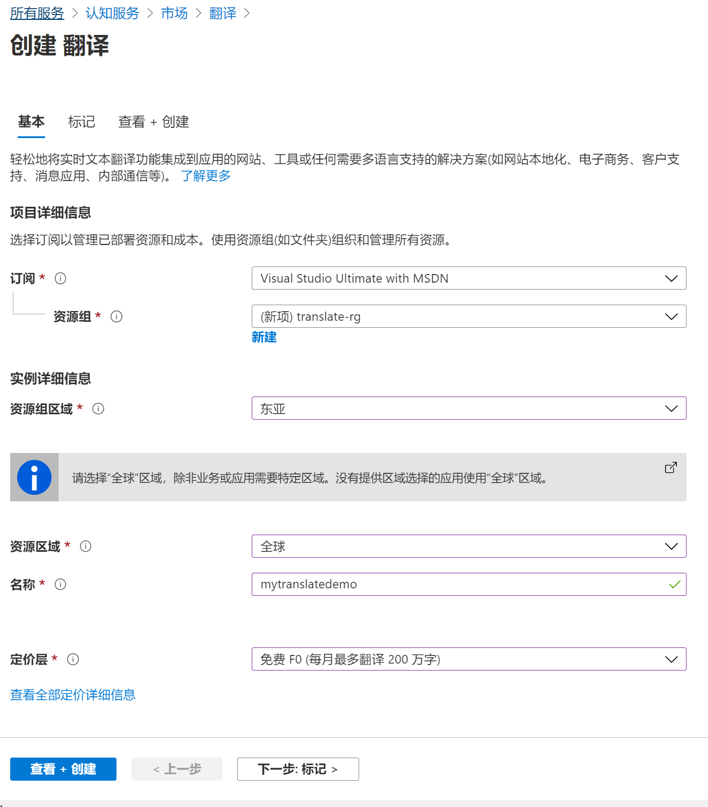
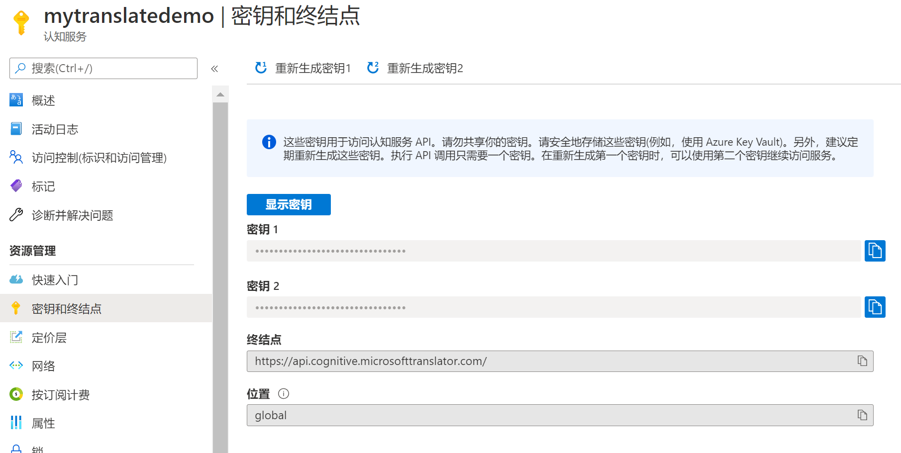

## **翻译服务试验**

1. 登陆Azure门户(https://portal.azure.com)，选择"创建资源" > "AI+机器学习" > "认知服务" > "翻译" 。
   


2. 在服务创建页面，提供资源组，资源组区域，资源区域，名称和定价层信息。点击"查看 + 创建"开始创建服务。
   


3. 服务创建完成后，点击"密钥和终结点"，记录下密钥和终结点供后续使用。
   


4. 本示例将使用Python 3作为试验环境，因为文本翻译基于REST API，与编程语言无关，也可选择其他语言进行试验。确保Python环境安装好后，运行pip install requests uuid
   
5.  选择任意文本编辑器创建 translatedemo.py，输入以下代码，并将key和endpoint替换成实际的密钥和终结点。关于语言种类的支持，参考https://docs.microsoft.com/zh-cn/azure/cognitive-services/translator/language-support#customization 。API文档参考https://docs.microsoft.com/zh-cn/azure/cognitive-services/translator/reference/v3-0-translate
   
```python
import os, requests, uuid, json

key_var_name = 'TRANSLATOR_TEXT_SUBSCRIPTION_KEY'
subscription_key = 'key'

endpoint_var_name = 'TRANSLATOR_TEXT_ENDPOINT'
endpoint = 'endpoint'

path = '/translate?api-version=3.0'
params = '&to=de&to=en'
constructed_url = endpoint + path + params

headers = {
    'Ocp-Apim-Subscription-Key': subscription_key,
    'Content-type': 'application/json',
    'X-ClientTraceId': str(uuid.uuid4())
}

body = [{
    'text': '你好，这是文本翻译试验环节'
}]

request = requests.post(constructed_url, headers=headers, json=body)
response = request.json()

print(json.dumps(response, sort_keys=True, indent=4,
                 ensure_ascii=False, separators=(',', ': ')))

```

6. 在命令行窗口中运行 python ./translatedemo.py ，可以看到如下输出：

```json
[
    {
        "detectedLanguage": {
            "language": "zh-Hans",
            "score": 1.0
        },
        "translations": [
            {
                "text": "Hallo, das ist das Textübersetzungsexperiment.",
                "to": "de"
            },
            {
                "text": "Hello, this is the text translation experiment.",
                "to": "en"
            }
        ]
    }
]
```
