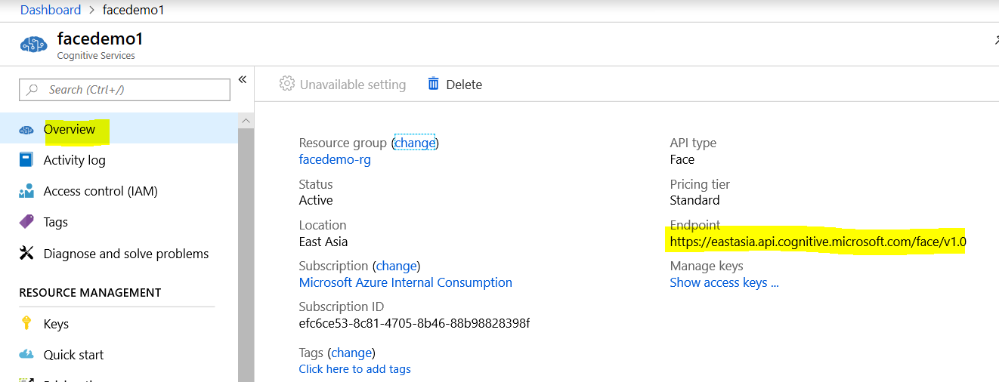
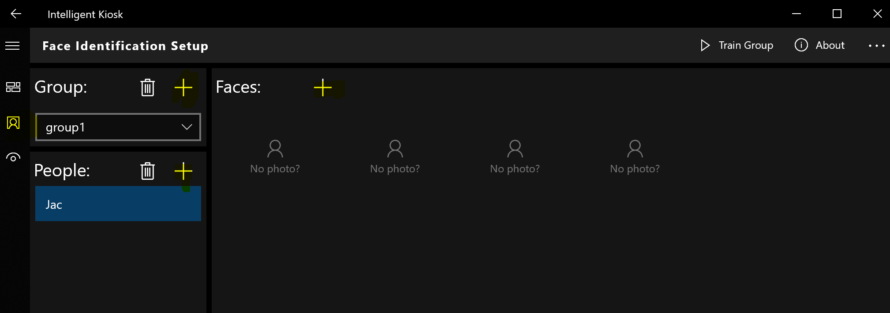

# 基于容器的Azure人脸服务
Azure人脸API 服务是一项认知服务，其提供的算法可用于检测、识别和分析图像中的人脸。 处理人脸信息的功能在许多不同的软件方案中很重要，这些方案包括安全性、自然用户界面、图像内容分析和管理、移动应用和机器人。

目前Azure人脸API已经支持容器部署，意味着Azure人脸功能可以部署到用户自建机房或边缘设备中。本实验主要实践容器化Azure人脸的部署与使用。该实验将包括以下内容：
- 准备Docker环境
- 创建人脸服务
- 启动人脸容器
- 测试人脸功能
- 人脸信息持久化

## 准备Docker环境 ##
1 . 在https://docs.docker.com/docker-for-windows/install/ 安装Docker for Windows，安装完成后，点击Settings菜单

2 . 确保本地磁盘可以被docker访问

## 创建人脸服务 ##
1 . 登陆Azure Portal，找到人脸服务

2 . 填入名称，订阅等后，点击创建。

3 . 在创建好的人脸服务Overview页面，找到API端点。

4 . 在创建好的人脸服务Keys页面，找到调用服务所需要的密钥。

API端点和密钥将在下一节被用到。

## 启动人脸容器 ##
1 . 启动cmd命令行窗口，执行以下命令登陆到人脸容器的私有镜像仓库。其中用户名和密码可以从[Cognitive Services Vision Containers Request form](https://aka.ms/VisionContainersPreview)申请获得

docker login containerpreview.azurecr.io -u &lt;useraccount&gt; -p &lt;key&gt;

2 . 执行以下命令将最新的人脸容器镜像拉取到本地

docker pull containerpreview.azurecr.io/microsoft/cognitive-services-face:latest

3 . 执行以下命令启动人脸容器

docker run --rm -it -p 5000:5000 --memory 6g --cpus 2 containerpreview.azurecr.io/microsoft/cognitive-services-face Eula=accept Billing=&lt;API Endpoint&gt; ApiKey=&lt;API Key&gt;

## 测试人脸功能 ##
1 . 在浏览器访问http://localhost:5000/swagger/index.html ，如果人脸API的说明可以正常显示，说明人脸服务已经正常运行。

2 . 访问https://www.microsoft.com/zh-cn/p/intelligent-kiosk/9nblggh5qd84#activetab=pivot:overviewtab 安装Windows Store 应用Intellight Kiosk并启动

3 . 点击左下角按钮，按照下图进行设置（注意点击Click here for extra setup ... 按照提示完成设置）

4 . 在Intelligent Kiosk内找到Face API Explorer并进行测试。该测试支持从摄像头或本地文件获取照片，返回年龄，人脸特征等。

## 人脸信息持久化 ##

使用人脸API进行人脸分组以及识别时，人脸容器需要对人脸索引信息进行持久化，该持久化能力需要借助到Azure的存储服务和Cosmos Db服务。

1 . 创建存储账号服务，确保账户类型选择的是general purpose v2

2 . 待存储账号创建好后，在Access keys页面获得连接字符串

3 . 创建Cosmos DB服务，确保API类型选择的是Azure Cosmos DB for MongoDB API

4 . 待Cosmos账号创建好后，在Connection String页面获得连接字符串

5 . 关掉正在运行的人脸容器服务，执行以下命令重新启动人脸容器

docker run --rm -it -p 5000:5000 --memory 6g --cpus 2 containerpreview.azurecr.io/microsoft/cognitive-services-face Eula=accept Billing=&lt;API Endpoint&gt; ApiKey=&lt;API Key&gt; CloudAI:Storage:StorageScenario=Azure CloudAI:Storage:ConnectionStringOfCosmosMongo="&lt;CosmosConnectionString&gt;" CloudAI:Storage:ConnectionStringOfAzureStorage="&lt;StorageConnectionString&gt;"

6 . 在Intelligent Kiosk的Face Identification Setup页面创建人脸组

此时人脸组索引信息已被持久化，重启人脸容器和Intelligent Kiosk，人脸组仍然能被再次显示。

## 总结 ##
容器化的人脸服务无需把人脸图片直接上传到Azure，可以大大提高人脸服务的部署灵活性和访问速度。