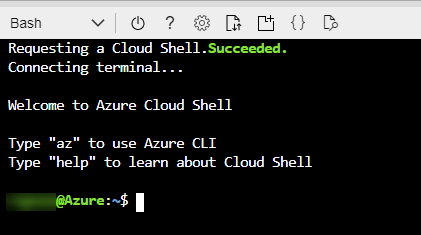
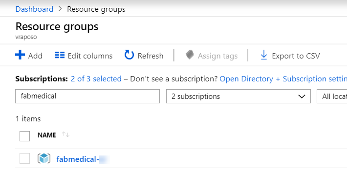

!["Microsoft Cloud Workshops"][logo]

<div class="MCWHeader1">
Cloud-native applications
</div>

<div class="MCWHeader2">
Before the hands-on lab setup guide
</div>

<div class="MCWHeader3">
November 2020
</div>

Information in this document, including URL and other Internet Web site references, is subject to change without notice. Unless otherwise noted, the example companies, organizations, products, domain names, e-mail addresses, logos, people, places, and events depicted herein are fictitious, and no association with any real company, organization, product, domain name, e-mail address, logo, person, place or event is intended or should be inferred. Complying with all applicable copyright laws is the responsibility of the user. Without limiting the rights under copyright, no part of this document may be reproduced, stored in or introduced into a retrieval system, or transmitted in any form or by any means (electronic, mechanical, photocopying, recording, or otherwise), or for any purpose, without the express written permission of Microsoft Corporation.

Microsoft may have patents, patent applications, trademarks, copyrights, or other intellectual property rights covering subject matter in this document. Except as expressly provided in any written license agreement from Microsoft, the furnishing of this document does not give you any license to these patents, trademarks, copyrights, or other intellectual property.

The names of manufacturers, products, or URLs are provided for informational purposes only and Microsoft makes no representations and warranties, either expressed, implied, or statutory, regarding these manufacturers or the use of the products with any Microsoft technologies. The inclusion of a manufacturer or product does not imply endorsement of Microsoft of the manufacturer or product. Links may be provided to third party sites. Such sites are not under the control of Microsoft and Microsoft is not responsible for the contents of any linked site or any link contained in a linked site, or any changes or updates to such sites. Microsoft is not responsible for webcasting or any other form of transmission received from any linked site. Microsoft is providing these links to you only as a convenience, and the inclusion of any link does not imply endorsement of Microsoft of the site or the products contained therein.

© 2020 Microsoft Corporation. All rights reserved.

**Contents**

<!-- TOC -->

- [Cloud-native applications before the hands-on lab setup guide](#cloud-native-applications-before-the-hands-on-lab-setup-guide)
  - [Requirements](#requirements)
  - [Before the hands-on lab](#before-the-hands-on-lab)
    - [Task 1: Setup Azure Cloud Shell](#task-1-setup-azure-cloud-shell)
    - [Task 2: Download Starter Files](#task-2-download-starter-files)
    - [Task 3: Resource Group](#task-3-resource-group)
    - [Task 4: Create an SSH key](#task-4-create-an-ssh-key)
    - [Task 5: Deploy ARM Template](#task-5-deploy-arm-template)
    - [Task 6: Create a GitHub repository](#task-6-create-a-github-repository)
    - [Task 7: Connect securely to the build agent](#task-7-connect-securely-to-the-build-agent)
    - [Task 8: Complete the build agent setup](#task-8-complete-the-build-agent-setup)
    - [Task 9: Clone Repositories to the Build Agent](#task-9-clone-repositories-to-the-build-agent)

<!-- /TOC -->

# Cloud-native applications before the hands-on lab setup guide

## Requirements

1. Microsoft Azure subscription must be pay-as-you-go or MSDN.

   - Trial subscriptions will _not_ work.

   - To complete this lab setup, ensure your account includes the following:

     - Has the [Owner](https://docs.microsoft.com/azure/role-based-access-control/built-in-roles#owner) built-in role for the subscription you use.

     - Is a [Member](https://docs.microsoft.com/azure/active-directory/fundamentals/users-default-permissions#member-and-guest-users) user in the Azure AD tenant you use. (Guest users will not have the necessary permissions.)

   - You must have enough cores available in your subscription to create the build agent and Azure Kubernetes Service cluster in [Task 5: Deploy ARM Template](#Task-5-Deploy-ARM-Template). You'll need eight cores if following the exact instructions in the lab, more if you choose additional agents or larger VM sizes. Execute the steps required before the lab to see if you need to request more cores in your sub.

2. An account in Microsoft [GitHub](https://github.com).

3. Local machine or a virtual machine configured with:

   - A browser, preferably Chrome for consistency with the lab implementation tests.

4. You will be asked to install other tools throughout the exercises.

## Before the hands-on lab

**Duration**: 60 minutes

You should follow all of the steps provided in this section _before_ taking part in the hands-on lab ahead of time as some of these steps take time.

### Task 1: Setup Azure Cloud Shell

1. Open a cloud shell by selecting the cloud shell icon in the menu bar.

   

2. The cloud shell opens in the browser window. Choose **Bash** if prompted or use the left-hand dropdown on the shell menu bar to choose **Bash** from the dropdown (as shown). If prompted, select **Confirm**.

   

3. You should make sure to set your default subscription correctly. To view your current subscription type:

   ```bash
   az account show
   ```

   

4. To set your default subscription to something other than the current selection, type the following, replacing {id} with the desired subscription id value:

   ```bash
   az account set --subscription {id}
   ```

> **Note**: To list all of your subscriptions, type:

   ```bash
   az account list
   ```

   

### Task 2: Download Starter Files

In this task, you use `git` to copy the lab content to your cloud shell so that the lab starter files will be available.

> **Note**: If you don't have a cloud shell available, refer back to [Task 1: Setup Azure Cloud Shell](#task-1-setup-azure-cloud-shell).

1. Type the following command and press `<ENTER>`:

   ```bash
   git clone https://github.com/microsoft/MCW-Cloud-native-applications.git
   ```

   > **Note**: If you do not have enough free space, you may need to remove extra files from your cloud shell environment.  Try running `azcopy jobs clean` to remove any `azcopy` jobs and data you do not need.

2. The lab files download.

   

3. We do not need the `.git` folder, and later steps will be less complex if we remove it. Run this command:

   ```bash
   rm -rf MCW-Cloud-native-applications/.git
   ```

### Task 3: Resource Group

Create an Azure Resource Group to hold most of the resources that you create in this hands-on lab. This approach makes it easier to clean up later.

1. In your cloud shell window, you type a command similar to the following command, be sure to replace the tokens:

   > **Note**: If you don't have a cloud shell available, refer back to [Task 1: Setup Azure Cloud Shell](#task-1-setup-azure-cloud-shell).

   ```bash
   az group create -l '[LOCATION]' -n 'fabmedical-[SUFFIX]'
   ```

   - **Suffix:** Throughout the lab, suffix should be used to make resources unique, like your email prefix or your first initial and last name.

   - **Location:** Choose a region where all Azure Container Registry SKUs have to be available, which is currently: Canada Central, Canada East, North Central US, Central US, South Central US, East US, East US 2, West US, West US 2, West Central US, France Central, UK South, UK West, North Europe, West Europe, Australia East, Australia Southeast, Brazil South, Central India, South India, Japan East, Japan West, Korea Central, Southeast Asia, East Asia, and remember this for future steps so that the resources you create in Azure are all kept within the same region.

   Example:

   ```bash
   az group create -l 'west us' -n 'fabmedical-sol'
   ```

2. When this completes, the Azure Portal shows your Resource Group.

   

### Task 4: Create an SSH key

You create VMs during the upcoming exercises. In this section, you create an SSH key to access the VMs securely.

1. From the cloud shell command line, enter the following command to ensure that a directory for the SSH keys exists. You can ignore any errors you see in the output.

   > **Note**: If you don't have a cloud shell available, refer back to [Task 1: Setup Azure Cloud Shell](#task-1-setup-azure-cloud-shell).

   ```bash
   mkdir .ssh
   ```

2. From the cloud shell command line, enter the following command to generate an SSH key pair. You can replace `admin` with your preferred name or handle.

   ```bash
   ssh-keygen -t RSA -b 2048 -C admin@fabmedical
   ```

3. When asked to save the generated key to a file, enter `.ssh/fabmedical` for the name.

4. Enter a passphrase when prompted, and **don't forget it**!

5. Because you entered `.ssh/fabmedical` the ssh-keygen generates the file in the `.ssh` folder in your user folder, where the cloud shell opens by default.

   

6. From the cloud shell command line, enter the following command to output the public key content. Copy this information to use later.

    ```bash
    cat .ssh/fabmedical.pub
    ```

7. Keep this cloud shell open and remain in the default directory. You will use this shell in later tasks.

    

### Task 5: Deploy ARM Template

In this section, you configure and execute an ARM template that creates all the resources that you need throughout the exercises.

1. In Azure cloud shell, switch to the ARM template directory:

   > **Note**: If you don't have a cloud shell available, refer back to [Task 1: Setup Azure Cloud Shell](#task-1-setup-azure-cloud-shell).

   ```bash
   cd MCW-Cloud-native-applications/Hands-on\ lab/arm/
   ```

2. Open the azuredeploy.parameters.json file for editing using Azure Cloud Shell editor.

   ```bash
   code azuredeploy.parameters.json
   ```

   

3. Update the values for the various keys so that they match your environment:

   - **Suffix**: Enter a shortened version of your SUFFIX with a max of 3 chars.
   - **VirtualMachineAdminUsernameLinux**: The Linux Build Agent VM admin username (example: `"adminfabmedical"`).
   - **VirtualMachineAdminPublicKeyLinux**: The Linux Build Agent VM admin ssh public key. You find this value in the `.ssh/fabmedical.pub` file created previously (example: `"ssh-rsa AAAAB3N(...)vPiybQV admin@fabmedical"`).
   - **CosmosLocation**: The primary location of the Azure Cosmos DB. Use the same location as the resource group previously created (example: `"eastus"`).
   - **CosmosLocationName**: The name of the primary location of the Azure Cosmos DB. Use the name of the same location as the resource group previously created (example: `"East US"`).
   - **CosmosPairedLocation**: The secondary location of the Azure Cosmos DB. The below link can be used to help find the Azure Region Pair for your primary location. (example: `"westus"`).
   - **CosmosPairedLocationName**: The name of the secondary location of the Azure Cosmos DB. Use the location name that matches the secondary location defined in the previous key (example: `"West US"`).

   > **Note**: A list of Azure Region Pairs can be found here: <https://docs.microsoft.com/en-us/azure/best-practices-availability-paired-regions#azure-regional-pairs>.

4. Select the **...** button and select **Save**.

   

5. Select the **...** button again and select **Close Editor**.

   

6. Create the needed resources by typing the following instruction (case sensitive), replacing {resourceGroup} with the name of the previously created resource group:

   ```bash
   az deployment group create --resource-group {resourceGroup} --template-file azuredeploy.json --parameters azuredeploy.parameters.json
   ```

   This command takes 30 to 60 minutes to deploy all lab resources. You can continue to the next task to setup GitHub while the deployment runs.

   > **Note** If you get an error about the Cosmos DB name, ensure that you typed the `ComsosLocation` and `CosmosPairedLocation` without any spaces. Re-run the above command after you have corrected the name.

### Task 6: Create a GitHub repository

FabMedical has provided starter files for you. They have taken a copy of the websites for their customer Contoso Neuro and refactored it from a single node.js site into a website with a content API that serves up the speakers and sessions. This refactored code is a starting point to validate the containerization of their websites. Use this to help them complete a POC that validates the development workflow for running the website and API as Docker containers and managing them within the Azure Kubernetes Service environment.

1. Open a web browser and navigate to <https://www.github.com>. Log in using your GitHub account credentials.

2. In the upper-right corner, expand the user drop down menu and select **Your repositories**.

    

3. Next to the search criteria, locate and select the **New** button.

    

4. On the **Create a new repository** screen, name the repository **Fabmedical** and select the **Create repository** button.

    

5. On the **Quick setup** screen, copy the **HTTPS** GitHub URL for your new repository, paste this in notepad for future use.

    

6. Open a **new** Azure Cloud Shell console.  You can do this by selecting the **Open new session** button from the first console, or navigating to <https://shell.azure.com> and logging in with the same lab credentials.

7. Navigate to the FabMedical source code folder and list the contents.

   ```bash
   cd ~/MCW-Cloud-native-applications/Hands-on\ lab/lab-files/developer/
   ls
   ```

   > **Important note**: If you will be taking the Infrastructure edition of the lab, instead of using the above instructions, type the following ones:
   >
   > ```bash
   > cd ~/MCW-Cloud-native-applications/Hands-on\ lab/lab-files/infrastructure/
   > ls
   > ```
   >
   > This will take you to the version of the starter files that will be used by that edition of the lab.

8. You'll see the listing includes three folders, one for the web site, another for the content API and one to initialize API data:

   ```bash
   content-api/
   content-init/
   content-web/
   ```

9. Set your username and email, which git uses for commits.

    ```bash
    git config --global user.email "you@example.com"
    git config --global user.name "Your Name"
    ```

10. Using the Cloud Shell, initialize a new git repository:

    ```bash
    git init
    git add .
    git commit -m "Initial Commit"
    ```

11. Set the remote origin to the GitHub URL by issuing the following command:

    ```bash
    git remote add origin <your GitHub URL>
    ```

12. Configure git CLI to cache your credentials, so that you don't have to keep re-typing them.

    ```bash
    git config --global --unset credential.helper
    git config --global credential.helper store
    ```

13. Push to the master branch by issuing the following command:

    ```bash
    git push -u origin master
    ```

    > **Note**: If you have multi-factor authentication, you will need to create a personal access token when using the cloud shell. Reference the following link for help with setting up a GitHub personal access token to use for authenticating `git` with your GitHub account: <https://docs.github.com/en/github/authenticating-to-github/creating-a-personal-access-token>.

    > **Note**: Once you have your personal access token, retry the above command, use your token as the password.

14. Refresh your GitHub repository, you should now see the code published.

### Task 7: Connect securely to the build agent

In this section, you validate that you can connect to the new build agent
VM.

1. Open a **new** Azure Cloud Shell console and run the following command to find the IP address for the build agent VM provisioned when you ran the ARM deployment:

   > **Note**: If you don't have a cloud shell available, refer back to [Task 1: Setup Azure Cloud Shell](#task-1-setup-azure-cloud-shell).

   ```bash
   az vm show -d -g fabmedical-[SUFFIX] -n fabmedical-[SHORT_SUFFIX] --query publicIps -o tsv
   ```

   Example:

   ```bash
   az vm show -d -g fabmedical-sol -n fabmedical-SOL --query publicIps -o tsv
   ```

2. In the cloud shell output, take note of the public IP address for the VM.

   

3. Connect to the new VM you created by typing the following command:

   ```bash
    ssh -i [PRIVATEKEYNAME] [BUILDAGENTUSERNAME]@[BUILDAGENTIP]
   ```

   Replace the bracketed values in the command as follows:

   - `[PRIVATEKEYNAME]`: Use the private key name `.ssh/fabmedical`, created above.

   - `[BUILDAGENTUSERNAME]`: Use the username for the VM, in the default setup it is `adminfabmedical`.

   - `[BUILDAGENTIP]`: The IP address for the build agent VM, retrieved in the previous step.

   ```bash
   ssh -i .ssh/fabmedical adminfabmedical@52.174.141.11
   ```

4. When asked to confirm if you want to connect, as the authenticity of the connection cannot be validated, type `yes`.

5. When asked for the passphrase for the private key you created previously, enter this value.

6. SSH connects to the VM and displays a command prompt such as the following. Keep this cloud shell window open for the next step:

   `adminfabmedical@fabmedical-SUFFIX:~$`

   

> **Note**: If you have issues connecting, you may have pasted the SSH public key incorrectly in the ARM template. Unfortunately, if this is the case, you will have to recreate the VM and try again.

### Task 8: Complete the build agent setup

In this task, you update the packages and install the Docker engine.

1. Go to the cloud shell window that has the SSH connection open to the build agent VM.

2. Update the Ubuntu packages and install curl and support for repositories over HTTPS in a single step by typing the following in a single line command. Respond by typing `Y` and pressing enter, if asked if you would like to proceed.

   ```bash
   sudo apt-get update && sudo apt install apt-transport-https ca-certificates curl software-properties-common
   ```

   > **Note**: This is a single line.

3. Add Docker's official GPG key by typing the following in a single line command:

   ```bash
   curl -fsSL https://download.docker.com/linux/ubuntu/gpg | sudo apt-key add -
   ```

4. Add Docker's stable repository to Ubuntu packages list by typing the following in a single line command:

   ```bash
   sudo add-apt-repository "deb [arch=amd64] https://download.docker.com/linux/ubuntu $(lsb_release -cs) stable"
   ```

5. Add NodeJs PPA to use NodeJS LTS release and update the Ubuntu packages and install Docker engine, node.js, and the node package manager by typing the following commands, each on their own line. If asked if you would like to proceed, respond by typing `Y` and pressing enter.

   ```bash
   sudo apt-get install curl python-software-properties -y

   curl -sL https://deb.nodesource.com/setup_12.x | sudo -E bash -

   sudo apt-get update && sudo apt-get install -y docker-ce nodejs mongodb-clients
   ```

6. Now, upgrade the Ubuntu packages to the latest version by typing the following in a single line command.

   ```bash
   sudo apt-get upgrade -y
   ```

7. When the command has completed, check the Docker version installed by executing this command. The output may look something like that shown in the following screenshot. Note that the server version is not shown yet, because you didn't run the command with elevated privileges (to be addressed shortly).

   ```bash
   docker version
   ```

   

8. You may check the versions of node.js and npm as well, just for information purposes, using these commands:

   ```bash
   nodejs --version

   npm -version
   ```

9. Install the Angular CLI.

    ```bash
    sudo npm install -g @angular/cli
    ```

10. To remove the requirement to use sudo, add your user to the Docker group. You can ignore any errors you see in the output.

    ```bash
    sudo usermod -aG docker $USER
    ```

    

11. For the user permission changes to take effect, exit the SSH
    session by typing `exit`, then press \<Enter\>. Reconnect to the build agent VM using SSH as you did in the previous task.

    ```bash
    ssh -i .ssh/fabmedical adminfabmedical@52.174.141.11
    ```

12. Repeat the `docker version` command, and note the output now shows the server version as well.

    

13. Run a few Docker commands:

    - One to see if there are any containers presently running.

      ```bash
      docker container ls
      ```

    - One to see if any containers exist, whether running or not.

      ```bash
      docker container ls -a
      ```

14. In both cases, you have an empty list but no errors while running the command. Your build agent is ready with the Docker engine running correctly.

    

### Task 9: Clone Repositories to the Build Agent

In this task, you clone your repositories from GitHub so you can work with them on the build agent.

1. As you previously did in cloud shell, set your username and email which are used for git commits.

   ```bash
   git config --global user.email "you@example.com"
   git config --global user.name "Your Name"
   ```

   > **Note**: In some cases, the `root` user owns your user's `.config` folder. If this happens, run the following command to return ownership to `adminfabmedical` and then try the `git` command again:
   >
   > ```bash
   > sudo chown -R $USER:$(id -gn $USER) /home/adminfabmedical/.config
   > ```

2. Configure git CLI to cache your credentials, so that you don't have to keep
   re-typing them.

   ```bash
   git config --global credential.helper cache
   ```

   > **Note**: In some cases, the `root` user owns your user's `.config` folder. If this happens, run the following command to return ownership to `adminfabmedical` and then try the `git` command again:
   >
   > ```bash
   > sudo chown -R $USER:$(id -gn $USER) /home/adminfabmedical/.config
   > ```

3. Use the GitHub URL to clone the repository code to your build agent machine.

   ```bash
   git clone <GITHUB_REPOSITORY_URL>
   ```

   > **Note**: In some cases, the `root` user owns your user's `.config` folder. If this happens, run the following command to return ownership to `adminfabmedical` and then try the `git` command again:
   >
   > ```bash
   > sudo chown -R $USER:$(id -gn $USER) /home/adminfabmedical/.config
   > ```

You should follow all steps provided _before_ performing the Hands-on lab.

[logo]: https://github.com/Microsoft/MCW-Template-Cloud-Workshop/raw/master/Media/ms-cloud-workshop.png
