![Microsoft Cloud Workshops][logo]

<div class="MCWHeader1">
Cloud-native applications - Infrastructure edition
</div>

<div class="MCWHeader2">
Hands-on lab step-by-step
</div>

<div class="MCWHeader3">
November 2020
</div>

Information in this document, including URL and other Internet Web site references, is subject to change without notice. Unless otherwise noted, the example companies, organizations, products, domain names, e-mail addresses, logos, people, places, and events depicted herein are fictitious, and no association with any real company, organization, product, domain name, e-mail address, logo, person, place or event is intended or should be inferred. Complying with all applicable copyright laws is the responsibility of the user. Without limiting the rights under copyright, no part of this document may be reproduced, stored in or introduced into a retrieval system, or transmitted in any form or by any means (electronic, mechanical, photocopying, recording, or otherwise), or for any purpose, without the express written permission of Microsoft Corporation.

Microsoft may have patents, patent applications, trademarks, copyrights, or other intellectual property rights covering subject matter in this document. Except as expressly provided in any written license agreement from Microsoft, the furnishing of this document does not give you any license to these patents, trademarks, copyrights, or other intellectual property.

The names of manufacturers, products, or URLs are provided for informational purposes only and Microsoft makes no representations and warranties, either expressed, implied, or statutory, regarding these manufacturers or the use of the products with any Microsoft technologies. The inclusion of a manufacturer or product does not imply endorsement of Microsoft of the manufacturer or product. Links may be provided to third party sites. Such sites are not under the control of Microsoft and Microsoft is not responsible for the contents of any linked site or any link contained in a linked site, or any changes or updates to such sites. Microsoft is not responsible for webcasting or any other form of transmission received from any linked site. Microsoft is providing these links to you only as a convenience, and the inclusion of any link does not imply endorsement of Microsoft of the site or the products contained therein.

© 2020 Microsoft Corporation. All rights reserved.

Microsoft and the trademarks listed at https://www.microsoft.com/en-us/legal/intellectualproperty/Trademarks/Usage/General.aspx are trademarks of the Microsoft group of companies. All other trademarks are property of their respective owners.

**Contents**

<!-- TOC -->
- [Cloud-native applications - Infrastructure edition hands-on lab step-by-step](#cloud-native-applications---infrastructure-edition-hands-on-lab-step-by-step)
  - [Abstract and learning objectives](#abstract-and-learning-objectives)
  - [Overview](#overview)
  - [Solution architecture](#solution-architecture)
  - [Requirements](#requirements)
  - [Exercise 1: Create and run a Docker application](#exercise-1-create-and-run-a-docker-application)
    - [Task 1: Test the application](#task-1-test-the-application)
    - [Task 2: Browsing to the web application](#task-2-browsing-to-the-web-application)
    - [Task 3: Create Docker images](#task-3-create-docker-images)
    - [Task 4: Run a containerized application](#task-4-run-a-containerized-application)
    - [Task 5: Setup environment variables](#task-5-setup-environment-variables)
    - [Task 6: Push images to Azure Container Registry](#task-6-push-images-to-azure-container-registry)
    - [Task 7: Setup CI Pipeline to Push Images](#task-7-setup-ci-pipeline-to-push-images)
  - [Exercise 2: Migrate MongoDB to Cosmos DB using Azure Database Migration Service](#exercise-2-migrate-mongodb-to-cosmos-db-using-azure-database-migration-service)
    - [Task 1: Enable Microsoft.DataMigration resource provider](#task-1-enable-microsoftdatamigration-resource-provider)
    - [Task 2: Provision Azure Database Migration Service](#task-2-provision-azure-database-migration-service)
    - [Task 3: Migrate data to Azure Cosmos DB](#task-3-migrate-data-to-azure-cosmos-db)
  - [Exercise 3: Deploy the solution to Azure Kubernetes Service](#exercise-3-deploy-the-solution-to-azure-kubernetes-service)
    - [Task 1: Tunnel into the Azure Kubernetes Service cluster](#task-1-tunnel-into-the-azure-kubernetes-service-cluster)
    - [Task 2: Deploy a service using the Kubernetes management dashboard](#task-2-deploy-a-service-using-the-kubernetes-management-dashboard)
    - [Task 3: Deploy a service using kubectl](#task-3-deploy-a-service-using-kubectl)
    - [Task 4: Deploy a service using a Helm chart](#task-4-deploy-a-service-using-a-helm-chart)
    - [Task 5: Test the application in a browser](#task-5-test-the-application-in-a-browser)
    - [Task 6: Configure Continuous Delivery to the Kubernetes Cluster](#task-6-configure-continuous-delivery-to-the-kubernetes-cluster)
    - [Task 7: Review Azure Monitor for Containers](#task-7-review-azure-monitor-for-containers)
  - [Exercise 4: Scale the application and test HA](#exercise-4-scale-the-application-and-test-ha)
    - [Task 1: Increase service instances from the Kubernetes dashboard](#task-1-increase-service-instances-from-the-kubernetes-dashboard)
    - [Task 2: Increase service instances beyond available resources](#task-2-increase-service-instances-beyond-available-resources)
    - [Task 3: Restart containers and test HA](#task-3-restart-containers-and-test-ha)
    - [Task 4: Configure Cosmos DB Autoscale](#task-4-configure-cosmos-db-autoscale)
    - [Task 5: Test Cosmos DB Autoscale](#task-5-test-cosmos-db-autoscale)
  - [Exercise 5: Working with services and routing application traffic](#exercise-5-working-with-services-and-routing-application-traffic)
    - [Task 1: Scale a service without port constraints](#task-1-scale-a-service-without-port-constraints)
    - [Task 2: Update an external service to support dynamic discovery with a load balancer](#task-2-update-an-external-service-to-support-dynamic-discovery-with-a-load-balancer)
    - [Task 3: Adjust CPU constraints to improve scale](#task-3-adjust-cpu-constraints-to-improve-scale)
    - [Task 4: Perform a rolling update](#task-4-perform-a-rolling-update)
    - [Task 5: Configure Kubernetes Ingress](#task-5-configure-kubernetes-ingress)
    - [Task 6: Multi-region Load Balancing with Traffic Manager](#task-6-multi-region-load-balancing-with-traffic-manager)
  - [After the hands-on lab](#after-the-hands-on-lab)

<!-- /TOC -->

# Cloud-native applications - Infrastructure edition hands-on lab step-by-step

## Abstract and learning objectives

This hands-on lab is designed to guide you through the process of building and deploying Docker images to the Kubernetes platform hosted on Azure Kubernetes Services (AKS), in addition to learning how to work with dynamic service discovery, service scale-out, and high-availability.

At the end of this lab, you will be better able to build and deploy containerized applications to Azure Kubernetes Service and perform common DevOps procedures.

## Overview

Fabrikam Medical Conferences (FabMedical) provides conference website services tailored to the medical community. They are refactoring their application code, based on node.js, so that it can run as a Docker application, and want to implement a POC that will help them get familiar with the development process, lifecycle of deployment, and critical aspects of the hosting environment. They will be deploying their applications to Azure Kubernetes Service and want to learn how to deploy containers in a dynamically load-balanced manner, discover containers, and scale them on demand.

In this hands-on lab, you will assist with completing this POC with a subset of the application codebase. You will create a build agent based on Linux, and an Azure Kubernetes Service cluster for running deployed applications. You will be helping them to complete the Docker setup for their application, test locally, push to an image repository, deploy to the cluster, and test load-balancing and scale.

> **Important**: Most Azure resources require unique names. Throughout these steps, you will see the word "SUFFIX" as part of resource names. You should replace this with a unique handle (like your Microsoft Account email prefix) to ensure unique names for resources.

## Solution architecture

Below is a diagram of the solution architecture you will build in this lab. Please study this carefully, so you understand the whole of the solution as you are working on the various components.

The solution will use Azure Kubernetes Service (AKS), which means that the container cluster topology is provisioned according to the number of requested nodes. The proposed containers deployed to the cluster are illustrated below with Cosmos DB as a managed service:


Each tenant will have the following containers:

- **Conference Web site**: The SPA application that will use configuration settings to handle custom styles for the tenant.

- **Admin Web site**: The SPA application that conference owners use to manage conference configuration details, manage attendee registrations, manage campaigns, and communicate with attendees.

- **Registration service**: The API that handles all registration activities creating new conference registrations with the appropriate package selections and associated cost.

- **Email service**: The API that handles email notifications to conference attendees during registration, or when the conference owners choose to engage the attendees through their admin site.

- **Config service**: The API that handles conference configuration settings such as dates, locations, pricing tables, early-bird specials, countdowns, and related.

- **Content service**: The API that handles content for the conference such as speakers, sessions, workshops, and sponsors.

## Requirements

1. Microsoft Azure subscription must be pay-as-you-go or MSDN.

   - Trial subscriptions will _not_ work.

   - To complete this lab, ensure your account has the following roles:

     - The [Owner](https://docs.microsoft.com/azure/role-based-access-control/built-in-roles#owner)
       built-in role for the Azure Subscription you will use.

     - Is a [Member](https://docs.microsoft.com/azure/active-directory/fundamentals/users-default-permissions#member-and-guest-users) user in the Azure AD tenant you will use. (Guest users will not have the necessary permissions.)

     > **Note** If you do not meet these requirements, you may have to ask another member user with subscription owner rights to login to the portal and execute the create service principal step ahead of time.

   - You must have enough cores available in your subscription to create the build agent and Azure Kubernetes Service cluster in Before the Hands-on Lab. You will need eight cores if following the exact instructions in the lab, or more if you choose additional cluster nodes or larger VM sizes. If you execute the steps required before the lab, you will be able to see if you need to request more cores in your sub.

2. Local machine or a virtual machine configured with:

   - A browser, preferably Chrome for consistency with the lab implementation tests.

3. You will install other tools throughout the exercises.

> **Very important**: You should be typing all the commands as they appear in the guide. Do not try to copy and paste to your command windows or other documents when instructed to enter the information shown in this document, except where explicitly stated in this document. There can be issues with Copy and Paste that result in errors, execution of instructions, or creation of file content.

## Exercise 1: Create and run a Docker application

**Duration**: 40 minutes

In this exercise, you will take the starter files and run the node.js application as a Docker application. You will create a Dockerfile, build Docker images, and run containers to execute the application.

### Task 1: Test the application

The purpose of this task is to make sure you can run the application successfully before applying changes to run it as a Docker application.

1. From Azure Cloud Shell, connect to your build agent if you are not already connected. (If you need to reconnect, please review the instructions in the "Before the HOL" document.)

2. Type the following command to create a Docker network named `fabmedical`:

   ```bash
   docker network create fabmedical
   ```

3. Run an instance of mongodb to use for local testing.

   ```bash
   docker container run --name mongo --net fabmedical -p 27017:27017 -d mongo:4.0
   ```

   > **Note**:  With the existing source code written for MongoDB, it can be pointed towards the Azure Cosmos DB MongoDB API endpoint. The Azure Cosmos DB Emulator could be used for local development on Windows; however, the Cosmos DB emulator does not support Linux. As a result, when using Linux for development, MongoDB is still needed for local development environments; with Azure Cosmos DB used for data storage in the cloud. This allows existing source code written for MongoDB storage to be easily migrated to using Azure Cosmos DB backend.

4. Confirm that the mongo container is running and ready.

   ```bash
   docker container list
   docker container logs mongo
   ```

   

5. Connect to the mongo instance using the mongo shell and test some basic commands:

   ```bash
   mongo
   ```

   ```text
   show dbs
   quit()
   ```

   

6. To initialize the local database with test content, first navigate to the content-init directory and run npm install.

   ```bash
   cd ~/Fabmedical/content-init
   npm install
   ```

   > **Note**: In some cases, the `root` user will be assigned ownership of your user's `.config` folder. If this happens, run the following command to return ownership to `adminfabmedical` and then try `npm install` again:

   ```bash
   sudo chown -R $USER:$(id -gn $USER) /home/adminfabmedical/.config
   ```

7. Initialize the database.

   ```bash
   nodejs server.js
   ```

   

8. Confirm that the database now contains test data.

   ```bash
   mongo
   ```

   ```text
   show dbs
   use contentdb
   show collections
   db.speakers.find()
   db.sessions.find()
   quit()
   ```

   This should produce output similar to the following:

   

9. Now navigate to the `content-api` directory and run npm install.

   ```bash
   cd ../content-api
   npm install
   ```

   > **Note**: In some cases, the `root` user will be assigned ownership of your user's `.config` folder. If this happens, run the following command to return ownership to `adminfabmedical` and then try `npm install` again:

   ```bash
   sudo chown -R $USER:$(id -gn $USER) /home/adminfabmedical/.config
   ```

10. Start the API as a background process.

    ```bash
    nodejs ./server.js &
    ```

    

11. Press `ENTER` again to get to a command prompt for the next step.

12. Test the API using curl. You will request the speaker's content, and this will return a JSON result.

    ```bash
    curl http://localhost:3001/speakers
    ```

    

13. Navigate to the web application directory, run `npm install` and `ng build`.

    ```bash
    cd ../content-web
    npm install
    ng build
    ```

    

    > **Note**: In some cases, the `root` user will be assigned ownership of your user's `.config` folder. If this happens, run the following command to return ownership to `adminfabmedical` and then try `npm install` again:

     ```bash
     sudo chown -R $USER:$(id -gn $USER) /home/adminfabmedical/.config
     ```

14. From Azure cloud shell, run the following command to find the IP address for the build agent VM provisioned when you ran the ARM deployment.

    ```bash
    az vm show -d -g fabmedical-[SUFFIX] -n fabmedical-[SHORT_SUFFIX] --query publicIps -o tsv
    ```

    Example:

    ```bash
    az vm show -d -g fabmedical-sol -n fabmedical-SOL --query publicIps -o tsv
    ```

15. From the cloud shell in the build machine edit the `app.js` file using vim.

    ```bash
    vim app.js
    ```

    Then press **_i_** to get into the edit mode, after that replace localhost with the build machine IP address.

    

    Then press **_ESC_**, write **_:wq_** to save you changes and close the file.

16. Now run the content-web application in the background.

    ```bash
    node ./app.js &
    ```

    Press `ENTER` again to get a command prompt for the next step.

17. Test the web application using curl. You will see HTML output returned without errors.

    ```bash
    curl http://localhost:3000
    ```

18. Leave the application running for the next task.

19. If you received a JSON response to the /speakers content request and an HTML response from the web application, your environment is working as expected.

### Task 2: Browsing to the web application

In this task, you will browse to the web application for testing.

1. From the Azure portal select the resource group you created named `fabmedical-SUFFIX`.

2. Select the build agent VM named `fabmedical-SUFFIX` from your list of available resources.

   

3. From the **Virtual Machine** blade overview, find the **IP address** of the VM.

   

4. Test the web application from a browser. Navigate to the web application using your build agent IP address at port `3000`.

   ```text
   http://[BUILDAGENTIP]:3000

   EXAMPLE: http://13.68.113.176:3000
   ```

5. Select the Speakers and Sessions links in the header. You will see the pages display the HTML version of the JSON content you curled previously.

6. Once you have verified the application is accessible through a browser, go to your cloud shell window and stop the running node processes.

   ```bash
   killall nodejs
   killall node
   ```

### Task 3: Create Docker images

In this task, you will create Docker images for the application --- one for the API application and another for the web application. Each image will be created via Docker commands that rely on a Dockerfile.

1. From cloud shell connected to the build agent VM, type the following command
   to view any Docker images on the VM. The list will only contain the mongodb
   image downloaded earlier.

   ```bash
   docker image ls
   ```

2. From the `content-api` folder containing the API application files and the new `Dockerfile` you created, type the following command to create a Docker image for the API application. This command does the following:

   - Executes the Docker build command to produce the image

   - Tags the resulting image with the name content-api (-t)

   - The final dot (`.`) indicates to use the Dockerfile in this current directory context. By default, this file is expected to have the name `Dockerfile` (case sensitive).

   ```bash
   docker image build -t content-api .
   ```

3. Once the image is successfully built, run the Docker images listing command again. You will see several new images: the node images and your container image.

   ```bash
   docker image ls
   ```

   Notice the untagged image. This is the build stage which contains all the intermediate files not needed in your final image.

   

4. Navigate to the `content-web` folder again and list the files. Note that this folder has a Dockerfile.

   ```bash
   cd ../content-web
   ll
   ```

5. View the Dockerfile contents -- which are similar to the file you created previously in the API folder. Type the following command:

   ```bash
   cat Dockerfile
   ```

   > Notice that the `content-web` Dockerfile build stage includes additional tools for a front-end Angular application in addition to installing npm packages.

6. Type the following command to create a Docker image for the web application.

   ```bash
   docker image build -t content-web .
   ```

7. Navigate to the content-init folder again and list the files. Note that this folder already has a Dockerfile.

   ```bash
   cd ../content-init
   ll
   ```

8. View the Dockerfile contents -- which are similar to the file you created previously in the API folder. Type the following command:

   ```bash
   cat Dockerfile
   ```

9. Type the following command to create a Docker image for the init application.

      ```bash
      docker image build -t content-init .
      ```

10. When complete, you will see eight images now exist when you run the Docker images command.

   ```bash
   docker image ls
   ```

   

### Task 4: Run a containerized application

The web application container will be calling endpoints exposed by the API application container and the API application container will be communicating with mongodb. In this exercise, you will launch the images you created as containers on the same bridge network you created when starting mongodb.

1. Create and start the API application container with the following command. The command does the following:

   - Names the container `api` for later reference with Docker commands.

   - Instructs the Docker engine to use the `fabmedical` network.

   - Instructs the Docker engine to use port `3001` and map that to the internal container port `3001`.

   - Creates a container from the specified image, by its tag, such as `content-api`.

   ```bash
   docker container run --name api --net fabmedical -p 3001:3001 content-api
   ```

2. The `docker container run` command has failed because it is configured to connect to mongodb using a localhost URL. However, now that content-api is isolated in a separate container, it cannot access mongodb via localhost even when running on the same docker host. Instead, the API must use the bridge network to connect to mongodb.

   ```text
      > content-api@0.0.0 start
   > node ./server.js

   Listening on port 3001
   Could not connect to MongoDB!
   MongooseServerSelectionError: connect ECONNREFUSED 127.0.0.1:27017
   npm notice
   npm notice New patch version of npm available! 7.0.8 -> 7.0.13
   npm notice Changelog: <https://github.com/npm/cli/releases/tag/v7.0.13>
   npm notice Run `npm install -g npm@7.0.13` to update!
   npm notice
   npm ERR! code 255
   npm ERR! path /usr/src/app
   npm ERR! command failed
   npm ERR! command sh -c node ./server.js

   npm ERR! A complete log of this run can be found in:
   npm ERR!     /root/.npm/_logs/2020-11-23T03_04_12_948Z-debug.log
   ```

3. The content-api application allows an environment variable to configure the mongodb connection string. Remove the existing container, and then instruct the docker engine to set the environment variable by adding the `-e` switch to the `docker container run` command. Also, use the `-d` switch to run the api as a daemon.

   ```bash
   docker container rm api
   docker container run --name api --net fabmedical -p 3001:3001 -e MONGODB_CONNECTION=mongodb://mongo:27017/contentdb -d content-api
   ```

4. Enter the command to show running containers. You will observe that the `api` container is in the list. Use the docker logs command to see that the API application has connected to mongodb.

   ```bash
   docker container ls
   docker container logs api
   ```

   

5. Test the API by curling the URL. You will see JSON output as you did when testing previously.

   ```bash
   curl http://localhost:3001/speakers
   ```

6. Create and start the web application container with a similar `docker container run` command -- instruct the docker engine to use any port with the `-P` command.

   ```bash
   docker container run --name web --net fabmedical -P -d content-web
   ```

7. Enter the command to show running containers again, and you will observe that both the API and web containers are in the list. The web container shows a dynamically assigned port mapping to its internal container port `3000`.

   ```bash
   docker container ls
   ```

   

8. Test the web application by fetching the URL with curl. For the port, use the dynamically assigned port, which you can find in the output from the previous command. You will see HTML output, as you did when testing previously.

   ```bash
   curl http://localhost:[PORT]/speakers.html
   ```

### Task 5: Setup environment variables

In this task, you will configure the `web` container to communicate with the API container using an environment variable, similar to the way the mongodb connection string is provided to the api.

1. From cloud shell connected to the build agent VM, stop and remove the web container using the following commands.

   ```bash
   docker container stop web
   docker container rm web
   ```

2. Validate that the web container is no longer running or present by using the `-a` flag as shown in this command. You will see that the `web` container is no longer listed.

   ```bash
   docker container ls -a
   ```

3. Review the `app.js` file.

   ```bash
   cd ../content-web
   cat app.js
   ```

4. Observe that the `contentApiUrl` variable can be set with an environment variable.

   ```javascript
   const contentApiUrl = process.env.CONTENT_API_URL || "http://localhost:3001";
   ```

5. Open the Dockerfile for editing using Vim and press the `i` key to go into edit mode.

   ```bash
   vi Dockerfile
   <i>
   ```

6. Locate the `EXPOSE` line shown below and add a line above it that sets the default value for the environment variable, as shown in the screenshot.

   ```Dockerfile
   ENV CONTENT_API_URL http://localhost:3001
   ```

   

7. Press the Escape key and type `:wq` and then press the Enter key to save and close the file.

   ```text
   <Esc>
   :wq
   <Enter>
   ```

8. Rebuild the web application Docker image using the same command as you did previously.

   ```bash
   docker image build -t content-web .
   ```

9. Create and start the image passing the correct URI to the API container as an environment variable. This variable will address the API application using its container name over the Docker network you created. After running the container, check to see the container is running and note the dynamic port assignment for the next step.

   ```bash
   docker container run --name web --net fabmedical -P -d -e CONTENT_API_URL=http://api:3001 content-web
   docker container ls
   ```

10. Curl the speakers path again, using the port assigned to the web container. Again, you will see HTML returned, but because curl does not process javascript, you cannot determine if the web application is communicating with the api application. You must verify this connection in a browser.

   ```bash
   curl http://localhost:[PORT]/speakers.html
   ```

11. You will not be able to browse to the web application on the ephemeral port because the VM only exposes a limited port range. Now you will stop the web container and restart it using port 3000 to test in the browser. Type the following commands to stop the container, remove it, and run it again using explicit settings for the port.

   ```bash
    docker container stop web
    docker container rm web
    docker container run --name web --net fabmedical -p 3000:3000 -d -e CONTENT_API_URL=http://api:3001 content-web
   ```

12. Curl the speaker path again, using port `3000`. You will see the same HTML returned.

    ```bash
    curl http://localhost:3000/speakers.html
    ```

13. You can now use a web browser to navigate to the website and successfully view the application at port `3000`. Replace `[BUILDAGENTIP]` with the IP address you used previously.

    ```bash
    http://[BUILDAGENTIP]:3000

    EXAMPLE: http://13.68.113.176:3000
    ```

12. Commit your changes and push to the repository.

    ```bash
    git add .
    git commit -m "Setup Environment Variables"
    git push
    ```

    Enter credentials if prompted.

### Task 6: Push images to Azure Container Registry

To run containers in a remote environment, you will typically push images to a Docker registry, where you can store and distribute images. Each service will have a repository that can be pushed to and pulled from with Docker commands. Azure Container Registry (ACR) is a managed private Docker registry service based on Docker Registry v2.

In this task, you will push images to your ACR account, version images with tagging, and setup continuous integration (CI) to build future versions of your containers and push them to ACR automatically.

1. In the [Azure Portal](https://portal.azure.com/), navigate to the ACR you created in Before the hands-on lab.

2. Select **Access keys** under **Settings** on the left-hand menu.

   

3. The Access keys blade displays the Login server, username, and password that will be required for the next step. Keep this handy as you perform actions on the build VM.

   > **Note**: If the username and password do not appear, select Enable on the Admin user option.

4. From the cloud shell session connected to your build VM, login to your ACR account by typing the following command. Follow the instructions to complete the login.

   ```bash
   docker login [LOGINSERVER] -u [USERNAME] -p [PASSWORD]
   ```

   For example:

   ```bash
   docker login fabmedicalsoll.azurecr.io -u fabmedicalsoll -p +W/j=l+Fcze=n07SchxvGSlvsLRh/7ga
   ```

   

   > **Tip**: Make sure to specify the fully qualified registry login server (all lowercase).

5. Run the following commands to properly tag your images to match your ACR account name.

   ```bash
   docker image tag content-web [LOGINSERVER]/content-web
   docker image tag content-api [LOGINSERVER]/content-api
   docker image tag content-init [LOGINSERVER]/content-init
   ```

   > **Note**: Be sure to replace the `[LOGINSERVER]` of your ACR instance.

6. List your docker images and look at the repository and tag. Note that the repository is prefixed with your ACR login server name, such as the sample shown in the screenshot below.

   ```bash
   docker image ls
   ```

   

7. Push the images to your ACR account with the following command:

   ```bash
   docker image push [LOGINSERVER]/content-web
   docker image push [LOGINSERVER]/content-api
   docker image push [LOGINSERVER]/content-init
   ```

   ![In this screenshot of the console window, an example of images being pushed to an ACR account results from typing and running the following at the command prompt: docker push [LOGINSERVER]/content-web.](media/image67.png "Push image to ACR")

8. In the Azure Portal, navigate to your ACR account, and select **Repositories** under **Services** on the left-hand menu. You will now see two, one for each image.

   

9. Select `content-api`. You will see the latest tag is assigned.

   

10. From the cloud shell session attached to the VM, assign the `v1` tag to each image with the following commands. Then list the Docker images to note that there are now two entries for each image: showing the `latest` tag and the `v1` tag. Also note that the image ID is the same for the two entries, as there is only one copy of the image.

    ```bash
    docker image tag [LOGINSERVER]/content-web:latest [LOGINSERVER]/content-web:v1
    docker image tag [LOGINSERVER]/content-api:latest [LOGINSERVER]/content-api:v1
    docker image ls
    ```

    

11. Push the images to your ACR account with the following command:

    ```bash
    docker image push [LOGINSERVER]/content-web:v1
    docker image push [LOGINSERVER]/content-api:v1
    docker image push [LOGINSERVER]/content-init:v1
    ```

12. Refresh one of the repositories to see the two versions of the image now appear.

    

13. Run the following commands to pull an image from the repository. Note that the default behavior is to pull images tagged with `latest`. You can pull a specific version using the version tag. Also, note that since the images already exist on the build agent, nothing is downloaded.

    ```bash
    docker image pull [LOGINSERVER]/content-web
    docker image pull [LOGINSERVER]/content-web:v1
    ```

### Task 7: Setup CI Pipeline to Push Images

In this task, you will use YAML to define a GitHub Actions workflow that builds your Docker
image and pushes it to your ACR instance automatically.

1. In GitHub, return to the **Fabmedical** repository screen, and select the **Settings** tab.

2. From the left menu, select **Secrets**.

3. Select the **New repository secret** button.

    

4. In the **New secret** form, enter the name `ACR_USERNAME` and for the value, paste in the Azure Container Registry **Username** that was copied previously. Select **Add secret**.

    

5. Add another Secret, by entering the name `ACR_PASSWORD` and for the value, paste in the Azure Container Registry **Password** that was copied previously.

    

6. In your Azure Cloud Shell session connected to the build agent VM, navigate to the `~/Fabmedical` directory:

   ```bash
   cd ~/Fabmedical
   ```

7. Before the GitHub Actions workflows can be setup, the `.github/workflows` directory needs to be created, if it doesn't already exist. Do this by running the following commands:

    ```bash
    mkdir ~/Fabmedical/.github
    mkdir ~/Fabmedical/.github/workflows
    ```

8. Navigate to the `.github/workflows` directory:

    ```bash
    cd ~/Fabmedical/.github/workflows
    ```

9. Next create the workflow YAML file.

    ```dotnetcli
    vi content-web.yml
    ```

   Add the following as the content. Be sure to replace the following placeholders:

   - replace `[SHORT_SUFFIX]` with your short suffix such as `SOL`.

    ```yml
    name: content-web

    # This workflow is triggered on push to the 'content-web' directory of the  master branch of the repository
    on:
      push:
        branches:
        - master
        paths:
        - 'content-web/**'

      # Configure workflow to also support triggering manually
      workflow_dispatch:

    # Environment variables are defined so that they can be used throughout the job definitions.
    env:
      imageRepository: 'content-web'
      resourceGroupName: 'fabmedical-[SHORT_SUFFIX]'
      containerRegistryName: 'fabmedical[SHORT_SUFFIX]'
      containerRegistry: 'fabmedical[SHORT_SUFFIX].azurecr.io'
      dockerfilePath: './content-web'
      tag: '${{ github.run_id  }}'

    # Jobs define the actions that take place when code is pushed to the master branch
    jobs:
      build-and-publish-docker-image:
        name: Build and Push Docker Image
        runs-on: ubuntu-latest
        steps:
        # Checkout the repo
        - uses: actions/checkout@master

        - name: Set up Docker Buildx
          uses: docker/setup-buildx-action@v1

        - name: Login to ACR
          uses: docker/login-action@v1
          with:
            registry: ${{ env.containerRegistry }}
            username: ${{ secrets.ACR_USERNAME }}
            password: ${{ secrets.ACR_PASSWORD }}

        - name: Build and push an image to container registry
          uses: docker/build-push-action@v2
          with:
            context: ${{ env.dockerfilePath  }}
            file: "${{ env.dockerfilePath }}/Dockerfile"
            pull: true
            push: true
            tags: |
              ${{ env.containerRegistry }}/${{ env.imageRepository }}:${{ env.tag }}
              ${{ env.containerRegistry }}/${{ env.imageRepository }}:latest
    ```

10. Save the file and exit VI by pressing `<Esc>` then `:wq`.

11. Save the pipeline YAML, then commit and push it to the Git repository:

    ```bash
    git add .
    git commit -m "Added workflow YAML"
    git push
    ```

12. In GitHub, return to the **Fabmedical** repository screen, and select the **Actions** tab.

13. On the **Actions** page, select the **content-web** workflow.

14. On the **content-web** workflow, select **Run workflow** and manually trigger the workflow to execute.

    

15. After a second, the newly triggered workflow execution will display in the list. Select the new **content-web** execution to view its status.

16. Selecting the **Build and Push Docker Image** job of the workflow will display its execution status.

    

17. Next, setup the `content-api` workflow. This repository already includes `content-api.yml` located within the `.github/workflows` directory. Open the `.github/workflows/content-api.yml` file for editing.

18. Edit the `resourceGroupName` and `containerRegistry` environment values to replace `[SHORT_SUFFIX]` with your own three-letter suffix so that it matches your container registry's name and resource group.

    

19. Save the file, then navigate to the repositories in GitHub, select Actions, and then manually run the **content-api** workflow.

20. Next, setup the **content-init** workflow. Follow the same steps as the previous `content-api` workflow for the `content-init.yml` file, remembering to update the `[SHORT_SUFFIX]` value with your own three-letter suffix.

21. Commit and push the changes to the Git repository:

    ```bash
    git add .
    git commit -m "Updated workflow YAML"
    git push
    ```


## Exercise 2: Migrate MongoDB to Cosmos DB using Azure Database Migration Service

**Duration**: 20 minutes

At this point, you have the web and API applications running in Docker instance (VM - Build Agent). The next, step is to migrate the MongoDB database data over to Azure Cosmos DB. This exercise will use the Azure Database Migration Service to migrate the data from the MongoDB database into Azure Cosmos DB.

### Task 1: Enable Microsoft.DataMigration resource provider

In this task, you will enable the use of the Azure Database Migration Service within your Azure subscription by registering the `Microsoft.DataMigration` resource provider.

1. Open the Azure Cloud Shell.

2. Run the following Azure CLI command to register the `Microsoft.DataMigration` resource provider in your Azure subscription:

   ```sh
   az provider register --namespace Microsoft.DataMigration
   ```

### Task 2: Provision Azure Database Migration Service

In this task, you will deploy an instance of the Azure Database Migration Service that will be used to migrate the data from MongoDB to Cosmos DB.

1. From the Azure Portal, select **+ Create a resource**.

2. Search the marketplace for **Azure Database Migration Service** and select it.

3. Select **Create**.

    

4. On the **Basics** tab of the **Create Migration Service** pane, enter the following values:

    - Resource group: Select the Resource Group created with this lab.
    - Migration service name: Enter a name, such as `fabmedical[SUFFIX]`.
    - Location: Choose the Azure Region used for the Resource Group.

    

5. Select **Next: Networking >>**.

6. On the **Networking** tab, select the **Virtual Network** within the `fabmedical-[SUFFIX]` resource group.

    

7. Select **Review + create**.

8. Select **Create** to create the Azure Database Migration Service instance.

The service may take 5 - 10 minutes to provision.

### Task 3: Migrate data to Azure Cosmos DB

In this task, you will create a **Migration project** within Azure Database Migration Service, and then migrate the data from MongoDB to Azure Cosmos DB.

1. In the Azure Portal, navigate to the **Azure Database Migration Service** that was previously provisioned.

2. On the Azure Database Migration Service blade, select **+ New Migration Project** on the **Overview** pane.

3. On the **New migration project** pane, enter the following values, then select **Create and run activity**:

    - Project name: `fabmedical`
    - Source server type: `MongoDB`
    - Target server type: `CosmosDB (MongoDB API)`
    - Choose type of activity: `Offline data migration`

    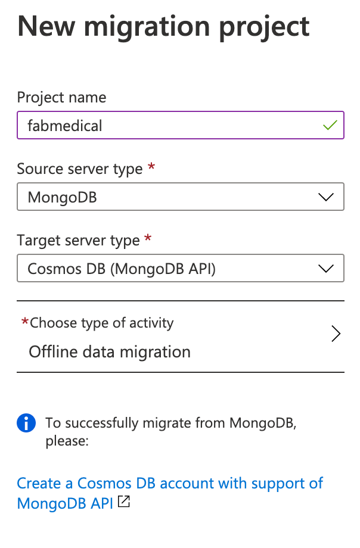

    > **Note:** The **Offline data migration** activity type is selected since you will be performing a one-time migration from MongoDB to Cosmos DB. Also, the data in the database won't be updated during the migration. In a production scenario, you will want to choose the migration project activity type that best fits your solution requirements.

4. On the **MongoDB to Azure Database for CosmosDB Offline Migration Wizard** pane, enter the following values for the **Select source** tab:

    - Mode: **Standard mode**
    - Source server name: Enter the Private IP Address of the Build Agent VM used in this lab.
    - Server port: `27017`
    - Require SSL: Unchecked

    > **Note:** Leave the **User Name** and **Password** blank as the MongoDB instance on the Build Agent VM for this lab does not have authentication turned on. The Azure Database Migration Service is connected to the same VNet as the Build Agent VM, so it's able to communicate within the VNet directly to the VM without exposing the MongoDB service to the Internet. In production scenarios, you should always have authentication enabled on MongoDB.

    

5. Select **Next: Select target >>**.

6. On the **Select target** pane, select the following values:

    - Mode: **Select Cosmos DB target**

    - Subscription: Select the Azure subscription you're using for this lab.

    - Select Cosmos DB name: Select the `fabmedical-[SUFFIX]` Cosmos DB instance.

    

    Notice, the **Connection String** will automatically populate with the Key for your Azure Cosmos DB instance.

7. Modify the **Connection string** by replacing `@undefined:` with `@fabmedical-[SUFFIX].documents.azure.com:` so the DNS name matches the Azure Cosmos DB instance. Be sure to replace the `[SUFFIX]`.

    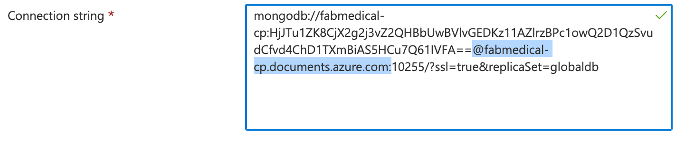

8. Select **Next: Database setting >>**.

9. On the **Database setting** tab, select the `contentdb` **Source Database** so this database from MongoDB will be migrated to Azure Cosmos DB.

    

10. Select **Next: Collection setting >>**.

11. On the **Collection setting** tab, expand the **contentdb** database, and ensure both the **sessions** and **speakers** collections are selected for migration. Also, update the **Throughput (RU/s)** to `400` for both collections.

    

12. Select **Next: Migration summary >>**.

13. On the **Migration summary** tab, enter `Migrate Data` in the **Activity name** field, then select **Start migration** to initiate the migration of the MongoDB data to Azure Cosmos DB.

    

14. The status for the migration activity will be shown. The migration will only take a few seconds to complete. Select **Refresh** to reload the status to ensure it shows a **Status** of **Complete**.

     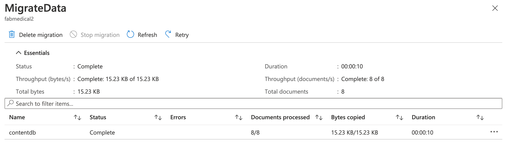

15. To verify the data was migrated, navigate to the **Cosmos DB Account** for the lab within the Azure Portal, then select the **Data Explorer**. You will see the `speakers` and `sessions` collections listed within the `contentdb` database, and you will be able to explore the documents within.

    

## Exercise 3: Deploy the solution to Azure Kubernetes Service

**Duration**: 30 minutes

In this exercise, you will connect to the Azure Kubernetes Service cluster you created before the hands-on lab and deploy the Docker application to the cluster using Kubernetes.

### Task 1: Tunnel into the Azure Kubernetes Service cluster

In this task, you will gather the information you need about your Azure Kubernetes Service cluster to connect to the cluster and execute commands to connect to the Kubernetes management dashboard from cloud shell.

> **Note**: The following tasks should be executed in cloud shell and not the build machine, so disconnect from build machine if still connected.

1. Verify that you are connected to the correct subscription with the following command to show your default subscription:

   ```bash
   az account show
   ```

   - If you are not connected to the correct subscription, list your subscriptions and then set the subscription by its id with the following commands (similar to what you did in cloud shell before the lab):

   ```bash
   az account list
   az account set --subscription {id}
   ```

2. Configure kubectl to connect to the Kubernetes cluster:

   ```bash
   az aks get-credentials -a --name fabmedical-SUFFIX --resource-group fabmedical-SUFFIX
   ```

3. Test that the configuration is correct by running a simple kubectl command to produce a list of nodes:

   ```bash
   kubectl get nodes
   ```

   

4. Since the AKS cluster uses RBAC, a `ClusterRoleBinding` must be created before you can correctly access the dashboard. To create the required binding, execute the command below:

   ```bash
   kubectl create clusterrolebinding kubernetes-dashboard --clusterrole=cluster-admin --serviceaccount=kube-system:kubernetes-dashboard
   ```

   > **Note**: If you get an error saying `error: failed to create clusterrolebinding: clusterrolebindings.rbac.authorization.k8s.io "kubernetes-dashboard" already exists` just ignore it and move on to the next step.

5. Before you can create an SSH tunnel and connect to the Kubernetes Dashboard, you will need to download the **Kubeconfig** file within Azure Cloud Shell that contains the credentials you will need to authenticate to the Kubernetes Dashboard.

    Within the Azure Cloud Shell, use the following command to download the Kubeconfig file:

    ```bash
    download /home/<username>/.kube/config
    ```

    Make sure to replace the `<username>` placeholder with your name from the command-line in the Azure Cloud Shell.

    >**Note**: You can find the `<username>` from the first part of the Azure Cloud Shell command-line prompt; such as `<username>@Azure:~$`.
    >
    > You can also look in the `/home` directory and so see the directory name that exists within it to find the correct username directory where the Kubeconfig file resides:
    >
    > ```bash
    > ls /home
    > ```

6. Create an SSH tunnel linking a local port (`8001`) on your cloud shell host to port 443 on the management node of the cluster. Cloud shell will then use the web preview feature to give you remote access to the Kubernetes dashboard. Execute the command below replacing the values as follows:

   > **Note**: After you run this command, it may work at first and later lose its connection, so you may have to run this again to reestablish the connection. If the Kubernetes dashboard becomes unresponsive in the browser this is an indication to return here and check your tunnel or rerun the command.

   ```bash
   az aks browse --name fabmedical-SUFFIX --resource-group fabmedical-SUFFIX
   ```

   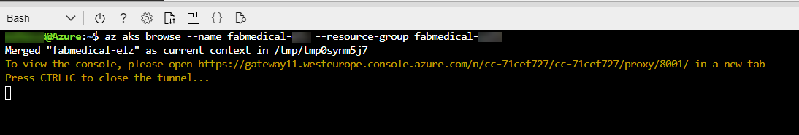

7. If the tunnel is successful, you will see the Kubernetes Dashboard authentication screen. Select the **Kubeconfig** option, select the ellipsis (`...`) button, select the **Kubeconfig** file that was previously downloaded, then select **Sign in**.

   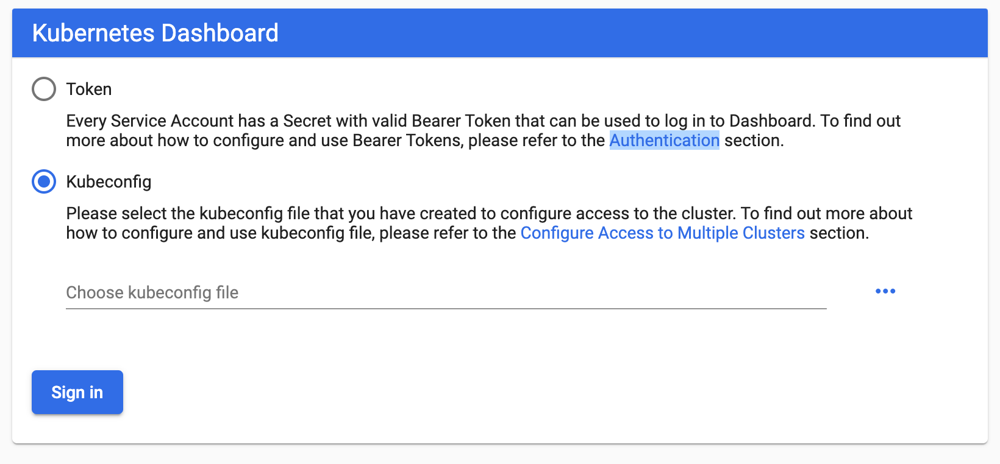

8. Once authenticated, you will see the Kubernetes management dashboard.

    

   > **Note**: If the tunnel is not successful (if a JSON output is displayed), execute the command below and then return to task 5 above:
   >
   > ```bash
   > az extension add --name aks-preview
   > ```

### Task 2: Deploy a service using the Kubernetes management dashboard

In this task, you will deploy the API application to the Azure Kubernetes Service cluster using the Kubernetes dashboard.

1. From the Kubernetes dashboard, select **Create** in the top right corner.

2. From the Resource creation view, select **Create from form**.

   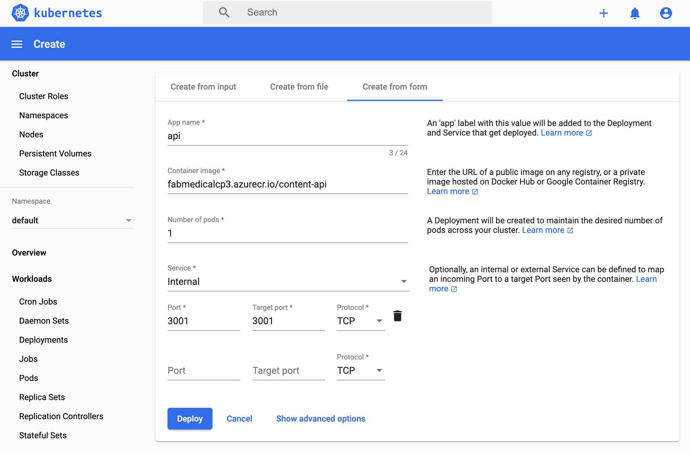

   - Enter `api` for the App name.

   - Enter `[LOGINSERVER]/content-api` for the Container Image, replacing `[LOGINSERVER]` with your ACR login server, such as `fabmedicalsol.azurecr.io`.

   - Set Number of pods to `1`.

   - Set Service to `Internal`.

   - Use `3001` for Port and `3001` for Target port.

3. Select **SHOW ADVANCED OPTIONS**

   - Enter `1` for the CPU requirement (cores).

   - Enter `128` for the Memory requirement (MiB).

   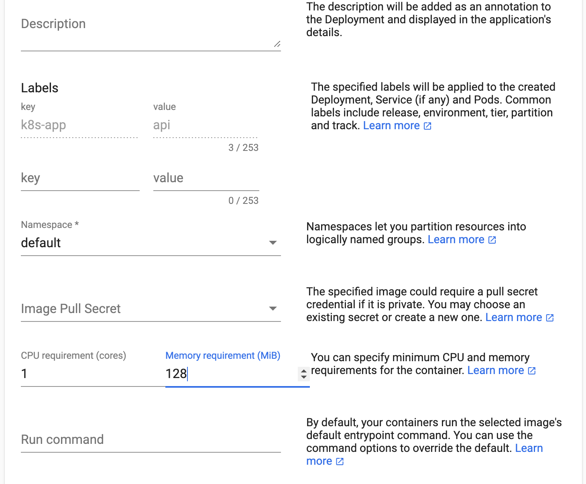

4. Select **Deploy** to initiate the service deployment based on the image. This can take a few minutes. In the meantime, you will be redirected to the Overview dashboard. Select the **API** deployment from the **Overview** dashboard to see the deployment in progress.

    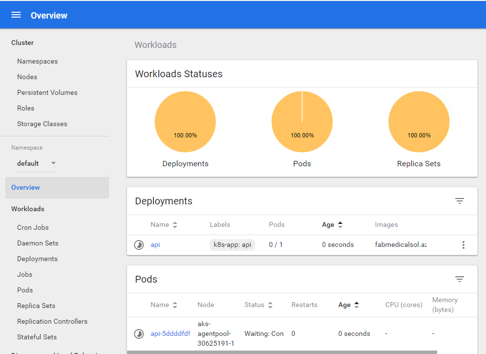

5. Kubernetes indicates a problem with the `api` **Replica Set** after some seconds. Select the ellipsis icon, then select **Logs** to investigate.

    

6. The log indicates that the content-api application is once again failing because it cannot find a mongodb api to communicate with. You will resolve this issue by connecting to Cosmos DB.

   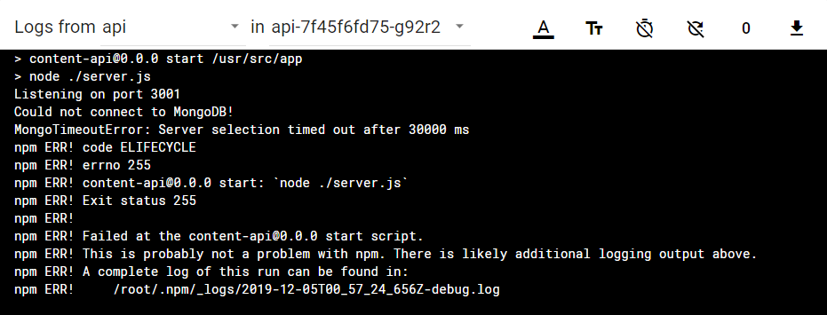

7. Open the Azure portal in your browser and navigate to your resource group and find your Cosmos DB resource. Select the Cosmos DB resource to view details.

   

8. Under **Quick Start** select the **Node.js** tab and copy the **Node.js 3.0 connection string**.

    

9. Update the provided connection string with a database `contentdb` and a replica set `globaldb`.

   > **Note**: Username and password redacted for brevity.

   ```text
   mongodb://<USERNAME>:<PASSWORD>@fabmedical-<SUFFIX>.documents.azure.com:10255/contentdb?ssl=true&replicaSet=globaldb
   ```

10. To avoid disconnecting from the Kubernetes dashboard, open a **new** Azure Cloud Shell console.

     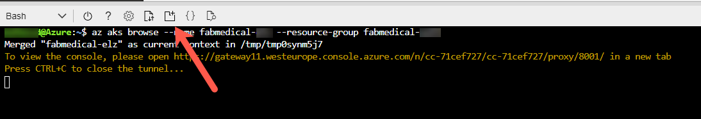

11. You will setup a Kubernetes secret to store the connection string and configure the `content-api` application to access the secret. First, you must base64 encode the secret value. Open your Azure Cloud Shell window and use the following command to encode the connection string and then, copy the output.

    > **Note**: Double quote marks surrounding the connection string are required to successfully produce the required output.

    ```bash
    echo -n "[CONNECTION STRING VALUE]" | base64 -w 0 - | echo $(</dev/stdin)
    ```

    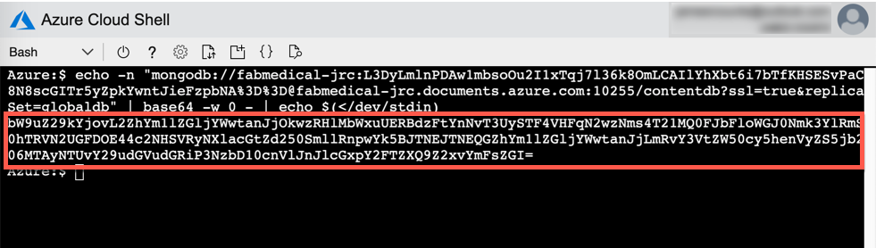

12. Return to the Kubernetes UI in your browser and select **+ Create**.

13. In the **Create from input** tab, update the following YAML with the encoded connection string from your clipboard, paste the YAML data into the create dialog, and choose **Upload**.

    ```yaml
    apiVersion: v1
    kind: Secret
    metadata:
      name: cosmosdb
    type: Opaque
    data:
      db: <base64 encoded value>
    ```

    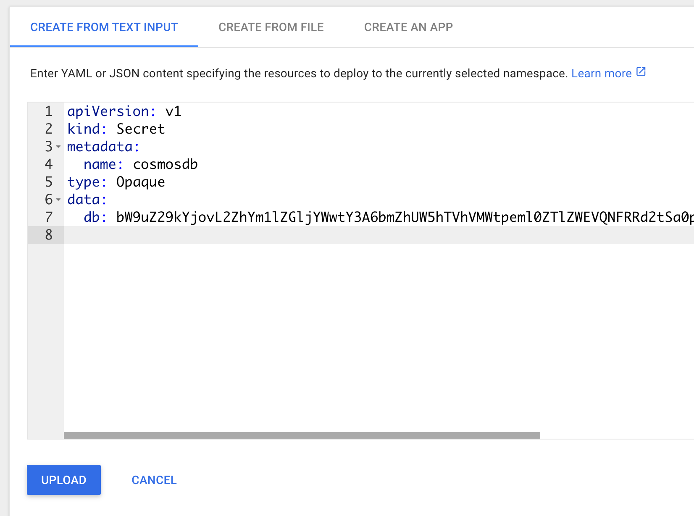

14. Scroll down in the Kubernetes dashboard until you can see **Secrets** in the left-hand menu. Select it.

    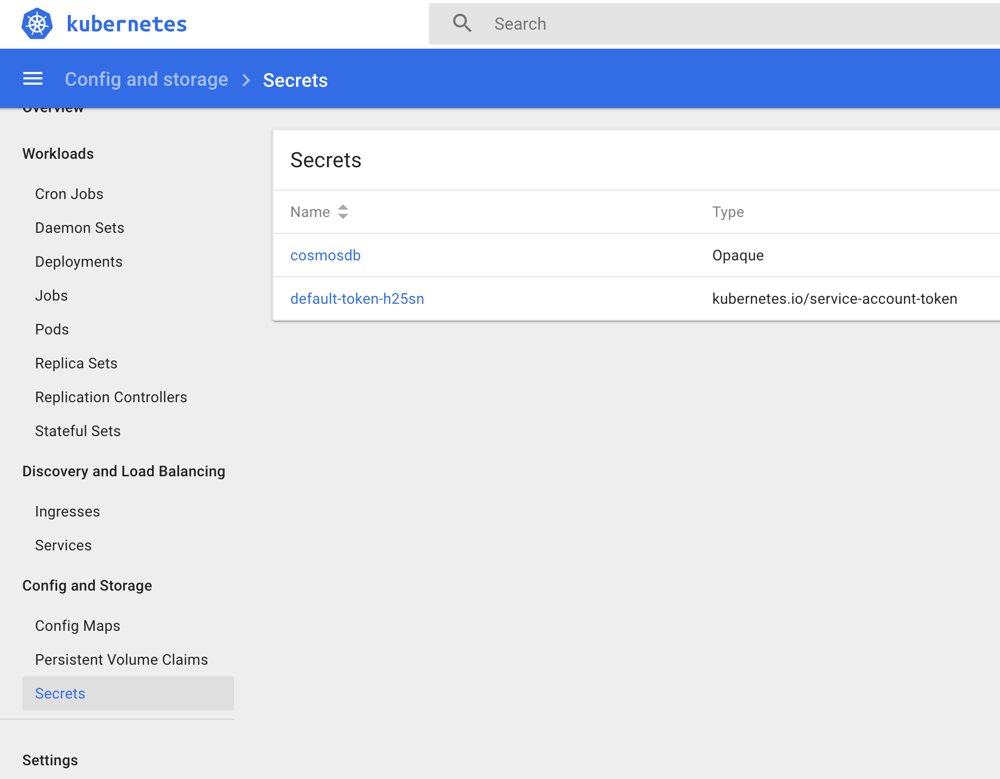

15. View the details for the **cosmosdb** secret. Select the eyeball icon to show the secret.

    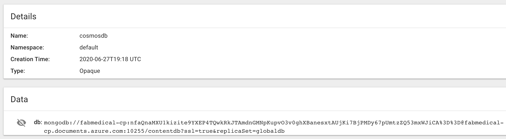

16. Next, download the api deployment configuration using the following command in your Azure Cloud Shell window:

    ```bash
    kubectl get -o=yaml deployment api > api.deployment.yml
    ```

17. Edit the downloaded file using cloud shell code editor:

    ```bash
    code api.deployment.yml
    ```

    Add the following environment configuration to the container spec, below the `image` property:

    ```yaml
      env:
      - name: MONGODB_CONNECTION
        valueFrom:
          secretKeyRef:
            name: cosmosdb
            key: db
    ```

    

18. Save your changes and close the editor.

    

19. Update the api deployment by using `kubectl` to apply the new configuration.

    ```bash
    kubectl apply -f api.deployment.yml
    ```

    >**Note**: If you receive an error like `Operation cannot be fulfilled on deployment.apps "api"` then delete the deployment and recreate it using the modified `api.deployment.yml` file.

      ```bash
      kubectl delete deployment api
      kubectl create -f api.deployment.yml
      ```

20. Select **Deployments** then **api** to view the api deployment. It now has a healthy instance and the logs indicate it has connected to mongodb.

    

### Task 3: Deploy a service using kubectl

In this task, deploy the web service using `kubectl`.

1. Open a **new** Azure Cloud Shell console.

2. Create a text file called `web.deployment.yml` using the Azure Cloud Shell
   Editor.

   ```bash
   code web.deployment.yml
   ```

3. Copy and paste the following text into the editor:

   > **Note**: Be sure to copy and paste only the contents of the code block carefully to avoid introducing any special characters.

   ```yaml
   apiVersion: apps/v1
   kind: Deployment
   metadata:
     labels:
         app: web
     name: web
   spec:
     replicas: 1
     selector:
         matchLabels:
           app: web
     strategy:
         rollingUpdate:
           maxSurge: 1
           maxUnavailable: 1
         type: RollingUpdate
     template:
         metadata:
           labels:
               app: web
           name: web
         spec:
           containers:
           - image: [LOGINSERVER].azurecr.io/content-web
             env:
               - name: CONTENT_API_URL
                 value: http://api:3001
             livenessProbe:
               httpGet:
                   path: /
                   port: 3000
               initialDelaySeconds: 30
               periodSeconds: 20
               timeoutSeconds: 10
               failureThreshold: 3
             imagePullPolicy: Always
             name: web
             ports:
               - containerPort: 3000
                 hostPort: 80
                 protocol: TCP
             resources:
               requests:
                   cpu: 1000m
                   memory: 128Mi
             securityContext:
               privileged: false
             terminationMessagePath: /dev/termination-log
             terminationMessagePolicy: File
           dnsPolicy: ClusterFirst
           restartPolicy: Always
           schedulerName: default-scheduler
           securityContext: {}
           terminationGracePeriodSeconds: 30
   ```

4. Update the `[LOGINSERVER]` entry to match the name of your ACR Login Server.

5. Select the **...** button and choose **Save**.

   

6. Select the **...** button again and choose **Close Editor**.

   

7. Create a text file called `web.service.yml` using the Azure Cloud Shell
   Editor.

   ```bash
   code web.service.yml
   ```

8. Copy and paste the following text into the editor:

   > **Note**: Be sure to copy and paste only the contents of the code block carefully to avoid introducing any special characters.

   ```yaml
   apiVersion: v1
   kind: Service
   metadata:
     labels:
       app: web
     name: web
   spec:
     ports:
       - name: web-traffic
         port: 80
         protocol: TCP
         targetPort: 3000
     selector:
       app: web
     sessionAffinity: None
     type: LoadBalancer
   ```

9. Save changes and close the editor.

10. Type the following command to deploy the application described by the YAML files. You will receive a message indicating the items kubectl has created a web deployment and a web service.

    ```bash
    kubectl create --save-config=true -f web.deployment.yml -f web.service.yml
    ```

    

11. Return to the browser where you have the Kubernetes management dashboard open. From the navigation menu, under **Discovery and Load Balancing**, select the **Services** view.

12. From the Services view, select the `web` service, and from this view, you will see the web service deploying. This deployment can take a few minutes.

13. When it completes, navigate to the main services link, you should be able to access the website via an external endpoint.

    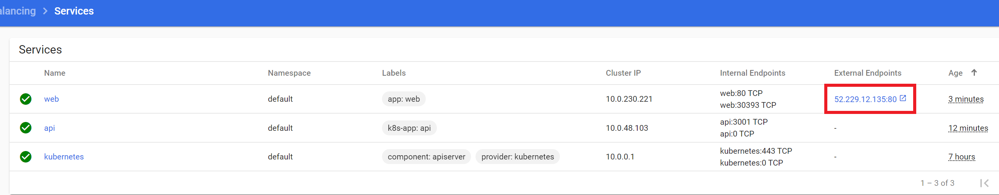

14. In the top navigation, select the `speakers` and `sessions` links.

    

### Task 4: Deploy a service using a Helm chart

In this task, you will deploy the web service using a [Helm](https://helm.sh/) chart to streamline the installing and managing the container-based application on the Azure Kubernetes cluster.

You will configure a Helm Chart that will be used to deploy and configure the **content-web** container image to Kubernetes. This is a technique that can be used to more easily deploy and manage the application on the Azure Kubernetes Cluster.

1. From the Kubernetes dashboard, under **Workloads**, select **Deployments**.

2. Select the triple vertical dots on the right of the `web` deployment and then choose **Delete**. When prompted, select **Delete** again.

   

3. From the Kubernetes dashboard, under **Discovery and Load Balancing**, select **Services**.

4. Select the triple vertical dots on the right of the **web** service and then choose **Delete**. When prompted, select **Delete** again.

   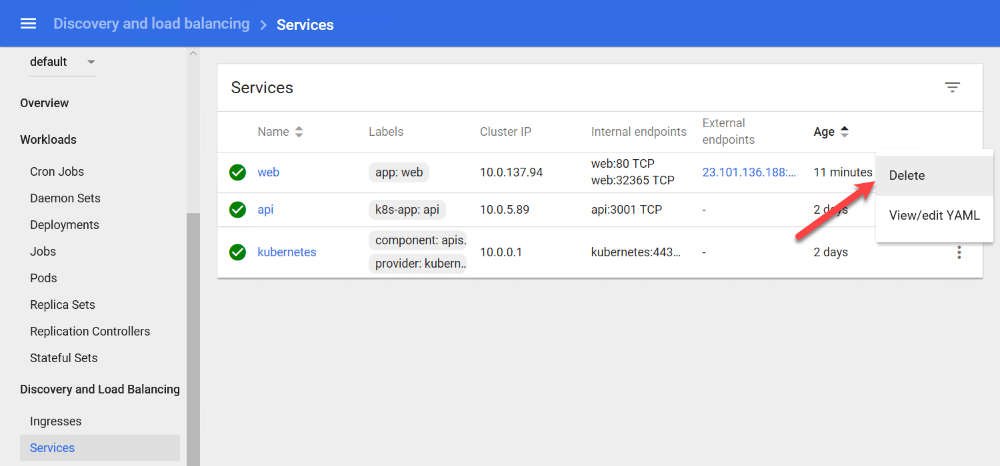

5. Open a **new** Azure Cloud Shell console.

6. Update your starter files by pulling the latest changes from the Git repository:

   ```bash
    cd ~/MCW-Cloud-native-applications/Hands-on\ lab/lab-files/infrastructure/content-web
    git pull
   ```

7. We will use the chart scaffold implementation that we have available in the source code. Use the following commands to access the chart folder:

    ```bash
    cd ~/MCW-Cloud-native-applications/Hands-on\ lab/lab-files/infrastructure/content-web/charts
    ```

8. We now need to update the generated scaffold to match our requirements. We will first update the file named `values.yaml`.

    ```bash
    cd web
    code values.yaml
    ```

9. Search for the `image` definition and update the values so that they match the following:

    ```yaml
    image:
      repository: [LOGINSERVER].azurecr.io/content-web
      pullPolicy: Always
    ```

10. Search for `nameOverride` and `fullnameOverride` entries and update the values so that they match the following:

    ```yaml
    nameOverride: "web"
    fullnameOverride: "web"
    ```

11. Search for the `service` definition and update the values so that they match the following:

    ```yaml
    service:
      type: LoadBalancer
      port: 80
    ```

12. Search for the `resources` definition and update the values so that they match the following. You are removing the curly braces and adding the `requests`:

    ```yaml
    resources:
      # We usually recommend not to specify default resources and to leave this as a conscious
      # choice for the user. This also increases chances charts run on environments with little
      # resources, such as Minikube. If you do want to specify resources, uncomment the following
      # lines, adjust them as necessary, and remove the curly braces after 'resources:'.
      # limits:
      #  cpu: 100m
      #  memory: 128Mi
      requests:
        cpu: 1000m
        memory: 128Mi
    ```

13. Save changes and close the editor.

14. We will now update the file named `Chart.yaml`.

    ```bash
    code Chart.yaml
    ```

15. Search for the `appVersion` entry and update the value so that it matches the following:

    ```yaml
    appVersion: latest
    ```

16. We will now update the file named `deployment.yaml`.

    ```bash
    cd templates
    code deployment.yaml
    ```

17. Search for the `metadata` definition and update the values so that they match the following. You are replacing the line under annotations:

    ```yaml
    apiVersion: apps/v1
    kind: Deployment
    metadata:
      (...)
    spec:
      (...)
      template:
        metadata:
          (...)
          annotations:
            rollme: {{ randAlphaNum 5 | quote }}
    ```

18. Search for the `containers` definition and update the values so that they match the following. You are changing the `containerPort`, `livenessProbe` port and adding the `env` variable:

    ```yaml
    containers:
      - name: {{ .Chart.Name }}
        securityContext:
          {{- toYaml .Values.securityContext | nindent 12 }}
        image: "{{ .Values.image.repository }}:{{ .Chart.AppVersion }}"
        imagePullPolicy: {{ .Values.image.pullPolicy }}
        ports:
          - name: http
            containerPort: 3000
            protocol: TCP
        env:
          - name: CONTENT_API_URL
            value: http://api:3001
        livenessProbe:
          httpGet:
            path: /
            port: 3000
    ```

19. Save changes and close the editor.

20. We will now update the file named `service.yaml`.

    ```bash
    code service.yaml
    ```

21. Search for the `ports` definition and update the values so that they match the following:

    ```yaml
    ports:
      - port: {{ .Values.service.port }}
        targetPort: 3000
        protocol: TCP
        name: http
    ```

22. Save changes and close the editor.

23. The chart is now setup to run our web container. Type the following command to deploy the application described by the YAML files. You will receive a message indicating that helm has created a web deployment and a web service.

    ```bash
    cd ../..
    helm install web ./web
    ```

    

24. Return to the browser where you have the Kubernetes management dashboard open. From the navigation menu, select **Services** view under **Discovery and Load Balancing**. From the Services view, select the **web** service, and from this view, you will see the web service deploying. This deployment can take a few minutes. When it completes, you should be able to access the website via an external endpoint.

    

25. Select the speakers and sessions links.

    

26. We will now persist the changes into the repository. Execute the following commands:

    ```bash
    cd ..
    git pull
    git add charts/
    git commit -m "Helm chart update."
    git push
    ```

### Task 5: Test the application in a browser

In this task, you will verify that you can browse to the web service you have deployed and view the speaker and content information exposed by the API service.

1. From the Kubernetes management dashboard, in the navigation menu, select the **Services** view under **Discovery and Load Balancing**.

2. In the list of services, locate the external endpoint for the `web` service and select this hyperlink to launch the application.

   

3. You will see the `web` application in your browser and be able to select the Speakers and Sessions links to view those pages without errors. The lack of errors means that the web application is correctly calling the API service to show the details on each of those pages.

   

   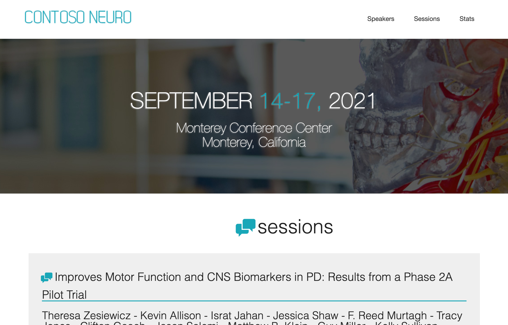

### Task 6: Configure Continuous Delivery to the Kubernetes Cluster

In this task, you will use GitHub Actions workflows to automate the process for deploying the web image to the AKS cluster. You will update the workflow and configure a job so that when new images are pushed to the ACR, the pipeline deploys the image to the AKS cluster.

1. Navigate to the `.github/workflows` folder of the git repository, and open the `content-web.yml` workflow using `vi`:

    ```bash
    cd ~/MCW-Cloud-native-applications/Hands-on\ lab/lab-files/infrastructure/.github/workflows
    vi content-web.yml
    ```

2. You will add a second job to the bottom of the `content-web.yml` workflow. Paste the following at the end of the file:

    > **Note**: Be careful to check your indenting when pasting. The `build-and-push-helm-chart` node should be indented with 2 spaces and line up with the node for the `build-and-publish-docker-image` job.

    ```yaml
      build-and-push-helm-chart:
        name: Build and Push Helm Chart
        runs-on: ubuntu-latest
        needs: [build-and-publish-docker-image]
        steps:
        # Checkout the repo
        - uses: actions/checkout@master

        - name: Helm Install
          uses: azure/setup-helm@v1

        - name: Helm Repo Add
          run: |
            helm repo add ${{ env.containerRegistryName }} https://${{ env.containerRegistry }}/helm/v1/repo --username ${{ secrets.ACR_USERNAME }} --password ${{ secrets.ACR_PASSWORD }}
          env:
            HELM_EXPERIMENTAL_OCI: 1

        - name: Helm Chart Save
          run: |
            cd ./content-web/charts/web

            helm chart save . content-web:v${{ env.tag }}
            helm chart save . ${{ env.containerRegistry }}/helm/content-web:v${{ env.tag }}

            # list out saved charts
            helm chart list
          env:
            HELM_EXPERIMENTAL_OCI: 1

        - name: Helm Chart Push
          run: |
            helm registry login ${{ env.containerRegistry }} --username ${{ secrets.ACR_USERNAME }} --password ${{ secrets.ACR_PASSWORD }}
            helm chart push ${{ env.containerRegistry }}/helm/content-web:v${{ env.tag }}
          env:
            HELM_EXPERIMENTAL_OCI: 1
    ```

3. Save the file.

4. In the Azure Cloud Shell, use the following command to output the `/.kube/config` file that contains the credentials for authenticating with Azure Kubernetes Service. These credentials were retrieved previously and will also be needed by GitHub Actions to deploy to AKS. Then copy the contents of the file.

    ```bash
    cat ~/.kube/config
    ```

5. In GitHub, return to the **Fabmedical** repository screen, select the **Settings** tab, select **Secrets** from the left menu, then select the **New secret** button.

6. Create a new GitHub Secret with the Name of `KUBECONFIG` and paste in the contents of the `~/.kube/config` file that was previously copied.

     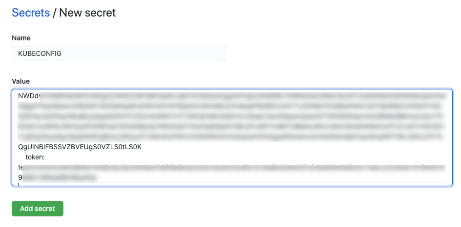

7. Now return to edit the `content-web.yml` workflow and paste the following at the end of the file.

    > **Note**: Be careful to check your indenting when pasting. The `aks-deployment` node should be indented with 2 spaces and line up with the node for the `build-and-push-helm-chart` job.

    ```yaml
      aks-deployment:
        name: AKS Deployment
        runs-on: ubuntu-latest
        needs: [build-and-publish-docker-image,build-and-push-helm-chart]
        steps:
        # Checkout the repo
        - uses: actions/checkout@master

        - name: Helm Install
          uses: azure/setup-helm@v1

        - name: kubeconfig
          run: echo "${{ secrets.KUBECONFIG }}" >> kubeconfig

        - name: Helm Repo Add
          run: |
            helm repo add ${{ env.containerRegistry }} https://${{ env.containerRegistry }}/helm/v1/repo --username ${{ secrets.ACR_USERNAME }} --password ${{ secrets.ACR_PASSWORD }}
            helm repo update
          env:
            HELM_EXPERIMENTAL_OCI: 1

        - name: Helm Upgrade
          run: |
            helm registry login ${{ env.containerRegistry }} --username ${{ secrets.ACR_USERNAME }} --password ${{ secrets.ACR_PASSWORD }}
            helm chart pull ${{ env.containerRegistry }}/helm/content-web:v${{ env.tag }}
            helm chart export ${{ env.containerRegistry }}/helm/content-web:v${{ env.tag }} --destination ./upgrade
            helm upgrade web ./upgrade/web
          env:
            KUBECONFIG: './kubeconfig'
            HELM_EXPERIMENTAL_OCI: 1
    ```

8. Save the file.
 
9. Commit your changes

   ```bash
   cd ..
   git pull
   git add --all
   git commit -m "Deployment update."
   git push
   ```

10. Switch back to GitHub.

11. On the **content-web** workflow, select **Run workflow** and manually trigger the workflow to execute.

    

12. Selecting the currently running workflow will display its status.

    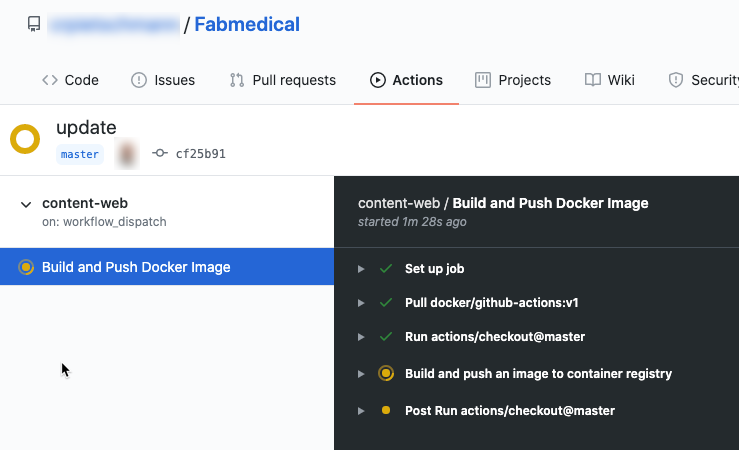

### Task 7: Review Azure Monitor for Containers

In this task, you will access and review the various logs and dashboards made available by Azure Monitor for Containers.

1. From the Azure Portal, select the resource group you created named `fabmedical-SUFFIX`, and then select your `Kubernetes Service` Azure resource.

   

2. From the Monitoring blade, select **Insights**.

   

3. Review the various available dashboards and a deeper look at the various metrics and logs available on the Cluster, Nodes, Controllers, and deployed Containers.

   

4. To review the Containers dashboards and see more detailed information about each container, select the **Containers** tab.

   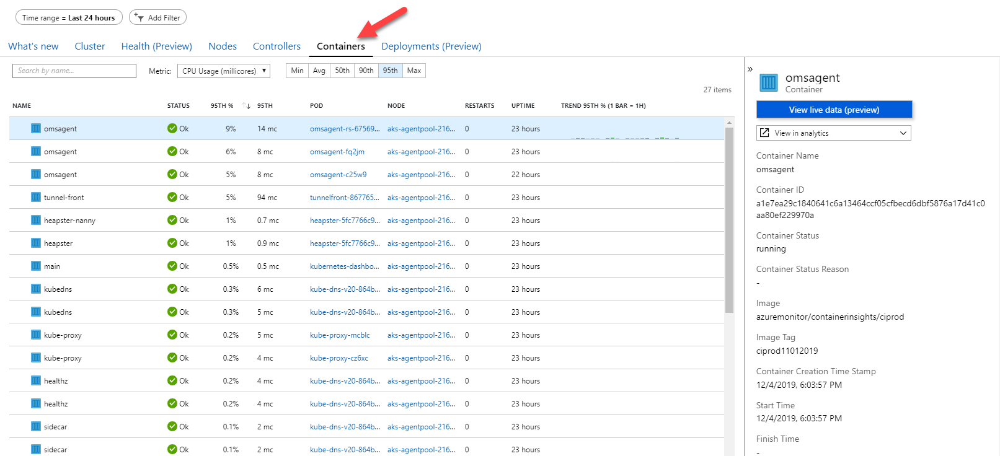

5. Now filter by container name and search for the **web** containers, you will see all the containers created in the Kubernetes cluster with the pod names. You can compare the names with those in the kubernetes dashboard.

   

6. By default, the CPU Usage metric will be selected displaying all cpu information for the selected container, to switch to another metric open the metric dropdown list and select a different metric.

   

7. Upon selecting any pod, all the information related to the selected metric will be displayed on the right panel, and that would be the case when selecting any other metric, the details will be displayed on the right panel for the selected pod.

   

8. To display the logs for any container simply select it and view the right panel and you will find "View container logs" option which will list all logs for this specific container.

   

   

9. For each log entry you can display more information by expanding the log entry to view the below details.

   

## Exercise 4: Scale the application and test HA

**Duration**: 20 minutes

At this point, you have deployed a single instance of the web and API service containers. In this exercise, you will increase the number of container instances for the web service and scale the front-end on the existing cluster.

### Task 1: Increase service instances from the Kubernetes dashboard

In this task, you will increase the number of instances for the API deployment in the Kubernetes management dashboard. While it is deploying, you will observe the changing status.

1. Switch to the Kubernetes Dashboard.

2. From the navigation menu, select **Workloads** -\> **Deployments**, and then select the **API** deployment.

3. Select the **SCALE** button in the upper-right.

   

4. Change the number of replicas to **2**, and then select **Scale**.

   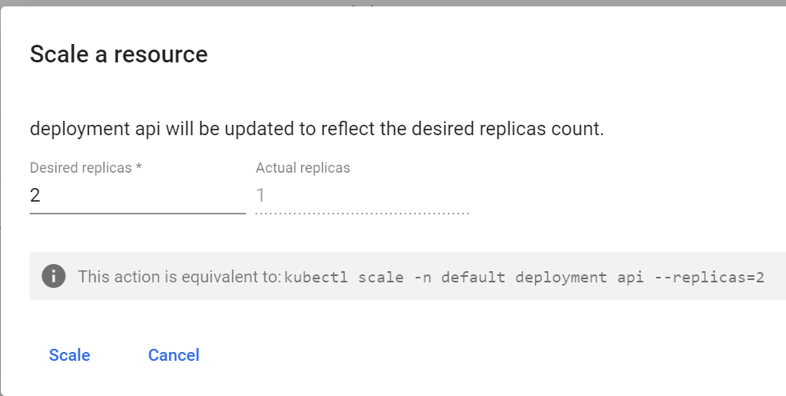

   > **Note**: If the deployment completes quickly, you may not see the deployment Waiting states in the dashboard, as described in the following steps.

5. From the Replica Set view for the API, you will see it is now deploying and that there is one healthy instance and one pending instance.

   

6. From the navigation menu, select **Deployments** from the list. Note that the api service has a pending status indicated by the grey timer icon, and it shows a pod count 1 of 2 instances (shown as `1/2`).

   

    > **Note**: If you receive an error about insufficient CPU, that is expected.

7. From the Navigation menu, select **Workloads**. From this view, note that the health overview in the right panel of this view. You will see the following:

   - One deployment and one replica set are each healthy for the api service.

   - One replica set is healthy for the web service.

   - Three pods are healthy.

8. Navigate to the web application from the browser again. The application should still work without errors as you navigate to Speakers and Sessions pages.

   - Navigate to the `/stats` page. You will see information about the environment including:

     - **webTaskId:** The task identifier for the web service instance.

     - **taskId:** The task identifier for the API service instance.

     - **hostName:** The hostname identifier for the API service instance.

     - **pid:** The process id for the API service instance.

     - **mem:** Some memory indicators returned from the API service instance.

     - **counters:** Counters for the service itself, as returned by the API service instance.

     - **uptime:** The up time for the API service.

   - Refresh the page in the browser, and you can see the hostName change between the two API service instances. The letters after `api-{number}-` in the hostname will change.

### Task 2: Increase service instances beyond available resources

In this task, you will try to increase the number of instances for the API service container beyond available resources in the cluster. You will observe how Kubernetes handles this condition and correct the problem.

1. From the navigation menu, select **Deployments**. From this view, select the **api** deployment.

2. Configure the deployment to use a fixed host port for initial testing. Select the vertical ellipses and then select **Edit**.

3. In the Edit a resource dialog, select the YAML tab. You will see a list of settings shown in YAML format. Use the copy button to copy the text to your clipboard.

   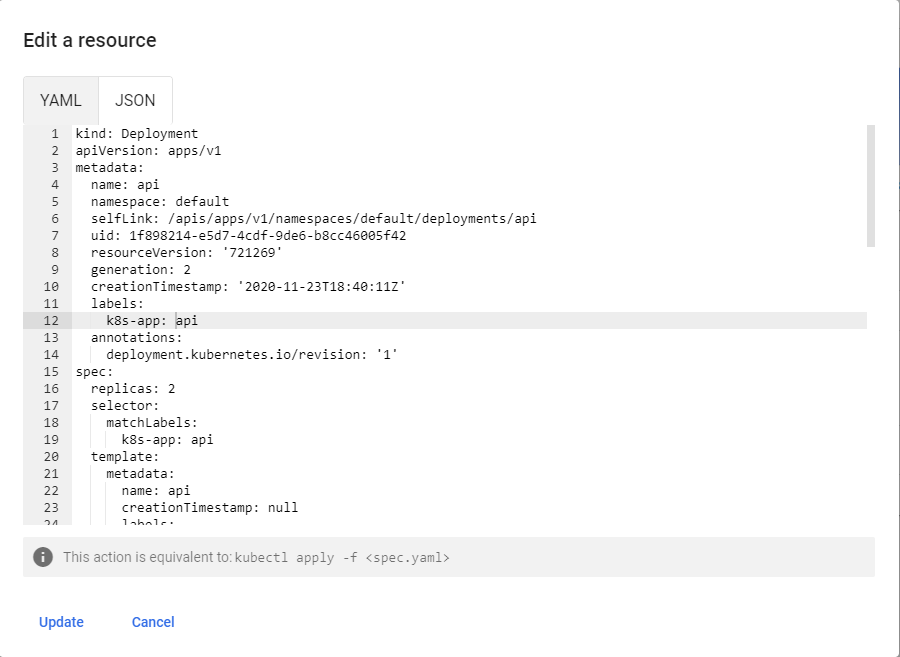

4. Paste the contents into the text editor of your choice (such as Notepad on Windows, macOS users can use TextEdit).

5. Scroll down about halfway to find the node `$.spec.template.spec.containers[0]`, as shown in the screenshot below.

    ![Screenshot of the deployment code, with the $.spec.template.spec.containers[0] section highlighted.](media/image84.png "Container deployment configuration")

6. The containers spec has a single entry for the API container at the moment. You will see that the name of the container is `api` - this is how you know you are looking at the correct container spec.

   - Add the following snippet below the `name` property in the container spec:

   ```text
     ports:
	    - containerPort: 3001
	      hostPort: 3001
   ```

   - Your container spec should now look like this:

   ![Screenshot of the deployment JSON code, with the $.spec.template.spec.containers[0] section highlighted, showing the updated values for containerPort and hostPort, both set to port 3001.](media/image85.png "View container ports")

7. Copy the updated document from notepad into the clipboard. Return to the Kubernetes dashboard, which should still be viewing the **api** deployment.

   - Paste the updated document.

   - Select Update.

   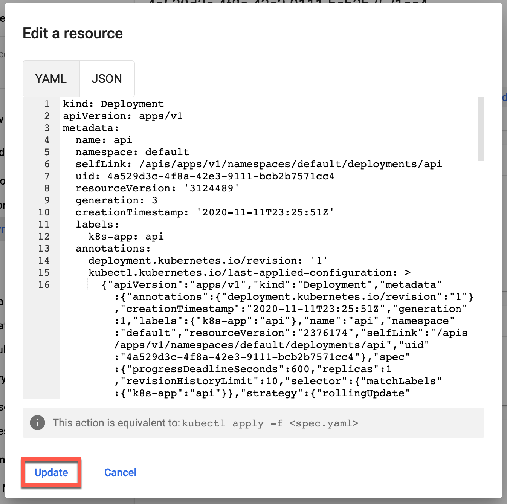

8. From the API deployment view, select **Scale**.

9. Change the number of replicas to 4 and select **Scale**.

    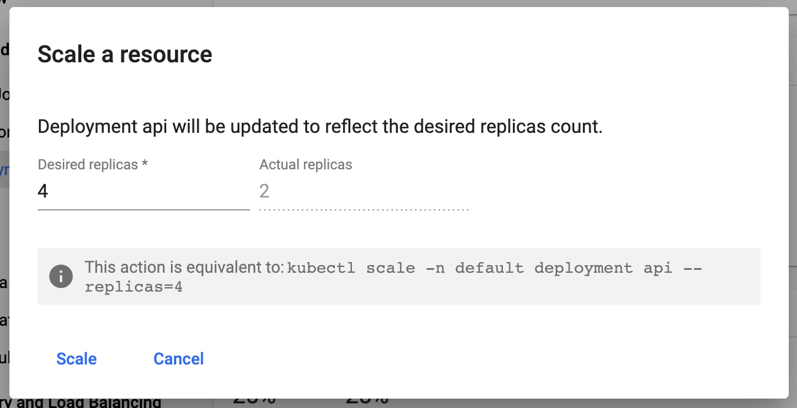

10. From the navigation menu, select **Services** view under **Discovery and Load Balancing**. Select the **api** service from the **Services** list. From the api service view, you will see it has two healthy instances and two unhealthy (or possibly pending depending on timing) instances.

    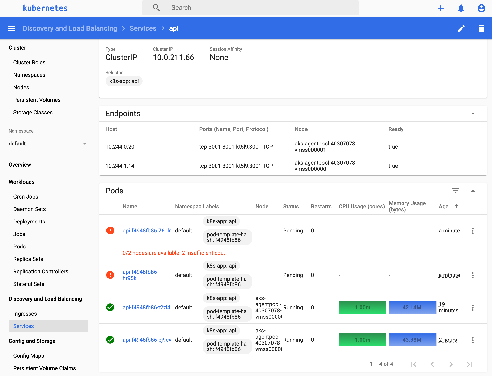

11. After a few minutes, select **Workloads** from the navigation menu. From this view, you should see an alert reported for the api deployment.

    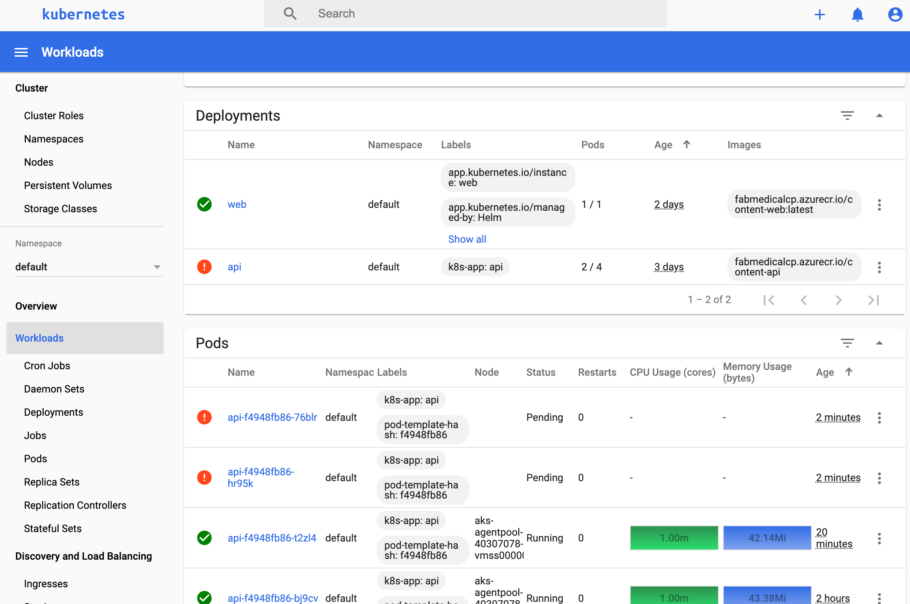

    > **Note**: This message indicates that there were not enough available resources to match the requirements for a new pod instance. In this case, this is because the instance requires port `3001`, and since there are only 2 nodes available in the cluster, only two api instances can be scheduled. The third and fourth pod instances will wait for a new node to be available that can run another instance using that port.

12. Reduce the number of requested pods to `2` using the **Scale** button.

13. Almost immediately, the warning message from the **Workloads** dashboard should disappear, and the **API** deployment will show `2/2` pods are running.

    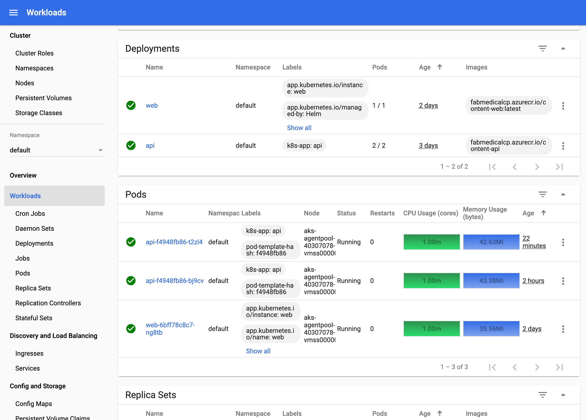

### Task 3: Restart containers and test HA

In this task, you will restart containers and validate that the restart does not impact the running service.

1. From the navigation menu on the left, select **Services** view under **Discovery and Load Balancing**. From the **Services** list, select the external endpoint hyperlink for the web service, and visit the **Stats** page by adding / stats to the URL. Keep this open and handy to be refreshed as you complete the steps that follow.

   

   

2. From the navigation menu, select **Workloads** -> **Deployments**. From Deployments list, select the **API** deployment.

   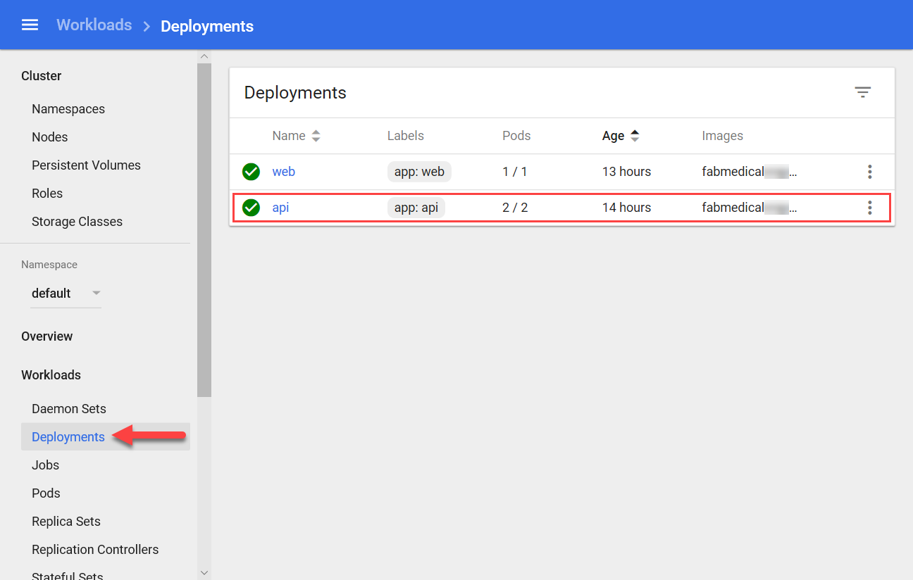

3. From the API deployment view, select **Scale** and from the dialog presented, and enter `4` for the desired number of pods. Select **OK**.

4. From the navigation menu, select **Workloads** -> **Replica Sets**. Select the **api** replica set, and from the **Replica Set** view, you will see that two pods cannot deploy.

   

5. Return to the browser tab with the web application stats page loaded. Refresh the page over and over. You will not see any errors, but you will see the api host name change between the two api pod instances periodically. The task id and pid might also change between the two api pod instances.

   

6. After refreshing enough times to see that the `hostName` value is changing, and the service remains healthy, return to the **Replica Sets** view for the API. From the navigation menu, select Replica Sets under Workloads and select the **API** replica set.

7. From this view, take note that the hostName value shown in the web application stats page matches the pod names for the pods that are running.

   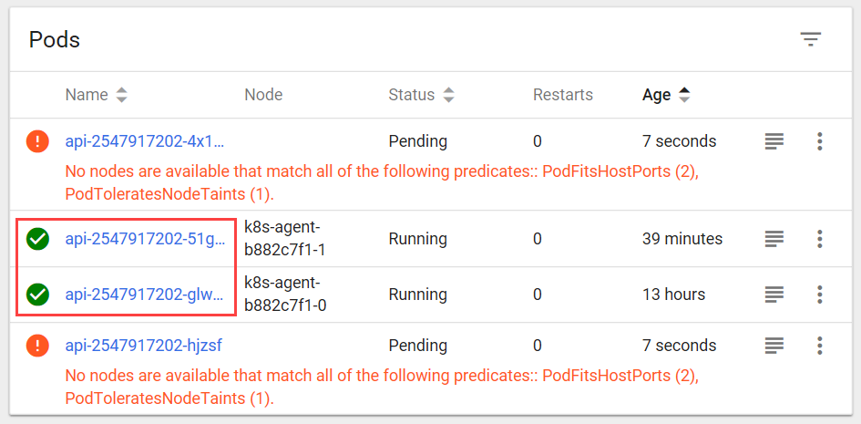

8. Note the remaining pods are still pending, since there are not enough port resources available to launch another instance. Make some room by deleting a running instance. Select the context menu and choose **Delete** for one of the healthy pods.

   

9. Once the running instance is gone, Kubernetes will be able to launch one of the pending instances. However, because you set the desired size of the deploy to 4, Kubernetes will add a new pending instance. Removing a running instance allowed a pending instance to start, but in the end, the number of pending and running instances is unchanged.

   

10. From the navigation menu, select **Deployments** under **Workloads**. From the view's Deployments list, select the **API** deployment.

11. From the API Deployment view, select Scale and enter `1` as the desired number of pods. Select **OK**.

    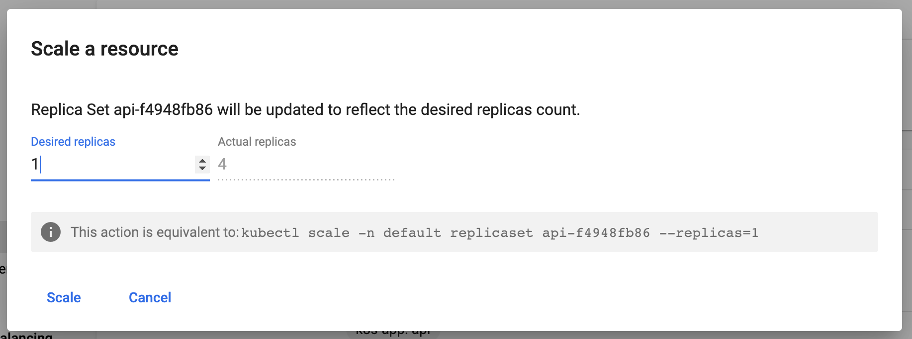

12. Return to the web site's stats page in the browser and refresh while this is scaling down. You will notice that only one API host name shows up, even though you may still see several running pods in the API replica set view. Even though several pods are running, Kubernetes will no longer send traffic to the pods it has selected to scale down. In a few moments, only one pod will show in the API replica set view.

    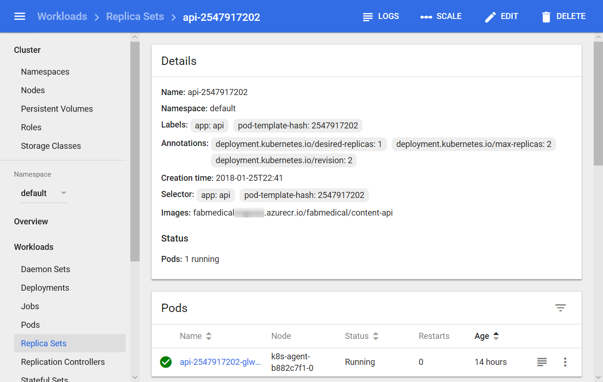

13. From the navigation menu, select **Workloads**. From this view, note that there is only one API pod now.

    

### Task 4: Configure Cosmos DB Autoscale

In this task, you will setup Autoscale on Azure Cosmos DB.

1. In the Azure Portal, navigate to the `fabmedical-[SUFFIX]` **Azure Cosmos DB Account**.

2. Select **Data Explorer**.

3. Within **Data Explorer**, expand the `contentdb` database, then expand the `sessions` collection.

4. Under the `sessions` collection, select **Scale & Settings**.

5. On the **Scale & Settings**, select **Autoscale** for the **Throughput** setting under **Scale**.

    

6. Select **Save**.

7. Perform the same task to enable **Autoscale** Throughput on the `speakers` collection.

### Task 5: Test Cosmos DB Autoscale

In this task, you will run a performance test script that will test the Autoscale feature of Azure Cosmos DB so you can see that it will now scale greater than 400 RU/s.

1. In the Azure Portal, navigate to the `fabmedical-[SUFFIX]` **Cosmos DB account**.

2. Select **Connection String** under **Settings**.

3. On the **Connection String** pane, copy the **HOST**, **USERNAME**, and **PRIMARY PASSWORD** values. Save these for use later.

   

4. Open the Azure Cloud Shell, and **SSH** to the **Build agent VM**.

5. On the **Build agent VM**, navigate to the `~/Fabmedical` directory.

    ```bash
    cd ~/Fabmedical
    ```

6. Run the following command to open the `perftest.sh` script for editing in Vim.

    ```bash
    vi perftest.sh
    ```

7. There are several variables declared at the top of the `perftest.sh` script. Modify the **host**, **username**, and **password** variables by setting their values to the corresponding Cosmos DB Connection String values that were copied previously.

    

8. Save the file and exit Vim.

9. Run the following command to execute the `perftest.sh` script to run a small load test against Cosmos DB. This script will consume RU's in Cosmos DB by inserting many documents into the Sessions container.

    ```bash
    bash ./perftest.sh
    ```

    > **Note:** The script will take a minute to complete executing.

10. Once the script has completed, navigate back to the **Cosmos DB account** in the Azure portal.

11. Scroll down on the **Overview** pane of the **Cosmos DB account** blade, and locate the **Request Charge** graph.

    > **Note:** It may take 2 - 5 minutes for the activity on the Cosmos DB collection to appear in the activity log. Wait a couple minutes and then refresh the pane if the recent Request charge doesn't show up right now.

12. Notice that the **Request charge** now shows there was activity on the **Cosmos DB account** that exceeded the 400 RU/s limit that was previously set before Autoscale was turned on.

    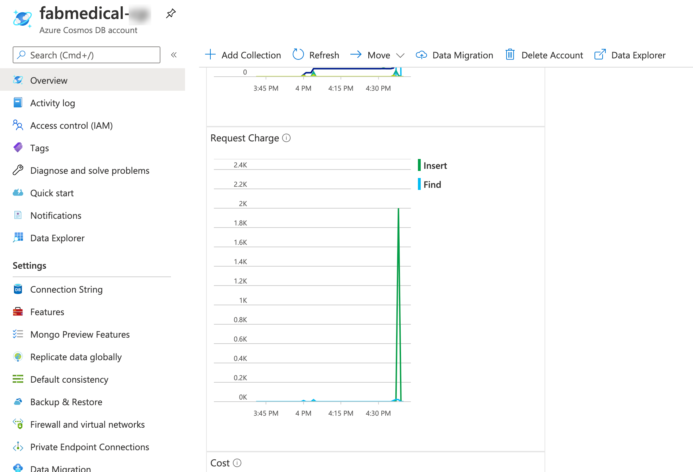

## Exercise 5: Working with services and routing application traffic

**Duration**: 1 hour

In the previous exercise, we introduced a restriction to the scale properties of the service. In this exercise, you will configure the api deployments to create pods that use dynamic port mappings to eliminate the port resource constraint during scale activities.

Kubernetes services can discover the ports assigned to each pod, allowing you to run multiple instances of the pod on the same agent node --- something that is not possible when you configure a specific static port (such as 3001 for the API service).

### Task 1: Scale a service without port constraints

In this task, we will reconfigure the API deployment so that it will produce pods that choose a dynamic hostPort for improved scalability.

1. From the navigation menu select **Deployments** under **Workloads**. From the view's Deployments list, select the **API** deployment.

2. Select **Edit**.

3. From the **Edit a Deployment** dialog, do the following:

   - Scroll to the first spec node that describes replicas as shown in the screenshot. Set the value for replicas to `4`.

   - Within the replicas spec, beneath the template node, find the **api** containers spec. Remove the `hostPort` entry for the API container's port mapping.  The screenshot below shows the desired configuration after editing.

   - Within the resources, beneath the template node, find the **cpu** under requests. Update this to `100m` so the **api** instances use less than a full CPU core.

     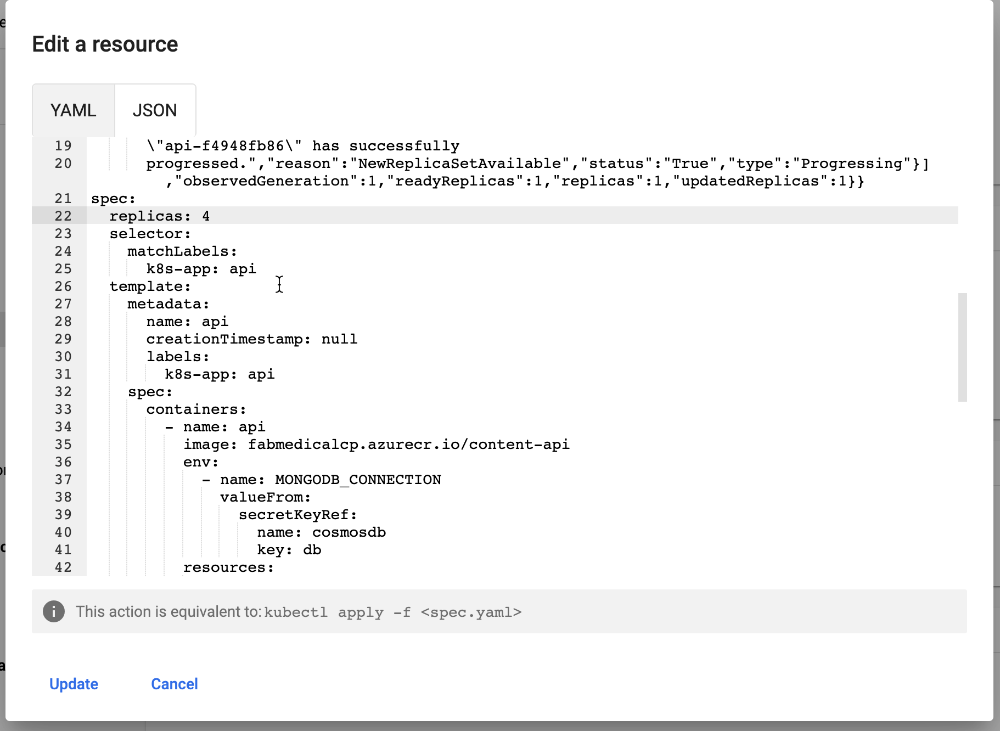

     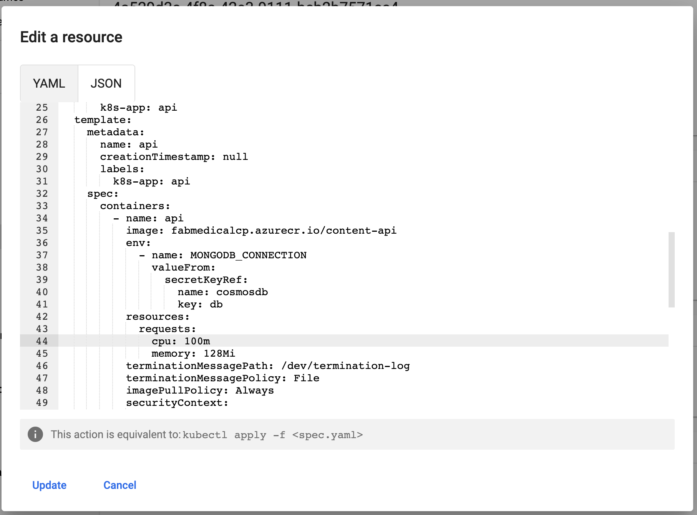

4. Select **Update**. New pods will now choose a dynamic port.

5. The API service can now scale to 4 pods since it is no longer constrained to an instance per node and a full cpu core per instance -- a previous limitation while using port `3001`.

    

6. Return to the browser and refresh the stats page. You should see all 4 pods serve responses as you refresh.

### Task 2: Update an external service to support dynamic discovery with a load balancer

In this task, you will update the web service so that it supports dynamic discovery through the Azure load balancer.

1. From the navigation menu, select **Deployments** under **Workloads**. From the view's Deployments list, select the **web** deployment.

2. Select **Edit**, then select the **JSON** tab.

3. From the dialog, scroll to the web containers spec as shown in the screenshot. Remove the hostPort entry for the web container's port mapping.

    

4. Select **Update**.

5. From the **web** Deployments view, select **Scale**. From the dialog presented enter 4 as the desired number of pods and select **OK**.

6. Check the status of the scale out by refreshing the web deployment's view. From the navigation menu, select **Pods** from under Workloads. Select the **api** pods. From this view, you should see an error like that shown in the following screenshot.

   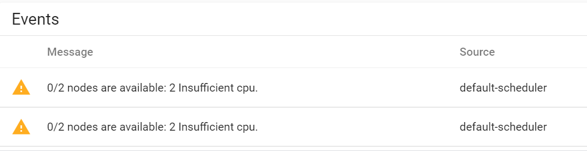

Like the API deployment, the web deployment used a fixed _hostPort_, and your ability to scale was limited by the number of available agent nodes. However, after resolving this issue for the web service by removing the _hostPort_ setting, the web deployment is still unable to scale past two pods due to CPU constraints. The deployment is requesting more CPU than the web application needs, so you will fix this constraint in the next task.

### Task 3: Adjust CPU constraints to improve scale

In this task, you will modify the CPU requirements for the web service so that it can scale out to more instances.

1. From the navigation menu, select **Deployments** under **Workloads**. From the view's Deployments list, select the **web** deployment.

2. Select the vertical ellipses, then select **Edit**.

3. From the Edit a Deployment dialog, select the **JSON** tab, then find the **cpu** resource requirements for the web container. Change this value to `125m`.

   

4. Select **Update** to save the changes and update the deployment.

5. From the navigation menu, select **Replica Sets** under **Workloads**. From the view's Replica Sets list select the web replica set.

6. When the deployment update completes, four web pods should be shown in running state.

   

7. Return to the browser tab with the web application loaded. Refresh the stats page at /stats to watch the display update to reflect the different api pods by observing the host name refresh.

### Task 4: Perform a rolling update

In this task, you will edit the web application source code to add Application Insights and update the Docker image used by the deployment. Then you will perform a rolling update to demonstrate how to deploy a code change.

1. Execute this command in Azure Cloud Shell to retrieve the instrumentation key for the `content-web` Application Insights resource:

   ```bash
   az resource show -g fabmedical-[SUFFIX] -n content-web --resource-type "Microsoft.Insights/components" --query properties.InstrumentationKey -o tsv
   ```

   Copy this value. You will use it later.

2. Update your starter files by pulling the latest changes from the Git repository:

   ```bash
   cd ~/MCW-Cloud-native-applications/Hands-on\ lab/lab-files/infrastructure/content-web
   git pull
   ```

3. Install support for Application Insights.

   ```bash
   npm install applicationinsights --save
   ```

4. Open the `app.js` file:

   ```bash
   code app.js
   ```

5. Add the following lines immediately after `express` is instantiated on line 6:

   ```javascript
   const appInsights = require("applicationinsights");
   appInsights.setup("[YOUR APPINSIGHTS KEY]");
   appInsights.start();
   ```

   

6. Save changes and close the editor.

7. Push these changes to your repository so that GitHub Actions CI will build and deploy a new image.

   ```bash
   git add .
   git commit -m "Added Application Insights"
   git push
   ```

8. Visit the `content-web` workflow for your GitHub repository and see the new image being deployed into your Kubernetes cluster.

9. While this update runs, return the Kubernetes management dashboard in the browser.

10. From the navigation menu, select **Replica Sets** under **Workloads**. From this view, you will see a new replica set for the web, which may still be in the process of deploying (as shown below) or already fully deployed.

    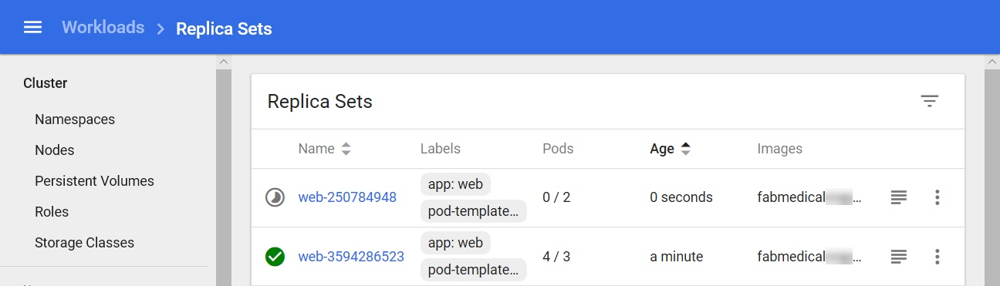

11. While the deployment is in progress, you can navigate to the web application and visit the stats page at `/stats`. Refresh the page as the rolling update executes. Observe that the service is running normally, and tasks continue to be load balanced.

    

### Task 5: Configure Kubernetes Ingress

In this task you will setup a Kubernetes Ingress to take advantage of path-based routing and TLS termination.

1. Within the Azure Cloud Shell, run the following command to add the Nginx stable Helm repository:

    ```bash
    helm repo add nginx-stable https://helm.nginx.com/stable
    ```

2. Update your helm package list.

   ```bash
   helm repo update
   ```

   > **Note**: If you get a "no repositories found." error, then run the following command. This will add back the official Helm "stable" repository.
   > ```
   > helm repo add stable https://charts.helm.sh/stable 
   > ```

3. Install the ingress controller resource to handle ingress requests as they come in. The ingress controller will receive a public IP of its own on the Azure Load Balancer and be able to handle requests for multiple services over port 80 and 443.

   ```bash
   helm install nginx-stable/nginx-ingress --namespace kube-system --set controller.replicaCount=2 --generate-name
   ```

4. From the Kubernetes dashboard, ensure the Namespace filter is set to **All namespaces**

5. Under **Discovery and Load Balancing**, select **Services**, then copy the IP Address for the **External endpoints** for the `nginx-ingress-RANDOM-controller` service.

   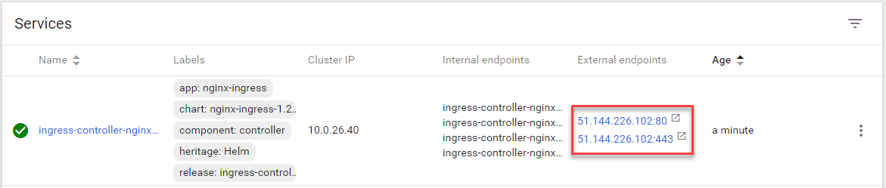

    > **Note**: It could take a few minutes to refresh, alternately, you can find the IP using the following command in Azure Cloud Shell.
    >
    > ```bash
    > kubectl get svc --namespace kube-system
    > ```
    >
   

6. Within the Azure Cloud Shell, create a script to update the public DNS name for the IP.

   ```bash
   code update-ip.sh
   ```

   Paste the following as the contents and update the IP and SUFFIX values:

   ```bash
   #!/bin/bash

   # Public IP address
   IP="[INGRESS PUBLIC IP]"

   # Name to associate with public IP address
   DNSNAME="fabmedical-[SUFFIX]-ingress"

   # Get the resource-id of the public ip
   PUBLICIPID=$(az network public-ip list --query "[?ipAddress!=null]|[?contains(ipAddress, '$IP')].[id]" --output tsv)

   # Update public ip address with dns name
   az network public-ip update --ids $PUBLICIPID --dns-name $DNSNAME
   ```

   

   Be sure to replace the following placeholders in the script:

   - `[INGRESS PUBLIC IP]`: Replace this with the IP Address copied previously.
   - `[SUFFIX]`: Replace this with the same SUFFIX value used previously for this lab.

7. Save changes and close the editor.

8. Run the update script.

   ```bash
   bash ./update-ip.sh
   ```

9. Verify the IP update by visiting the URL in your browser.

   > **Note**: It is normal to receive a 404 message at this time.

   ```text
   http://fabmedical-[SUFFIX]-ingress.[AZURE-REGION].cloudapp.azure.com/
   ```

   

10. Use helm to install `cert-manager`, a tool that can provision SSL certificates automatically from letsencrypt.org.

    ```bash
    kubectl create namespace cert-manager

    kubectl label namespace cert-manager cert-manager.io/disable-validation=true

    kubectl apply --validate=false -f https://github.com/jetstack/cert-manager/releases/download/v1.0.1/cert-manager.yaml
    ```

11. Cert manager will need a custom ClusterIssuer resource to handle requesting SSL certificates.

    ```bash
    code clusterissuer.yml
    ```

    The following resource configuration should work as is:

    ```yaml
    apiVersion: cert-manager.io/v1
    kind: ClusterIssuer
    metadata:
      name: letsencrypt-prod
    spec:
      acme:
        # The ACME server URL
        server: https://acme-v02.api.letsencrypt.org/directory
        # Email address used for ACME registration
        email: user@fabmedical.com
        # Name of a secret used to store the ACME account private key
        privateKeySecretRef:
          name: letsencrypt-prod
        # Enable HTTP01 validations
        solvers:
        - http01:
            ingress:
              class: nginx
    ```

12. Save changes and close the editor.

13. Create the issuer using `kubectl`.

    ```bash
    kubectl create --save-config=true -f clusterissuer.yml
    ```

14. Now you can create a certificate object.

    > **Note**:
    >
    > Cert-manager might have already created a certificate object for you using ingress-shim.
    >
    > To verify that the certificate was created successfully, use the `kubectl describe certificate tls-secret` command.
    >
    > If a certificate is already available, skip to step 16.

    ```bash
    code certificate.yml
    ```

    Use the following as the contents and update the `[SUFFIX]` and `[AZURE-REGION]` to match your ingress DNS name

    ```yaml
    apiVersion: cert-manager.io/v1
    kind: Certificate
    metadata:
      name: tls-secret
    spec:
      secretName: tls-secret
      dnsNames:
        - fabmedical-[SUFFIX]-ingress.[AZURE-REGION].cloudapp.azure.com
      issuerRef:
        name: letsencrypt-prod
        kind: ClusterIssuer
    ```

15. Save changes and close the editor.

16. Create the certificate using `kubectl`.

    ```bash
    kubectl create --save-config=true -f certificate.yml
    ```

    > **Note**: To check the status of the certificate issuance, use the `kubectl describe certificate tls-secret` command and look for an _Events_ output similar to the following:
    >
    > ```text
    > Type    Reason         Age   From          Message
    > ----    ------         ----  ----          -------
    > Normal  Generated           38s   cert-manager  Generated new private key
    > Normal  GenerateSelfSigned  38s   cert-manager  Generated temporary self signed certificate
    > Normal  OrderCreated        38s   cert-manager  Created Order resource "tls-secret-3254248695"
    > Normal  OrderComplete       12s   cert-manager  Order "tls-secret-3254248695" completed successfully
    > Normal  CertIssued          12s   cert-manager  Certificate issued successfully
    > ```

    It can take between 5 and 30 minutes before the tls-secret becomes available. This is due to the delay involved with provisioning a TLS cert from letsencrypt.

17. Now you can create an ingress resource for the content applications.

    ```bash
    code content.ingress.yml
    ```

    Use the following as the contents and update the `[SUFFIX]` and `[AZURE-REGION]` to match your ingress DNS name:

    ```yaml
    apiVersion: networking.k8s.io/v1beta1
    kind: Ingress
    metadata:
      name: content-ingress
      annotations:
        kubernetes.io/ingress.class: nginx
        certmanager.k8s.io/cluster-issuer: letsencrypt-prod
        nginx.ingress.kubernetes.io/rewrite-target: /$1
    spec:
      tls:
        - hosts:
            - fabmedical-[SUFFIX]-ingress.[AZURE-REGION].cloudapp.azure.com
          secretName: tls-secret
      rules:
        - host: fabmedical-[SUFFIX]-ingress.[AZURE-REGION].cloudapp.azure.com
          http:
            paths:
              - backend:
                  serviceName: web
                  servicePort: 80
              - path: /api/(.*)
                backend:
                  serviceName: api
                  servicePort: 3001
    ```

18. Save changes and close the editor.

19. Create the ingress using `kubectl`.

    ```bash
    kubectl create --save-config=true -f content.ingress.yml
    ```

20. Refresh the ingress endpoint in your browser. You should be able to visit the speakers and sessions pages and see all the content.

21. Visit the api directly, by navigating to `/content-api/sessions` at the ingress endpoint.

    

22. Test TLS termination by visiting both services again using `https`.

    > It can take between 5 and 30 minutes before the SSL site becomes available. This is due to the delay involved with provisioning a TLS cert from letsencrypt.

### Task 6: Multi-region Load Balancing with Traffic Manager

In this task, you will setup Azure Traffic Manager as a multi-region load balancer. This will enable you to provision an AKS instance of the app in a secondary Azure region with load balancing between the two regions.

1. Within the Azure Portal, select **+ Create a resource**.

2. Search the marketplace for **Traffic Manager profile**, select this resource type, then select **Create**.

    

3. On the **Create Traffic Manager profile** blade, enter the following values, then select **Create**.

    - Name: `fabmedical-[SUFFIX]'
    - Routing Method: **Performance**
    - Resource Group: `fabmedical-[SUFFIX]`

    

4. Navigate to the newly created `fabmedical-[SUFFIX]` **Traffic Manager profile**.

5. On the **Traffic Manager profile** blade, select **Endpoints** under **Settings**.

6. On the **Endpoints** pane, select **+ Add** to add a new endpoint to be load balanced.

7. On the **Add endpoint** pane, enter the following values for the new endpoint, then select **Add**.

    - Type: **External endpoint**
    - Name: `primary`
    - Fully-qualified domain name (FQDN) or IP: `fabmedical-[SUFFIX]-ingress.[AZURE-REGION].cloudapp.azure.com`
    - Location: Choose the same Azure Region as AKS.

    Be sure to replace the `[SUFFIX]` and `[AZURE-REGION]` placeholders.

     

8. Notice the list of **Endpoints** now shows the **primary** endpoint that was added.

9. On the **Traffic Manager profile** blade, select **Overview**.

10. On the **Overview** pane, copy the **DNS name** for the Traffic Manager profile.

    

11. Open a new web browser tab and navigate to the Traffic Manager profile **DNS name** that as just copied.

    

12. When setting up a multi-region hosted application in AKS, you will setup a secondary AKS in another Azure Region, then add its endpoint to its Traffic Manager profile to be load balanced.

    > **Note:** You can setup the secondary AKS and instance of the Contoso Neuro website on your own if you wish. The steps to set that up are the same as most of the steps you went through in this lab to setup the primary AKS and app instance.

## After the hands-on lab

**Duration**: 10 minutes

In this exercise, you will de-provision any Azure resources created in support of this lab.

1. Delete the Resource Groups in which you placed all your Azure resources.

   - From the Portal, navigate to the blade of your **Resource Group** and then select **Delete** in the command bar at the top.

   - Confirm the deletion by re-typing the resource group name and selecting Delete.

2. Delete the Service Principal created on Task 3: Create a Service Principal before the hands-on lab.

   ```bash
   az ad sp delete --id "Fabmedical-sp"
   ```

You should follow all steps provided _after_ attending the Hands-on lab.

[logo]: https://github.com/Microsoft/MCW-Template-Cloud-Workshop/raw/master/Media/ms-cloud-workshop.png
[portal]: https://portal.azure.com
