<div class="MCWHeader1">
Cloud-native applications - Infrastructure edition
</div>

<div class="MCWHeader2">
Hands-on lab step-by-step
</div>

<div class="MCWHeader3">
November 2020
</div>

本文档中的信息（包括 URL 和其他互联网网站参考）可能会在未通知的情况下更改。除非另有说明，否则此处描述的示例公司、组织、产品、域名、电子邮件地址、徽标、人员、地点和事件均为虚构的，并且不与任何真实公司、组织、产品、域名、电子邮件地址、徽标、人、地点或事件关联，或应推断。遵守所有适用的版权法是用户的责任。在不限制版权保护的情况下，未经微软公司明确书面许可，不得复制、存储或引入检索系统，也不得以任何形式或以任何方式（电子、机械、影印、录音或其他方式）传输本文件的任何部分。

Microsoft 可能拥有本文件中涉及主题事项的专利、专利申请、商标、版权或其他知识产权。除非 Microsoft 的任何书面许可协议中明确规定，否则本文档的提供不会为您提供这些专利、商标、版权或其他知识产权的任何许可。

制造商、产品或 URL 的名称仅供参考，Microsoft 不会就这些制造商或使用 Microsoft 任何技术的产品进行任何陈述和保修，无论是表达、暗示还是法定。包括制造商或产品并不意味着微软对制造商或产品的认可。链接可提供给第三方网站。此类站点不在 Microsoft 的控制之下，Microsoft 不负责链接站点中包含的任何链接站点的内容或链接的内容，也不对链接站点的任何更改或更新负责。Microsoft 不负责从任何链接站点接收的网络广播或任何其他形式的传输。微软只为方便而向您提供这些链接，包含任何链接并不意味着微软对该网站或其中包含的产品的认可。

©2020年微软公司。保留所有权利。

微软和列出的商标<https://www.microsoft.com/en-us/legal/intellectualproperty/Trademarks/Usage/General.aspx>是微软集团公司的商标。所有其他商标均为其各自所有者的财产。

**内容**

<!-- TOC -->

-   [云原生应用 - 基础设施版动手实验一步一步](#cloud-native-applications---infrastructure-edition-hands-on-lab-step-by-step)
    -   [抽象和学习目标](#abstract-and-learning-objectives)
    -   [概述](#overview)
    -   [解决方案架构](#solution-architecture)
    -   [要求](#requirements)
    -   [练习1：创建并运行Docker应用程序](#exercise-1-create-and-run-a-docker-application)
        -   [任务1：测试应用程序](#task-1-test-the-application)
        -   [任务2：浏览到 Web 应用程序](#task-2-browsing-to-the-web-application)
        -   [任务3：创建码头工人图像](#task-3-create-docker-images)
        -   [任务4：运行容器化应用程序](#task-4-run-a-containerized-application)
        -   [任务 5：设置环境变量](#task-5-setup-environment-variables)
        -   [任务 6： 将图像推送至 Azure 容器注册处](#task-6-push-images-to-azure-container-registry)
        -   [任务 7：设置 CI 管道以推送图像](#task-7-setup-ci-pipeline-to-push-images)
    -   [练习 2： 使用 Azure 数据库迁移服务将蒙哥德布迁移到 Cosmos 数据库](#exercise-2-migrate-mongodb-to-cosmos-db-using-azure-database-migration-service)
        -   [任务1：启用微软.数据移民资源提供商](#task-1-enable-microsoftdatamigration-resource-provider)
        -   [任务2：提供Azure数据库迁移服务](#task-2-provision-azure-database-migration-service)
        -   [任务3：将数据迁移到Azure Cosmos 数据库](#task-3-migrate-data-to-azure-cosmos-db)
    -   [练习 3： 将解决方案部署到Azure库伯内斯服务](#exercise-3-deploy-the-solution-to-azure-kubernetes-service)
        -   [任务 1： 隧道进入AzureKubernetes服务集群](#task-1-tunnel-into-the-azure-kubernetes-service-cluster)
        -   [任务 2：使用 Azure 门户部署服务](#task-2-deploy-a-service-using-the-azure-portal)
        -   [任务 3： 使用库布克特尔部署服务](#task-3-deploy-a-service-using-kubectl)
        -   [任务 4： 使用头盔图表部署服务](#task-4-deploy-a-service-using-a-helm-chart)
        -   [任务 5：配置连续交付到Kubernetes集群](#task-5-configure-continuous-delivery-to-the-kubernetes-cluster)
        -   [任务 6：审查集装箱的Azure监视器](#task-6-review-azure-monitor-for-containers)
    -   [练习4：扩展应用并测试HA](#exercise-4-scale-the-application-and-test-ha)
        -   [任务 1：从 Azure 门户增加服务实例](#task-1-increase-service-instances-from-the-azure-portal)
        -   [任务 2： 解决复制品供应失败问题](#task-2-resolve-failed-provisioning-of-replicas)
        -   [任务3：重新启动容器并测试HA](#task-3-restart-containers-and-test-ha)
        -   [任务4：配置 Cosmos DB自动规模](#task-4-configure-cosmos-db-autoscale)
        -   [任务5：测试 Cosmos DB自动规模](#task-5-test-cosmos-db-autoscale)
    -   [练习 5：处理服务和路由应用程序流量](#exercise-5-working-with-services-and-routing-application-traffic)
        -   [任务 1： 更新外部服务，用负载平衡器支持动态发现](#task-1-update-an-external-service-to-support-dynamic-discovery-with-a-load-balancer)
        -   [任务2：调整CPU约束，提高规模](#task-2-adjust-cpu-constraints-to-improve-scale)
        -   [任务 3：执行滚动更新](#task-3-perform-a-rolling-update)
        -   [任务4：配置Kubernetes入口](#task-4-configure-kubernetes-ingress)
        -   [任务 5：与流量管理器进行多区域负载平衡](#task-5-multi-region-load-balancing-with-traffic-manager)
    -   [动手实验后](#after-the-hands-on-lab)

<!-- /TOC -->

# 云原生应用 - 基础设施版动手实验一步一步

## 抽象和学习目标

这个动手实验旨在引导您完成构建和部署 Docker 图像到 Azure Kubernetes 服务 （AKS） 托管的 Kubernetes 平台的过程，此外还学习如何处理动态服务发现、服务扩展和高可用性。

在此实验结束时，您将能够更好地构建和部署容器化应用程序到 Azure Kubernetes 服务，并执行常见的 DevOps 程序。

## 概述

法布里卡姆医疗会议 （FabMedical） 提供专为医疗界量身定做的会议网站服务。他们正在根据节点.js重新构想其应用程序代码，以便它可以作为 Docker 应用程序运行，并希望实施 POC，帮助他们熟悉开发过程、部署的生命周期以及托管环境的关键方面。他们将部署他们的应用程序到Azure Kubernetes服务，并希望学习如何部署集装箱在动态负载平衡的方式，发现容器，并按需缩放它们。

在这个动手实验中，您将协助完成此 POC 与应用程序代码库的子集。您将创建基于 Linux 的构建代理，以及用于运行已部署应用程序的 Azure Kubernetes 服务集群。您将帮助他们完成应用的 Docker 设置、本地测试、推入图像存储库、部署到集群以及测试负载平衡和缩放。

> **重要**：大多数Azure资源都需要独特的名称。在整个步骤中，您将看到"SUFFIX"一词作为资源名称的一部分。您应该用唯一的句柄（如 Microsoft 帐户电子邮件前缀）替换此操作，以确保资源的独特名称。

## 解决方案架构

以下是您将在此实验中构建的解决方案架构的图表。请仔细研究这一点，以便您了解整个解决方案，因为您正在研究各种组件。

该解决方案将使用 Azure Kubernetes 服务 （AKS），这意味着容器集群拓扑是根据请求节点的数量提供的。部署到集群的拟议容器如下图所示，将 Cosmos  DB 作为托管服务：


每个租户将拥有以下容器：

-   **会议网站**：SPA应用程序，将使用配置设置来处理租户的自定义样式。

-   **管理网站**： 会议所有者用来管理会议配置详细信息、管理与会者注册、管理活动并与与会者沟通的 SPA 应用程序。

-   **注册服务**： 处理所有注册活动的 API，使用适当的套餐选择和相关成本创建新的会议注册。

-   **电子邮件服务**： 在注册期间或会议所有者选择通过其管理网站与与会者互动时，处理向与会者发送电子邮件通知的 API。

-   **配置服务**： 处理会议配置设置（如日期、地点、定价表、早起的特价、倒计时等）的 API。

-   **内容服务**： 处理会议内容（如演讲者、会议、研讨会和赞助商）的 API。

## 要求

1.  微软 Azure 订阅必须是即用即付或 MSDN。

    -   试用订阅将不适用做本实验。

    -   要完成此实验，请确保您的帐户具有以下角色：

        -   这[所有者](https://docs.microsoft.com/azure/role-based-access-control/built-in-roles#owner)
            您将使用的 Azure 订阅的内置角色。

        -   是一个[成员](https://docs.microsoft.com/azure/active-directory/fundamentals/users-default-permissions#member-and-guest-users)用户在Azure广告租户，你会使用。（访客用户将没有必要的权限。

    -   您的订阅中必须有足够的内核，才能在动手实验之前创建构建代理和 Azure Kubernetes 服务集群。如果按照实验中的确切说明操作，则需要八个内核;如果您选择额外的群集节点或更大的 VM 大小，则需要更多内核。如果您执行实验前所需的步骤，您将能够查看是否需要在子中请求更多内核。

2.  本地计算机或配置为以下配置的虚拟机器：

    -   浏览器，最好是Chrome浏览器，以实现与实验实施测试的一致性。

3.  在整个练习过程中，您将安装其他工具。

> **非常重要**：您应该键入指南中显示的所有命令。当指示输入本文档中显示的信息时，请勿尝试复制并粘贴到您的命令窗口或其他文档中，除非本文档中明确说明。复制和粘贴可能会出现导致错误、执行说明或创建文件内容的问题。

## 练习1：创建并运行Docker应用程序

**期间**：40分钟

在此练习中，您将采用入门文件并运行节点.js应用程序作为Docker应用程序。您将创建一个Dockerfile，构建Docker图像，并运行容器来执行应用程序。

### 任务1：测试应用程序

此任务的目的是确保您可以在应用更改以作为 Docker 应用程序运行应用程序之前成功运行应用程序。

1.  如果您尚未连接，请从 Azure Cloud Shell连接到构建代理。（如果您需要重新连接，请查看"HOL 之前"文档中的说明。

2.  键入以下命令以创建名为 Docker 的网络`fabmedical`:

    ```bash
    docker network create fabmedical
    ```

3.  运行用于本地测试的蒙古人实例。

    ```bash
    docker container run --name mongo --net fabmedical -p 27017:27017 -d mongo:4.0
    ```

    > **注意**：通过为蒙古开发银行编写的现有源代码，可以指向Azure Cosmos DB蒙哥德布API终点。Azure Cosmos DB仿真器可用于Windows上的本地开发;然而， Cosmos DB仿真的器不支持Linux。因此，在利用Linux进行开发时，当地发展环境仍然需要蒙古开发银行：与Azure Cosmos DB用于在云中的数据存储。这使得为 MongoDB 存储编写的现有源代码可以轻松迁移到使用 Azure  Cosmos  DB 后端。

4.  确认蒙古容器已运行并准备就绪。

    ```bash
    docker container list
    docker container logs mongo
    ```

    

5.  使用蒙古壳连接到蒙古实例，并测试一些基本命令：

    ```bash
    mongo
    ```

    ```text
    show dbs
    quit()
    ```

    

6.  要使用测试内容初始化本地数据库，首先导航到内容入网目录并运行 npm 安装。

    ```bash
    cd ~/Fabmedical/content-init
    npm install
    ```

    > **注意**：在某些情况下，`root`用户将被分配用户的所有权`.config`文件夹。如果发生这种情况，运行以下命令以返回所有权`adminfabmedical`然后尝试`npm install`再：

    ```bash
    sudo chown -R $USER:$(id -gn $USER) /home/adminfabmedical/.config
    ```

7.  初始化数据库。

    ```bash
    nodejs server.js
    ```

    

8.  确认数据库现在包含测试数据。

    ```bash
    mongo
    ```

    ```text
    show dbs
    use contentdb
    show collections
    db.speakers.find()
    db.sessions.find()
    quit()
    ```

    这应产生类似于以下的输出：

    

9.  现在导航到`content-api`目录和运行npm安装。

    ```bash
    cd ../content-api
    npm install
    ```

    > **注意**：在某些情况下，`root`用户将被分配用户的所有权`.config`文件夹。如果发生这种情况，运行以下命令以返回所有权`adminfabmedical`然后尝试`npm install`再：

    ```bash
    sudo chown -R $USER:$(id -gn $USER) /home/adminfabmedical/.config
    ```

10. 启动 API 作为背景过程。

    ```bash
    nodejs ./server.js &
    ```

    

11. 压`ENTER`再次获得下一步的命令提示。

12. 使用卷发测试API。您将请求演讲者的内容，这将返回 JSON 结果。

    ```bash
    curl http://localhost:3001/speakers
    ```

    

13. 导航到 Web 应用程序目录，运行`npm install`和`ng build`.

    ```bash
    cd ../content-web
    npm install
    ng build
    ```

    

    > **注意**：在某些情况下，`root`用户将被分配用户的所有权`.config`文件夹。如果发生这种情况，运行以下命令以返回所有权`adminfabmedical`然后尝试`npm install`再：

    ```bash
    sudo chown -R $USER:$(id -gn $USER) /home/adminfabmedical/.config
    ```

14. 从 Azure Cloud Shell中，运行以下命令，查找运行 ARM 部署时提供的构建代理 VM 的 IP 地址。

    ```bash
    az vm show -d -g fabmedical-[SUFFIX] -n fabmedical-[SHORT_SUFFIX] --query publicIps -o tsv
    ```

    例：

    ```bash
    az vm show -d -g fabmedical-sol -n fabmedical-SOL --query publicIps -o tsv
    ```

15. 从生成机器中的Cloud Shell编辑`app.js`文件使用维姆。

    ```bash
    vim app.js
    ```

    然后按下**_我_**进入编辑模式后，用生成机器IP地址替换本地机座。

    

    然后按下**_西亚经委会_**写**_：wq_**以保存更改并关闭文件。

16. 现在在后台运行内容网络应用程序。

    ```bash
    node ./app.js &
    ```

    压`ENTER`再次获得下一步的命令提示。

17. 使用卷发测试 Web 应用程序。您将看到 HTML 输出返回时没有出错。

    ```bash
    curl http://localhost:3000
    ```

18. 让应用程序运行以执行下一个任务。

19. 如果您收到 JSON 对 /扬声器内容请求的响应和来自 Web 应用程序的 HTML 响应，您的环境将按预期工作。

### 任务2：浏览到 Web 应用程序

在此任务中，您将浏览到 Web 应用程序进行测试。

1.  从 Azure 门户中选择您创建的指定资源组`fabmedical-SUFFIX`.

2.  选择命名的生成代理 VM`fabmedical-SUFFIX`从您的可用资源列表。

    

3.  从**虚拟机**刀片概述，找到**IP地址**的虚拟市场。

    

4.  从浏览器中测试 Web 应用程序。使用在端口的构建代理 IP 地址导航到 Web 应用程序`3000`.

    ```text
    http://[BUILDAGENTIP]:3000

    EXAMPLE: http://13.68.113.176:3000
    ```

5.  选择标题中的扬声器和会话链接。您将看到页面显示您以前卷曲的 JSON 内容的 HTML 版本。

6.  验证应用程序通过浏览器访问后，请转到Cloud Shell窗口并停止运行节点进程。

    ```bash
    killall nodejs
    killall node
    ```

### 任务3：创建码头工人图像

在此任务中，您将为应用程序创建 Docker 图像，---一个用于 API 应用程序，另一个用于 Web 应用程序。每个图像都将通过依赖于多克档案的 Docker 命令创建。

1.  从Cloud Shell连接到构建代理 VM，键入以下命令
    查看VM上的任何码头工人图像。列表将只包含蒙戈德布
    图像下载较早。

    ```bash
    docker image ls
    ```

2.  从`content-api`包含 API 应用程序文件和新文件的文件夹`Dockerfile`您创建并键入以下命令，为API应用程序创建一个Docker图像。此命令提供以下命令：

    -   执行 Docker 生成命令以生成图像

    -   用名称内容（-t）标记生成的图像

    -   最后一个点（`.`）表示在此当前目录上下文中使用Dockerfile。默认情况下，此文件预计将有名称`Dockerfile`（案件敏感）。

    ```bash
    docker image build -t content-api .
    ```

3.  图像成功构建后，再次运行 Docker 图像列表命令。您将看到几个新图像：节点图像和容器图像。

    ```bash
    docker image ls
    ```

    请注意未标记的图像。这是包含最终图像中不需要的所有中间文件的构建阶段。

    

4.  导航到`content-web`文件夹再次列出文件。请注意，此文件夹具有多克文件。

    ```bash
    cd ../content-web
    ll
    ```

5.  查看 Dockerfile 内容 - 这些内容与您之前在 API 文件夹中创建的文件类似。键入以下命令：

    ```bash
    cat Dockerfile
    ```

    > 请注意，`content-web`Dockerfile 构建阶段除了安装 npm 封装外，还包括用于前端角应用的其他工具。

6.  键入以下命令，为 Web 应用程序创建 Docker 图像。

    ```bash
    docker image build -t content-web .
    ```

7.  再次导航到内容-init文件夹并列出文件。请注意，此文件夹已具有多克文件。

    ```bash
    cd ../content-init
    ll
    ```

8.  查看 Dockerfile 内容 - 这些内容与您之前在 API 文件夹中创建的文件类似。键入以下命令：

    ```bash
    cat Dockerfile
    ```

9.  键入以下命令，为 init 应用程序创建 Docker 图像。

    ```bash
    docker image build -t content-init .
    ```

10. 完成后，当您运行 Docker 图像命令时，您将看到现在有八张图像存在。

    ```bash
    docker image ls
    ```

    

### 任务4：运行容器化应用程序

Web 应用程序容器将调用 API 应用程序容器暴露的端点，API 应用程序容器将与 mongodb 进行通信。在本练习中，您将在启动 mongodb 时创建的同一桥网络上启动您创建的容器创建的图像。

1.  使用以下命令创建并启动 API 应用程序容器。命令如下：

    -   命名容器`api`供以后使用Docker命令参考。

    -   指示多克发动机使用`fabmedical`网络。

    -   指示码头发动机使用端口`3001`并映射到内部集装箱端口`3001`.

    -   通过指定的图像（如`content-api`.

    ```bash
    docker container run --name api --net fabmedical -p 3001:3001 content-api
    ```

2.  这`docker container run`命令已失败，因为它被配置为使用本地热URL连接到蒙哥德布。但是，现在内容 api 被隔离在单独的容器中，即使在同一个码头主机上运行，它也不能通过本地主机访问 mongodb。相反，API 必须使用桥网连接到蒙古。

    ```text
       > content-api@0.0.0 start
    > node ./server.js

    Listening on port 3001
    Could not connect to MongoDB!
    MongooseServerSelectionError: connect ECONNREFUSED 127.0.0.1:27017
    npm notice
    npm notice New patch version of npm available! 7.0.8 -> 7.0.13
    npm notice Changelog: <https://github.com/npm/cli/releases/tag/v7.0.13>
    npm notice Run `npm install -g npm@7.0.13` to update!
    npm notice
    npm ERR! code 255
    npm ERR! path /usr/src/app
    npm ERR! command failed
    npm ERR! command sh -c node ./server.js

    npm ERR! A complete log of this run can be found in:
    npm ERR!     /root/.npm/_logs/2020-11-23T03_04_12_948Z-debug.log
    ```

3.  内容 api 应用程序允许环境变量配置蒙哥德布连接字符串。删除现有容器，然后指示码头工人引擎通过添加`-e`切换到`docker container run`命令。此外，使用`-d`切换到运行api作为一个达蒙。

    ```bash
    docker container rm api
    docker container run --name api --net fabmedical -p 3001:3001 -e MONGODB_CONNECTION=mongodb://mongo:27017/contentdb -d content-api
    ```

4.  输入命令以显示正在运行的容器。你会发现`api`容器在列表中。使用码头工人日志命令查看API应用程序已连接到蒙哥德布。

    ```bash
    docker container ls
    docker container logs api
    ```

    

5.  通过卷曲网址来测试API。您将看到 JSON 输出，就像以前测试时一样。

    ```bash
    curl http://localhost:3001/speakers
    ```

6.  创建并启动具有类似内容的 Web 应用程序容器`docker container run`命令-指示码头工人引擎使用任何端口与`-P`命令。

    ```bash
    docker container run --name web --net fabmedical -P -d content-web
    ```

7.  输入命令以再次显示正在运行的容器，您将观察到 API 和 Web 容器都在列表中。Web 容器显示其内部集装箱端口的动态分配端口映射`3000`.

    ```bash
    docker container ls
    ```

    

8.  通过用卷发获取网址来测试 Web 应用程序。对于端口，请使用动态分配的端口，您可以从上一个命令的输出中找到该端口。您将看到 HTML 输出，就像您之前测试时所做的那样。

    ```bash
    curl http://localhost:[PORT]/speakers.html
    ```

### 任务 5：设置环境变量

在此任务中，您将配置`web`容器使用环境变量与 API 容器通信，类似于向 api 提供 mongodb 连接字符串的方式。

1.  从连接到构建代理 VM 的Cloud Shell中，使用以下命令停止并移除 Web 容器。

    ```bash
    docker container stop web
    docker container rm web
    ```

2.  使用`-a`此命令中显示的标记。你会看到，`web`不再列出容器。

    ```bash
    docker container ls -a
    ```

3.  审查`app.js`文件。

    ```bash
    cd ../content-web
    cat app.js
    ```

4.  观察`contentApiUrl`变量可以设置为环境变量。

    ```javascript
    const contentApiUrl = process.env.CONTENT_API_URL || "http://[VM IP]:3001";
    ```

5.  打开Dockerfile使用Vim进行编辑，并按下`i`进入编辑模式的关键。

    ```bash
    vi Dockerfile
    <i>
    ```

6.  定位`EXPOSE`如下图所示行，并在上面添加一行，用于设置环境变量的默认值，如屏幕截图所示。

    ```Dockerfile
    ENV CONTENT_API_URL http://localhost:3001
    ```

    

7.  按下逃生键和类型`:wq`然后按下输入键以保存和关闭文件。

    ```text
    <Esc>
    :wq
    <Enter>
    ```

8.  使用与以前相同的命令重建 Web 应用程序 Docker 图像。

    ```bash
    docker image build -t content-web .
    ```

9.  创建并启动将正确的 URI 传递给 API 容器作为环境变量的图像。此变量将通过您创建的 Docker 网络使用其容器名称解决 API 应用程序。运行容器后，检查容器是否运行，并记下下一步的动态端口分配。

    ```bash
    docker container run --name web --net fabmedical -P -d -e CONTENT_API_URL=http://api:3001 content-web
    docker container ls
    ```

10. 使用分配给 Web 容器的端口再次卷曲扬声器路径。同样，您将看到 HTML 返回，但由于 Curl 不处理 javascript，您无法确定 Web 应用程序是否正在与 api 应用程序进行通信。您必须在浏览器中验证此连接。

    ```bash
    curl http://localhost:[PORT]/speakers.html
    ```

11. 您将无法在临时端口上浏览 Web 应用程序，因为 VM 只暴露了有限的端口范围。现在，您将停止 Web 容器，并使用端口 3000 重新启动它，以便在浏览器中进行测试。键入以下命令以停止容器、取出容器，并使用端口的显式设置再次运行它。

    ```bash
     docker container stop web
     docker container rm web
     docker container run --name web --net fabmedical -p 3000:3000 -d -e CONTENT_API_URL=http://api:3001 content-web
    ```

    > **警告：**如果您收到错误，如`Error starting userland proxy: listen tcp4 0.0.0.0:3000:  bind: address already in use.`以前的节点实例可能持有端口 3000。跑`sudo pkill  node`杀死本地节点实例。

12. 使用端口再次卷曲扬声器路径`3000`.您将看到相同的HTML返回。

    ```bash
    curl http://localhost:3000/speakers.html
    ```

13. 现在，您可以使用 Web 浏览器导航到网站，并在端口成功查看应用程序`3000`.取代`[BUILDAGENTIP]`使用您以前使用的IP地址。

    ```bash
    http://[BUILDAGENTIP]:3000

    EXAMPLE: http://13.68.113.176:3000
    ```

14. 提交您的更改并推送至存储库。

    ```bash
    git add .
    git commit -m "Setup Environment Variables"
    git push
    ```

    如果提示，请输入凭据。

### 任务 6： 将图像推送至 Azure 容器注册处

要在远程环境中运行容器，您通常会将图像推送至 Docker 注册处，在那里您可以存储和分发图像。每个服务将有一个存储库，可以推至和拉从与Docker命令。Azure 集装箱注册处 （ACR） 是基于码头注册处 v2 的托管私人码头注册服务。

在此任务中，您将把图像推送至您的 ACR 帐户、带有标记的版本图像，并设置连续集成 （CI），以构建容器的未来版本，并自动将其推送至 ACR。

1.  在[Azure门户](https://portal.azure.com/)，导航到您在动手实验之前创建的ACR。

2.  选择**访问密钥**下**设置**在左侧菜单上。

    

3.  访问密钥刀片显示下一步所需的登录服务器、用户名和密码。在构建 VM 上执行操作时，请保持此方便。

    > **注意**：如果用户名和密码未显示，请选择"在管理员用户选项上启用"。

4.  从连接到生成 VM 的Cloud Shell会话中，通过键入以下命令登录到您的 ACR 帐户。按照说明完成登录。

    ```bash
    docker login [LOGINSERVER] -u [USERNAME] -p [PASSWORD]
    ```

    例如：

    ```bash
    docker login fabmedicalsoll.azurecr.io -u fabmedicalsoll -p +W/j=l+Fcze=n07SchxvGSlvsLRh/7ga
    ```

    

    > **提示**：请确保指定完全合格的注册表登录服务器（所有小写字母）。

5.  运行以下命令以正确标记您的图像以匹配您的 ACR 帐户名。

    ```bash
    docker image tag content-web [LOGINSERVER]/content-web
    docker image tag content-api [LOGINSERVER]/content-api
    docker image tag content-init [LOGINSERVER]/content-init
    ```

    > **注意**：请务必更换`[LOGINSERVER]`您的ACR实例。

6.  列出您的码头工人图像，并查看存储库和标签。请注意，存储库预缀了您的 ACR 登录服务器名称，例如下面的屏幕截图中显示的示例。

    ```bash
    docker image ls
    ```

    

7.  通过以下命令将图像推送至您的 ACR 帐户：

    ```bash
    docker image push [LOGINSERVER]/content-web
    docker image push [LOGINSERVER]/content-api
    docker image push [LOGINSERVER]/content-init
    ```

    ![In this screenshot of the console window, an example of images being pushed to an ACR account results from typing and running the following at the command prompt: docker push \[LOGINSERVER\]/content-web.](media/image67.png "Push image to ACR")

8.  在 Azure 门户中，导航到您的 ACR 帐户，然后选择**存储库 （1）**下**服务业**在左侧菜单上。您现在将看到两个容器**(2)**，每个图像一个。

    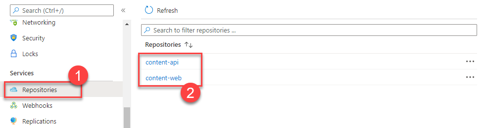

9.  选择`content-api` **(1)**.您将看到最新的标签**(2)**被分配。

    

10. 从连接到 VM 的Cloud Shell会话中分配`v1`标记到每个图像与以下命令。然后列出 Docker 图像，以注意每个图像现在有两个条目：显示`latest`标签和`v1`标记。另请注意，图像 ID 与两个条目相同，因为图像只有一个副本。

    ```bash
    docker image tag [LOGINSERVER]/content-web:latest [LOGINSERVER]/content-web:v1
    docker image tag [LOGINSERVER]/content-api:latest [LOGINSERVER]/content-api:v1
    docker image ls
    ```

    

11. 通过以下命令将图像推送至您的 ACR 帐户：

    ```bash
    docker image push [LOGINSERVER]/content-web:v1
    docker image push [LOGINSERVER]/content-api:v1
    docker image push [LOGINSERVER]/content-init:v1
    ```

12. 刷新其中一个存储库，查看图像的两个版本现在出现。

    

13. 运行以下命令，从存储库中提取图像。请注意，默认行为是拉标签的图像`latest`.您可以使用版本标签拉取特定版本。此外，请注意，由于构建代理上的图像已经存在，没有下载任何内容。

    ```bash
    docker image pull [LOGINSERVER]/content-web
    docker image pull [LOGINSERVER]/content-web:v1
    ```

### 任务 7：设置 CI 管道以推送图像

在此任务中，您将使用 YAML 来定义构建 Docker 的 GitHub 操作工作流
图像并自动将其推送至您的ACR实例。

1.  在GitHub，返回到**Fabmedical**存储库屏幕，并选择**设置**标签。

2.  从左侧菜单中选择**秘密**.

3.  选择**新存储库秘密**按钮。

    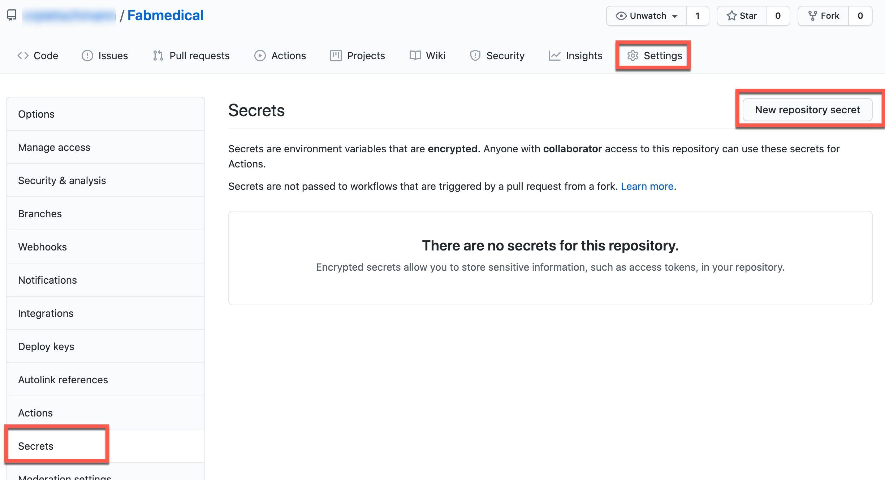

4.  在**新秘密**形式，输入名称`ACR_USERNAME`和价值，粘贴在Azure容器注册处**用户名**这是以前复制的。选择**添加秘密**.

    

5.  通过输入名称添加另一个秘密`ACR_PASSWORD`和价值，粘贴在Azure容器注册处**密码**这是以前复制的。

    

6.  在连接到构建代理 VM 的 Azure Cloud Shell会话中，导航到`~/Fabmedical`目录：

    ```bash
    cd ~/Fabmedical
    ```

7.  在 GitHub 操作工作流可以设置之前，`.github/workflows`目录需要创建，如果它还不存在。通过运行以下命令来做到这一点：

    ```bash
    mkdir ~/Fabmedical/.github
    mkdir ~/Fabmedical/.github/workflows
    ```

8.  导航到`.github/workflows`目录：

    ```bash
    cd ~/Fabmedical/.github/workflows
    ```

9.  接下来创建工作流 YAML 文件。

    ```dotnetcli
    vi content-web.yml
    ```

    添加以下内容。请务必更换以下占位符：

    -   取代`[SHORT_SUFFIX]`与您的短后缀，如`SOL`.

        ```yml
        name: content-web

        # This workflow is triggered on push to the 'content-web' directory of the  master branch of the repository
        on:
          push:
            branches:
            - master
            paths:
            - 'content-web/**'

          # Configure workflow to also support triggering manually
          workflow_dispatch:

        # Environment variables are defined so that they can be used throughout the job definitions.
        env:
          imageRepository: 'content-web'
          resourceGroupName: 'fabmedical-[SHORT_SUFFIX]'
          containerRegistryName: 'fabmedical[SHORT_SUFFIX]'
          containerRegistry: 'fabmedical[SHORT_SUFFIX].azurecr.io'
          dockerfilePath: './content-web'
          tag: '${{ github.run_id  }}'

        # Jobs define the actions that take place when code is pushed to the master branch
        jobs:
          build-and-publish-docker-image:
            name: Build and Push Docker Image
            runs-on: ubuntu-latest
            steps:
            # Checkout the repo
            - uses: actions/checkout@master

            - name: Set up Docker Buildx
              uses: docker/setup-buildx-action@v1

            - name: Login to ACR
              uses: docker/login-action@v1
              with:
                registry: ${{ env.containerRegistry }}
                username: ${{ secrets.ACR_USERNAME }}
                password: ${{ secrets.ACR_PASSWORD }}

            - name: Build and push an image to container registry
              uses: docker/build-push-action@v2
              with:
                context: ${{ env.dockerfilePath  }}
                file: "${{ env.dockerfilePath }}/Dockerfile"
                pull: true
                push: true
                tags: |
                  ${{ env.containerRegistry }}/${{ env.imageRepository }}:${{ env.tag }}
                  ${{ env.containerRegistry }}/${{ env.imageRepository }}:latest
        ```

10. 通过按下保存文件并退出 VI`<Esc>`然后`:wq`.

11. 保存管道 YAML，然后提交并将其推送至 Git 存储库：

    ```bash
    git add .
    git commit -m "Added workflow YAML"
    git push
    ```

12. 在GitHub，返回到**Fabmedical**存储库屏幕，并选择**行动**标签。

13. 在**行动**页面，选择**内容网**工作流。

14. 在**内容网**工作流，选择**运行工作流**并手动触发工作流执行。

    

15. 一秒钟后，新触发的工作流执行将显示在列表中。选择新**内容网**执行查看其状态。

16. 选择**构建和推送码头工人图像**工作流程的工作将显示其执行状态。

    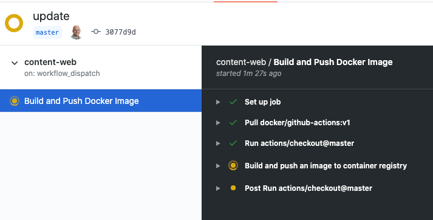

17. 接下来，设置`content-api`工作流。此存储库已包含`content-api.yml`位于`.github/workflows`目录。打开`.github/workflows/content-api.yml`文件编辑。

18. 编辑`resourceGroupName`和`containerRegistry`环境值以取代`[SHORT_SUFFIX]`与您自己的三个字母后缀，以便它匹配您的容器注册表的名称和资源组。

    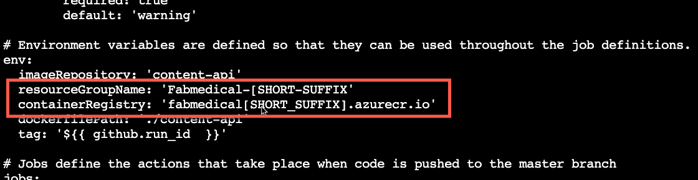

19. 保存文件，然后导航到 GitHub 中的存储库，选择"操作"，然后手动运行**内容-阿皮**工作流。

20. 接下来，设置**内容-伊尼特**工作流。遵循与前一步相同的步骤`content-api`工作流`content-init.yml`文件，记得更新`[SHORT_SUFFIX]`价值与您自己的三个字母后缀。

21. 提交并推动 Git 存储库的更改：

    ```bash
    git add .
    git commit -m "Updated workflow YAML"
    git push
    ```

## 练习 2： 使用 Azure 数据库迁移服务将蒙哥德布迁移到 Cosmos 数据库

**期间**：20分钟

此时，您有在 Docker 实例（VM - 生成代理）中运行的 Web 和 API 应用程序。下一步是将蒙哥德布数据库数据迁移到Azure Cosmos 数据库。这项工作将利用Azure数据库迁移服务将蒙哥德布数据库的数据迁移到Azure Cosmos 数据库。

### 任务1：启用微软.数据移民资源提供商

在此任务中，您将通过注册 Azure 订阅，启用 Azure 数据库迁移服务`Microsoft.DataMigration`资源提供商。

1.  打开AzureCloud Shell。

2.  运行以下 Azure CLI 命令以注册`Microsoft.DataMigration`Azure 订阅中的资源提供商：

    ```sh
    az provider register --namespace Microsoft.DataMigration
    ```

### 任务2：提供Azure数据库迁移服务

在此任务中，您将部署 Azure 数据库迁移服务实例，该实例将用于将数据从 MongoDB 迁移到 Cosmos 数据库。

1.  从 Azure 门户，选择**+ 创建资源**.

2.  搜索市场**Azure数据库迁移服务**并选择它。

3.  选择**创造**.

    

4.  在**基本**选项卡的**创建迁移服务**窗格，输入以下值：

    -   资源组：选择与此实验创建的资源组。
    -   迁移服务名称：输入名称，例如`fabmedical[SUFFIX]`.
    -   位置：选择资源组使用的Azure区域。

    

5.  选择**下一篇：网络>>**.

6.  在**联网**选项卡，选择**虚拟网络**在`fabmedical-[SUFFIX]`资源组。

    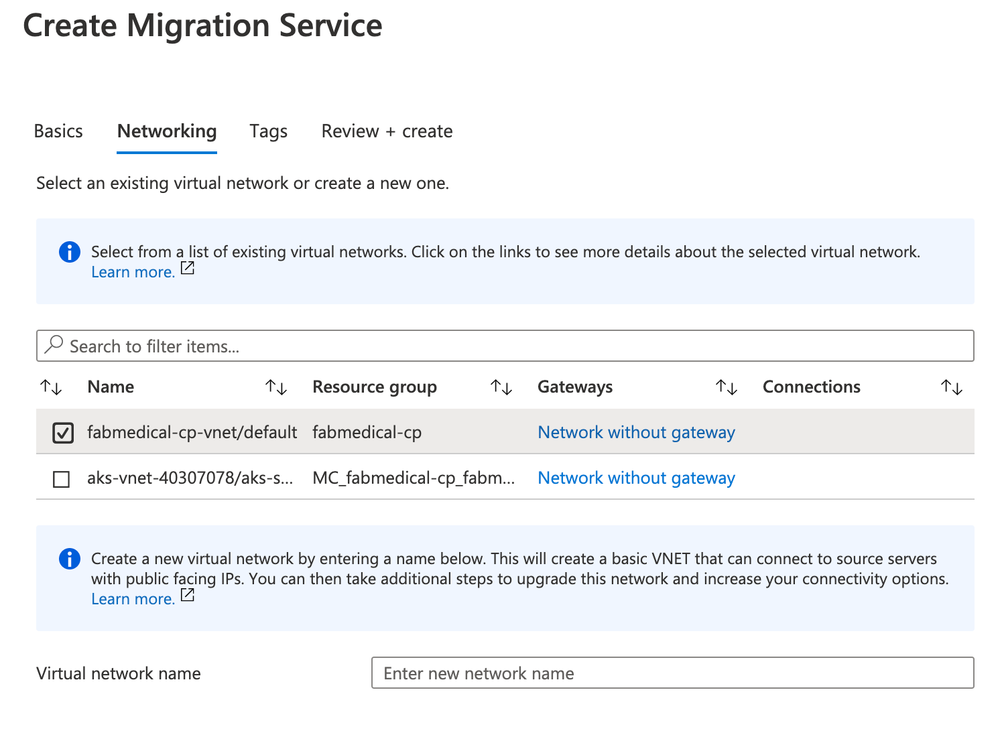

7.  选择**审核 + 创建**.

8.  选择**创造**创建Azure数据库迁移服务实例。

该服务可能需要 5 - 10 分钟才能提供。

### 任务3：将数据迁移到Azure Cosmos 数据库

在此任务中，您将创建**迁移项目**在Azure数据库迁移服务中，然后将数据从蒙哥德布迁移到Azure Cosmos 数据库。

1.  在 Azure 门户中，导航到构建代理 VM，并复制私人 IP 地址**(2)**.将内容粘贴到您选择的文本编辑器中（如 Windows 上的记事本，macOS 用户可以使用 TextEdit）供将来使用。

    

2.  在 Azure 门户中，导航到**Azure数据库迁移服务**这是以前提供的。

3.  在 Azure 数据库迁移服务刀片上，选择**+ 新迁移项目**在**概述**窗 格。

4.  在**新的迁移项目**窗格，输入以下值，然后选择**创建和运行活动**:

    -   项目名称：`fabmedical`
    -   源服务器类型：`MongoDB`
    -   目标服务器类型：`CosmosDB (MongoDB API)`
    -   选择活动类型：`Offline data migration`

    

    > **注意：**这**离线数据迁移**活动类型被选中，因为您将执行从蒙哥德布到 Cosmos DB的一次性迁移。此外，数据库中的数据不会在迁移期间更新。在生产场景中，您将要选择最适合解决方案要求的迁移项目活动类型。

5.  在**蒙哥德布到 Cosmos 数据库离线迁移向导**窗格，输入以下值的**选择源**标签：

    -   模式：**标准模式**
    -   源服务器名称：输入本实验中使用的生成代理 VM 的私人 IP 地址。
    -   服务器端口：`27017`
    -   要求 SSL：未选中

    > **注意：**离开**用户名**和**密码**空白，因为此实验的生成代理VM上的蒙哥德布实例没有打开身份验证。Azure 数据库迁移服务与构建代理 VM 连接到同一 VNet，因此它能够在 VNet 内直接与 VM 通信，而不会将 MongoDB 服务暴露到 Internet 中。在生产场景中，您应该始终在 MongoDB 上启用身份验证。

    

6.  选择**下一步：选择目标>>**.

7.  在**选择目标**窗格，选择以下值：

    -   模式：**选择 Cosmos 数据库目标**

    -   订阅：选择您为此实验使用的 Azure 订阅。

    -   选择 Cosmos 数据库名称：选择`fabmedical-[SUFFIX]` Cosmos 数据库实例。

    

    通知，**连接字符串**将自动填充与您的Azure Cosmos DB实例的密钥。

8.  修改**连接字符串**通过替换`@undefined:`跟`@fabmedical-[SUFFIX].documents.azure.com:`因此，DNS名称与Azure Cosmos 数据库实例匹配。请务必更换`[SUFFIX]`.

    

9.  选择**下一篇：数据库设置>>**.

10. 在**数据库设置**选项卡，选择`contentdb` **源数据库**因此，这个数据库将从蒙哥德布迁移到Azure Cosmos 数据库。

    

11. 选择**下一个：集合设置>>**.

12. 在**收集设置**选项卡，扩展**内容数据库**数据库，并确保这两个**会话**和**扬声器**集合被选中用于迁移。此外，更新**吞吐量**自`400`两个集合。

    

13. 选择**下一篇：移民摘要>>**.

14. 在**迁移摘要**选项卡，输入`MigrateData`在**活动名称**字段，然后选择**开始迁移**启动蒙哥德布数据迁移到Azure Cosmos 数据库。

    

15. 将显示迁移活动的状态。迁移只需几秒钟就完成。选择**刷新**重新加载状态，以确保它显示一个**地位**之**完成**.

     

16. 要验证数据已迁移，请导航到** Cosmos 数据库帐户**对于Azure门户内的实验，然后选择**数据资源管理器**.你会看到`speakers`和`sessions`集合内列出`contentdb`数据库，你将能够探索里面的文件。

    

## 练习 3： 将解决方案部署到Azure库伯内斯服务

**期间**：30分钟

在本练习中，您将连接到您在动手实验之前创建的 Azure Kubernetes 服务集群，并使用 Kubernetes 将 Docker 应用程序部署到集群中。

### 任务 1： 隧道进入AzureKubernetes服务集群

在此任务中，您将收集有关 Azure Kubernetes 服务集群所需的信息，以便连接到集群并执行命令，从Cloud Shell连接到 Kubernetes 管理仪表板。

> **注意**： 以下任务应在Cloud Shell中执行，而不是在构建机器中执行，因此，如果仍然连接，则与构建机器断开连接。

1.  使用以下命令验证您是否连接到正确的订阅，以显示您的默认订阅：

    ```bash
    az account show
    ```

    -   如果您未连接到正确的订阅，请列出您的订阅，然后通过其 ID 设置订阅，并下列命令（类似于您在实验前的Cloud Shell中所做的）：

    ```bash
    az account list
    az account set --subscription {id}
    ```

2.  配置库比特尔以连接到Kubernetes集群：

    ```bash
    az aks get-credentials -a --name fabmedical-SUFFIX --resource-group fabmedical-SUFFIX
    ```

3.  通过运行简单的 kubectl 命令生成节点列表来测试配置是否正确：

    ```bash
    kubectl get nodes
    ```

    

### 任务 2：使用 Azure 门户部署服务

在此任务中，您将使用 Azure 门户将 API 应用程序部署到 Azure Kubernetes 服务集群。

1.  我们首先需要为我们的 API 定义服务，以便在集群中访问应用程序。在 Azure 门户中的 AKS 刀片中选择**服务和入口**并在服务选项卡上选择**+ 添加**.

    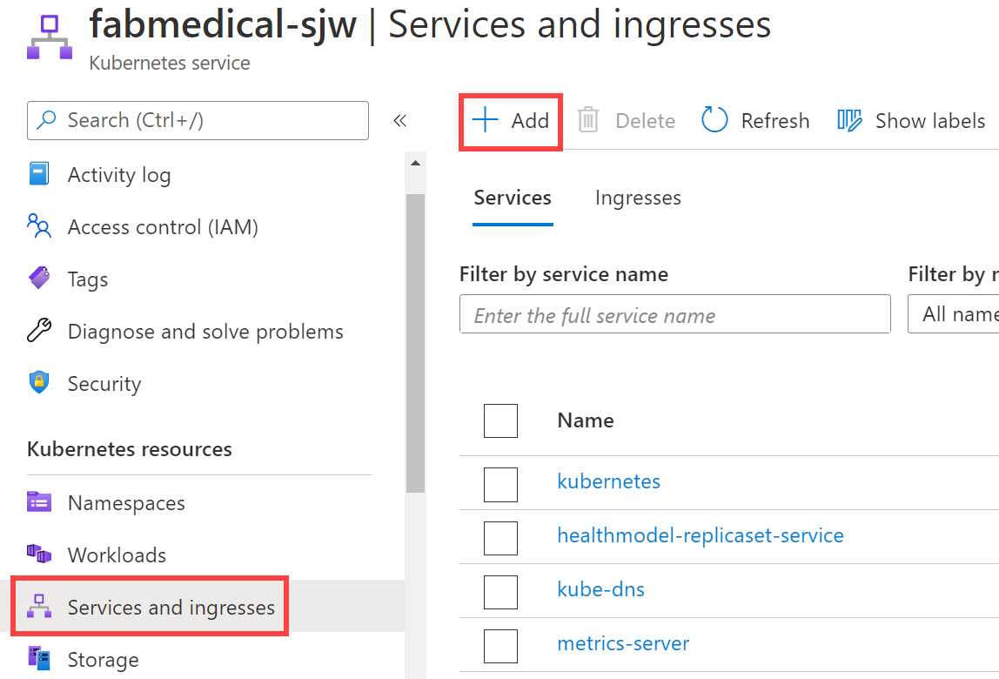

2.  在**添加与雅姆勒**屏幕，粘贴以下YAML并选择**加**.

    ```yaml
     apiVersion: v1
     kind: Service
     metadata:
       labels:
         app: api
       name: api
     spec:
       ports:
         - name: api-traffic
           port: 3001
           protocol: TCP
           targetPort: 3001
       selector:
         app: api
       sessionAffinity: None
       type: ClusterIP
    ```

3.  现在选择**工作量**下**库伯内特资源**左导航部分。

    

4.  从工作负载视图，与**部署**选择（默认值），然后选择**+ 添加**.

    

5.  在**添加与雅姆勒**加载粘贴以下YAML并更新的屏幕`[LOGINSERVER]`具有ACR实例名称的占位符。

    ```yaml
     apiVersion: apps/v1
     kind: Deployment
     metadata:
       labels:
         app: api
       name: api
     spec:
       replicas: 1
       selector:
         matchLabels:
           app: api
       strategy:
         rollingUpdate:
         maxSurge: 1
         maxUnavailable: 1
         type: RollingUpdate
       template:
         metadata:
           labels:
             app: api
             name: api
         spec:
           containers:
             - name: api
               image: [LOGINSERVER].azurecr.io/content-api
               imagePullPolicy: Always
               livenessProbe:
                 httpGet:
                   path: /
                   port: 3001
                 initialDelaySeconds: 30
                 periodSeconds: 20
                 timeoutSeconds: 10
                 failureThreshold: 3
               ports:
                 - containerPort: 3001
                   hostPort: 3001
                   protocol: TCP
               resources:
                 requests:
                   cpu: 1
                   memory: 128Mi
               securityContext:
                 privileged: false
                 terminationMessagePath: /dev/termination-log
                 terminationMessagePolicy: File
                 dnsPolicy: ClusterFirst
                 restartPolicy: Always
                 schedulerName: default-scheduler
                 securityContext: {}
                 terminationGracePeriodSeconds: 30
    ```

6.  选择**加**启动部署。这可能需要几分钟的时间，之后您将看到列出的部署。

    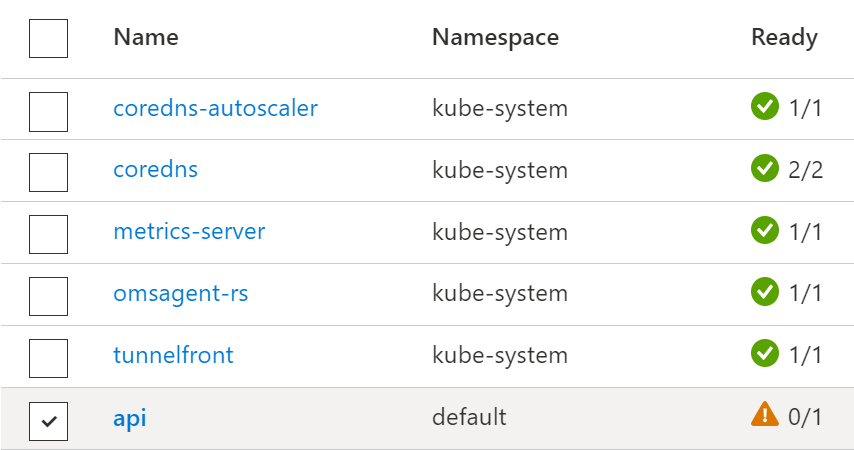

7.  选择**应用程序接口**部署以打开部署，选择**实时日志**然后从下降的池。过了一会儿，实时日志应该会出现。

    

    > **注意：**如果日志不显示它可能是池不再存在。您可以使用**查看日志分析**查看历史日志，无论波德。

8.  如果滚动浏览日志，可以看到它表明内容 api 应用程序再次失败，因为它找不到需要与之通信的 MongoDB api。您将通过连接到 Cosmos 数据库来解决这个问题。

    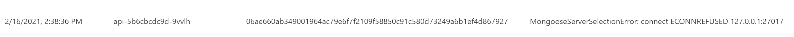

9.  在 Azure 门户中导航到您的资源组，并找到您的 Cosmos 数据库。选择 Cosmos 数据库资源来查看详细信息。

    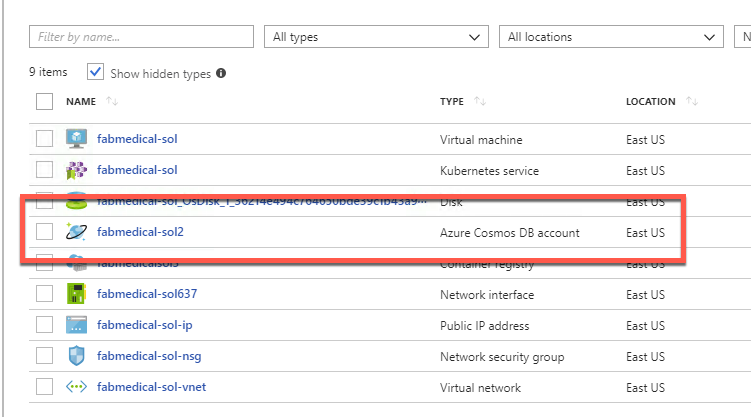

10. 下**快速启动**选择**节点.js**选项卡和复制**节点.js 3.0 连接字符串**.

    

11. 通过添加数据库修改复制的连接字符串`contentdb`到网址，以及复制集`globaldb`.生成的连接字符串应看起来像下面的示例。请注意，您可能需要修改端点 URL。

    > **注意**：用户名和密码经过简略编辑。

    ```text
    mongodb://<USERNAME>:<PASSWORD>@fabmedical-<SUFFIX>.documents.azure.com:10255/contentdb?ssl=true&replicaSet=globaldb
    ```

12. 您将设置一个库伯内特的秘密来存储连接字符串并配置`content-api`申请访问秘密。首先，您必须根据64编码秘密值。打开 Azure Cloud Shell窗口，使用以下命令编码连接字符串，然后复制输出。

    > **注意**：连接字符串周围的双引号需要成功生成所需的输出。

    ```bash
    echo -n "[CONNECTION STRING VALUE]" | base64 -w 0 - | echo $(</dev/stdin)
    ```

    

13. 返回到 Azure 门户中的 AKS 刀片并进行选择**配置**下**库伯内特资源**部分。选择**秘密**并选择**+ 添加**.

14. 在**添加与雅姆勒**屏幕，粘贴以下YAML，并取代占位符从你的剪贴板编码连接字符串，并选择**加**.请注意，YAML 对位置敏感，因此您必须在键入或粘贴时确保凹痕正确。

    ```yaml
    apiVersion: v1
    kind: Secret
    metadata:
      name: cosmosdb
    type: Opaque
    data:
      db: <base64 encoded value>
    ```

    

15. 按名称对机密列表进行排序，您现在应该可以看到显示的新机密。

    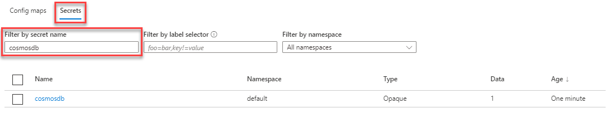

16. 查看详情** Cosmos 德布**秘密通过选择它在列表中。

    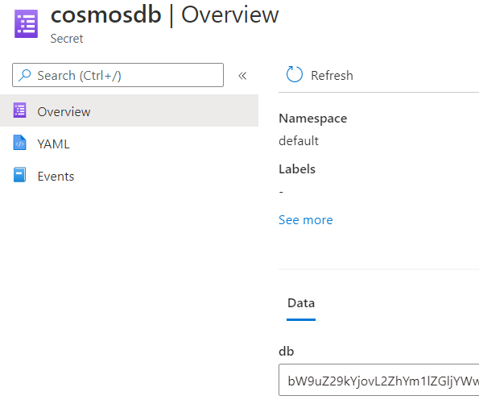

17. 接下来，在 Azure Cloud Shell窗口中使用以下命令下载 api 部署配置：

    ```bash
    kubectl get -o=yaml deployment api > api.deployment.yml
    ```

18. 使用Cloud Shell代码编辑下载的文件：

    ```bash
    code api.deployment.yml
    ```

    将以下环境配置添加到容器规格下方`image`财产：

    ```yaml
      env:
      - name: MONGODB_CONNECTION
        valueFrom:
          secretKeyRef:
            name: cosmosdb
            key: db
    ```

    

19. 保存更改并Close Editor。

    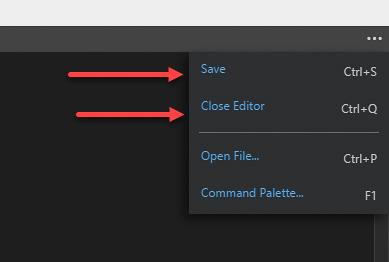

20. 使用更新api部署`kubectl`部署API。

    ```bash
    kubectl delete deployment api
    kubectl create -f api.deployment.yml
    ```

21. 在 Azure 门户中返回实时日志（参见第 5 步）。最后一个日志应显示为连接到蒙哥德布。

    

### 任务 3： 使用库布克特尔部署服务

在此任务中，使用部署 Web 服务`kubectl`.

1.  打开一个**new**AzureCloud Shell控制台。

2.  创建一个名为"文本文件"的文件`web.deployment.yml`使用AzureCloud Shell
    编辑 器。

    ```bash
    code web.deployment.yml
    ```

3.  将以下文本复制并粘贴到编辑器中：

    > **注意**：请务必仔细复制和粘贴代码块的内容，以避免引入任何特殊字符。

    ```yaml
    apiVersion: apps/v1
    kind: Deployment
    metadata:
      labels:
          app: web
      name: web
    spec:
      replicas: 1
      selector:
          matchLabels:
            app: web
      strategy:
          rollingUpdate:
            maxSurge: 1
            maxUnavailable: 1
          type: RollingUpdate
      template:
          metadata:
            labels:
                app: web
            name: web
          spec:
            containers:
            - image: [LOGINSERVER].azurecr.io/content-web
              env:
                - name: CONTENT_API_URL
                  value: http://api:3001
              livenessProbe:
                httpGet:
                    path: /
                    port: 3000
                initialDelaySeconds: 30
                periodSeconds: 20
                timeoutSeconds: 10
                failureThreshold: 3
              imagePullPolicy: Always
              name: web
              ports:
                - containerPort: 3000
                  hostPort: 80
                  protocol: TCP
              resources:
                requests:
                    cpu: 1000m
                    memory: 128Mi
              securityContext:
                privileged: false
              terminationMessagePath: /dev/termination-log
              terminationMessagePolicy: File
            dnsPolicy: ClusterFirst
            restartPolicy: Always
            schedulerName: default-scheduler
            securityContext: {}
            terminationGracePeriodSeconds: 30
    ```

4.  更新`[LOGINSERVER]`条目以匹配您的ACR登录服务器的名称。

5.  选择**...**按钮并选择**Save**.

    

6.  选择**...**再次按钮并选择**Close Editor**.

    

7.  创建一个名为"文本文件"的文件`web.service.yml`使用AzureCloud Shell
    编辑 器。

    ```bash
    code web.service.yml
    ```

8.  将以下文本复制并粘贴到编辑器中：

    > **注意**：请务必仔细复制和粘贴代码块的内容，以避免引入任何特殊字符。

    ```yaml
    apiVersion: v1
    kind: Service
    metadata:
      labels:
        app: web
      name: web
    spec:
      ports:
        - name: web-traffic
          port: 80
          protocol: TCP
          targetPort: 3000
      selector:
        app: web
      sessionAffinity: None
      type: LoadBalancer
    ```

9.  保存更改并Close Editor。

10. 键入以下命令以部署 YAML 文件描述的应用程序。您将收到一条消息，表明库布特已经创建了 Web 部署和 Web 服务的项目。

    ```bash
    kubectl create --save-config=true -f web.deployment.yml -f web.service.yml
    ```

    

11. 返回到 Azure 门户中的 AKS 刀片。从导航菜单，下**库伯内特资源**，选择**服务和入口**视图。您应该能够通过外部端点访问网站。

    

12. 在顶部导航中，选择`speakers`和`sessions`链接。

    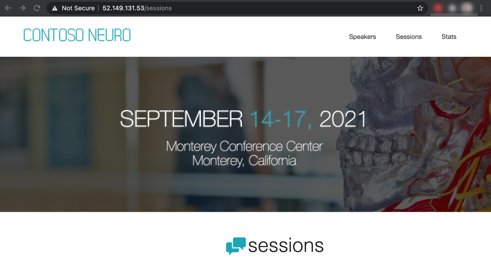

### 任务 4： 使用头盔图表部署服务

在此任务中，您将使用[掌舵](https://helm.sh/)简化 Azure Kubernetes 集群上基于容器的应用程序的安装和管理的图表。

您将配置一个头盔图表，用于部署和配置**内容网**容器图像到库伯内特。这是一种可用于更轻松地在 Azure Kubernetes 集群上部署和管理应用程序的技术。

1.  从 Azure 门户中的 AKS 刀片，下**库伯内特资源**选择**工作量**.

2.  选择`web`部署，然后选择**删除**.提示时，请检查**确认删除**并选择**删除**再。

    

3.  从 Azure 门户中的 AKS 刀片，下**库伯内特资源**选择**服务和入口**.

4.  选择`web`服务，然后选择**删除**.提示时，请检查**确认删除**并选择**删除**再。

    

5.  打开一个**new**AzureCloud Shell。

6.  克隆您的晶圆厂医学存储库（用存储库的 URL 替换 URL）：

    ```bash
    git clone https://github.com/USER_NAME/fabmedical.git
    ```

7.  我们将使用`helm create`命令脚手架出一个图表实现，我们可以建立。使用以下命令创建名为"新图表"`web`在新的目录中（用克隆创建的目录替换"晶圆厂"）：

    ```bash
    cd fabmedical
    cd content-web
    mkdir charts
    cd charts
    helm create web
    ```

8.  我们现在需要更新生成的脚手架，以符合我们的要求。我们将首先更新所命名的文件`values.yaml`.

    ```bash
    cd web
    code values.yaml
    ```

9.  搜索`image`定义和更新值，以便它们匹配以下内容：

    ```yaml
    image:
      repository: [LOGINSERVER].azurecr.io/content-web
      pullPolicy: Always
    ```

10. 寻找`nameOverride`和`fullnameOverride`条目并更新值，以便它们匹配以下内容：

    ```yaml
    nameOverride: "web"
    fullnameOverride: "web"
    ```

11. 搜索`service`定义和更新值，以便它们匹配以下内容：

    ```yaml
    service:
      type: LoadBalancer
      port: 80
    ```

12. 搜索`resources`定义和更新值，以便它们与以下值匹配。您正在删除卷曲的大括号并添加`requests`（请务必删除{}字符后`resource:`节点）：

    ```yaml
    resources:
      # We usually recommend not to specify default resources and to leave this as a conscious
      # choice for the user. This also increases chances charts run on environments with little
      # resources, such as Minikube. If you do want to specify resources, uncomment the following
      # lines, adjust them as necessary, and remove the curly braces after 'resources:'.
      # limits:
      #  cpu: 100m
      #  memory: 128Mi
      requests:
        cpu: 1000m
        memory: 128Mi
    ```

13. 保存更改并Close Editor。

14. 我们现在将更新命名的文件`Chart.yaml`.

    ```bash
    code Chart.yaml
    ```

15. 搜索`appVersion`输入并更新值，使其与以下内容匹配：

    ```yaml
    appVersion: latest
    ```

16. 我们现在将更新命名的文件`deployment.yaml`.

    ```bash
    cd templates
    code deployment.yaml
    ```

17. 搜索`metadata`定义和更新值，以便它们与以下值匹配。您正在用注释替换行：

    ```yaml
    apiVersion: apps/v1
    kind: Deployment
    metadata:
      (...)
    spec:
      (...)
      template:
        metadata:
          (...)
          annotations:
            rollme: {{ randAlphaNum 5 | quote }}
    ```

18. 搜索`containers`定义和更新值，以便它们与以下值匹配。您正在更改`containerPort`,`livenessProbe`端口和添加`env`变量：

    ```yaml
    containers:
      - name: {{ .Chart.Name }}
        securityContext:
          {{- toYaml .Values.securityContext | nindent 12 }}
        image: "{{ .Values.image.repository }}:{{ .Chart.AppVersion }}"
        imagePullPolicy: {{ .Values.image.pullPolicy }}
        ports:
          - name: http
            containerPort: 3000
            protocol: TCP
        env:
          - name: CONTENT_API_URL
            value: http://api:3001
        livenessProbe:
          httpGet:
            path: /
            port: 3000
    ```

19. 保存更改并Close Editor。

20. 我们现在将更新命名的文件`service.yaml`.

    ```bash
    code service.yaml
    ```

21. 搜索`ports`定义和更新值，以便它们匹配以下内容：

    ```yaml
    ports:
      - port: {{ .Values.service.port }}
        targetPort: 3000
        protocol: TCP
        name: http
    ```

22. 保存更改并Close Editor。

23. 该图表现在已设置为部署我们的 Web 容器。键入以下命令以部署头盔图表描述的应用程序。您将收到一条消息，表明掌舵人创建了 Web 部署和 Web 服务。

    ```bash
    cd ../..
    helm install web ./web
    ```

    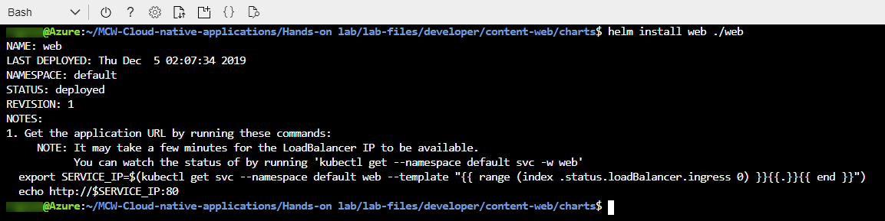

24. 返回打开Azure门户的浏览器。从导航菜单中选择**服务和入口**.您将看到部署哪个部署可能需要几分钟的 Web 服务。完成后，您应该能够通过外部端点访问网站。

    

25. 选择扬声器和会话链接，并检查每个链接是否显示内容。

    

26. 我们现在将我们的头盔图表提交到我们的 GitHub 存储库。在"FabMedical"克隆的根文件夹中执行以下命令：

    ```bash
    git add content-web/charts/
    git commit -m "Helm chart added."
    git push
    ```

### 任务 5：配置连续交付到Kubernetes集群

在此任务中，您将使用 GitHub 操作工作流自动将 Web 图像部署到 AKS 集群的过程。您将更新工作流程并配置作业，以便当新图像被推入 ACR 时，管道将图像部署到 AKS 集群。

1.  导航到`.github/workflows`git存储库的文件夹，并打开`content-web.yml`工作流使用`vi`:

    ```bash
    cd ~/fabmedical/.github/workflows
    vi content-web.yml
    ```

2.  您将在`content-web.yml`工作流。在文件末尾粘贴以下：

    > **注意**：粘贴时要小心检查缩定。这`build-and-push-helm-chart`节点应缩入2个空格，并与节点对`build-and-publish-docker-image`工作。

    ```yaml
      build-and-push-helm-chart:
        name: Build and Push Helm Chart
        runs-on: ubuntu-latest
        needs: [build-and-publish-docker-image]
        steps:
        # Checkout the repo
        - uses: actions/checkout@master

        - name: Helm Install
          uses: azure/setup-helm@v1

        - name: Helm Repo Add
          run: |
            helm repo add ${{ env.containerRegistryName }} https://${{ env.containerRegistry }}/helm/v1/repo --username ${{ secrets.ACR_USERNAME }} --password ${{ secrets.ACR_PASSWORD }}
          env:
            HELM_EXPERIMENTAL_OCI: 1

        - name: Helm Chart Save
          run: |
            cd ./content-web/charts/web

            helm chart save . content-web:v${{ env.tag }}
            helm chart save . ${{ env.containerRegistry }}/helm/content-web:v${{ env.tag }}

            # list out saved charts
            helm chart list
          env:
            HELM_EXPERIMENTAL_OCI: 1

        - name: Helm Chart Push
          run: |
            helm registry login ${{ env.containerRegistry }} --username ${{ secrets.ACR_USERNAME }} --password ${{ secrets.ACR_PASSWORD }}
            helm chart push ${{ env.containerRegistry }}/helm/content-web:v${{ env.tag }}
          env:
            HELM_EXPERIMENTAL_OCI: 1
    ```

3.  保存文件。

4.  在 Azure Cloud Shell中，使用以下命令输出`/.kube/config`包含与Azure库伯内斯服务进行身份验证的凭据的文件。这些凭据以前已检索，GitHub 行动也需要这些凭据才能部署到 AKS。然后复制文件的内容。

    ```bash
    cat ~/.kube/config
    ```

5.  在GitHub，返回到**Fabmedical**存储库屏幕，选择**设置**选项卡，选择**秘密**从左菜单，然后选择**新秘密**按钮。

6.  创建一个新的 GitHub 秘密与名称`KUBECONFIG`并粘贴在内容`~/.kube/config`以前复制的文件。

    

7.  现在返回编辑`content-web.yml`工作流并在文件末尾粘贴以下。

    > **注意**：粘贴时要小心检查缩定。这`aks-deployment`节点应缩入2个空格，并与节点对`build-and-push-helm-chart`工作。

    ```yaml
      aks-deployment:
        name: AKS Deployment
        runs-on: ubuntu-latest
        needs: [build-and-publish-docker-image,build-and-push-helm-chart]
        steps:
        # Checkout the repo
        - uses: actions/checkout@master

        - name: Helm Install
          uses: azure/setup-helm@v1

        - name: kubeconfig
          run: echo "${{ secrets.KUBECONFIG }}" >> kubeconfig

        - name: Helm Repo Add
          run: |
            helm repo add ${{ env.containerRegistry }} https://${{ env.containerRegistry }}/helm/v1/repo --username ${{ secrets.ACR_USERNAME }} --password ${{ secrets.ACR_PASSWORD }}
            helm repo update
          env:
            HELM_EXPERIMENTAL_OCI: 1

        - name: Helm Upgrade
          run: |
            helm registry login ${{ env.containerRegistry }} --username ${{ secrets.ACR_USERNAME }} --password ${{ secrets.ACR_PASSWORD }}
            helm chart pull ${{ env.containerRegistry }}/helm/content-web:v${{ env.tag }}
            helm chart export ${{ env.containerRegistry }}/helm/content-web:v${{ env.tag }} --destination ./upgrade
            helm upgrade web ./upgrade/web
          env:
            KUBECONFIG: './kubeconfig'
            HELM_EXPERIMENTAL_OCI: 1
    ```

8.  保存文件。

9.  提交您的更改

    ```bash
    cd ..
    git pull
    git add --all
    git commit -m "Deployment update."
    git push
    ```

10. 切换回GitHub。

11. 在**内容网**工作流，选择**运行工作流**并手动触发工作流执行。

    

12. 选择当前运行的工作流将显示其状态。

    

### 任务 6：审查集装箱的Azure监视器

在此任务中，您将访问和查看 Azure 监视器为容器提供的各种日志和仪表板。

1.  从 Azure 门户中选择您创建的名为"资源组"的资源组`fabmedical-SUFFIX`，然后选择您的`Kubernetes Service`Azure资源。

    

2.  从监控刀片中选择**见解**.

    

3.  查看各种可用仪表板，并更深入地查看集群、节点、控制器和部署容器上的各种指标和日志。

    

4.  要查看容器仪表板并查看有关每个容器的详细信息，请选择**器皿**标签。

    

5.  现在按容器名称进行筛选并搜索**蹼**容器中，您将看到库伯内特斯集群中创建的所有容器，其中带有吊舱名称。

    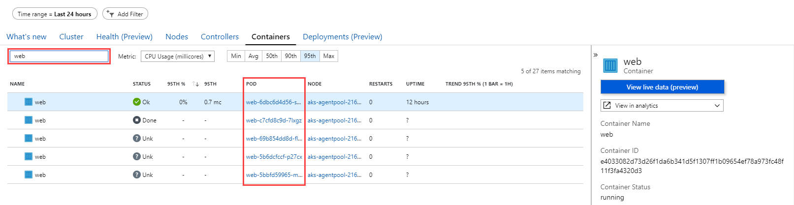

6.  默认情况下，将选择 CPU 使用度量值显示所选容器的所有 cpu 信息，然后切换到另一个指标打开公制下拉列表并选择其他指标。

    

7.  在选择任何 pod 时，与所选指标相关的所有信息都将显示在正确的面板上，在选择任何其他指标时，详细信息将显示在所选吊舱的右面板上。

    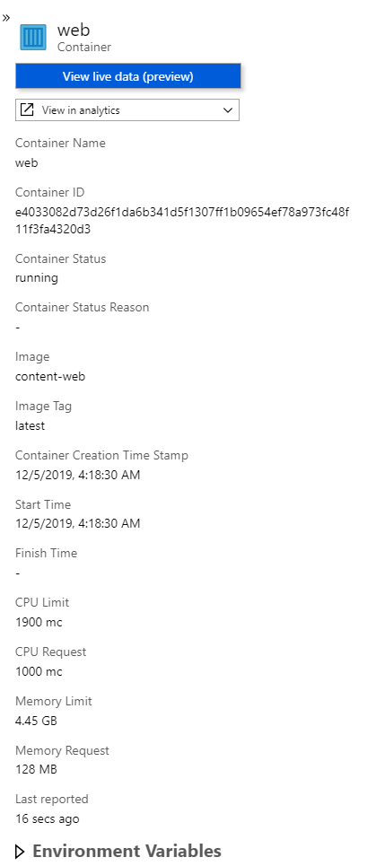

8.  要显示任何容器的日志，只需选择它并查看正确的面板，您就会找到"查看容器日志"选项，该选项将列出此特定容器的所有日志。

    

    

9.  对于每个日志条目，您可以通过扩展日志条目来显示更多信息以查看以下详细信息。

    

## 练习4：扩展应用并测试HA

**期间**：20分钟

此时，您已部署了 Web 和 API 服务容器的单一实例。在此练习中，您将增加 Web 服务的容器实例数量，并在现有集群上缩放前端。

### 任务 1：从 Azure 门户增加服务实例

在此任务中，您将增加 AKS Azure 门户刀片中 API 部署的实例数。在部署时，您将观察不断变化的状态。

1.  在 Azure 门户中的 AKS 刀片中选择**工作量**然后选择**应用程序接口**部署。

2.  选择**亚米尔**在窗口中加载并向下滚动，直到您找到**副本**.将复制品数量更改为**2**，然后选择**评论 + 保存**.提示时，请检查**确认显性更改**并选择**Save**.

    

    > **注意**： 如果部署快速完成，您可能看不到以下步骤中描述的门户中的部署等待状态。

3.  从 API 的复制集视图中，您将看到它正在部署，并且有一个健康的实例和一个待处理实例。

    

4.  从导航菜单中选择**工作量**.请注意，api 部署具有警报，并显示2个实例中的1个吊舱计数（如上所示）`1/2`).

    

    > **注意**：如果您收到有关CPU不足的错误，则可以。我们将在下一个任务中查看如何处理此问题（提示：您可以使用**见解**选项在 AKS Azure门户中查看**节点**状态并查看库伯内特事件日志）。

    此时，以下是环境的健康概述：

    -   一个部署和一个复制集对 Web 服务来说都是健康的。

    -   api 部署和复制集处于警告状态。

    -   在"默认"名称空间中，两个吊舱是健康的。

5.  打开康托索神经会议网络应用程序。当您导航到"扬声器"和"会话"页面时，应用程序仍应不出现任何错误。

    -   导航到`/stats`页。您将看到有关托管环境的信息，包括：

        -   **网络塔斯凯德：**Web服务实例的任务标识符。

        -   **任务Id：**API 服务实例的任务标识符。

        -   **主机名：**API 服务实例的主机名标识符。

        -   **皮德：**API服务实例的进程ID。

        -   **模名：**从 API 服务实例返回的某些内存指标。

        -   **计数器：**服务本身的计数器，如 API 服务实例返回的计数器。

        -   **运行时间：**API服务的备份时间。

### 任务 2： 解决复制品供应失败问题

在此任务中，您将解决失败的 API 副本。这些故障的发生是由于集群无法满足所要求的资源。

1.  在 Azure 门户中的 AKS 刀片中选择**工作量**然后选择**应用程序接口**部署。选择**亚米尔**导航项目。

2.  在**亚米尔**屏幕向下滚动并更改以下项目：

    -   修改**港口**并删除**主机端口**.两个 Pods 无法映射到同一主机端口。

        ```yaml
        ports:
          - containerPort: 3001
            protocol: TCP
        ```

    -   修改**中央处理器**并将其设置为**100米**.CPU 在节点上的所有 Pods 之间分配。

        ```yaml
        resources:
          requests:
            cpu: 100m
            memory: 128Mi
        ```

    选择**评论 + 保存**并且，当提示时，确认更改并选择**Save**.

    

3.  返回到**工作量**AKS Azure 门户上的主要视图，您现在将看到部署是健康的，有两个 Pods 在运行。

    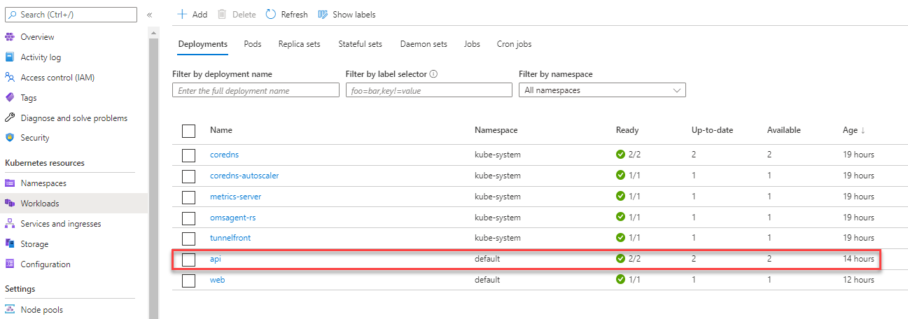

### 任务3：重新启动容器并测试HA

在此任务中，您将重新启动容器并验证重新启动不会影响运行服务。

1.  打开示例 Web 应用程序并导航到如所示的"统计"页面。

    

2.  在 Azure 门户中的 AKS 刀片中打开 api 部署并增加所需的复制件计数`4`.使用与练习 4、任务 1 相同的过程。

    

3.  几分钟后，您会发现 API 部署正在成功运行 4 个副本。

4.  加载 Web 应用程序统计页面后返回浏览器选项卡。一遍又一遍地刷新页面。您不会看到任何错误，但您将定期看到两个 api pod 实例之间的 api 主机名称更改。任务 ID 和 pid 也可能在两个 api 吊舱实例之间更改。

    

5.  刷新后足够的时间看到，`hostName`值正在改变，服务保持健康，您可以打开**复制套装**在Azure门户中查看API。

6.  在此视图中，您可以看到 Web 应用程序统计页面中显示的主机名值与正在运行的吊舱的吊舱名称匹配。

    

7.  随机选择两个吊舱并进行选择**删除**.

    

8.  库伯内特将推出新的 Pods， 以满足所需的复制品计数。根据您的观点，您可能会看到正在创建的旧实例终止和新实例。

    

9.  返回到 API 部署并将其缩减到`1`复制品。有关如果您不确定，请参阅上面的步骤 2，了解如何做到这一点。

10. 返回浏览器中的示例网站的统计页面并刷新，同时 Kubernetes 正在缩减 Pods 的数量。您会注意到仅显示一个 API 主机名称，即使您可能仍然会在 API 复制器设置视图中看到几个运行吊舱。即使有几个吊舱正在运行，Kubernetes 将不再将流量发送到它选择终止的吊舱。稍后，API 复制器设置视图中将只显示一个吊舱。

    

### 任务4：配置 Cosmos DB自动规模

在此任务中，您将在Azure Cosmos 数据库上设置自动缩放。

1.  在 Azure 门户中，导航到`fabmedical-[SUFFIX]` **Azure Cosmos 数据库帐户**.

2.  选择**数据资源管理器**.

3.  在**数据资源管理器**，扩大`contentdb`数据库，然后扩展`sessions`收集。

4.  下`sessions`收集、选择**缩放和设置**.

5.  在**缩放和设置**选择**自动缩放**对于**吞吐量**设置下**规模**.

    

6.  选择**Save**.

7.  执行相同的任务以启用**自动缩放**吞吐量`speakers`收集。

### 任务5：测试 Cosmos DB自动规模

在此任务中，您将运行一个性能测试脚本，将测试 Azure  Cosmos  DB 的自动规模功能，以便您看到它现在将扩展到大于 400 RU/s。

1.  在 Azure 门户中，导航到`fabmedical-[SUFFIX]` ** Cosmos 数据库帐户**.

2.  选择**连接字符串**下**设置**.

3.  在**连接字符串**窗格，复制**主机**,**用户名**和**主要密码**值。保存这些供以后使用。

    

4.  打开AzureCloud Shell，**嘘**到**生成代理 VM**.

5.  在**生成代理 VM**，导航到`~/Fabmedical`目录。

    ```bash
    cd ~/Fabmedical
    ```

6.  运行以下命令以打开`perftest.sh`在维姆编辑的脚本。

    ```bash
    vi perftest.sh
    ```

7.  有几个变量在顶部宣布`perftest.sh`脚本。修改**主机**,**用户名**和**密码**变量通过将其值设置为以前复制的相应 Cosmos DB连接字符串值。

    

8.  保存文件并退出 Vim。

9.  运行以下命令执行`perftest.sh`脚本运行一个小负载测试对 Cosmos DB。此脚本将通过将许多文档插入会话容器来消耗 Cosmos 数据库中的 RU。

    ```bash
    bash ./perftest.sh
    ```

    > **注意：**脚本需要一分钟才能完成执行。

10. 脚本完成后，导航返回到** Cosmos 数据库帐户**在Azure门户。

11. 向下滚动**概述**窗格的** Cosmos 数据库帐户**刀片，并找到**请求费用**图。

    > **注意：** Cosmos DB集合上的活动可能需要2-5分钟才能显示在活动日志中。等待几分钟，然后刷新窗格，如果最近的请求费用没有出现在现在。

12. 请注意，**请求费**现在显示有活动上的** Cosmos 数据库帐户**超过了自动刻度打开之前设定的 400 RU/s 限制。

    

## 练习 5：处理服务和路由应用程序流量

**期间**：1小时

在之前的练习中，我们对服务的规模属性进行了限制。在本练习中，您将配置 api 部署，以创建使用动态端口映射来消除规模活动期间端口资源限制的吊舱。

Kubernetes 服务可以发现分配给每个吊舱的端口，允许您在同一代理节点上运行多个吊舱实例，---配置特定静态端口（如 API 服务的 3001）时无法实现的状态。

### 任务 1： 更新外部服务，用负载平衡器支持动态发现

在此任务中，您将更新 Web 服务，以便它通过 Azure 负载平衡器支持动态发现。

1.  从 AKS**库伯内特资源**菜单，选择**部署**下**工作量**.从列表中选择**蹼**部署。

2.  选择**亚米尔**，然后选择**杰森**标签。

3.  首先定位复制节点并更新所需的计数`4`.

4.  接下来，滚动到屏幕截图中显示的 Web 容器规格。删除主机端口条目以进行 Web 容器的端口映射。

    

5.  选择**评论 + 保存**然后确认更改和**Save**.

6.  通过刷新 Web 部署的视图来检查扩展的状态。从导航菜单中选择**豆荚**从下工作负载。选择**蹼**豆荚。从此视图中，您应该会看到以下屏幕截图中显示的类似错误。

    

与 API 部署一样，Web 部署使用固定部署_主机端口_，并且您的缩放能力受可用代理节点数量的限制。但是，在通过删除_主机端口_设置时，由于 CPU 限制，Web 部署仍无法缩放过去两个吊舱。部署请求的 CPU 比 Web 应用程序需要的要多，因此您将在下一个任务中修复此限制。

### 任务2：调整CPU约束，提高规模

在此任务中，您将修改 Web 服务的 CPU 要求，以便它可以扩展到更多实例。

1.  重新打开用于 Web 部署的 JSON 视图，然后找到**中央处理器**Web容器的资源要求。将此值更改为`125m`.

    

2.  选择**评论 + 保存**，确认更改，然后选择**Save**更新部署。

3.  从导航菜单中选择**复制套装**下**工作量**.从视图的复制集列表中选择 Web 副本集。

4.  部署更新完成后，应以运行状态显示四个 Web 吊舱。

    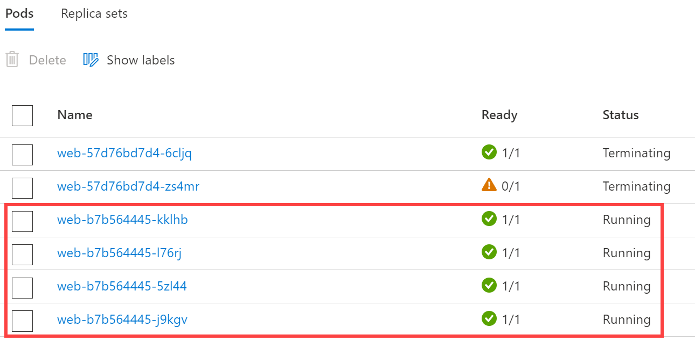

### 任务 3：执行滚动更新

在此任务中，您将编辑 Web 应用程序源代码以添加应用程序洞察并更新部署所使用的 Docker 图像。然后，您将执行滚动更新，以演示如何部署代码更改。

1.  在 Azure Cloud Shell中执行此命令，以检索用于`content-web`应用见解资源：

    ```bash
    az resource show -g fabmedical-[SUFFIX] -n content-web --resource-type "Microsoft.Insights/components" --query properties.InstrumentationKey -o tsv
    ```

    复制此值。稍后将使用它。

    > **注意：**如果您有一个空白的结果检查，您发出的命令是指正确的资源。

2.  在您的实验 VM 上，通过从 git 存储库中提取最新更改来更新您的晶圆厂医学存储库文件：

    ```bash
    cd ~/fabmedical/content-web
    git pull
    ```

3.  安装应用洞察支持。

    ```bash
    npm install applicationinsights --save
    ```

4.  编辑`app.js`文件使用Vim或视觉工作室代码遥控器，并立即添加以下行后`express`在6号线上即时化：

    ```javascript
    const appInsights = require("applicationinsights");
    appInsights.setup("[YOUR APPINSIGHTS KEY]");
    appInsights.start();
    ```

    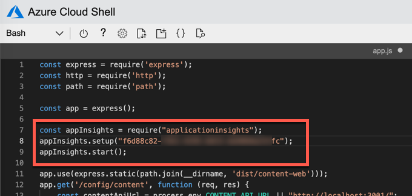

5.  保存更改并Close Editor。

6.  将这些更改推送至存储库，以便 GitHub 操作 CI 将生成和部署新的容器图像。

    ```bash
    git add .
    git commit -m "Added Application Insights"
    git push
    ```

7.  访问`content-web`为您的 GitHub FabMedical存储库执行操作，并查看新图像被部署到您的Kubernetes集群中。

8.  当此更新运行时，返回浏览器中的 Azure 门户。

9.  从导航菜单中选择**复制套装**下**工作量**.从此视图中，您将看到为 Web 设置的新副本，该副本可能仍在部署过程中（如下图所示）或已完全部署。

    

10. 部署正在进行中时，您可以导航到 Web 应用程序，并访问统计页面：`/stats`.在滚动更新执行时刷新页面。请注意，服务运行正常，任务继续保持负载平衡。

    

### 任务4：配置Kubernetes入口

在此任务中，您将使用[n金克斯代理服务器](https://nginx.org/en/)利用基于路径的路由和 TLS 终止。

1.  在 Azure Cloud Shell内，运行以下命令以添加 nginx 稳定的头盔存储库：

    ```bash
    helm repo add ingress-nginx https://kubernetes.github.io/ingress-nginx
    ```

2.  更新您的掌舵包列表。

    ```bash
    helm repo update
    ```

    > **注意**：如果您遇到"未找到存储库"的错误，则运行以下命令。这将添加回官方头盔"稳定"存储库。
    >
    > ```bash
    > helm repo add stable https://charts.helm.sh/stable 
    > ```

3.  在Kubernetes创建一个命名空间来安装入口资源。

    ```bash
    kubectl create namespace ingress-demo
    ```

4.  安装入口控制器资源，以处理入口请求。入口控制器将在 Azure 负载平衡器上收到自己的公共 IP，并能够处理 80 和 443 端口的多项服务请求。

    ```bash
    helm install nginx-ingress ingress-nginx/ingress-nginx \
     --namespace ingress-demo \
     --set controller.replicaCount=2 \
     --set controller.nodeSelector."beta\.kubernetes\.io/os"=linux \
     --set defaultBackend.nodeSelector."beta\.kubernetes\.io/os"=linux \
     --set controller.admissionWebhooks.patch.nodeSelector."beta\.kubernetes\.io/os"=linux
    ```

5.  在Azure门户下**服务和入口**复制IP地址**外部 IP**对于`nginx-ingress-RANDOM-nginx-ingress`服务。

    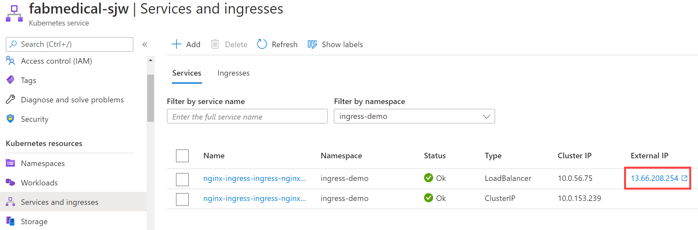

    > **注意**：可能需要几分钟时间刷新，交替，您可以在 Azure Cloud Shell中使用以下命令查找 IP。
    >
    > ```bash
    > kubectl get svc --namespace ingress-demo
    > ```
    >
    > 

6.  打开[Azure门户资源组刀片](https://portal.azure.com/?feature.customPortal=false#blade/HubsExtension/BrowseResourceGroups)并定位自动创建以托管 AKS 节点池的资源组。它将具有命名格式`MC_fabmedical-[SUFFIX]_fabmedical-[SUFFIX]_[REGION]`.

7.  在 Azure Cloud Shell中，创建一个脚本来更新入口外部 IP 的公共 DNS 名称。

    ```bash
    code update-ip.sh
    ```

    将以下内容粘贴。请务必替换脚本中的以下占位符：

    -   `[INGRESS PUBLIC IP]`：用从第5步复制的IP地址替换此地址。
    -   `[AKS NODEPOOL RESOURCE GROUP]`： 替换为从第 6 步复制的资源组名称。
    -   `[SUFFIX]`：用以前用于此实验的相同 SUFFIX 值替换此值。

    ```bash
    #!/bin/bash

    # Public IP address
    IP="[INGRESS PUBLIC IP]"

    # Resource Group that contains AKS Node Pool
    KUBERNETES_NODE_RG="[AKS NODEPOOL RESOURCE GROUP]"

    # Name to associate with public IP address
    DNSNAME="fabmedical-[SUFFIX]-ingress"

    # Get the resource-id of the public ip
    PUBLICIPID=$(az network public-ip list --resource-group $KUBERNETES_NODE_RG --query "[?ipAddress!=null]|[?contains(ipAddress, '$IP')].[id]" --output tsv)

    # Update public ip address with dns name
    az network public-ip update --ids $PUBLICIPID --dns-name $DNSNAME
    ```

    

8.  保存更改并Close Editor。

9.  运行更新脚本。

    ```bash
    bash ./update-ip.sh
    ```

10. 通过访问浏览器中的URL来验证IP更新。

    > **注意**：此时接收404消息是正常的。

    ```text
    http://fabmedical-[SUFFIX]-ingress.[AZURE-REGION].cloudapp.azure.com/
    ```

    

11. 使用掌舵安装`cert-manager`，可以从 letsencrypt.org 自动提供SSL证书的工具。

    ```bash
    kubectl create namespace cert-manager

    kubectl label namespace cert-manager cert-manager.io/disable-validation=true

    kubectl apply --validate=false -f https://github.com/jetstack/cert-manager/releases/download/v1.0.1/cert-manager.yaml
    ```

12. 证书管理器将需要自定义集群销售资源来处理请求 SSL 证书。

    ```bash
    code clusterissuer.yml
    ```

    以下资源配置应工作如下：

    ```yaml
    apiVersion: cert-manager.io/v1
    kind: ClusterIssuer
    metadata:
      name: letsencrypt-prod
    spec:
      acme:
        # The ACME server URL
        server: https://acme-v02.api.letsencrypt.org/directory
        # Email address used for ACME registration
        email: user@fabmedical.com
        # Name of a secret used to store the ACME account private key
        privateKeySecretRef:
          name: letsencrypt-prod
        # Enable HTTP01 validations
        solvers:
        - http01:
            ingress:
              class: nginx
    ```

13. 保存更改并Close Editor。

14. 使用创建发卡器`kubectl`.

    ```bash
    kubectl create --save-config=true -f clusterissuer.yml
    ```

15. 现在，您可以创建证书对象。

    > **注意**:
    >
    > 证书管理器可能已使用入口垫片为您创建了证书对象。
    >
    > 要验证证书是否创建成功，请使用`kubectl describe certificate tls-secret`命令。
    >
    > 如果证书已经可用，请跳到步骤 16。

    ```bash
    code certificate.yml
    ```

    使用以下内容并更新`[SUFFIX]`和`[AZURE-REGION]`以匹配您的入口DNS名称

    ```yaml
    apiVersion: cert-manager.io/v1
    kind: Certificate
    metadata:
      name: tls-secret
    spec:
      secretName: tls-secret
      dnsNames:
        - fabmedical-[SUFFIX]-ingress.[AZURE-REGION].cloudapp.azure.com
      issuerRef:
        name: letsencrypt-prod
        kind: ClusterIssuer
    ```

16. 保存更改并Close Editor。

17. 使用创建证书`kubectl`.

    ```bash
    kubectl create --save-config=true -f certificate.yml
    ```

    > **注意**：要检查证书的签发状态，请使用`kubectl describe certificate tls-secret`命令和寻找一个_事件_输出类似于以下内容：
    >
    > ```text
    > Type    Reason         Age   From          Message
    > ----    ------         ----  ----          -------
    > Normal  Generated           38s   cert-manager  Generated new private key
    > Normal  GenerateSelfSigned  38s   cert-manager  Generated temporary self signed certificate
    > Normal  OrderCreated        38s   cert-manager  Created Order resource "tls-secret-3254248695"
    > Normal  OrderComplete       12s   cert-manager  Order "tls-secret-3254248695" completed successfully
    > Normal  CertIssued          12s   cert-manager  Certificate issued successfully
    > ```

    可能需要 5 到 30 分钟才能获得 tls 秘密。这是由于延迟提供 Tls 证书从让敏感。

18. 现在，您可以为内容应用程序创建一个入口资源。

    ```bash
    code content.ingress.yml
    ```

    使用以下内容并更新`[SUFFIX]`和`[AZURE-REGION]`以匹配您的入口DNS名称：

    ```yaml
    apiVersion: networking.k8s.io/v1beta1
    kind: Ingress
    metadata:
      name: content-ingress
      annotations:
        kubernetes.io/ingress.class: nginx
        nginx.ingress.kubernetes.io/rewrite-target: /$1
        nginx.ingress.kubernetes.io/use-regex: "true"
        nginx.ingress.kubernetes.io/ssl-redirect: "false"
        cert-manager.io/cluster-issuer: letsencrypt-prod
    spec:
      tls:
      - hosts:
          - fabmedical-[SUFFIX]-ingress.[AZURE-REGION].cloudapp.azure.com
        secretName: tls-secret
      rules:
      - host: fabmedical-[SUFFIX]-ingress.[AZURE-REGION].cloudapp.azure.com
        http:
          paths:
          - path: /(.*)
            backend:
              serviceName: web
              servicePort: 80
          - path: /content-api/(.*)
            backend:
              serviceName: api
              servicePort: 3001
    ```

19. 保存更改并Close Editor。

20. 使用创建入口`kubectl`.

    ```bash
    kubectl create --save-config=true -f content.ingress.yml
    ```

21. 刷新浏览器中的入口端点。您应该能够访问扬声器和会话页面并查看所有内容。

22. 直接访问 API，通过导航到`/content-api/sessions`在入口终点。

    

23. 再次使用访问两个服务来测试 TLS 终止`https`.

    > SSL 站点可用可能需要 5 到 30 分钟。这是由于延迟提供 Tls 证书从让敏感。

### 任务 5：与流量管理器进行多区域负载平衡

在此任务中，您将设置 Azure 流量管理器作为多区域负载平衡器。这将使您能够在辅助 Azure 区域中提供应用的 AKS 实例，并在两个区域之间实现负载平衡。

1.  在 Azure 门户内，请选择**+ 创建资源**.

2.  搜索市场**流量管理器配置文件**，选择此资源类型，然后选择**创造**.

    

3.  在**创建流量管理器配置文件**刀片，输入以下值，然后选择**创造**.

    -   名称：'法布医疗-[后缀]'
    -   路由方法：**性能**
    -   资源组：`fabmedical-[SUFFIX]`

    

4.  导航到新创建的`fabmedical-[SUFFIX]` **流量管理器配置文件**.

5.  在**流量管理器配置文件**刀片，选择**端点**下**设置**.

6.  在**端点**窗格，选择**+ 添加**添加一个新的端点进行负载平衡。

7.  在**添加端点**窗格，输入新端点的以下值，然后选择**加**.

    -   类型：**外部端点**
    -   名字：`primary`
    -   完全合格的域名 （FQDN） 或 IP：`fabmedical-[SUFFIX]-ingress.[AZURE-REGION].cloudapp.azure.com`
    -   位置：选择与 AKS 相同的Azure区域。

    请务必更换`[SUFFIX]`和`[AZURE-REGION]`占位符。

    

8.  请注意列表**端点**现在显示**主要**已添加的端点。

9.  在**流量管理器配置文件**刀片，选择**概述**.

10. 在**概述**窗格，复制**DNS名称**用于流量管理器配置文件。

    

11. 导航回AzureCloud Shell。打开`content.ingress.yml`您以前创建的文件。将以下 YAML 代码附加到文件中。请保持适当的凹痕。这些 YAML 语句将确保将来自流量管理器配置文件的请求路由到正确的服务。

    ```yaml
      - host: fabmedical-cnr.trafficmanager.net
        http:
          paths:
          - path: /(.*)
            backend:
              serviceName: web
              servicePort: 80
          - path: /content-api/(.*)
            backend:
              serviceName: api
              servicePort: 3001
    ```

12. 打开新的 Web 浏览器选项卡并导航到流量管理器配置文件**DNS名称**只是复制。

    

13. 在 AKS 中设置多区域托管应用程序时，您将在另一个 Azure 区域设置辅助 AKS，然后将其终点添加到其流量管理器配置文件中以实现负载平衡。

    > **注意：**如果您愿意，您可以自行设置辅助 AKS 和康托索神经网站实例。设置该步骤的步骤与您在此实验中为设置主 AKS 和应用实例而经历的大多数步骤相同。

## 动手实验后

**期间**：10分钟

在这项工作中，您将取消为支持该实验而创建的任何 Azure 资源。

1.  删除您放置所有 Azure 资源的资源组。

    -   从门户，导航到您的刀片**资源集团**然后选择**删除**在顶部的命令栏中。

    -   通过重新键入资源组名称并选择"删除"来确认删除。

您应该遵循提供的所有步骤_后_参加动手实验。

[logo]: https://github.com/Microsoft/MCW-Template-Cloud-Workshop/raw/master/Media/ms-cloud-workshop.png

[portal]: https://portal.azure.com
