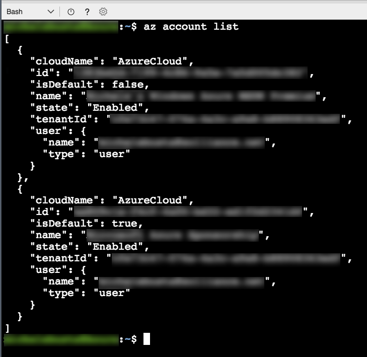
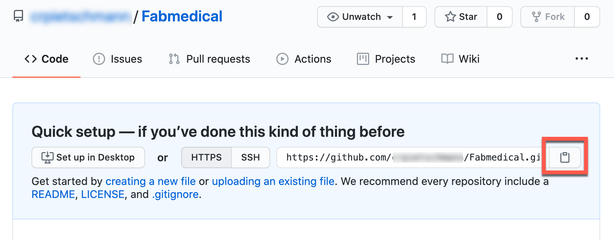
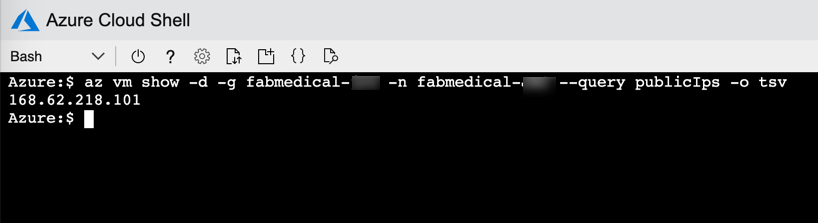
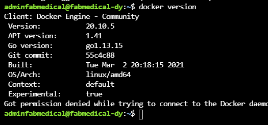
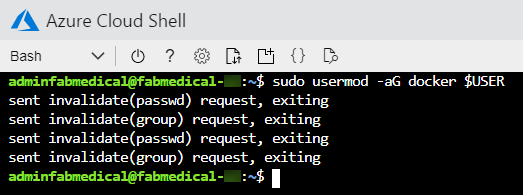

# <a id="cloud-native-applications-before-the-hands-on-lab-setup-guide">云原生应用动手实验之前的准备</a>

<!-- TOC -->

-   <a href="#cloud-native-applications-before-the-hands-on-lab-setup-guide">云原生应用动手实验之前的准备</a>
    -   <a href="#requirements">要求</a>
    -   <a href="#before-the-hands-on-lab">在动手实验之前</a>
        -   <a href="#task1">任务1：设置AzureCloud Shell</a>
        -   <a href="#task-2-download-starter-files">任务2：下载入门文件</a>
        -   <a href="#task-3-resource-group">任务3：资源组</a>
        -   <a href="#task-4-create-an-ssh-key">任务 4：创建 SSH 密钥</a>
        -   <a href="#task-5-deploy-arm-template">任务 5：部署 ARM 模板</a>
        -   <a href="#task-6-create-a-github-repository">任务 6： 创建 GitHub 存储库</a>
        -   <a href="#task-7-connect-securely-to-the-build-agent">任务 7：安全地连接到Biuld Agent VM </a>
        -   <a href="#task-8-complete-the-build-agent-setup">任务 8：完成Biuld Agent VM设置</a>
        -   <a href="#task-9-clone-repositories-to-the-build-agent">任务 9：克隆存储库到Biuld Agent </a>

<!-- /TOC -->


## <a id="requirements">要求</a>

1.  微软 Azure 订阅必须是即用即付或 MSDN。

    -   试用订阅将不适用做本实验。

    -   要完成此实验设置，请确保您的帐户包括以下内容：

        -   有[所有者](https://docs.microsoft.com/azure/role-based-access-control/built-in-roles#owner)(owner)Azure订阅的内置角色。

        -   在您使用的Azure AD租户内是一个[成员](https://docs.microsoft.com/azure/active-directory/fundamentals/users-default-permissions#member-and-guest-users)用户。（访客用户将没有足够的权限。）

    -   您的订阅中必须有足够的内核来创建Biuld Agent和AzureKubernetes服务集群[任务 5：部署 ARM 模板](#Task-5-Deploy-ARM-Template).如果按照实验中的确切说明操作，则需要八个内核;如果您选择其他代理或更大的 VM 尺寸，则需要更多内核。执行实验前所需的步骤，查看是否需要在子中请求更多内核。

2.  一个微软的[GitHub](https://github.com)帐户.

3.  本地计算机或配置为以下配置的VM 器：

    -   浏览器，最好是Chrome浏览器，以实现与实验实施测试的一致性。

4.  在整个练习过程中，您将被要求安装其他工具。

## <a id="before-the-hands-on-lab">在动手实验之前</a>

**期间**：60分钟

您应该遵循本节中提供的所有步骤_以前_提前参加动手实验，因为其中一些步骤需要时间。

### <a id="task1">任务1：设置AzureCloud Shell</a>

1.  通过选择菜单栏中的Cloud Shell图标打开Cloud Shell。

    

2.  Cloud Shell在浏览器窗口中打开。选择**Bash**如果提示或使用外 shell菜单栏上的左侧下拉来选择**Bash**从下降（如图所示）。如果提示，请选择**确认**.

    

3.  您应该确保正确设置默认订阅。查看当前订阅类型：

    ```bash
    az account show
    ```

    

4.  要将默认订阅设置为当前选择以外的其他操作，请键入以下类型，用所需的订阅 ID 值替换 {id}：

    ```bash
    az account set --subscription {id}
    ```

> **注意**：要列出您的所有订阅，请键入：

```bash
az account list
```

   

### <a id="task-2-download-starter-files">任务2：下载入门文件</a>

在此任务中，您使用`git`将实验内容复制到Cloud Shell中，以便实验启动文件可用。

> **注意**：如果您没有可用的Cloud Shell，请参阅<a href="#task1">任务1：设置AzureCloud Shell</a>.

1.  键入以下命令并按下`<ENTER>`:

    ```bash
    git clone https://github.com/microsoft/MCW-Cloud-native-applications.git
    ```

    > **注意**：如果您没有足够的自由空间，您可能需要从Cloud Shell环境中删除额外的文件。 尝试运行`azcopy jobs clean`删除任何`azcopy`您不需要的工作和数据。

2.  实验文件下载。

    

3.  我们不需要`.git`文件夹，以后的步骤将不那么复杂，如果我们删除它。运行此命令：

    ```bash
    rm -rf MCW-Cloud-native-applications/.git
    ```

### <a id="task-3-resource-group">任务3：资源组</a>

创建一个 Azure 资源组，以保存您在这个动手实验中创建的大部分资源。这种方法使得以后更容易清理。

1.  在Cloud Shell窗口中，您键入类似于以下命令的命令，请务必更换令牌：

    > **注意**：如果您没有可用的Cloud Shell，请参阅<a href="#task1">任务1：设置AzureCloud Shell</a>.

    ```bash
    az group create -l '[LOCATION]' -n 'fabmedical-[SUFFIX]'
    ```

    -   **后缀**：在整个实验中，后缀应用于使资源独一无二，如电子邮件前缀或您的第一个初始和姓氏。

    -   **位置**：选择所有 Azure 容器注册表 SKU 必须可用的区域，即当前：加拿大中部、加拿大东部、美国中北部、美国中部、美国中南部、美国东部、美国东部 2、美国西部、美国西部 2、美国中西部、法国中部、英国南部、英国西部、北欧、西欧、澳大利亚东部、澳大利亚东南部、巴西南部、印度中部、印度南部，日本东部，日本西部，韩国中部，东南亚，东亚，并记住这一点，为未来的步骤，使你在AzureCreate的资源都保存在同一区域。

    例：

    ```bash
    az group create -l 'west us' -n 'fabmedical-sol'
    ```

2.  完成此功能后，Azure 门户将显示您的资源组。

    

### <a id="task-4-create-an-ssh-key">任务 4：创建 SSH 密钥</a>

在即将到来的练习中，您创建VM 。在此部分中，您创建一个 SSH 密钥，以便安全地访问 VM。

1.  从Cloud Shell命令行输入以下命令，以确保存在 SSH 密钥的目录。您可以忽略在输出中看到的任何错误。

    > **注意**：如果您没有可用的Cloud Shell，请参阅<a href="#task1">任务1：设置AzureCloud Shell</a>.

    ```bash
    mkdir .ssh
    ```

2.  从Cloud Shell命令行，输入以下命令生成 SSH 键对。您可以替换`admin`与您的首选Name或句柄。

    ```bash
    ssh-keygen -t RSA -b 2048 -C admin@fabmedical
    ```

3.  当被要求将生成的密钥保存到文件时，请输入`.ssh/fabmedical`为Name。

4.  提示时输入password，以及**记住它**!

5.  因为你输入`.ssh/fabmedical` ,ssh-keygen生成的文件在`.ssh`当前user文件夹中的文件夹，在cloud shell默认打开的位置。

    

6.  从Cloud Shell命令行，输入以下命令以输出公共关键内容。复制此信息以稍后使用。

    ```bash
    cat .ssh/fabmedical.pub
    ```

7.  保持此Cloud Shell打开并保留在默认目录中。您将在以后的任务中使用此外 shell。

    

### <a id="task-5-deploy-arm-template">任务 5：部署 ARM 模板</a>

在本节中，您配置并执行 ARM 模板，该模板可创建整个练习所需的所有资源。

1.  在 Azure Cloud Shell中，切换到 ARM 模板目录：

    > **注意**：如果您没有可用的Cloud Shell，请参阅<a href="#task1">任务1：设置AzureCloud Shell</a>.

    ```bash
    cd MCW-Cloud-native-applications/Hands-on\ lab/arm/
    ```

2.  打开azure部署.参数.json文件，使用AzureCloud Shell编辑器进行编辑。

    ```bash
    code azuredeploy.parameters.json
    ```

    

3.  更新各种密钥的值，以便它们与您的环境相匹配：

    -   **Suffix**：输入最多3个字符的SUFFIX的缩短版本。
    -   **VirtualMachineAdminUsernameLinux**：Linux生成代理VM管理员USERNAME（示例：`"adminfabmedical"`).
    -   **VirtualMachineAdminPublicKeyLinux**：Linux生成代理VM管理员sh公钥。您可以在`.ssh/fabmedical.pub`以前创建的文件（示例：`"ssh-rsa AAAAB3N(...)vPiybQV admin@fabmedical"`).
    -   **CosmosLocation**：Azure Cosmos DB的主要位置。使用与之前创建的资源组相同的位置（示例：`"eastus"`).
    -   **CosmosLocationName**：Azure Cosmos DB的主要位置的Name。使用与之前创建的资源组相同的位置Name（示例：`"East US"`).
    -   **CosmosPairedLocation**：Azure Cosmos DB的次要位置。下面的链接可用于帮助查找您主要位置的 Azure 区域对。（示例：`"westus"`).
    -   **CosmosPairedLocationName**：Azure Cosmos DB的次要位置的Name。使用与上一密钥中定义的辅助位置匹配的位置Name（示例：`"West US"`).

    > **注意**：可在此处找到 Azure 区域对的列表：<https://docs.microsoft.com/en-us/azure/best-practices-availability-paired-regions#azure-regional-pairs>.

4.  选择 **...** 按钮并选择 **Save**.

    

5.  选择 **...** 再次按钮并选择 **Close Editor**.

    

6.  通过键入以下指令（区分大小写），用以前创建的资源组的Name替换 \[资源组]来创建所需的资源：

    ```bash
    az deployment group create --resource-group {resourceGroup} --template-file azuredeploy.json --parameters azuredeploy.parameters.json
    ```

    此命令部署所有实验资源需要 30 到 60 分钟。您可以在部署运行时继续执行设置 GitHub 的下一个任务。

    > **注意**如果你得到一个关于 Cosmos DBName的错误，确保你键入`ComsosLocation`和`CosmosPairedLocation`没有任何空间。更正Name后重新运行上述命令。

### <a id="task-6-create-a-github-repository">任务 6： 创建 GitHub 存储库</a>

FabMedical为您提供了入门文件。他们为客户 Contoso Neuro 获取了网站副本，并将其从单个node.js网站重新构接到一个包含内容 API 的网站，该网站为 speakers和会话提供服务。此重构代码是验证其网站的容器化的起点。使用此功能帮助他们完成 POC，验证将网站和 API 作为 Docker 容器运行的开发工作流程，并在 Azure Kubernetes 服务环境中管理它们。

1.  打开网络浏览器并导航到<https://www.github.com>.使用您的 GitHub 帐户凭据登录。

2.  在右上角，展开用户下拉菜单并进行选择**您的存储库**.

    

3.  在搜索标准旁边，定位并选择**new**按钮。

    

4.  在**Create a new repository**屏幕，命名存储库**Fabmedical**并选择**Create repository**按钮。

    

5.  在**Quick setup**屏幕，复制**HTTPS**GitHub URL用于您的新存储库，将此存储库粘贴在记事本中供将来使用。

    

6.  打开一个**new**AzureCloud Shell控制台。 您可以通过选择**Open new session**按钮从第一个控制台，或导航到<https://shell.azure.com>并使用相同的实验凭据登录。

7.  导航到 FabMedical源代码文件夹并列出内容。

    ```bash
    cd ~/MCW-Cloud-native-applications/Hands-on\ lab/lab-files/developer/
    ls
    ```

    > **重要说明**：如果您将采用实验的基础设施版本，而不是使用上述说明，则键入以下说明：
    >
    > ```bash
    > cd ~/MCW-Cloud-native-applications/Hands-on\ lab/lab-files/infrastructure/
    > ls
    > ```
    >
    > 这将带您到该版本的实验将使用的启动文件的版本。

8.  您将看到列表包括三个文件夹，一个用于网站，另一个用于内容 API，另一个用于初始化 API 数据：

    ```bash
    content-api/
    content-init/
    content-web/
    ```

9.  设置您的USERNAME和电子邮件，git 用于提交。

    ```bash
    git config --global user.email "you@example.com"
    git config --global user.name "Your Name"
    ```

10. 使用Cloud Shell，初始化新的 git 存储库：

    ```bash
    git init
    git add .
    git commit -m "Initial Commit"
    ```

11. 通过发布以下命令将远程源（origin）设置为 GitHub URL：

    ```bash
    git remote add origin <your GitHub URL>
    ```

12. 配置 git CLI 以缓存您的凭据，这样您就不必继续重新键入凭据。

    ```bash
    git config --global --unset credential.helper
    git config --global credential.helper store
    ```

13. 通过发布以下命令向主分支推进：

    ```bash
    git push -u origin master
    ```

    > **注意**：如果您具有多重身份验证，则在使用Cloud Shell时需要创建个人访问令牌。请参阅以下链接以获取有关设置 GitHub 个人访问令牌以进行身份验证的帮助`git`与您的GitHub帐户：<https://docs.github.com/en/github/authenticating-to-github/creating-a-personal-access-token>.

    > **注意**：一旦您获得个人访问令牌，请重试上述命令，使用令牌作为password。

14. 刷新 GitHub 存储库，您现在应该可以看到已发布的代码。

### <a id="task-7-connect-securely-to-the-build-agent">任务 7：安全地连接到Biuld Agent VM </a>

在本节中，您验证可以连接到新的Biuld Agent(Biuld Agent)VM

1.  打开一个**新**Azure Cloud Shell并运行以下命令，以查找运行 ARM 部署时提供的Biuld AgentVM的IP  Address：

    > **注意**：如果您没有可用的Cloud Shell，请参阅<a href="#task1">任务1：设置AzureCloud Shell</a>.

    ```bash
    az vm show -d -g fabmedical-[SUFFIX] -n fabmedical-[SHORT_SUFFIX] --query publicIps -o tsv
    ```

    例：

    ```bash
    az vm show -d -g fabmedical-sol -n fabmedical-SOL --query publicIps -o tsv
    ```

2.  在Cloud Shell输出中，请注意 VM 的公共 IP  Address。

    

3.  连接到您通过键入以下命令创建的新 VM：

    ```bash
     ssh -i [PRIVATEKEYNAME] [BUILDAGENTUSERNAME]@[BUILDAGENTIP]
    ```

    替换命令中的括号值如下：

    -   `[PRIVATEKEYNAME]`：使用之前实验步骤创建的私钥`.ssh/fabmedical`的名字。

    -   `[BUILDAGENTUSERNAME]`：在默认设置中使用VM的USERNAME`adminfabmedical`.

    -   `[BUILDAGENTIP]`：上一步检索的生成代理VM的IP Address。

    ```bash
    ssh -i .ssh/fabmedical adminfabmedical@52.174.141.11
    ```

4.  当被要求确认是否要连接时，由于无法验证连接的真实性，请键入`yes`.

5.  当要求您之前创建的私有密钥的password短语时，请输入此值。

6.  SSH 连接到 VM 并显示以下命令提示。为下一步保持此Cloud Shell窗口打开：

    `adminfabmedical@fabmedical-SUFFIX:~$`

    

> **注意**：如果连接有问题，您可能在ARM模板中错误地粘贴了SSH公钥。不幸的是，如果是这样的话，你将不得不重新创建VM并重试。

### <a id="task-8-complete-the-build-agent-setup">任务 8：完成Biuld Agent VM 设置</a>

在此任务中，您更新包并安装 Docker 引擎。

1.  转到向Biuld AgentVM打开SSH连接的Cloud Shell窗口。

2.  更新 Ubuntu 封装，通过在单行命令中键入以下内容，在 HTTPS 上单步安装curl和支持存储库。通过键入来响应`Y`并按下输入，如果问你是否愿意继续。

    ```bash
    sudo apt-get update && sudo apt install apt-transport-https ca-certificates curl software-properties-common
    ```

    > **注意**：这是一条线。

3.  通过在单行命令中键入以下键入，添加 Docker 的官方 GPG 密钥：

    ```bash
    curl -fsSL https://download.docker.com/linux/ubuntu/gpg | sudo apt-key add -
    ```

4.  通过在单行命令中键入以下项，将 Docker 的稳定存储库添加到 Ubuntu 包列表中：

    ```bash
    sudo add-apt-repository "deb [arch=amd64] https://download.docker.com/linux/ubuntu $(lsb_release -cs) stable"
    ```

5.  添加NodeJs PPA以使用NodeJS LTS版本并更新Ubuntu封装，并通过键入以下命令（每个命令均在单独的一行）安装Docker引擎、node.js和node包管理器。如果被问到是否要继续，请通过键入来回答`Y`并按下输入。

    ```bash
    sudo apt-get install curl python-software-properties -y

    curl -sL https://deb.nodesource.com/setup_12.x | sudo -E bash -

    sudo apt-get update && sudo apt-get install -y docker-ce nodejs mongodb-clients
    ```

6.  现在，通过在单行命令中键入以下软件包，将 Ubuntu 包升级到最新版本。

    ```bash
    sudo apt-get upgrade -y
    ```

7.  命令完成后，通过执行此命令检查安装的 Docker 版本。输出可能类似以下屏幕截图中显示的。请注意，服务器版本尚未显示，因为您没有使用提升的权限运行命令（即将解决）。

    ```bash
    docker version
    ```

    

8.  您也可以使用以下命令检查Node的版本.js和 npm，只是为了信息目的：

    ```bash
    nodejs --version

    npm -version
    ```

9.  安装Angular CLI。

    ```bash
    sudo npm install -g @angular/cli
    ```

10. 要移除使用 sudo 的要求，请将您的用户添加到 Docker 组。您可以忽略在输出中看到的任何错误。

    ```bash
    sudo usermod -aG docker $USER
    ```

    

11. 要使用户权限更改生效，请退出 SSH
    通过键入`exit`，然后按下Enter键.使用SSH重新连接到Biuld Agent VM，就像您在上一个任务中所做的那样。

    ```bash
    ssh -i .ssh/fabmedical adminfabmedical@52.174.141.11
    ```

12. 重复`docker version`命令，并注意输出现在显示服务器版本以及。

    

13. 运行一些docker命令：

    -   一个看看是否有任何容器目前运行。

        ```bash
        docker container ls
        ```

    -   一个看看是否有任何容器存在，是否运行。

        ```bash
        docker container ls -a
        ```

14. 在这两种情况下，您都有一个空列表，但在运行命令时没有错误。您的Biuld Agent已准备好，Docker 引擎运行正常。

    

### <a id="task-9-clone-repositories-to-the-build-agent">任务 9：克隆存储库到Biuld Agent </a>

在此任务中，您从 GitHub 克隆存储库，以便您可以在Biuld Agent上与他们合作。

1.  正如您以前在Cloud Shell中所做的那样，设置用于 git 提交的USERNAME和电子邮件。

    ```bash
    git config --global user.email "you@example.com"
    git config --global user.name "Your Name"
    ```

    > **注意**：在某些情况下，`root`用户拥有用户的`.config`文件夹。如果发生这种情况，运行以下命令以返回所有权`adminfabmedical`然后尝试`git`再次命令：
    >
    > ```bash
    > sudo chown -R $USER:$(id -gn $USER) /home/adminfabmedical/.config
    > ```

2.  配置 git CLI 以缓存您的凭据，这样您就不必保留凭据
    重新键入它们。

    ```bash
    git config --global credential.helper cache
    ```

    > **注意**：在某些情况下，`root`用户拥有用户的`.config`文件夹。如果发生这种情况，运行以下命令以返回所有权`adminfabmedical`然后尝试`git`再次命令：
    >
    > ```bash
    > sudo chown -R $USER:$(id -gn $USER) /home/adminfabmedical/.config
    > ```

3.  使用 GitHub URL 将存储库代码克隆到Biuld Agent机器。

    ```bash
    git clone <GITHUB_REPOSITORY_URL>
    ```

    > **注意**：在某些情况下，`root`用户拥有用户的`.config`文件夹。如果发生这种情况，运行以下命令以返回所有权`adminfabmedical`然后尝试`git`再次命令：
    >
    > ```bash
    > sudo chown -R $USER:$(id -gn $USER) /home/adminfabmedical/.config
    > ```

参加动手练习后，您应该按照提供的所有步骤进行操作。


