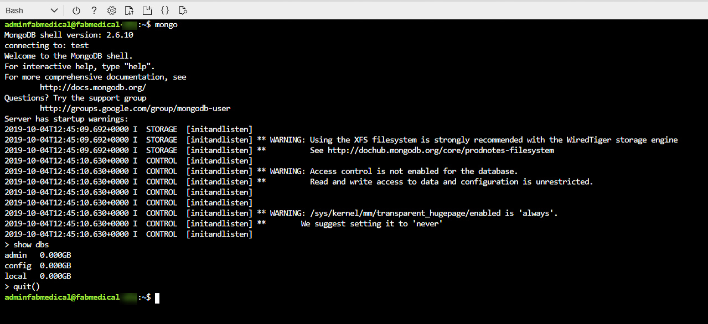
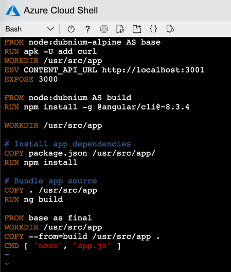
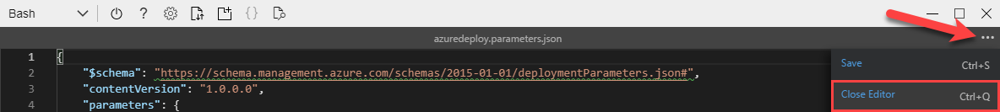

-   <a href="cloud-native-applications---infrastructure-edition-hands-on-lab-step-by-step">云原生应用 - 开发人员版动手实验</a>
    -   <a href="abstract-and-learning-objectives">学习目标</a>
    -   <a href="overview">概述</a>
    -   <a href="#exercise-1-create-and-run-a-docker-application">解决方案架构</a>
    -   <a href="requirements">要求</a>
    -   <a href="#exercise-1-create-and-run-a-docker-application">练习1：创建并运行Docker应用程序</a>
        -   <a href="#task-1-test-the-application">任务1：测试应用程序</a>
        -   <a href="#task-2-browsing-to-the-web-application">任务2：浏览到 Web 应用程序</a>
        -   <a href="#task-3-create-a-dockerfile">任务3：创建一个Dockerfile</a>
        -   <a href="#task-4-create-docker-images">任务4：创建Docker镜像</a>
        -   <a href="#task-5-run-a-containerized-application">任务 5：运行容器化应用程序</a>
        -   <a href="#task-6-setup-environment-variables">任务6：设置环境变量</a>
        -   <a href="#task-7-push-images-to-azure-container-registry">任务 7： 将镜像推送至 Azure 容器注册表</a>
		-   <a href="#task-8-setup-ci-pipeline-to-push-images">任务 8：设置 CI 管道以推送镜像</a>		
    -   <a href="#exercise-2-migrate-mongodb-to-cosmos-db-using-azure-database-migration-service">练习 2： 使用 Azure 数据库迁移服务将MongoDB迁移到 Cosmos 数据库</a>
        -   <a href="#task-1-enable-microsoftdatamigration-resource-provider">任务1：启用Microsoft.DataMigration资源provider</a>
        -   <a href="#task-2-provision-azure-database-migration-service">任务2：提供Azure数据库迁移服务</a>
        -   <a href="#task-3-migrate-data-to-azure-cosmos-db">任务3：将数据迁移到Azure Cosmos 数据库</a>
    -   <a href="#exercise-3-deploy-the-solution-to-azure-kubernetes-service">练习 3： 将解决方案部署到Azure Kubernetes 服务</a>
        -   <a href="#task-1-tunnel-into-the-azure-kubernetes-service-cluster">任务 1： 隧道进入AzureKubernetes服务集群</a>
        -   <a href="#task-2-deploy-a-service-using-the-azure-portal">任务 2：使用 Azure 门户部署服务</a>
        -   <a href="#task-3-deploy-a-service-using-kubectl">任务 3： 使用kubectl部署服务</a>
        -   <a href="#task-4-deploy-a-service-using-a-helm-chart">任务 4： 使用Helm Chart部署服务</a>
        -   <a href="#task-5-configure-continuous-delivery-to-the-kubernetes-cluster">任务 5：配置持续交付到Kubernetes集群</a>
        -   <a href="#task-6-review-azure-monitor-for-containers">任务 6：审查容器的Azure监视器</a>
    -   <a href="#exercise-4-scale-the-application-and-test-ha">练习4：扩展应用并测试HA</a>
        -   <a href="#task-1-increase-service-instances-from-the-azure-portal">任务 1：从 Azure 门户增加服务实例</a>
        -   <a href="#task-2-resolve-failed-provisioning-of-replicas">任务 2： 解决replicas配置失败问题</a>
        -   <a href="#task-3-restart-containers-and-test-ha">任务3：重新启动容器并测试HA</a>
        -   <a href="#task-4-configure-cosmos-db-autoscale">任务4：配置 Cosmos DB自动Scale</a>
        -   <a href="#task-5-test-cosmos-db-autoscale">任务5：测试 Cosmos DB自动Scale</a>
    -   <a href="#exercise-5-working-with-services-and-routing-application-traffic">练习 5：处理服务和路由应用程序流量</a>
        -   <a href="#task-1-update-an-external-service-to-support-dynamic-discovery-with-a-load-balancer">任务 1： 更新外部服务，用负载平衡器支持动态发现</a>
        -   <a href="#task-2-adjust-cpu-constraints-to-improve-scale">任务2：调整CPU约束，提高Scale</a>
        -   <a href="#task-3-perform-a-rolling-update">任务 3：执行滚动更新</a>
        -   <a href="#task-4-configure-kubernetes-ingress">任务4：配置Kubernetes入口</a>
        -   <a href="#task-5-multi-region-load-balancing-with-traffic-manager">任务 5：与流量管理器进行多区域负载平衡</a>
    -   <a href="after-the-hands-on-lab">动手实验后</a>

<!-- /TOC -->

# <a id="cloud-native-applications---infrastructure-edition-hands-on-lab-step-by-step">云原生应用 - 开发人员版动手实验</a>

## <a id="abstract-and-learning-objectives">学习目标</a>

这个动手实验旨在引导您完成构建和部署 Docker 镜像到 Azure Kubernetes 服务 （AKS） 托管的 Kubernetes 平台的过程，此外还学习如何处理动态服务发现、服务扩展和高可用性。

在此实验结束时，您将能够更好地构建和部署容器化应用程序到 Azure Kubernetes 服务，并执行常见的 DevOps 程序。

## <a id="overview">概述</a>

Fabrikam医疗会议 （FabMedical） 提供专为医疗界量身定做的会议网站服务。他们正在根据node.js重新构想其应用程序代码，以便它可以作为 Docker 应用程序运行，并希望实施 POC，帮助他们熟悉开发过程、部署的生命周期以及托管环境的关键方面。他们将部署他们的应用程序到Azure Kubernetes服务，并希望学习如何用动态负载平衡的方式部署容器，发现容器，并按需缩放它们。

在这个动手实验中，您将协助完成此 POC 与应用程序代码库的子集。您将创建基于 Linux 的Biuld Agent，以及用于运行已部署应用程序的 Azure Kubernetes 服务集群。您将帮助他们完成应用的 Docker 设置、本地测试、推入镜像存储库、部署到集群以及测试负载平衡和缩放。

> **重要**：大多数Azure资源都需要独特的Name。在整个步骤中，您将看到"SUFFIX"一词作为资源Name的一部分。您应该用唯一的句柄（如 Microsoft 帐户电子邮件前缀）替换此操作，以确保资源的独特Name。

## <a id="exercise-1-create-and-run-a-docker-application">解决方案架构 </a>

以下是您将在此实验中构建的解决方案架构的图表。请仔细研究这一点，以便您了解整个解决方案，因为您正在研究各种组件。

该解决方案将使用 Azure Kubernetes 服务 （AKS），这意味着容器集群拓扑是根据请求Node的数量提供的。部署到集群的拟议容器如下图所示，将 Cosmos  DB 作为托管服务：


每个租户将拥有以下容器：

-   **Conference Web site**：SPA应用程序，将使用配置设置（configuration settings）来处理租户的自定义样式。

-   **Admin Web site**： 会议所有者用来管理会议配置详细信息、管理与会者注册、管理活动并与与会者沟通的 SPA 应用程序。

-   **Registration service**： 处理所有注册活动的 API，使用适当的套餐选择和相关成本创建新的会议注册。

-   **Email service**： 在注册期间或会议所有者选择通过其管理网站与与会者互动时，处理向与会者发送电子邮件通知的 API。

-   **Config service**： 处理会议配置设置（如日期、地点、定价表、早起的特价、倒计时等）的 API。

-   **Content service**： 处理会议内容（如演讲者、会议、研讨会和赞助商）的 API。

## <a id="requirements">要求</a>

1.  微软 Azure 订阅必须是即用即付或 MSDN。

    -   试用订阅将不适用做本实验。

    -   要完成此实验，请确保您的帐户具有以下角色：

        -   您将使用Azure 订阅的内置角色:[Owner](https://docs.microsoft.com/azure/role-based-access-control/built-in-roles#owner)
             

        -   您将使用Azure AD租户的[Member](https://docs.microsoft.com/azure/active-directory/fundamentals/users-default-permissions#member-and-guest-users)角色，（访客用户将没有所需的权限)

    -   您的订阅中必须有足够的内核，才能在动手实验之前创建Biuld Agent和 Azure Kubernetes 服务集群。如果按照实验中的确切说明操作，则需要八个内核;如果您选择额外的群集Node或更大的 VM 大小，则需要更多内核。如果您执行实验前所需的步骤，您将能够查看是否需要在子中请求更多内核。

2.  本地计算机或配置为以下配置的VM 器：

    -   浏览器，最好是Chrome浏览器，以实现与实验实施测试的一致性。

3.  在整个练习过程中，您将安装其他工具。

> **非常重要**：您应该键入指南中显示的所有命令。当指示输入本文档中显示的信息时，请勿尝试复制并粘贴到您的命令窗口或其他文档中，除非本文档中明确说明。复制和粘贴可能会出现导致错误、执行说明或创建文件内容的问题。

## <a id="exercise-1-create-and-run-a-docker-application">练习1：创建并运行Docker应用程序</a>

**期间**：40分钟

在此练习中，您将采用入门文件并运行node.js应用程序作为Docker应用程序。您将创建一个Dockerfile，构建Docker镜像，并运行容器来执行应用程序。

### <a id="task-1-test-the-application">任务1：测试应用程序</a>

此任务的目的是确保您的应用部署到 Docker 之前可用成功运行（使用VM测试它）。

1.  如果您尚未连接，请从 Azure Cloud Shell连接到Biuld Agent。（如果您需要重新连接，请查看"HOL 之前"文档中的说明。

2.  键入以下命令以创建名为 Docker 的网络`fabmedical`:

    ```bash
    docker network create fabmedical
    ```

3.  运行一个mongodb用于本地测试。

    ```bash
    docker container run --name mongo --net fabmedical -p 27017:27017 -d mongo:4.0
    ```

    > **注意**：通过为Mongo编写的现有源代码，可以指向Azure Cosmos DB MongoDB API终点。Azure Cosmos DB仿真器可用于Windows上的本地开发;然而， Cosmos DB仿真的器不支持Linux。因此，在利用Linux进行开发时，当地发展环境仍然需要Mongo开发银行：与Azure Cosmos DB用于在云中的数据存储。这使得为 MongoDB 存储编写的现有源代码可以轻松迁移到使用 Azure  Cosmos  DB 后端。

4.  确认Mongo容器已运行并准备就绪。

    ```bash
    docker container list
    docker container logs mongo
    ```

    

5.  使用Mongo shell连接到Mongo实例，并测试一些基本命令：

    ```bash
    mongo
    ```

    ```text
    show dbs
    quit()
    ```

    

6.  要使用测试内容初始化本地数据库，首先导航到内容入网目录并运行 npm 安装。

    ```bash
    cd ~/Fabmedical/content-init
    npm install
    ```

    > **注意**：在某些情况下，`root`用户将被分配用户的所有权`.config`文件夹。如果发生这种情况，运行以下命令使您当前用户（比如：`adminfabmedical`）获得所需权限，然后再尝试`npm install`：

    ```bash
    sudo chown -R $USER:$(id -gn $USER) /home/adminfabmedical/.config
    ```

7.  初始化数据库。

    ```bash
    nodejs server.js
    ```

    

8.  确认数据库现在包含测试数据。

    ```bash
    mongo
    ```

    ```text
    show dbs
    use contentdb
    show collections
    db.speakers.find()
    db.sessions.find()
    quit()
    ```

    这应产生类似于以下的输出：

    

9.  现在导航到`content-api`目录和运行npm安装。

    ```bash
    cd ../content-api
    npm install
    ```

    > **注意**：在某些情况下，`root`用户将被分配用户的所有权`.config`文件夹。如果发生这种情况，运行以下命令使您当前用户（比如：`adminfabmedical`）获得所需权限，然后再尝试`npm install`：

    ```bash
    sudo chown -R $USER:$(id -gn $USER) /home/adminfabmedical/.config
    ```

10. 启动 API 作为后端进程。

    ```bash
    nodejs ./server.js &
    ```

    

11. 按`ENTER`再次获得下一步的命令提示。

12. 使用curl测试API。您将请求演讲者的内容，这将返回 JSON 结果。

    ```bash
    curl http://localhost:3001/speakers
    ```

    

13. 导航到 Web 应用程序目录，运行`npm install`和`ng build`.

    ```bash
    cd ../content-web
    npm install
    ng build
    ```

    

     > **注意**：在某些情况下，`root`用户将被分配用户的所有权`.config`文件夹。如果发生这种情况，运行以下命令使您当前用户（比如：`adminfabmedical`）获得所需权限，然后再尝试`npm install`：

    ```bash
    sudo chown -R $USER:$(id -gn $USER) /home/adminfabmedical/.config
    ```

14. 从 Azure Cloud Shell中，运行以下命令，查找运行 ARM 部署时提供的Biuld Agent VM 的 IP  Address。

    ```bash
    az vm show -d -g fabmedical-[SUFFIX] -n fabmedical-[SHORT_SUFFIX] --query publicIps -o tsv
    ```

    例：

    ```bash
    az vm show -d -g fabmedical-sol -n fabmedical-SOL --query publicIps -o tsv
    ```

15. 从build machine 中的Cloud Shell使用vim编辑`app.js`文件。

    ```bash
    vim app.js
    ```

    然后按下 **_i_** 进入编辑模式后，用build machine IP Address替换localhost。

    

    然后按下 **_ESC_** 写 **_:wq_** 以保存更改并关闭文件。

16. 现在在后台运行内容网络应用程序。

    ```bash
    node ./app.js &
    ```

    按`ENTER`再次获得下一步的命令提示。

17. 使用curl测试 Web 应用程序。您将看到 HTML 输出并没有返回错误。

    ```bash
    curl http://localhost:3000
    ```

18. 离开这个运行的应用程序以执行下一个任务。

19. 如果您收到 JSON 对 /speakers内容请求的响应和来自 Web 应用程序的 HTML 响应，您的环境将按预期工作。

### <a id="task-2-browsing-to-the-web-application">任务2：浏览到 Web 应用程序</a>

在此任务中，您将浏览到 Web 应用程序进行测试。

1.  从 Azure 门户中选择您创建的指定资源组`fabmedical-SUFFIX`.

2.  选择命名的Build agent VM`fabmedical-SUFFIX`从您的可用资源列表。

    

3.  从**VM **概述面板，找到VM的**Public IP Address**。

    

4.  从浏览器中测试 Web 应用程序。使用在端口的Biuld Agent IP  Address导航到 Web 应用程序`3000`.

    ```text
    http://[BUILDAGENTIP]:3000

    EXAMPLE: http://13.68.113.176:3000
    ```

5.  选择标题中的 speakers和会话链接。您将看到页面显示您以前curl的 JSON 内容的 HTML 版本。

6.  验证应用程序通过浏览器访问后，请转到Cloud Shell窗口并停止运行Node进程。

    ```bash
    killall nodejs
    killall node
    ```

### <a id="task-3-create-a-dockerfile">任务3：创建一个Dockerfile</a>

在此任务中，您将创建一个新的 Dockerfile，用于将 API 应用程序作为容器化应用程序运行。

> **注意**：您将在没有友好编辑器工具的Linux VM中工作。如果您不熟悉 Vim，则必须非常仔细地遵循步骤，与 Vim 一起进行一些编辑练习。

1.  从Cloud Shell，导航到`content-api`文件夹。用此命令列出文件夹中的文件。输出应该看起来像下面的屏幕截图。

    ```bash
    cd ../content-api
    ll
    ```

    

2.  创建名为`Dockerfile`的新文件并注意字母大小写。使用Vim命令创建新文件。Cloud Shell窗口应如下图所示。

    ```bash
    vi Dockerfile
    ```

    

3.  选择`i`在你的键盘上。您将看到显示插入模式的窗口底部。

    

4.  在文件中键入以下文件。这些陈述生成了一个docker档案，其中描述了以下情况：

    -   基本阶段包括环境设置，我们期望很少改变，如果有的话。

        -   从基本镜像创建新的Docker镜像：node:alpine。此基础镜像具有node.js，并针对小尺寸进行优化。

        -   加`curl`到基本镜像来支持Dockerfile的健康检查。

        -   在可复制应用程序文件的镜像上创建目录。

        -   暴露应用端口`3001`到容器环境，以便可以在ports达到应用程序`3001`.

    -   构建阶段包含创建应用程序所需的所有工具和中间文件。

        -   创建新的Dockerfile镜像从`node:argon`.

        -   在可复制应用程序文件的镜像上创建目录。

        -   副本`package.json`到工作目录。

        -   运行npm安装以初始化Node应用环境。

        -   将应用程序的源文件复制到镜像中。

    -   最后阶段将基础镜像与构建阶段的生成输出相结合。

        -   将工作目录设置为应用程序文件位置。

        -   从构建阶段复制应用文件。

        -   指示在运行容器时启动Node应用程序的命令。

    > **注意**：在编辑器中键入以下内容，因为在复制和粘贴时可能会有错误：

    ```Dockerfile
    FROM node:alpine AS base
    RUN apk -U add curl
    WORKDIR /usr/src/app
    EXPOSE 3001

    FROM node:argon AS build
    WORKDIR /usr/src/app

    # Install app dependencies
    COPY package.json /usr/src/app/
    RUN npm install

    # Bundle app source
    COPY . /usr/src/app

    FROM base AS final
    WORKDIR /usr/src/app
    COPY --from=build /usr/src/app .
    CMD [ "npm", "start" ]
    ```

5.  完成键入后，点击 Esc 键并键入`:wq`并点击输入键以保存更改并关闭文件。

    ```bash
    <Esc>
    :wq
    <Enter>
    ```

6.  再次列出文件夹的内容，以验证已创建新的 Docker 文件。

    ```bash
    ll
    ```

    

7.  验证文件内容，以确保按预期保存。键入以下命令，查看命令窗口中的 Dockerfile 的输出。

    ```bash
    cat Dockerfile
    ```

### <a id="task-4-create-docker-images">任务4：创建Dockerfile镜像</a>

在此任务中，您将为应用程序创建 Docker 镜像，---一个用于 API 应用程序，另一个用于 Web 应用程序。每个镜像都将通过依赖于docker档案的 Docker 命令创建。

1.  从连接到Biuld Agent VM 的Cloud Shell中，键入以下命令以查看 VM 上的任何 Docker 镜像。该列表将仅包含之前下载的MongoDB镜像。

    ```bash
    docker image ls
    ```

2.  从包含 API 应用程序文件的内容 api 文件夹和您创建的新 Dockerfile 中键入以下命令，为 API 应用程序创建 Docker 镜像。此命令提供以下命令：

    -   执行 Docker 生成命令以生成镜像

    -   用Name标记生成的镜像`content-api`（-t）

    -   最后一个点（`.`）表示在此当前目录上下文中使用Dockerfile。默认情况下，此文件名字是`Dockerfile`（区分大小写）。

    ```bash
    docker image build -t content-api .
    ```

3.  镜像成功构建后，再次运行 Docker 镜像列表命令。您将看到几个新镜像：Node镜像和容器镜像。

    ```bash
    docker image ls
    ```

    请注意未标记的镜像。这是包含最终镜像中不需要的所有中间文件的构建阶段。

    

4.  在继续之前，提交并push新的Dockerfile。

    ```bash
    git add .
    git commit -m "Added Dockerfile"
    git push
    ```

    如果提示，请输入凭据。

5.  再次导航到内容网络文件夹并列出文件。请注意，此文件夹已具有docker文件。

    ```bash
    cd ../content-web
    ll
    ```

6.  查看 Dockerfile 内容 - 这些内容与您之前在 API 文件夹中创建的文件类似。键入以下命令：

    ```bash
    cat Dockerfile
    ```

    > 请注意，`content-web`Dockerfile 构建阶段除了安装 npm 封装外，还包括用于前端角应用的其他工具。

7.  键入以下命令，为 Web 应用程序创建 Docker 镜像。

    ```bash
    docker image build -t content-web .
    ```

8.  再次导航到内容-init文件夹并列出文件。请注意，此文件夹已具有docker文件。

    ```bash
    cd ../content-init
    ll
    ```

9.  查看 Dockerfile 内容 - 这些内容与您之前在 API 文件夹中创建的文件类似。键入以下命令：

    ```bash
    cat Dockerfile
    ```

10. 键入以下命令，为 init 应用程序创建 Docker 镜像。

    ```bash
    docker image build -t content-init .
    ```

11. 完成后，当您运行 Docker 镜像命令时，您将看到现在有八张镜像存在。

    ```bash
    docker image ls
    ```

    

### <a id="task-5-run-a-containerized-application">任务 5：运行容器化应用程序</a>

Web 应用程序容器将调用 API 应用程序容器暴露的Endpoints，API 应用程序容器将与 mongodb 进行通信。在本练习中，您将在启动 mongodb 时创建的同一桥网络上启动您创建的容器创建的镜像。

1.  使用以下命令创建并启动 API 应用程序容器。命令如下：

    -   命名容器`api`供以后使用Docker命令参考。

    -   指示docker引擎使用`fabmedical`网络。

    -   指示docker引擎使用端口`3001`并映射到内部容器端口`3001`.

    -   通过指定的镜像,如`content-api`.

    ```bash
    docker container run --name api --net fabmedical -p 3001:3001 content-api
    ```

2.  这`docker container run`命令已失败，因为它被配置为使用localhost URL连接到MongoDB。但是，现在content-api被隔离在单独的容器中，即使在同一个docker HOST上运行，它也不能通过localhost访问 mongodb。相反，API 必须使用bridge network连接到Mongo。

    ```text
    > content-api@0.0.0 start
    > node ./server.js

    Listening on port 3001
    Could not connect to MongoDB!
    MongooseServerSelectionError: connect ECONNREFUSED 127.0.0.1:27017
    npm notice
    npm notice New patch version of npm available! 7.0.8 -> 7.0.13
    npm notice Changelog: <https://github.com/npm/cli/releases/tag/v7.0.13>
    npm notice Run `npm install -g npm@7.0.13` to update!
    npm notice
    npm ERR! code 255
    npm ERR! path /usr/src/app
    npm ERR! command failed
    npm ERR! command sh -c node ./server.js

    npm ERR! A complete log of this run can be found in:
    npm ERR!     /root/.npm/_logs/2020-11-23T03_04_12_948Z-debug.log
    ```

3.  内容 api 应用程序允许环境变量配置MongoDBConnection String。删除现有容器，然后指示Dockerfile引擎通过添加`-e`切换到`docker container run`命令。此外，使用`-d`切换到运行api作为一个daemon。

    ```bash
    docker container rm api
    docker container run --name api --net fabmedical -p 3001:3001 -e MONGODB_CONNECTION=mongodb://mongo:27017/contentdb -d content-api
    ```

4.  输入命令以显示正在运行的容器。你会发现`api`容器在列表中。使用Dockerfile日志命令查看API应用程序已连接到MongoDB。

    ```bash
    docker container ls
    docker container logs api
    ```

    

5.  通过curl来测试API。您将看到 JSON 输出，就像以前测试时一样。

    ```bash
    curl http://localhost:3001/speakers
    ```

6.  创建并启动具有类似内容的 Web 应用程序容器`docker container run`命令-指示Dockerfile引擎使用任何端口与`-P`命令。

    ```bash
    docker container run --name web --net fabmedical -P -d content-web
    ```

7.  输入命令以再次显示正在运行的容器，您将观察到 API 和 Web 容器都在列表中。Web 容器显示其内部容器端口的动态分配端口映射`3000`.

    ```bash
    docker container ls
    ```

    

8.  通过用curl获取网址来测试 Web 应用程序。对于端口，请使用动态分配的端口，您可以从上一个命令的输出中找到该端口。您将看到 HTML 输出，就像您之前测试时所做的那样。

    ```bash
    curl http://localhost:[PORT]/speakers.html
    ```

### <a id="task-6-setup-environment-variables">任务6：设置环境变量</a>

在此任务中，您将配置`web`容器使用环境变量与 API 容器通信，类似于向 api 提供 mongodb Connection String的方式。

1.  从连接到Biuld Agent VM 的Cloud Shell中，使用以下命令停止并移除 Web 容器。

    ```bash
    docker container stop web
    docker container rm web
    ```

2.  使用`-a`此命令中显示的标记。你会看到，`web`不再列出容器。

    ```bash
    docker container ls -a
    ```

3.  检查`app.js`文件。

    ```bash
    cd ../content-web
    cat app.js
    ```

4.  观察`contentApiUrl`变量可以设置为环境变量。

    ```javascript
    const contentApiUrl = process.env.CONTENT_API_URL || "http://[VM IP]:3001";
    ```

5.  打开Dockerfile使用Vim进行编辑，并按下`i`进入编辑模式的关键。

    ```bash
    vi Dockerfile
    <i>
    ```

6.  定位`EXPOSE`如下图所示行，并在上面添加一行，用于设置环境变量的默认值，如屏幕截图所示。

    ```Dockerfile
    ENV CONTENT_API_URL http://localhost:3001
    ```

    

7.  按下"Esc"键和键入`:wq`然后按下输入键以保存和关闭文件。

    ```text
    <Esc>
    :wq
    <Enter>
    ```

8.  使用与以前相同的命令重建 Web 应用程序 Docker 镜像。

    ```bash
    docker image build -t content-web .
    ```

9.  创建并启动将正确的 URI 传递给 API 容器作为环境变量的镜像。此变量将通过您创建的 Docker 网络使用其容器Name解决 API 应用程序。运行容器后，检查容器是否运行，并记下下一步的动态端口分配。

    ```bash
    docker container run --name web --net fabmedical -P -d -e CONTENT_API_URL=http://api:3001 content-web
    docker container ls
    ```

10. 使用分配给 Web 容器的端口再次curl speakers路径。同样，您将看到 HTML 返回，但由于 Curl 不处理 javascript，您无法确定 Web 应用程序是否正在与 api 应用程序进行通信。您必须在浏览器中验证此连接。

    ```bash
    curl http://localhost:[PORT]/speakers.html
    ```

11. 您将无法在临时端口上浏览 Web 应用程序，因为 VM 只暴露了有限的端口范围。现在，您将停止网络容器并使用端口重新启动它`3000`在浏览器中进行测试。键入以下命令以停止容器、取出容器，并使用端口的显式设置再次运行它。

    ```bash
    docker container stop web
    docker container rm web
    docker container run --name web --net fabmedical -p 3000:3000 -d -e CONTENT_API_URL=http://api:3001 content-web
    ```

    > **警告：**如果您收到错误，如`Error starting userland proxy: listen tcp4 0.0.0.0:3000: bind: address already in use.`以前的Node实例可能持有端口 3000。跑`sudo pkill node`杀死本地Node实例。

12. 使用端口再次curl speakers路径`3000`.您将看到相同的HTML返回。

    ```bash
    curl http://localhost:3000/speakers.html
    ```

13. 现在，您可以使用 Web 浏览器导航到网站，并在端口成功查看应用程序`3000`.取代`[BUILDAGENTIP]`与**IP Address**你以前用过

    ```bash
    http://[BUILDAGENTIP]:3000

    EXAMPLE: http://13.68.113.176:3000
    ```

14. 提交您的更改并推送至存储库。

    ```bash
    git add .
    git commit -m "Setup Environment Variables"
    git push
    ```

    如果提示，请输入凭据。

### <a id="task-7-push-images-to-azure-container-registry">任务 7： 将镜像推送至 Azure容器注册表</a>

要在远程环境中运行容器，您通常会将镜像推送至 Docker 镜像仓库，在那里您可以存储和分发镜像。每个服务将有一个存储库，通过Docker命令可以推送和拉取。Azure 容器注册表 （Azure Container Registry 简称ACR） 是基于Docker Registry v2的私有docker仓库。

在此任务中，您将把镜像推送至您的 ACR 帐户、带有标记的版本镜像，并设置持续集成 （CI），以构建容器的未来版本，并自动将其推送至 ACR。

1.  在[Azure门户](https://portal.azure.com/)，导航到您在动手实验之前创建的ACR。

2.  在左侧菜单上**Settings**下选择**Access key**。

    

3.  Access keys面板显示下一步所需的登录服务器、USERNAME和password。在构建 VM 上执行操作时，请保持此方便。

    > **注意**：如果USERNAME和password未显示，请选择"在管理员用户选项上启用"。

4.  从Cloud Shell上连接到Biuld Agent VM，然后通过键入以下命令登录到您的 ACR 帐户。按照说明完成登录。

    ```bash
    docker login [LOGINSERVER] -u [USERNAME] -p [PASSWORD]
    ```

    例如：

    ```bash
    docker login fabmedicalsoll.azurecr.io -u fabmedicalsoll -p +W/j=l+Fcze=n07SchxvGSlvsLRh/7ga
    ```

    

    > **提示**：请确保指定完全合格的注册表登录服务器（所有小写字母）。

5.  运行以下命令以正确标记您的镜像以匹配您的 ACR 帐户名。

    ```bash
    docker image tag content-web [LOGINSERVER]/content-web
    docker image tag content-api [LOGINSERVER]/content-api
    ```

    > **注意**：请务必更换`[LOGINSERVER]`为您的ACR实例名。

6.  列出您的Dockerfile镜像，并查看存储库(REPOSITORY)和标签。请注意，存储库预缀了您的 ACR 登录服务器Name，例如下面的屏幕截图中显示的示例。

    ```bash
    docker image ls
    ```

    

7.  通过以下命令将镜像推送至您的 ACR 帐户：

    ```bash
    docker image push [LOGINSERVER]/content-web
    docker image push [LOGINSERVER]/content-api
    ```

    ![In this screenshot of the console window, an example of images being pushed to an ACR account results from typing and running the following at the command prompt: docker push \[LOGINSERVER\]/content-web.](media/image67.png "Push image to ACR")

8.  在 Azure 门户中，导航到您的 ACR 帐户，然后在左侧菜单上**Services**下选择**Repositories**。您现在将看到两个容器**(2)**，每个镜像一个。

    

9.  选择`content-api` **(1)**.您将看到最新的(latest)标签 **(2)** 被分配。

    

10. 从连接到 VM 的Cloud Shell会话中分配`v1`标记到每个镜像与以下命令。然后列出 Docker 镜像，以注意每个镜像现在有两个条目：显示`latest`标签和`v1`标记。另请注意，镜像 ID 与两个条目相同，因为镜像只有一个副本。

    ```bash
    docker image tag [LOGINSERVER]/content-web:latest [LOGINSERVER]/content-web:v1
    docker image tag [LOGINSERVER]/content-api:latest [LOGINSERVER]/content-api:v1
    docker image ls
    ```

    

11. 通过以下命令将镜像推送至您的 ACR 帐户：

    ```bash
    docker image push [LOGINSERVER]/content-web:v1
    docker image push [LOGINSERVER]/content-api:v1
    ```

12. 刷新其中一个存储库，查看镜像的两个版本现在出现。

    

13. 运行以下命令，从存储库中提取镜像。请注意，默认行为是拉标签的镜像`latest`.您可以使用版本标签拉取特定版本。此外，请注意，由于Biuld Agent上的镜像已经存在，没有下载任何内容。

    ```bash
    docker image pull [LOGINSERVER]/content-web
    docker image pull [LOGINSERVER]/content-web:v1
    ```

### <a id="task-8-setup-ci-pipeline-to-push-images">任务 8：设置 CI 管道以推送镜像</a>	

在此任务中，您将使用 YAML 来定义构建 Docker 的 GitHub 操作工作流
镜像并自动将其推送至您的ACR实例。

1.  在GitHub，返回到**Fabmedical**存储库屏幕，并选择**Settings**标签。

2.  从左侧菜单中选择**secret**.

3.  选择**New repository secret**按钮。

    

4.  在**New secret**表单，在Name的字段里 输入`ACR_USERNAME`。复制Azure容器注册表**Username**的值，粘贴在Value字段。点击**Add secret**.

    

5.  添加另一个secret，在Name字段里 输入 `ACR_PASSWORD`，复制Azure容器注册表**Password**的值，粘贴在Value字段。点击**Add secret**.

    

6.  在连接到Biuld Agent VM 的 Azure Cloud Shell会话中，导航到`~/Fabmedical`目录：

    ```bash
    cd ~/Fabmedical
    ```

7.  在 GitHub 操作工作流可以设置之前，`.github/workflows`目录需要创建，如果它还不存在。通过运行以下命令来做到这一点：

    ```bash
    mkdir ~/Fabmedical/.github
    mkdir ~/Fabmedical/.github/workflows
    ```

8.  导航到`.github/workflows`目录：

    ```bash
    cd ~/Fabmedical/.github/workflows
    ```

9.  接下来创建工作流 YAML 文件。

    ```dotnetcli
    vi content-web.yml
    ```

    添加以下内容。请务必更换以下占位符：

    -   取代`[SHORT_SUFFIX]`与您的短后缀，如`SOL`.

    ```yml
    name: content-web

    # This workflow is triggered on push to the 'content-web' directory of the  master branch of the repository
    on:
       push:
          branches:
             - master
          paths:
             - 'content-web/**'

       # Configure workflow to also support triggering manually
       workflow_dispatch:

    # Environment variables are defined so that they can be used throughout the job definitions.
    env:
      imageRepository: 'content-web'
      resourceGroupName: 'fabmedical-[SHORT_SUFFIX]'
      containerRegistryName: 'fabmedical[SHORT_SUFFIX]'
      containerRegistry: 'fabmedical[SHORT_SUFFIX].azurecr.io'
      dockerfilePath: './content-web'
      tag: '${{ github.run_id  }}'

    # Jobs define the actions that take place when code is pushed to the master branch
    jobs:
      build-and-publish-docker-image:
        name: Build and Push Docker Image
        runs-on: ubuntu-latest
        steps:
        # Checkout the repo
        - uses: actions/checkout@master

        - name: Set up Docker Buildx
          uses: docker/setup-buildx-action@v1

        - name: Login to ACR
          uses: docker/login-action@v1
          with:
            registry: ${{ env.containerRegistry }}
            username: ${{ secrets.ACR_USERNAME }}
            password: ${{ secrets.ACR_PASSWORD }}

        - name: Build and push an image to container registry
          uses: docker/build-push-action@v2
          with:
            context: ${{ env.dockerfilePath  }}
            file: "${{ env.dockerfilePath }}/Dockerfile"
            pull: true
            push: true
            tags: |
              ${{ env.containerRegistry }}/${{ env.imageRepository }}:${{ env.tag }}
              ${{ env.containerRegistry }}/${{ env.imageRepository }}:latest
    ```

10. 通过按下保存文件并退出 VI`<Esc>`然后`:wq`.

11. 保存管道 YAML，然后提交并将其推送至 Git 存储库：

    ```bash
    git add .
    git commit -m "Added workflow YAML"
    git push
    ```

12. 在GitHub，返回到**Fabmedical**存储库屏幕，并选择**Actions**标签。

13. 在**Actions**页面，选择**content-web**工作流。

14. 在***content-web**工作流，选择**Run workflow**并手动触发工作流执行。

    

15. 一秒钟后，新触发的工作流执行将显示在列表中。选择新**content-web**执行查看其状态。

16. 选择**Biuld and Push Docker Image**工作流程的工作将显示其执行状态。

    

17. 接下来，设置`content-api`工作流。此存储库已包含`content-api.yml`位于`.github/workflows`目录。打开`.github/workflows/content-api.yml`文件编辑。

18. 编辑`resourceGroupName`和`containerRegistry`环境值以取代`[SHORT_SUFFIX]`与您自己的三个字母后缀，以便它匹配您的容器注册表的Name和资源组。

    

19. 保存文件，然后提交并推到 Git 存储库：

    ```bash
    git add .
    git commit -m "Updated workflow YAML"
    git push
    ```
20. 导航到 GitHub 中的存储库，选择"Actions"，然后手动运行**content-api**工作流。

 

## <a id="exercise-2-migrate-mongodb-to-cosmos-db-using-azure-database-migration-service">练习 2： 使用 Azure 数据库迁移服务将MongoDB迁移到 Cosmos 数据库</a>

**期间**：20分钟

此时，您有在 Docker 实例（VM - 生成代理）中运行的 Web 和 API 应用程序。下一步是将MongoDB数据库数据迁移到Azure Cosmos 数据库。这项工作将利用Azure数据库迁移服务将MongoDB数据库的数据迁移到Azure Cosmos 数据库。

### <a id="task-1-enable-microsoftdatamigration-resource-provider">任务1：启用Microsoft.DataMigration资源provider</a>

在此任务中，您将通过在Azure订阅注册`Microsoft.DataMigration`资源provider以启用Azure数据库迁移服务。

1.  打开AzureCloud Shell。

2.  运行以下 Azure CLI 命令在Azure订阅中注册`Microsoft.DataMigration`资源provider：

    ```sh
    az provider register --namespace Microsoft.DataMigration
    ```

### <a id="task-2-provision-azure-database-migration-service">任务2：提供Azure数据库迁移服务</a>

在此任务中，您将部署 Azure 数据库迁移服务实例，该实例将用于将数据从 MongoDB 迁移到 Cosmos 数据库。

1.  从 Azure 门户，选择**+ Create a resource**.

2.  搜索市场**Azure Database Migration Service**并选择它。

3.  选择**Create**.

    

4.  在**Basics**选项卡的**Create Migration Service**窗格，输入以下值：

    -   资源组：选择与此实验创建的资源组。
    -   迁移服务Name：输入Name，例如`fabmedical[SUFFIX]`.
    -   位置：选择资源组使用的Azure区域。

    

5.  选择**Next: Networking >>**.

6.  在**Networking**选项卡，选择**Virtual Network**在`fabmedical-[SUFFIX]`资源组。

    

7.  选择**Review + create**.

8.  选择**Create**创建Azure数据库迁移服务实例。

该服务可能需要 5 - 10 分钟才能提供。

### <a id="task-3-migrate-data-to-azure-cosmos-db">任务3：将数据迁移到Azure Cosmos 数据库</a>

在此任务中，您将创建**Migration project**在Azure数据库迁移服务中，然后将数据从MongoDB迁移到Azure Cosmos 数据库。

1.  在 Azure 门户中，导航到Biuld Agent VM，并复制私有 IP  Address**(2)**.将内容粘贴到您选择的文本编辑器中（如 Windows 上的记事本，macOS 用户可以使用 TextEdit）供将来使用。

    

2.  在 Azure 门户中，导航到**Azure Database Migration Service**这是以前提供的。

3.  在 Azure 数据库迁移服务面板的**Overview** 窗格选择**+ New Migration Projec**。

4.  在**New migration project**窗格，输入以下值，然后选择**Create and run activity**:

    -   项目名称：`fabmedical`
    -   源服务器类型：`MongoDB`
    -   目标服务器类型：`CosmosDB (MongoDB API)`
    -   选择活动类型：`Offline data migration`

    

    > **注意：**这**离线数据迁移**活动类型被选中，因为您将执行从MongoDB到 Cosmos DB的一次性迁移。此外，数据库中的数据不会在迁移期间更新。在生产场景中，您将要选择最适合解决方案要求的迁移项目活动类型。

5.  在**MongoDB to Azure Database for CosmosDB Offline Migration Wizard**窗格，输入以下值的**Select source**标签：

    -   模式：**Standard mode**
    -   源服务器Name：输入本实验中使用的Build agent VM 的私有IP  Address。
    -   服务器端口：`27017`
    -   要求 SSL：未选中

    > **注意：**保持**USERNAME**和**password**为空白，因为此实验的Biuld Agent VM上的MongoDB实例没有打开身份验证。Azure 数据库迁移服务与Biuld Agent VM 连接到同一VNet，因此它能够在 VNet 内直接与 VM 通信，而不会将 MongoDB 服务暴露到 Internet 中。在生产场景中，您应该始终在 MongoDB 上启用身份验证。

    

6.  选择**Next: Select target >>**.

7.  在**Select target**窗格，选择以下值：

    -   模式：**Select Cosmos DB target**

    -   订阅：选择您为此实验使用的 Azure 订阅。

    -   选择 Cosmos 数据库Name：选择`fabmedical-[SUFFIX]` Cosmos 数据库实例。

    

    注意，**Connection String**将自动填充与您的Azure Cosmos DB实例的密钥。

8.  修改**Connection String**通过替换`@undefined:`跟`@fabmedical-[SUFFIX].documents.azure.com:`因此，DNSName与Azure Cosmos 数据库实例匹配。请务必更换`[SUFFIX]`.

    

9.  选择**Next: Database setting >>**.

10. 在**Database setting**选项卡，选择`contentdb` **Source Database**因此，这个数据库将从MongoDB迁移到Azure Cosmos 数据库。

    

11. 选择**Next: Collection setting >>**.

12. 在**Collection setting**选项卡，扩展**内容数据库**数据库，并确保**sessions**和**speakers**这两个Collection被选中用于迁移。此外，更新**Throughput**自`400`两个集合。

    

13. 选择**Next: Migration summary >>**.

14. 在**Migration summary**选项卡，在**Activity name**字段里输入`MigrateData`，然后选择**Start migration**启动MongoDB数据迁移到Azure Cosmos 数据库。

    

15. 将显示迁移活动的状态。迁移只需几秒钟就完成。选择**Refresh**重新加载状态，以确保它的**Status**显示**Complete**.

    

16. 要验证数据已迁移，请在Azure门户内导航到实验的**Cosmos DB Account**，然后选择**Data Explorer**.你会看到`contentdb`数据库的Collection `speakers`和`sessions`，你将能够收索里面的文件。

    

## <a id="exercise-3-deploy-the-solution-to-azure-kubernetes-service">练习 3： 将解决方案部署到Azure Kubernetes 服务 </a>

**时间**：30分钟

在本练习中，您将连接到您在动手实验之前创建的 Azure Kubernetes 服务集群，并使用 Kubernetes 将 Docker 应用程序部署到集群中。

### <a id="task-1-tunnel-into-the-azure-kubernetes-service-cluster">任务 1： 隧道进入AzureKubernetes服务集群</a>

在此任务中，您将收集有关 Azure Kubernetes 服务集群所需的信息，以便连接到集群并执行命令，从Cloud Shell连接到 Kubernetes 管理仪表板。

> **注意**： 以下任务应在Cloud Shell中执行，而不是在构建机器中执行，因此，如果仍然连接，则与构建机器断开连接。

1.  使用以下命令验证您是否连接到正确的订阅，以显示您的默认订阅：

    ```bash
    az account show
    ```

    -   如果您未连接到正确的订阅，请列出您的订阅，然后通过其 ID 设置订阅，并下列命令（类似于您在实验前的Cloud Shell中所做的）：

    ```bash
    az account list
    az account set --subscription {id}
    ```

2.  配置kubectl以连接到Kubernetes集群：

    ```bash
    az aks get-credentials -a --name fabmedical-SUFFIX --resource-group fabmedical-SUFFIX
    ```

3.  通过运行简单的 kubectl 命令生成Node列表来测试配置是否正确：

    ```bash
    kubectl get nodes
    ```

    

### <a id="task-2-deploy-a-service-using-the-azure-portal">任务 2：使用 Azure 门户部署服务</a>

在此任务中，您将使用 Azure 门户将 API 应用程序部署到 Azure Kubernetes 服务集群。

1.  我们首先需要为我们的 API 定义服务，以便在集群中访问应用程序。在 Azure 门户中的 AKS 面板中选择**Services and ingresses**并在服务选项卡上选择 **+ Add**.

    

2.  在**Add with YAML**屏幕，粘贴以下YAML并选择**Add**.

    ```yaml
     apiVersion: v1
     kind: Service
     metadata:
       labels:
         app: api
       name: api
     spec:
       ports:
         - name: api-traffic
           port: 3001
           protocol: TCP
           targetPort: 3001
       selector:
         app: api
       sessionAffinity: None
       type: ClusterIP
    ```

3.  现在左导航部分选择**Kubernetes resources**下**Workloads**。

    

4.  从Workloads视图，与**Deployments**选择（默认值），然后选择 **+ Add**.

    

5.  在**Add with YAML**加载粘贴以下YAML并更新image的`[LOGINSERVER]`。

    ```yaml
     apiVersion: apps/v1
     kind: Deployment
     metadata:
       labels:
         app: api
       name: api
     spec:
       replicas: 1
       selector:
         matchLabels:
           app: api
       strategy:
         rollingUpdate:
         maxSurge: 1
         maxUnavailable: 1
         type: RollingUpdate
       template:
         metadata:
           labels:
             app: api
             name: api
         spec:
           containers:
             - name: api
               image: [LOGINSERVER].azurecr.io/content-api
               imagePullPolicy: Always
               livenessProbe:
                 httpGet:
                   path: /
                   port: 3001
                 initialDelaySeconds: 30
                 periodSeconds: 20
                 timeoutSeconds: 10
                 failureThreshold: 3
               ports:
                 - containerPort: 3001
                   hostPort: 3001
                   protocol: TCP
               resources:
                 requests:
                   cpu: 1
                   memory: 128Mi
               securityContext:
                 privileged: false
                 terminationMessagePath: /dev/termination-log
                 terminationMessagePolicy: File
                 dnsPolicy: ClusterFirst
                 restartPolicy: Always
                 schedulerName: default-scheduler
                 securityContext: {}
                 terminationGracePeriodSeconds: 30
    ```

6.  选择**Add**启动部署。这可能需要几分钟的时间，之后您将看到列出的部署。

    

7.  选择**api**部署以打开部署，接着选择**Live logs**，然后从下拉菜单选择Pod。过了一会儿，实时日志应该会出现。

    

    > **注意：**如果日志不显示它可能是Pod不再存在。您可以使用**查看日志分析**查看历史日志，无关于Pod。

8.  如果滚动浏览日志，可以看到它表明content-api应用程序再次失败，因为它找不到需要与之通信的 MongoDB api。您将通过连接到 Cosmos 数据库来解决这个问题。

    

9.  在 Azure 门户中导航到您的资源组，并找到您的 Cosmos 数据库。选择 Cosmos 数据库资源来查看详细信息。

    

10. 在**Quick Start**下选择**Node.j**选项卡，复制**Node.js 3.0 connection string**.

    

11. 在复制的Connection String` URL里添加contentdb`，以及`replicaSet=globaldb`.生成的Connection String应看起来像下面的示例。请注意，您可能需要修改Endpoints URL。

    > **注意**：USERNAME和password经过简略编辑。

    ```text
    mongodb://<USERNAME>:<PASSWORD>@fabmedical-<SUFFIX>.documents.azure.com:10255/contentdb?ssl=true&replicaSet=globaldb
    ```

12. 您将设置一个Kubernetes的secret来存储Connection String并配置`content-api`申请访问secret。首先，您必须根据base64来编码secret值。打开 Azure Cloud Shell窗口，使用以下命令编码Connection String，然后复制输出。

    > **注意**：Connection String周围的双引号需要使用。

    ```bash
    echo -n "[CONNECTION STRING VALUE]" | base64 -w 0 - | echo $(</dev/stdin)
    ```

    

13. 返回到 Azure 门户中的 AKS 面板并在**Kubernetes资源**部分选择**Configuration**。选择**secret**并选择**+ Add**.

14. 在**Add with YAML**屏幕，粘贴以下YAML，并取代占位符从你的剪贴板编码Connection String，并选择**Add**.请注意，YAML 对位置敏感，因此您必须在键入或粘贴时确保缩进正确。

    ```yaml
    apiVersion: v1
    kind: Secret
    metadata:
      name: cosmosdb
    type: Opaque
    data:
      db: <base64 encoded value>
    ```

    

15. 按Name对Secrets list进行排序，您现在应该可以看到显示的新Secret。

    

16. 通过在列表中选择**cosmosdb**来查看它的密钥的详细信息。。

    

17. 接下来，在 Azure Cloud Shell窗口中使用以下命令下载 api 部署配置：

    ```bash
    kubectl get -o=yaml deployment api > api.deployment.yml
    ```

18. 使用Cloud Shell代码编辑下载的文件：

    ```bash
    code api.deployment.yml
    ```

    将以下evn添加到yaml文件的spec的containers的`image`：

    ```yaml
      env:
      - name: MONGODB_CONNECTION
        valueFrom:
          secretKeyRef:
            name: cosmosdb
            key: db
    ```

    

19. 保存更改并Close Editor。

    

20. 使用`kubectl`更新api deployment部署API。

    ```bash
    kubectl delete deployment api
    kubectl create -f api.deployment.yml
    ```

21. 在 Azure 门户中返回实时日志（参见第 5 步）。最后一个日志应显示为连接到MongoDB。

    

### <a id="task-3-deploy-a-service-using-kubectl">任务 3： 使用kubectl部署服务</a>

在此任务中，使用部署 Web 服务`kubectl`.

1.  打开一个**新**的AzureCloud Shell控制台。

2.  使用Azure Cloud Shell Editor创建一个名为`web.deployment.yml`的"文本文件"。   

    ```bash
    code web.deployment.yml
    ```

3.  将以下文本复制并粘贴到编辑器中：

    > **注意**：请务必仔细复制和粘贴代码块的内容，以避免引入任何特殊字符。

    ```yaml
    apiVersion: apps/v1
    kind: Deployment
    metadata:
      labels:
          app: web
      name: web
    spec:
      replicas: 1
      selector:
          matchLabels:
            app: web
      strategy:
          rollingUpdate:
            maxSurge: 1
            maxUnavailable: 1
          type: RollingUpdate
      template:
          metadata:
            labels:
                app: web
            name: web
          spec:
            containers:
            - image: [LOGINSERVER].azurecr.io/content-web
              env:
                - name: CONTENT_API_URL
                  value: http://api:3001
              livenessProbe:
                httpGet:
                    path: /
                    port: 3000
                initialDelaySeconds: 30
                periodSeconds: 20
                timeoutSeconds: 10
                failureThreshold: 3
              imagePullPolicy: Always
              name: web
              ports:
                - containerPort: 3000
                  hostPort: 80
                  protocol: TCP
              resources:
                requests:
                    cpu: 1000m
                    memory: 128Mi
              securityContext:
                privileged: false
              terminationMessagePath: /dev/termination-log
              terminationMessagePolicy: File
            dnsPolicy: ClusterFirst
            restartPolicy: Always
            schedulerName: default-scheduler
            securityContext: {}
            terminationGracePeriodSeconds: 30
    ```

4.  更新`[LOGINSERVER]`条目以匹配您的ACR登录服务器的Name。

5.  选择 **...** 按钮并选择**Save**.

    

6.  选择 **...**再次按钮并选择**Close Editor**.

    

7.  使用AzureCloud Shell创建一个名为`web.service.yml`的"文本文件"。

    ```bash
    code web.service.yml
    ```

8.  将以下文本复制并粘贴到编辑器中：

    > **注意**：请务必仔细复制和粘贴代码块的内容，以避免引入任何特殊字符。

    ```yaml
    apiVersion: v1
    kind: Service
    metadata:
      labels:
        app: web
      name: web
    spec:
      ports:
        - name: web-traffic
          port: 80
          protocol: TCP
          targetPort: 3000
      selector:
        app: web
      sessionAffinity: None
      type: LoadBalancer
    ```

9.  保存更改并Close Editor。

10. 键入以下命令以部署 YAML 文件描述的应用程序。您将收到一条消息，表明库布特已经创建了 Web 部署和 Web 服务的项目。

    ```bash
    kubectl create --save-config=true -f web.deployment.yml -f web.service.yml
    ```

    

11. 返回到 Azure 门户中的 AKS 面板。从导航菜单，**Kubernetes resources**下，选择**Services and ingresses**视图。您应该能够通过外部Endpoints访问网站。

    

12. 在顶部导航中，点击`speakers`和`sessions`查看会议信息。

    

### <a id="task-4-deploy-a-service-using-a-helm-chart">任务 4： 使用Helm Chart部署服务</a>

在此任务中，您将使用[Helm](https://helm.sh/)简化 Azure Kubernetes 集群上容器应用的安装和管理。

您将配置一个Helm Chart，用于部署和配置**content-web**容器镜像到Kubernetes。这是一种可用于更轻松地在 Azure Kubernetes 集群上部署和管理应用程序的技术。

1.  在 Azure 门户中的 AKS 面板内，**Kubernetes resources**下选择**Workloads**.

2.  选择`web`部署，然后选择**Delete**.提示时，请检查**Confirm delete**并再选择**Delete**。

    

3.  从 Azure 门户中的 AKS 面板，在**Kubernetes resources**下选择**ervices and ingresses**.

4.  选择`web`服务，然后选择**Delete**.提示时，请检查**Confirm delete**并选择**Delete**再。

    

5.  打开一个*新*的AzureCloud Shell。

6.  克隆您的fabmedical存储库（用您的存储库的 URL 替换 下列URL）：

    ```bash
    git clone https://github.com/USER_NAME/fabmedical.git
    ```

7.  我们将使用“ helm create”命令来构建图表实现。 使用以下命令在新目录中创建一个名为“ web”的新图表（用克隆创建的目录替换“ fabmedical”）：

    ```bash
    cd fabmedical
    cd content-web
    mkdir charts
    cd charts
    helm create web
    ```

8.  我们现在需要更新chart，以符合我们的要求。我们将首先更新所命名的文件`values.yaml`.

    ```bash
    cd web
    code values.yaml
    ```

9.  搜索`image`定义和更新值，以便它们匹配以下内容：

    ```yaml
    image:
      repository: [LOGINSERVER].azurecr.io/content-web
      pullPolicy: Always
    ```

10. 寻找`nameOverride`和`fullnameOverride`条目并更新它的值，以便它们匹配以下内容：

    ```yaml
    nameOverride: "web"
    fullnameOverride: "web"
    ```

11. 搜索`service`定义和更新值，以便它们匹配以下内容：

    ```yaml
    service:
      type: LoadBalancer
      port: 80
    ```

12. 搜索`resources`定义和更新值，以便它们与以下值匹配。您需要删除大括号并添加`requests```：

    ```yaml
    resources:
      # We usually recommend not to specify default resources and to leave this as a conscious
      # choice for the user. This also increases chances charts run on environments with little
      # resources, such as Minikube. If you do want to specify resources, uncomment the following
      # lines, adjust them as necessary, and remove the curly braces after 'resources:'.
      # limits:
      #  cpu: 100m
      #  memory: 128Mi
      requests:
        cpu: 1000m
        memory: 128Mi
    ```

13. 保存更改并Close Editor。

14. 我们现在将更新命名的文件`Chart.yaml`.

    ```bash
    code Chart.yaml
    ```

15. 搜索`appVersion`输入并更新值，使其与以下内容匹配：

    ```yaml
    appVersion: latest
    ```

16. 我们现在将更新命名的文件`deployment.yaml`.

    ```bash
    cd templates
    code deployment.yaml
    ```

17. 搜索`metadata`定义和更新值，以便它们与以下值匹配。您正在用注释替换行：

    ```yaml
    apiVersion: apps/v1
    kind: Deployment
    metadata:
      (...)
    spec:
      (...)
      template:
        metadata:
          (...)
          annotations:
            rollme: {{ randAlphaNum 5 | quote }}
    ```

18. 搜索`containers`定义和更新值，以便它们与以下值匹配。您正在更改`containerPort`,`livenessProbe`端口和添加`env`变量：

    ```yaml
    containers:
      - name: {{ .Chart.Name }}
        securityContext:
          {{- toYaml .Values.securityContext | nindent 12 }}
        image: "{{ .Values.image.repository }}:{{ .Chart.AppVersion }}"
        imagePullPolicy: {{ .Values.image.pullPolicy }}
        ports:
          - name: http
            containerPort: 3000
            protocol: TCP
        env:
          - name: CONTENT_API_URL
            value: http://api:3001
        livenessProbe:
          httpGet:
            path: /
            port: 3000
    ```

19. 保存更改并Close Editor。

20. 我们现在将更新命名的文件`service.yaml`.

    ```bash
    code service.yaml
    ```

21. 搜索`ports`定义和更新值，以便它们匹配以下内容：

    ```yaml
    ports:
      - port: {{ .Values.service.port }}
        targetPort: 3000
        protocol: TCP
        name: http
    ```

22. 保存更改并Close Editor。

23. 该Chart现在已设置为部署我们的 Web 容器。键入以下命令以部署Helm Chart描述的应用程序。您将收到一条消息，表明helm创建了 Web 部署和 Web 服务。

    ```bash
    cd ../..
    helm install web ./web
    ```

    

24. 返回打开Azure门户的浏览器。从导航菜单中选择**Services and ingresses**.您将看到正在部署Web 服务，部署可能需要几分钟的时间。完成后，您应该能够通过外部Endpoints访问网站。

    

25. 选择 speakers和sessions链接，并检查每个链接是否显示内容。

    

26. 我们现在将我们的Helm Chart提交到我们的 GitHub 存储库。在"FabMedical"克隆的根文件夹中执行以下命令：

    ```bash
    git add content-web/charts/
    git commit -m "Helm chart added."
    git push
    ```

### <a id="task-5-configure-continuous-delivery-to-the-kubernetes-cluster">任务 5：配置持续交付到Kubernetes集群</a>

在此任务中，您将使用 GitHub 操作工作流自动将 Web 镜像部署到 AKS 集群的过程。您将更新工作流程并配置作业，以便当新镜像被推入 ACR 时，管道将镜像部署到 AKS 集群。

1.  导航到`.github/workflows`git存储库的文件夹，并打开`content-web.yml`工作流使用`vi`:

    ```bash
    cd ~/fabmedical/.github/workflows
    vi content-web.yml
    ```

2.  您将在`content-web.yml`工作流。在文件末尾粘贴以下：

    > **注意**：粘贴时要小心检查缩进。`build-and-push-helm-chart`Node应缩入2个空格，并对`build-and-publish-docker-image` job排列整齐。

    ```yaml
      build-and-push-helm-chart:
        name: Build and Push Helm Chart
        runs-on: ubuntu-latest
        needs: [build-and-publish-docker-image]
        steps:
        # Checkout the repo
        - uses: actions/checkout@master

        - name: Helm Install
          uses: azure/setup-helm@v1

        - name: Helm Repo Add
          run: |
            helm repo add ${{ env.containerRegistryName }} https://${{ env.containerRegistry }}/helm/v1/repo --username ${{ secrets.ACR_USERNAME }} --password ${{ secrets.ACR_PASSWORD }}
          env:
            HELM_EXPERIMENTAL_OCI: 1

        - name: Helm Chart Save
          run: |
            cd ./content-web/charts/web

            helm chart save . content-web:v${{ env.tag }}
            helm chart save . ${{ env.containerRegistry }}/helm/content-web:v${{ env.tag }}

            # list out saved charts
            helm chart list
          env:
            HELM_EXPERIMENTAL_OCI: 1

        - name: Helm Chart Push
          run: |
            helm registry login ${{ env.containerRegistry }} --username ${{ secrets.ACR_USERNAME }} --password ${{ secrets.ACR_PASSWORD }}
            helm chart push ${{ env.containerRegistry }}/helm/content-web:v${{ env.tag }}
          env:
            HELM_EXPERIMENTAL_OCI: 1
    ```

3.  保存文件。

4.  在 Azure Cloud Shell中，使用以下命令输出`/.kube/config`，它包含与Azure Kubernetes 服务进行身份验证的凭据的文件。这些凭据以前已检索，GitHub Actions也需要这些凭据才能部署到 AKS。然后复制文件的内容。

    ```bash
    cat ~/.kube/config
    ```

5.  在GitHub，返回到**Fabmedical**存储库页面，选择**Settings**选项卡，从左菜单选择**secret**，然后选择**New secret**按钮。

6.  创建一个新的 GitHub secret，Name输入`KUBECONFIG`，Value来自复制粘贴`~/.kube/config`的内容。

    

7.  现在返回编辑`content-web.yml`工作流并在文件末尾粘贴以下。

    > **注意**：粘贴时要小心检查缩进。`aks-deployment`Node应缩入2个空格，并排列Node`build-and-push-helm-chart`job。

    ```yaml
      aks-deployment:
        name: AKS Deployment
        runs-on: ubuntu-latest
        needs: [build-and-publish-docker-image,build-and-push-helm-chart]
        steps:
        # Checkout the repo
        - uses: actions/checkout@master

        - name: Helm Install
          uses: azure/setup-helm@v1

        - name: kubeconfig
          run: echo "${{ secrets.KUBECONFIG }}" >> kubeconfig

        - name: Helm Repo Add
          run: |
            helm repo add ${{ env.containerRegistry }} https://${{ env.containerRegistry }}/helm/v1/repo --username ${{ secrets.ACR_USERNAME }} --password ${{ secrets.ACR_PASSWORD }}
            helm repo update
          env:
            HELM_EXPERIMENTAL_OCI: 1

        - name: Helm Upgrade
          run: |
            helm registry login ${{ env.containerRegistry }} --username ${{ secrets.ACR_USERNAME }} --password ${{ secrets.ACR_PASSWORD }}
            helm chart pull ${{ env.containerRegistry }}/helm/content-web:v${{ env.tag }}
            helm chart export ${{ env.containerRegistry }}/helm/content-web:v${{ env.tag }} --destination ./upgrade
            helm upgrade web ./upgrade/web
          env:
            KUBECONFIG: './kubeconfig'
            HELM_EXPERIMENTAL_OCI: 1
    ```

8.  保存文件。

9.  提交您的更改

    ```bash
    cd ..
    git pull
    git add --all
    git commit -m "Deployment update."
    git push
    ```

10. 切换回GitHub。

11. 在**content-web**工作流，选择**Run workflow**并手动触发工作流执行。

    

12. 选择当前运行的流水线将显示其状态。

    

### <a id="task-6-review-azure-monitor-for-containers">任务 6：查看Azure Monitor 关于容器的信息</a>

在此任务中，您将访问和查看 Azure 监视器为容器提供的各种日志和仪表板。

1.  从 Azure 门户中选择您创建的资源组`fabmedical-SUFFIX`，然后选择您的Azure `Kubernetes Service`资源。

    

2.  从监控面板中选择**Insights**.

    

3.  查看各种可用仪表板，并更深入地查看集群、Node、控制器和部署容器上的各种指标和日志。

    

4.  要查看容器仪表板并查看有关每个容器的详细信息，请选择**Containers**标签。

    

5.  现在按容器Name进行筛选并搜索**web**容器中，您将看到Kubernetes集群中创建的所有容器，其中带有Pod Name。

    

6.  默认情况下，选择CPU Usage metric显示容器的cpu信息，然后切换到另一个指标打开下拉列表并选择其他指标。

    

7.  在选择任何 pod 时，与所选指标相关的所有信息都将显示在正确的面板上，在选择任何其他指标时，详细信息将显示在所选Pod的右面板上。

    

8.  要显示任何容器的日志，只需选择它并查看右边的面板，您就会找到"View container logs"选项，该选项将列出此特定容器的所有日志。

    

    

9.  对于每个日志条目，您可以通过扩展日志条目来显示更多信息以查看以下详细信息。

    

## <a id="exercise-4-scale-the-application-and-test-ha">练习4：扩展应用并测试HA</a>

**期间**：20分钟

此时，您已部署了 Web 和 API 服务容器的单一实例。在此练习中，您将增加 Web 服务的容器实例数量，并在现有集群上缩放前端服务。

### <a id="task-1-increase-service-instances-from-the-azure-portal">任务 1：从 Azure 门户增加服务实例</a>

在此任务中，您将在Azure门户面板中增加AKS API 部署的实例数。在部署时，您将观察不断变化的状态。

1.  在 Azure 门户中的 AKS 面板中选择**Workloads**然后选择**API**部署。

2.  选择**YAML**在窗口中加载并向下滚动，直到您找到**replicas**.将复replicas数量更改为**2**，然后选择**Review + save**.提示时，请检查**Review + save**并选择**Save**.

    

    > **注意**： 如果部署快速完成，您可能看不到以下步骤中描述的门户中的部署等待状态。

3.  从 API 的replica sets视图中，您将看到它正在部署，并且有一个健康的实例和一个待处理实例。

    

4.  从导航菜单中选择**Workloads**.请注意，api 部署具有警报，并显示2个实例中的1个Pod计数（如上所示）`1/2`).

    

    > **注意**：如果您收到有关CPU不足的错误，没关系。我们将在下一个任务中查看如何处理此问题（提示：您可以使用**Insight**选项在 AKS Azure门户中查看**Node**状态并查看Kubernetes事件日志）。

    此时，以下是环境的健康概述：

    -   一个Deployment和一个replica sets对 Web 服务来说都是健康的。

    -   api Deployment和replica sets处于警告状态。

    -   在"默认"Name空间中，两个Pod是健康的。

5.  打开Contoso Neuro Conference网络应用程序。当您导航到" speakers"和"Sessions"页面时，应用程序仍应不出现任何错误。

    -   导航到`/stats`页。您将看到有关托管环境的信息，包括：

        -   **webTaskId:** Web服务实例的任务标识符。

        -   **taskId:** API 服务实例的任务标识符。

        -   **hostName:** API 服务实例的HOST名标识符。

        -   **pid:** API服务实例的进程ID。

        -   **mem:** 从 API 服务实例返回的某些内存指标。

        -   **counters:** 服务本身的计数器，如 API 服务实例返回的计数器。

        -   **uptime:** API服务的备份时间。

### <a id="task-2-resolve-failed-provisioning-of-replicas">任务 2： 解决replicas配置失败问题</a>

在此任务中，您将解决失败的 API 副本。这些故障的发生是由于集群无法满足所要求的资源。

1.  在 Azure 门户中的 AKS 面板中选择**Workloads**然后选择**API**部署。选择**YAML**导航项目。

2.  在**YAML**屏幕向下滚动并更改以下项目：

    -   修改**ports**并删除**hostPort**.两个 Pods 无法映射到同一hostPort。

        ```yaml
        ports:
          - containerPort: 3001
            protocol: TCP
        ```

    -   修改**cpu**并将其设置为**100m**.CPU 在Node上的所有 Pods 之间分配。

        ```yaml
        resources:
          requests:
            cpu: 100m
            memory: 128Mi
        ```

    选择**Review + save** 并且，当提示时，确认更改并选择**Save**.

    

3.  在AKS Azure 门户上返回到**Workloads**的主要视图，您现在将看到部署是健康的，有两个 Pods 在运行。

    

### <a id="task-3-restart-containers-and-test-ha">任务3：重新启动容器并测试HA</a>

在此任务中，您将重新启动容器并验证重新启动不会影响运行服务。

1.  打开示例 Web 应用程序并导航到如所示的"Stats"页面。

    

2.  在 Azure 门户中的 AKS 面板中打开 api 部署并增加所需的复制件计数`4`.使用与练习 4、任务 1 相同的过程。

    

3.  几分钟后，您会发现 API 部署正在成功运行 4 个副本。

4.  加载 Web 应用程序统计页面后返回浏览器选项卡。一遍又一遍地刷新页面。您不会看到任何错误，但您将定期看到两个 api pod 实例之间的 api HOSTName更改。任务 ID 和 pid 也可能在两个 api Pod实例之间更改。

    

5.  刷新后足够的时间看到，`hostName`值正在改变，服务保持健康，您可以打开**replica setss**在Azure门户中查看API。

6.  在此视图中，您可以看到 Web 应用程序统计页面中显示的HOST名值与正在运行的Pod的PodName匹配。

    

7.  随机选择两个Pod并进行选择**Delete**.

    

8.  Kubernetes将推出新的 Pods， 以满足所需的复制品计数。根据您的观点，您可能会看到正在创建的旧实例终止和新实例。

    

9.  返回到 API 部署并将其缩减到`1`复制品。有关如果您不确定，请参阅上面的步骤 2，了解如何做到这一点。

10. 返回浏览器中的示例网站的统计页面并刷新，同时 Kubernetes 正在缩减 Pods 的数量。您会注意到仅显示一个 API HOSTName，即使您可能仍然会在 APIreplica sets视图中看到几个运行Pod。即使有几个Pod正在运行，Kubernetes 将不再将流量发送到它选择终止的Pod。稍后，API replica sets视图中将只显示一个Pod。

    

### <a id="task-4-configure-cosmos-db-autoscale">任务4：配置 Cosmos DB自动Scale</a>

在此任务中，您将在Azure Cosmos 数据库上设置Autoscale。

1.  在 Azure 门户中，导航到`fabmedical-[SUFFIX]` **Azure Cosmos DB account**.

2.  选择**Data Explorer**.

3.  在**Data Explorer**，扩大`contentdb`数据库，然后扩展`sessions`收集。

4.  下`sessions`收集、选择**Scale & Settings**.

5.  在**Scale & Settings**页面**Scale**部分的**Throughput**设置选项里选择**Autoscale**.

    

6.  选择**Save**.

7.  执行相同的任务以启用`speakers`的Throughput的**Autoscale**。

### <a id="task-5-test-cosmos-db-autoscale">任务5：测试 Cosmos DB Autoscale</a>

在此任务中，您将运行一个性能测试脚本，将测试 Azure  Cosmos  DB 的自动Scale功能，以便您看到它现在将扩展到大于 400 RU/s。

1.  在 Azure 门户中，导航到`fabmedical-[SUFFIX]` ** Cosmos DB account**.

2.  选择**Settings**下**Connection String**.

3.  在**Connection String**窗格，复制**HOST**,**USERNAME**和**PRIMARY PASSWORD**值。保存这些供以后使用。

    

4.  打开AzureCloud Shell，**SSH**到**Build agent VM**.

5.  在**Build agent VM**，导航到`~/Fabmedical`目录。

    ```bash
    cd ~/Fabmedical
    ```

6.  运行以下命令以编辑`perftest.sh`脚本。

    ```bash
    vi perftest.sh
    ```

7.  在`perftest.sh`脚本顶部有几个变量。通过将**HOST**,**USERNAME**和**password**变量设置为前面复制的相应 Cosmos DBConnection String值。

    

8.  保存文件并退出 Vim。

9.  运行以下命令执行`perftest.sh`脚本运行一个小负载对 Cosmos DB测试。此脚本将通过将许多文档插入sessions容器来消耗 Cosmos 数据库中的 RU。

    ```bash
    bash ./perftest.sh
    ```

    > **注意：** 脚本需要一分钟才能完成执行。

10. 脚本完成后， 在Azure门户导航返回到 **Cosmos DB account** 。

11. 向下滚动**Overview**窗格的**Cosmos DB account**面板，并找到**Request Charge**图。

    > **注意：** Cosmos DB集合上的活动可能需要2-5分钟才能显示在活动日志中。等待几分钟，然后刷新窗格，如果最近的Request charge用没有出现在现在。

12. 请注意，**Request charge**上现在显示有任务执行的时刻**Cosmos DB account**超过了Autoscale打开之前设定的 400 RU/s 限制。

    

## <a id="exercise-5-working-with-services-and-routing-application-traffic">练习5：使用service路由应用程序流量</a>

**期间**：1小时

在之前的练习中，我们对服务的Scale属性进行了限制。在本练习中，您将配置 api 部署，以创建使用动态端口映射来消除Scale活动期间端口资源限制的Pod。

Kubernetes 服务可以发现分配给每个Pod的端口，允许您在同一代理Node上运行多个Pod实例，---配置特定静态端口（如 API 服务的 3001）时无法实现的状态。

### <a id="task-1-update-an-external-service-to-support-dynamic-discovery-with-a-load-balancer">任务 1： 更新外部服务，用负载平衡器支持动态发现</a>

在此任务中，您将更新 Web 服务，以便它通过 Azure 负载平衡器支持动态发现。

1.  从 AKS **ubernetes resources**菜单，选择**Workloads**下**Deployments**.从列表中选择**web**部署。

2.  选择**YAML**，然后选择**JSON**标签。

3.  首先定位复制Node并更新所需的计数`4`.

4.  接下来，滚动到屏幕截图中显示的 Web 容器规格。删除hostPort条目以进行 Web 容器的端口映射。

    

5.  选择**Review + save**然后确认更改和**Save**.

6.  通过刷新 Web 部署的视图来检查扩展的状态。从导航菜单Workloads下中选择**Pods**。选择**web** Pods。从此视图中，您应该会看到以下屏幕截图中显示的类似错误。

    

与 API 部署一样，Web 部署使用固定部署_hostPort_，并且您的缩放能力受可用代理Node数量的限制。但是，在通过删除_hostPort_设置时，由于 CPU 限制，Web 部署仍无法缩放过去两个Pod。部署请求的 CPU 比 Web 应用程序需要的要多，因此您将在下一个任务中修复此限制。

### <a id="task-2-adjust-cpu-constraints-to-improve-scale">任务2：调整CPU约束，提高Scale</a>

在此任务中，您将修改 Web 服务的 CPU 需求，以便它可以扩展到更多实例。

1.  重新打开用于 Web 部署的 JSON 视图，然后找到**cpu**Web容器的资源要求。将此值更改为`125m`.

    

2.  选择**Review + save**，确认更改，然后选择**Save**更新部署。

3.  从导航菜单中选择**replica setss**下**Workloads**.从视图的replica sets列表中选择 Web 副本集。

4.  部署更新完成后，应以运行状态显示四个 Web Pod。

    

### <a id="task-3-perform-a-rolling-update">任务 3：执行滚动更新</a>

在此任务中，您将编辑 Web 应用程序源代码以添加Application Insights并更新部署所使用的Docker镜像。然后，您将执行滚动更新，以演示如何部署代码更改。

1.  在 Azure Cloud Shell中执行此命令，以检索用于`content-web`应用见解资源：

    ```bash
    az resource show -g fabmedical-[SUFFIX] -n content-web --resource-type "Microsoft.Insights/components" --query properties.InstrumentationKey -o tsv
    ```

    复制此值。稍后将使用它。

    > **注意：**如果您有一个空白的结果检查，您发出的命令是指正确的资源。

2.  在您的实验VM上，通过从git存储库中提取最新版本来更新您的fabmedical存储库文件：

    ```bash
    cd ~/fabmedical/content-web
    git pull
    ```

3.  安装Application Insight支持。

    ```bash
    npm install applicationinsights --save
    ```

4.  使用Vim或Visual Studio Code远程编辑`app.js`文件，并在第6行实例化`express`之后立即添加以下几行:：

    ```javascript
    const appInsights = require("applicationinsights");
    appInsights.setup("[YOUR APPINSIGHTS KEY]");
    appInsights.start();
    ```

    

5.  保存更改并Close Editor。

6.  将这些更改推送至存储库，以便 GitHub 操作 CI 将生成和部署新的容器镜像。

    ```bash
    git add .
    git commit -m "Added Application Insights"
    git push
    ```

7.  访问`content-web`为您的 GitHub FabMedical存储库执行操作，并查看新镜像被部署到您的Kubernetes集群中。

8.  当此更新运行时，返回浏览器中的 Azure 门户。

9.  从导航菜单中，在**Workloads**下选择**replica setss**。 从此视图中，您将看到Web的新副本集，该副本集可能仍在部署过程中（如下所示）或已经完全部署。

    

10. 部署正在进行中时，您可以导航到 Web 应用程序，并访问统计页面：`/stats`.在滚动更新执行时刷新页面。请注意，服务运行正常，任务继续保持负载平衡。

    

### <a id="task-4-configure-kubernetes-ingress">任务4：配置Kubernetes入口</a>

在此任务中，您将使用[nginx代理服务器](https://nginx.org/en/)利用基于路径的路由和 TLS 终止。

1.  在Azure Cloud Shell中，运行以下命令以添加nginx稳定的Helm存储库：

    ```bash
    helm repo add ingress-nginx https://kubernetes.github.io/ingress-nginx
    ```

2.  更新您的helm列表。

    ```bash
    helm repo update
    ```

    > **注意**：如果您遇到"未找到存储库"的错误，则运行以下命令。这将添加回官方Helm"稳定"存储库。
    >
    > ```bash
    > helm repo add stable https://charts.helm.sh/stable 
    > ```

3.  在Kubernetes创建一个命名空间来安装Ingress资源。

    ```bash
    kubectl create namespace ingress-demo
    ```

4.  安装入口控制器资源，以处理Ingress请求。Ingress控制器将在 Azure 负载平衡器上收到自己的公共 IP，并能够处理 80 和 443 端口的多项服务请求。

    ```bash
    helm install nginx-ingress ingress-nginx/ingress-nginx \
     --namespace ingress-demo \
     --set controller.replicaCount=2 \
     --set controller.nodeSelector."beta\.kubernetes\.io/os"=linux \
     --set defaultBackend.nodeSelector."beta\.kubernetes\.io/os"=linux \
     --set controller.admissionWebhooks.patch.nodeSelector."beta\.kubernetes\.io/os"=linux
    ```

5.  在Azure门户的下**Services and ingresses**下，复制nginx-ingress-RANDOM-nginx-ingress服务的**External IP**的IP地址。

    

    > **注意**：可能需要几分钟时间刷新，交替，您可以在 Azure Cloud Shell中使用以下命令查找 IP。
    >
    > ```bash
    > kubectl get svc --namespace ingress-demo
    > ```
    >
    > 

6.  打开[Azure门户资源组面板](https://portal.azure.com/?feature.customPortal=false#blade/HubsExtension/BrowseResourceGroups)并定位自动创建以托管 AKS Node池的资源组。它将具有命名格式`MC_fabmedical-[SUFFIX]_fabmedical-[SUFFIX]_[REGION]`.

7.  在 Azure Cloud Shell中，创建一个脚本来更新ingress外部 IP 的公共 DNS Name。

    ```bash
    code update-ip.sh
    ```

    将以下内容粘贴。请务必替换脚本中的以下占位符：

    -   `[INGRESS PUBLIC IP]`：用从第5步复制的IP Address替换此 Address。
    -   `[AKS NODEPOOL RESOURCE GROUP]`： 替换为从第 6 步复制的资源组Name。
    -   `[SUFFIX]`：用以前用于此实验的相同 SUFFIX 值替换此值。

    ```bash
    #!/bin/bash

    # Public IP address
    IP="[INGRESS PUBLIC IP]"

    # Resource Group that contains AKS Node Pool
    KUBERNETES_NODE_RG="[AKS NODEPOOL RESOURCE GROUP]"

    # Name to associate with public IP address
    DNSNAME="fabmedical-[SUFFIX]-ingress"

    # Get the resource-id of the public ip
    PUBLICIPID=$(az network public-ip list --resource-group $KUBERNETES_NODE_RG --query "[?ipAddress!=null]|[?contains(ipAddress, '$IP')].[id]" --output tsv)

    # Update public ip address with dns name
    az network public-ip update --ids $PUBLICIPID --dns-name $DNSNAME
    ```

    

8.  保存更改并Close Editor。

9.  运行更新脚本。

    ```bash
    bash ./update-ip.sh
    ```

10. 通过访问浏览器中的URL来验证IP更新。

    > **注意**：此时接收404消息是正常的。

    ```text
    http://fabmedical-[SUFFIX]-ingress.[AZURE-REGION].cloudapp.azure.com/
    ```

    

11. 使用Helm安装`cert-manager`，可以从 letsencrypt.org 自动提供SSL证书的工具。

    ```bash
    kubectl create namespace cert-manager

    kubectl label namespace cert-manager cert-manager.io/disable-validation=true

    kubectl apply --validate=false -f https://github.com/jetstack/cert-manager/releases/download/v1.0.1/cert-manager.yaml
    ```

12. 证书管理器将需要自定义ClusterIssuer资源来处理请求的SSL证书。

    ```bash
    code clusterissuer.yml
    ```

    以下资源配置应工作如下：

    ```yaml
    apiVersion: cert-manager.io/v1
    kind: ClusterIssuer
    metadata:
      name: letsencrypt-prod
    spec:
      acme:
        # The ACME server URL
        server: https://acme-v02.api.letsencrypt.org/directory
        # Email address used for ACME registration
        email: user@fabmedical.com
        # Name of a secret used to store the ACME account private key
        privateKeySecretRef:
          name: letsencrypt-prod
        # Enable HTTP01 validations
        solvers:
        - http01:
            ingress:
              class: nginx
    ```

13. 保存更改并Close Editor。

14. 使用`kubectl`创建issuer。

    ```bash
    kubectl create --save-config=true -f clusterissuer.yml
    ```

15. 现在，您可以创建证书对象。

    > **注意**:
    >
    > 证书管理员可能已经使用ingress-shim为您创建了一个证书对象。
    >
    > 要验证证书是否创建成功，请使用`kubectl describe certificate tls-secret`命令。
    >
    > 如果证书已经可用，请跳到步骤 16。

    ```bash
    code certificate.yml
    ```

    使用以下内容并更新`[SUFFIX]`和`[AZURE-REGION]`以匹配您的入口DNSName

    ```yaml
    apiVersion: cert-manager.io/v1
    kind: Certificate
    metadata:
      name: tls-secret
    spec:
      secretName: tls-secret
      dnsNames:
        - fabmedical-[SUFFIX]-ingress.[AZURE-REGION].cloudapp.azure.com
      issuerRef:
        name: letsencrypt-prod
        kind: ClusterIssuer
    ```

16. 保存更改并Close Editor。

17. 使用创建证书`kubectl`.

    ```bash
    kubectl create --save-config=true -f certificate.yml
    ```

    > **注意**：要检查证书的签发状态，请使用`kubectl describe certificate tls-secret`命令和寻找一个_Events_ output类似于以下内容：
    >
    > ```text
    > Type    Reason         Age   From          Message
    > ----    ------         ----  ----          -------
    > Normal  Generated           38s   cert-manager  Generated new private key
    > Normal  GenerateSelfSigned  38s   cert-manager  Generated temporary self signed certificate
    > Normal  OrderCreated        38s   cert-manager  Created Order resource "tls-secret-3254248695"
    > Normal  OrderComplete       12s   cert-manager  Order "tls-secret-3254248695" completed successfully
    > Normal  CertIssued          12s   cert-manager  Certificate issued successfully
    > ```

    tls-secret可用之前可能需要5到30分钟。 这是由于从letencrypt设置TLS证书所涉及的延迟。

18. 现在，您可以为内容应用程序创建一个入口资源。

    ```bash
    code content.ingress.yml
    ```

    使用以下内容并更新`[SUFFIX]`和`[AZURE-REGION]`以匹配您的入口DNSName：

    ```yaml
    apiVersion: networking.k8s.io/v1beta1
    kind: Ingress
    metadata:
      name: content-ingress
      annotations:
        kubernetes.io/ingress.class: nginx
        nginx.ingress.kubernetes.io/rewrite-target: /$1
        nginx.ingress.kubernetes.io/use-regex: "true"
        nginx.ingress.kubernetes.io/ssl-redirect: "false"
        cert-manager.io/cluster-issuer: letsencrypt-prod
    spec:
      tls:
      - hosts:
          - fabmedical-[SUFFIX]-ingress.[AZURE-REGION].cloudapp.azure.com
        secretName: tls-secret
      rules:
      - host: fabmedical-[SUFFIX]-ingress.[AZURE-REGION].cloudapp.azure.com
        http:
          paths:
          - path: /(.*)
            backend:
              serviceName: web
              servicePort: 80
          - path: /content-api/(.*)
            backend:
              serviceName: api
              servicePort: 3001
    ```

19. 保存更改并Close Editor。

20. 使用创建入口`kubectl`.

    ```bash
    kubectl create --save-config=true -f content.ingress.yml
    ```

21. 刷新浏览器中的ingress Endpoints。您应该能够访问 speakers和sessions页面并查看所有内容。

22. 直接访问 API，通过导航到`/content-api/sessions`在ingress endpoint。

    

23. 通过再次使用https访问两种Service来测试TLS终止。

    > SSL 站点可用可能需要 5 到 30 分钟。这是由于延迟提供 Tls 证书从让敏感。

### <a id="task-5-multi-region-load-balancing-with-traffic-manager">任务 5：与流量管理器进行多区域负载平衡</a>

在此任务中，您将设置 Azure 流量管理器作为多区域负载平衡器。这将使您能够在辅助 Azure 区域中提供应用的 AKS 实例，并在两个区域之间实现负载平衡。

1.  在 Azure 门户内，请选择**+ Create a resource**.

2.  搜索市场**Traffic Manager profile**，选择此资源类型，然后选择**Create**.

    

3.  在**创建Traffic Manager profile**面板，输入以下值，然后选择**Create**.

    - Name: `fabmedical-[SUFFIX]'
    - Routing Method: **Performance**
    - Resource Group: `fabmedical-[SUFFIX]`

    

4.  导航到新创建的`fabmedical-[SUFFIX]` **Traffic Manager profile**.

5.  在**Traffic Manager profile**面板，选择**Settings**下**Endpoints**.

6.  在**Endpoints**窗格，选择 **+ Add**添加一个新的Endpoints进行负载平衡。

7.  在**添加Endpoints**窗格，输入新Endpoints的以下值，然后选择**Add**.

    -   Type：**External endpoint**
    -   Name：`primary`
    -   Fully-qualified domain name (FQDN) 或 IP：`fabmedical-[SUFFIX]-ingress.[AZURE-REGION].cloudapp.azure.com`
    -   Location：选择与 AKS 相同的Azure区域。

    请务必更换`[SUFFIX]`和`[AZURE-REGION]`占位符。

    

8.  请注意列表**Endpoints**现在显示**primary**已添加的Endpoints。

9.  在**Traffic Manager profile**面板，选择**Overview**.

10. 在**Overview**窗格，复制**DNSName**用于Traffic Manager profile。

    

11. 导航回AzureCloud Shell。打开`content.ingress.yml`您以前创建的文件。将以下 YAML 代码附加到文件中。请保持适当的凹痕。这些 YAML 语句将确保将来自Traffic Manager profile的请求路由到正确的服务。

    ```yaml
      - host: fabmedical-cnr.trafficmanager.net
        http:
          paths:
          - path: /(.*)
            backend:
              serviceName: web
              servicePort: 80
          - path: /content-api/(.*)
            backend:
              serviceName: api
              servicePort: 3001
    ```

12. 打开新的 Web 浏览器选项卡并导航到Traffic Manager profile**DNSName**只是复制。

    

13. 在 AKS 中设置多区域托管应用程序时，您将在另一个 Azure 区域设置辅助 AKS，然后将其终点添加到其Traffic Manager profile中以实现负载平衡。

    > **注意：**如果您愿意，您可以自行设置辅助 AKS 和康托索神经网站实例。设置该步骤的步骤与您在此实验中为设置主 AKS 和应用实例而经历的大多数步骤相同。

## <a id="after-the-hands-on-lab">动手实验后</a>

**期间**：10分钟

在这项工作中，您将取消为支持该实验而创建的任何 Azure 资源。

1.  删除您放置所有 Azure 资源的资源组。

    -   从门户，导航到您的面板**Resource Group**然后选择**Delete**在顶部的命令栏中。

    -   通过重新键入资源组Name并选择"删除"来确认删除。

参加动手练习后，您应该按照提供的所有步骤进行操作。


[portal]: https://portal.azure.com
