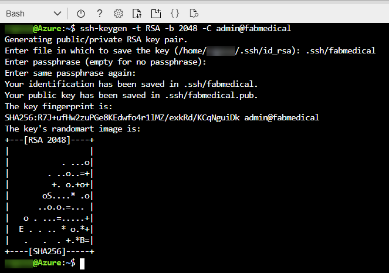
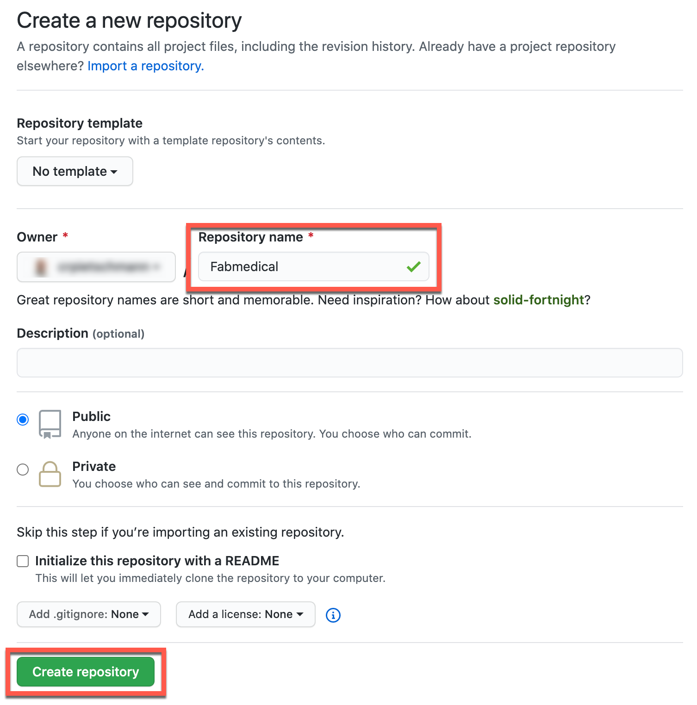

<figcaption aria-hidden="true">
    <font style="vertical-align: inherit;"><font style="vertical-align: inherit;">“微软云研讨会”</font></font>
</figcaption>

<font style="vertical-align: inherit;"><font style="vertical-align: inherit;">云原生应用</font></font>

<font style="vertical-align: inherit;"><font style="vertical-align: inherit;">在动手练习设置指南之前</font></font>

<font style="vertical-align: inherit;"><font style="vertical-align: inherit;">2020年11月</font></font>

<font style="vertical-align: inherit;"><font style="vertical-align: inherit;">本文档中的信息（包括URL和其他Internet网站引用）如有更改，恕不另行通知。</font><font style="vertical-align: inherit;">除非另有说明，否则此处描述的示例公司，组织，产品，域名，电子邮件地址，徽标，人物，地点和事件均为虚构，并且与任何真实的公司，组织，产品，域名，e-邮件地址，徽标，人员，地点或事件是预期的或应该推断的。</font><font style="vertical-align: inherit;">用户有责任遵守所有适用的版权法。</font><font style="vertical-align: inherit;">在不限制版权权利的情况下，不得以任何形式或通过任何方式（电子，机械，影印，记录或其他方式）或以任何方式复制，存储或引入检索系统的本文档的任何部分。未经Microsoft Corporation明确书面许可的目的。</font></font>

<font style="vertical-align: inherit;"><font style="vertical-align: inherit;">Microsoft可能拥有涵盖本文档主题的专利，专利申请，商标，版权或其他知识产权。</font><font style="vertical-align: inherit;">除非Microsoft的任何书面许可协议中有明确规定，否则提供本文档不会授予您对这些专利，商标，版权或其他知识产权的任何许可。</font></font>

<font style="vertical-align: inherit;"><font style="vertical-align: inherit;">制造商，产品或URL的名称仅供参考，Microsoft不对这些制造商或将这些产品与任何Microsoft技术一起使用提供任何明示，暗示或法定的陈述和担保。</font><font style="vertical-align: inherit;">包含制造商或产品并不表示Microsoft认可该制造商或产品。</font><font style="vertical-align: inherit;">链接可能会提供给第三方站点。</font><font style="vertical-align: inherit;">此类网站不受Microsoft的控制，并且Microsoft对任何链接的网站或包含在链接的网站中的任何链接的内容，或对此类网站的任何更改或更新概不负责。</font><font style="vertical-align: inherit;">Microsoft对从任何链接的站点接收到的网络广播或任何其他形式的传输不承担任何责任。</font><font style="vertical-align: inherit;">Microsoft仅为方便起见向您提供这些链接，</font></font>

<font style="vertical-align: inherit;"><font style="vertical-align: inherit;">©2020 Microsoft Corporation。</font><font style="vertical-align: inherit;">版权所有。</font></font>

**<font style="vertical-align: inherit;"><font style="vertical-align: inherit;">内容</font></font>**

<!-- TOC -->

* [<font style="vertical-align: inherit;"><font style="vertical-align: inherit;">动手实验室设置指南之前的云原生应用程序</font></font>](#cloud-native-applications-before-the-hands-on-lab-setup-guide)

    * [<font style="vertical-align: inherit;"><font style="vertical-align: inherit;">要求</font></font>](#requirements)
    * [<font style="vertical-align: inherit;"><font style="vertical-align: inherit;">动手练习之前</font></font>](#before-the-hands-on-lab)

        * [<font style="vertical-align: inherit;"><font style="vertical-align: inherit;">任务1：设置Azure Cloud Shell</font></font>](#task-1-setup-azure-cloud-shell)
        * [<font style="vertical-align: inherit;"><font style="vertical-align: inherit;">任务2：下载入门文件</font></font>](#task-2-download-starter-files)
        * [<font style="vertical-align: inherit;"><font style="vertical-align: inherit;">任务3：资源组</font></font>](#task-3-resource-group)
        * [<font style="vertical-align: inherit;"><font style="vertical-align: inherit;">任务4：创建SSH密钥</font></font>](#task-4-create-an-ssh-key)
        * [<font style="vertical-align: inherit;"><font style="vertical-align: inherit;">任务5：部署ARM模板</font></font>](#task-5-deploy-arm-template)
        * [<font style="vertical-align: inherit;"><font style="vertical-align: inherit;">任务6：创建GitHub存储库</font></font>](#task-6-create-a-github-repository)
        * [<font style="vertical-align: inherit;"><font style="vertical-align: inherit;">任务7：安全地连接到构建代理</font></font>](#task-7-connect-securely-to-the-build-agent)
        * [<font style="vertical-align: inherit;"><font style="vertical-align: inherit;">任务8：完成构建代理的设置</font></font>](#task-8-complete-the-build-agent-setup)
        * [<font style="vertical-align: inherit;"><font style="vertical-align: inherit;">任务9：将存储库克隆到Build Agent</font></font>](#task-9-clone-repositories-to-the-build-agent)

<!-- /TOC -->

# <font style="vertical-align: inherit;"><font style="vertical-align: inherit;">动手实验室设置指南之前的云原生应用程序</font></font>

## <font style="vertical-align: inherit;"><font style="vertical-align: inherit;">要求</font></font>

1.  <font style="vertical-align: inherit;"><font style="vertical-align: inherit;">Microsoft Azure订阅必须为现收现付或MSDN。</font></font>
    * <font style="vertical-align: inherit;"><font style="vertical-align: inherit;">试用订阅将</font></font>_<font style="vertical-align: inherit;"><font style="vertical-align: inherit;">无法</font></font>_
        <font style="vertical-align: inherit;"><font style="vertical-align: inherit;">正常工作。</font></font>

    * <font style="vertical-align: inherit;"><font style="vertical-align: inherit;">要完成此实验设置（包括</font></font>[<font style="vertical-align: inherit;"><font style="vertical-align: inherit;">任务5：创建服务主体</font></font>](#Task-5-Create-a-Service-Principal)
        <font style="vertical-align: inherit;"><font style="vertical-align: inherit;">），请确保您的帐户包括以下内容：</font></font>
        * <font style="vertical-align: inherit;"><font style="vertical-align: inherit;">具有</font><font style="vertical-align: inherit;">您使用的订阅</font><font style="vertical-align: inherit;">的</font></font>[<font style="vertical-align: inherit;"><font style="vertical-align: inherit;">所有者</font></font>](https://docs.microsoft.com/azure/role-based-access-control/built-in-roles#owner)
            <font style="vertical-align: inherit;"><font style="vertical-align: inherit;">内置角色。</font></font>

        * <font style="vertical-align: inherit;"><font style="vertical-align: inherit;">是</font><font style="vertical-align: inherit;">您使用的Azure AD租户中</font><font style="vertical-align: inherit;">的</font></font>[<font style="vertical-align: inherit;"><font style="vertical-align: inherit;">成员</font></font>](https://docs.microsoft.com/azure/active-directory/fundamentals/users-default-permissions#member-and-guest-users)
            <font style="vertical-align: inherit;"><font style="vertical-align: inherit;">用户。</font><font style="vertical-align: inherit;">（来宾用户将没有必要的权限。）</font></font>

        > **<font style="vertical-align: inherit;"><font style="vertical-align: inherit;">注意</font></font>**
        > <font style="vertical-align: inherit;"><font style="vertical-align: inherit;">如果您不满足这些要求，请要求具有订阅所有者权限的另一位成员用户登录到门户网站并执行任务以创建服务主体。</font></font>

    * <font style="vertical-align: inherit;"><font style="vertical-align: inherit;">您的订阅中必须具有足够的可用核心，才能在</font></font>[<font style="vertical-align: inherit;"><font style="vertical-align: inherit;">任务6：部署ARM模板中</font></font>](#Task-6-Deploy-ARM-Template)
        <font style="vertical-align: inherit;"><font style="vertical-align: inherit;">创建生成代理和Azure Kubernetes服务群集</font><font style="vertical-align: inherit;">。</font><font style="vertical-align: inherit;">如果按照实验室中的确切说明进行操作，则将需要八个核心；如果选择其他代理或更大的VM，则将需要八个核心。</font><font style="vertical-align: inherit;">请在练习之前执行所需的步骤，以查看是否需要在您的子服务器中请求更多的内核。</font></font>

2.  <font style="vertical-align: inherit;"><font style="vertical-align: inherit;">Microsoft </font></font>[<font style="vertical-align: inherit;"><font style="vertical-align: inherit;">GitHub上的</font></font>](https://github.com/)
    <font style="vertical-align: inherit;"><font style="vertical-align: inherit;">一个帐户</font><font style="vertical-align: inherit;">。</font></font>

3.  <font style="vertical-align: inherit;"><font style="vertical-align: inherit;">本地计算机或配置有以下内容的虚拟机：</font></font>
    * <font style="vertical-align: inherit;"><font style="vertical-align: inherit;">浏览器，最好是Chrome浏览器，以与实验室实施测试保持一致。</font></font>

4.  <font style="vertical-align: inherit;"><font style="vertical-align: inherit;">在整个练习中，系统将要求您安装其他工具。</font></font>

## <font style="vertical-align: inherit;"><font style="vertical-align: inherit;">动手练习之前</font></font>

**<font style="vertical-align: inherit;"><font style="vertical-align: inherit;">片长</font></font>**
<font style="vertical-align: inherit;"><font style="vertical-align: inherit;">：60分钟</font></font>

<font style="vertical-align: inherit;"><font style="vertical-align: inherit;">您应该先按照本节中提供的所有步骤进行操作，</font></font>_<font style="vertical-align: inherit;"><font style="vertical-align: inherit;">然后再</font></font>_
<font style="vertical-align: inherit;"><font style="vertical-align: inherit;">参加动手练习，因为其中一些步骤需要时间。</font></font>

### <font style="vertical-align: inherit;"><font style="vertical-align: inherit;">任务1：设置Azure Cloud Shell</font></font>

1.  <font style="vertical-align: inherit;"><font style="vertical-align: inherit;">通过选择菜单栏中的云外壳图标来打开云外壳。</font></font>

    
.

     
    <figcaption aria-hidden="true">
        <font style="vertical-align: inherit;"><font style="vertical-align: inherit;">云外壳图标在菜单栏上突出显示。</font></font>
    </figcaption>

2.  <font style="vertical-align: inherit;"><font style="vertical-align: inherit;">云外壳将在浏览器窗口中打开。</font><font style="vertical-align: inherit;">如果出现提示，请</font><font style="vertical-align: inherit;">选择</font></font>**<font style="vertical-align: inherit;"><font style="vertical-align: inherit;">Bash</font></font>**
    <font style="vertical-align: inherit;"><font style="vertical-align: inherit;">或使用Shell菜单栏上的左侧下拉菜单</font><font style="vertical-align: inherit;">从下拉</font><font style="vertical-align: inherit;">菜单中选择</font></font>**<font style="vertical-align: inherit;"><font style="vertical-align: inherit;">Bash</font></font>**
    <font style="vertical-align: inherit;"><font style="vertical-align: inherit;">（如图所示）。</font><font style="vertical-align: inherit;">如果出现提示，请选择</font></font>**<font style="vertical-align: inherit;"><font style="vertical-align: inherit;">确认</font></font>**
    <font style="vertical-align: inherit;"><font style="vertical-align: inherit;">。</font></font>

    
    <figcaption aria-hidden="true">
        <font style="vertical-align: inherit;"><font style="vertical-align: inherit;">这是在浏览器窗口中打开的云外壳的屏幕截图。</font><font style="vertical-align: inherit;">重击被选中。</font></font>
    </figcaption>

3.  <font style="vertical-align: inherit;"><font style="vertical-align: inherit;">您应该确保正确设置默认订阅。</font><font style="vertical-align: inherit;">要查看您当前的订阅类型：</font></font>

    ```
    az account show
    ```

    
    <figcaption aria-hidden="true">
        <font style="vertical-align: inherit;"><font style="vertical-align: inherit;">在Bash窗口的此屏幕快照中，已输入z account show并在命令提示符下运行。</font><font style="vertical-align: inherit;">某些订阅信息在窗口中可见，而某些信息则被遮盖。</font></font>
    </figcaption>

4.  <font style="vertical-align: inherit;"><font style="vertical-align: inherit;">要将默认订阅设置为当前选择以外的其他内容，请键入以下内容，将{id}替换为所需的订阅id值：</font></font>

    ```
    az account set --subscription {id}
    ```

> **<font style="vertical-align: inherit;"><font style="vertical-align: inherit;">注意</font></font>**
> <font style="vertical-align: inherit;"><font style="vertical-align: inherit;">：要列出所有订阅，请键入：</font></font>

```
az account list
```


<figcaption aria-hidden="true">
    <font style="vertical-align: inherit;"><font style="vertical-align: inherit;">在Bash窗口的此屏幕快照中，已输入z帐户列表并在命令提示符下运行。</font><font style="vertical-align: inherit;">某些订阅信息在窗口中可见，而某些信息则被遮盖。</font></font>
</figcaption>

### <font style="vertical-align: inherit;"><font style="vertical-align: inherit;">任务2：下载入门文件</font></font>

<font style="vertical-align: inherit;"><font style="vertical-align: inherit;">在此任务中，您用于</font></font>`git`
<font style="vertical-align: inherit;"><font style="vertical-align: inherit;">将实验室内容复制到您的云外壳中，以便实验室入门文件可用。</font></font>

> **<font style="vertical-align: inherit;"><font style="vertical-align: inherit;">注意</font></font>**
> <font style="vertical-align: inherit;"><font style="vertical-align: inherit;">：如果没有可用的云外壳，请参考</font></font>[<font style="vertical-align: inherit;"><font style="vertical-align: inherit;">任务1：设置Azure云外壳</font></font>](#task-1-setup-azure-cloud-shell)
> <font style="vertical-align: inherit;"><font style="vertical-align: inherit;">。</font></font>

1.  <font style="vertical-align: inherit;"><font style="vertical-align: inherit;">输入以下命令，然后按</font></font>`<ENTER>`
    <font style="vertical-align: inherit;"><font style="vertical-align: inherit;">：</font></font>

    ```
    git clone https://github.com/microsoft/MCW-Cloud-native-applications.git
    ```

    > **<font style="vertical-align: inherit;"><font style="vertical-align: inherit;">注意</font></font>**
    > <font style="vertical-align: inherit;"><font style="vertical-align: inherit;">：如果没有足够的可用空间，则可能需要从云外壳环境中删除多余的文件。</font><font style="vertical-align: inherit;">尝试运行</font></font>`azcopy jobs clean`
    > <font style="vertical-align: inherit;"><font style="vertical-align: inherit;">以删除</font></font>`azcopy`
    > <font style="vertical-align: inherit;"><font style="vertical-align: inherit;">不需要的</font><font style="vertical-align: inherit;">所有</font><font style="vertical-align: inherit;">作业和数据。</font></font>

2.  <font style="vertical-align: inherit;"><font style="vertical-align: inherit;">实验室文件下载。</font></font>

    
    <figcaption aria-hidden="true">
        <font style="vertical-align: inherit;"><font style="vertical-align: inherit;">在此Bash窗口的屏幕快照中，已输入git clone并在命令提示符下运行。</font><font style="vertical-align: inherit;">显示了git clone的输出。</font></font>
    </figcaption>

3.  <font style="vertical-align: inherit;"><font style="vertical-align: inherit;">我们不需要该</font></font>`.git`
    <font style="vertical-align: inherit;"><font style="vertical-align: inherit;">文件夹，如果删除它，以后的步骤将不再那么复杂。</font><font style="vertical-align: inherit;">运行以下命令：</font></font>

    ```
    rm -rf MCW-Cloud-native-applications/.git
    ```

### <font style="vertical-align: inherit;"><font style="vertical-align: inherit;">任务3：资源组</font></font>

<font style="vertical-align: inherit;"><font style="vertical-align: inherit;">创建一个Azure资源组以容纳您在该动手实验中创建的大多数资源。</font><font style="vertical-align: inherit;">这种方法使以后更容易清理。</font></font>

1.  <font style="vertical-align: inherit;"><font style="vertical-align: inherit;">在您的Cloud Shell窗口中，键入与以下命令类似的命令，请确保替换令牌：</font></font>

    > **<font style="vertical-align: inherit;"><font style="vertical-align: inherit;">注意</font></font>**
    > <font style="vertical-align: inherit;"><font style="vertical-align: inherit;">：如果没有可用的云外壳，请参考</font></font>[<font style="vertical-align: inherit;"><font style="vertical-align: inherit;">任务1：设置Azure云外壳</font></font>](#task-1-setup-azure-cloud-shell)
    > <font style="vertical-align: inherit;"><font style="vertical-align: inherit;">。</font></font>

    ```
    az group create -l '[LOCATION]' -n 'fabmedical-[SUFFIX]'
    ```

    * **<font style="vertical-align: inherit;"><font style="vertical-align: inherit;">后缀：</font></font>**
        <font style="vertical-align: inherit;"><font style="vertical-align: inherit;">在整个实验过程中，应使用后缀使资源唯一，例如您的电子邮件前缀或名字的首字母和姓氏。</font></font>

    * **<font style="vertical-align: inherit;"><font style="vertical-align: inherit;">位置：</font></font>**
        <font style="vertical-align: inherit;"><font style="vertical-align: inherit;">选择一个必须所有Azure容器注册表SKU都可用的区域，当前是：加拿大中部，加拿大东部，美国中北部，美国中部，美国中南部，美国东部，美国东部2，美国西部，美国西部2 ，美国中西部，法国中部，英国南部，英国西部，北欧，西欧，澳大利亚东部，澳大利亚东南部，巴西南部，印度中部，印度南部，日本东部，日本西部，韩国中部，东南亚，东亚，并记住这一点以备将来使用，以便您在Azure中创建的资源都保留在同一区域内。</font></font>

    <font style="vertical-align: inherit;"><font style="vertical-align: inherit;">例子：</font></font>

    ```
    az group create -l 'west us' -n 'fabmedical-sol'
    ```

2.  <font style="vertical-align: inherit;"><font style="vertical-align: inherit;">完成此操作后，Azure门户将显示您的资源组。</font></font>

    
    <figcaption aria-hidden="true">
        <font style="vertical-align: inherit;"><font style="vertical-align: inherit;">在Azure门户的此屏幕截图中，列出了fabmedical-sol Resource组。</font></font>
    </figcaption>

### <font style="vertical-align: inherit;"><font style="vertical-align: inherit;">任务4：创建SSH密钥</font></font>

<font style="vertical-align: inherit;"><font style="vertical-align: inherit;">您将在接下来的练习中创建虚拟机。</font><font style="vertical-align: inherit;">在本部分中，您将创建SSH密钥以安全地访问VM。</font></font>

1.  <font style="vertical-align: inherit;"><font style="vertical-align: inherit;">在cloud shell命令行中，输入以下命令以确保SSH密钥的目录存在。</font><font style="vertical-align: inherit;">您可以忽略在输出中看到的任何错误。</font></font>

    > **<font style="vertical-align: inherit;"><font style="vertical-align: inherit;">注意</font></font>**
    > <font style="vertical-align: inherit;"><font style="vertical-align: inherit;">：如果没有可用的云外壳，请参考</font></font>[<font style="vertical-align: inherit;"><font style="vertical-align: inherit;">任务1：设置Azure云外壳</font></font>](#task-1-setup-azure-cloud-shell)
    > <font style="vertical-align: inherit;"><font style="vertical-align: inherit;">。</font></font>

    ```
    mkdir .ssh
    ```

2.  <font style="vertical-align: inherit;"><font style="vertical-align: inherit;">在cloud shell命令行中，输入以下命令以生成SSH密钥对。</font><font style="vertical-align: inherit;">您可以替换</font></font>`admin`
    <font style="vertical-align: inherit;"><font style="vertical-align: inherit;">为您的首选名称或句柄。</font></font>

    ```
    ssh-keygen -t RSA -b 2048 -C admin@fabmedical
    ```

3.  <font style="vertical-align: inherit;"><font style="vertical-align: inherit;">当要求将生成的密钥保存到文件中时，输入</font></font>`.ssh/fabmedical`
    <font style="vertical-align: inherit;"><font style="vertical-align: inherit;">名称。</font></font>

4.  <font style="vertical-align: inherit;"><font style="vertical-align: inherit;">出现提示时输入密码，</font></font>**<font style="vertical-align: inherit;"><font style="vertical-align: inherit;">请不要忘记密码</font></font>**
    <font style="vertical-align: inherit;"><font style="vertical-align: inherit;">！</font></font>

5.  <font style="vertical-align: inherit;"><font style="vertical-align: inherit;">由于您输入的</font></font>`.ssh/fabmedical`
    <font style="vertical-align: inherit;"><font style="vertical-align: inherit;">是ssh-keygen，因此会</font></font>`.ssh`
    <font style="vertical-align: inherit;"><font style="vertical-align: inherit;">在用户文件夹</font><font style="vertical-align: inherit;">的</font><font style="vertical-align: inherit;">文件夹中</font><font style="vertical-align: inherit;">生成文件，</font><font style="vertical-align: inherit;">默认情况下会在其中打开云外壳。</font></font>

    
    <figcaption aria-hidden="true">
        <font style="vertical-align: inherit;"><font style="vertical-align: inherit;">在此Cloud Shell窗口的屏幕快照中，已键入ssh-keygen -t RSA -b 2048 -C admin @ fabmedical并在命令提示符下运行。</font><font style="vertical-align: inherit;">有关生成的密钥的信息出现在窗口中。</font></font>
    </figcaption>

6.  <font style="vertical-align: inherit;"><font style="vertical-align: inherit;">在cloud shell命令行中，输入以下命令以输出公共密钥内容。</font><font style="vertical-align: inherit;">复制此信息以供以后使用。</font></font>

    ```
    cat .ssh/fabmedical.pub
    ```

7.  <font style="vertical-align: inherit;"><font style="vertical-align: inherit;">保持此云外壳打开并保留在默认目录中。</font><font style="vertical-align: inherit;">您将在以后的任务中使用此shell。</font></font>

    
    <figcaption aria-hidden="true">
        <font style="vertical-align: inherit;"><font style="vertical-align: inherit;">在此Cloud Shell窗口的屏幕快照中，已键入cat .ssh / fabmedical并在命令提示符下运行。</font><font style="vertical-align: inherit;">有关公钥内容的信息出现在窗口中。</font></font>
    </figcaption>

### <font style="vertical-align: inherit;"><font style="vertical-align: inherit;">任务5：部署ARM模板</font></font>

<font style="vertical-align: inherit;"><font style="vertical-align: inherit;">在本节中，您将配置并执行一个ARM模板，该模板将创建整个练习所需的所有资源。</font></font>

1.  <font style="vertical-align: inherit;"><font style="vertical-align: inherit;">在Azure云外壳中，切换到ARM模板目录：</font></font>

    > **<font style="vertical-align: inherit;"><font style="vertical-align: inherit;">注意</font></font>**
    > <font style="vertical-align: inherit;"><font style="vertical-align: inherit;">：如果没有可用的云外壳，请参考</font></font>[<font style="vertical-align: inherit;"><font style="vertical-align: inherit;">任务1：设置Azure云外壳</font></font>](#task-1-setup-azure-cloud-shell)
    > <font style="vertical-align: inherit;"><font style="vertical-align: inherit;">。</font></font>

    ```
    cd MCW-Cloud-native-applications/Hands-on\ lab/arm/
    ```

2.  <font style="vertical-align: inherit;"><font style="vertical-align: inherit;">打开azuredeploy.parameters.json文件以使用Azure Cloud Shell编辑器进行编辑。</font></font>

    ```
    code azuredeploy.parameters.json
    ```

    
    <figcaption aria-hidden="true">
        <font style="vertical-align: inherit;"><font style="vertical-align: inherit;">该屏幕快照显示了天蓝色的shell的在线编辑器。</font><font style="vertical-align: inherit;">显示azuredeploy.parameters.json</font></font>
    </figcaption>

3.  <font style="vertical-align: inherit;"><font style="vertical-align: inherit;">更新各种键的值，以使其与您的环境匹配：</font></font>
    * **<font style="vertical-align: inherit;"><font style="vertical-align: inherit;">后缀</font></font>**

        <font style="vertical-align: inherit;"><font style="vertical-align: inherit;">：输入SUFFIX的简化版本，最多3个字符。</font></font>

    * **<font style="vertical-align: inherit;"><font style="vertical-align: inherit;">VirtualMachineAdminUsernameLinux</font></font>**

        <font style="vertical-align: inherit;"><font style="vertical-align: inherit;">：Linux Build Agent VM管理员用户名（示例</font><strong><font style="vertical-align: inherit;">：）</font></strong></font>`"adminfabmedical"`

        <font style="vertical-align: inherit;"><font style="vertical-align: inherit;">。</font></font>

    * **<font style="vertical-align: inherit;"><font style="vertical-align: inherit;">VirtualMachineAdminPublicKeyLinux</font></font>**

        <font style="vertical-align: inherit;"><font style="vertical-align: inherit;">：Linux构建代理程序VM admin ssh公共密钥。</font><font style="vertical-align: inherit;">您可以</font></font>`.ssh/fabmedical.pub`

        <font style="vertical-align: inherit;"><font style="vertical-align: inherit;">在先前创建</font><font style="vertical-align: inherit;">的</font><font style="vertical-align: inherit;">文件中</font><font style="vertical-align: inherit;">找到该值</font><font style="vertical-align: inherit;">（例如：）</font></font>`"ssh-rsa AAAAB3N(...)vPiybQV admin@fabmedical"`

        <font style="vertical-align: inherit;"><font style="vertical-align: inherit;">。</font></font>

    * **<font style="vertical-align: inherit;"><font style="vertical-align: inherit;">CosmosLocation</font></font>**

        <font style="vertical-align: inherit;"><font style="vertical-align: inherit;">：Azure Cosmos数据库的主要位置。</font><font style="vertical-align: inherit;">使用与先前创建的资源组相同的位置（例如：）</font></font>`"eastus"`

        <font style="vertical-align: inherit;"><font style="vertical-align: inherit;">。</font></font>

    * **<font style="vertical-align: inherit;"><font style="vertical-align: inherit;">CosmosLocationName</font></font>**

        <font style="vertical-align: inherit;"><font style="vertical-align: inherit;">：Azure Cosmos数据库的主要位置的名称。</font><font style="vertical-align: inherit;">使用与先前创建的资源组相同的位置的名称（示例：）</font></font>`"East US"`

        <font style="vertical-align: inherit;"><font style="vertical-align: inherit;">。</font></font>

    * **<font style="vertical-align: inherit;"><font style="vertical-align: inherit;">CosmosPairedLocation</font></font>**

        <font style="vertical-align: inherit;"><font style="vertical-align: inherit;">：Azure Cosmos数据库的辅助位置。</font><font style="vertical-align: inherit;">以下链接可用于帮助您找到主要位置的“ Azure区域对”。</font><font style="vertical-align: inherit;">（例如：）</font></font>`"westus"`

        <font style="vertical-align: inherit;"><font style="vertical-align: inherit;">。</font></font>

    * **<font style="vertical-align: inherit;"><font style="vertical-align: inherit;">CosmosPairedLocationName</font></font>**

        <font style="vertical-align: inherit;"><font style="vertical-align: inherit;">：Azure Cosmos数据库的辅助位置的名称。</font><font style="vertical-align: inherit;">使用与上一个键中定义的辅助位置匹配的位置名称（示例：）</font></font>`"West US"`

        <font style="vertical-align: inherit;"><font style="vertical-align: inherit;">。</font></font>

    > **<font style="vertical-align: inherit;"><font style="vertical-align: inherit;">注意</font></font>**
    > <font style="vertical-align: inherit;"><font style="vertical-align: inherit;">：可在此处找到Azure区域对的列表：</font></font>[<font style="vertical-align: inherit;"><font style="vertical-align: inherit;">https</font></font>](https://docs.microsoft.com/en-us/azure/best-practices-availability-paired-regions#azure-regional-pairs)
    > <font style="vertical-align: inherit;"><font style="vertical-align: inherit;"> : </font><a href="https://docs.microsoft.com/en-us/azure/best-practices-availability-paired-regions#azure-regional-pairs" class="uri"><font style="vertical-align: inherit;">//docs.microsoft.com/zh-cn/azure/best-practices-availability-paired-regions#azure-regional-pairs</font></a><font style="vertical-align: inherit;">。</font></font>

4.  <font style="vertical-align: inherit;"><font style="vertical-align: inherit;">选择</font></font>**<font style="vertical-align: inherit;"><font style="vertical-align: inherit;">…</font></font>**
    <font style="vertical-align: inherit;"><font style="vertical-align: inherit;">按钮，然后选择</font></font>**<font style="vertical-align: inherit;"><font style="vertical-align: inherit;">保存</font></font>**
    <font style="vertical-align: inherit;"><font style="vertical-align: inherit;">。</font></font>

    
    <figcaption aria-hidden="true">
        <font style="vertical-align: inherit;"><font style="vertical-align: inherit;">在Azure Cloud Shell编辑器窗口的此屏幕截图中，已选择…按钮，并突出显示了“保存”选项。</font></font>
    </figcaption>

5.  <font style="vertical-align: inherit;"><font style="vertical-align: inherit;">再次</font><font style="vertical-align: inherit;">选择</font></font>**<font style="vertical-align: inherit;"><font style="vertical-align: inherit;">…</font></font>**
    <font style="vertical-align: inherit;"><font style="vertical-align: inherit;">按钮，然后选择</font></font>**<font style="vertical-align: inherit;"><font style="vertical-align: inherit;">关闭编辑器</font></font>**
    <font style="vertical-align: inherit;"><font style="vertical-align: inherit;">。</font></font>

    
    <figcaption aria-hidden="true">
        <font style="vertical-align: inherit;"><font style="vertical-align: inherit;">在Azure Cloud Shell编辑器窗口的此屏幕截图中，已选择…按钮，并突出显示了“关闭编辑器”选项。</font></font>
    </figcaption>

6.  <font style="vertical-align: inherit;"><font style="vertical-align: inherit;">通过键入以下指令（区分大小写）来创建所需的资源，将{resourceGroup}替换为先前创建的资源组的名称：</font></font>

    ```
    az deployment group create --resource-group {resourceGroup} --template-file azuredeploy.json --parameters azuredeploy.parameters.json
    ```

    <font style="vertical-align: inherit;"><font style="vertical-align: inherit;">此命令需要30到60分钟才能部署所有实验室资源。</font><font style="vertical-align: inherit;">在部署运行时，您可以继续执行下一个任务来设置GitHub。</font></font>

    > **<font style="vertical-align: inherit;"><font style="vertical-align: inherit;">注意</font></font>**
    > <font style="vertical-align: inherit;"><font style="vertical-align: inherit;">如果您收到有关Cosmos DB名称的错误，请确保您键入，</font></font>`ComsosLocation`
    > <font style="vertical-align: inherit;"><font style="vertical-align: inherit;">并且</font></font>`CosmosPairedLocation`
    > <font style="vertical-align: inherit;"><font style="vertical-align: inherit;">没有任何空格。</font><font style="vertical-align: inherit;">更正名称后，请重新运行以上命令。</font></font>

### <font style="vertical-align: inherit;"><font style="vertical-align: inherit;">任务6：创建GitHub存储库</font></font>

<font style="vertical-align: inherit;"><font style="vertical-align: inherit;">FabMedical已为您提供了启动文件。</font><font style="vertical-align: inherit;">他们为客户Contoso Neuro制作了网站的副本，并将其从单个node.js站点重构为带有内容API的网站，该API为演讲者和会议提供服务。</font><font style="vertical-align: inherit;">此重构代码是验证其网站的容器化的起点。</font><font style="vertical-align: inherit;">使用它来帮助他们完成POC，该POC验证用于将网站和API作为Docker容器运行并在Azure Kubernetes Service环境中进行管理的开发工作流。</font></font>

1.  <font style="vertical-align: inherit;"><font style="vertical-align: inherit;">打开网络浏览器，然后导航到</font></font>[<font style="vertical-align: inherit;"><font style="vertical-align: inherit;">https://www.github.com</font></font>](https://www.github.com/)
    <font style="vertical-align: inherit;"><font style="vertical-align: inherit;">。</font><font style="vertical-align: inherit;">使用您的GitHub帐户凭据登录。</font></font>

2.  <font style="vertical-align: inherit;"><font style="vertical-align: inherit;">在右上角，展开用户下拉菜单，然后选择</font></font>**<font style="vertical-align: inherit;"><font style="vertical-align: inherit;">您的存储库</font></font>**
    <font style="vertical-align: inherit;"><font style="vertical-align: inherit;">。</font></font>

    
    <figcaption aria-hidden="true">
        <font style="vertical-align: inherit;"><font style="vertical-align: inherit;">展开用户菜单，并选择“您的存储库”项。</font></font>
    </figcaption>

3.  <font style="vertical-align: inherit;"><font style="vertical-align: inherit;">在搜索条件旁边，找到并选择“</font></font>**<font style="vertical-align: inherit;"><font style="vertical-align: inherit;">新建”</font></font>**
    <font style="vertical-align: inherit;"><font style="vertical-align: inherit;">按钮。</font></font>

    
    <figcaption aria-hidden="true">
        <font style="vertical-align: inherit;"><font style="vertical-align: inherit;">将显示GitHub查找存储库搜索条件，并选择“新建”按钮。</font></font>
    </figcaption>

4.  <font style="vertical-align: inherit;"><font style="vertical-align: inherit;">在“</font></font>**<font style="vertical-align: inherit;"><font style="vertical-align: inherit;">创建新存储库”</font></font>**
    <font style="vertical-align: inherit;"><font style="vertical-align: inherit;">屏幕上，将存储库命名为</font></font>**<font style="vertical-align: inherit;"><font style="vertical-align: inherit;">Fabmedical，</font></font>**
    <font style="vertical-align: inherit;"><font style="vertical-align: inherit;">然后选择“</font></font>**<font style="vertical-align: inherit;"><font style="vertical-align: inherit;">创建存储库”</font></font>**
    <font style="vertical-align: inherit;"><font style="vertical-align: inherit;">按钮。</font></font>

    
    <figcaption aria-hidden="true">
        <font style="vertical-align: inherit;"><font style="vertical-align: inherit;">使用“存储库名称”字段创建一个新的存储库页面，并突出显示“创建存储库”按钮。</font></font>
    </figcaption>

5.  <font style="vertical-align: inherit;"><font style="vertical-align: inherit;">在“</font></font>**<font style="vertical-align: inherit;"><font style="vertical-align: inherit;">快速设置”</font></font>**
    <font style="vertical-align: inherit;"><font style="vertical-align: inherit;">屏幕上，复制</font><font style="vertical-align: inherit;">新存储库</font><font style="vertical-align: inherit;">的</font></font>**<font style="vertical-align: inherit;"><font style="vertical-align: inherit;">HTTPS</font></font>**
    <font style="vertical-align: inherit;"><font style="vertical-align: inherit;"> GitHub URL </font><font style="vertical-align: inherit;">，将其</font><font style="vertical-align: inherit;">粘贴到记事本中以备将来使用。</font></font>

    
    <figcaption aria-hidden="true">
        <font style="vertical-align: inherit;"><font style="vertical-align: inherit;">显示快速设置屏幕，并在GitHub URL文本框旁边选择了复制按钮。</font></font>
    </figcaption>

6.  <font style="vertical-align: inherit;"><font style="vertical-align: inherit;">打开一个</font></font>**<font style="vertical-align: inherit;"><font style="vertical-align: inherit;">新的</font></font>**
    <font style="vertical-align: inherit;"><font style="vertical-align: inherit;">Azure Cloud Shell控制台。</font><font style="vertical-align: inherit;">您可以通过</font><font style="vertical-align: inherit;">从第一个控制台中</font><font style="vertical-align: inherit;">选择“</font></font>**<font style="vertical-align: inherit;"><font style="vertical-align: inherit;">打开新会话”</font></font>**
    <font style="vertical-align: inherit;"><font style="vertical-align: inherit;">按钮，或导航到</font></font>[<font style="vertical-align: inherit;"><font style="vertical-align: inherit;">https://shell.azure.com</font></font>](https://shell.azure.com/)
    <font style="vertical-align: inherit;"><font style="vertical-align: inherit;">并使用相同的实验室凭据登录来完成此操作。</font></font>

7.  <font style="vertical-align: inherit;"><font style="vertical-align: inherit;">导航到FabMedical源代码文件夹并列出内容。</font></font>

    ```
    cd ~/MCW-Cloud-native-applications/Hands-on\ lab/lab-files/developer/
    ls
    ```

    > **<font style="vertical-align: inherit;"><font style="vertical-align: inherit;">重要说明</font></font>**
    > <font style="vertical-align: inherit;"><font style="vertical-align: inherit;">：如果您要使用实验室的基础结构版本，请不要使用上述说明，请键入以下内容：</font></font>
    >
    >
    > ```
    > cd ~/MCW-Cloud-native-applications/Hands-on\ lab/lab-files/infrastructure/
    > ls
    > ```
    >
    >
    > <font style="vertical-align: inherit;"><font style="vertical-align: inherit;">这将带您到该版本的实验室将使用的启动程序文件的版本。</font></font>

8.  <font style="vertical-align: inherit;"><font style="vertical-align: inherit;">您将看到清单包括三个文件夹，一个文件夹用于网站，另一个文件夹用于内容API，另一个文件夹用于初始化API数据：</font></font>

    ```
    content-api/
    content-init/
    content-web/
    ```

9.  <font style="vertical-align: inherit;"><font style="vertical-align: inherit;">设置您的用户名和电子邮件，git用于提交。</font></font>

    ```
    git config --global user.email "you@example.com"
    git config --global user.name "Your Name"
    ```

10.  <font style="vertical-align: inherit;"><font style="vertical-align: inherit;">使用Cloud Shell初始化一个新的git存储库：</font></font>

    ```
    git init
    git add .
    git commit -m "Initial Commit"
    ```

11.  <font style="vertical-align: inherit;"><font style="vertical-align: inherit;">通过发出以下命令，将远程来源设置为GitHub URL：</font></font>

    ```
    git remote add origin <your GitHub URL>
    ```

12.  <font style="vertical-align: inherit;"><font style="vertical-align: inherit;">配置git CLI来缓存您的凭据，这样您就不必继续重新键入它们。</font></font>

    ```
    git config --global --unset credential.helper
    git config --global credential.helper store
    ```

13.  <font style="vertical-align: inherit;"><font style="vertical-align: inherit;">通过发出以下命令来推送到master分支：</font></font>

    ```
    git push -u origin master
    ```

    > **<font style="vertical-align: inherit;"><font style="vertical-align: inherit;">注意</font></font>**
    > <font style="vertical-align: inherit;"><font style="vertical-align: inherit;">：如果您具有多因素身份验证，则在使用云外壳时将需要创建个人访问令牌。</font><font style="vertical-align: inherit;">请参考以下链接以获取有关设置GitHub个人访问令牌以用于</font></font>`git`
    > <font style="vertical-align: inherit;"><font style="vertical-align: inherit;">通过您的GitHub帐户</font><font style="vertical-align: inherit;">进行身份验证的帮助</font><font style="vertical-align: inherit;">：</font></font>[<font style="vertical-align: inherit;"><font style="vertical-align: inherit;">https</font></font>](https://docs.github.com/en/github/authenticating-to-github/creating-a-personal-access-token)
    > <font style="vertical-align: inherit;"><font style="vertical-align: inherit;"> : </font><a href="https://docs.github.com/en/github/authenticating-to-github/creating-a-personal-access-token" class="uri"><font style="vertical-align: inherit;">//docs.github.com/en/github/authenticating-to-github/creating-a-personal-access令牌</font></a><font style="vertical-align: inherit;">。</font></font>

    > **<font style="vertical-align: inherit;"><font style="vertical-align: inherit;">注意</font></font>**
    > <font style="vertical-align: inherit;"><font style="vertical-align: inherit;">：获得个人访问令牌后，请重试上述命令，并使用令牌作为密码。</font></font>

14.  <font style="vertical-align: inherit;"><font style="vertical-align: inherit;">刷新您的GitHub存储库，您现在应该看到已发布的代码。</font></font>

### <font style="vertical-align: inherit;"><font style="vertical-align: inherit;">任务7：安全地连接到构建代理</font></font>

<font style="vertical-align: inherit;"><font style="vertical-align: inherit;">在本部分中，您验证可以连接到新的构建代理VM。</font></font>

1.  <font style="vertical-align: inherit;"><font style="vertical-align: inherit;">打开一个</font></font>**<font style="vertical-align: inherit;"><font style="vertical-align: inherit;">新的</font></font>**
    <font style="vertical-align: inherit;"><font style="vertical-align: inherit;">Azure Cloud Shell控制台并运行以下命令以查找运行ARM部署时配置的构建代理VM的IP地址：</font></font>

    > **<font style="vertical-align: inherit;"><font style="vertical-align: inherit;">注意</font></font>**
    > <font style="vertical-align: inherit;"><font style="vertical-align: inherit;">：如果没有可用的云外壳，请参考</font></font>[<font style="vertical-align: inherit;"><font style="vertical-align: inherit;">任务1：设置Azure云外壳</font></font>](#task-1-setup-azure-cloud-shell)
    > <font style="vertical-align: inherit;"><font style="vertical-align: inherit;">。</font></font>

    ```
    az vm show -d -g fabmedical-[SUFFIX] -n fabmedical-[SHORT_SUFFIX] --query publicIps -o tsv
    ```

    <font style="vertical-align: inherit;"><font style="vertical-align: inherit;">例子：</font></font>

    ```
    az vm show -d -g fabmedical-sol -n fabmedical-SOL --query publicIps -o tsv
    ```

2.  <font style="vertical-align: inherit;"><font style="vertical-align: inherit;">在云外壳输出中，记下VM的公共IP地址。</font></font>

    
    <figcaption aria-hidden="true">
        <font style="vertical-align: inherit;"><font style="vertical-align: inherit;">将显示云外壳窗口，其中显示了“公共IP”地址。</font></font>
    </figcaption>

3.  <font style="vertical-align: inherit;"><font style="vertical-align: inherit;">通过键入以下命令连接到您创建的新VM：</font></font>

    ```
    ssh -i [PRIVATEKEYNAME] [BUILDAGENTUSERNAME]@[BUILDAGENTIP]
    ```

    <font style="vertical-align: inherit;"><font style="vertical-align: inherit;">替换命令中带括号的值，如下所示：</font></font>
    * `[PRIVATEKEYNAME]`
        <font style="vertical-align: inherit;"><font style="vertical-align: inherit;">：使用</font></font>`.ssh/fabmedical`
        <font style="vertical-align: inherit;"><font style="vertical-align: inherit;">上面创建</font><font style="vertical-align: inherit;">的私钥名称</font><font style="vertical-align: inherit;">。</font></font>

    * `[BUILDAGENTUSERNAME]`
        <font style="vertical-align: inherit;"><font style="vertical-align: inherit;">：使用VM的用户名，默认设置为</font></font>`adminfabmedical`
        <font style="vertical-align: inherit;"><font style="vertical-align: inherit;">。</font></font>

    * `[BUILDAGENTIP]`
        <font style="vertical-align: inherit;"><font style="vertical-align: inherit;">：在上一步中检索到的构建代理VM的IP地址。</font></font>

    ```
    ssh -i .ssh/fabmedical adminfabmedical@52.174.141.11
    ```

4.  <font style="vertical-align: inherit;"><font style="vertical-align: inherit;">当要求您确认是否要连接时，由于无法验证连接的真实性，请键入</font></font>`yes`
    <font style="vertical-align: inherit;"><font style="vertical-align: inherit;">。</font></font>

5.  <font style="vertical-align: inherit;"><font style="vertical-align: inherit;">当询问您先前创建的私钥的密码短语时，请输入此值。</font></font>

6.  <font style="vertical-align: inherit;"><font style="vertical-align: inherit;">SSH连接到VM，并显示命令提示符，如下所示。</font><font style="vertical-align: inherit;">保持此云外壳窗口打开以进行下一步：</font></font>

    `adminfabmedical@fabmedical-SUFFIX:~$`

    
    <figcaption aria-hidden="true">
        <font style="vertical-align: inherit;"><font style="vertical-align: inherit;">在Cloud Shell窗口的此屏幕快照中，已键入ssh -i .ssh / fabmedical adminfabmedical@52.174.141.11并在命令提示符下运行。</font><font style="vertical-align: inherit;">上面详细说明的信息出现在窗口中。</font></font>
    </figcaption>

> **<font style="vertical-align: inherit;"><font style="vertical-align: inherit;">注意</font></font>**
> <font style="vertical-align: inherit;"><font style="vertical-align: inherit;">：如果连接时遇到问题，则可能已将SSH公钥错误地粘贴到了ARM模板中。</font><font style="vertical-align: inherit;">不幸的是，在这种情况下，您将不得不重新创建VM，然后重试。</font></font>

### <font style="vertical-align: inherit;"><font style="vertical-align: inherit;">任务8：完成构建代理的设置</font></font>

<font style="vertical-align: inherit;"><font style="vertical-align: inherit;">在此任务中，您将更新软件包并安装Docker引擎。</font></font>

1.  <font style="vertical-align: inherit;"><font style="vertical-align: inherit;">转到已打开与构建代理VM的SSH连接的云外壳窗口。</font></font>

2.  <font style="vertical-align: inherit;"><font style="vertical-align: inherit;">通过在单行命令中键入以下内容，只需一步即可更新Ubuntu软件包，并通过HTTPS安装curl和对存储库的支持。</font></font>`Y`
    <font style="vertical-align: inherit;"><font style="vertical-align: inherit;">如果询问您是否要继续，请</font><font style="vertical-align: inherit;">键入</font><font style="vertical-align: inherit;">并按Enter进行</font><font style="vertical-align: inherit;">响应</font><font style="vertical-align: inherit;">。</font></font>

    ```
    sudo apt-get update && sudo apt install apt-transport-https ca-certificates curl software-properties-common
    ```

    > **<font style="vertical-align: inherit;"><font style="vertical-align: inherit;">注意</font></font>**
    > <font style="vertical-align: inherit;"><font style="vertical-align: inherit;">：这是一行。</font></font>

3.  <font style="vertical-align: inherit;"><font style="vertical-align: inherit;">通过在单行命令中键入以下命令来添加Docker的官方GPG密钥：</font></font>

    ```
    curl -fsSL https://download.docker.com/linux/ubuntu/gpg | sudo apt-key add -
    ```

4.  <font style="vertical-align: inherit;"><font style="vertical-align: inherit;">通过在单行命令中键入以下命令，将Docker的稳定存储库添加到Ubuntu软件包列表：</font></font>

    ```
    sudo add-apt-repository "deb [arch=amd64] https://download.docker.com/linux/ubuntu $(lsb_release -cs) stable"
    ```

5.  <font style="vertical-align: inherit;"><font style="vertical-align: inherit;">添加NodeJs PPA以使用NodeJS LTS发行版并更新Ubuntu软件包，并通过键入以下命令来安装Docker引擎，node.js和节点包管理器，每个命令均位于各自的行中。</font><font style="vertical-align: inherit;">如果询问您是否要继续，请键入</font></font>`Y`
    <font style="vertical-align: inherit;"><font style="vertical-align: inherit;">并按Enter</font><font style="vertical-align: inherit;">进行响应</font><font style="vertical-align: inherit;">。</font></font>

    ```
    sudo apt-get install curl python-software-properties -y

    curl -sL https://deb.nodesource.com/setup_12.x | sudo -E bash -

    sudo apt-get update && sudo apt-get install -y docker-ce nodejs mongodb-clients
    ```

6.  <font style="vertical-align: inherit;"><font style="vertical-align: inherit;">现在，通过在单行命令中键入以下命令，将Ubuntu软件包升级到最新版本。</font></font>

    ```
    sudo apt-get upgrade -y
    ```

7.  <font style="vertical-align: inherit;"><font style="vertical-align: inherit;">命令完成后，通过执行此命令检查安装的Docker版本。</font><font style="vertical-align: inherit;">输出可能类似于以下屏幕截图所示。</font><font style="vertical-align: inherit;">请注意，服务器版本尚未显示，因为您没有以提升的权限运行命令（稍后将解决）。</font></font>

    ```
    docker version
    ```

    
    <figcaption aria-hidden="true">
        <font style="vertical-align: inherit;"><font style="vertical-align: inherit;">在Cloud Shell窗口的此屏幕截图中，已键入docker版本并在命令提示符下运行。</font><font style="vertical-align: inherit;">Docker版本信息将显示在窗口中。</font></font>
    </figcaption>

8.  <font style="vertical-align: inherit;"><font style="vertical-align: inherit;">您也可以使用以下命令检查node.js和npm的版本，以供参考：</font></font>

    ```
    nodejs --version

    npm -version
    ```

9.  <font style="vertical-align: inherit;"><font style="vertical-align: inherit;">安装Angular CLI。</font></font>

    ```
    sudo npm install -g @angular/cli
    ```

10.  <font style="vertical-align: inherit;"><font style="vertical-align: inherit;">要删除使用sudo的要求，请将您的用户添加到Docker组。</font><font style="vertical-align: inherit;">您可以忽略在输出中看到的任何错误。</font></font>

    ```
    sudo usermod -aG docker $USER
    ```

    
    <figcaption aria-hidden="true">
        <font style="vertical-align: inherit;"><font style="vertical-align: inherit;">在Cloud Shell窗口的此屏幕快照中，已在命令提示符下键入并运行了sudo usermod -aG docker $ USER。</font><font style="vertical-align: inherit;">错误出现在窗口中。</font></font>
    </figcaption>

11.  <font style="vertical-align: inherit;"><font style="vertical-align: inherit;">为了使用户权限更改生效，请通过键入退出SSH会话</font></font>`exit`
    <font style="vertical-align: inherit;"><font style="vertical-align: inherit;">，然后按&lt;Enter&gt;键。</font><font style="vertical-align: inherit;">像在上一个任务中一样，使用SSH重新连接到构建代理VM。</font></font>

    ```
    ssh -i .ssh/fabmedical adminfabmedical@52.174.141.11
    ```

12.  <font style="vertical-align: inherit;"><font style="vertical-align: inherit;">重复该</font></font>`docker version`
    <font style="vertical-align: inherit;"><font style="vertical-align: inherit;">命令，并注意输出现在也显示了服务器版本。</font></font>

    
    <figcaption aria-hidden="true">
        <font style="vertical-align: inherit;"><font style="vertical-align: inherit;">在Cloud Shell窗口的此屏幕截图中，已键入docker版本并在命令提示符下运行。</font><font style="vertical-align: inherit;">除了服务器版本信息外，该窗口中还将显示Docker版本信息。</font></font>
    </figcaption>

13.  <font style="vertical-align: inherit;"><font style="vertical-align: inherit;">运行一些Docker命令：</font></font>
    * <font style="vertical-align: inherit;"><font style="vertical-align: inherit;">看看当前是否有任何容器在运行。</font></font>

        ```
        docker container ls
        ```

    * <font style="vertical-align: inherit;"><font style="vertical-align: inherit;">一看是否存在容器，是否正在运行。</font></font>

        ```
        docker container ls -a
        ```

14.  <font style="vertical-align: inherit;"><font style="vertical-align: inherit;">在这两种情况下，运行命令时您都有一个空列表，但没有错误。</font><font style="vertical-align: inherit;">您的构建代理已准备就绪，Docker引擎可以正常运行。</font></font>

    
    <figcaption aria-hidden="true">
        <font style="vertical-align: inherit;"><font style="vertical-align: inherit;">在此Cloud Shell窗口的屏幕快照中，已经键入了docker容器ls并在命令提示符下运行，以及docker容器ls -a命令也是如此。</font></font>
    </figcaption>

### <font style="vertical-align: inherit;"><font style="vertical-align: inherit;">任务9：将存储库克隆到Build Agent</font></font>

<font style="vertical-align: inherit;"><font style="vertical-align: inherit;">在此任务中，您将从GitHub克隆存储库，以便可以在构建代理上使用它们。</font></font>

1.  <font style="vertical-align: inherit;"><font style="vertical-align: inherit;">就像您之前在Cloud Shell中所做的那样，设置用于git commit的用户名和电子邮件。</font></font>

    ```
    git config --global user.email "you@example.com"
    git config --global user.name "Your Name"
    ```

    > **<font style="vertical-align: inherit;"><font style="vertical-align: inherit;">注意</font></font>**
    > <font style="vertical-align: inherit;"><font style="vertical-align: inherit;">：在某些情况下，</font></font>`root`
    > <font style="vertical-align: inherit;"><font style="vertical-align: inherit;">用户拥有您用户的</font></font>`.config`
    > <font style="vertical-align: inherit;"><font style="vertical-align: inherit;">文件夹。</font><font style="vertical-align: inherit;">如果发生这种情况，请运行以下命令将所有权返回给它</font></font>`adminfabmedical`
    > <font style="vertical-align: inherit;"><font style="vertical-align: inherit;">，然后重试该</font></font>`git`
    > <font style="vertical-align: inherit;"><font style="vertical-align: inherit;">命令：</font></font>
    >
    >
    > ```
    > sudo chown -R $USER:$(id -gn $USER) /home/adminfabmedical/.config
    > ```
    >

2.  <font style="vertical-align: inherit;"><font style="vertical-align: inherit;">配置git CLI来缓存您的凭据，这样您就不必继续重新键入它们。</font></font>

    ```
    git config --global credential.helper cache
    ```

    > **<font style="vertical-align: inherit;"><font style="vertical-align: inherit;">注意</font></font>**
    > <font style="vertical-align: inherit;"><font style="vertical-align: inherit;">：在某些情况下，</font></font>`root`
    > <font style="vertical-align: inherit;"><font style="vertical-align: inherit;">用户拥有您用户的</font></font>`.config`
    > <font style="vertical-align: inherit;"><font style="vertical-align: inherit;">文件夹。</font><font style="vertical-align: inherit;">如果发生这种情况，请运行以下命令将所有权返回给它</font></font>`adminfabmedical`
    > <font style="vertical-align: inherit;"><font style="vertical-align: inherit;">，然后重试该</font></font>`git`
    > <font style="vertical-align: inherit;"><font style="vertical-align: inherit;">命令：</font></font>
    >
    >
    > ```
    > sudo chown -R $USER:$(id -gn $USER) /home/adminfabmedical/.config
    > ```
    >

3.  <font style="vertical-align: inherit;"><font style="vertical-align: inherit;">使用GitHub URL将存储库代码克隆到构建代理计算机。</font></font>

    ```
    git clone <GITHUB_REPOSITORY_URL>
    ```

    > **<font style="vertical-align: inherit;"><font style="vertical-align: inherit;">注意</font></font>**
    > <font style="vertical-align: inherit;"><font style="vertical-align: inherit;">：在某些情况下，</font></font>`root`
    > <font style="vertical-align: inherit;"><font style="vertical-align: inherit;">用户拥有您用户的</font></font>`.config`
    > <font style="vertical-align: inherit;"><font style="vertical-align: inherit;">文件夹。</font><font style="vertical-align: inherit;">如果发生这种情况，请运行以下命令将所有权返回给它</font></font>`adminfabmedical`
    > <font style="vertical-align: inherit;"><font style="vertical-align: inherit;">，然后重试该</font></font>`git`
    > <font style="vertical-align: inherit;"><font style="vertical-align: inherit;">命令：</font></font>
    >
    >
    > ```
    > sudo chown -R $USER:$(id -gn $USER) /home/adminfabmedical/.config
    > ```
    >

<font style="vertical-align: inherit;"></font>_<font style="vertical-align: inherit;"><font style="vertical-align: inherit;">在</font></font>_
<font style="vertical-align: inherit;"><font style="vertical-align: inherit;">执行动手练习</font><em><font style="vertical-align: inherit;">之前，</font></em><font style="vertical-align: inherit;">您应该按照提供的所有步骤</font><font style="vertical-align: inherit;">进行操作。</font></font>
