<font style="vertical-align: inherit;"><font style="vertical-align: inherit;">云原生应用动手实验-基础架构版</font></font>

<font style="vertical-align: inherit;"><font style="vertical-align: inherit;">逐步动手练习</font></font>

<font style="vertical-align: inherit;"><font style="vertical-align: inherit;">2020年11月</font></font>

<font style="vertical-align: inherit;"><font style="vertical-align: inherit;">本文档中的信息（包括URL和其他Internet网站引用）如有更改，恕不另行通知。</font><font style="vertical-align: inherit;">除非另有说明，否则此处描述的示例公司，组织，产品，域名，电子邮件地址，徽标，人物，地点和事件均为虚构，并且与任何真实的公司，组织，产品，域名，e-邮件地址，徽标，人员，地点或事件是预期的或应该推断的。</font><font style="vertical-align: inherit;">用户有责任遵守所有适用的版权法。</font><font style="vertical-align: inherit;">在不限制版权权利的情况下，不得以任何形式或通过任何方式（电子，机械，影印，记录或其他方式）或以任何方式复制，存储或引入检索系统的本文档的任何部分。未经Microsoft Corporation明确书面许可的目的。</font></font>

<font style="vertical-align: inherit;"><font style="vertical-align: inherit;">Microsoft可能拥有涵盖本文档主题的专利，专利申请，商标，版权或其他知识产权。</font><font style="vertical-align: inherit;">除非Microsoft的任何书面许可协议中有明确规定，否则提供本文档不会授予您对这些专利，商标，版权或其他知识产权的任何许可。</font></font>

<font style="vertical-align: inherit;"><font style="vertical-align: inherit;">制造商，产品或URL的名称仅供参考，Microsoft不对这些制造商或将这些产品与任何Microsoft技术一起使用提供任何明示，暗示或法定的陈述和担保。</font><font style="vertical-align: inherit;">包含制造商或产品并不表示Microsoft认可该制造商或产品。</font><font style="vertical-align: inherit;">链接可能会提供给第三方站点。</font><font style="vertical-align: inherit;">此类网站不受Microsoft的控制，并且Microsoft对任何链接的网站或包含在链接的网站中的任何链接的内容，或对此类网站的任何更改或更新概不负责。</font><font style="vertical-align: inherit;">Microsoft对从任何链接的站点接收到的网络广播或任何其他形式的传输不承担任何责任。</font><font style="vertical-align: inherit;">Microsoft仅为方便起见向您提供这些链接，</font></font>

<font style="vertical-align: inherit;"><font style="vertical-align: inherit;">©2020 Microsoft Corporation。</font><font style="vertical-align: inherit;">版权所有。</font></font>

<font style="vertical-align: inherit;"><font style="vertical-align: inherit;">Microsoft和https://www.microsoft.com/zh-cn/legal/intellectualproperty/Trademarks/Usage/General.aspx上列出的商标是Microsoft集团公司的商标。</font><font style="vertical-align: inherit;">所有其他商标均为其各自所有者的财产。</font></font>

**<font style="vertical-align: inherit;"><font style="vertical-align: inherit;">内容</font></font>**

<!-- TOC -->

* [<font style="vertical-align: inherit;"><font style="vertical-align: inherit;">云原生应用程序-基础架构版动手实验室</font></font>](#cloud-native-applications---infrastructure-edition-hands-on-lab-step-by-step)

    * [<font style="vertical-align: inherit;"><font style="vertical-align: inherit;">摘要和学习目标</font></font>](#abstract-and-learning-objectives)
    * [<font style="vertical-align: inherit;"><font style="vertical-align: inherit;">概述</font></font>](#overview)
    * [<font style="vertical-align: inherit;"><font style="vertical-align: inherit;">解决方案架构</font></font>](#solution-architecture)
    * [<font style="vertical-align: inherit;"><font style="vertical-align: inherit;">要求</font></font>](#requirements)
    * [<font style="vertical-align: inherit;"><font style="vertical-align: inherit;">练习1：创建并运行Docker应用程序</font></font>](#exercise-1-create-and-run-a-docker-application)

        * [<font style="vertical-align: inherit;"><font style="vertical-align: inherit;">任务1：测试应用程序</font></font>](#task-1-test-the-application)
        * [<font style="vertical-align: inherit;"><font style="vertical-align: inherit;">任务2：浏览到Web应用程序</font></font>](#task-2-browsing-to-the-web-application)
        * [<font style="vertical-align: inherit;"><font style="vertical-align: inherit;">任务3：创建Docker映像</font></font>](#task-3-create-docker-images)
        * [<font style="vertical-align: inherit;"><font style="vertical-align: inherit;">任务4：运行容器化的应用程序</font></font>](#task-4-run-a-containerized-application)
        * [<font style="vertical-align: inherit;"><font style="vertical-align: inherit;">任务5：设置环境变量</font></font>](#task-5-setup-environment-variables)
        * [<font style="vertical-align: inherit;"><font style="vertical-align: inherit;">任务6：将映像推送到Azure容器注册表</font></font>](#task-6-push-images-to-azure-container-registry)
        * [<font style="vertical-align: inherit;"><font style="vertical-align: inherit;">任务7：设置CI管道以推送图像</font></font>](#task-7-setup-ci-pipeline-to-push-images)

    * [<font style="vertical-align: inherit;"><font style="vertical-align: inherit;">练习2：使用Azure数据库迁移服务将MongoDB迁移到Cosmos DB</font></font>](#exercise-2-migrate-mongodb-to-cosmos-db-using-azure-database-migration-service)

        * [<font style="vertical-align: inherit;"><font style="vertical-align: inherit;">任务1：启用Microsoft.DataMigration资源提供程序</font></font>](#task-1-enable-microsoftdatamigration-resource-provider)
        * [<font style="vertical-align: inherit;"><font style="vertical-align: inherit;">任务2：置备Azure数据库迁移服务</font></font>](#task-2-provision-azure-database-migration-service)
        * [<font style="vertical-align: inherit;"><font style="vertical-align: inherit;">任务3：将数据迁移到Azure Cosmos DB</font></font>](#task-3-migrate-data-to-azure-cosmos-db)

    * [<font style="vertical-align: inherit;"><font style="vertical-align: inherit;">练习3：将解决方案部署到Azure Kubernetes服务</font></font>](#exercise-3-deploy-the-solution-to-azure-kubernetes-service)

        * [<font style="vertical-align: inherit;"><font style="vertical-align: inherit;">任务1：隧道进入Azure Kubernetes服务群集</font></font>](#task-1-tunnel-into-the-azure-kubernetes-service-cluster)
        * [<font style="vertical-align: inherit;"><font style="vertical-align: inherit;">任务2：使用Azure门户部署服务</font></font>](#task-2-deploy-a-service-using-the-azure-portal)
        * [<font style="vertical-align: inherit;"><font style="vertical-align: inherit;">任务3：使用kubectl部署服务</font></font>](#task-3-deploy-a-service-using-kubectl)
        * [<font style="vertical-align: inherit;"><font style="vertical-align: inherit;">任务4：使用Helm图表部署服务</font></font>](#task-4-deploy-a-service-using-a-helm-chart)
        * [<font style="vertical-align: inherit;"><font style="vertical-align: inherit;">任务5：配置持续交付到Kubernetes集群</font></font>](#task-5-configure-continuous-delivery-to-the-kubernetes-cluster)
        * [<font style="vertical-align: inherit;"><font style="vertical-align: inherit;">任务6：查看用于容器的Azure监视器</font></font>](#task-6-review-azure-monitor-for-containers)

    * [<font style="vertical-align: inherit;"><font style="vertical-align: inherit;">练习4：扩展应用程序并测试HA</font></font>](#exercise-4-scale-the-application-and-test-ha)

        * [<font style="vertical-align: inherit;"><font style="vertical-align: inherit;">任务1：从Azure门户增加服务实例</font></font>](#task-1-increase-service-instances-from-the-azure-portal)
        * [<font style="vertical-align: inherit;"><font style="vertical-align: inherit;">任务2：解决副本的置备失败</font></font>](#task-2-resolve-failed-provisioning-of-replicas)
        * [<font style="vertical-align: inherit;"><font style="vertical-align: inherit;">任务3：重新启动容器并测试HA</font></font>](#task-3-restart-containers-and-test-ha)
        * [<font style="vertical-align: inherit;"><font style="vertical-align: inherit;">任务4：配置Cosmos DB自动缩放</font></font>](#task-4-configure-cosmos-db-autoscale)
        * [<font style="vertical-align: inherit;"><font style="vertical-align: inherit;">任务5：测试Cosmos DB自动缩放</font></font>](#task-5-test-cosmos-db-autoscale)

    * [<font style="vertical-align: inherit;"><font style="vertical-align: inherit;">练习5：使用服务和路由应用程序流量</font></font>](#exercise-5-working-with-services-and-routing-application-traffic)

        * [<font style="vertical-align: inherit;"><font style="vertical-align: inherit;">任务1：更新外部服务以通过负载均衡器支持动态发现</font></font>](#task-1-update-an-external-service-to-support-dynamic-discovery-with-a-load-balancer)
        * [<font style="vertical-align: inherit;"><font style="vertical-align: inherit;">任务2：调整CPU约束以提高规模</font></font>](#task-2-adjust-cpu-constraints-to-improve-scale)
        * [<font style="vertical-align: inherit;"><font style="vertical-align: inherit;">任务3：执行滚动更新</font></font>](#task-3-perform-a-rolling-update)
        * [<font style="vertical-align: inherit;"><font style="vertical-align: inherit;">任务4：配置Kubernetes入口</font></font>](#task-4-configure-kubernetes-ingress)
        * [<font style="vertical-align: inherit;"><font style="vertical-align: inherit;">任务5：使用流量管理器进行多区域负载平衡</font></font>](#task-5-multi-region-load-balancing-with-traffic-manager)

    * [<font style="vertical-align: inherit;"><font style="vertical-align: inherit;">动手实验后</font></font>](#after-the-hands-on-lab)

<!-- /TOC -->

# <font style="vertical-align: inherit;"><font style="vertical-align: inherit;">云原生应用程序-基础架构版动手实验室</font></font>

## <font style="vertical-align: inherit;"><font style="vertical-align: inherit;">摘要和学习目标</font></font>

<font style="vertical-align: inherit;"><font style="vertical-align: inherit;">该动手实验旨在指导您完成将Docker映像构建和部署到Azure Kubernetes Services（AKS）上托管的Kubernetes平台的过程，此外还学习如何使用动态服务发现，服务扩展和高可用性。</font></font>

<font style="vertical-align: inherit;"><font style="vertical-align: inherit;">在本实验结束时，您将能够更好地构建容器化的应用程序并将其部署到Azure Kubernetes Service并执行常见的DevOps过程。</font></font>

## <font style="vertical-align: inherit;"><font style="vertical-align: inherit;">概述</font></font>

<font style="vertical-align: inherit;"><font style="vertical-align: inherit;">Fabrikam Medical Conferences（FabMedical）提供适合医学界的会议网站服务。</font><font style="vertical-align: inherit;">他们正在基于node.js重构其应用程序代码，以便它可以作为Docker应用程序运行，并希望实现POC，以帮助他们熟悉开发过程，部署的生命周期以及托管的关键方面。环境。</font><font style="vertical-align: inherit;">他们将把应用程序部署到Azure Kubernetes Service，并希望学习如何以动态负载平衡的方式部署容器，发现容器并按需扩展它们。</font></font>

<font style="vertical-align: inherit;"><font style="vertical-align: inherit;">在本动手实验中，您将通过一部分应用程序代码库来帮助完成此POC。</font><font style="vertical-align: inherit;">您将基于Linux和用于运行已部署应用程序的Azure Kubernetes Service群集创建一个构建代理。</font><font style="vertical-align: inherit;">您将帮助他们完成其应用程序的Docker设置，本地测试，推送到映像存储库，部署到集群以及测试负载平衡和扩展。</font></font>

> **<font style="vertical-align: inherit;"><font style="vertical-align: inherit;">重要说明</font></font>**
> <font style="vertical-align: inherit;"><font style="vertical-align: inherit;">：大多数Azure资源都需要唯一的名称。</font><font style="vertical-align: inherit;">在这些步骤中，您将在资源名称中看到单词“ SUFFIX”。</font><font style="vertical-align: inherit;">您应该用唯一的句柄（例如您的Microsoft帐户电子邮件前缀）替换它，以确保资源的唯一名称。</font></font>

## <font style="vertical-align: inherit;"><font style="vertical-align: inherit;">解决方案架构</font></font>

<font style="vertical-align: inherit;"><font style="vertical-align: inherit;">下面是您将在本实验中构建的解决方案体系结构的图表。</font><font style="vertical-align: inherit;">请仔细研究此内容，以便在处理各种组件时了解整个解决方案。</font></font>

<font style="vertical-align: inherit;"><font style="vertical-align: inherit;">该解决方案将使用Azure Kubernetes服务（AKS），这意味着将根据请求的节点数来配置容器群集拓扑。</font><font style="vertical-align: inherit;">下面以Cosmos DB作为托管服务说明了部署到集群的拟议容器：</font></font>


<figcaption aria-hidden="true">
    <font style="vertical-align: inherit;"><font style="vertical-align: inherit;">该图显示了解决方案，将Azure Kubernetes服务与Cosmos DB后端配合使用。</font></font>
</figcaption>

<font style="vertical-align: inherit;"><font style="vertical-align: inherit;">每个租户将拥有以下容器：</font></font>

* **<font style="vertical-align: inherit;"><font style="vertical-align: inherit;">会议网站</font></font>**
    <font style="vertical-align: inherit;"><font style="vertical-align: inherit;">：SPA应用程序，它将使用配置设置来处理租户的自定义样式。</font></font>

* **<font style="vertical-align: inherit;"><font style="vertical-align: inherit;">Admin Web站点</font></font>**
    <font style="vertical-align: inherit;"><font style="vertical-align: inherit;">：会议所有者使用的SPA应用程序，用于管理会议配置详细信息，管理与会者注册，管理活动以及与与会者通信。</font></font>

* **<font style="vertical-align: inherit;"><font style="vertical-align: inherit;">注册服务</font></font>**
    <font style="vertical-align: inherit;"><font style="vertical-align: inherit;">：处理所有注册活动的API，使用适当的软件包选择和相关费用创建新的会议注册。</font></font>

* **<font style="vertical-align: inherit;"><font style="vertical-align: inherit;">电子邮件服务</font></font>**
    <font style="vertical-align: inherit;"><font style="vertical-align: inherit;">：用于在注册过程中或会议所有者选择通过其管理站点吸引与会者时处理向与会者发送电子邮件通知的API。</font></font>

* **<font style="vertical-align: inherit;"><font style="vertical-align: inherit;">Config服务</font></font>**
    <font style="vertical-align: inherit;"><font style="vertical-align: inherit;">：用于处理会议配置设置的API，例如日期，位置，价格表，特价促销，倒计时等。</font></font>

* **<font style="vertical-align: inherit;"><font style="vertical-align: inherit;">内容服务</font></font>**
    <font style="vertical-align: inherit;"><font style="vertical-align: inherit;">：处理会议内容的API，例如演讲者，会议，研讨会和赞助者。</font></font>

## <font style="vertical-align: inherit;"><font style="vertical-align: inherit;">要求</font></font>

1.  <font style="vertical-align: inherit;"><font style="vertical-align: inherit;">Microsoft Azure订阅必须为现收现付或MSDN。</font></font>
    * <font style="vertical-align: inherit;"><font style="vertical-align: inherit;">试用订阅将</font></font>_<font style="vertical-align: inherit;"><font style="vertical-align: inherit;">无法</font></font>_
        <font style="vertical-align: inherit;"><font style="vertical-align: inherit;">正常工作。</font></font>

    * <font style="vertical-align: inherit;"><font style="vertical-align: inherit;">要完成此实验，请确保您的帐户具有以下角色：</font></font>
        * <font style="vertical-align: inherit;"><font style="vertical-align: inherit;">您将使用的Azure订阅</font><font style="vertical-align: inherit;">的</font></font>[<font style="vertical-align: inherit;"><font style="vertical-align: inherit;">所有者</font></font>](https://docs.microsoft.com/azure/role-based-access-control/built-in-roles#owner)
            <font style="vertical-align: inherit;"><font style="vertical-align: inherit;">内置角色。</font></font>

        * <font style="vertical-align: inherit;"><font style="vertical-align: inherit;">是</font><font style="vertical-align: inherit;">您将使用的Azure AD租户中</font><font style="vertical-align: inherit;">的</font></font>[<font style="vertical-align: inherit;"><font style="vertical-align: inherit;">成员</font></font>](https://docs.microsoft.com/azure/active-directory/fundamentals/users-default-permissions#member-and-guest-users)
            <font style="vertical-align: inherit;"><font style="vertical-align: inherit;">用户。</font><font style="vertical-align: inherit;">（来宾用户将没有必要的权限。）</font></font>

        > **<font style="vertical-align: inherit;"><font style="vertical-align: inherit;">注意</font></font>**
        > <font style="vertical-align: inherit;"><font style="vertical-align: inherit;">如果您不满足这些要求，则可能必须要求具有订阅所有者权限的其他成员用户登录到门户网站并提前执行创建服务主体步骤。</font></font>

    * <font style="vertical-align: inherit;"><font style="vertical-align: inherit;">您的订阅中必须具有足够的可用核心，才能在动手实验之前创建生成代理和Azure Kubernetes服务群集。</font><font style="vertical-align: inherit;">如果按照实验室中的确切说明进行操作，则将需要八个内核；如果选择其他群集节点或更大的VM，则将需要八个内核。</font><font style="vertical-align: inherit;">如果您在练习之前执行了所需的步骤，您将能够查看是否需要在子目录中请求更多的核心。</font></font>

2.  <font style="vertical-align: inherit;"><font style="vertical-align: inherit;">本地计算机或配置有以下内容的虚拟机：</font></font>
    * <font style="vertical-align: inherit;"><font style="vertical-align: inherit;">浏览器，最好是Chrome浏览器，以与实验室实施测试保持一致。</font></font>

3.  <font style="vertical-align: inherit;"><font style="vertical-align: inherit;">在整个练习中，您将安装其他工具。</font></font>

> **<font style="vertical-align: inherit;"><font style="vertical-align: inherit;">非常重要</font></font>**
> <font style="vertical-align: inherit;"><font style="vertical-align: inherit;">：您应该输入指南中显示的所有命令。</font><font style="vertical-align: inherit;">指示输入本文档中显示的信息时，请勿尝试将其复制并粘贴到命令窗口或其他文档中，除非本文档中有明确说明。</font><font style="vertical-align: inherit;">复制和粘贴可能会导致错误，指令执行或文件内容创建。</font></font>

## <font style="vertical-align: inherit;"><font style="vertical-align: inherit;">练习1：创建并运行Docker应用程序</font></font>

**<font style="vertical-align: inherit;"><font style="vertical-align: inherit;">片长</font></font>**
<font style="vertical-align: inherit;"><font style="vertical-align: inherit;">：40分钟</font></font>

<font style="vertical-align: inherit;"><font style="vertical-align: inherit;">在本练习中，您将获取入门文件并将node.js应用程序作为Docker应用程序运行。</font><font style="vertical-align: inherit;">您将创建一个Dockerfile，构建Docker映像并运行容器以执行该应用程序。</font></font>

### <font style="vertical-align: inherit;"><font style="vertical-align: inherit;">任务1：测试应用程序</font></font>

<font style="vertical-align: inherit;"><font style="vertical-align: inherit;">该任务的目的是确保在应用更改以将其作为Docker应用程序运行之前，您可以成功运行该应用程序。</font></font>

1.  <font style="vertical-align: inherit;"><font style="vertical-align: inherit;">如果尚未连接，请从Azure Cloud Shell连接到构建代理。</font><font style="vertical-align: inherit;">（如果需要重新连接，请查看“ HOL之前”文档中的说明。）</font></font>

2.  <font style="vertical-align: inherit;"><font style="vertical-align: inherit;">键入以下命令以创建一个名为的Docker网络</font></font>`fabmedical`
    <font style="vertical-align: inherit;"><font style="vertical-align: inherit;">：</font></font>

    ```
    docker network create fabmedical
    ```

3.  <font style="vertical-align: inherit;"><font style="vertical-align: inherit;">运行mongodb实例以用于本地测试。</font></font>

    ```
    docker container run --name mongo --net fabmedical -p 27017:27017 -d mongo:4.0
    ```

    > **<font style="vertical-align: inherit;"><font style="vertical-align: inherit;">注意</font></font>**
    > <font style="vertical-align: inherit;"><font style="vertical-align: inherit;">：使用为MongoDB编写的现有源代码，可以将其指向Azure Cosmos DB MongoDB API终结点。</font><font style="vertical-align: inherit;">Azure Cosmos DB仿真器可用于Windows上的本地开发。</font><font style="vertical-align: inherit;">但是，Cosmos DB仿真器不支持Linux。</font><font style="vertical-align: inherit;">结果，当使用Linux进行开发时，本地开发环境仍然需要MongoDB。</font><font style="vertical-align: inherit;">与Azure Cosmos DB一起用于云中的数据存储。</font><font style="vertical-align: inherit;">这使得为​​MongoDB存储编写的现有源代码可以轻松地迁移到使用Azure Cosmos DB后端。</font></font>

4.  <font style="vertical-align: inherit;"><font style="vertical-align: inherit;">确认mongo容器正在运行并准备就绪。</font></font>

    ```
    docker container list
    docker container logs mongo
    ```

    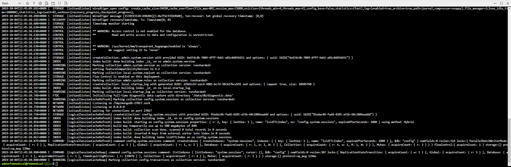
    <figcaption aria-hidden="true">
        <font style="vertical-align: inherit;"><font style="vertical-align: inherit;">在控制台窗口的此屏幕快照中，已键入docker容器列表并在命令提示符下运行，并且该列表中包含“ api”容器。</font><font style="vertical-align: inherit;">在此下方显示日志输出。</font></font>
    </figcaption>

5.  <font style="vertical-align: inherit;"><font style="vertical-align: inherit;">使用mongo shell连接到mongo实例并测试一些基本命令：</font></font>

    ```
    mongo
    ```

    ```
    show dbs
    quit()
    ```

    
    <figcaption aria-hidden="true">
        <font style="vertical-align: inherit;"><font style="vertical-align: inherit;">控制台窗口的此屏幕快照显示了连接到mongo的输出。</font></font>
    </figcaption>

6.  <font style="vertical-align: inherit;"><font style="vertical-align: inherit;">要使用测试内容初始化本地数据库，请首先导航到content-init目录，然后运行npm install。</font></font>

    ```
    cd ~/Fabmedical/content-init
    npm install
    ```

    > **<font style="vertical-align: inherit;"><font style="vertical-align: inherit;">注意</font></font>**
    > <font style="vertical-align: inherit;"><font style="vertical-align: inherit;">：在某些情况下，</font></font>`root`
    > <font style="vertical-align: inherit;"><font style="vertical-align: inherit;">将为用户分配用户</font></font>`.config`
    > <font style="vertical-align: inherit;"><font style="vertical-align: inherit;">文件夹的</font><font style="vertical-align: inherit;">所有权</font><font style="vertical-align: inherit;">。</font><font style="vertical-align: inherit;">如果发生这种情况，请运行以下命令将所有权返回给它</font></font>`adminfabmedical`
    > <font style="vertical-align: inherit;"><font style="vertical-align: inherit;">，然后重试</font></font>`npm install`
    > <font style="vertical-align: inherit;"><font style="vertical-align: inherit;">：</font></font>

    ```
    sudo chown -R $USER:$(id -gn $USER) /home/adminfabmedical/.config
    ```

7.  <font style="vertical-align: inherit;"><font style="vertical-align: inherit;">初始化数据库。</font></font>

    ```
    nodejs server.js
    ```

    
    <figcaption aria-hidden="true">
        <font style="vertical-align: inherit;"><font style="vertical-align: inherit;">控制台窗口的此屏幕快照显示了运行数据库初始化的输出。</font></font>
    </figcaption>

8.  <font style="vertical-align: inherit;"><font style="vertical-align: inherit;">确认数据库现在包含测试数据。</font></font>

    ```
    mongo
    ```

    ```
    show dbs
    use contentdb
    show collections
    db.speakers.find()
    db.sessions.find()
    quit()
    ```

    <font style="vertical-align: inherit;"><font style="vertical-align: inherit;">这将产生类似于以下内容的输出：</font></font>

    
    <figcaption aria-hidden="true">
        <font style="vertical-align: inherit;"><font style="vertical-align: inherit;">控制台窗口的此屏幕快照显示了数据输出。</font></font>
    </figcaption>

9.  <font style="vertical-align: inherit;"><font style="vertical-align: inherit;">现在导航到该</font></font>`content-api`
    <font style="vertical-align: inherit;"><font style="vertical-align: inherit;">目录并运行npm install。</font></font>

    ```
    cd ../content-api
    npm install
    ```

    > **<font style="vertical-align: inherit;"><font style="vertical-align: inherit;">注意</font></font>**
    > <font style="vertical-align: inherit;"><font style="vertical-align: inherit;">：在某些情况下，</font></font>`root`
    > <font style="vertical-align: inherit;"><font style="vertical-align: inherit;">将为用户分配用户</font></font>`.config`
    > <font style="vertical-align: inherit;"><font style="vertical-align: inherit;">文件夹的</font><font style="vertical-align: inherit;">所有权</font><font style="vertical-align: inherit;">。</font><font style="vertical-align: inherit;">如果发生这种情况，请运行以下命令将所有权返回给它</font></font>`adminfabmedical`
    > <font style="vertical-align: inherit;"><font style="vertical-align: inherit;">，然后重试</font></font>`npm install`
    > <font style="vertical-align: inherit;"><font style="vertical-align: inherit;">：</font></font>

    ```
    sudo chown -R $USER:$(id -gn $USER) /home/adminfabmedical/.config
    ```

10.  <font style="vertical-align: inherit;"><font style="vertical-align: inherit;">启动API作为后台进程。</font></font>

    ```
    nodejs ./server.js &
    ```

    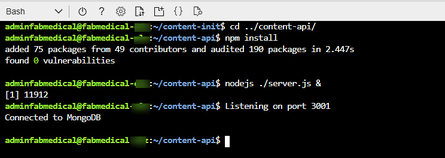
    <figcaption aria-hidden="true">
        <font style="vertical-align: inherit;"><font style="vertical-align: inherit;">在此屏幕快照中，已键入nodejs ./server.js＆并在命令提示符下运行，这将启动API作为后台进程。</font></font>
    </figcaption>

11.  <font style="vertical-align: inherit;"><font style="vertical-align: inherit;">再按</font></font>`ENTER`
    <font style="vertical-align: inherit;"><font style="vertical-align: inherit;">一次，进入下一步的命令提示符。</font></font>

12.  <font style="vertical-align: inherit;"><font style="vertical-align: inherit;">使用curl测试API。</font><font style="vertical-align: inherit;">您将请求发言人的内容，这将返回JSON结果。</font></font>

    ```
    curl http://localhost:3001/speakers
    ```

    
    <figcaption aria-hidden="true">
        <font style="vertical-align: inherit;"><font style="vertical-align: inherit;">在此屏幕截图中，发出了卷曲请求以查看扬声器。</font></font>
    </figcaption>

13.  <font style="vertical-align: inherit;"><font style="vertical-align: inherit;">导航到Web应用程序目录，然后运行</font></font>`npm install`
    <font style="vertical-align: inherit;"><font style="vertical-align: inherit;">和</font></font>`ng build`
    <font style="vertical-align: inherit;"><font style="vertical-align: inherit;">。</font></font>

    ```
    cd ../content-web
    npm install
    ng build
    ```

    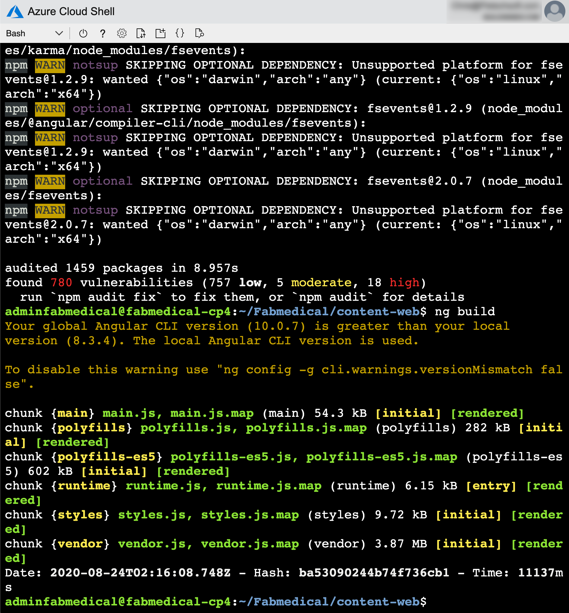
    <figcaption aria-hidden="true">
        <font style="vertical-align: inherit;"><font style="vertical-align: inherit;">在此屏幕快照中，导航到Web应用程序目录后，已键入nodejs ./server.js＆并在命令提示符下运行，该命令提示符也将应用程序作为后台进程运行。</font></font>
    </figcaption>

    > **<font style="vertical-align: inherit;"><font style="vertical-align: inherit;">注意</font></font>**
    > <font style="vertical-align: inherit;"><font style="vertical-align: inherit;">：在某些情况下，</font></font>`root`
    > <font style="vertical-align: inherit;"><font style="vertical-align: inherit;">将为用户分配用户</font></font>`.config`
    > <font style="vertical-align: inherit;"><font style="vertical-align: inherit;">文件夹的</font><font style="vertical-align: inherit;">所有权</font><font style="vertical-align: inherit;">。</font><font style="vertical-align: inherit;">如果发生这种情况，请运行以下命令将所有权返回给它</font></font>`adminfabmedical`
    > <font style="vertical-align: inherit;"><font style="vertical-align: inherit;">，然后重试</font></font>`npm install`
    > <font style="vertical-align: inherit;"><font style="vertical-align: inherit;">：</font></font>

    ```
    sudo chown -R $USER:$(id -gn $USER) /home/adminfabmedical/.config
    ```

14.  <font style="vertical-align: inherit;"><font style="vertical-align: inherit;">在Azure云外壳中，运行以下命令以查找运行ARM部署时配置的构建代理VM的IP地址。</font></font>

    ```
    az vm show -d -g fabmedical-[SUFFIX] -n fabmedical-[SHORT_SUFFIX] --query publicIps -o tsv
    ```

    <font style="vertical-align: inherit;"><font style="vertical-align: inherit;">例子：</font></font>

    ```
    az vm show -d -g fabmedical-sol -n fabmedical-SOL --query publicIps -o tsv
    ```

15.  <font style="vertical-align: inherit;"><font style="vertical-align: inherit;">在构建机器的云外壳中，</font></font>`app.js`
    <font style="vertical-align: inherit;"><font style="vertical-align: inherit;">使用vim</font><font style="vertical-align: inherit;">编辑</font><font style="vertical-align: inherit;">文件。</font></font>

    ```
    vim app.js
    ```

    <font style="vertical-align: inherit;"><font style="vertical-align: inherit;">然后按</font></font>**_<font style="vertical-align: inherit;"><font style="vertical-align: inherit;">i</font></font>_**
    <font style="vertical-align: inherit;"><font style="vertical-align: inherit;">进入编辑模式，然后将localhost替换为构建计算机的IP地址。</font></font>

    
    <figcaption aria-hidden="true">
        <font style="vertical-align: inherit;"><font style="vertical-align: inherit;">在构建机器的vim中编辑app.js文件以更新API URL。</font></font>
    </figcaption>

    <font style="vertical-align: inherit;"><font style="vertical-align: inherit;">然后按</font></font>**_<font style="vertical-align: inherit;"><font style="vertical-align: inherit;">ESC</font></font>_**
    <font style="vertical-align: inherit;"><font style="vertical-align: inherit;">，输入</font></font>**_<font style="vertical-align: inherit;"><font style="vertical-align: inherit;">：wq</font></font>_**
    <font style="vertical-align: inherit;"><font style="vertical-align: inherit;">保存更改并关闭文件。</font></font>

16.  <font style="vertical-align: inherit;"><font style="vertical-align: inherit;">现在，在后台运行content-web应用程序。</font></font>

    ```
    node ./app.js &
    ```

    <font style="vertical-align: inherit;"><font style="vertical-align: inherit;">再按</font></font>`ENTER`
    <font style="vertical-align: inherit;"><font style="vertical-align: inherit;">一次可获得下一步的命令提示符。</font></font>

17.  <font style="vertical-align: inherit;"><font style="vertical-align: inherit;">使用curl测试Web应用程序。</font><font style="vertical-align: inherit;">您将看到返回的HTML输出没有错误。</font></font>

    ```
    curl http://localhost:3000
    ```

18.  <font style="vertical-align: inherit;"><font style="vertical-align: inherit;">让应用程序运行以执行下一个任务。</font></font>

19.  <font style="vertical-align: inherit;"><font style="vertical-align: inherit;">如果您收到了对/ speakers内容请求的JSON响应和来自Web应用程序的HTML响应，则您的环境正在按预期工作。</font></font>

### <font style="vertical-align: inherit;"><font style="vertical-align: inherit;">任务2：浏览到Web应用程序</font></font>

<font style="vertical-align: inherit;"><font style="vertical-align: inherit;">在此任务中，您将浏览到Web应用程序以进行测试。</font></font>

1.  <font style="vertical-align: inherit;"><font style="vertical-align: inherit;">在Azure门户中，选择您创建的名为的资源组</font></font>`fabmedical-SUFFIX`
    <font style="vertical-align: inherit;"><font style="vertical-align: inherit;">。</font></font>

2.  <font style="vertical-align: inherit;"></font>`fabmedical-SUFFIX`
    <font style="vertical-align: inherit;"><font style="vertical-align: inherit;">从可用资源列表中选择</font><font style="vertical-align: inherit;">命名的构建代理VM </font><font style="vertical-align: inherit;">。</font></font>

    
    <figcaption aria-hidden="true">
        <font style="vertical-align: inherit;"><font style="vertical-align: inherit;">在此可用资源列表的屏幕快照中，选择了第一项，其名称，类型和位置具有以下值：fabmedical-soll（红色箭头指向该名称），虚拟机和美国东部2。</font></font>
    </figcaption>

3.  <font style="vertical-align: inherit;"><font style="vertical-align: inherit;">在“</font></font>**<font style="vertical-align: inherit;"><font style="vertical-align: inherit;">虚拟机”</font></font>**
    <font style="vertical-align: inherit;"><font style="vertical-align: inherit;">刀片服务器概述中，找到</font><font style="vertical-align: inherit;">VM</font><font style="vertical-align: inherit;">的</font></font>**<font style="vertical-align: inherit;"><font style="vertical-align: inherit;">IP地址</font></font>**
    <font style="vertical-align: inherit;"><font style="vertical-align: inherit;">。</font></font>

    
    <figcaption aria-hidden="true">
        <font style="vertical-align: inherit;"><font style="vertical-align: inherit;">在虚拟机刀片中，在左侧选择概述，在右侧突出显示公共IP地址52.174.141.11。</font></font>
    </figcaption>

4.  <font style="vertical-align: inherit;"><font style="vertical-align: inherit;">从浏览器测试Web应用程序。</font><font style="vertical-align: inherit;">使用端口处的构建代理IP地址导航到Web应用程序</font></font>`3000`
    <font style="vertical-align: inherit;"><font style="vertical-align: inherit;">。</font></font>

    ```
    http://[BUILDAGENTIP]:3000

    EXAMPLE: http://13.68.113.176:3000
    ```

5.  <font style="vertical-align: inherit;"><font style="vertical-align: inherit;">选择标题中的“发言人和会话”链接。</font><font style="vertical-align: inherit;">您将看到页面显示您先前卷曲的JSON内容的HTML版本。</font></font>

6.  <font style="vertical-align: inherit;"><font style="vertical-align: inherit;">确认可以通过浏览器访问该应用程序后，转到您的Cloud Shell窗口并停止正在运行的节点进程。</font></font>

    ```
    killall nodejs
    killall node
    ```

### <font style="vertical-align: inherit;"><font style="vertical-align: inherit;">任务3：创建Docker映像</font></font>

<font style="vertical-align: inherit;"><font style="vertical-align: inherit;">在此任务中，您将为该应用程序创建Docker映像-一个用于API应用程序，另一个用于Web应用程序。</font><font style="vertical-align: inherit;">每个映像将通过依赖Dockerfile的Docker命令创建。</font></font>

1.  <font style="vertical-align: inherit;"><font style="vertical-align: inherit;">在连接到构建代理VM的云外壳中，键入以下命令以查看VM上的所有Docker映像。</font><font style="vertical-align: inherit;">该列表将仅包含先前下载的mongodb映像。</font></font>

    ```
    docker image ls
    ```

2.  <font style="vertical-align: inherit;"><font style="vertical-align: inherit;">在</font></font>`content-api`
    <font style="vertical-align: inherit;"><font style="vertical-align: inherit;">包含API应用程序文件和</font></font>`Dockerfile`
    <font style="vertical-align: inherit;"><font style="vertical-align: inherit;">您创建</font><font style="vertical-align: inherit;">的新文件夹的文件夹中</font><font style="vertical-align: inherit;">，键入以下命令以为API应用程序创建Docker映像。</font><font style="vertical-align: inherit;">该命令执行以下操作：</font></font>
    * <font style="vertical-align: inherit;"><font style="vertical-align: inherit;">执行Docker build命令生成镜像</font></font>

    * <font style="vertical-align: inherit;"><font style="vertical-align: inherit;">使用名称content-api（-t）标记生成的图像</font></font>

    * <font style="vertical-align: inherit;"><font style="vertical-align: inherit;">最后一个点（</font></font>`.`
        <font style="vertical-align: inherit;"><font style="vertical-align: inherit;">）表示在当前目录上下文中使用Dockerfile。</font><font style="vertical-align: inherit;">默认情况下，此文件应具有名称</font></font>`Dockerfile`
        <font style="vertical-align: inherit;"><font style="vertical-align: inherit;">（区分大小写）。</font></font>

    ```
    docker image build -t content-api .
    ```

3.  <font style="vertical-align: inherit;"><font style="vertical-align: inherit;">映像成功构建后，再次运行Docker images listing命令。</font><font style="vertical-align: inherit;">您将看到几个新图像：节点图像和您的容器图像。</font></font>

    ```
    docker image ls
    ```

    <font style="vertical-align: inherit;"><font style="vertical-align: inherit;">注意未标记的图像。</font><font style="vertical-align: inherit;">这是构建阶段，其中包含最终映像中不需要的所有中间文件。</font></font>

    
    <figcaption aria-hidden="true">
        <font style="vertical-align: inherit;"><font style="vertical-align: inherit;">节点图像（节点）和您的容器图像（content-api）在控制台窗口的此屏幕截图中可见。</font></font>
    </figcaption>

4.  <font style="vertical-align: inherit;"></font>`content-web`
    <font style="vertical-align: inherit;"><font style="vertical-align: inherit;">再次</font><font style="vertical-align: inherit;">导航到该</font><font style="vertical-align: inherit;">文件夹并列出文件。</font><font style="vertical-align: inherit;">请注意，此文件夹具有一个Dockerfile。</font></font>

    ```
    cd ../content-web
    ll
    ```

5.  <font style="vertical-align: inherit;"><font style="vertical-align: inherit;">查看Dockerfile内容–与您先前在API文件夹中创建的文件相似。</font><font style="vertical-align: inherit;">输入以下命令：</font></font>

    ```
    cat Dockerfile
    ```

    > <font style="vertical-align: inherit;"><font style="vertical-align: inherit;">请注意，</font></font>`content-web`
    > <font style="vertical-align: inherit;"><font style="vertical-align: inherit;">Dockerfile构建阶段除了安装npm软件包之外，还包括用于前端Angular应用程序的其他工具。</font></font>

6.  <font style="vertical-align: inherit;"><font style="vertical-align: inherit;">键入以下命令为Web应用程序创建Docker映像。</font></font>

    ```
    docker image build -t content-web .
    ```

7.  <font style="vertical-align: inherit;"><font style="vertical-align: inherit;">再次导航到content-init文件夹并列出文件。</font><font style="vertical-align: inherit;">请注意，该文件夹已经有一个Dockerfile。</font></font>

    ```
    cd ../content-init
    ll
    ```

8.  <font style="vertical-align: inherit;"><font style="vertical-align: inherit;">查看Dockerfile内容–与您先前在API文件夹中创建的文件相似。</font><font style="vertical-align: inherit;">输入以下命令：</font></font>

    ```
    cat Dockerfile
    ```

9.  <font style="vertical-align: inherit;"><font style="vertical-align: inherit;">键入以下命令为init应用程序创建Docker映像。</font></font>

    ```
    docker image build -t content-init .
    ```

10.  <font style="vertical-align: inherit;"><font style="vertical-align: inherit;">完成后，当您运行Docker images命令时，您将看到现在存在八个映像。</font></font>

```
docker image ls
```


<figcaption aria-hidden="true">
    <font style="vertical-align: inherit;"><font style="vertical-align: inherit;">现在在控制台窗口的此屏幕快照中可以看到三个图像：content-init，content-web，content-api和node。</font></font>
</figcaption>

### <font style="vertical-align: inherit;"><font style="vertical-align: inherit;">任务4：运行容器化的应用程序</font></font>

<font style="vertical-align: inherit;"><font style="vertical-align: inherit;">Web应用程序容器将是API应用程序容器公开的调用端点，并且API应用程序容器将与mongodb通信。</font><font style="vertical-align: inherit;">在本练习中，您将在启动mongodb时在创建的同一网桥网络上启动作为容器创建的映像。</font></font>

1.  <font style="vertical-align: inherit;"><font style="vertical-align: inherit;">使用以下命令创建并启动API应用程序容器。</font><font style="vertical-align: inherit;">该命令执行以下操作：</font></font>
    * <font style="vertical-align: inherit;"><font style="vertical-align: inherit;">命名容器</font></font>`api`
        <font style="vertical-align: inherit;"><font style="vertical-align: inherit;">以供以后使用Docker命令参考。</font></font>

    * <font style="vertical-align: inherit;"><font style="vertical-align: inherit;">指示Docker引擎使用</font></font>`fabmedical`
        <font style="vertical-align: inherit;"><font style="vertical-align: inherit;">网络。</font></font>

    * <font style="vertical-align: inherit;"><font style="vertical-align: inherit;">指示Docker引擎使用端口</font></font>`3001`
        <font style="vertical-align: inherit;"><font style="vertical-align: inherit;">并将其映射到内部容器端口</font></font>`3001`
        <font style="vertical-align: inherit;"><font style="vertical-align: inherit;">。</font></font>

    * <font style="vertical-align: inherit;"><font style="vertical-align: inherit;">根据指定图像的标签（例如）从其创建容器</font></font>`content-api`
        <font style="vertical-align: inherit;"><font style="vertical-align: inherit;">。</font></font>

    ```
    docker container run --name api --net fabmedical -p 3001:3001 content-api
    ```

2.  <font style="vertical-align: inherit;"><font style="vertical-align: inherit;">该</font></font>`docker container run`
    <font style="vertical-align: inherit;"><font style="vertical-align: inherit;">命令失败，因为它已配置为使用本地主机URL连接到mongodb。</font><font style="vertical-align: inherit;">但是，现在content-api被隔离在单独的容器中，即使在同一docker主机上运行，​​它也无法通过localhost访问mongodb。</font><font style="vertical-align: inherit;">相反，API必须使用网桥网络连接到mongodb。</font></font>

    ```
    > content-api@0.0.0 start
    > node ./server.js

    Listening on port 3001
    Could not connect to MongoDB!
    MongooseServerSelectionError: connect ECONNREFUSED 127.0.0.1:27017
    npm notice
    npm notice New patch version of npm available! 7.0.8 -> 7.0.13
    npm notice Changelog: <https://github.com/npm/cli/releases/tag/v7.0.13>
    npm notice Run `npm install -g npm@7.0.13` to update!
    npm notice
    npm ERR! code 255
    npm ERR! path /usr/src/app
    npm ERR! command failed
    npm ERR! command sh -c node ./server.js

    npm ERR! A complete log of this run can be found in:
    npm ERR!     /root/.npm/_logs/2020-11-23T03_04_12_948Z-debug.log
    ```

3.  <font style="vertical-align: inherit;"><font style="vertical-align: inherit;">content-api应用程序允许环境变量配置mongodb连接字符串。</font><font style="vertical-align: inherit;">删除现有容器，然后通过将</font></font>`-e`
    <font style="vertical-align: inherit;"><font style="vertical-align: inherit;">开关</font><font style="vertical-align: inherit;">添加</font><font style="vertical-align: inherit;">到</font></font>`docker container run`
    <font style="vertical-align: inherit;"><font style="vertical-align: inherit;">命令</font><font style="vertical-align: inherit;">来指示docker引擎设置环境变量</font><font style="vertical-align: inherit;">。</font><font style="vertical-align: inherit;">另外，使用</font></font>`-d`
    <font style="vertical-align: inherit;"><font style="vertical-align: inherit;">开关将api作为守护程序运行。</font></font>

    ```
    docker container rm api
    docker container run --name api --net fabmedical -p 3001:3001 -e MONGODB_CONNECTION=mongodb://mongo:27017/contentdb -d content-api
    ```

4.  <font style="vertical-align: inherit;"><font style="vertical-align: inherit;">输入命令以显示正在运行的容器。</font><font style="vertical-align: inherit;">您将看到该</font></font>`api`
    <font style="vertical-align: inherit;"><font style="vertical-align: inherit;">容器在列表中。</font><font style="vertical-align: inherit;">使用docker logs命令查看API应用程序已连接到mongodb。</font></font>

    ```
    docker container ls
    docker container logs api
    ```

    
    <figcaption aria-hidden="true">
        <font style="vertical-align: inherit;"><font style="vertical-align: inherit;">在控制台窗口的此屏幕快照中，已在命令提示符下键入并运行了docker容器ls，并且“ api”容器在列表中，具有以下值，分别是容器ID，图像，命令，已创建，状态，端口和名称：458d47f2aaf1，content-api，“ docker-entrypoint.s…”，37秒钟前，最多36秒钟，0.0.0.0：3001-&gt; 3001 / tcp和api。</font></font>
    </figcaption>

5.  <font style="vertical-align: inherit;"><font style="vertical-align: inherit;">通过卷曲URL来测试API。</font><font style="vertical-align: inherit;">您将看到与先前测试时一样的JSON输出。</font></font>

    ```
    curl http://localhost:3001/speakers
    ```

6.  <font style="vertical-align: inherit;"><font style="vertical-align: inherit;">使用类似的</font></font>`docker container run`
    <font style="vertical-align: inherit;"><font style="vertical-align: inherit;">命令</font><font style="vertical-align: inherit;">创建并启动Web应用程序容器</font><font style="vertical-align: inherit;">–指示Docker引擎在</font></font>`-P`
    <font style="vertical-align: inherit;"><font style="vertical-align: inherit;">命令中</font><font style="vertical-align: inherit;">使用任何端口</font><font style="vertical-align: inherit;">。</font></font>

    ```
    docker container run --name web --net fabmedical -P -d content-web
    ```

7.  <font style="vertical-align: inherit;"><font style="vertical-align: inherit;">输入命令以再次显示正在运行的容器，您将观察到API和Web容器都在列表中。</font><font style="vertical-align: inherit;">Web容器显示一个动态分配的端口映射到其内部容器端口</font></font>`3000`
    <font style="vertical-align: inherit;"><font style="vertical-align: inherit;">。</font></font>

    ```
    docker container ls
    ```

    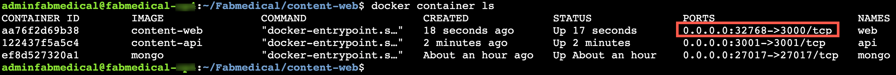
    <figcaption aria-hidden="true">
        <font style="vertical-align: inherit;"><font style="vertical-align: inherit;">在控制台窗口的此屏幕快照中，再次输入了docker容器ls并在命令提示符下运行。</font><font style="vertical-align: inherit;">0.0.0.0:32768-&gt;3000/tcp在端口下突出显示。</font></font>
    </figcaption>

8.  <font style="vertical-align: inherit;"><font style="vertical-align: inherit;">通过使用curl获取URL来测试Web应用程序。</font><font style="vertical-align: inherit;">对于端口，请使用动态分配的端口，您可以在上一个命令的输出中找到该端口。</font><font style="vertical-align: inherit;">与以前的测试一样，您将看到HTML输出。</font></font>

    ```
    curl http://localhost:[PORT]/speakers.html
    ```

### <font style="vertical-align: inherit;"><font style="vertical-align: inherit;">任务5：设置环境变量</font></font>

<font style="vertical-align: inherit;"><font style="vertical-align: inherit;">在此任务中，您将</font></font>`web`
<font style="vertical-align: inherit;"><font style="vertical-align: inherit;">使用环境变量</font><font style="vertical-align: inherit;">将</font><font style="vertical-align: inherit;">容器</font><font style="vertical-align: inherit;">配置为</font><font style="vertical-align: inherit;">与API容器进行通信，类似于将mongodb连接字符串提供给api的方式。</font></font>

1.  <font style="vertical-align: inherit;"><font style="vertical-align: inherit;">从连接到构建代理程序VM的云外壳中，使用以下命令停止并删除Web容器。</font></font>

    ```
    docker container stop web
    docker container rm web
    ```

2.  <font style="vertical-align: inherit;"><font style="vertical-align: inherit;">使用</font></font>`-a`
    <font style="vertical-align: inherit;"><font style="vertical-align: inherit;">此命令中所示</font><font style="vertical-align: inherit;">的</font><font style="vertical-align: inherit;">标志</font><font style="vertical-align: inherit;">来验证Web容器不再运行或存在</font><font style="vertical-align: inherit;">。</font><font style="vertical-align: inherit;">您将看到该</font></font>`web`
    <font style="vertical-align: inherit;"><font style="vertical-align: inherit;">容器不再列出。</font></font>

    ```
    docker container ls -a
    ```

3.  <font style="vertical-align: inherit;"><font style="vertical-align: inherit;">查看</font></font>`app.js`
    <font style="vertical-align: inherit;"><font style="vertical-align: inherit;">文件。</font></font>

    ```
    cd ../content-web
    cat app.js
    ```

4.  <font style="vertical-align: inherit;"><font style="vertical-align: inherit;">请注意，</font></font>`contentApiUrl`
    <font style="vertical-align: inherit;"><font style="vertical-align: inherit;">可以使用环境变量来设置该变量。</font></font>

    ```
    const contentApiUrl = process.env.CONTENT_API_URL || "http://localhost:3001";
    ```

5.  <font style="vertical-align: inherit;"><font style="vertical-align: inherit;">打开Dockerfile以使用Vim进行编辑，然后</font></font>`i`
    <font style="vertical-align: inherit;"><font style="vertical-align: inherit;">按键进入编辑模式。</font></font>

    ```
    vi Dockerfile
    <i>
    ```

6.  <font style="vertical-align: inherit;"><font style="vertical-align: inherit;">找到</font></font>`EXPOSE`
    <font style="vertical-align: inherit;"><font style="vertical-align: inherit;">以下所示的行，并在其上方添加一行，以设置环境变量的默认值，如屏幕截图所示。</font></font>

    ```
    ENV CONTENT_API_URL http://localhost:3001
    ```

    
    <figcaption aria-hidden="true">
        <font style="vertical-align: inherit;"><font style="vertical-align: inherit;">在此Dockerfile的屏幕快照中，CONTENT_API_URL代码出现在下一个Dockerfile行的上方，该行的内容为EXPOSE 3000。</font></font>
    </figcaption>

7.  <font style="vertical-align: inherit;"><font style="vertical-align: inherit;">按Escape键并键入</font></font>`:wq`
    <font style="vertical-align: inherit;"><font style="vertical-align: inherit;">，然后按Enter键以保存并关闭文件。</font></font>

    ```
    <Esc>
    :wq
    <Enter>
    ```

8.  <font style="vertical-align: inherit;"><font style="vertical-align: inherit;">使用与先前相同的命令来重建Web应用程序Docker映像。</font></font>

    ```
    docker image build -t content-web .
    ```

9.  <font style="vertical-align: inherit;"><font style="vertical-align: inherit;">创建并启动将正确的URI作为环境变量传递到API容器的映像。</font><font style="vertical-align: inherit;">此变量将通过您创建的Docker网络上的容器名称使用API​​应用程序。</font><font style="vertical-align: inherit;">运行容器后，检查容器是否正在运行，并记下下一步的动态端口分配。</font></font>

    ```
    docker container run --name web --net fabmedical -P -d -e CONTENT_API_URL=http://api:3001 content-web
    docker container ls
    ```

10.  <font style="vertical-align: inherit;"><font style="vertical-align: inherit;">使用分配给Web容器的端口再次卷曲扬声器路径。</font><font style="vertical-align: inherit;">同样，您将看到返回了HTML，但是因为curl不处理javascript，所以您无法确定Web应用程序是否正在与api应用程序进行通信。</font><font style="vertical-align: inherit;">您必须在浏览器中验证此连接。</font></font>

    ```
    curl http://localhost:[PORT]/speakers.html
    ```

11.  <font style="vertical-align: inherit;"><font style="vertical-align: inherit;">您将无法浏览到临时端口上的Web应用程序，因为VM仅公开有限的端口范围。</font><font style="vertical-align: inherit;">现在，您将停止Web容器并使用端口3000重新启动它，以在浏览器中进行测试。</font><font style="vertical-align: inherit;">键入以下命令以停止容器，将其删除，然后使用端口的显式设置再次运行它。</font></font>

    ```
    docker container stop web
     docker container rm web
     docker container run --name web --net fabmedical -p 3000:3000 -d -e CONTENT_API_URL=http://api:3001  content-web
    ```

    > **<font style="vertical-align: inherit;"><font style="vertical-align: inherit;">警告：</font></font>**
    > <font style="vertical-align: inherit;"><font style="vertical-align: inherit;">如果收到错误消息，例如</font></font>`Error starting userland proxy: listen tcp4 0.0.0.0:3000:  bind: address already in use.`
    > <font style="vertical-align: inherit;"><font style="vertical-align: inherit;">以前的Node实例可能持有端口3000。请运行</font></font>`sudo pkill  node`
    > <font style="vertical-align: inherit;"><font style="vertical-align: inherit;">以杀死本地节点实例。</font></font>

12.  <font style="vertical-align: inherit;"><font style="vertical-align: inherit;">使用port再次卷曲扬声器路径</font></font>`3000`
    <font style="vertical-align: inherit;"><font style="vertical-align: inherit;">。</font><font style="vertical-align: inherit;">您将看到返回的相同HTML。</font></font>

    ```
    curl http://localhost:3000/speakers.html
    ```

13.  <font style="vertical-align: inherit;"><font style="vertical-align: inherit;">现在，您可以使用网络浏览器导航到该网站，并在port上成功查看该应用程序</font></font>`3000`
    <font style="vertical-align: inherit;"><font style="vertical-align: inherit;">。</font><font style="vertical-align: inherit;">替换</font></font>`[BUILDAGENTIP]`
    <font style="vertical-align: inherit;"><font style="vertical-align: inherit;">为先前使用的IP地址。</font></font>

    ```
    http://[BUILDAGENTIP]:3000

    EXAMPLE: http://13.68.113.176:3000
    ```

14.  <font style="vertical-align: inherit;"><font style="vertical-align: inherit;">提交更改并推送到存储库。</font></font>

    ```
    git add .
    git commit -m "Setup Environment Variables"
    git push
    ```

    <font style="vertical-align: inherit;"><font style="vertical-align: inherit;">如果出现提示，请输入凭据。</font></font>

### <font style="vertical-align: inherit;"><font style="vertical-align: inherit;">任务6：将映像推送到Azure容器注册表</font></font>

<font style="vertical-align: inherit;"><font style="vertical-align: inherit;">要在远程环境中运行容器，通常会将映像推送到Docker注册表，您可以在其中存储和分发映像。</font><font style="vertical-align: inherit;">每个服务都将具有一个可通过Docker命令推入和拉出的存储库。</font><font style="vertical-align: inherit;">Azure容器注册表（ACR）是基于Docker Registry v2的托管私有Docker注册表服务。</font></font>

<font style="vertical-align: inherit;"><font style="vertical-align: inherit;">在此任务中，您将图像推送到您的ACR帐户，带有标签的版本图像，并设置持续集成（CI）以构建容器的将来版本并将其自动推送到ACR。</font></font>

1.  <font style="vertical-align: inherit;"><font style="vertical-align: inherit;">在</font></font>[<font style="vertical-align: inherit;"><font style="vertical-align: inherit;">Azure门户中</font></font>](https://portal.azure.com/)
    <font style="vertical-align: inherit;"><font style="vertical-align: inherit;">，导航到在动手实验之前创建的ACR。</font></font>

2.  <font style="vertical-align: inherit;"><font style="vertical-align: inherit;">在左侧菜单的</font><strong><font style="vertical-align: inherit;">“设置”</font></strong><font style="vertical-align: inherit;">下</font><font style="vertical-align: inherit;">选择</font></font>**<font style="vertical-align: inherit;"><font style="vertical-align: inherit;">访问键</font></font>**
    <font style="vertical-align: inherit;"><font style="vertical-align: inherit;">。</font></font>**<font style="vertical-align: inherit;"></font>**
    <font style="vertical-align: inherit;"></font>

    
    <figcaption aria-hidden="true">
        <font style="vertical-align: inherit;"><font style="vertical-align: inherit;">在左侧菜单的此屏幕截图中，“访问”键在“设置”下方突出显示。</font></font>
    </figcaption>

3.  <font style="vertical-align: inherit;"><font style="vertical-align: inherit;">快捷键刀片将显示下一步所需的登录服务器，用户名和密码。</font><font style="vertical-align: inherit;">在构建VM上执行操作时，请务必注意这一点。</font></font>

    > **<font style="vertical-align: inherit;"><font style="vertical-align: inherit;">注意</font></font>**
    > <font style="vertical-align: inherit;"><font style="vertical-align: inherit;">：如果未显示用户名和密码，请在“管理员”用户选项上选择“启用”。</font></font>

4.  <font style="vertical-align: inherit;"><font style="vertical-align: inherit;">在连接到构建VM的云Shell会话中，通过键入以下命令登录到ACR帐户。</font><font style="vertical-align: inherit;">按照说明完成登录。</font></font>

    ```
    docker login [LOGINSERVER] -u [USERNAME] -p [PASSWORD]
    ```

    <font style="vertical-align: inherit;"><font style="vertical-align: inherit;">例如：</font></font>

    ```
    docker login fabmedicalsoll.azurecr.io -u fabmedicalsoll -p +W/j=l+Fcze=n07SchxvGSlvsLRh/7ga
    ```

    
    <figcaption aria-hidden="true">
        <font style="vertical-align: inherit;"><font style="vertical-align: inherit;">在控制台窗口的此屏幕快照中，已在命令提示符下键入以下内容并运行以下命令：docker login fabmedicalsoll.azurecr.io</font></font>
    </figcaption>

    > **<font style="vertical-align: inherit;"><font style="vertical-align: inherit;">提示</font></font>**
    > <font style="vertical-align: inherit;"><font style="vertical-align: inherit;">：确保指定完全合格的注册表登录服务器（全部为小写）。</font></font>

5.  <font style="vertical-align: inherit;"><font style="vertical-align: inherit;">运行以下命令以正确标记图像以匹配您的ACR帐户名。</font></font>

    ```
    docker image tag content-web [LOGINSERVER]/content-web
    docker image tag content-api [LOGINSERVER]/content-api
    docker image tag content-init [LOGINSERVER]/content-init
    ```

    > **<font style="vertical-align: inherit;"><font style="vertical-align: inherit;">注意</font></font>**
    > <font style="vertical-align: inherit;"><font style="vertical-align: inherit;">：请确保替换</font></font>`[LOGINSERVER]`
    > <font style="vertical-align: inherit;"><font style="vertical-align: inherit;">您的ACR实例。</font></font>

6.  <font style="vertical-align: inherit;"><font style="vertical-align: inherit;">列出您的Docker映像并查看存储库和标签。</font><font style="vertical-align: inherit;">请注意，存储库以您的ACR登录服务器名称为前缀，例如下面的屏幕快照中所示的示例。</font></font>

    ```
    docker image ls
    ```

    
    <figcaption aria-hidden="true">
        <font style="vertical-align: inherit;"><font style="vertical-align: inherit;">这是docker images列表示例的屏幕截图。</font></font>
    </figcaption>

7.  <font style="vertical-align: inherit;"><font style="vertical-align: inherit;">使用以下命令将图像推送到您的ACR帐户：</font></font>

    ```
    docker image push [LOGINSERVER]/content-web
    docker image push [LOGINSERVER]/content-api
    docker image push [LOGINSERVER]/content-init
    ```

    ![在控制台窗口的此屏幕快照中，将图像推送到ACR帐户的示例来自在命令提示符下键入并运行以下命令：docker push [LOGINSERVER] / content-web。](media/image67.png "将图片推送到ACR")
    <figcaption aria-hidden="true">
        <font style="vertical-align: inherit;"><font style="vertical-align: inherit;">在控制台窗口的此屏幕快照中，将图像推送到ACR帐户的示例来自在命令提示符下键入并运行以下命令：docker push [LOGINSERVER] / content-web。</font></font>
    </figcaption>

8.  <font style="vertical-align: inherit;"><font style="vertical-align: inherit;">在Azure门户中，导航到您的ACR帐户，然后</font><font style="vertical-align: inherit;">在左侧菜单上的“</font><strong><font style="vertical-align: inherit;">服务</font></strong><font style="vertical-align: inherit;">”</font><font style="vertical-align: inherit;">下</font><font style="vertical-align: inherit;">选择“</font></font>**<font style="vertical-align: inherit;"><font style="vertical-align: inherit;">存储库（1）</font></font>**
    <font style="vertical-align: inherit;"><font style="vertical-align: inherit;"> ” </font><font style="vertical-align: inherit;">。</font><font style="vertical-align: inherit;">现在，您将看到两个容器</font><strong><font style="vertical-align: inherit;">（2）</font></strong><font style="vertical-align: inherit;">，每个图像一个。</font></font>**<font style="vertical-align: inherit;"></font>**
    <font style="vertical-align: inherit;"></font>**<font style="vertical-align: inherit;"></font>**
    <font style="vertical-align: inherit;"></font>

    
    <figcaption aria-hidden="true">
        <font style="vertical-align: inherit;"><font style="vertical-align: inherit;">在此屏幕截图中，content-api和content-web分别显示在“存储库”下方的自己的行上。</font></font>
    </figcaption>

9.  <font style="vertical-align: inherit;"><font style="vertical-align: inherit;">选择</font></font>`content-api` **<font style="vertical-align: inherit;"><font style="vertical-align: inherit;">（1）</font></font>**
    <font style="vertical-align: inherit;"><font style="vertical-align: inherit;">。</font><font style="vertical-align: inherit;">您将看到</font><font style="vertical-align: inherit;">已分配</font><font style="vertical-align: inherit;">了最新标签</font></font>**<font style="vertical-align: inherit;"><font style="vertical-align: inherit;">（2）</font></font>**
    <font style="vertical-align: inherit;"><font style="vertical-align: inherit;">。</font></font>

    
    <figcaption aria-hidden="true">
        <font style="vertical-align: inherit;"><font style="vertical-align: inherit;">在此屏幕快照中，在“存储库”下选择了content-api，“标签”边栏出现在右侧。</font></font>
    </figcaption>

10.  <font style="vertical-align: inherit;"><font style="vertical-align: inherit;">从附加到VM的云外壳会话中，</font></font>`v1`
    <font style="vertical-align: inherit;"><font style="vertical-align: inherit;">使用以下命令</font><font style="vertical-align: inherit;">将</font><font style="vertical-align: inherit;">标签</font><font style="vertical-align: inherit;">分配</font><font style="vertical-align: inherit;">给每个映像。</font><font style="vertical-align: inherit;">然后列出Docker映像，以注意每个映像现在有两个条目：显示</font></font>`latest`
    <font style="vertical-align: inherit;"><font style="vertical-align: inherit;">标签和</font></font>`v1`
    <font style="vertical-align: inherit;"><font style="vertical-align: inherit;">标签。</font><font style="vertical-align: inherit;">另请注意，这两个条目的图像ID相同，因为该图像只有一个副本。</font></font>

    ```
    docker image tag [LOGINSERVER]/content-web:latest [LOGINSERVER]/content-web:v1
    docker image tag [LOGINSERVER]/content-api:latest [LOGINSERVER]/content-api:v1
    docker image ls
    ```

    
    <figcaption aria-hidden="true">
        <font style="vertical-align: inherit;"><font style="vertical-align: inherit;">在控制台窗口的此屏幕快照中，有一个示例是添加和显示标签的示例。</font></font>
    </figcaption>

11.  <font style="vertical-align: inherit;"><font style="vertical-align: inherit;">使用以下命令将图像推送到您的ACR帐户：</font></font>

    ```
    docker image push [LOGINSERVER]/content-web:v1
    docker image push [LOGINSERVER]/content-api:v1
    docker image push [LOGINSERVER]/content-init:v1
    ```

12.  <font style="vertical-align: inherit;"><font style="vertical-align: inherit;">刷新其中一个存储库，以查看该图像的两个版本。</font></font>

    
    <figcaption aria-hidden="true">
        <font style="vertical-align: inherit;"><font style="vertical-align: inherit;">在此屏幕快照中，在“存储库”下选择了content-api，“标签”边栏出现在右侧。</font><font style="vertical-align: inherit;">在“标签”刀片中，“最新”和“ v1”显示在“标签”下。</font></font>
    </figcaption>

13.  <font style="vertical-align: inherit;"><font style="vertical-align: inherit;">运行以下命令以从存储库中提取图像。</font><font style="vertical-align: inherit;">请注意，默认行为是提取标记为的图像</font></font>`latest`
    <font style="vertical-align: inherit;"><font style="vertical-align: inherit;">。</font><font style="vertical-align: inherit;">您可以使用version标记提取特定版本。</font><font style="vertical-align: inherit;">另外，请注意，由于映像已存在于构建代理中，因此不会下载任何内容。</font></font>

    ```
    docker image pull [LOGINSERVER]/content-web
    docker image pull [LOGINSERVER]/content-web:v1
    ```

### <font style="vertical-align: inherit;"><font style="vertical-align: inherit;">任务7：设置CI管道以推送图像</font></font>

<font style="vertical-align: inherit;"><font style="vertical-align: inherit;">在此任务中，您将使用YAML定义GitHub Actions工作流，该工作流将构建Docker映像并将其自动推送到您的ACR实例。</font></font>

1.  <font style="vertical-align: inherit;"><font style="vertical-align: inherit;">在GitHub中，返回</font></font>**<font style="vertical-align: inherit;"><font style="vertical-align: inherit;">Fabmedical</font></font>**
    <font style="vertical-align: inherit;"><font style="vertical-align: inherit;">存储库屏幕，然后选择“</font></font>**<font style="vertical-align: inherit;"><font style="vertical-align: inherit;">设置”</font></font>**
    <font style="vertical-align: inherit;"><font style="vertical-align: inherit;">选项卡。</font></font>

2.  <font style="vertical-align: inherit;"><font style="vertical-align: inherit;">从左侧菜单中，选择</font></font>**<font style="vertical-align: inherit;"><font style="vertical-align: inherit;">Secrets</font></font>**
    <font style="vertical-align: inherit;"><font style="vertical-align: inherit;">。</font></font>

3.  <font style="vertical-align: inherit;"><font style="vertical-align: inherit;">选择“</font></font>**<font style="vertical-align: inherit;"><font style="vertical-align: inherit;">新建存储库密码”</font></font>**
    <font style="vertical-align: inherit;"><font style="vertical-align: inherit;">按钮。</font></font>

    
    <figcaption aria-hidden="true">
        <font style="vertical-align: inherit;"><font style="vertical-align: inherit;">“设置”链接，“秘密”链接和“新秘密”按钮将突出显示。</font></font>
    </figcaption>

4.  <font style="vertical-align: inherit;"><font style="vertical-align: inherit;">在“</font></font>**<font style="vertical-align: inherit;"><font style="vertical-align: inherit;">新机密”</font></font>**
    <font style="vertical-align: inherit;"><font style="vertical-align: inherit;">表单中，输入名称，</font></font>`ACR_USERNAME`
    <font style="vertical-align: inherit;"><font style="vertical-align: inherit;">然后将其值粘贴到</font><font style="vertical-align: inherit;">以前复制</font><font style="vertical-align: inherit;">的Azure容器注册表</font></font>**<font style="vertical-align: inherit;"><font style="vertical-align: inherit;">用户名</font></font>**
    <font style="vertical-align: inherit;"><font style="vertical-align: inherit;">中。</font><font style="vertical-align: inherit;">选择</font></font>**<font style="vertical-align: inherit;"><font style="vertical-align: inherit;">添加秘密</font></font>**
    <font style="vertical-align: inherit;"><font style="vertical-align: inherit;">。</font></font>

    
    <figcaption aria-hidden="true">
        <font style="vertical-align: inherit;"><font style="vertical-align: inherit;">输入带有值的新机密屏幕。</font></font>
    </figcaption>

5.  <font style="vertical-align: inherit;"><font style="vertical-align: inherit;">通过输入名称</font></font>`ACR_PASSWORD`
    <font style="vertical-align: inherit;"><font style="vertical-align: inherit;">和值，</font><font style="vertical-align: inherit;">添加另一个密钥，</font><font style="vertical-align: inherit;">粘贴到</font><font style="vertical-align: inherit;">先前复制</font><font style="vertical-align: inherit;">的Azure容器注册表</font></font>**<font style="vertical-align: inherit;"><font style="vertical-align: inherit;">密码</font></font>**
    <font style="vertical-align: inherit;"><font style="vertical-align: inherit;">中。</font></font>

    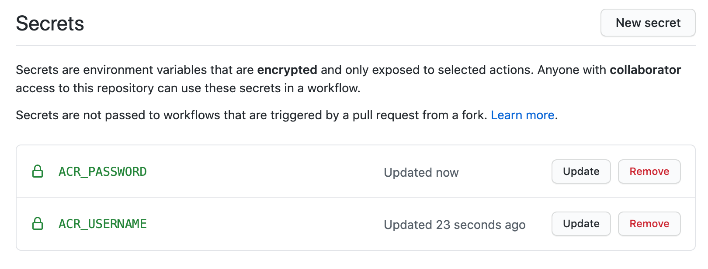
    <figcaption aria-hidden="true">
        <font style="vertical-align: inherit;"><font style="vertical-align: inherit;">机密屏幕上同时创建了ACR_USERNAME和ACR_PASSWORD机密。</font></font>
    </figcaption>

6.  <font style="vertical-align: inherit;"><font style="vertical-align: inherit;">在连接到构建代理VM的Azure Cloud Shell会话中，导航到</font></font>`~/Fabmedical`
    <font style="vertical-align: inherit;"><font style="vertical-align: inherit;">目录：</font></font>

    ```
    cd ~/Fabmedical
    ```

7.  <font style="vertical-align: inherit;"><font style="vertical-align: inherit;">在可以设置GitHub Actions工作流之前，</font></font>`.github/workflows`
    <font style="vertical-align: inherit;"><font style="vertical-align: inherit;">需要创建目录（如果</font><font style="vertical-align: inherit;">该</font><font style="vertical-align: inherit;">目录尚不存在）。</font><font style="vertical-align: inherit;">通过运行以下命令来执行此操作：</font></font>

    ```
    mkdir ~/Fabmedical/.github
    mkdir ~/Fabmedical/.github/workflows
    ```

8.  <font style="vertical-align: inherit;"><font style="vertical-align: inherit;">导航到</font></font>`.github/workflows`
    <font style="vertical-align: inherit;"><font style="vertical-align: inherit;">目录：</font></font>

    ```
    cd ~/Fabmedical/.github/workflows
    ```

9.  <font style="vertical-align: inherit;"><font style="vertical-align: inherit;">接下来创建工作流YAML文件。</font></font>

    ```
    vi content-web.yml
    ```

    <font style="vertical-align: inherit;"><font style="vertical-align: inherit;">添加以下内容。</font><font style="vertical-align: inherit;">确保替换以下占位符：</font></font>
    * <font style="vertical-align: inherit;"></font>`[SHORT_SUFFIX]`

        <font style="vertical-align: inherit;"><font style="vertical-align: inherit;">用您的短后缀（例如）</font><font style="vertical-align: inherit;">代替</font></font>`SOL`

        <font style="vertical-align: inherit;"><font style="vertical-align: inherit;">。</font></font>

    ```
    name: content-web

    # This workflow is triggered on push to the 'content-web' directory of the  master branch of the repository
    on:
      push:
        branches:
        - master
        paths:
        - 'content-web/**'

      # Configure workflow to also support triggering manually
      workflow_dispatch:

    # Environment variables are defined so that they can be used throughout the job definitions.
    env:
      imageRepository: 'content-web'
      resourceGroupName: 'fabmedical-[SHORT_SUFFIX]'
      containerRegistryName: 'fabmedical[SHORT_SUFFIX]'
      containerRegistry: 'fabmedical[SHORT_SUFFIX].azurecr.io'
      dockerfilePath: './content-web'
      tag: '${{ github.run_id  }}'

    # Jobs define the actions that take place when code is pushed to the master branch
    jobs:
      build-and-publish-docker-image:
        name: Build and Push Docker Image
        runs-on: ubuntu-latest
        steps:
        # Checkout the repo
        - uses: actions/checkout@master

        - name: Set up Docker Buildx
          uses: docker/setup-buildx-action@v1

        - name: Login to ACR
          uses: docker/login-action@v1
          with:
            registry: ${{ env.containerRegistry }}
            username: ${{ secrets.ACR_USERNAME }}
            password: ${{ secrets.ACR_PASSWORD }}

        - name: Build and push an image to container registry
          uses: docker/build-push-action@v2
          with:
            context: ${{ env.dockerfilePath  }}
            file: "${{ env.dockerfilePath }}/Dockerfile"
            pull: true
            push: true
            tags: |
              ${{ env.containerRegistry }}/${{ env.imageRepository }}:${{ env.tag }}
              ${{ env.containerRegistry }}/${{ env.imageRepository }}:latest
    ```

10.  <font style="vertical-align: inherit;"><font style="vertical-align: inherit;">保存文件，</font></font>`<Esc>`
    <font style="vertical-align: inherit;"><font style="vertical-align: inherit;">然后</font><font style="vertical-align: inherit;">按退出VI </font></font>`:wq`
    <font style="vertical-align: inherit;"><font style="vertical-align: inherit;">。</font></font>

11.  <font style="vertical-align: inherit;"><font style="vertical-align: inherit;">保存管道YAML，然后提交并将其推送到Git存储库：</font></font>

    ```
    git add .
    git commit -m "Added workflow YAML"
    git push
    ```

12.  <font style="vertical-align: inherit;"><font style="vertical-align: inherit;">在GitHub中，返回</font></font>**<font style="vertical-align: inherit;"><font style="vertical-align: inherit;">Fabmedical</font></font>**
    <font style="vertical-align: inherit;"><font style="vertical-align: inherit;">存储库屏幕，然后选择</font></font>**<font style="vertical-align: inherit;"><font style="vertical-align: inherit;">Actions</font></font>**
    <font style="vertical-align: inherit;"><font style="vertical-align: inherit;">选项卡。</font></font>

13.  <font style="vertical-align: inherit;"><font style="vertical-align: inherit;">在“</font></font>**<font style="vertical-align: inherit;"><font style="vertical-align: inherit;">操作”</font></font>**
    <font style="vertical-align: inherit;"><font style="vertical-align: inherit;">页面上，选择</font></font>**<font style="vertical-align: inherit;"><font style="vertical-align: inherit;">内容Web</font></font>**
    <font style="vertical-align: inherit;"><font style="vertical-align: inherit;">工作流。</font></font>

14.  <font style="vertical-align: inherit;"><font style="vertical-align: inherit;">在</font></font>**<font style="vertical-align: inherit;"><font style="vertical-align: inherit;">内容网络</font></font>**
    <font style="vertical-align: inherit;"><font style="vertical-align: inherit;">工作流上，选择</font></font>**<font style="vertical-align: inherit;"><font style="vertical-align: inherit;">“运行工作流”</font></font>**
    <font style="vertical-align: inherit;"><font style="vertical-align: inherit;">并手动触发工作流执行。</font></font>

    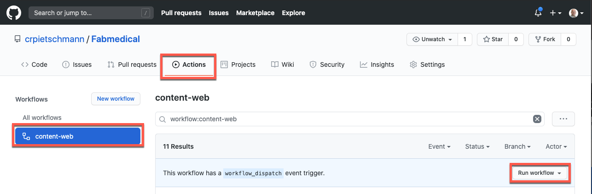
    <figcaption aria-hidden="true">
        <font style="vertical-align: inherit;"><font style="vertical-align: inherit;">内容网络操作显示为突出显示的操作，内容网络和运行工作流程链接。</font></font>
    </figcaption>

15.  <font style="vertical-align: inherit;"><font style="vertical-align: inherit;">一秒钟后，新触发的工作流程执行将显示在列表中。</font><font style="vertical-align: inherit;">选择新的</font></font>**<font style="vertical-align: inherit;"><font style="vertical-align: inherit;">内容网络</font></font>**
    <font style="vertical-align: inherit;"><font style="vertical-align: inherit;">执行以查看其状态。</font></font>

16.  <font style="vertical-align: inherit;"><font style="vertical-align: inherit;">选择</font><font style="vertical-align: inherit;">工作流</font><font style="vertical-align: inherit;">的“</font></font>**<font style="vertical-align: inherit;"><font style="vertical-align: inherit;">构建并推送Docker映像”</font></font>**
    <font style="vertical-align: inherit;"><font style="vertical-align: inherit;">作业将显示其执行状态。</font></font>

    
    <figcaption aria-hidden="true">
        <font style="vertical-align: inherit;"><font style="vertical-align: inherit;">构建并推送Docker Image作业。</font></font>
    </figcaption>

17.  <font style="vertical-align: inherit;"><font style="vertical-align: inherit;">接下来，设置</font></font>`content-api`
    <font style="vertical-align: inherit;"><font style="vertical-align: inherit;">工作流程。</font><font style="vertical-align: inherit;">该存储库已经包含</font></font>`content-api.yml`
    <font style="vertical-align: inherit;"><font style="vertical-align: inherit;">在</font></font>`.github/workflows`
    <font style="vertical-align: inherit;"><font style="vertical-align: inherit;">目录中。</font><font style="vertical-align: inherit;">打开</font></font>`.github/workflows/content-api.yml`
    <font style="vertical-align: inherit;"><font style="vertical-align: inherit;">文件进行编辑。</font></font>

18.  <font style="vertical-align: inherit;"><font style="vertical-align: inherit;">编辑</font></font>`resourceGroupName`
    <font style="vertical-align: inherit;"><font style="vertical-align: inherit;">和</font></font>`containerRegistry`
    <font style="vertical-align: inherit;"><font style="vertical-align: inherit;">环境值，</font></font>`[SHORT_SUFFIX]`
    <font style="vertical-align: inherit;"><font style="vertical-align: inherit;">用您自己的三个字母的后缀</font><font style="vertical-align: inherit;">替换，</font><font style="vertical-align: inherit;">以使其与您的容器注册表的名称和资源组匹配。</font></font>

    
    <figcaption aria-hidden="true">
        <font style="vertical-align: inherit;"><font style="vertical-align: inherit;">屏幕快照显示了content-api.yml并突出显示了环境变量。</font></font>
    </figcaption>

19.  <font style="vertical-align: inherit;"><font style="vertical-align: inherit;">保存文件，然后导航到GitHub中的存储库，选择“操作”，然后手动运行</font></font>**<font style="vertical-align: inherit;"><font style="vertical-align: inherit;">content-api</font></font>**
    <font style="vertical-align: inherit;"><font style="vertical-align: inherit;">工作流。</font></font>

20.  <font style="vertical-align: inherit;"><font style="vertical-align: inherit;">接下来，设置</font></font>**<font style="vertical-align: inherit;"><font style="vertical-align: inherit;">content-init</font></font>**
    <font style="vertical-align: inherit;"><font style="vertical-align: inherit;">工作流程。</font><font style="vertical-align: inherit;">遵循与</font></font>`content-api`
    <font style="vertical-align: inherit;"><font style="vertical-align: inherit;">该</font></font>`content-init.yml`
    <font style="vertical-align: inherit;"><font style="vertical-align: inherit;">文件</font><font style="vertical-align: inherit;">先前的</font><font style="vertical-align: inherit;">工作流程</font><font style="vertical-align: inherit;">相同的步骤</font><font style="vertical-align: inherit;">，记住要</font></font>`[SHORT_SUFFIX]`
    <font style="vertical-align: inherit;"><font style="vertical-align: inherit;">使用自己的三个字母的后缀</font><font style="vertical-align: inherit;">来更新该</font><font style="vertical-align: inherit;">值。</font></font>

21.  <font style="vertical-align: inherit;"><font style="vertical-align: inherit;">提交更改并将其推送到Git存储库：</font></font>

    ```
    git add .
    git commit -m "Updated workflow YAML"
    git push
    ```

## <font style="vertical-align: inherit;"><font style="vertical-align: inherit;">练习2：使用Azure数据库迁移服务将MongoDB迁移到Cosmos DB</font></font>

**<font style="vertical-align: inherit;"><font style="vertical-align: inherit;">片长</font></font>**
<font style="vertical-align: inherit;"><font style="vertical-align: inherit;">：20分钟</font></font>

<font style="vertical-align: inherit;"><font style="vertical-align: inherit;">此时，您已经在Docker实例（VM-Build Agent）中运行了Web和API应用程序。</font><font style="vertical-align: inherit;">下一步是将MongoDB数据库数据迁移到Azure Cosmos DB。</font><font style="vertical-align: inherit;">本练习将使用Azure数据库迁移服务将数据从MongoDB数据库迁移到Azure Cosmos DB。</font></font>

### <font style="vertical-align: inherit;"><font style="vertical-align: inherit;">任务1：启用Microsoft.DataMigration资源提供程序</font></font>

<font style="vertical-align: inherit;"><font style="vertical-align: inherit;">在此任务中，您将通过注册</font></font>`Microsoft.DataMigration`
<font style="vertical-align: inherit;"><font style="vertical-align: inherit;">资源提供程序来</font><font style="vertical-align: inherit;">在Azure订阅中启用Azure数据库迁移服务</font><font style="vertical-align: inherit;">。</font></font>

1.  <font style="vertical-align: inherit;"><font style="vertical-align: inherit;">打开Azure Cloud Shell。</font></font>

2.  <font style="vertical-align: inherit;"><font style="vertical-align: inherit;">运行以下Azure CLI命令以</font></font>`Microsoft.DataMigration`
    <font style="vertical-align: inherit;"><font style="vertical-align: inherit;">在Azure订阅中</font><font style="vertical-align: inherit;">注册</font><font style="vertical-align: inherit;">资源提供者：</font></font>

    ```
    az provider register --namespace Microsoft.DataMigration
    ```

### <font style="vertical-align: inherit;"><font style="vertical-align: inherit;">任务2：置备Azure数据库迁移服务</font></font>

<font style="vertical-align: inherit;"><font style="vertical-align: inherit;">在此任务中，您将部署Azure数据库迁移服务的实例，该实例将用于将数据从MongoDB迁移到Cosmos DB。</font></font>

1.  <font style="vertical-align: inherit;"><font style="vertical-align: inherit;">在Azure门户中，选择</font></font>**<font style="vertical-align: inherit;"><font style="vertical-align: inherit;">+创建资源</font></font>**
    <font style="vertical-align: inherit;"><font style="vertical-align: inherit;">。</font></font>

2.  <font style="vertical-align: inherit;"><font style="vertical-align: inherit;">在市场上搜索</font></font>**<font style="vertical-align: inherit;"><font style="vertical-align: inherit;">Azure数据库迁移服务</font></font>**
    <font style="vertical-align: inherit;"><font style="vertical-align: inherit;">并选择它。</font></font>

3.  <font style="vertical-align: inherit;"><font style="vertical-align: inherit;">选择</font></font>**<font style="vertical-align: inherit;"><font style="vertical-align: inherit;">创建</font></font>**
    <font style="vertical-align: inherit;"><font style="vertical-align: inherit;">。</font></font>

    
    <figcaption aria-hidden="true">
        <font style="vertical-align: inherit;"><font style="vertical-align: inherit;">屏幕截图显示了Azure市场中的Azure数据库迁移服务。</font></font>
    </figcaption>

4.  <font style="vertical-align: inherit;"><font style="vertical-align: inherit;">在“</font><strong><font style="vertical-align: inherit;">创建迁移服务”</font></strong><font style="vertical-align: inherit;">窗格</font><font style="vertical-align: inherit;">的“</font></font>**<font style="vertical-align: inherit;"><font style="vertical-align: inherit;">基本”</font></font>**
    <font style="vertical-align: inherit;"><font style="vertical-align: inherit;">选项卡上</font><font style="vertical-align: inherit;">，输入以下值：</font></font>**<font style="vertical-align: inherit;"></font>**
    <font style="vertical-align: inherit;"></font>
    * <font style="vertical-align: inherit;"><font style="vertical-align: inherit;">资源组：选择由此实验室创建的资源组。</font></font>
    * <font style="vertical-align: inherit;"><font style="vertical-align: inherit;">迁移服务名称：输入名称，例如</font></font>`fabmedical[SUFFIX]`

        <font style="vertical-align: inherit;"><font style="vertical-align: inherit;">。</font></font>

    * <font style="vertical-align: inherit;"><font style="vertical-align: inherit;">位置：选择用于资源组的Azure区域。</font></font>

    
    <figcaption aria-hidden="true">
        <font style="vertical-align: inherit;"><font style="vertical-align: inherit;">屏幕快照显示了“创建迁移服务基础”选项卡，其中输入了所有值。</font></font>
    </figcaption>

5.  <font style="vertical-align: inherit;"><font style="vertical-align: inherit;">选择</font></font>**<font style="vertical-align: inherit;"><font style="vertical-align: inherit;">下一步：网络&gt;&gt;</font></font>**
    <font style="vertical-align: inherit;"><font style="vertical-align: inherit;">。</font></font>

6.  <font style="vertical-align: inherit;"><font style="vertical-align: inherit;">在“</font></font>**<font style="vertical-align: inherit;"><font style="vertical-align: inherit;">网络”</font></font>**
    <font style="vertical-align: inherit;"><font style="vertical-align: inherit;">选项卡上，</font><font style="vertical-align: inherit;">在</font><font style="vertical-align: inherit;">资源组中</font><font style="vertical-align: inherit;">选择“</font></font>**<font style="vertical-align: inherit;"><font style="vertical-align: inherit;">虚拟网络</font></font>**
    <font style="vertical-align: inherit;"><font style="vertical-align: inherit;">” </font></font>`fabmedical-[SUFFIX]`
    <font style="vertical-align: inherit;"><font style="vertical-align: inherit;">。</font></font>

    
    <figcaption aria-hidden="true">
        <font style="vertical-align: inherit;"><font style="vertical-align: inherit;">屏幕快照显示了“选择虚拟网络”的“创建迁移服务网络”选项卡。</font></font>
    </figcaption>

7.  <font style="vertical-align: inherit;"><font style="vertical-align: inherit;">选择</font></font>**<font style="vertical-align: inherit;"><font style="vertical-align: inherit;">评论+创建</font></font>**
    <font style="vertical-align: inherit;"><font style="vertical-align: inherit;">。</font></font>

8.  <font style="vertical-align: inherit;"><font style="vertical-align: inherit;">选择“</font></font>**<font style="vertical-align: inherit;"><font style="vertical-align: inherit;">创建”</font></font>**
    <font style="vertical-align: inherit;"><font style="vertical-align: inherit;">以创建Azure数据库迁移服务实例。</font></font>

<font style="vertical-align: inherit;"><font style="vertical-align: inherit;">提供该服务可能需要5-10分钟。</font></font>

### <font style="vertical-align: inherit;"><font style="vertical-align: inherit;">任务3：将数据迁移到Azure Cosmos DB</font></font>

<font style="vertical-align: inherit;"><font style="vertical-align: inherit;">在此任务中，您将</font><font style="vertical-align: inherit;">在Azure数据库迁移服务中</font><font style="vertical-align: inherit;">创建一个</font></font>**<font style="vertical-align: inherit;"><font style="vertical-align: inherit;">迁移项目</font></font>**
<font style="vertical-align: inherit;"><font style="vertical-align: inherit;">，然后将数据从MongoDB迁移到Azure Cosmos DB。</font></font>

1.  <font style="vertical-align: inherit;"><font style="vertical-align: inherit;">在Azure门户中，导航到Build Agent VM，然后复制Private IP地址</font></font>**<font style="vertical-align: inherit;"><font style="vertical-align: inherit;">（2）</font></font>**
    <font style="vertical-align: inherit;"><font style="vertical-align: inherit;">。</font><font style="vertical-align: inherit;">将内容粘贴到您选择的文本编辑器中（例如Windows上的记事本，macOS用户可以使用TextEdit）以备将来使用。</font></font>

    
    <figcaption aria-hidden="true">
        <font style="vertical-align: inherit;"><font style="vertical-align: inherit;">显示已构建的Agent VM。</font><font style="vertical-align: inherit;">“概述”选项卡已打开。</font><font style="vertical-align: inherit;">专用IP地址突出显示。</font></font>
    </figcaption>

2.  <font style="vertical-align: inherit;"><font style="vertical-align: inherit;">在Azure门户中，导航到</font><font style="vertical-align: inherit;">先前已配置</font><font style="vertical-align: inherit;">的</font></font>**<font style="vertical-align: inherit;"><font style="vertical-align: inherit;">Azure数据库迁移服务</font></font>**
    <font style="vertical-align: inherit;"><font style="vertical-align: inherit;">。</font></font>

3.  <font style="vertical-align: inherit;"><font style="vertical-align: inherit;">在“ Azure数据库迁移服务”刀片上，</font><font style="vertical-align: inherit;">在“</font><strong><font style="vertical-align: inherit;">概述”</font></strong><font style="vertical-align: inherit;">窗格</font><font style="vertical-align: inherit;">上</font><font style="vertical-align: inherit;">选择</font></font>**<font style="vertical-align: inherit;"><font style="vertical-align: inherit;">+“新建迁移项目</font></font>**
    <font style="vertical-align: inherit;"><font style="vertical-align: inherit;">” </font><font style="vertical-align: inherit;">。</font></font>**<font style="vertical-align: inherit;"></font>**
    <font style="vertical-align: inherit;"></font>

4.  <font style="vertical-align: inherit;"><font style="vertical-align: inherit;">在“</font></font>**<font style="vertical-align: inherit;"><font style="vertical-align: inherit;">新建迁移项目”</font></font>**
    <font style="vertical-align: inherit;"><font style="vertical-align: inherit;">窗格上，输入以下值，然后选择“</font></font>**<font style="vertical-align: inherit;"><font style="vertical-align: inherit;">创建并运行活动”</font></font>**
    <font style="vertical-align: inherit;"><font style="vertical-align: inherit;">：</font></font>
    * <font style="vertical-align: inherit;"><font style="vertical-align: inherit;">项目名称： </font></font>`fabmedical`
    * <font style="vertical-align: inherit;"><font style="vertical-align: inherit;">源服务器类型： </font></font>`MongoDB`
    * <font style="vertical-align: inherit;"><font style="vertical-align: inherit;">目标服务器类型： </font></font>`CosmosDB (MongoDB API)`
    * <font style="vertical-align: inherit;"><font style="vertical-align: inherit;">选择活动类型： </font></font>`Offline data migration`

    
    <figcaption aria-hidden="true">
        <font style="vertical-align: inherit;"><font style="vertical-align: inherit;">屏幕截图显示了“新迁移项目”窗格，其中输入了值。</font></font>
    </figcaption>

    > **<font style="vertical-align: inherit;"><font style="vertical-align: inherit;">注意：</font></font>**
    > <font style="vertical-align: inherit;"><font style="vertical-align: inherit;">由于您将执行从MongoDB到Cosmos DB的一次性迁移，因此已选择</font><font style="vertical-align: inherit;">“</font></font>**<font style="vertical-align: inherit;"><font style="vertical-align: inherit;">脱机数据迁移”</font></font>**
    > <font style="vertical-align: inherit;"><font style="vertical-align: inherit;">活动类型。</font><font style="vertical-align: inherit;">而且，数据库中的数据在迁移期间不会更新。</font><font style="vertical-align: inherit;">在生产方案中，您将需要选择最适合您的解决方案要求的迁移项目活动类型。</font></font>

5.  <font style="vertical-align: inherit;"><font style="vertical-align: inherit;">在“ </font></font>**<font style="vertical-align: inherit;"><font style="vertical-align: inherit;">MongoDB到CosmosDB的Azure数据库脱机迁移向导”</font></font>**
    <font style="vertical-align: inherit;"><font style="vertical-align: inherit;">窗格上，为“</font></font>**<font style="vertical-align: inherit;"><font style="vertical-align: inherit;">选择源”</font></font>**
    <font style="vertical-align: inherit;"><font style="vertical-align: inherit;">选项卡</font><font style="vertical-align: inherit;">输入以下值</font><font style="vertical-align: inherit;">：</font></font>
    * <font style="vertical-align: inherit;"><font style="vertical-align: inherit;">模式：</font></font>**<font style="vertical-align: inherit;"><font style="vertical-align: inherit;">标准模式</font></font>**
    * <font style="vertical-align: inherit;"><font style="vertical-align: inherit;">源服务器名称：输入此实验中使用的Build Agent VM的私有IP地址。</font></font>
    * <font style="vertical-align: inherit;"><font style="vertical-align: inherit;">服务器端口： </font></font>`27017`
    * <font style="vertical-align: inherit;"><font style="vertical-align: inherit;">需要SSL：未选中</font></font>

    > **<font style="vertical-align: inherit;"><font style="vertical-align: inherit;">注意：</font></font>**
    > <font style="vertical-align: inherit;"><font style="vertical-align: inherit;">将</font></font>**<font style="vertical-align: inherit;"><font style="vertical-align: inherit;">用户名</font></font>**
    > <font style="vertical-align: inherit;"><font style="vertical-align: inherit;">和</font></font>**<font style="vertical-align: inherit;"><font style="vertical-align: inherit;">密码</font></font>**
    > <font style="vertical-align: inherit;"><font style="vertical-align: inherit;">留空，因为此练习的Build Agent VM上的MongoDB实例未启用身份验证。</font><font style="vertical-align: inherit;">Azure数据库迁移服务与Build Agent VM连接到相同的VNet，因此它能够在VNet内部直接与VM通信，而无需将MongoDB服务暴露给Internet。</font><font style="vertical-align: inherit;">在生产方案中，应该始终在MongoDB上启用身份验证。</font></font>

    
    <figcaption aria-hidden="true">
        <font style="vertical-align: inherit;"><font style="vertical-align: inherit;">选择源选项卡，其中为MongoDB服务器选择了值。</font></font>
    </figcaption>

6.  <font style="vertical-align: inherit;"><font style="vertical-align: inherit;">选择</font></font>**<font style="vertical-align: inherit;"><font style="vertical-align: inherit;">下一步：选择目标&gt;&gt;</font></font>**
    <font style="vertical-align: inherit;"><font style="vertical-align: inherit;">。</font></font>

7.  <font style="vertical-align: inherit;"><font style="vertical-align: inherit;">在“</font></font>**<font style="vertical-align: inherit;"><font style="vertical-align: inherit;">选择目标”</font></font>**
    <font style="vertical-align: inherit;"><font style="vertical-align: inherit;">窗格上，选择以下值：</font></font>
    * <font style="vertical-align: inherit;"><font style="vertical-align: inherit;">模式：</font></font>**<font style="vertical-align: inherit;"><font style="vertical-align: inherit;">选择Cosmos DB目标</font></font>**

    * <font style="vertical-align: inherit;"><font style="vertical-align: inherit;">订阅：选择用于此实验的Azure订阅。</font></font>

    * <font style="vertical-align: inherit;"><font style="vertical-align: inherit;">选择Cosmos数据库名称：选择</font></font>`fabmedical-[SUFFIX]`
        <font style="vertical-align: inherit;"><font style="vertical-align: inherit;">Cosmos数据库实例。</font></font>

    
    <figcaption aria-hidden="true">
        <font style="vertical-align: inherit;"><font style="vertical-align: inherit;">选择目标选项卡的值已选定。</font></font>
    </figcaption>

    <font style="vertical-align: inherit;"><font style="vertical-align: inherit;">请注意，</font></font>**<font style="vertical-align: inherit;"><font style="vertical-align: inherit;">连接字符串</font></font>**
    <font style="vertical-align: inherit;"><font style="vertical-align: inherit;">将自动为您的Azure Cosmos数据库实例填充密钥。</font></font>

8.  <font style="vertical-align: inherit;"><font style="vertical-align: inherit;">通过替换</font><font style="vertical-align: inherit;">为来</font><font style="vertical-align: inherit;">修改</font></font>**<font style="vertical-align: inherit;"><font style="vertical-align: inherit;">连接字符串</font></font>**
    <font style="vertical-align: inherit;"><font style="vertical-align: inherit;">，</font></font>`@undefined:`
    <font style="vertical-align: inherit;"><font style="vertical-align: inherit;">以</font></font>`@fabmedical-[SUFFIX].documents.azure.com:`
    <font style="vertical-align: inherit;"><font style="vertical-align: inherit;">使DNS名称与Azure Cosmos数据库实例匹配。</font><font style="vertical-align: inherit;">请务必更换</font></font>`[SUFFIX]`
    <font style="vertical-align: inherit;"><font style="vertical-align: inherit;">。</font></font>

    
    <figcaption aria-hidden="true">
        <font style="vertical-align: inherit;"><font style="vertical-align: inherit;">屏幕快照显示了连接字符串，其中</font></font><font style="vertical-align: inherit;"><font style="vertical-align: inherit;">@undefined</font></font>

        <font style="vertical-align: inherit;"><font style="vertical-align: inherit;">：值替换为正确的DNS名称。</font></font>
    </figcaption>

9.  <font style="vertical-align: inherit;"><font style="vertical-align: inherit;">选择</font></font>**<font style="vertical-align: inherit;"><font style="vertical-align: inherit;">下一步：数据库设置&gt;&gt;</font></font>**
    <font style="vertical-align: inherit;"><font style="vertical-align: inherit;">。</font></font>

10.  <font style="vertical-align: inherit;"><font style="vertical-align: inherit;">在“</font></font>**<font style="vertical-align: inherit;"><font style="vertical-align: inherit;">数据库设置”</font></font>**
    <font style="vertical-align: inherit;"><font style="vertical-align: inherit;">选项卡上，选择“</font></font>`contentdb` **<font style="vertical-align: inherit;"><font style="vertical-align: inherit;">源数据库”，</font></font>**
    <font style="vertical-align: inherit;"><font style="vertical-align: inherit;">以便将MongoDB中的该数据库迁移到Azure Cosmos DB。</font></font>

    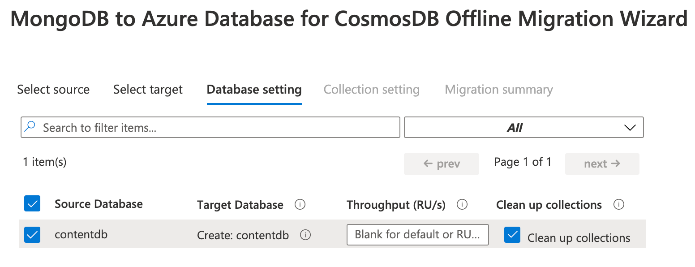
    <figcaption aria-hidden="true">
        <font style="vertical-align: inherit;"><font style="vertical-align: inherit;">屏幕快照显示了“数据库设置”选项卡，其中选择了contentdb源数据库。</font></font>
    </figcaption>

11.  <font style="vertical-align: inherit;"><font style="vertical-align: inherit;">选择</font></font>**<font style="vertical-align: inherit;"><font style="vertical-align: inherit;">下一步：收集设置&gt;&gt;</font></font>**
    <font style="vertical-align: inherit;"><font style="vertical-align: inherit;">。</font></font>

12.  <font style="vertical-align: inherit;"><font style="vertical-align: inherit;">在“</font></font>**<font style="vertical-align: inherit;"><font style="vertical-align: inherit;">集合设置”</font></font>**
    <font style="vertical-align: inherit;"><font style="vertical-align: inherit;">选项卡上，展开</font></font>**<font style="vertical-align: inherit;"><font style="vertical-align: inherit;">contentdb</font></font>**
    <font style="vertical-align: inherit;"><font style="vertical-align: inherit;">数据库，并确保同时选择</font></font>**<font style="vertical-align: inherit;"><font style="vertical-align: inherit;">会话</font></font>**
    <font style="vertical-align: inherit;"><font style="vertical-align: inherit;">和</font></font>**<font style="vertical-align: inherit;"><font style="vertical-align: inherit;">演讲者</font></font>**
    <font style="vertical-align: inherit;"><font style="vertical-align: inherit;">集合进行迁移。</font><font style="vertical-align: inherit;">此外，更新</font></font>**<font style="vertical-align: inherit;"><font style="vertical-align: inherit;">吞吐量（RU /秒）</font></font>**
    <font style="vertical-align: inherit;"><font style="vertical-align: inherit;">，以</font></font>`400`
    <font style="vertical-align: inherit;"><font style="vertical-align: inherit;">两个集合。</font></font>

    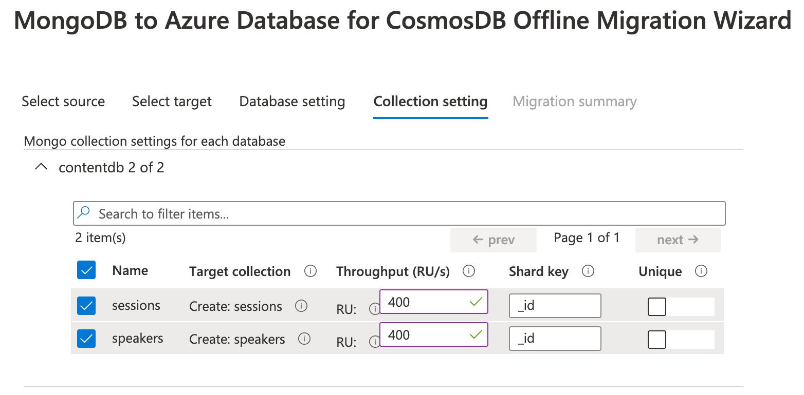
    <figcaption aria-hidden="true">
        <font style="vertical-align: inherit;"><font style="vertical-align: inherit;">屏幕快照显示了“集合设置”选项卡，其中会话和扬声器集合均被选中，并且两个集合的吞吐量RU / s都设置为400。</font></font>
    </figcaption>

13.  <font style="vertical-align: inherit;"><font style="vertical-align: inherit;">选择</font></font>**<font style="vertical-align: inherit;"><font style="vertical-align: inherit;">下一步：迁移摘要&gt;&gt;</font></font>**
    <font style="vertical-align: inherit;"><font style="vertical-align: inherit;">。</font></font>

14.  <font style="vertical-align: inherit;"><font style="vertical-align: inherit;">在“</font></font>**<font style="vertical-align: inherit;"><font style="vertical-align: inherit;">迁移摘要”</font></font>**
    <font style="vertical-align: inherit;"><font style="vertical-align: inherit;">选项卡上，</font></font>`MigrateData`
    <font style="vertical-align: inherit;"><font style="vertical-align: inherit;">在“</font></font>**<font style="vertical-align: inherit;"><font style="vertical-align: inherit;">活动名称”</font></font>**
    <font style="vertical-align: inherit;"><font style="vertical-align: inherit;">字段中</font><font style="vertical-align: inherit;">输入</font><font style="vertical-align: inherit;">，然后选择“</font></font>**<font style="vertical-align: inherit;"><font style="vertical-align: inherit;">开始迁移”</font></font>**
    <font style="vertical-align: inherit;"><font style="vertical-align: inherit;">以启动MongoDB数据到Azure Cosmos DB的迁移。</font></font>

    
    <figcaption aria-hidden="true">
        <font style="vertical-align: inherit;"><font style="vertical-align: inherit;">屏幕截图显示了迁移摘要，其中在“活动名称”字段中输入了MigrateData。</font></font>
    </figcaption>

15.  <font style="vertical-align: inherit;"><font style="vertical-align: inherit;">将显示迁移活动的状态。</font><font style="vertical-align: inherit;">迁移仅需几秒钟即可完成。</font><font style="vertical-align: inherit;">选择“</font></font>**<font style="vertical-align: inherit;"><font style="vertical-align: inherit;">刷新”</font></font>**
    <font style="vertical-align: inherit;"><font style="vertical-align: inherit;">以重新加载状态以确保其显示</font></font>**<font style="vertical-align: inherit;"><font style="vertical-align: inherit;">“</font></font>**
    <font style="vertical-align: inherit;"></font>**<font style="vertical-align: inherit;"><font style="vertical-align: inherit;">完成</font></font>**
    <font style="vertical-align: inherit;"><strong><font style="vertical-align: inherit;">状态</font></strong><font style="vertical-align: inherit;">” </font><font style="vertical-align: inherit;">。</font></font>

    
    <figcaption aria-hidden="true">
        <font style="vertical-align: inherit;"><font style="vertical-align: inherit;">屏幕截图显示了MigrateData活动，该活动显示状态已完成。</font></font>
    </figcaption>

16.  <font style="vertical-align: inherit;"><font style="vertical-align: inherit;">要验证数据是否已迁移，请</font><font style="vertical-align: inherit;">在Azure门户中</font><font style="vertical-align: inherit;">导航到</font><font style="vertical-align: inherit;">实验室</font><font style="vertical-align: inherit;">的</font></font>**<font style="vertical-align: inherit;"><font style="vertical-align: inherit;">Cosmos DB帐户</font></font>**
    <font style="vertical-align: inherit;"><font style="vertical-align: inherit;">，然后选择“</font></font>**<font style="vertical-align: inherit;"><font style="vertical-align: inherit;">数据资源管理器”</font></font>**
    <font style="vertical-align: inherit;"><font style="vertical-align: inherit;">。</font><font style="vertical-align: inherit;">您将</font><font style="vertical-align: inherit;">在</font><font style="vertical-align: inherit;">数据库中</font><font style="vertical-align: inherit;">看到</font></font>`speakers`
    <font style="vertical-align: inherit;"><font style="vertical-align: inherit;">和</font></font>`sessions`
    <font style="vertical-align: inherit;"><font style="vertical-align: inherit;">集合</font></font>`contentdb`
    <font style="vertical-align: inherit;"><font style="vertical-align: inherit;">，并且将能够浏览其中的文档。</font></font>

    
    <figcaption aria-hidden="true">
        <font style="vertical-align: inherit;"><font style="vertical-align: inherit;">屏幕截图显示Cosmos DB在Azure门户中已打开，而Data Explorer已打开，表明数据已迁移。</font></font>
    </figcaption>

## <font style="vertical-align: inherit;"><font style="vertical-align: inherit;">练习3：将解决方案部署到Azure Kubernetes服务</font></font>

**<font style="vertical-align: inherit;"><font style="vertical-align: inherit;">片长</font></font>**
<font style="vertical-align: inherit;"><font style="vertical-align: inherit;">：30分钟</font></font>

<font style="vertical-align: inherit;"><font style="vertical-align: inherit;">在本练习中，您将连接到动手实验之前创建的Azure Kubernetes Service群集，并使用Kubernetes将Docker应用程序部署到该群集。</font></font>

### <font style="vertical-align: inherit;"><font style="vertical-align: inherit;">任务1：隧道进入Azure Kubernetes服务群集</font></font>

<font style="vertical-align: inherit;"><font style="vertical-align: inherit;">在此任务中，您将收集有关Azure Kubernetes服务群集以连接到群集并执行命令以从云外壳连接到Kubernetes管理仪表板所需的信息。</font></font>

> **<font style="vertical-align: inherit;"><font style="vertical-align: inherit;">注意</font></font>**
> <font style="vertical-align: inherit;"><font style="vertical-align: inherit;">：以下任务应在云shell中而不是在构建计算机上执行，因此，如果仍然连接，请与构建计算机断开连接。</font></font>

1.  <font style="vertical-align: inherit;"><font style="vertical-align: inherit;">使用以下命令验证您是否连接到正确的订阅，以显示默认订阅：</font></font>

    ```
    az account show
    ```

    * <font style="vertical-align: inherit;"><font style="vertical-align: inherit;">如果未连接到正确的订阅，请列出您的订阅，然后使用以下命令通过其ID设置订阅（类似于您在实验之前在Cloud Shell中所做的操作）：</font></font>

    ```
    az account list
    az account set --subscription {id}
    ```

2.  <font style="vertical-align: inherit;"><font style="vertical-align: inherit;">配置kubectl以连接到Kubernetes集群：</font></font>

    ```
    az aks get-credentials -a --name fabmedical-SUFFIX --resource-group fabmedical-SUFFIX
    ```

3.  <font style="vertical-align: inherit;"><font style="vertical-align: inherit;">通过运行简单的kubectl命令以生成节点列表来测试配置是否正确：</font></font>

    ```
    kubectl get nodes
    ```

    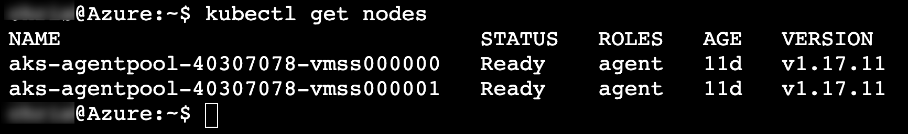
    <figcaption aria-hidden="true">
        <font style="vertical-align: inherit;"><font style="vertical-align: inherit;">在控制台的此屏幕快照中，已键入kubectl get节点并在命令提示符下运行，该命令提示符会生成节点列表。</font></font>
    </figcaption>

4.  <font style="vertical-align: inherit;"><font style="vertical-align: inherit;">由于AKS群集使用RBAC，因此</font></font>`ClusterRoleBinding`
    <font style="vertical-align: inherit;"><font style="vertical-align: inherit;">必须先创建一个，然后才能正确访问仪表板。</font><font style="vertical-align: inherit;">要创建所需的绑定，请执行以下命令：</font></font>

    ```
    kubectl create clusterrolebinding kubernetes-dashboard --clusterrole=cluster-admin --serviceaccount=kube-system:kubernetes-dashboard
    ```

    > **<font style="vertical-align: inherit;"><font style="vertical-align: inherit;">注意</font></font>**
    > <font style="vertical-align: inherit;"><font style="vertical-align: inherit;">：如果出现错误</font><strong><font style="vertical-align: inherit;">提示，请</font></strong></font>`error: failed to create clusterrolebinding: clusterrolebindings.rbac.authorization.k8s.io "kubernetes-dashboard" already exists`
    > <font style="vertical-align: inherit;"><font style="vertical-align: inherit;">忽略它，然后继续下一步。</font></font>

5.  <font style="vertical-align: inherit;"><font style="vertical-align: inherit;">在创建SSH隧道并连接到Kubernetes仪表板之前，您需要</font><font style="vertical-align: inherit;">在Azure Cloud Shell中</font><font style="vertical-align: inherit;">下载</font></font>**<font style="vertical-align: inherit;"><font style="vertical-align: inherit;">Kubeconfig</font></font>**
    <font style="vertical-align: inherit;"><font style="vertical-align: inherit;">文件，其中包含对Kubernetes仪表板进行身份验证所需的凭据。</font></font>

    <font style="vertical-align: inherit;"><font style="vertical-align: inherit;">在Azure Cloud Shell中，使用以下命令下载Kubeconfig文件：</font></font>

    ```
    download /home/<username>/.kube/config
    ```

    <font style="vertical-align: inherit;"><font style="vertical-align: inherit;">确保</font></font>`<username>`
    <font style="vertical-align: inherit;"><font style="vertical-align: inherit;">在Azure Cloud Shell的命令行中用您的名字</font><font style="vertical-align: inherit;">替换</font><font style="vertical-align: inherit;">占位符。</font></font>

    > **<font style="vertical-align: inherit;"><font style="vertical-align: inherit;">注意</font></font>**
    > <font style="vertical-align: inherit;"><font style="vertical-align: inherit;">：您可以</font></font>`<username>`
    > <font style="vertical-align: inherit;"><font style="vertical-align: inherit;">从Azure Cloud Shell命令行提示符的第一部分中</font><font style="vertical-align: inherit;">找到</font><font style="vertical-align: inherit;">；</font><font style="vertical-align: inherit;">如</font></font>`<username>@Azure:~$`
    > <font style="vertical-align: inherit;"><font style="vertical-align: inherit;">。</font></font>
    >
    > <font style="vertical-align: inherit;"><font style="vertical-align: inherit;">您也可以在</font></font>`/home`
    > <font style="vertical-align: inherit;"><font style="vertical-align: inherit;">目录中</font><font style="vertical-align: inherit;">查找，</font><font style="vertical-align: inherit;">然后查看其中存在的目录名称以找到Kubeconfig文件所在的正确用户名目录：</font></font>
    >
    >
    > ```
    > ls /home
    > ```
    >

6.  <font style="vertical-align: inherit;"><font style="vertical-align: inherit;">创建一个SSH隧道，将</font></font>`8001`
    <font style="vertical-align: inherit;"><font style="vertical-align: inherit;">您的云Shell主机上</font><font style="vertical-align: inherit;">的本地端口（</font><font style="vertical-align: inherit;">）</font><font style="vertical-align: inherit;">链接</font><font style="vertical-align: inherit;">到集群管理节点上的端口443。</font><font style="vertical-align: inherit;">然后，Cloud Shell将使用Web预览功能使您可以远程访问Kubernetes仪表板。</font><font style="vertical-align: inherit;">执行以下命令，替换值，如下所示：</font></font>

    > **<font style="vertical-align: inherit;"><font style="vertical-align: inherit;">注意</font></font>**
    > <font style="vertical-align: inherit;"><font style="vertical-align: inherit;">：运行此命令后，它可能首先工作，然后失去连接，因此您可能必须再次运行此命令才能重新建立连接。</font><font style="vertical-align: inherit;">如果Kubernetes仪表板在浏览器中变得无响应，则表示返回此处并检查您的隧道或重新运行命令。</font></font>

    ```
    az aks browse --name fabmedical-SUFFIX --resource-group fabmedical-SUFFIX
    ```

    
    <figcaption aria-hidden="true">
        <font style="vertical-align: inherit;"><font style="vertical-align: inherit;">在控制台的此屏幕快照中，az aks浏览命令的输出。</font></font>
    </figcaption>

7.  <font style="vertical-align: inherit;"><font style="vertical-align: inherit;">如果隧道成功，您将看到Kubernetes Dashboard身份验证屏幕。</font><font style="vertical-align: inherit;">选择</font></font>**<font style="vertical-align: inherit;"><font style="vertical-align: inherit;">Kubeconfig</font></font>**
    <font style="vertical-align: inherit;"><font style="vertical-align: inherit;">选项，选择省略号（</font></font>`...`
    <font style="vertical-align: inherit;"><font style="vertical-align: inherit;">）按钮，选择</font><font style="vertical-align: inherit;">先前下载</font><font style="vertical-align: inherit;">的</font></font>**<font style="vertical-align: inherit;"><font style="vertical-align: inherit;">Kubeconfig</font></font>**
    <font style="vertical-align: inherit;"><font style="vertical-align: inherit;">文件，然后选择</font></font>**<font style="vertical-align: inherit;"><font style="vertical-align: inherit;">登录</font></font>**
    <font style="vertical-align: inherit;"><font style="vertical-align: inherit;">。</font></font>

    
    <figcaption aria-hidden="true">
        <font style="vertical-align: inherit;"><font style="vertical-align: inherit;">屏幕截图显示了Kubernetes Dashboard身份验证提示。</font></font>
    </figcaption>

8.  <font style="vertical-align: inherit;"><font style="vertical-align: inherit;">通过身份验证后，您将看到Kubernetes管理仪表板。</font></font>

    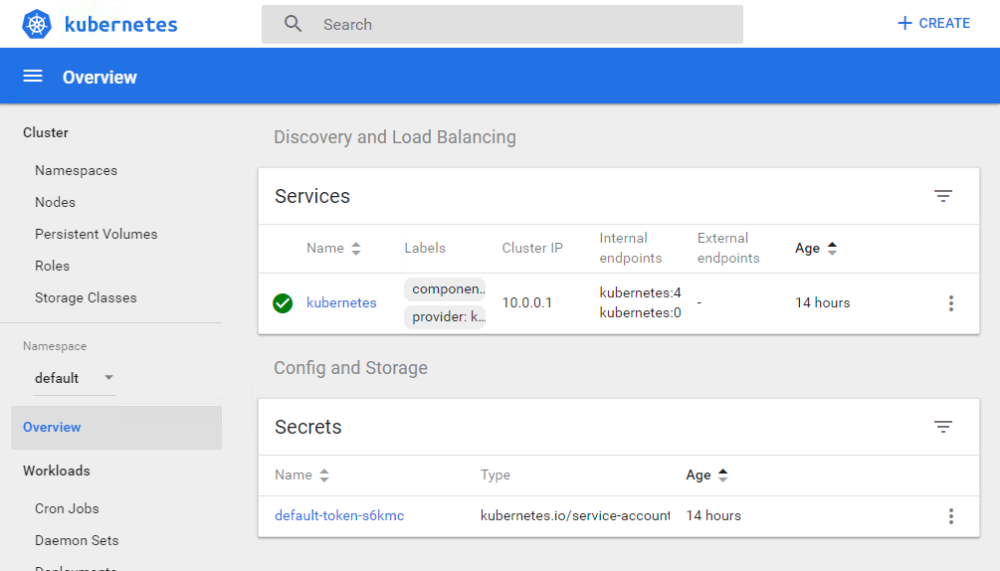
    <figcaption aria-hidden="true">
        <font style="vertical-align: inherit;"><font style="vertical-align: inherit;">这是Kubernetes管理仪表板的屏幕截图。</font><font style="vertical-align: inherit;">概述在左侧高亮显示，在kubernetes的右侧带有绿色的复选标记。</font><font style="vertical-align: inherit;">在此之下，“秘密”下列出了default-token-s6kmc。</font></font>
    </figcaption>

    > **<font style="vertical-align: inherit;"><font style="vertical-align: inherit;">注意</font></font>**
    > <font style="vertical-align: inherit;"><font style="vertical-align: inherit;">：如果隧道不成功（如果显示JSON输出），请执行以下命令，然后返回到上面的任务5：</font></font>
    >
    >
    > ```
    > az extension add --name aks-preview
    > ```
    >

### <font style="vertical-align: inherit;"><font style="vertical-align: inherit;">任务2：使用Azure门户部署服务</font></font>

<font style="vertical-align: inherit;"><font style="vertical-align: inherit;">在此任务中，您将使用Azure门户将API应用程序部署到Azure Kubernetes服务群集。</font></font>

1.  <font style="vertical-align: inherit;"><font style="vertical-align: inherit;">我们首先需要为我们的API定义一个服务，以便可以在集群中访问该应用程序。</font><font style="vertical-align: inherit;">在Azure门户的AKS刀片中，选择“</font></font>**<font style="vertical-align: inherit;"><font style="vertical-align: inherit;">服务和</font></font>**
    <font style="vertical-align: inherit;"><font style="vertical-align: inherit;">入口” </font><strong><font style="vertical-align: inherit;">，</font></strong><font style="vertical-align: inherit;">然后在“服务”选项卡上选择“ </font></font>**<font style="vertical-align: inherit;"><font style="vertical-align: inherit;">+添加”</font></font>**
    <font style="vertical-align: inherit;"><font style="vertical-align: inherit;">。</font></font>

    
    <figcaption aria-hidden="true">
        <font style="vertical-align: inherit;"><font style="vertical-align: inherit;">这是AKS的Azure门户的屏幕截图，显示了添加服务。</font></font>
    </figcaption>

2.  <font style="vertical-align: inherit;"><font style="vertical-align: inherit;">在“</font></font>**<font style="vertical-align: inherit;"><font style="vertical-align: inherit;">使用YAML添加”</font></font>**
    <font style="vertical-align: inherit;"><font style="vertical-align: inherit;">屏幕中，粘贴以下YAML，然后选择</font></font>**<font style="vertical-align: inherit;"><font style="vertical-align: inherit;">添加</font></font>**
    <font style="vertical-align: inherit;"><font style="vertical-align: inherit;">。</font></font>

    ```
    apiVersion: v1
     kind: Service
     metadata:
       labels:
         app: api
       name: api
     spec:
       ports:
         - name: api-traffic
           port: 3001
           protocol: TCP
           targetPort: 3001
       selector:
         app: api
       sessionAffinity: None
       type: ClusterIP
    ```

3.  <font style="vertical-align: inherit;"><font style="vertical-align: inherit;">现在</font><font style="vertical-align: inherit;">，在左侧导航中</font><font style="vertical-align: inherit;">的</font><strong><font style="vertical-align: inherit;">Kubernetes资源</font></strong><font style="vertical-align: inherit;">部分</font><font style="vertical-align: inherit;">下</font><font style="vertical-align: inherit;">选择</font></font>**<font style="vertical-align: inherit;"><font style="vertical-align: inherit;">工作负载</font></font>**
    <font style="vertical-align: inherit;"><font style="vertical-align: inherit;">。</font></font>**<font style="vertical-align: inherit;"></font>**
    <font style="vertical-align: inherit;"></font>

    
    <figcaption aria-hidden="true">
        <font style="vertical-align: inherit;"><font style="vertical-align: inherit;">在Kubernetes资源下选择工作负载。</font></font>
    </figcaption>

4.  <font style="vertical-align: inherit;"><font style="vertical-align: inherit;">在“工作量”视图中，</font><font style="vertical-align: inherit;">选择“</font></font>**<font style="vertical-align: inherit;"><font style="vertical-align: inherit;">部署”</font></font>**
    <font style="vertical-align: inherit;"><font style="vertical-align: inherit;">（默认），然后选择</font></font>**<font style="vertical-align: inherit;"><font style="vertical-align: inherit;">+添加</font></font>**
    <font style="vertical-align: inherit;"><font style="vertical-align: inherit;">。</font></font>

    
    <figcaption aria-hidden="true">
        <font style="vertical-align: inherit;"><font style="vertical-align: inherit;">选择+添加以创建部署。</font></font>
    </figcaption>

5.  <font style="vertical-align: inherit;"><font style="vertical-align: inherit;">在</font></font>**<font style="vertical-align: inherit;"><font style="vertical-align: inherit;">加载的YAML添加</font></font>**
    <font style="vertical-align: inherit;"><font style="vertical-align: inherit;">屏幕中，粘贴以下YAML，并</font></font>`[LOGINSERVER]`
    <font style="vertical-align: inherit;"><font style="vertical-align: inherit;">使用ACR实例的名称</font><font style="vertical-align: inherit;">更新</font><font style="vertical-align: inherit;">占位符。</font></font>

    ```
    apiVersion: apps/v1
     kind: Deployment
     metadata:
       labels:
         app: api
       name: api
     spec:
       replicas: 1
       selector:
         matchLabels:
           app: api
       strategy:
         rollingUpdate:
         maxSurge: 1
         maxUnavailable: 1
         type: RollingUpdate
       template:
         metadata:
           labels:
             app: api
             name: api
         spec:
           containers:
             - name: api
               image: [LOGINSERVER].azurecr.io/content-api
               imagePullPolicy: Always
               livenessProbe:
                 httpGet:
                   path: /
                   port: 3001
                 initialDelaySeconds: 30
                 periodSeconds: 20
                 timeoutSeconds: 10
                 failureThreshold: 3
               ports:
                 - containerPort: 3001
                   hostPort: 3001
                   protocol: TCP
               resources:
                 requests:
                   cpu: 1
                   memory: 128Mi
               securityContext:
                 privileged: false
                 terminationMessagePath: /dev/termination-log
                 terminationMessagePolicy: File
                 dnsPolicy: ClusterFirst
                 restartPolicy: Always
                 schedulerName: default-scheduler
                 securityContext: {}
                 terminationGracePeriodSeconds: 30
    ```

6.  <font style="vertical-align: inherit;"><font style="vertical-align: inherit;">选择</font></font>**<font style="vertical-align: inherit;"><font style="vertical-align: inherit;">添加</font></font>**
    <font style="vertical-align: inherit;"><font style="vertical-align: inherit;">以启动部署。</font><font style="vertical-align: inherit;">这可能需要几分钟，之后您将看到列出的部署。</font></font>

    
    <figcaption aria-hidden="true">
        <font style="vertical-align: inherit;"><font style="vertical-align: inherit;">服务显示为不健康</font></font>
    </figcaption>

7.  <font style="vertical-align: inherit;"><font style="vertical-align: inherit;">选择</font></font>**<font style="vertical-align: inherit;"><font style="vertical-align: inherit;">api</font></font>**
    <font style="vertical-align: inherit;"><font style="vertical-align: inherit;">部署以打开“部署”，选择“</font></font>**<font style="vertical-align: inherit;"><font style="vertical-align: inherit;">实时日志”</font></font>**
    <font style="vertical-align: inherit;"><font style="vertical-align: inherit;">，然后从下拉列表中</font><font style="vertical-align: inherit;">选择</font><font style="vertical-align: inherit;">一个Pod。</font><font style="vertical-align: inherit;">片刻之后，将显示实时日志。</font></font>

    
    <figcaption aria-hidden="true">
        <font style="vertical-align: inherit;"><font style="vertical-align: inherit;">服务显示为不健康</font></font>
    </figcaption>

    > **<font style="vertical-align: inherit;"><font style="vertical-align: inherit;">注意：</font></font>**
    > <font style="vertical-align: inherit;"><font style="vertical-align: inherit;">如果未显示日志，则可能是Pod不再存在。</font><font style="vertical-align: inherit;">您可以使用“</font></font>**<font style="vertical-align: inherit;"><font style="vertical-align: inherit;">日志分析”</font></font>**
    > <font style="vertical-align: inherit;"><font style="vertical-align: inherit;">中的“查看”来查看历史日志，而不考虑Pod。</font></font>

8.  <font style="vertical-align: inherit;"><font style="vertical-align: inherit;">如果您滚动浏览日志，您会看到它表明content-api应用程序再次失败，因为它找不到与之通信的MongoDB api。</font><font style="vertical-align: inherit;">您将通过连接到Cosmos DB解决此问题。</font></font>

    
    <figcaption aria-hidden="true">
        <font style="vertical-align: inherit;"><font style="vertical-align: inherit;">Kubernetes管理仪表板的此屏幕截图显示了api容器的日志输出。</font></font>
    </figcaption>

9.  <font style="vertical-align: inherit;"><font style="vertical-align: inherit;">在Azure门户中，导航到您的资源组，然后找到您的Cosmos数据库。</font><font style="vertical-align: inherit;">选择Cosmos DB资源以查看详细信息。</font></font>

    
    <figcaption aria-hidden="true">
        <font style="vertical-align: inherit;"><font style="vertical-align: inherit;">这是Azure门户的屏幕截图，显示了现有资源中的Cosmos DB。</font></font>
    </figcaption>

10.  <font style="vertical-align: inherit;"><font style="vertical-align: inherit;">在“</font></font>**<font style="vertical-align: inherit;"><font style="vertical-align: inherit;">快速入门”下，</font></font>**
    <font style="vertical-align: inherit;"><font style="vertical-align: inherit;">选择“ </font></font>**<font style="vertical-align: inherit;"><font style="vertical-align: inherit;">Node.js”</font></font>**
    <font style="vertical-align: inherit;"><font style="vertical-align: inherit;">选项卡，然后复制</font></font>**<font style="vertical-align: inherit;"><font style="vertical-align: inherit;">Node.js 3.0连接字符串</font></font>**
    <font style="vertical-align: inherit;"><font style="vertical-align: inherit;">。</font></font>

    
    <figcaption aria-hidden="true">
        <font style="vertical-align: inherit;"><font style="vertical-align: inherit;">这是Azure门户的屏幕截图，显示了使用MongoDB API设置Cosmos DB的快速入门。</font><font style="vertical-align: inherit;">复制按钮将突出显示。</font></font>
    </figcaption>

11.  <font style="vertical-align: inherit;"><font style="vertical-align: inherit;">通过将数据库添加</font></font>`contentdb`
    <font style="vertical-align: inherit;"><font style="vertical-align: inherit;">到URL来</font><font style="vertical-align: inherit;">修改复制的连接字符串，并将</font><font style="vertical-align: inherit;">副本集设置为</font></font>`globaldb`
    <font style="vertical-align: inherit;"><font style="vertical-align: inherit;">。</font><font style="vertical-align: inherit;">产生的连接字符串应类似于以下示例。</font></font>

    > **<font style="vertical-align: inherit;"><font style="vertical-align: inherit;">注意</font></font>**
    > <font style="vertical-align: inherit;"><font style="vertical-align: inherit;">：为简洁起见，已删除用户名和密码。</font></font>

    ```
    mongodb://<USERNAME>:<PASSWORD>@fabmedical-<SUFFIX>.documents.azure.com:10255/contentdb?ssl=true&replicaSet=globaldb
    ```

12.  <font style="vertical-align: inherit;"><font style="vertical-align: inherit;">您将设置一个Kubernetes密钥以存储连接字符串，并配置</font></font>`content-api`
    <font style="vertical-align: inherit;"><font style="vertical-align: inherit;">应用程序以访问该密钥。</font><font style="vertical-align: inherit;">首先，您必须对base64编码秘密值。</font><font style="vertical-align: inherit;">打开您的Azure Cloud Shell窗口，并使用以下命令对连接字符串进行编码，然后复制输出。</font></font>

    > **<font style="vertical-align: inherit;"><font style="vertical-align: inherit;">注意</font></font>**
    > <font style="vertical-align: inherit;"><font style="vertical-align: inherit;">：要成功产生所需的输出，必须在连接字符串周围加上双引号。</font></font>

    ```
    echo -n "[CONNECTION STRING VALUE]" | base64 -w 0 - | echo $(</dev/stdin)
    ```

    
    <figcaption aria-hidden="true">
        <font style="vertical-align: inherit;"><font style="vertical-align: inherit;">这是Azure云外壳窗口的屏幕截图，显示了创建base64编码的秘密的命令。</font><font style="vertical-align: inherit;">要复制的输出突出显示。</font></font>
    </figcaption>

13.  <font style="vertical-align: inherit;"><font style="vertical-align: inherit;">返回Azure门户中的AKS刀片服务器，然后</font><font style="vertical-align: inherit;">在</font><strong><font style="vertical-align: inherit;">Kubernetes资源</font></strong><font style="vertical-align: inherit;">部分</font><font style="vertical-align: inherit;">下</font><font style="vertical-align: inherit;">选择“</font></font>**<font style="vertical-align: inherit;"><font style="vertical-align: inherit;">配置</font></font>**
    <font style="vertical-align: inherit;"><font style="vertical-align: inherit;">” </font><font style="vertical-align: inherit;">。</font><font style="vertical-align: inherit;">选择“</font><strong><font style="vertical-align: inherit;">秘密”，</font></strong><font style="vertical-align: inherit;">然后选择</font><strong><font style="vertical-align: inherit;">+添加</font></strong><font style="vertical-align: inherit;">。</font></font>**<font style="vertical-align: inherit;"></font>**
    <font style="vertical-align: inherit;"></font>**<font style="vertical-align: inherit;"></font>**
    <font style="vertical-align: inherit;"></font>**<font style="vertical-align: inherit;"></font>**
    <font style="vertical-align: inherit;"></font>

14.  <font style="vertical-align: inherit;"><font style="vertical-align: inherit;">在“</font></font>**<font style="vertical-align: inherit;"><font style="vertical-align: inherit;">用YAML添加”</font></font>**
    <font style="vertical-align: inherit;"><font style="vertical-align: inherit;">屏幕中，粘贴以下YAML，并用剪贴板中编码的连接字符串替换占位符，然后选择</font></font>**<font style="vertical-align: inherit;"><font style="vertical-align: inherit;">添加</font></font>**
    <font style="vertical-align: inherit;"><font style="vertical-align: inherit;">。</font><font style="vertical-align: inherit;">请注意，YAML是位置敏感的，因此在键入或粘贴时必须确保缩进正确。</font></font>

    ```
    apiVersion: v1
    kind: Secret
    metadata:
      name: cosmosdb
    type: Opaque
    data:
      db: <base64 encoded value>
    ```

    
    <figcaption aria-hidden="true">
        <font style="vertical-align: inherit;"><font style="vertical-align: inherit;">这是AKS的Azure门户的屏幕快照，其中包含如何使用YAML文件创建部署。</font></font>
    </figcaption>

15.  <font style="vertical-align: inherit;"><font style="vertical-align: inherit;">按名称对“机密”列表进行排序，现在您应该会看到显示了新机密。</font></font>

    
    <figcaption aria-hidden="true">
        <font style="vertical-align: inherit;"><font style="vertical-align: inherit;">这是ASK的Azure门户的屏幕快照，其中显示了机密。</font></font>
    </figcaption>

16.  <font style="vertical-align: inherit;"><font style="vertical-align: inherit;">通过在列表中选择</font></font>**<font style="vertical-align: inherit;"><font style="vertical-align: inherit;">cosmosdb</font></font>**
    <font style="vertical-align: inherit;"><font style="vertical-align: inherit;"> secret来</font><font style="vertical-align: inherit;">查看其详细信息</font><font style="vertical-align: inherit;">。</font></font>

    
    <figcaption aria-hidden="true">
        <font style="vertical-align: inherit;"><font style="vertical-align: inherit;">这是AKS的Azure门户的屏幕截图，显示了秘密的值。</font></font>
    </figcaption>

17.  <font style="vertical-align: inherit;"><font style="vertical-align: inherit;">接下来，在您的Azure Cloud Shell窗口中使用以下命令下载api部署配置：</font></font>

    ```
    kubectl get -o=yaml deployment api > api.deployment.yml
    ```

18.  <font style="vertical-align: inherit;"><font style="vertical-align: inherit;">使用云外壳代码编辑器编辑下载的文件：</font></font>

    ```
    code api.deployment.yml
    ```

    <font style="vertical-align: inherit;"><font style="vertical-align: inherit;">在</font></font>`image`
    <font style="vertical-align: inherit;"><font style="vertical-align: inherit;">属性</font><font style="vertical-align: inherit;">下面的容器规范中添加以下环境配置</font><font style="vertical-align: inherit;">：</font></font>

    ```
    env:
      - name: MONGODB_CONNECTION
        valueFrom:
          secretKeyRef:
            name: cosmosdb
            key: db
    ```

    
    <figcaption aria-hidden="true">
        <font style="vertical-align: inherit;"><font style="vertical-align: inherit;">这是Kubernetes管理仪表板的屏幕快照，显示了部署文件的一部分。</font></font>
    </figcaption>

19.  <font style="vertical-align: inherit;"><font style="vertical-align: inherit;">保存您的更改并关闭编辑器。</font></font>

    
    <figcaption aria-hidden="true">
        <font style="vertical-align: inherit;"><font style="vertical-align: inherit;">这是代码编辑器保存和关闭操作的屏幕截图。</font></font>
    </figcaption>

20.  <font style="vertical-align: inherit;"><font style="vertical-align: inherit;">通过使用</font></font>`kubectl`
    <font style="vertical-align: inherit;"><font style="vertical-align: inherit;">部署API来</font><font style="vertical-align: inherit;">更新api部署</font><font style="vertical-align: inherit;">。</font></font>

    ```
    kubectl delete deployment api
    kubectl create -f api.deployment.yml
    ```

21.  <font style="vertical-align: inherit;"><font style="vertical-align: inherit;">在Azure门户中返回实时日志（请参阅步骤5）。</font><font style="vertical-align: inherit;">最后一个日志应显示为已连接到MongoDB。</font></font>

    
    <figcaption aria-hidden="true">
        <font style="vertical-align: inherit;"><font style="vertical-align: inherit;">这是Kubernetes管理仪表板的屏幕截图，显示了日志输出。</font></font>
    </figcaption>

### <font style="vertical-align: inherit;"><font style="vertical-align: inherit;">任务3：使用kubectl部署服务</font></font>

<font style="vertical-align: inherit;"><font style="vertical-align: inherit;">在此任务中，使用部署Web服务</font></font>`kubectl`
<font style="vertical-align: inherit;"><font style="vertical-align: inherit;">。</font></font>

1.  <font style="vertical-align: inherit;"><font style="vertical-align: inherit;">打开一个</font></font>**<font style="vertical-align: inherit;"><font style="vertical-align: inherit;">新的</font></font>**
    <font style="vertical-align: inherit;"><font style="vertical-align: inherit;">Azure Cloud Shell控制台。</font></font>

2.  <font style="vertical-align: inherit;"></font>`web.deployment.yml`
    <font style="vertical-align: inherit;"><font style="vertical-align: inherit;">使用Azure Cloud Shell编辑器</font><font style="vertical-align: inherit;">创建一个名为的文本文件</font><font style="vertical-align: inherit;">。</font></font>

    ```
    code web.deployment.yml
    ```

3.  <font style="vertical-align: inherit;"><font style="vertical-align: inherit;">将以下文本复制并粘贴到编辑器中：</font></font>

    > **<font style="vertical-align: inherit;"><font style="vertical-align: inherit;">注意</font></font>**
    > <font style="vertical-align: inherit;"><font style="vertical-align: inherit;">：请确保仅仔细复制和粘贴代码块的内容，以避免引入任何特殊字符。</font></font>

    ```
    apiVersion: apps/v1
    kind: Deployment
    metadata:
      labels:
          app: web
      name: web
    spec:
      replicas: 1
      selector:
          matchLabels:
            app: web
      strategy:
          rollingUpdate:
            maxSurge: 1
            maxUnavailable: 1
          type: RollingUpdate
      template:
          metadata:
            labels:
                app: web
            name: web
          spec:
            containers:
            - image: [LOGINSERVER].azurecr.io/content-web
              env:
                - name: CONTENT_API_URL
                  value: http://api:3001
              livenessProbe:
                httpGet:
                    path: /
                    port: 3000
                initialDelaySeconds: 30
                periodSeconds: 20
                timeoutSeconds: 10
                failureThreshold: 3
              imagePullPolicy: Always
              name: web
              ports:
                - containerPort: 3000
                  hostPort: 80
                  protocol: TCP
              resources:
                requests:
                    cpu: 1000m
                    memory: 128Mi
              securityContext:
                privileged: false
              terminationMessagePath: /dev/termination-log
              terminationMessagePolicy: File
            dnsPolicy: ClusterFirst
            restartPolicy: Always
            schedulerName: default-scheduler
            securityContext: {}
            terminationGracePeriodSeconds: 30
    ```

4.  <font style="vertical-align: inherit;"><font style="vertical-align: inherit;">更新</font></font>`[LOGINSERVER]`
    <font style="vertical-align: inherit;"><font style="vertical-align: inherit;">条目以匹配您的ACR登录服务器的名称。</font></font>

5.  <font style="vertical-align: inherit;"><font style="vertical-align: inherit;">选择</font></font>**<font style="vertical-align: inherit;"><font style="vertical-align: inherit;">…</font></font>**
    <font style="vertical-align: inherit;"><font style="vertical-align: inherit;">按钮，然后选择</font></font>**<font style="vertical-align: inherit;"><font style="vertical-align: inherit;">保存</font></font>**
    <font style="vertical-align: inherit;"><font style="vertical-align: inherit;">。</font></font>

    
    <figcaption aria-hidden="true">
        <font style="vertical-align: inherit;"><font style="vertical-align: inherit;">在Azure Cloud Shell编辑器窗口的此屏幕截图中，已选择…按钮，并突出显示了“保存”选项。</font></font>
    </figcaption>

6.  <font style="vertical-align: inherit;"><font style="vertical-align: inherit;">再次</font><font style="vertical-align: inherit;">选择</font></font>**<font style="vertical-align: inherit;"><font style="vertical-align: inherit;">…</font></font>**
    <font style="vertical-align: inherit;"><font style="vertical-align: inherit;">按钮，然后选择</font></font>**<font style="vertical-align: inherit;"><font style="vertical-align: inherit;">关闭编辑器</font></font>**
    <font style="vertical-align: inherit;"><font style="vertical-align: inherit;">。</font></font>

    
    <figcaption aria-hidden="true">
        <font style="vertical-align: inherit;"><font style="vertical-align: inherit;">在Azure Cloud Shell编辑器窗口的此屏幕截图中，已选择…按钮，并突出显示了“关闭编辑器”选项。</font></font>
    </figcaption>

7.  <font style="vertical-align: inherit;"></font>`web.service.yml`
    <font style="vertical-align: inherit;"><font style="vertical-align: inherit;">使用Azure Cloud Shell编辑器</font><font style="vertical-align: inherit;">创建一个名为的文本文件</font><font style="vertical-align: inherit;">。</font></font>

    ```
    code web.service.yml
    ```

8.  <font style="vertical-align: inherit;"><font style="vertical-align: inherit;">将以下文本复制并粘贴到编辑器中：</font></font>

    > **<font style="vertical-align: inherit;"><font style="vertical-align: inherit;">注意</font></font>**
    > <font style="vertical-align: inherit;"><font style="vertical-align: inherit;">：请确保仅仔细复制和粘贴代码块的内容，以避免引入任何特殊字符。</font></font>

    ```
    apiVersion: v1
    kind: Service
    metadata:
      labels:
        app: web
      name: web
    spec:
      ports:
        - name: web-traffic
          port: 80
          protocol: TCP
          targetPort: 3000
      selector:
        app: web
      sessionAffinity: None
      type: LoadBalancer
    ```

9.  <font style="vertical-align: inherit;"><font style="vertical-align: inherit;">保存更改并关闭编辑器。</font></font>

10.  <font style="vertical-align: inherit;"><font style="vertical-align: inherit;">键入以下命令以部署YAML文件描述的应用程序。</font><font style="vertical-align: inherit;">您将收到一条消息，指示项目kubectl已创建Web部署和Web服务。</font></font>

    ```
    kubectl create --save-config=true -f web.deployment.yml -f web.service.yml
    ```

    
    <figcaption aria-hidden="true">
        <font style="vertical-align: inherit;"><font style="vertical-align: inherit;">在控制台的此屏幕截图中，已键入kubectl apply -f kubernetes-web.yaml并在命令提示符下运行。</font><font style="vertical-align: inherit;">有关Web部署和Web服务创建的消息显示在下面。</font></font>
    </figcaption>

11.  <font style="vertical-align: inherit;"><font style="vertical-align: inherit;">返回到Azure门户中的AKS刀片。</font><font style="vertical-align: inherit;">从导航菜单的</font></font>**<font style="vertical-align: inherit;"><font style="vertical-align: inherit;">Kubernetes资源下</font></font>**
    <font style="vertical-align: inherit;"><font style="vertical-align: inherit;">，选择</font></font>**<font style="vertical-align: inherit;"><font style="vertical-align: inherit;">服务和入口</font></font>**
    <font style="vertical-align: inherit;"><font style="vertical-align: inherit;">视图。</font><font style="vertical-align: inherit;">您应该能够通过外部端点访问该网站。</font></font>

    
    <figcaption aria-hidden="true">
        <font style="vertical-align: inherit;"><font style="vertical-align: inherit;">显示的AKS服务和入口带有突出显示的外部IP</font></font>
    </figcaption>

12.  <font style="vertical-align: inherit;"><font style="vertical-align: inherit;">在顶部导航中，选择</font></font>`speakers`
    <font style="vertical-align: inherit;"><font style="vertical-align: inherit;">和</font></font>`sessions`
    <font style="vertical-align: inherit;"><font style="vertical-align: inherit;">链接。</font></font>

    
    <figcaption aria-hidden="true">
        <font style="vertical-align: inherit;"><font style="vertical-align: inherit;">该网站的屏幕快照，显示未显示任何数据。</font></font>
    </figcaption>

### <font style="vertical-align: inherit;"><font style="vertical-align: inherit;">任务4：使用Helm图表部署服务</font></font>

<font style="vertical-align: inherit;"><font style="vertical-align: inherit;">在此任务中，您将使用</font></font>[<font style="vertical-align: inherit;"><font style="vertical-align: inherit;">Helm</font></font>](https://helm.sh/)
<font style="vertical-align: inherit;"><font style="vertical-align: inherit;">图表</font><font style="vertical-align: inherit;">部署Web服务，</font><font style="vertical-align: inherit;">以简化Azure Kubernetes群集上基于容器的应用程序的安装和管理。</font></font>

<font style="vertical-align: inherit;"><font style="vertical-align: inherit;">您将配置一个Helm Chart，该Helm Chart将用于将</font></font>**<font style="vertical-align: inherit;"><font style="vertical-align: inherit;">内容Web</font></font>**
<font style="vertical-align: inherit;"><font style="vertical-align: inherit;">容器映像</font><font style="vertical-align: inherit;">部署和配置</font><font style="vertical-align: inherit;">到Kubernetes。</font><font style="vertical-align: inherit;">此技术可用于更轻松地在Azure Kubernetes群集上部署和管理应用程序。</font></font>

1.  <font style="vertical-align: inherit;"><font style="vertical-align: inherit;">在Azure门户中的AKS刀片服务器上的</font></font>**<font style="vertical-align: inherit;"><font style="vertical-align: inherit;">Kubernetes资源下</font></font>**
    <font style="vertical-align: inherit;"><font style="vertical-align: inherit;">，选择</font></font>**<font style="vertical-align: inherit;"><font style="vertical-align: inherit;">Workloads</font></font>**
    <font style="vertical-align: inherit;"><font style="vertical-align: inherit;">。</font></font>

2.  <font style="vertical-align: inherit;"><font style="vertical-align: inherit;">选择“</font></font>`web`
    <font style="vertical-align: inherit;"><font style="vertical-align: inherit;">部署”，然后选择“</font></font>**<font style="vertical-align: inherit;"><font style="vertical-align: inherit;">删除”</font></font>**
    <font style="vertical-align: inherit;"><font style="vertical-align: inherit;">。</font><font style="vertical-align: inherit;">出现提示时，选中</font></font>**<font style="vertical-align: inherit;"><font style="vertical-align: inherit;">确认删除，</font></font>**
    <font style="vertical-align: inherit;"><font style="vertical-align: inherit;">然后</font><font style="vertical-align: inherit;">再次</font><font style="vertical-align: inherit;">选择</font></font>**<font style="vertical-align: inherit;"><font style="vertical-align: inherit;">删除</font></font>**
    <font style="vertical-align: inherit;"><font style="vertical-align: inherit;">。</font></font>

    
    <figcaption aria-hidden="true">
        <font style="vertical-align: inherit;"><font style="vertical-align: inherit;">Kubernetes管理仪表板的屏幕截图，显示了如何删除部署。</font></font>
    </figcaption>

3.  <font style="vertical-align: inherit;"><font style="vertical-align: inherit;">在Azure门户中的AKS刀片服务器上的</font></font>**<font style="vertical-align: inherit;"><font style="vertical-align: inherit;">Kubernetes资源下</font></font>**
    <font style="vertical-align: inherit;"><font style="vertical-align: inherit;">，选择</font></font>**<font style="vertical-align: inherit;"><font style="vertical-align: inherit;">服务和</font></font>**
    <font style="vertical-align: inherit;"><font style="vertical-align: inherit;">入口</font><font style="vertical-align: inherit;">。</font></font>

4.  <font style="vertical-align: inherit;"><font style="vertical-align: inherit;">选择</font></font>`web`
    <font style="vertical-align: inherit;"><font style="vertical-align: inherit;">服务，然后选择</font></font>**<font style="vertical-align: inherit;"><font style="vertical-align: inherit;">删除</font></font>**
    <font style="vertical-align: inherit;"><font style="vertical-align: inherit;">。</font><font style="vertical-align: inherit;">出现提示时，选中</font></font>**<font style="vertical-align: inherit;"><font style="vertical-align: inherit;">确认删除，</font></font>**
    <font style="vertical-align: inherit;"><font style="vertical-align: inherit;">然后</font><font style="vertical-align: inherit;">再次</font><font style="vertical-align: inherit;">选择</font></font>**<font style="vertical-align: inherit;"><font style="vertical-align: inherit;">删除</font></font>**
    <font style="vertical-align: inherit;"><font style="vertical-align: inherit;">。</font></font>

    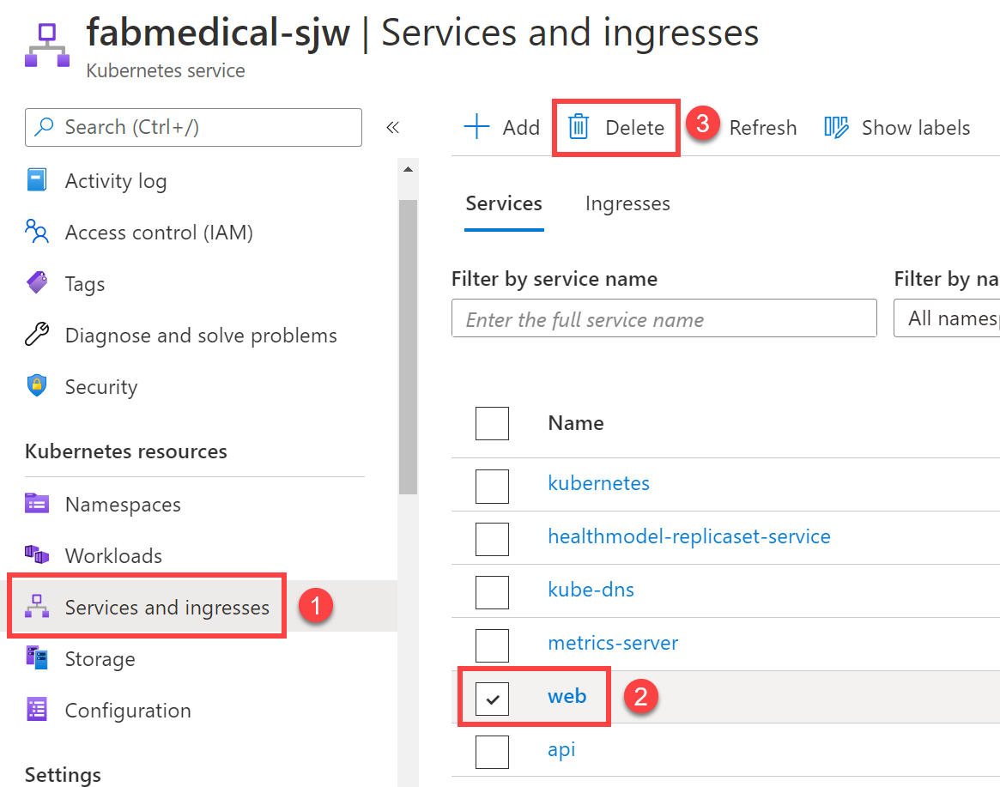
    <figcaption aria-hidden="true">
        <font style="vertical-align: inherit;"><font style="vertical-align: inherit;">Kubernetes管理仪表板的屏幕截图，显示了如何删除部署。</font></font>
    </figcaption>

5.  <font style="vertical-align: inherit;"><font style="vertical-align: inherit;">打开一个</font></font>**<font style="vertical-align: inherit;"><font style="vertical-align: inherit;">新的</font></font>**
    <font style="vertical-align: inherit;"><font style="vertical-align: inherit;">Azure Cloud Shell。</font></font>

6.  <font style="vertical-align: inherit;"><font style="vertical-align: inherit;">克隆您的fabicalical信息库（用您的信息库的URL替换URL）：</font></font>

    ```
    git clone https://github.com/USER_NAME/fabmedical.git
    ```

7.  <font style="vertical-align: inherit;"><font style="vertical-align: inherit;">我们将使用该</font></font>`helm create`
    <font style="vertical-align: inherit;"><font style="vertical-align: inherit;">命令来构建可以建立的图表实现。</font><font style="vertical-align: inherit;">使用以下命令</font></font>`web`
    <font style="vertical-align: inherit;"><font style="vertical-align: inherit;">在新目录中</font><font style="vertical-align: inherit;">创建一个新图表</font><font style="vertical-align: inherit;">（用克隆创建的目录替换“ fabmedical”）：</font></font>

    ```
    cd fabmedical
    cd content-web
    mkdir charts
    cd charts
    helm create web
    ```

8.  <font style="vertical-align: inherit;"><font style="vertical-align: inherit;">现在，我们需要更新生成的支架以符合我们的要求。</font><font style="vertical-align: inherit;">我们将首先更新名为的文件</font></font>`values.yaml`
    <font style="vertical-align: inherit;"><font style="vertical-align: inherit;">。</font></font>

    ```
    cd web
    code values.yaml
    ```

9.  <font style="vertical-align: inherit;"><font style="vertical-align: inherit;">搜索</font></font>`image`
    <font style="vertical-align: inherit;"><font style="vertical-align: inherit;">定义并更新值，使其与以下内容匹配：</font></font>

    ```
    image:
      repository: [LOGINSERVER].azurecr.io/content-web
      pullPolicy: Always
    ```

10.  <font style="vertical-align: inherit;"><font style="vertical-align: inherit;">搜索</font></font>`nameOverride`
    <font style="vertical-align: inherit;"><font style="vertical-align: inherit;">和</font></font>`fullnameOverride`
    <font style="vertical-align: inherit;"><font style="vertical-align: inherit;">输入并更新值，使其与以下内容匹配：</font></font>

    ```
    nameOverride: "web"
    fullnameOverride: "web"
    ```

11.  <font style="vertical-align: inherit;"><font style="vertical-align: inherit;">搜索</font></font>`service`
    <font style="vertical-align: inherit;"><font style="vertical-align: inherit;">定义并更新值，使其与以下内容匹配：</font></font>

    ```
    service:
      type: LoadBalancer
      port: 80
    ```

12.  <font style="vertical-align: inherit;"><font style="vertical-align: inherit;">搜索</font></font>`resources`
    <font style="vertical-align: inherit;"><font style="vertical-align: inherit;">定义并更新值，使其与以下内容匹配。</font><font style="vertical-align: inherit;">您要删除花括号并添加</font></font>`requests`
    <font style="vertical-align: inherit;"><font style="vertical-align: inherit;">（请确保删除</font></font>`resource:`
    <font style="vertical-align: inherit;"><font style="vertical-align: inherit;">节点</font><font style="vertical-align: inherit;">后的{}字符</font><font style="vertical-align: inherit;">）：</font></font>

    ```
    resources:
      # We usually recommend not to specify default resources and to leave this as a conscious
      # choice for the user. This also increases chances charts run on environments with little
      # resources, such as Minikube. If you do want to specify resources, uncomment the following
      # lines, adjust them as necessary, and remove the curly braces after 'resources:'.
      # limits:
      #  cpu: 100m
      #  memory: 128Mi
      requests:
        cpu: 1000m
        memory: 128Mi
    ```

13.  <font style="vertical-align: inherit;"><font style="vertical-align: inherit;">保存更改并关闭编辑器。</font></font>

14.  <font style="vertical-align: inherit;"><font style="vertical-align: inherit;">现在，我们将更新名为的文件</font></font>`Chart.yaml`
    <font style="vertical-align: inherit;"><font style="vertical-align: inherit;">。</font></font>

    ```
    code Chart.yaml
    ```

15.  <font style="vertical-align: inherit;"><font style="vertical-align: inherit;">搜索</font></font>`appVersion`
    <font style="vertical-align: inherit;"><font style="vertical-align: inherit;">条目并更新值，使其与以下内容匹配：</font></font>

    ```
    appVersion: latest
    ```

16.  <font style="vertical-align: inherit;"><font style="vertical-align: inherit;">现在，我们将更新名为的文件</font></font>`deployment.yaml`
    <font style="vertical-align: inherit;"><font style="vertical-align: inherit;">。</font></font>

    ```
    cd templates
    code deployment.yaml
    ```

17.  <font style="vertical-align: inherit;"><font style="vertical-align: inherit;">搜索</font></font>`metadata`
    <font style="vertical-align: inherit;"><font style="vertical-align: inherit;">定义并更新值，使其与以下内容匹配。</font><font style="vertical-align: inherit;">您将替换注释下的行：</font></font>

    ```
    apiVersion: apps/v1
    kind: Deployment
    metadata:
      (...)
    spec:
      (...)
      template:
        metadata:
          (...)
          annotations:
            rollme: {{ randAlphaNum 5 | quote }}
    ```

18.  <font style="vertical-align: inherit;"><font style="vertical-align: inherit;">搜索</font></font>`containers`
    <font style="vertical-align: inherit;"><font style="vertical-align: inherit;">定义并更新值，使其与以下内容匹配。</font><font style="vertical-align: inherit;">您正在改变</font></font>`containerPort`
    <font style="vertical-align: inherit;"><font style="vertical-align: inherit;">，</font></font>`livenessProbe`
    <font style="vertical-align: inherit;"><font style="vertical-align: inherit;">端口并添加</font></font>`env`
    <font style="vertical-align: inherit;"><font style="vertical-align: inherit;">变量：</font></font>

    ```
    containers:
      - name: {{ .Chart.Name }}
        securityContext:
          {{- toYaml .Values.securityContext | nindent 12 }}
        image: "{{ .Values.image.repository }}:{{ .Chart.AppVersion }}"
        imagePullPolicy: {{ .Values.image.pullPolicy }}
        ports:
          - name: http
            containerPort: 3000
            protocol: TCP
        env:
          - name: CONTENT_API_URL
            value: http://api:3001
        livenessProbe:
          httpGet:
            path: /
            port: 3000
    ```

19.  <font style="vertical-align: inherit;"><font style="vertical-align: inherit;">保存更改并关闭编辑器。</font></font>

20.  <font style="vertical-align: inherit;"><font style="vertical-align: inherit;">现在，我们将更新名为的文件</font></font>`service.yaml`
    <font style="vertical-align: inherit;"><font style="vertical-align: inherit;">。</font></font>

    ```
    code service.yaml
    ```

21.  <font style="vertical-align: inherit;"><font style="vertical-align: inherit;">搜索</font></font>`ports`
    <font style="vertical-align: inherit;"><font style="vertical-align: inherit;">定义并更新值，使其与以下内容匹配：</font></font>

    ```
    ports:
      - port: {{ .Values.service.port }}
        targetPort: 3000
        protocol: TCP
        name: http
    ```

22.  <font style="vertical-align: inherit;"><font style="vertical-align: inherit;">保存更改并关闭编辑器。</font></font>

23.  <font style="vertical-align: inherit;"><font style="vertical-align: inherit;">现在，该图表已设置为部署我们的Web容器。</font><font style="vertical-align: inherit;">键入以下命令以部署Helm图表描述的应用程序。</font><font style="vertical-align: inherit;">您将收到一条消息，指示头盔已创建Web部署和Web服务。</font></font>

    ```
    cd ../..
    helm install web ./web
    ```

    
    <figcaption aria-hidden="true">
        <font style="vertical-align: inherit;"><font style="vertical-align: inherit;">在控制台的此屏幕快照中，已键入helm install web ./web并在命令提示符下运行。</font><font style="vertical-align: inherit;">有关Web部署和Web服务创建的消息显示在下面。</font></font>
    </figcaption>

24.  <font style="vertical-align: inherit;"><font style="vertical-align: inherit;">返回打开了Azure门户的浏览器。</font><font style="vertical-align: inherit;">从导航菜单中，选择</font></font>**<font style="vertical-align: inherit;"><font style="vertical-align: inherit;">服务和入口</font></font>**
    <font style="vertical-align: inherit;"><font style="vertical-align: inherit;">。</font><font style="vertical-align: inherit;">您将看到Web服务正在部署，该部署可能需要几分钟。</font><font style="vertical-align: inherit;">完成后，您应该可以通过外部端点访问该网站。</font></font>

    
    <figcaption aria-hidden="true">
        <font style="vertical-align: inherit;"><font style="vertical-align: inherit;">在Azure门户的AKS服务和入口刀片中，显示所选的Web服务。</font></font>
    </figcaption>

25.  <font style="vertical-align: inherit;"><font style="vertical-align: inherit;">选择发言人和会话链接，并检查每个链接的内容是否显示。</font></font>

    
    <figcaption aria-hidden="true">
        <font style="vertical-align: inherit;"><font style="vertical-align: inherit;">该网站的屏幕快照，显示未显示任何数据。</font></font>
    </figcaption>

26.  <font style="vertical-align: inherit;"><font style="vertical-align: inherit;">现在，我们将Helm图表提交到GitHub存储库。</font><font style="vertical-align: inherit;">在“ fabmedical”克隆的根文件夹中执行以下命令：</font></font>

    ```
    git add content-web/charts/
    git commit -m "Helm chart added."
    git push
    ```

### <font style="vertical-align: inherit;"><font style="vertical-align: inherit;">任务5：配置持续交付到Kubernetes集群</font></font>

<font style="vertical-align: inherit;"><font style="vertical-align: inherit;">在此任务中，您将使用GitHub Actions工作流来自动化将Web映像部署到AKS集群的过程。</font><font style="vertical-align: inherit;">您将更新工作流程并配置作业，以便在将新映像推送到ACR时，管道将映像部署到AKS群集。</font></font>

1.  <font style="vertical-align: inherit;"><font style="vertical-align: inherit;">导航到</font></font>`.github/workflows`
    <font style="vertical-align: inherit;"><font style="vertical-align: inherit;">git存储库</font><font style="vertical-align: inherit;">的</font><font style="vertical-align: inherit;">文件夹，然后</font></font>`content-web.yml`
    <font style="vertical-align: inherit;"><font style="vertical-align: inherit;">使用</font><font style="vertical-align: inherit;">打开</font><font style="vertical-align: inherit;">工作流程</font></font>`vi`
    <font style="vertical-align: inherit;"><font style="vertical-align: inherit;">：</font></font>

    ```
    cd ~/MCW-Cloud-native-applications/Hands-on\ lab/lab-files/developer/.github/workflows
    vi content-web.yml
    ```

2.  <font style="vertical-align: inherit;"><font style="vertical-align: inherit;">您将在</font></font>`content-web.yml`
    <font style="vertical-align: inherit;"><font style="vertical-align: inherit;">工作流程</font><font style="vertical-align: inherit;">的底部添加第二个作业</font><font style="vertical-align: inherit;">。</font><font style="vertical-align: inherit;">将以下内容粘贴到文件末尾：</font></font>

    > **<font style="vertical-align: inherit;"><font style="vertical-align: inherit;">注意</font></font>**
    > <font style="vertical-align: inherit;"><font style="vertical-align: inherit;">：粘贴时请小心检查缩进量。</font><font style="vertical-align: inherit;">该</font></font>`build-and-push-helm-chart`
    > <font style="vertical-align: inherit;"><font style="vertical-align: inherit;">节点应缩进2个空格，并与该</font></font>`build-and-publish-docker-image`
    > <font style="vertical-align: inherit;"><font style="vertical-align: inherit;">作业</font><font style="vertical-align: inherit;">的节点</font><font style="vertical-align: inherit;">对齐。</font></font>

    ```
    build-and-push-helm-chart:
        name: Build and Push Helm Chart
        runs-on: ubuntu-latest
        needs: [build-and-publish-docker-image]
        steps:
        # Checkout the repo
        - uses: actions/checkout@master

        - name: Helm Install
          uses: azure/setup-helm@v1

        - name: Helm Repo Add
          run: |
            helm repo add ${{ env.containerRegistryName }} https://${{ env.containerRegistry }}/helm/v1/repo --username ${{ secrets.ACR_USERNAME }} --password ${{ secrets.ACR_PASSWORD }}
          env:
            HELM_EXPERIMENTAL_OCI: 1

        - name: Helm Chart Save
          run: |
            cd ./content-web/charts/web

            helm chart save . content-web:v${{ env.tag }}
            helm chart save . ${{ env.containerRegistry }}/helm/content-web:v${{ env.tag }}

            # list out saved charts
            helm chart list
          env:
            HELM_EXPERIMENTAL_OCI: 1

        - name: Helm Chart Push
          run: |
            helm registry login ${{ env.containerRegistry }} --username ${{ secrets.ACR_USERNAME }} --password ${{ secrets.ACR_PASSWORD }}
            helm chart push ${{ env.containerRegistry }}/helm/content-web:v${{ env.tag }}
          env:
            HELM_EXPERIMENTAL_OCI: 1
    ```

3.  <font style="vertical-align: inherit;"><font style="vertical-align: inherit;">保存文件。</font></font>

4.  <font style="vertical-align: inherit;"><font style="vertical-align: inherit;">在Azure Cloud Shell中，使用以下命令输出</font></font>`/.kube/config`
    <font style="vertical-align: inherit;"><font style="vertical-align: inherit;">包含用于使用Azure Kubernetes Service进行身份验证的凭据</font><font style="vertical-align: inherit;">的</font><font style="vertical-align: inherit;">文件。</font><font style="vertical-align: inherit;">这些凭证是先前检索到的，GitHub Actions还将需要这些凭证才能部署到AKS。</font><font style="vertical-align: inherit;">然后复制文件的内容。</font></font>

    ```
    cat ~/.kube/config
    ```

5.  <font style="vertical-align: inherit;"><font style="vertical-align: inherit;">在GitHub上，回归到</font></font>**<font style="vertical-align: inherit;"><font style="vertical-align: inherit;">Fabmedical</font></font>**
    <font style="vertical-align: inherit;"><font style="vertical-align: inherit;">库屏幕上，选择</font></font>**<font style="vertical-align: inherit;"><font style="vertical-align: inherit;">设置</font></font>**
    <font style="vertical-align: inherit;"><font style="vertical-align: inherit;">选项卡，选择</font></font>**<font style="vertical-align: inherit;"><font style="vertical-align: inherit;">秘密</font></font>**
    <font style="vertical-align: inherit;"><font style="vertical-align: inherit;">从左边的菜单，然后选择</font></font>**<font style="vertical-align: inherit;"><font style="vertical-align: inherit;">新建秘密</font></font>**
    <font style="vertical-align: inherit;"><font style="vertical-align: inherit;">按钮。</font></font>

6.  <font style="vertical-align: inherit;"><font style="vertical-align: inherit;">使用的名称创建一个新的GitHub Secret，</font></font>`KUBECONFIG`
    <font style="vertical-align: inherit;"><font style="vertical-align: inherit;">并粘贴</font></font>`~/.kube/config`
    <font style="vertical-align: inherit;"><font style="vertical-align: inherit;">先前复制</font><font style="vertical-align: inherit;">的</font><font style="vertical-align: inherit;">文件</font><font style="vertical-align: inherit;">的内容</font><font style="vertical-align: inherit;">。</font></font>

    
    <figcaption aria-hidden="true">
        <font style="vertical-align: inherit;"><font style="vertical-align: inherit;">屏幕截图显示了KUBECONFIG秘密</font></font>
    </figcaption>

7.  <font style="vertical-align: inherit;"><font style="vertical-align: inherit;">现在返回以编辑</font></font>`content-web.yml`
    <font style="vertical-align: inherit;"><font style="vertical-align: inherit;">工作流程，并将以下内容粘贴到文件末尾。</font></font>

    > **<font style="vertical-align: inherit;"><font style="vertical-align: inherit;">注意</font></font>**
    > <font style="vertical-align: inherit;"><font style="vertical-align: inherit;">：粘贴时请小心检查缩进量。</font><font style="vertical-align: inherit;">该</font></font>`aks-deployment`
    > <font style="vertical-align: inherit;"><font style="vertical-align: inherit;">节点应缩进2个空格，并与该</font></font>`build-and-push-helm-chart`
    > <font style="vertical-align: inherit;"><font style="vertical-align: inherit;">作业</font><font style="vertical-align: inherit;">的节点</font><font style="vertical-align: inherit;">对齐。</font></font>

    ```
    aks-deployment:
        name: AKS Deployment
        runs-on: ubuntu-latest
        needs: [build-and-publish-docker-image,build-and-push-helm-chart]
        steps:
        # Checkout the repo
        - uses: actions/checkout@master

        - name: Helm Install
          uses: azure/setup-helm@v1

        - name: kubeconfig
          run: echo "${{ secrets.KUBECONFIG }}" >> kubeconfig

        - name: Helm Repo Add
          run: |
            helm repo add ${{ env.containerRegistry }} https://${{ env.containerRegistry }}/helm/v1/repo --username ${{ secrets.ACR_USERNAME }} --password ${{ secrets.ACR_PASSWORD }}
            helm repo update
          env:
            HELM_EXPERIMENTAL_OCI: 1

        - name: Helm Upgrade
          run: |
            helm registry login ${{ env.containerRegistry }} --username ${{ secrets.ACR_USERNAME }} --password ${{ secrets.ACR_PASSWORD }}
            helm chart pull ${{ env.containerRegistry }}/helm/content-web:v${{ env.tag }}
            helm chart export ${{ env.containerRegistry }}/helm/content-web:v${{ env.tag }} --destination ./upgrade
            helm upgrade web ./upgrade/web
          env:
            KUBECONFIG: './kubeconfig'
            HELM_EXPERIMENTAL_OCI: 1
    ```

8.  <font style="vertical-align: inherit;"><font style="vertical-align: inherit;">保存文件。</font></font>

9.  <font style="vertical-align: inherit;"><font style="vertical-align: inherit;">提交您的更改</font></font>

    ```
    cd ..
    git pull
    git add --all
    git commit -m "Deployment update."
    git push
    ```

10.  <font style="vertical-align: inherit;"><font style="vertical-align: inherit;">切换回GitHub。</font></font>

11.  <font style="vertical-align: inherit;"><font style="vertical-align: inherit;">在</font></font>**<font style="vertical-align: inherit;"><font style="vertical-align: inherit;">内容网络</font></font>**
    <font style="vertical-align: inherit;"><font style="vertical-align: inherit;">工作流上，选择</font></font>**<font style="vertical-align: inherit;"><font style="vertical-align: inherit;">“运行工作流”</font></font>**
    <font style="vertical-align: inherit;"><font style="vertical-align: inherit;">并手动触发工作流执行。</font></font>

    
    <figcaption aria-hidden="true">
        <font style="vertical-align: inherit;"><font style="vertical-align: inherit;">内容网络操作显示为突出显示的操作，内容网络和运行工作流程链接。</font></font>
    </figcaption>

12.  <font style="vertical-align: inherit;"><font style="vertical-align: inherit;">选择当前运行的工作流程将显示其状态。</font></font>

    
    <figcaption aria-hidden="true">
        <font style="vertical-align: inherit;"><font style="vertical-align: inherit;">屏幕截图显示了工作流程正在运行以及当前状态。</font></font>
    </figcaption>

### <font style="vertical-align: inherit;"><font style="vertical-align: inherit;">任务6：查看用于容器的Azure监视器</font></font>

<font style="vertical-align: inherit;"><font style="vertical-align: inherit;">在此任务中，您将访问和查看Azure Monitor for Containers提供的各种日志和仪表板。</font></font>

1.  <font style="vertical-align: inherit;"><font style="vertical-align: inherit;">在Azure门户中，选择您创建的名为的资源组</font></font>`fabmedical-SUFFIX`
    <font style="vertical-align: inherit;"><font style="vertical-align: inherit;">，然后选择您的</font></font>`Kubernetes Service`
    <font style="vertical-align: inherit;"><font style="vertical-align: inherit;">Azure资源。</font></font>

    
    <figcaption aria-hidden="true">
        <font style="vertical-align: inherit;"><font style="vertical-align: inherit;">在此屏幕截图中，先前已选择资源组，并且已选择AKS集群。</font></font>
    </figcaption>

2.  <font style="vertical-align: inherit;"><font style="vertical-align: inherit;">从“监视”刀片中，选择“</font></font>**<font style="vertical-align: inherit;"><font style="vertical-align: inherit;">见解”</font></font>**
    <font style="vertical-align: inherit;"><font style="vertical-align: inherit;">。</font></font>

    
    <figcaption aria-hidden="true">
        <font style="vertical-align: inherit;"><font style="vertical-align: inherit;">在“监视”刀片中，“见解”突出显示。</font></font>
    </figcaption>

3.  <font style="vertical-align: inherit;"><font style="vertical-align: inherit;">查看各种可用的仪表板，并深入了解群集，节点，控制器和已部署的容器上的各种度量和日志。</font></font>

    
    <figcaption aria-hidden="true">
        <font style="vertical-align: inherit;"><font style="vertical-align: inherit;">在此屏幕截图中，显示了仪表板和刀片。</font><font style="vertical-align: inherit;">可以查看群集指标。</font></font>
    </figcaption>

4.  <font style="vertical-align: inherit;"><font style="vertical-align: inherit;">要查看“容器”仪表板并查看有关每个容器的更多详细信息，请选择“</font></font>**<font style="vertical-align: inherit;"><font style="vertical-align: inherit;">容器”</font></font>**
    <font style="vertical-align: inherit;"><font style="vertical-align: inherit;">选项卡。</font></font>

    
    <figcaption aria-hidden="true">
        <font style="vertical-align: inherit;"><font style="vertical-align: inherit;">在此屏幕快照中，显示了各种容器信息。</font></font>
    </figcaption>

5.  <font style="vertical-align: inherit;"><font style="vertical-align: inherit;">现在按容器名称过滤并搜索</font></font>**<font style="vertical-align: inherit;"><font style="vertical-align: inherit;">Web</font></font>**
    <font style="vertical-align: inherit;"><font style="vertical-align: inherit;">容器，您将看到在Kubernetes集群中创建的所有具有Pod名称的容器。</font><font style="vertical-align: inherit;">您可以将名称与kubernetes仪表板中的名称进行比较。</font></font>

    
    <figcaption aria-hidden="true">
        <font style="vertical-align: inherit;"><font style="vertical-align: inherit;">在此屏幕快照中，容器由名为web的容器过滤。</font></font>
    </figcaption>

6.  <font style="vertical-align: inherit;"><font style="vertical-align: inherit;">默认情况下，将选择“ CPU使用率”度量标准，以显示所选容器的所有cpu信息，要切换到另一个度量标准，请打开度量标准下拉列表并选择其他度量标准。</font></font>

    
    <figcaption aria-hidden="true">
        <font style="vertical-align: inherit;"><font style="vertical-align: inherit;">在此屏幕截图中，显示了各种指标选项。</font></font>
    </figcaption>

7.  <font style="vertical-align: inherit;"><font style="vertical-align: inherit;">在选择任何吊舱，所有与所选指标的信息将显示在右侧面板上，并选择其他指标时会出现这种情况，细节将选定吊舱右侧面板上显示。</font></font>

    
    <figcaption aria-hidden="true">
        <font style="vertical-align: inherit;"><font style="vertical-align: inherit;">在此屏幕快照中，显示了pod cpu的使用详细信息。</font></font>
    </figcaption>

8.  <font style="vertical-align: inherit;"><font style="vertical-align: inherit;">要显示任何容器的日志，只需选择它并查看右侧面板，您将找到“查看容器日志”选项，该选项将列出该特定容器的所有日志。</font></font>

    
    <figcaption aria-hidden="true">
        <font style="vertical-align: inherit;"><font style="vertical-align: inherit;">在“在Analytics（分析）中查看”下拉列表中，选择了“查看容器日志”项。</font></font>
    </figcaption>

    
    <figcaption aria-hidden="true">
        <font style="vertical-align: inherit;"><font style="vertical-align: inherit;">根据在查询窗口中输入的查询显示容器日志。</font></font>
    </figcaption>

9.  <font style="vertical-align: inherit;"><font style="vertical-align: inherit;">对于每个日志条目，您可以通过展开日志条目以查看以下详细信息来显示更多信息。</font></font>

    
    <figcaption aria-hidden="true">
        <font style="vertical-align: inherit;"><font style="vertical-align: inherit;">显示容器日志查询结果，在结果视图中展开一个日志条目，并显示其详细信息。</font></font>
    </figcaption>

## <font style="vertical-align: inherit;"><font style="vertical-align: inherit;">练习4：扩展应用程序并测试HA</font></font>

**<font style="vertical-align: inherit;"><font style="vertical-align: inherit;">片长</font></font>**
<font style="vertical-align: inherit;"><font style="vertical-align: inherit;">：20分钟</font></font>

<font style="vertical-align: inherit;"><font style="vertical-align: inherit;">至此，您已经部署了Web和API服务容器的单个实例。</font><font style="vertical-align: inherit;">在本练习中，您将增加Web服务的容器实例的数量，并扩展现有集群上的前端。</font></font>

### <font style="vertical-align: inherit;"><font style="vertical-align: inherit;">任务1：从Azure门户增加服务实例</font></font>

<font style="vertical-align: inherit;"><font style="vertical-align: inherit;">在此任务中，您将增加AKS Azure门户刀片中API部署的实例数。</font><font style="vertical-align: inherit;">在部署过程中，您将观察到状态的变化。</font></font>

1.  <font style="vertical-align: inherit;"><font style="vertical-align: inherit;">在Azure门户的AKS刀片中，选择“</font></font>**<font style="vertical-align: inherit;"><font style="vertical-align: inherit;">工作负载”</font></font>**
    <font style="vertical-align: inherit;"><font style="vertical-align: inherit;">，然后选择</font></font>**<font style="vertical-align: inherit;"><font style="vertical-align: inherit;">API</font></font>**
    <font style="vertical-align: inherit;"><font style="vertical-align: inherit;">部署。</font></font>

2.  <font style="vertical-align: inherit;"><font style="vertical-align: inherit;">在加载的窗口中</font><font style="vertical-align: inherit;">选择</font></font>**<font style="vertical-align: inherit;"><font style="vertical-align: inherit;">YAML</font></font>**
    <font style="vertical-align: inherit;"><font style="vertical-align: inherit;">，然后向下滚动直到找到</font></font>**<font style="vertical-align: inherit;"><font style="vertical-align: inherit;">副本</font></font>**
    <font style="vertical-align: inherit;"><font style="vertical-align: inherit;">。</font><font style="vertical-align: inherit;">将副本数更改为</font></font>**<font style="vertical-align: inherit;"><font style="vertical-align: inherit;">2</font></font>**
    <font style="vertical-align: inherit;"><font style="vertical-align: inherit;">，然后选择“</font></font>**<font style="vertical-align: inherit;"><font style="vertical-align: inherit;">审阅+保存”</font></font>**
    <font style="vertical-align: inherit;"><font style="vertical-align: inherit;">。</font><font style="vertical-align: inherit;">出现提示时，选中</font></font>**<font style="vertical-align: inherit;"><font style="vertical-align: inherit;">确认清单更改，</font></font>**
    <font style="vertical-align: inherit;"><font style="vertical-align: inherit;">然后选择</font></font>**<font style="vertical-align: inherit;"><font style="vertical-align: inherit;">保存</font></font>**
    <font style="vertical-align: inherit;"><font style="vertical-align: inherit;">。</font></font>

    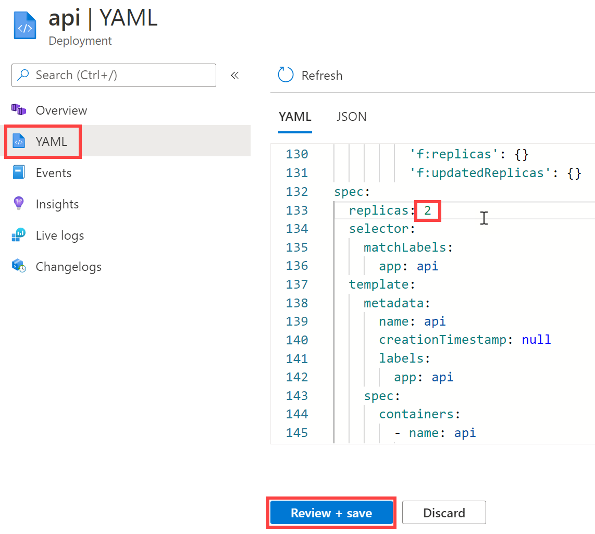
    <figcaption aria-hidden="true">
        <font style="vertical-align: inherit;"><font style="vertical-align: inherit;">在“编辑YAML”对话框中，在所需的副本数中输入2。</font></font>
    </figcaption>

    > **<font style="vertical-align: inherit;"><font style="vertical-align: inherit;">注意</font></font>**
    > <font style="vertical-align: inherit;"><font style="vertical-align: inherit;">：如果部署快速完成，则可能无法在门户中看到部署等待状态，如以下步骤所述。</font></font>

3.  <font style="vertical-align: inherit;"><font style="vertical-align: inherit;">从API的“副本集”视图中，您将看到它正在部署中，并且有一个正常实例和一个挂起实例。</font></font>

    
    <figcaption aria-hidden="true">
        <font style="vertical-align: inherit;"><font style="vertical-align: inherit;">在左侧导航菜单的“工作量”下选择“副本集”，在右侧，“窗格”状态：1个待处理，1个运行被突出显示。</font><font style="vertical-align: inherit;">在其下方，红色箭头指向Pods框中的API部署。</font></font>
    </figcaption>

4.  <font style="vertical-align: inherit;"><font style="vertical-align: inherit;">从导航菜单中，选择</font></font>**<font style="vertical-align: inherit;"><font style="vertical-align: inherit;">工作量</font></font>**
    <font style="vertical-align: inherit;"><font style="vertical-align: inherit;">。</font><font style="vertical-align: inherit;">请注意，api部署具有警报，并显示2个实例的pod数1（显示为</font></font>`1/2`
    <font style="vertical-align: inherit;"><font style="vertical-align: inherit;">）。</font></font>

    
    <figcaption aria-hidden="true">
        <font style="vertical-align: inherit;"><font style="vertical-align: inherit;">在“部署”框中，突出显示api服务，左侧带有灰色计时器图标，右侧列出了pod数量1/2。</font></font>
    </figcaption>

    > **<font style="vertical-align: inherit;"><font style="vertical-align: inherit;">注意</font></font>**
    > <font style="vertical-align: inherit;"><font style="vertical-align: inherit;">：如果收到有关CPU不足的错误，则可以。</font><font style="vertical-align: inherit;">我们将在下一个任务中看到如何处理此问题（提示：您可以使用</font><font style="vertical-align: inherit;">AKS Azure门户中的</font><font style="vertical-align: inherit;">“</font></font>**<font style="vertical-align: inherit;"><font style="vertical-align: inherit;">见解”</font></font>**
    > <font style="vertical-align: inherit;"><font style="vertical-align: inherit;">选项来查看</font></font>**<font style="vertical-align: inherit;"><font style="vertical-align: inherit;">节点</font></font>**
    > <font style="vertical-align: inherit;"><font style="vertical-align: inherit;">状态并查看Kubernetes事件日志）。</font></font>

5.  <font style="vertical-align: inherit;"><font style="vertical-align: inherit;">从导航菜单中，选择</font></font>**<font style="vertical-align: inherit;"><font style="vertical-align: inherit;">工作量</font></font>**
    <font style="vertical-align: inherit;"><font style="vertical-align: inherit;">。</font><font style="vertical-align: inherit;">在此视图中，请注意此视图右侧面板中的运行状况概述。</font><font style="vertical-align: inherit;">您将看到以下内容：</font></font>
    * <font style="vertical-align: inherit;"><font style="vertical-align: inherit;">一个部署和一个副本集对于Web服务而言都是健康的。</font></font>

    * <font style="vertical-align: inherit;"><font style="vertical-align: inherit;">api部署和副本集处于警告状态。</font></font>

    * <font style="vertical-align: inherit;"><font style="vertical-align: inherit;">在“默认”名称空间中，两个容器是正常的。</font></font>

6.  <font style="vertical-align: inherit;"><font style="vertical-align: inherit;">打开Contoso Neuro Conference Web应用程序。</font><font style="vertical-align: inherit;">当您导航到“发言人”和“会话”页面时，该应用程序仍应可以正常工作。</font></font>
    * <font style="vertical-align: inherit;"><font style="vertical-align: inherit;">导航到</font></font>`/stats`
        <font style="vertical-align: inherit;"><font style="vertical-align: inherit;">页面。</font><font style="vertical-align: inherit;">您将看到有关托管环境的信息，包括：</font></font>
        * **<font style="vertical-align: inherit;"><font style="vertical-align: inherit;">webTaskId：</font></font>**
            <font style="vertical-align: inherit;"><font style="vertical-align: inherit;"> Web服务实例的任务标识符。</font></font>

        * **<font style="vertical-align: inherit;"><font style="vertical-align: inherit;">taskId：</font></font>**
            <font style="vertical-align: inherit;"><font style="vertical-align: inherit;"> API服务实例的任务标识符。</font></font>

        * **<font style="vertical-align: inherit;"><font style="vertical-align: inherit;">hostName：</font></font>**
            <font style="vertical-align: inherit;"><font style="vertical-align: inherit;"> API服务实例的主机名标识符。</font></font>

        * **<font style="vertical-align: inherit;"><font style="vertical-align: inherit;">pid：</font></font>**
            <font style="vertical-align: inherit;"><font style="vertical-align: inherit;"> API服务实例的进程ID。</font></font>

        * **<font style="vertical-align: inherit;"><font style="vertical-align: inherit;">记忆：</font></font>**
            <font style="vertical-align: inherit;"><font style="vertical-align: inherit;">从API服务实例返回的一些内存指示符。</font></font>

        * **<font style="vertical-align: inherit;"><font style="vertical-align: inherit;">counters：</font></font>**
            <font style="vertical-align: inherit;"><font style="vertical-align: inherit;">由API服务实例返回的服务本身的计数器。</font></font>

        * **<font style="vertical-align: inherit;"><font style="vertical-align: inherit;">正常运行时间：</font></font>**
            <font style="vertical-align: inherit;"><font style="vertical-align: inherit;"> API服务的</font><strong><font style="vertical-align: inherit;">正常运行</font></strong><font style="vertical-align: inherit;">时间。</font></font>

### <font style="vertical-align: inherit;"><font style="vertical-align: inherit;">任务2：解决副本的置备失败</font></font>

<font style="vertical-align: inherit;"><font style="vertical-align: inherit;">在此任务中，您将解决失败的API副本。</font><font style="vertical-align: inherit;">这些失败是由于群集无法满足请求的资源而发生的。</font></font>

1.  <font style="vertical-align: inherit;"><font style="vertical-align: inherit;">在Azure门户的AKS刀片中，选择“</font></font>**<font style="vertical-align: inherit;"><font style="vertical-align: inherit;">工作负载”</font></font>**
    <font style="vertical-align: inherit;"><font style="vertical-align: inherit;">，然后选择</font></font>**<font style="vertical-align: inherit;"><font style="vertical-align: inherit;">API</font></font>**
    <font style="vertical-align: inherit;"><font style="vertical-align: inherit;">部署。</font><font style="vertical-align: inherit;">选择</font></font>**<font style="vertical-align: inherit;"><font style="vertical-align: inherit;">YAML</font></font>**
    <font style="vertical-align: inherit;"><font style="vertical-align: inherit;">导航项。</font></font>

2.  <font style="vertical-align: inherit;"><font style="vertical-align: inherit;">在</font></font>**<font style="vertical-align: inherit;"><font style="vertical-align: inherit;">YAML</font></font>**
    <font style="vertical-align: inherit;"><font style="vertical-align: inherit;">屏幕中，向下滚动并更改以下项目：</font></font>
    * <font style="vertical-align: inherit;"><font style="vertical-align: inherit;">修改</font></font>**<font style="vertical-align: inherit;"><font style="vertical-align: inherit;">端口</font></font>**
        <font style="vertical-align: inherit;"><font style="vertical-align: inherit;">并删除</font></font>**<font style="vertical-align: inherit;"><font style="vertical-align: inherit;">hostPort</font></font>**
        <font style="vertical-align: inherit;"><font style="vertical-align: inherit;">。</font><font style="vertical-align: inherit;">两个Pod无法映射到同一主机端口。</font></font>

        ```
        ports:
           - containerPort: 3001
           protocol: TCP
        ```

    * <font style="vertical-align: inherit;"><font style="vertical-align: inherit;">修改</font></font>**<font style="vertical-align: inherit;"><font style="vertical-align: inherit;">cpu</font></font>**
        <font style="vertical-align: inherit;"><font style="vertical-align: inherit;">并将其设置为</font></font>**<font style="vertical-align: inherit;"><font style="vertical-align: inherit;">100m</font></font>**
        <font style="vertical-align: inherit;"><font style="vertical-align: inherit;">。</font><font style="vertical-align: inherit;">CPU在节点上的所有Pod之间划分。</font></font>

        ```
        resources:
           requests:
              cpu: 100m
              memory: 128Mi
        ```

    <font style="vertical-align: inherit;"><font style="vertical-align: inherit;">选择</font></font>**<font style="vertical-align: inherit;"><font style="vertical-align: inherit;">查看</font></font>**
    <font style="vertical-align: inherit;"><font style="vertical-align: inherit;">并</font><strong><font style="vertical-align: inherit;">保存</font></strong><font style="vertical-align: inherit;">，然后在出现提示时确认更改并选择</font></font>**<font style="vertical-align: inherit;"><font style="vertical-align: inherit;">保存</font></font>**
    <font style="vertical-align: inherit;"><font style="vertical-align: inherit;">。</font></font>

    
    <figcaption aria-hidden="true">
        <font style="vertical-align: inherit;"><font style="vertical-align: inherit;">在“编辑YAML”对话框中，显示所需的两项更改。</font></font>
    </figcaption>

3.  <font style="vertical-align: inherit;"><font style="vertical-align: inherit;">返回到</font><font style="vertical-align: inherit;">AKS Azure门户上的</font><font style="vertical-align: inherit;">“</font></font>**<font style="vertical-align: inherit;"><font style="vertical-align: inherit;">工作负载”</font></font>**
    <font style="vertical-align: inherit;"><font style="vertical-align: inherit;">主视图，现在您将看到在运行两个Pod的情况下部署是正常的。</font></font>

    
    <figcaption aria-hidden="true">
        <font style="vertical-align: inherit;"><font style="vertical-align: inherit;">在工作负载视图中突出显示了API部署。</font></font>
    </figcaption>

### <font style="vertical-align: inherit;"><font style="vertical-align: inherit;">任务3：重新启动容器并测试HA</font></font>

<font style="vertical-align: inherit;"><font style="vertical-align: inherit;">在此任务中，您将重新启动容器并验证重新启动不会影响正在运行的服务。</font></font>

1.  <font style="vertical-align: inherit;"><font style="vertical-align: inherit;">打开示例Web应用程序，然后导航到“统计”页面，如图所示。</font></font>

    
    <figcaption aria-hidden="true">
        <font style="vertical-align: inherit;"><font style="vertical-align: inherit;">“状态”页面在Contoso Neuro Web应用程序的此屏幕截图中可见。</font></font>
    </figcaption>

2.  <font style="vertical-align: inherit;"><font style="vertical-align: inherit;">在Azure门户的AKS刀片中，打开api部署并将所需的副本数增加到</font></font>`4`
    <font style="vertical-align: inherit;"><font style="vertical-align: inherit;">。</font><font style="vertical-align: inherit;">使用与练习4，任务1相同的过程。</font></font>

    
    <figcaption aria-hidden="true">
        <font style="vertical-align: inherit;"><font style="vertical-align: inherit;">在左侧菜单中，选择“部署”项。</font><font style="vertical-align: inherit;">API部署在“部署”列表框中突出显示。</font></font>
    </figcaption>

3.  <font style="vertical-align: inherit;"><font style="vertical-align: inherit;">片刻之后，您会发现API部署现在已成功运行4个副本。</font></font>

4.  <font style="vertical-align: inherit;"><font style="vertical-align: inherit;">返回加载了Web应用程序统计信息页面的浏览器选项卡。</font><font style="vertical-align: inherit;">一遍又一遍地刷新页面。</font><font style="vertical-align: inherit;">您不会看到任何错误，但是会看到两个api pod实例之间的api主机名定期更改。</font><font style="vertical-align: inherit;">任务id和pid也可能在两个api pod实例之间更改。</font></font>

    
    <figcaption aria-hidden="true">
        <font style="vertical-align: inherit;"><font style="vertical-align: inherit;">在Contoso Neuro Web应用程序的“统计信息”页面上，突出显示了两个不同的api主机名值。</font></font>
    </figcaption>

5.  <font style="vertical-align: inherit;"><font style="vertical-align: inherit;">刷新足够的时间以查看该</font></font>`hostName`
    <font style="vertical-align: inherit;"><font style="vertical-align: inherit;">值正在更改并且该服务保持正常之后，可以</font><font style="vertical-align: inherit;">在Azure门户中</font><font style="vertical-align: inherit;">打开</font><font style="vertical-align: inherit;">API</font><font style="vertical-align: inherit;">的</font></font>**<font style="vertical-align: inherit;"><font style="vertical-align: inherit;">副本集</font></font>**
    <font style="vertical-align: inherit;"><font style="vertical-align: inherit;">视图。</font></font>

6.  <font style="vertical-align: inherit;"><font style="vertical-align: inherit;">在此视图上，您​​可以看到Web应用程序统计信息页面中显示的hostName值与正在运行的Pod的Pod名称匹配。</font></font>

    
    <figcaption aria-hidden="true">
        <font style="vertical-align: inherit;"><font style="vertical-align: inherit;">查看Azure门户中的副本集。</font></font>
    </figcaption>

7.  <font style="vertical-align: inherit;"><font style="vertical-align: inherit;">随机选择两个Pod，然后选择</font></font>**<font style="vertical-align: inherit;"><font style="vertical-align: inherit;">Delete</font></font>**
    <font style="vertical-align: inherit;"><font style="vertical-align: inherit;">。</font></font>

    
    <figcaption aria-hidden="true">
        <font style="vertical-align: inherit;"><font style="vertical-align: inherit;">窗格列表中某个窗格的上下文菜单会在选中“删除”项目的情况下展开。</font></font>
    </figcaption>

8.  <font style="vertical-align: inherit;"><font style="vertical-align: inherit;">Kubernetes将启动新的Pod来满足所需的副本数。</font><font style="vertical-align: inherit;">根据您的视图，您可能会看到旧实例正在终止，新实例正在创建。</font></font>

    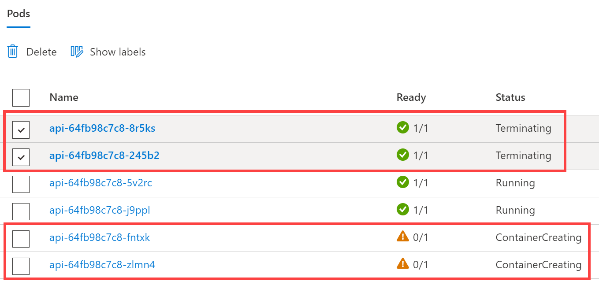
    <figcaption aria-hidden="true">
        <font style="vertical-align: inherit;"><font style="vertical-align: inherit;">“窗格”框的第一行将突出显示，并且该窗格具有绿色的复选标记并正在运行。</font></font>
    </figcaption>

9.  <font style="vertical-align: inherit;"><font style="vertical-align: inherit;">返回到API部署，并将其扩展回</font></font>`1`
    <font style="vertical-align: inherit;"><font style="vertical-align: inherit;">副本。</font><font style="vertical-align: inherit;">如果不确定，请参见上面的步骤2。</font></font>

10.  <font style="vertical-align: inherit;"><font style="vertical-align: inherit;">在浏览器中返回示例网站的统计信息页面，并在Kubernetes缩小Pod数量时刷新。</font><font style="vertical-align: inherit;">您会注意到，即使在API副本集视图中仍然可以看到几个正在运行的Pod，也只会显示一个API主机名。</font><font style="vertical-align: inherit;">即使有几个Pod正在运行，Kubernetes也将不再向其选择终止的Pod发送流量。</font><font style="vertical-align: inherit;">稍后，“ API副本集”视图中将仅显示一个窗格。</font></font>

    
    <figcaption aria-hidden="true">
        <font style="vertical-align: inherit;"><font style="vertical-align: inherit;">在左侧导航菜单中的“工作负载”下选择“副本集”。</font><font style="vertical-align: inherit;">右侧是“详细信息”和“窗格”框。</font><font style="vertical-align: inherit;">“窗格”框中仅显示一个API主机名，该主机名带有绿色的复选标记并被列为正在运行。</font></font>
    </figcaption>

### <font style="vertical-align: inherit;"><font style="vertical-align: inherit;">任务4：配置Cosmos DB自动缩放</font></font>

<font style="vertical-align: inherit;"><font style="vertical-align: inherit;">在此任务中，您将在Azure Cosmos DB上设置自动缩放。</font></font>

1.  <font style="vertical-align: inherit;"><font style="vertical-align: inherit;">在Azure门户中，导航到“ </font></font>`fabmedical-[SUFFIX]` **<font style="vertical-align: inherit;"><font style="vertical-align: inherit;">Azure Cosmos数据库帐户”</font></font>**
    <font style="vertical-align: inherit;"><font style="vertical-align: inherit;">。</font></font>

2.  <font style="vertical-align: inherit;"><font style="vertical-align: inherit;">选择“</font></font>**<font style="vertical-align: inherit;"><font style="vertical-align: inherit;">数据资源管理器”</font></font>**
    <font style="vertical-align: inherit;"><font style="vertical-align: inherit;">。</font></font>

3.  <font style="vertical-align: inherit;"><font style="vertical-align: inherit;">在</font></font>**<font style="vertical-align: inherit;"><font style="vertical-align: inherit;">Data Explorer中</font></font>**
    <font style="vertical-align: inherit;"><font style="vertical-align: inherit;">，展开</font></font>`contentdb`
    <font style="vertical-align: inherit;"><font style="vertical-align: inherit;">数据库，然后展开</font></font>`sessions`
    <font style="vertical-align: inherit;"><font style="vertical-align: inherit;">集合。</font></font>

4.  <font style="vertical-align: inherit;"><font style="vertical-align: inherit;">在</font></font>`sessions`
    <font style="vertical-align: inherit;"><font style="vertical-align: inherit;">集合下，选择“</font></font>**<font style="vertical-align: inherit;"><font style="vertical-align: inherit;">比例和设置”</font></font>**
    <font style="vertical-align: inherit;"><font style="vertical-align: inherit;">。</font></font>

5.  <font style="vertical-align: inherit;"><font style="vertical-align: inherit;">在“</font></font>**<font style="vertical-align: inherit;"><font style="vertical-align: inherit;">比例和设置”上</font></font>**
    <font style="vertical-align: inherit;"><font style="vertical-align: inherit;">，</font><font style="vertical-align: inherit;">为“</font><strong><font style="vertical-align: inherit;">比例”</font></strong><font style="vertical-align: inherit;">下</font><font style="vertical-align: inherit;">的“</font><strong><font style="vertical-align: inherit;">吞吐量”</font></strong><font style="vertical-align: inherit;">设置</font><font style="vertical-align: inherit;">选择“</font></font>**<font style="vertical-align: inherit;"><font style="vertical-align: inherit;">自动</font></font>**
    <font style="vertical-align: inherit;"><strong><font style="vertical-align: inherit;">缩放”</font></strong><font style="vertical-align: inherit;">。</font></font>**<font style="vertical-align: inherit;"></font>**
    <font style="vertical-align: inherit;"></font>**<font style="vertical-align: inherit;"></font>**
    <font style="vertical-align: inherit;"></font>

    
    <figcaption aria-hidden="true">
        <font style="vertical-align: inherit;"><font style="vertical-align: inherit;">屏幕快照显示Cosmos DB Scale和Settings选项卡，其中Autoscale已选中</font></font>
    </figcaption>

6.  <font style="vertical-align: inherit;"><font style="vertical-align: inherit;">选择</font></font>**<font style="vertical-align: inherit;"><font style="vertical-align: inherit;">保存</font></font>**
    <font style="vertical-align: inherit;"><font style="vertical-align: inherit;">。</font></font>

7.  <font style="vertical-align: inherit;"><font style="vertical-align: inherit;">执行相同的任务以</font><font style="vertical-align: inherit;">在</font><font style="vertical-align: inherit;">集合</font><font style="vertical-align: inherit;">上</font><font style="vertical-align: inherit;">启用“</font></font>**<font style="vertical-align: inherit;"><font style="vertical-align: inherit;">自动缩放</font></font>**
    <font style="vertical-align: inherit;"><font style="vertical-align: inherit;">吞吐量” </font></font>`speakers`
    <font style="vertical-align: inherit;"><font style="vertical-align: inherit;">。</font></font>

### <font style="vertical-align: inherit;"><font style="vertical-align: inherit;">任务5：测试Cosmos DB自动缩放</font></font>

<font style="vertical-align: inherit;"><font style="vertical-align: inherit;">在此任务中，您将运行性能测试脚本，该脚本将测试Azure Cosmos DB的自动缩放功能，因此您可以看到它现在可以缩放到大于400 RU / s。</font></font>

1.  <font style="vertical-align: inherit;"><font style="vertical-align: inherit;">在Azure门户中，导航到</font></font>`fabmedical-[SUFFIX]` **<font style="vertical-align: inherit;"><font style="vertical-align: inherit;">Cosmos DB帐户</font></font>**
    <font style="vertical-align: inherit;"><font style="vertical-align: inherit;">。</font></font>

2.  <font style="vertical-align: inherit;"><font style="vertical-align: inherit;">在</font><strong><font style="vertical-align: inherit;">“设置”</font></strong><font style="vertical-align: inherit;">下</font><font style="vertical-align: inherit;">选择“</font></font>**<font style="vertical-align: inherit;"><font style="vertical-align: inherit;">连接字符串</font></font>**
    <font style="vertical-align: inherit;"></font>**<font style="vertical-align: inherit;"><font style="vertical-align: inherit;">”</font></font>**
    <font style="vertical-align: inherit;"><font style="vertical-align: inherit;">。</font></font>

3.  <font style="vertical-align: inherit;"><font style="vertical-align: inherit;">在“</font></font>**<font style="vertical-align: inherit;"><font style="vertical-align: inherit;">连接字符串”</font></font>**
    <font style="vertical-align: inherit;"><font style="vertical-align: inherit;">窗格上，复制</font></font>**<font style="vertical-align: inherit;"><font style="vertical-align: inherit;">HOST</font></font>**
    <font style="vertical-align: inherit;"><font style="vertical-align: inherit;">，</font></font>**<font style="vertical-align: inherit;"><font style="vertical-align: inherit;">USERNAME</font></font>**
    <font style="vertical-align: inherit;"><font style="vertical-align: inherit;">和</font></font>**<font style="vertical-align: inherit;"><font style="vertical-align: inherit;">PRIMARY PASSWORD</font></font>**
    <font style="vertical-align: inherit;"><font style="vertical-align: inherit;">值。</font><font style="vertical-align: inherit;">保存这些以备后用。</font></font>

    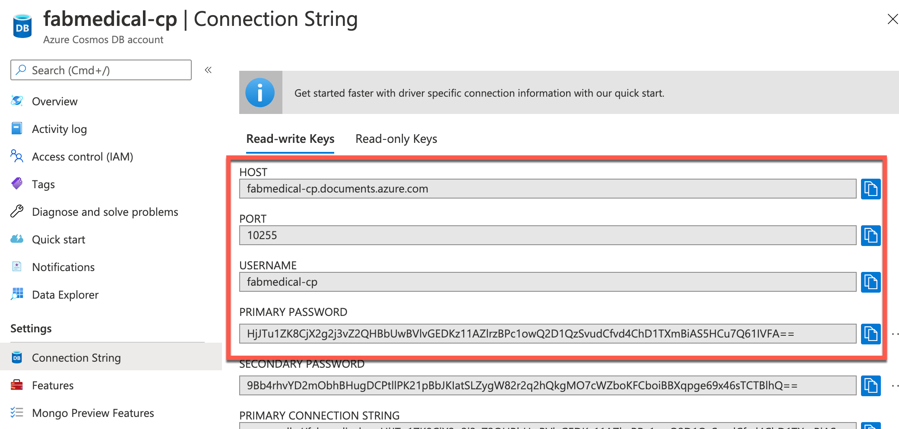
    <figcaption aria-hidden="true">
        <font style="vertical-align: inherit;"><font style="vertical-align: inherit;">Cosmos DB帐户的“连接字符串”窗格中突出显示了要复制的字段。</font></font>
    </figcaption>

4.  <font style="vertical-align: inherit;"><font style="vertical-align: inherit;">打开Azure Cloud Shell，然后</font></font>**<font style="vertical-align: inherit;"><font style="vertical-align: inherit;">SSH</font></font>**
    <font style="vertical-align: inherit;"><font style="vertical-align: inherit;">到</font></font>**<font style="vertical-align: inherit;"><font style="vertical-align: inherit;">Build agent VM</font></font>**
    <font style="vertical-align: inherit;"><font style="vertical-align: inherit;">。</font></font>

5.  <font style="vertical-align: inherit;"><font style="vertical-align: inherit;">在</font></font>**<font style="vertical-align: inherit;"><font style="vertical-align: inherit;">Build agent VM上</font></font>**
    <font style="vertical-align: inherit;"><font style="vertical-align: inherit;">，导航到</font></font>`~/Fabmedical`
    <font style="vertical-align: inherit;"><font style="vertical-align: inherit;">目录。</font></font>

    ```
    cd ~/Fabmedical
    ```

6.  <font style="vertical-align: inherit;"><font style="vertical-align: inherit;">运行以下命令以打开</font></font>`perftest.sh`
    <font style="vertical-align: inherit;"><font style="vertical-align: inherit;">脚本以在Vim中进行编辑。</font></font>

    ```
    vi perftest.sh
    ```

7.  <font style="vertical-align: inherit;"><font style="vertical-align: inherit;">在</font></font>`perftest.sh`
    <font style="vertical-align: inherit;"><font style="vertical-align: inherit;">脚本</font><font style="vertical-align: inherit;">顶部声明了几个变量</font><font style="vertical-align: inherit;">。</font><font style="vertical-align: inherit;">通过将</font></font>**<font style="vertical-align: inherit;"><font style="vertical-align: inherit;">host</font></font>**
    <font style="vertical-align: inherit;"><font style="vertical-align: inherit;">，</font></font>**<font style="vertical-align: inherit;"><font style="vertical-align: inherit;">username</font></font>**
    <font style="vertical-align: inherit;"><font style="vertical-align: inherit;">和</font></font>**<font style="vertical-align: inherit;"><font style="vertical-align: inherit;">password</font></font>**
    <font style="vertical-align: inherit;"><font style="vertical-align: inherit;">变量的值设置为先前复制的相应Cosmos DB连接字符串值，来</font><font style="vertical-align: inherit;">修改</font><strong><font style="vertical-align: inherit;">host</font></strong><font style="vertical-align: inherit;">，</font><strong><font style="vertical-align: inherit;">username</font></strong><font style="vertical-align: inherit;">和</font><strong><font style="vertical-align: inherit;">password</font></strong><font style="vertical-align: inherit;">变量。</font></font>

    
    <figcaption aria-hidden="true">
        <font style="vertical-align: inherit;"><font style="vertical-align: inherit;">屏幕截图显示了打开了perftest.sh文件且变量设置为Cosmos DB连接字符串值的Vim。</font></font>
    </figcaption>

8.  <font style="vertical-align: inherit;"><font style="vertical-align: inherit;">保存文件并退出Vim。</font></font>

9.  <font style="vertical-align: inherit;"><font style="vertical-align: inherit;">运行以下命令以执行</font></font>`perftest.sh`
    <font style="vertical-align: inherit;"><font style="vertical-align: inherit;">脚本以对Cosmos DB运行小型负载测试。</font><font style="vertical-align: inherit;">通过将许多文档插入到Sessions容器中，此脚本将消耗Cosmos DB中的RU。</font></font>

    ```
    bash ./perftest.sh
    ```

    > **<font style="vertical-align: inherit;"><font style="vertical-align: inherit;">注意：</font></font>**
    > <font style="vertical-align: inherit;"><font style="vertical-align: inherit;">该脚本将需要一分钟才能完成执行。</font></font>

10.  <font style="vertical-align: inherit;"><font style="vertical-align: inherit;">脚本完成后，导航回到</font><font style="vertical-align: inherit;">Azure门户中</font><font style="vertical-align: inherit;">的</font></font>**<font style="vertical-align: inherit;"><font style="vertical-align: inherit;">Cosmos DB帐户</font></font>**
    <font style="vertical-align: inherit;"><font style="vertical-align: inherit;">。</font></font>

11.  <font style="vertical-align: inherit;"><font style="vertical-align: inherit;">在</font><strong><font style="vertical-align: inherit;">Cosmos DB帐户</font></strong><font style="vertical-align: inherit;">刀片</font><font style="vertical-align: inherit;">的“</font></font>**<font style="vertical-align: inherit;"><font style="vertical-align: inherit;">概述”</font></font>**
    <font style="vertical-align: inherit;"><font style="vertical-align: inherit;">窗格上</font><font style="vertical-align: inherit;">向下滚动</font><font style="vertical-align: inherit;">，然后找到“</font><strong><font style="vertical-align: inherit;">请求费用”</font></strong><font style="vertical-align: inherit;">图。</font></font>**<font style="vertical-align: inherit;"></font>**
    <font style="vertical-align: inherit;"></font>**<font style="vertical-align: inherit;"></font>**
    <font style="vertical-align: inherit;"></font>

    > **<font style="vertical-align: inherit;"><font style="vertical-align: inherit;">注意：</font></font>**
    > <font style="vertical-align: inherit;"><font style="vertical-align: inherit;"> Cosmos DB集合上的活动可能需要2到5分钟才能出现在活动日志中。</font><font style="vertical-align: inherit;">等待几分钟，然后刷新窗格（如果最近没有显示最近的请求费用）。</font></font>

12.  <font style="vertical-align: inherit;"><font style="vertical-align: inherit;">请注意，</font><font style="vertical-align: inherit;">现在</font><font style="vertical-align: inherit;">“</font></font>**<font style="vertical-align: inherit;"><font style="vertical-align: inherit;">请求费用”</font></font>**
    <font style="vertical-align: inherit;"><font style="vertical-align: inherit;">显示</font></font>**<font style="vertical-align: inherit;"><font style="vertical-align: inherit;">Cosmos DB帐户</font></font>**
    <font style="vertical-align: inherit;"><font style="vertical-align: inherit;">上的活动</font><font style="vertical-align: inherit;">超出了在打开自动缩放功能之前先前设置的400 RU / s限制。</font></font>

    
    <figcaption aria-hidden="true">
        <font style="vertical-align: inherit;"><font style="vertical-align: inherit;">屏幕截图显示了Cosmos DB请求费用图，该图显示了性能测试中的最新活动</font></font>
    </figcaption>

## <font style="vertical-align: inherit;"><font style="vertical-align: inherit;">练习5：使用服务和路由应用程序流量</font></font>

**<font style="vertical-align: inherit;"><font style="vertical-align: inherit;">片长</font></font>**
<font style="vertical-align: inherit;"><font style="vertical-align: inherit;">：1小时</font></font>

<font style="vertical-align: inherit;"><font style="vertical-align: inherit;">在上一个练习中，我们对服务的比例属性进行了限制。</font><font style="vertical-align: inherit;">在本练习中，您将配置api部署以创建使用动态端口映射的Pod，以消除扩展活动期间的端口资源限制。</font></font>

<font style="vertical-align: inherit;"><font style="vertical-align: inherit;">Kubernetes服务可以发现分配给每个Pod的端口，从而使您可以在同一代理节点上运行Pod的多个实例-配置特定的静态端口（例如API服务的3001）时，这是不可能的。</font></font>

### <font style="vertical-align: inherit;"><font style="vertical-align: inherit;">任务1：更新外部服务以通过负载均衡器支持动态发现</font></font>

<font style="vertical-align: inherit;"><font style="vertical-align: inherit;">在此任务中，您将更新Web服务，以使其支持通过Azure负载平衡器进行动态发现。</font></font>

1.  <font style="vertical-align: inherit;"><font style="vertical-align: inherit;">在AKS </font></font>**<font style="vertical-align: inherit;"><font style="vertical-align: inherit;">Kubernetes资源</font></font>**
    <font style="vertical-align: inherit;"><font style="vertical-align: inherit;">菜单中，选择</font><strong><font style="vertical-align: inherit;">Workloads</font></strong><font style="vertical-align: inherit;">下的</font></font>**<font style="vertical-align: inherit;"><font style="vertical-align: inherit;">Deployments</font></font>**
    <font style="vertical-align: inherit;"><font style="vertical-align: inherit;">。</font><font style="vertical-align: inherit;">从列表中选择</font><strong><font style="vertical-align: inherit;">Web</font></strong><font style="vertical-align: inherit;">部署。</font></font>**<font style="vertical-align: inherit;"></font>**
    <font style="vertical-align: inherit;"></font>**<font style="vertical-align: inherit;"></font>**
    <font style="vertical-align: inherit;"></font>

2.  <font style="vertical-align: inherit;"><font style="vertical-align: inherit;">选择</font></font>**<font style="vertical-align: inherit;"><font style="vertical-align: inherit;">YAML</font></font>**
    <font style="vertical-align: inherit;"><font style="vertical-align: inherit;">，然后选择</font></font>**<font style="vertical-align: inherit;"><font style="vertical-align: inherit;">JSON</font></font>**
    <font style="vertical-align: inherit;"><font style="vertical-align: inherit;">选项卡。</font></font>

3.  <font style="vertical-align: inherit;"><font style="vertical-align: inherit;">首先找到副本节点，并将所需的计数更新为</font></font>`4`
    <font style="vertical-align: inherit;"><font style="vertical-align: inherit;">。</font></font>

4.  <font style="vertical-align: inherit;"><font style="vertical-align: inherit;">接下来，滚动到Web容器规范，如屏幕截图所示。</font><font style="vertical-align: inherit;">删除Web容器的端口映射的hostPort条目。</font></font>

    
    <figcaption aria-hidden="true">
        <font style="vertical-align: inherit;"><font style="vertical-align: inherit;">这是“编辑部署”对话框的屏幕快照，其中包含有关规格，容器，端口和环境的各种显示信息。</font><font style="vertical-align: inherit;">端口节点containerContainer：3001和protocol：TCP突出显示。</font></font>
    </figcaption>

5.  <font style="vertical-align: inherit;"><font style="vertical-align: inherit;">选择</font></font>**<font style="vertical-align: inherit;"><font style="vertical-align: inherit;">查看</font></font>**
    <font style="vertical-align: inherit;"><font style="vertical-align: inherit;">并</font><strong><font style="vertical-align: inherit;">保存</font></strong><font style="vertical-align: inherit;">，然后确认更改并</font></font>**<font style="vertical-align: inherit;"><font style="vertical-align: inherit;">保存</font></font>**
    <font style="vertical-align: inherit;"><font style="vertical-align: inherit;">。</font></font>

6.  <font style="vertical-align: inherit;"><font style="vertical-align: inherit;">通过刷新Web部署的视图来检查向外扩展的状态。</font><font style="vertical-align: inherit;">在导航菜单上，</font><font style="vertical-align: inherit;">从“工作负载”下</font><font style="vertical-align: inherit;">选择“</font></font>**<font style="vertical-align: inherit;"><font style="vertical-align: inherit;">窗格”</font></font>**
    <font style="vertical-align: inherit;"><font style="vertical-align: inherit;">。</font><font style="vertical-align: inherit;">选择</font></font>**<font style="vertical-align: inherit;"><font style="vertical-align: inherit;">Web</font></font>**
    <font style="vertical-align: inherit;"><font style="vertical-align: inherit;"> Pod。</font><font style="vertical-align: inherit;">从此视图中，您应该看到类似以下屏幕截图所示的错误。</font></font>

    
    <figcaption aria-hidden="true">
        <font style="vertical-align: inherit;"><font style="vertical-align: inherit;">在左侧导航菜单中的“工作负载”下选择“部署”。</font><font style="vertical-align: inherit;">右侧是“详细信息”和“新副本集”框。</font><font style="vertical-align: inherit;">Web部署在“新副本集”框中突出显示，指示错误。</font></font>
    </figcaption>

<font style="vertical-align: inherit;"><font style="vertical-align: inherit;">与API部署一样，Web部署使用固定的</font></font>_<font style="vertical-align: inherit;"><font style="vertical-align: inherit;">hostPort</font></font>_
<font style="vertical-align: inherit;"><font style="vertical-align: inherit;">，并且扩展能力受到可用代理节点数量的限制。</font><font style="vertical-align: inherit;">但是，通过删除</font></font>_<font style="vertical-align: inherit;"><font style="vertical-align: inherit;">hostPort</font></font>_
<font style="vertical-align: inherit;"><font style="vertical-align: inherit;">设置</font><font style="vertical-align: inherit;">解决了Web服务的此问题之后</font><font style="vertical-align: inherit;">，由于CPU限制，Web部署仍无法扩展到两个Pod之上。</font><font style="vertical-align: inherit;">部署所请求的CPU超过了Web应用程序所需的CPU，因此您将在下一个任务中解决此约束。</font></font>

### <font style="vertical-align: inherit;"><font style="vertical-align: inherit;">任务2：调整CPU约束以提高规模</font></font>

<font style="vertical-align: inherit;"><font style="vertical-align: inherit;">在此任务中，您将修改Web服务的CPU要求，以便可以扩展到更多实例。</font></font>

1.  <font style="vertical-align: inherit;"><font style="vertical-align: inherit;">重新打开Web部署的JSON视图，然后找到</font><font style="vertical-align: inherit;">Web容器</font><font style="vertical-align: inherit;">的</font></font>**<font style="vertical-align: inherit;"><font style="vertical-align: inherit;">cpu</font></font>**
    <font style="vertical-align: inherit;"><font style="vertical-align: inherit;">资源要求。</font><font style="vertical-align: inherit;">将此值更改为</font></font>`125m`
    <font style="vertical-align: inherit;"><font style="vertical-align: inherit;">。</font></font>

    
    <figcaption aria-hidden="true">
        <font style="vertical-align: inherit;"><font style="vertical-align: inherit;">这是“编辑部署”对话框的屏幕快照，其中包含有关端口，环境和资源的各种显示信息。</font><font style="vertical-align: inherit;">高亮显示已选择cpu：125m的资源节点。</font></font>
    </figcaption>

2.  <font style="vertical-align: inherit;"><font style="vertical-align: inherit;">选择“</font></font>**<font style="vertical-align: inherit;"><font style="vertical-align: inherit;">审阅+保存”</font></font>**
    <font style="vertical-align: inherit;"><font style="vertical-align: inherit;">，确认更改，然后选择“</font></font>**<font style="vertical-align: inherit;"><font style="vertical-align: inherit;">保存”</font></font>**
    <font style="vertical-align: inherit;"><font style="vertical-align: inherit;">以更新部署。</font></font>

3.  <font style="vertical-align: inherit;"><font style="vertical-align: inherit;">从导航菜单中，</font><font style="vertical-align: inherit;">在“</font><strong><font style="vertical-align: inherit;">工作负载”</font></strong><font style="vertical-align: inherit;">下</font><font style="vertical-align: inherit;">选择“</font></font>**<font style="vertical-align: inherit;"><font style="vertical-align: inherit;">副本集</font></font>**
    <font style="vertical-align: inherit;"><font style="vertical-align: inherit;">” </font><font style="vertical-align: inherit;">。</font><font style="vertical-align: inherit;">从视图的“副本集”列表中选择Web副本集。</font></font>**<font style="vertical-align: inherit;"></font>**
    <font style="vertical-align: inherit;"></font>

4.  <font style="vertical-align: inherit;"><font style="vertical-align: inherit;">部署更新完成后，应显示四个Web Pod处于运行状态。</font></font>

    
    <figcaption aria-hidden="true">
        <font style="vertical-align: inherit;"><font style="vertical-align: inherit;">在“窗格”框中列出了四个Web窗格，它们都带有绿色的复选标记，并列为“正在运行”。</font></font>
    </figcaption>

5.  <font style="vertical-align: inherit;"><font style="vertical-align: inherit;">返回加载了示例Web应用程序的浏览器选项卡。</font><font style="vertical-align: inherit;">刷新/ stats的统计信息页面，以通过观察主机名刷新来观看显示更新以反映不同的api pod。</font></font>

### <font style="vertical-align: inherit;"><font style="vertical-align: inherit;">任务3：执行滚动更新</font></font>

<font style="vertical-align: inherit;"><font style="vertical-align: inherit;">在此任务中，您将编辑Web应用程序源代码以添加Application Insights并更新部署所使用的Docker映像。</font><font style="vertical-align: inherit;">然后，您将执行滚动更新以演示如何部署代码更改。</font></font>

1.  <font style="vertical-align: inherit;"><font style="vertical-align: inherit;">在Azure Cloud Shell中执行以下命令以检索</font></font>`content-web`
    <font style="vertical-align: inherit;"><font style="vertical-align: inherit;">Application Insights资源</font><font style="vertical-align: inherit;">的检测密钥</font><font style="vertical-align: inherit;">：</font></font>

    ```
    az resource show -g fabmedical-[SUFFIX] -n content-web --resource-type "Microsoft.Insights/components" --query properties.InstrumentationKey -o tsv
    ```

    <font style="vertical-align: inherit;"><font style="vertical-align: inherit;">复制此值。</font><font style="vertical-align: inherit;">您稍后将使用它。</font></font>

    > **<font style="vertical-align: inherit;"><font style="vertical-align: inherit;">注意：</font></font>**
    > <font style="vertical-align: inherit;"><font style="vertical-align: inherit;">如果结果为空，请检查发出的命令是否引用了正确的资源。</font></font>

2.  <font style="vertical-align: inherit;"><font style="vertical-align: inherit;">在您的实验室VM上，通过从git存储库中提取最新更改来更新您的fabicalical存储库文件：</font></font>

    ```
    cd ~/fabmedical/content-web
    git pull
    ```

3.  <font style="vertical-align: inherit;"><font style="vertical-align: inherit;">安装对Application Insights的支持。</font></font>

    ```
    npm install applicationinsights --save
    ```

4.  <font style="vertical-align: inherit;"><font style="vertical-align: inherit;">在第6行实例化</font></font>`app.js`
    <font style="vertical-align: inherit;"><font style="vertical-align: inherit;">之后，使用Vim或Visual Studio Code remote</font><font style="vertical-align: inherit;">编辑</font><font style="vertical-align: inherit;">文件，并立即添加以下几行</font></font>`express`
    <font style="vertical-align: inherit;"><font style="vertical-align: inherit;">：</font></font>

    ```
    const appInsights = require("applicationinsights");
    appInsights.setup("[YOUR APPINSIGHTS KEY]");
    appInsights.start();
    ```

    
    <figcaption aria-hidden="true">
        <font style="vertical-align: inherit;"><font style="vertical-align: inherit;">代码编辑器的屏幕快照，显示了app.js文件上下文中的更新</font></font>
    </figcaption>

5.  <font style="vertical-align: inherit;"><font style="vertical-align: inherit;">保存更改并关闭编辑器。</font></font>

6.  <font style="vertical-align: inherit;"><font style="vertical-align: inherit;">将这些更改推送到您的存储库中，以便GitHub Actions CI将构建和部署新的Container映像。</font></font>

    ```
    git add .
    git commit -m "Added Application Insights"
    git push
    ```

7.  <font style="vertical-align: inherit;"><font style="vertical-align: inherit;">访问</font></font>`content-web`
    <font style="vertical-align: inherit;"><font style="vertical-align: inherit;">适用于GitHub Fabmedical存储库</font><font style="vertical-align: inherit;">的</font><font style="vertical-align: inherit;">操作，并查看将新映像部署到您的Kubernetes集群中。</font></font>

8.  <font style="vertical-align: inherit;"><font style="vertical-align: inherit;">运行此更新时，在浏览器中返回Azure门户。</font></font>

9.  <font style="vertical-align: inherit;"><font style="vertical-align: inherit;">从导航菜单中，</font><font style="vertical-align: inherit;">在“</font><strong><font style="vertical-align: inherit;">工作负载”</font></strong><font style="vertical-align: inherit;">下</font><font style="vertical-align: inherit;">选择“</font></font>**<font style="vertical-align: inherit;"><font style="vertical-align: inherit;">副本集</font></font>**
    <font style="vertical-align: inherit;"><font style="vertical-align: inherit;">” </font><font style="vertical-align: inherit;">。</font><font style="vertical-align: inherit;">从此视图中，您将看到一个新的Web副本集，该副本集可能仍在部署过程中（如下所示）或已经完全部署。</font></font>**<font style="vertical-align: inherit;"></font>**
    <font style="vertical-align: inherit;"></font>

    
    <figcaption aria-hidden="true">
        <font style="vertical-align: inherit;"><font style="vertical-align: inherit;">在列表顶部，新的Web副本集在“副本集”框中列为挂起的部署。</font></font>
    </figcaption>

10.  <font style="vertical-align: inherit;"><font style="vertical-align: inherit;">在部署过程中，您可以导航到Web应用程序并访问的统计信息页面</font></font>`/stats`
    <font style="vertical-align: inherit;"><font style="vertical-align: inherit;">。</font><font style="vertical-align: inherit;">在滚动更新执行时刷新页面。</font><font style="vertical-align: inherit;">可以观察到该服务正在正常运行，并且任务继续保持负载平衡。</font></font>

    
    <figcaption aria-hidden="true">
        <font style="vertical-align: inherit;"><font style="vertical-align: inherit;">在“统计信息”页面上，突出显示主机名。</font></font>
    </figcaption>

### <font style="vertical-align: inherit;"><font style="vertical-align: inherit;">任务4：配置Kubernetes入口</font></font>

<font style="vertical-align: inherit;"><font style="vertical-align: inherit;">在此任务中，您将使用</font></font>[<font style="vertical-align: inherit;"><font style="vertical-align: inherit;">nginx代理服务器</font></font>](https://nginx.org/en/)
<font style="vertical-align: inherit;"><font style="vertical-align: inherit;">设置Kubernetes入口</font><font style="vertical-align: inherit;">，以利用基于路径的路由和TLS终止。</font></font>

1.  <font style="vertical-align: inherit;"><font style="vertical-align: inherit;">在Azure Cloud Shell中，运行以下命令以添加nginx稳定的Helm存储库：</font></font>

    ```
    helm repo add ingress-nginx https://kubernetes.github.io/ingress-nginx
    ```

2.  <font style="vertical-align: inherit;"><font style="vertical-align: inherit;">更新您的头盔包列表。</font></font>

    ```
    helm repo update
    ```

    > **<font style="vertical-align: inherit;"><font style="vertical-align: inherit;">注意</font></font>**
    > <font style="vertical-align: inherit;"><font style="vertical-align: inherit;">：如果您得到“找不到存储库”。</font><font style="vertical-align: inherit;">错误，然后运行以下命令。</font><font style="vertical-align: inherit;">这将添加回官方Helm“稳定”存储库。</font></font>
    >
    >
    > ```
    > helm repo add stable https://charts.helm.sh/stable
    > ```
    >

3.  <font style="vertical-align: inherit;"><font style="vertical-align: inherit;">在Kubernetes中创建一个名称空间以安装Ingress资源。</font></font>

    ```
    kubectl create namespace ingress-demo
    ```

4.  <font style="vertical-align: inherit;"><font style="vertical-align: inherit;">安装Ingress Controller资源以处理传入的传入请求。IngressController将在Azure负载均衡器上收到其自己的公用IP，并能够处理通过端口80和443进行的多个服务的请求。</font></font>

    ```
    helm install nginx-ingress ingress-nginx/ingress-nginx \
     --namespace ingress-demo \
     --set controller.replicaCount=2 \
     --set controller.nodeSelector."beta\.kubernetes\.io/os"=linux \
     --set defaultBackend.nodeSelector."beta\.kubernetes\.io/os"=linux \
     --set controller.admissionWebhooks.patch.nodeSelector."beta\.kubernetes\.io/os"=linux
    ```

5.  <font style="vertical-align: inherit;"><font style="vertical-align: inherit;">在根据在Azure门户</font></font>**<font style="vertical-align: inherit;"><font style="vertical-align: inherit;">服务和入节点</font></font>**
    <font style="vertical-align: inherit;"><font style="vertical-align: inherit;">复制了该IP地址</font></font>**<font style="vertical-align: inherit;"><font style="vertical-align: inherit;">的外部IP</font></font>**
    <font style="vertical-align: inherit;"><font style="vertical-align: inherit;">的</font></font>`nginx-ingress-RANDOM-nginx-ingress`
    <font style="vertical-align: inherit;"><font style="vertical-align: inherit;">服务。</font></font>

    
    <figcaption aria-hidden="true">
        <font style="vertical-align: inherit;"><font style="vertical-align: inherit;">Kubernetes管理仪表板的屏幕快照，显示了入口控制器设置。</font></font>
    </figcaption>

    > **<font style="vertical-align: inherit;"><font style="vertical-align: inherit;">注意</font></font>**
    > <font style="vertical-align: inherit;"><font style="vertical-align: inherit;">：刷新可能需要几分钟，或者，您可以使用Azure Cloud Shell中的以下命令查找IP。</font></font>
    >
    >
    > ```
    > kubectl get svc --namespace ingress-demo
    > ```
    >
    >
    > 
    > <figcaption aria-hidden="true">
    >     <font style="vertical-align: inherit;"><font style="vertical-align: inherit;">Azure Cloud Shell的屏幕快照，显示命令输出。</font></font>
    > </figcaption>

6.  <font style="vertical-align: inherit;"><font style="vertical-align: inherit;">打开“ </font></font>[<font style="vertical-align: inherit;"><font style="vertical-align: inherit;">Azure门户资源组”刀片</font></font>](https://portal.azure.com/?feature.customPortal=false#blade/HubsExtension/BrowseResourceGroups)
    <font style="vertical-align: inherit;"><font style="vertical-align: inherit;">，找到自动创建以托管AKS节点池的资源组。</font><font style="vertical-align: inherit;">的命名格式为</font></font>`MC_fabmedical-[SUFFIX]_fabmedical-[SUFFIX]_[REGION]`
    <font style="vertical-align: inherit;"><font style="vertical-align: inherit;">。</font></font>

7.  <font style="vertical-align: inherit;"><font style="vertical-align: inherit;">在Azure Cloud Shell中，创建脚本以更新入口外部IP的公共DNS名称。</font></font>

    ```
    code update-ip.sh
    ```

    <font style="vertical-align: inherit;"><font style="vertical-align: inherit;">将以下内容粘贴为内容。</font><font style="vertical-align: inherit;">确保在脚本中替换以下占位符：</font></font>
    * `[INGRESS PUBLIC IP]`

        <font style="vertical-align: inherit;"><font style="vertical-align: inherit;">：将其替换为从步骤5复制的IP地址。</font></font>

    * `[AKS NODEPOOL RESOURCE GROUP]`

        <font style="vertical-align: inherit;"><font style="vertical-align: inherit;">：替换为从步骤6复制的资源组的名称。</font></font>

    * `[SUFFIX]`

        <font style="vertical-align: inherit;"><font style="vertical-align: inherit;">：将其替换为该实验之前使用的相同SUFFIX值。</font></font>

    ```
    #!/bin/bash

    # Public IP address
    IP="[INGRESS PUBLIC IP]"

    # Resource Group that contains AKS Node Pool
    KUBERNETES_NODE_RG="[AKS NODEPOOL RESOURCE GROUP]"

    # Name to associate with public IP address
    DNSNAME="fabmedical-[SUFFIX]-ingress"

    # Get the resource-id of the public ip
    PUBLICIPID=$(az network public-ip list --resource-group $KUBERNETES_NODE_RG --query "[?ipAddress!=null]|[?contains(ipAddress, '$IP')].[id]" --output tsv)

    # Update public ip address with dns name
    az network public-ip update --ids $PUBLICIPID --dns-name $DNSNAME
    ```

    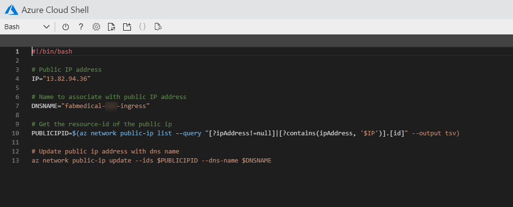
    <figcaption aria-hidden="true">
        <font style="vertical-align: inherit;"><font style="vertical-align: inherit;">云外壳编辑器的屏幕快照，显示了更新的IP和SUFFIX值。</font></font>
    </figcaption>

8.  <font style="vertical-align: inherit;"><font style="vertical-align: inherit;">保存更改并关闭编辑器。</font></font>

9.  <font style="vertical-align: inherit;"><font style="vertical-align: inherit;">运行更新脚本。</font></font>

    ```
    bash ./update-ip.sh
    ```

10.  <font style="vertical-align: inherit;"><font style="vertical-align: inherit;">通过访问浏览器中的URL验证IP更新。</font></font>

    > **<font style="vertical-align: inherit;"><font style="vertical-align: inherit;">注意</font></font>**
    > <font style="vertical-align: inherit;"><font style="vertical-align: inherit;">：这时通常会收到404消息。</font></font>

    ```
    http://fabmedical-[SUFFIX]-ingress.[AZURE-REGION].cloudapp.azure.com/
    ```

    
    <figcaption aria-hidden="true">
        <font style="vertical-align: inherit;"><font style="vertical-align: inherit;">仿制浏览器URL的屏幕截图。</font></font>
    </figcaption>

11.  <font style="vertical-align: inherit;"><font style="vertical-align: inherit;">使用helm进行安装</font></font>`cert-manager`
    <font style="vertical-align: inherit;"><font style="vertical-align: inherit;">，该工具可以从letencrypt.org自动提供SSL证书。</font></font>

    ```
    kubectl create namespace cert-manager

    kubectl label namespace cert-manager cert-manager.io/disable-validation=true

    kubectl apply --validate=false -f https://github.com/jetstack/cert-manager/releases/download/v1.0.1/cert-manager.yaml
    ```

12.  <font style="vertical-align: inherit;"><font style="vertical-align: inherit;">证书管理器将需要自定义ClusterIssuer资源来处理请求的SSL证书。</font></font>

    ```
    code clusterissuer.yml
    ```

    <font style="vertical-align: inherit;"><font style="vertical-align: inherit;">以下资源配置应按原​​样工作：</font></font>

    ```
    apiVersion: cert-manager.io/v1
    kind: ClusterIssuer
    metadata:
      name: letsencrypt-prod
    spec:
      acme:
        # The ACME server URL
        server: https://acme-v02.api.letsencrypt.org/directory
        # Email address used for ACME registration
        email: user@fabmedical.com
        # Name of a secret used to store the ACME account private key
        privateKeySecretRef:
          name: letsencrypt-prod
        # Enable HTTP01 validations
        solvers:
        - http01:
            ingress:
              class: nginx
    ```

13.  <font style="vertical-align: inherit;"><font style="vertical-align: inherit;">保存更改并关闭编辑器。</font></font>

14.  <font style="vertical-align: inherit;"><font style="vertical-align: inherit;">使用创建发行人</font></font>`kubectl`
    <font style="vertical-align: inherit;"><font style="vertical-align: inherit;">。</font></font>

    ```
    kubectl create --save-config=true -f clusterissuer.yml
    ```

15.  <font style="vertical-align: inherit;"><font style="vertical-align: inherit;">现在，您可以创建一个证书对象。</font></font>

    > **<font style="vertical-align: inherit;"><font style="vertical-align: inherit;">注意事项</font></font>**
    > <font style="vertical-align: inherit;"><font style="vertical-align: inherit;">：</font></font>
    >
    > <font style="vertical-align: inherit;"><font style="vertical-align: inherit;">证书管理员可能已经使用入口填充程序为您创建了一个证书对象。</font></font>
    >
    > <font style="vertical-align: inherit;"><font style="vertical-align: inherit;">要验证证书已成功创建，请使用</font></font>`kubectl describe certificate tls-secret`
    > <font style="vertical-align: inherit;"><font style="vertical-align: inherit;">命令。</font></font>
    >
    > <font style="vertical-align: inherit;"><font style="vertical-align: inherit;">如果证书已经可用，请跳到步骤16。</font></font>

    ```
    code certificate.yml
    ```

    <font style="vertical-align: inherit;"><font style="vertical-align: inherit;">使用以下内容作为内容，并更新</font></font>`[SUFFIX]`
    <font style="vertical-align: inherit;"><font style="vertical-align: inherit;">和</font></font>`[AZURE-REGION]`
    <font style="vertical-align: inherit;"><font style="vertical-align: inherit;">以匹配您的入口DNS名称</font></font>

    ```
    apiVersion: cert-manager.io/v1
    kind: Certificate
    metadata:
      name: tls-secret
    spec:
      secretName: tls-secret
      dnsNames:
        - fabmedical-[SUFFIX]-ingress.[AZURE-REGION].cloudapp.azure.com
      issuerRef:
        name: letsencrypt-prod
        kind: ClusterIssuer
    ```

16.  <font style="vertical-align: inherit;"><font style="vertical-align: inherit;">保存更改并关闭编辑器。</font></font>

17.  <font style="vertical-align: inherit;"><font style="vertical-align: inherit;">使用创建证书</font></font>`kubectl`
    <font style="vertical-align: inherit;"><font style="vertical-align: inherit;">。</font></font>

    ```
    kubectl create --save-config=true -f certificate.yml
    ```

    > **<font style="vertical-align: inherit;"><font style="vertical-align: inherit;">注意</font></font>**
    > <font style="vertical-align: inherit;"><font style="vertical-align: inherit;">：要检查证书颁发的状态，请使用</font></font>`kubectl describe certificate tls-secret`
    > <font style="vertical-align: inherit;"><font style="vertical-align: inherit;">命令并查找</font><font style="vertical-align: inherit;">类似于以下内容</font><font style="vertical-align: inherit;">的“</font></font>_<font style="vertical-align: inherit;"><font style="vertical-align: inherit;">事件”</font></font>_
    > <font style="vertical-align: inherit;"><font style="vertical-align: inherit;">输出：</font></font>
    >
    >
    > ```
    > Type    Reason         Age   From          Message
    > ----    ------         ----  ----          -------
    > Normal  Generated           38s   cert-manager  Generated new private key
    > Normal  GenerateSelfSigned  38s   cert-manager  Generated temporary self signed certificate
    > Normal  OrderCreated        38s   cert-manager  Created Order resource "tls-secret-3254248695"
    > Normal  OrderComplete       12s   cert-manager  Order "tls-secret-3254248695" completed successfully
    > Normal  CertIssued          12s   cert-manager  Certificate issued successfully
    > ```
    >

    <font style="vertical-align: inherit;"><font style="vertical-align: inherit;">tls-secret可用之前可能需要5到30分钟。</font><font style="vertical-align: inherit;">这是由于从letencrypt设置TLS证书所涉及的延迟。</font></font>

18.  <font style="vertical-align: inherit;"><font style="vertical-align: inherit;">现在，您可以为内容应用程序创建入口资源。</font></font>

    ```
    code content.ingress.yml
    ```

    <font style="vertical-align: inherit;"><font style="vertical-align: inherit;">使用以下内容作为内容，并更新</font></font>`[SUFFIX]`
    <font style="vertical-align: inherit;"><font style="vertical-align: inherit;">和</font></font>`[AZURE-REGION]`
    <font style="vertical-align: inherit;"><font style="vertical-align: inherit;">以匹配您的入口DNS名称：</font></font>

    ```
    apiVersion: networking.k8s.io/v1beta1
    kind: Ingress
    metadata:
       name: content-ingress
       annotations:
          kubernetes.io/ingress.class: nginx
          nginx.ingress.kubernetes.io/rewrite-target: /$1
          nginx.ingress.kubernetes.io/use-regex: "true"
          nginx.ingress.kubernetes.io/ssl-redirect: "false"
          cert-manager.io/cluster-issuer: letsencrypt-prod
    spec:
       tls:
       - hosts:
          - fabmedical-sjw-ingress.westus2.cloudapp.azure.com
          secretName: tls-secret
       rules:
          - host: fabmedical-sjw-ingress.westus2.cloudapp.azure.com
          http:
             paths:
             - path: /(.*)
                backend:
                   serviceName: web
                   servicePort: 80
             - path: /content-api/(.*)
                backend:            
                   serviceName: api
                   servicePort: 3001
    ```

19.  <font style="vertical-align: inherit;"><font style="vertical-align: inherit;">保存更改并关闭编辑器。</font></font>

20.  <font style="vertical-align: inherit;"><font style="vertical-align: inherit;">使用创建入口</font></font>`kubectl`
    <font style="vertical-align: inherit;"><font style="vertical-align: inherit;">。</font></font>

    ```
    kubectl create --save-config=true -f content.ingress.yml
    ```

21.  <font style="vertical-align: inherit;"><font style="vertical-align: inherit;">在浏览器中刷新入口端点。</font><font style="vertical-align: inherit;">您应该能够访问演讲者和会议页面并查看所有内容。</font></font>

22.  <font style="vertical-align: inherit;"><font style="vertical-align: inherit;">通过导航到</font></font>`/content-api/sessions`
    <font style="vertical-align: inherit;"><font style="vertical-align: inherit;">入口端点</font><font style="vertical-align: inherit;">直接访问API </font><font style="vertical-align: inherit;">。</font></font>

    
    <figcaption aria-hidden="true">
        <font style="vertical-align: inherit;"><font style="vertical-align: inherit;">屏幕截图显示了浏览器中会话内容的输出。</font></font>
    </figcaption>

23.  <font style="vertical-align: inherit;"><font style="vertical-align: inherit;">通过使用再次访问这两种服务来测试TLS终止</font></font>`https`
    <font style="vertical-align: inherit;"><font style="vertical-align: inherit;">。</font></font>

    > <font style="vertical-align: inherit;"><font style="vertical-align: inherit;">SSL网站可用可能需要5到30分钟。</font><font style="vertical-align: inherit;">这是由于从letencrypt设置TLS证书所涉及的延迟。</font></font>

### <font style="vertical-align: inherit;"><font style="vertical-align: inherit;">任务5：使用流量管理器进行多区域负载平衡</font></font>

<font style="vertical-align: inherit;"><font style="vertical-align: inherit;">在此任务中，您将Azure交通管理器设置为多区域负载平衡器。</font><font style="vertical-align: inherit;">这将使您能够在辅助Azure区域中配置应用程序的AKS实例，并在两个区域之间进行负载平衡。</font></font>

1.  <font style="vertical-align: inherit;"><font style="vertical-align: inherit;">在Azure门户中，选择</font></font>**<font style="vertical-align: inherit;"><font style="vertical-align: inherit;">+创建资源</font></font>**
    <font style="vertical-align: inherit;"><font style="vertical-align: inherit;">。</font></font>

2.  <font style="vertical-align: inherit;"><font style="vertical-align: inherit;">在市场上搜索“</font></font>**<font style="vertical-align: inherit;"><font style="vertical-align: inherit;">流量管理器”配置文件</font></font>**
    <font style="vertical-align: inherit;"><font style="vertical-align: inherit;">，选择此资源类型，然后选择“</font></font>**<font style="vertical-align: inherit;"><font style="vertical-align: inherit;">创建”</font></font>**
    <font style="vertical-align: inherit;"><font style="vertical-align: inherit;">。</font></font>

    
    <figcaption aria-hidden="true">
        <font style="vertical-align: inherit;"><font style="vertical-align: inherit;">屏幕截图显示了Azure市场中的Traffic Manager配置文件。</font></font>
    </figcaption>

3.  <font style="vertical-align: inherit;"><font style="vertical-align: inherit;">在“</font></font>**<font style="vertical-align: inherit;"><font style="vertical-align: inherit;">创建流量管理器”概要文件</font></font>**
    <font style="vertical-align: inherit;"><font style="vertical-align: inherit;">刀片上，输入以下值，然后选择“</font></font>**<font style="vertical-align: inherit;"><font style="vertical-align: inherit;">创建”</font></font>**
    <font style="vertical-align: inherit;"><font style="vertical-align: inherit;">。</font></font>
    * <font style="vertical-align: inherit;"><font style="vertical-align: inherit;">名称：`fabmedical- [SUFFIX]'</font></font>
    * <font style="vertical-align: inherit;"><font style="vertical-align: inherit;">路由方式：</font></font>**<font style="vertical-align: inherit;"><font style="vertical-align: inherit;">性能</font></font>**
    * <font style="vertical-align: inherit;"><font style="vertical-align: inherit;">资源组： </font></font>`fabmedical-[SUFFIX]`

    
    <figcaption aria-hidden="true">
        <font style="vertical-align: inherit;"><font style="vertical-align: inherit;">屏幕截图显示了“创建流量管理器”配置文件刀片，其中输入了所有值。</font></font>
    </figcaption>

4.  <font style="vertical-align: inherit;"><font style="vertical-align: inherit;">导航到新创建的“</font></font>`fabmedical-[SUFFIX]` **<font style="vertical-align: inherit;"><font style="vertical-align: inherit;">流量管理器”配置文件</font></font>**
    <font style="vertical-align: inherit;"><font style="vertical-align: inherit;">。</font></font>

5.  <font style="vertical-align: inherit;"><font style="vertical-align: inherit;">在“</font></font>**<font style="vertical-align: inherit;"><font style="vertical-align: inherit;">流量管理器”配置文件</font></font>**
    <font style="vertical-align: inherit;"><font style="vertical-align: inherit;">刀片上，选择</font><strong><font style="vertical-align: inherit;">“设置”</font></strong><font style="vertical-align: inherit;">下的</font><strong><font style="vertical-align: inherit;">“</font></strong></font>**<font style="vertical-align: inherit;"><font style="vertical-align: inherit;">端点</font></font>**
    <font style="vertical-align: inherit;"></font>**<font style="vertical-align: inherit;"><font style="vertical-align: inherit;">”</font></font>**
    <font style="vertical-align: inherit;"><font style="vertical-align: inherit;">。</font></font>

6.  <font style="vertical-align: inherit;"><font style="vertical-align: inherit;">在“</font></font>**<font style="vertical-align: inherit;"><font style="vertical-align: inherit;">端点”</font></font>**
    <font style="vertical-align: inherit;"><font style="vertical-align: inherit;">窗格上，选择</font></font>**<font style="vertical-align: inherit;"><font style="vertical-align: inherit;">+添加</font></font>**
    <font style="vertical-align: inherit;"><font style="vertical-align: inherit;">以添加要进行负载平衡的新端点。</font></font>

7.  <font style="vertical-align: inherit;"><font style="vertical-align: inherit;">在“</font></font>**<font style="vertical-align: inherit;"><font style="vertical-align: inherit;">添加端点”</font></font>**
    <font style="vertical-align: inherit;"><font style="vertical-align: inherit;">窗格上，为新端点输入以下值，然后选择“</font></font>**<font style="vertical-align: inherit;"><font style="vertical-align: inherit;">添加”</font></font>**
    <font style="vertical-align: inherit;"><font style="vertical-align: inherit;">。</font></font>
    * <font style="vertical-align: inherit;"><font style="vertical-align: inherit;">类型：</font></font>**<font style="vertical-align: inherit;"><font style="vertical-align: inherit;">外部端点</font></font>**
    * Name: `primary`
    * <font style="vertical-align: inherit;"><font style="vertical-align: inherit;">完全限定的域名（FQDN）或IP： </font></font>`fabmedical-[SUFFIX]-ingress.[AZURE-REGION].cloudapp.azure.com`
    * <font style="vertical-align: inherit;"><font style="vertical-align: inherit;">位置：选择与AKS相同的Azure区域。</font></font>

    <font style="vertical-align: inherit;"><font style="vertical-align: inherit;">确保替换</font></font>`[SUFFIX]`
    <font style="vertical-align: inherit;"><font style="vertical-align: inherit;">和</font></font>`[AZURE-REGION]`
    <font style="vertical-align: inherit;"><font style="vertical-align: inherit;">占位符。</font></font>

    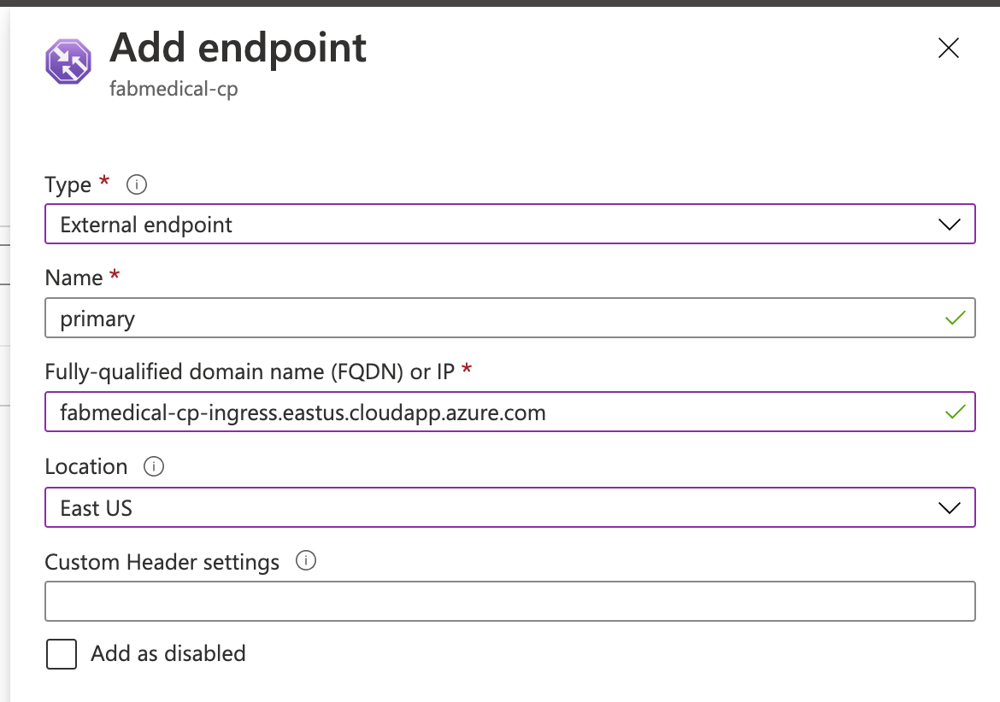
    <figcaption aria-hidden="true">
        <font style="vertical-align: inherit;"><font style="vertical-align: inherit;">使用输入的值添加端点配置窗格。</font></font>
    </figcaption>

8.  <font style="vertical-align: inherit;"><font style="vertical-align: inherit;">请注意，“</font></font>**<font style="vertical-align: inherit;"><font style="vertical-align: inherit;">端点</font></font>**
    <font style="vertical-align: inherit;"><font style="vertical-align: inherit;">”列表</font><font style="vertical-align: inherit;">现在显示了</font><font style="vertical-align: inherit;">已添加</font><font style="vertical-align: inherit;">的</font></font>**<font style="vertical-align: inherit;"><font style="vertical-align: inherit;">主要</font></font>**
    <font style="vertical-align: inherit;"><font style="vertical-align: inherit;">端点。</font></font>

9.  <font style="vertical-align: inherit;"><font style="vertical-align: inherit;">在“</font></font>**<font style="vertical-align: inherit;"><font style="vertical-align: inherit;">流量管理器”概要文件</font></font>**
    <font style="vertical-align: inherit;"><font style="vertical-align: inherit;">刀片上，选择“</font></font>**<font style="vertical-align: inherit;"><font style="vertical-align: inherit;">概述”</font></font>**
    <font style="vertical-align: inherit;"><font style="vertical-align: inherit;">。</font></font>

10.  <font style="vertical-align: inherit;"><font style="vertical-align: inherit;">在“</font></font>**<font style="vertical-align: inherit;"><font style="vertical-align: inherit;">概述”</font></font>**
    <font style="vertical-align: inherit;"><font style="vertical-align: inherit;">窗格上，复制</font><font style="vertical-align: inherit;">“流量管理器”配置文件</font><font style="vertical-align: inherit;">的</font></font>**<font style="vertical-align: inherit;"><font style="vertical-align: inherit;">DNS名称</font></font>**
    <font style="vertical-align: inherit;"><font style="vertical-align: inherit;">。</font></font>

    
    <figcaption aria-hidden="true">
        <font style="vertical-align: inherit;"><font style="vertical-align: inherit;">流量管理器配置文件概述窗格，突出显示DNS名称</font></font>
    </figcaption>

11.  <font style="vertical-align: inherit;"><font style="vertical-align: inherit;">打开一个新的Web浏览器选项卡，然后导航到</font><font style="vertical-align: inherit;">刚复制</font><font style="vertical-align: inherit;">的流量管理器配置文件</font></font>**<font style="vertical-align: inherit;"><font style="vertical-align: inherit;">DNS名称</font></font>**
    <font style="vertical-align: inherit;"><font style="vertical-align: inherit;">。</font></font>

    
    <figcaption aria-hidden="true">
        <font style="vertical-align: inherit;"><font style="vertical-align: inherit;">屏幕截图显示了使用流量管理器配置文件DNS名称的Contoso Neuro网站</font></font>
    </figcaption>

12.  <font style="vertical-align: inherit;"><font style="vertical-align: inherit;">在AKS中设置多区域托管应用程序时，您将在另一个Azure区域中设置辅助AKS，然后将其终结点添加到其Traffic Manager配置文件中以实现负载平衡。</font></font>

    > **<font style="vertical-align: inherit;"><font style="vertical-align: inherit;">注意：</font></font>**
    > <font style="vertical-align: inherit;"><font style="vertical-align: inherit;">如果需要，您可以自行设置辅助AKS和Contoso Neuro网站的实例。</font><font style="vertical-align: inherit;">设置步骤与您在本实验中设置主要AKS和应用程序实例所经历的大多数步骤相同。</font></font>

## <font style="vertical-align: inherit;"><font style="vertical-align: inherit;">动手实验后</font></font>

**<font style="vertical-align: inherit;"><font style="vertical-align: inherit;">片长</font></font>**
<font style="vertical-align: inherit;"><font style="vertical-align: inherit;">：10分钟</font></font>

<font style="vertical-align: inherit;"><font style="vertical-align: inherit;">在本练习中，您将取消提供为支持此实验而创建的任何Azure资源。</font></font>

1.  <font style="vertical-align: inherit;"><font style="vertical-align: inherit;">删除放置所有Azure资源的资源组。</font></font>
    * <font style="vertical-align: inherit;"><font style="vertical-align: inherit;">从门户网站，浏览到</font></font>**<font style="vertical-align: inherit;"><font style="vertical-align: inherit;">资源组</font></font>**
        <font style="vertical-align: inherit;"><font style="vertical-align: inherit;">的刀片服务器，</font><font style="vertical-align: inherit;">然后</font><font style="vertical-align: inherit;">在顶部的命令栏中</font><font style="vertical-align: inherit;">选择“</font></font>**<font style="vertical-align: inherit;"><font style="vertical-align: inherit;">删除</font></font>**
        <font style="vertical-align: inherit;"><font style="vertical-align: inherit;">”。</font></font>

    * <font style="vertical-align: inherit;"><font style="vertical-align: inherit;">通过重新键入资源组名称并选择“删除”来确认删除。</font></font>

2.  <font style="vertical-align: inherit;"><font style="vertical-align: inherit;">在动手练习之前，删除在任务3：创建服务主体上创建的服务主体。</font></font>

    ```
    az ad sp delete --id "Fabmedical-sp"
    ```

<font style="vertical-align: inherit;"><font style="vertical-align: inherit;">参加动手练习</font></font>_<font style="vertical-align: inherit;"><font style="vertical-align: inherit;">后，</font></font>_
<font style="vertical-align: inherit;"><font style="vertical-align: inherit;">您应该按照提供的所有步骤</font><font style="vertical-align: inherit;">进行操作。</font></font>
