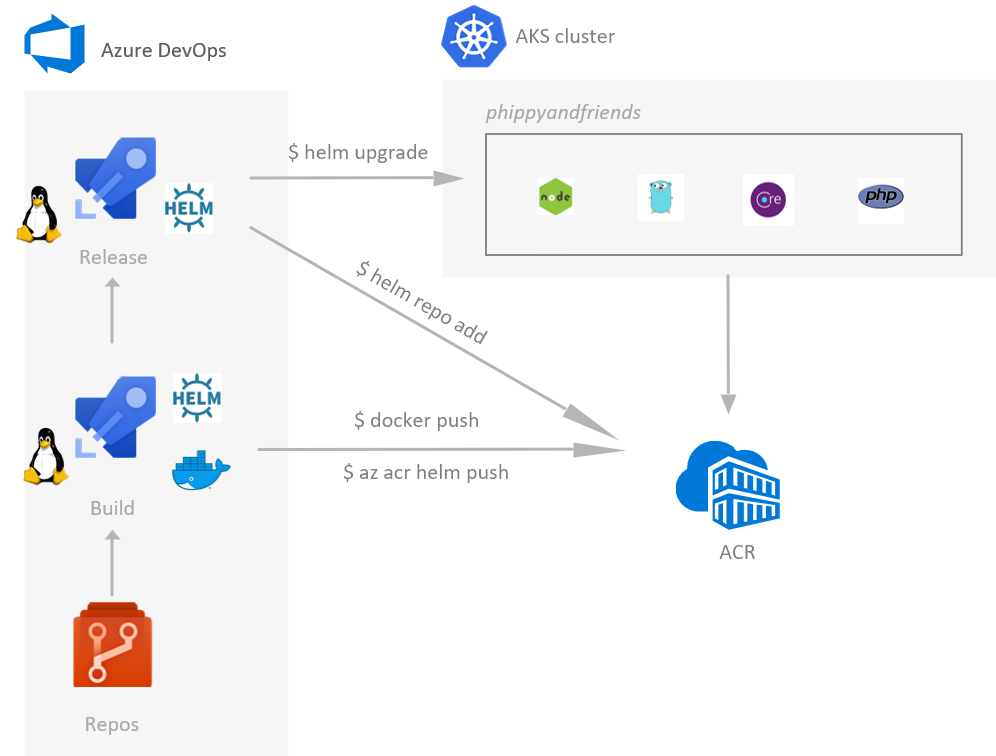

 # 培训讲师信息
=====

**内容概览**

*   [培训师信息](https://github.com/microsoft/MCW-Cloud-native-applications/blob/master/Whiteboard%20design%20session/WDS%20trainer%20guide%20-%20Cloud-native%20applications.md#trainer-information)

*   [培训师的作用](https://github.com/microsoft/MCW-Cloud-native-applications/blob/master/Whiteboard%20design%20session/WDS%20trainer%20guide%20-%20Cloud-native%20applications.md#role-of-the-trainer)
*   [白板设计会议流程](https://github.com/microsoft/MCW-Cloud-native-applications/blob/master/Whiteboard%20design%20session/WDS%20trainer%20guide%20-%20Cloud-native%20applications.md#whiteboard-design-session-flow)
*   [白板设计会议之前：如何准备](https://github.com/microsoft/MCW-Cloud-native-applications/blob/master/Whiteboard%20design%20session/WDS%20trainer%20guide%20-%20Cloud-native%20applications.md#before-the-whiteboard-design-session-how-to-prepare)
*   [在白板设计会议期间：有效的白板设计会议的提示](https://github.com/microsoft/MCW-Cloud-native-applications/blob/master/Whiteboard%20design%20session/WDS%20trainer%20guide%20-%20Cloud-native%20applications.md#during-the-whiteboard-design-session-tips-for-an-effective-whiteboard-design-session)

*   [云原生应用白板设计会议学生指南](https://github.com/microsoft/MCW-Cloud-native-applications/blob/master/Whiteboard%20design%20session/WDS%20trainer%20guide%20-%20Cloud-native%20applications.md#cloud-native-applications-whiteboard-design-session-student-guide)

*   [摘要和学习目标](https://github.com/microsoft/MCW-Cloud-native-applications/blob/master/Whiteboard%20design%20session/WDS%20trainer%20guide%20-%20Cloud-native%20applications.md#abstract-and-learning-objectives)
*   [步骤1：审查客户案例研究](https://github.com/microsoft/MCW-Cloud-native-applications/blob/master/Whiteboard%20design%20session/WDS%20trainer%20guide%20-%20Cloud-native%20applications.md#step-1-review-the-customer-case-study)

*   [客户情况](https://github.com/microsoft/MCW-Cloud-native-applications/blob/master/Whiteboard%20design%20session/WDS%20trainer%20guide%20-%20Cloud-native%20applications.md#customer-situation)
*   [客户的需求](https://github.com/microsoft/MCW-Cloud-native-applications/blob/master/Whiteboard%20design%20session/WDS%20trainer%20guide%20-%20Cloud-native%20applications.md#customer-needs)
*   [客户异议](https://github.com/microsoft/MCW-Cloud-native-applications/blob/master/Whiteboard%20design%20session/WDS%20trainer%20guide%20-%20Cloud-native%20applications.md#customer-objections)
*   [常见情况的信息图](https://github.com/microsoft/MCW-Cloud-native-applications/blob/master/Whiteboard%20design%20session/WDS%20trainer%20guide%20-%20Cloud-native%20applications.md#infographic-for-common-scenarios)

*   [步骤2：设计概念验证解决方案](https://github.com/microsoft/MCW-Cloud-native-applications/blob/master/Whiteboard%20design%20session/WDS%20trainer%20guide%20-%20Cloud-native%20applications.md#step-2-design-a-proof-of-concept-solution)
*   [步骤3：提出解决方案](https://github.com/microsoft/MCW-Cloud-native-applications/blob/master/Whiteboard%20design%20session/WDS%20trainer%20guide%20-%20Cloud-native%20applications.md#step-3-present-the-solution)
*   [包起来](https://github.com/microsoft/MCW-Cloud-native-applications/blob/master/Whiteboard%20design%20session/WDS%20trainer%20guide%20-%20Cloud-native%20applications.md#wrap-up)
*   [其他参考](https://github.com/microsoft/MCW-Cloud-native-applications/blob/master/Whiteboard%20design%20session/WDS%20trainer%20guide%20-%20Cloud-native%20applications.md#additional-references)

*   [云原生应用白板设计课程培训师指南](https://github.com/microsoft/MCW-Cloud-native-applications/blob/master/Whiteboard%20design%20session/WDS%20trainer%20guide%20-%20Cloud-native%20applications.md#cloud-native-applications-whiteboard-design-session-trainer-guide)

*   [步骤1：审查客户案例研究](https://github.com/microsoft/MCW-Cloud-native-applications/blob/master/Whiteboard%20design%20session/WDS%20trainer%20guide%20-%20Cloud-native%20applications.md#step-1-review-the-customer-case-study-1)
*   [步骤2：设计概念验证解决方案](https://github.com/microsoft/MCW-Cloud-native-applications/blob/master/Whiteboard%20design%20session/WDS%20trainer%20guide%20-%20Cloud-native%20applications.md#step-2-design-a-proof-of-concept-solution-1)
*   [步骤3：提出解决方案](https://github.com/microsoft/MCW-Cloud-native-applications/blob/master/Whiteboard%20design%20session/WDS%20trainer%20guide%20-%20Cloud-native%20applications.md#step-3-present-the-solution-1)
*   [总结](https://github.com/microsoft/MCW-Cloud-native-applications/blob/master/Whiteboard%20design%20session/WDS%20trainer%20guide%20-%20Cloud-native%20applications.md#wrap-up-1)
*   [首选目标受众](https://github.com/microsoft/MCW-Cloud-native-applications/blob/master/Whiteboard%20design%20session/WDS%20trainer%20guide%20-%20Cloud-native%20applications.md#preferred-target-audience)
*   [首选解决方案](https://github.com/microsoft/MCW-Cloud-native-applications/blob/master/Whiteboard%20design%20session/WDS%20trainer%20guide%20-%20Cloud-native%20applications.md#preferred-solution)
*   [首选异议处理清单](https://github.com/microsoft/MCW-Cloud-native-applications/blob/master/Whiteboard%20design%20session/WDS%20trainer%20guide%20-%20Cloud-native%20applications.md#checklist-of-preferred-objection-handling)
*   [客户报价（最后回读给与会者）](https://github.com/microsoft/MCW-Cloud-native-applications/blob/master/Whiteboard%20design%20session/WDS%20trainer%20guide%20-%20Cloud-native%20applications.md#customer-quote-to-be-read-back-to-the-attendees-at-the-end)

培训师的作用
------

一位了不起的教练：

· 创建一个可以进行学习的安全环境。

· 激发参与者的思维。

· 让参与者参与学习过程。

· 管理学习过程（按时，按主题并进行调整以使参与者受益）。

· 确保个人参与者的责任感。

· 为参与者捆绑在一起。

· 为学习过程提供见识和经验。

· 有效地领导白板设计会议的讨论。

· 监控参与者可交付成果的质量和适当性。

· 有效地领导反馈过程。

白板设计会议流程
--------

每个白板设计会话都使用以下流程：

**步骤****1****：回顾客户案例研究（****15****分钟）**

**结果**

分析客户的需求：包括：

· 客户的背景，状况，需求和技术要求。

· 当前的客户基础架构和体系结构。

· 潜在的问题，目标和阻碍因素。

**步骤****2****：设计概念验证解决方案（****60****分钟）**

**结果**

设计一个解决方案，并准备以15分钟的对话形式将解决方案介绍给目标客户。

· 确定您的目标客户群体。

· 确定客户的业务需求以解决您的解决方案。

· 设计并绘制解决方案图。

· 准备介绍您的解决方案。

**步骤****3****：提出解决方案（****30****分钟）**

**结果**

向您的客户介绍解决方案：

· 目前的解决方案。

· 回应客户的反对意见。

· 接收反馈。

**总结（****15****分钟）**

*   查看首选解决方案。

白板设计会议之前：如何准备
-------------

在进行第一次白板设计之前，请执行以下操作：

· 阅读学生指南（包括案例研究）和培训师指南。

· 熟悉所有关键点和活动。

· 计划要强调的点，要推动的问题，过渡，并准备回答问题。

· 在白板设计会议之前，请讨论案例研究以获取更多想法。

· 做笔记以备后用。

在白板设计会议期间：有效的白板设计会议的提示
----------------------

**请参阅培训师指南，**以保持正轨并遵守时间安排。

**不要期望记住**白板设计会议的**每个细节**。

参与者进行活动时，您可以**提前刷新自己的记忆**。

· 根据需要**调整活动和白板设计会话的进度**，以留出时间进行演示，反馈和共享。

· 根据您的经验**添加示例，要点和故事**。考虑可以分享的故事，这些故事可以帮助您清楚有效地表达自己的观点。

· **考虑创建一个****“****停车场****”**以记录白板设计会议范围之外或以后可以回答的问题或问题。确定如何解决这些问题，这样您就可以在不使它们脱轨的情况下对其进行确认。

**_玩得开心_**_！鼓励参与者玩得开心，分享！_

**让您的参与者参与进来。**交谈并分享您的知识，但即使您正在发言，也要始终让您的参与者参与。

**提出问题**并让他们分享，以使您的小组充分参与学习过程。

**请**尽可能**先询问**。在开始讨论主题之前，请先了解听众对此主题的看法以及使用该主题的经验。首先询问可以使您评估他们的知识和经验水平，并使他们对所呈现的内容更加开放。

**等待回应**。如果您提出诸如“您的经验（填空）是什么？”之类的问题？然后等等。不要害怕一点沉默。如果您进入沉默状态，您的参与者会感到您不认真地参与其中，并且会变得被动。给参与者一个思考的机会，如果没有人回答，请耐心地再问一次。您通常会得到回应。

云原生应用白板设计会议学生指南
===============

摘要和学习目标
-------

在此白板设计会议中，您将学习与在Azure中构建和部署容器化应用程序有关的选择，围绕此问题的关键决策以及解决方案的其他方面，包括提升和移动应用程序部分以减少应用程序更改的方法。

在本设计课程结束时，您将能够更好地设计针对Azure Kubernetes服务（AKS）的解决方案，并为容器化应用程序定义DevOps工作流。

步骤1：审查客户案例研究
------------

**结果**

分析您的客户需求。

时限：15分钟

指导：与所有参与者一起，讲师提供客户案例研究的概述以及技术提示。

1. 与您的餐桌参与者和培训师见面。

2. 阅读学生指南中步骤1-3的所有说明。

3. 作为表团队，请查看以下客户案例研究。

### 客户情况

Fabrikam Medical Conferences提供适合医学界的会议网站服务。他们始于10年前，为一个小型会议组织者建立了一些会议场所。从那时起，口碑相传，Fabrikam Medical Conferences现在是一个著名的行业品牌。现在，他们每年处理100多个会议，并且还在不断增长。

医疗会议通常是低预算的网站，因为高端会议通常在100至1500位与会者之间。同时，会议所有者具有重大的自定义和更改要求，并要求快速在会议站点中实现。这些更改可能会影响从UI到后端的系统各个方面，包括会议注册和付款条件。

Fabrikam的工程副总裁Arthur Block拥有一个由12名开发人员组成的团队，负责他们客户站点的开发，测试，部署和运营管理的各个方面。由于客户的需求，他们在开发和DevOps工作流程的效率和可靠性方面存在问题。

会议站点当前在本地托管，具有以下拓扑和平台实现：

· 会议网站使用MEAN堆栈（Mongo，Express，Angular，Node.js）构建。

· 网站和API是作为托管在Linux服务器上的微服务构建的。

· 本地数据后端是MongoDB；也可以在单独的Linux服务器群集上运行。

· 在Linux服务器上运行的PostgreSQL中存储有关系数据。

客户被视为“租户”，每个租户都被视为唯一的部署，由此发生以下情况：

· 每个租户在MongoDB集群中都有一个具有自己的集合的数据库，而在PostgreSQL中则有一个数据库。

· 将获取最新的功能会议代码库的副本，并将其配置为指向租户数据库。

*   这包括一个网站代码库和一个管理网站代码库，用于输入会议内容，例如演讲者，会议，讲习班，赞助商和与会者的会议反馈。

· 进行了修改以支持客户的样式，图形，布局和其他自定义请求。

· 会议所有者有权访问管理站点以输入事件详细信息。

o 他们每年都会在每个会议上继续使用此管理站点。

o 他们可以添加新事件并隔离发言人，会议，研讨会和其他详细信息。

· 租户的代码（会议和管理网站）被部署到专用于一个或多个租户的一组特定的负载平衡Linux服务器。每组计算机托管一组特定的租户，并且根据租户的Scale要求进行分配。

· 会议现场启用后，不可避免的要求更改网站页面，样式，注册要求以及任意数量的自定义请求。

Arthur痛苦地意识到，这家小企业已经发展成为更大的企业，已经有机地发展成为应该用于会议的完全多租户应用程序套件。但是，团队很难达到这个目标。他们会不断地为每个租户更新代码库，并尽最大努力将改进内容合并到一个核心代码库中，以便用于召开新会议。变革的步伐很快，预算很紧，而且他们根本没有时间停止和重组核心代码库来支持客户所需的所有灵活性。

Arthur希望朝着这个方向迈出一步，并牢记以下目标：

· 进行更改时，减少单个租户中引入的回归。

o 代码库的问题之一是，它具有跨功能的许多依赖关系。看似简单的代码区域更改会带来布局，响应能力，注册功能，内容刷新等问题。

o 为避免这种情况，他想重新设计核心代码库，以便注册，电子邮件通知和模板，内容和配置彼此之间以及与前端完全分开。

o 理想情况下，对单个区域的更改将不再需要对该站点进行完整的回归测试；但是，鉴于他们管理的站点数量，这是不现实的。

· 改善DevOps生命周期。

o 在会议的整个生命周期中，招募新租户，为现有租户启动新站点以及管理所有实时租户所花费的时间非常低效。

o 通过减少吸引客户，管理已部署站点和监视运行状况的Workloads，随着公司不断增长，公司可以控制成本和开销。这可能会留出时间来改善他们希望为长期增长而构建的多租户平台。

· 增加对系统操作和运行状况的可见性。

*   该团队对部署的网站几乎没有健康状况的总体监控。

尽管多租户是代码库的目标，但即使有了这一点，Arthur仍然认为，始终需要为需要一次性定制实现的特定租户提供代码的自定义副本。Arthur认为Docker容器可能是满足其短期DevOps和开发敏捷性需求的一个很好的解决方案，而且一旦达到多数多租户应用程序解决方案，它也是正确的方向。

### 客户的需求

1. 减少部署新会议租户的时间，复杂性和成本。

2. 提高会议租户更新的可靠性。

3. 为Azure上的Docker容器策略选择合适的平台。平台选择应：

o 使部署和管理基础架构变得容易。

o 提供工具以帮助他们监视和管理容器的运行状况和安全性。

o 使管理不同租户的可变Scale要求变得更加容易，从而使他们不再需要将租户分配给特定的负载平衡机器集。

o 提供与供应商无关的解决方案，以使特定的内部部署或云环境不会成为新的依赖项。

4. 以最小的应用程序代码更改将数据从本地MongoDB迁移到Azure Cosmos DB。

5. 将关系数据从PostgreSQL本地数据库迁移到Microsoft Azure

6. 继续使用Git存储库进行源代码控制，并将其集成到CI / CD工作流程中。

7. 首选具有以下方面的完整的运营管理工具套件：

o 在开发和初始POC工作期间用于手动部署和管理的UI。

o 集成CI / CD自动化的API。

o 容器调度和编排。

o 健康监控和警报，可视化状态。

o 容器图像扫描。

8. 为单个租户完成建议的解决方案的实施，以培训团队并完善流程。

9. 借助AI增强与会者会话反馈，以防止发布不适当的内容，并进行实时语言翻译，以更好地适应不断增长的全球会议出席人数。

### 客户异议

1. 有多种方法可以在Azure上部署Docker容器。这些选择如何比较？每种选择的动机是什么？

2. Azure中是否有一个选项可以提供易于管理和迁移到的容器编排平台功能，还可以满足我们的Scale和管理工作流要求？

3. 我们听说Azure Cosmos DB与MongoDB兼容。这将提供最小化代码更改的迁移吗？

4. 我们知道Microsoft提供带有预先构建的AI模型的认知服务。哪些型号提供了我们希望用于增强会议网站的功能？

### 常见情况的信息图

_Kubernetes__体系结构_

**注意**：此图说明了Kubernetes拓扑，说明了Azure管理的主Node以及客户可以在其中集成和部署应用程序的代理Node。

[https://docs.microsoft.com/zh-CN/azure/aks/intro-kubernetes](https://docs.microsoft.com/en-us/azure/aks/intro-kubernetes)

_使用__Azure DevOps__的__CI / CD__到__Azure Kubernetes__服务_

[https://cloudblogs.microsoft.com/opensource/2018/11/27/tutorial-azure-devops-setup-cicd-pipeline-kubernetes-docker-helm/](https://cloudblogs.microsoft.com/opensource/2018/11/27/tutorial-azure-devops-setup-cicd-pipeline-kubernetes-docker-helm/)

步骤2：设计概念验证解决方案
--------------

**结果**

设计一个解决方案，并准备以15分钟的对话形式将解决方案介绍给目标客户。

时间范围：60分钟

**业务需求**

方向：让所有参与者都在您的餐桌旁，回答以下问题，并在活动挂图上列出答案：

1. 您应该向谁提出这个解决方案？谁是您的目标客户群？谁是决策者？

2. 您需要使用解决方案解决哪些客户业务需求？

**设计**

方向：让所有与会者都在您的餐桌旁，在活动挂图上回答以下问题：

_高层架构_

1. 根据客户的情况，您将为单个会议租户提出什么样的容器作为新的微服务体系结构的一部分？

2. 在不涉及细节的情况下（以下各节将讨论特定的细节），图解您对容器平台，应部署的容器（对于单个租户）和数据层的初步构想。

_在__Azure__上选择容器平台_

1. 列出将容器部署到Azure的潜在平台选择。

2. 您会推荐哪个？为什么？

3. 描述客户如何配置其Azure Kubernetes服务（AKS）环境以开始其POC。

_容器，发现和负载平衡_

1. 描述开发人员在构建POC时将遵循的高级手动步骤，以在Azure Kubernetes Service（AKS）上构建映像和运行容器。摘要中包括以下组件：

o 包含其源代码的Git存储库。

o Docker映像注册表。

o 生成Docker映像并推送到注册表的步骤。

o 使用Kubernetes仪表板运行容器。

2. 客户对Docker映像注册表和容器扫描有哪些选择，您会推荐什么？

3. 客户将如何配置网站容器，以便可以从Azure Kubernetes服务（AKS）在端口80/443上公开访问它们？

4. 说明Azure Kubernetes服务（AKS）如何将请求路由到位于端口80/443上的同一Node上的多个网站容器

_可伸缩性注意事项_

1.  向客户说明Azure Kubernetes服务（AKS）及其预先配置的缩放集如何支持群集Autoscale。

_自动化__DevOps__工作流程_

1. 描述GitHub Actions如何帮助客户自动化其连续的集成和部署工作流以及Azure Kubernetes Service（AKS）基础架构。

2. 描述建议的方法，以使Azure Kubernetes服务（AKS）Node保持最新，最新的安全修补程序或受支持的Kubernetes版本。

**准备**

方向：所有与会人员都在您的餐桌旁：

1. 确定未通过建议的解决方案解决的任何客户需求。

2. 确定您的解决方案的好处。

3. 确定您将如何回应客户的反对。

准备给客户15分钟的口头演讲风格的演示文稿。

步骤3：提出解决方案
----------

**结果**

以15分钟的演讲形式向目标客户群体介绍解决方案。

时限：30分钟

**推介会**

方向：

1. 与另一张桌子配对。

2. 一个表是Microsoft团队，另一个表是客户。

3. Microsoft团队向客户介绍了他们提出的解决方案。

4. 客户从异议列表中提出异议之一。

5. Microsoft团队对此异议做出了回应。

6. 客户团队向Microsoft团队提供反馈。

7. 切换角色并重复步骤2-6。

总结
--

时限：15分钟

方向：与较大的小组重新开会，以听取主持人/中小型企业分享案例研究的首选解决方案。

其他参考
----

**描述**

**链接**

Azure Kubernetes服务（AKS）

[https://docs.microsoft.com/azure/aks/intro-kubernetes/](https://docs.microsoft.com/azure/aks/intro-kubernetes/)

Kubernetes

[https://kubernetes.io/docs/home/](https://kubernetes.io/docs/home/)

AKS常见问题

[https://docs.microsoft.com/azure/aks/faq](https://docs.microsoft.com/azure/aks/faq)

AutoscaleAKS

[https://github.com/kubernetes/autoscaler](https://github.com/kubernetes/autoscaler)

AKS群集Autoscale器

[https://docs.microsoft.com/azure/aks/cluster-autoscaler](https://docs.microsoft.com/azure/aks/cluster-autoscaler)

升级AKS集群

[https://docs.microsoft.com/azure/aks/upgrade-cluster](https://docs.microsoft.com/azure/aks/upgrade-cluster)

Azure管道

[https://docs.microsoft.com/azure/devops/pipelines/](https://docs.microsoft.com/azure/devops/pipelines/)

容器安全

[https://docs.microsoft.com/azure/container-instances/container-instances-image-security/](https://docs.microsoft.com/azure/container-instances/container-instances-image-security/)

镜像隔离

[https://github.com/Azure/acr/tree/master/docs/preview/quarantine/](https://github.com/Azure/acr/tree/master/docs/preview/quarantine/)

容器监控解决方案

[https://docs.microsoft.com/azure/azure-monitor/insights/containers](https://docs.microsoft.com/azure/azure-monitor/insights/containers)

Azure Cosmos数据库

[https://docs.microsoft.com/azure/cosmos-db/introduction](https://docs.microsoft.com/azure/cosmos-db/introduction)

PostgreSQL的Azure数据库

[https://azure.microsoft.com/services/postgresql/](https://azure.microsoft.com/services/postgresql/)

Azure认知服务

[https://azure.microsoft.com/services/cognitive-services/](https://azure.microsoft.com/services/cognitive-services/)

云原生应用白板设计课程培训师指南
================

步骤1：审查客户案例研究
------------

· 与您的餐桌参与者一起检查，以介绍自己作为培训师。

· 问：“您对客户案例研究有什么疑问？”

· 简要回顾白板设计会议的步骤和时间表。

· 预备，准备，开始！让表参与者开始。

步骤2：设计概念验证解决方案
--------------

· 检查您的表，以确保它们在按时逐步过渡。

· 提供有关他们对业务需求和设计的响应的反馈。

*   首先尝试提出问题，这将使参与者自己发现答案。

· 提供反馈意见以回应他们对客户异议的回应。

*   首先尝试提出问题，这将使参与者自己发现答案。

步骤3：提出解决方案
----------

· 在步骤3开始之前，确定哪个表将与您的表配对。

· 对于第一轮，将一个表分配给演示团队，将另一个表分配给客户。

· 让演示团队向客户团队介绍他们的解决方案。

o 让客户团队对演示团队做出回应提出一个异议。

o 陈述，异议和反馈不应超过15分钟。

o 如果需要，培训师还可以提供反馈。

总结
--

*   让表格参与者与较大的会议小组重新开会，以听取主持人/ SME共享的以下首选解决方案。

首选目标受众
------

Fabrikam医学会议的工程副总裁Arthur Block。

主要受众是具有影响力的解决方案架构师或开发或运营中的领先技术人员的技术战略决策者。对于此示例，其中可能包括VP Engineering及其核心团队。通常，我们会与向CIO或同等机构汇报的关键架构师，开发人员和基础架构经理进行对话，或者与关键解决方案发起人或代表业务部门IT的人员或向那些发起人进行报告的开发人员进行交谈。

首选解决方案
------

在评估了Azure上的容器平台的选项并与Microsoft的团队讨论了Azure Kubernetes Service（AKS）功能之后，Fabrikam Medical Conferences决定继续使用Azure Kubernetes Service（AKS）。

他们还决定继续使用GitHub Actions进行容器DevOps工作流。

**设计**

_总体架构_

1. 根据客户的情况，您将为单个会议租户提出什么样的容器作为新的微服务体系结构的一部分？每个租户将拥有以下容器：

o **会议网站**：SPA应用程序，它将使用配置设置来处理租户的自定义样式。

o **Admin Web****站点**：会议所有者使用的SPA应用程序，用于管理会议配置详细信息，管理与会者注册，管理活动以及与与会者通信。

o **注册服务**：处理所有注册活动，使用适当的软件包选择以及相关费用创建新的会议注册的API。

o **电子邮件服务**：用于在注册过程中或会议所有者选择通过其管理站点吸引与会者时处理向与会者发送电子邮件通知的API。

o **Config****服务**：用于处理会议配置设置的API，例如日期，位置，价格表，早鸟特惠，倒计时等。

o **内容服务**：处理会议内容的API，例如演讲者，会议，研讨会和赞助者。

2. 在不涉及细节的情况下（以下各节将讨论特定的细节），图解您对容器平台，应部署的容器（对于单个租户）和数据层的初步构想。

该解决方案将使用Azure Kubernetes服务（AKS），这意味着将根据请求的Node数来配置容器群集拓扑。提议的部署到集群的容器如下所示。数据层由Cosmos DB在容器平台外部提供。使用DevOps工作流管理容器到AKS的部署，该工作流使用带有Azure Container Registry和Helm的GitHub Actions for CI / CD：

_在__Azure__上选择容器平台_

1. 列出将容器部署到Azure的潜在平台选择。

**Azure Kubernetes****服务（****AKS****）**

Azure Kubernetes服务（AKS）是在Azure上管理Kubernetes群集的最简单方法\-为您提供托管的控制平面和可配置的群集，并具有自动更新和易于扩展的功能。AKS消除了容器编排集群的管理开销，使团队可以专注于与解决方案相关的应用程序和核心DevOps工作流程。

**Azure****容器实例**

Azure容器实例提供了一种无服务器方法来按需并按比例运行容器，从而为虚拟化管理程序隔离提供了安全性，从而为选定的Workloads提供了额外的计算能力和弹性。

**容器的****Azure Web****应用**

Azure Web App容器专门针对容器部署，这使得在完全托管的App Service Plan中轻松运行容器成为可能。对于不需要诸如Kubernetes之类的业务流程平台提供的功能的解决方案，此选项是理想的选择。

2. 您会推荐哪个？为什么？

由于以下原因，建议使用Azure Kubernetes服务（AKS）：

o 它具有必要的编排功能，而没有控制台的管理开销。

o 使用管理UI监视和管理应用程序的能力。这也将使在单个窗格中查看所有租户应用程序的整体状态更加容易，并轻松地深入了解单个租户的运行状况。

o 与Azure中的容器监视解决方案集成，可在不连接Kubernetes控制平面的情况下从Azure门户进一步查看在AKS群集中运行的容器。

o 全套集成功能，开箱即用，包括负载平衡，服务发现，自我修复功能，调度，编排，任务监视等。

o 简单的REST API支持DevOps工作流程的自动化。

o 开源，成熟且经过生产测试的平台。

通常，如果客户具有受支持的编排之一的经验，则可以在Azure Kubernetes服务（AKS）中应用该经验。Kubernetes背后的社区有很大的发展动力，并且Microsoft提供了基于此平台的完全托管的解决方案，这是自然的选择。

3. 描述客户如何配置其Azure Kubernetes服务（AKS）环境以开始其POC。

*   使用一些简单的Azure CLI命令部署Azure Kubernetes服务（AKS）环境。

_容器，发现和负载平衡_

1. 描述开发人员在构建POC时将遵循的概括手动步骤，以在Azure Kubernetes Service（AKS）上构建映像和运行容器。摘要中包括以下组件：

o 包含其源代码的Git存储库。

o Docker映像注册表。

o 生成Docker映像并推送到注册表的步骤。

o 使用Kubernetes仪表板运行容器。

基本的工作流程是从服务源存储库构建映像，将映像推送到部署它的注册表中，并作为容器运行。

描述每个容器的Dockerfile可以与源代码一起驻留在Git存储库中。使用命令行工具，开发人员可以构建Docker映像并推送到注册表。当使用GitHub Actions工作流签入更改时，CI流程还可以自动构建映像并推送到注册表。

要部署和运行容器，开发人员可以：

o 安全地访问Kubernetes仪表板并手动从存储库中创建一个指定映像的部署

o 使用`kubectl`命令行将服务定义文件（JSON）发布到REST API 。使用GitHub Actions工作流程，该过程也可以作为CD过程的一部分自动进行。

o 创建GitHub Actions CI / CD工作流以自动化构建映像并将其部署在集群中运行。

2. 客户对Docker映像注册表有哪些选择，您会推荐什么？

映像注册表是CI / CD工作流的核心，并且必须是值得生产的实现，因为它是容器映像，版本控制，部署，升级和回滚策略的来源。注册表镜像还可以用于跨环境升级（例如，在开发，测试，分段和生产之间）。

以下是可以支持Azure容器部署的镜像注册表的一些自然选择：

o Azure容器注册表很自然地适合Azure部署，并且与先前针对Azure中的Docker容器提到的部署选项很好地集成在一起。这包括在Azure门户中的集成体验，以查看存储库，镜像，标签以及与镜像关联的清单清单的内容。此外，Azure容器注册表具有新的安全功能，包括镜像隔离（当前处于预览状态）。

o 对于开发，您还可以考虑使用公共Docker Hub帐户。由于公共Docker Hub存储库中的所有映像都是公共的；但是，这通常不适用于公司资产。

o 您可以选择在Docker Hub上支付私有存储库的费用，这使您可以控制谁可以访问您的存储库。这需要合理的费用，并且得到了全面管理。

o 您可以在Azure VM中部署和管理自己的Docker镜像库\-必须对其进行群集以实现高可用性，并且设置起来并不容易。当托管存储库可以满足解决方案要求时，不建议使用此选项。

部署和配置Docker Registry（是否集群）是一项复杂且耗时的任务。我们建议在可能的情况下对Azure解决方案使用Azure容器注册表。

3. 客户将如何配置网站容器，以便可以从Azure Kubernetes服务（AKS）在端口80/443上公开访问它们？

为Kubernetes部署配置服务时，可以选择使用公共负载平衡器，以便可以通过Azure负载平衡器访问每个服务实例。只要可以公开访问所需的端口，Azure负载平衡器将能够将流量路由到与终结点关联的所有可用服务实例。

Kubernetes还无缝支持负载均衡服务，而无需使其公开访问。来自集群内部的请求可以到达内部服务，并且将在所有服务实例之间实现负载均衡。

4. 说明Azure Kubernetes服务（AKS）如何将请求路由到位于端口80/443上的同一Node上的多个网站容器

容器在Azure Kubernetes服务（AKS）群集中所有Node上的位置与调用客户端无关。客户端应用程序会将请求发送到特定的Endpoints（URL），并期望它找到正确的容器实例来为该请求提供服务。容器路由是其中的重要组成部分。

Web应用程序和api服务容器绑定到其HOSTNode上的随机端口，从而允许每个Node多个实例。Kubernetes支持动态服务端口发现，并将在跨Node的所有实例之间进行选择以路由请求。

_可伸缩性注意事项_

1. 向客户说明Azure Kubernetes服务（AKS）如何支持群集Autoscale。

从Kubernetes 1.10开始，您可以使用Kubernetes Autoscaler扩展集群中的代理Node。

_自动化__DevOps__工作流程_

1. 描述GitHub Actions如何帮助客户自动化其连续的集成和部署工作流以及Azure Kubernetes Service（AKS）基础架构。

使用GitHub Actions，您可以创建构建工作流，这些工作流在提交或签入时可以从最新来源（例如）生成构建工件并构建Docker映像，然后将其推送到Docker映像存储库（例如Azure容器注册表）中。可以将该构建定义配置为响应特定的文件夹更改，可以基于不同的项目文件夹构建一个或多个Docker映像，并使用构建号，所需的映像存储库标签和其他对映像推广工作流有用的信息来标记映像。

要触发部署，您还可以使用GitHub Actions在AKS中创建或更新服务。例如，您可能希望您的开发集群在提交代码时始终部署最新的镜像。另一方面，对于测试，UAT或生产群集，您可能希望基于环境的特定映像标签手动运行发布作业，以控制何时发布一个或多个新版本的服务。

2. 描述建议的方法，以使Azure Kubernetes服务（AKS）Node保持最新，最新的安全修补程序或受支持的Kubernetes版本。

Azure每晚都会应用安全补丁，但是您必须重新启动服务器才能应用更新。例如，这可以通过Azure门户或Azure CLI完成。

您可以使用Azure CLI命令将群集升级到更高版本的Kubernetes。

首选异议处理清单
--------

1. 有多种方法可以在Azure上部署Docker容器。这些选择如何比较？每种选择的动机是什么？

最好的是使用Azure固有的托管流程平台（如AKS）。它减少了群集的成本和管理开销，同时仍提供了支持增长，扩展和本机管理工具的解决方案。

使用Kubernetes，除了纯Docker方法之外，您还可以触及其他功能，包括：

o Kubernetes仪表板包括Web界面和用于管理，运行和扩展容器的远程API，包括CI / CD集成选项。

o kubectl命令行工具，用于使用远程Kubernetes API并协助自动化。

o 内置的动态服务发现简化了将新容器实例部署到负载平衡环境的过程。

2. Azure中是否有一个选项可以提供易于管理和迁移到的容器编排平台功能，还可以满足我们的Scale和管理工作流要求？

在Azure上迁移到容器的最简单方法是将容器部署到App Service的Linux自订阅容器。但是，此选项不提供具有高度可定制的负载平衡，动态服务发现以及用于容器监视的整体方法的全功能容器编排平台。

Azure容器实例还提供了一种无需管理工具即可管理单个容器的简单方法。

Azure Kubernetes服务（AKS）通过全套编排和管理工具提供全面管理的服务。这是减少管理开销的最佳选择，同时仍然可以访问业务平台（如Kubernetes）提供的功能。

3. 我们听说Azure Cosmos DB与MongoDB兼容。这将提供最小化代码更改的迁移吗？

Azure Cosmos DB支持多种NoSQL数据模型；包括支持MongoDB API。这提供了为MongoDB编写的代码与Cosmos DB通信而无需更改代码的兼容性。以便更轻松地进行迁移和互操作性。

使用为MongoDB编写的现有源代码，可以将其指向Azure Cosmos DB MongoDB API终结点。Azure Cosmos DB仿真器可用于Windows上的本地开发。但是，Cosmos DB仿真器不支持Linux。结果，当使用Linux进行开发时，本地开发环境仍然需要MongoDB。与Azure Cosmos DB一起用于云中的数据存储。这使为MongoDB存储编写的现有源代码可以轻松地迁移到使用Azure Cosmos DB后端。

4. 我们知道Microsoft提供带有预先构建的AI模型的认知服务。哪些型号提供了我们希望用于增强会议网站的功能？

Azure认知服务使每位开发人员都可以使用AI，而无需机器学习专业知识。它只需要一个API调用即可嵌入实现由Microsoft管理的ML模型的功能。

o Content Moderator API可用于为图片，文本和视频添加机器辅助的内容审核和人工审核工具。您可以通过基于机器学习的分类器，自定义列表和光学字符识别（OCR）来增强检测潜在令人反感或有害镜像的能力。

o Translator API可用于集成AI服务以进行实时文本翻译。它可以跨70多种语言实时翻译文本。

客户评价（最后回读给与会者）
--------------

“有了Azure Kubernetes服务（AKS）和Cosmos DB，我们充满信心，我们可以通过适当的DevOps支持迁移到基于云的本地，基于容器的平台，从而在一个小型团队中获得成功。”

*   Fabrikam Medical Conferences工程副总裁Arthur Block