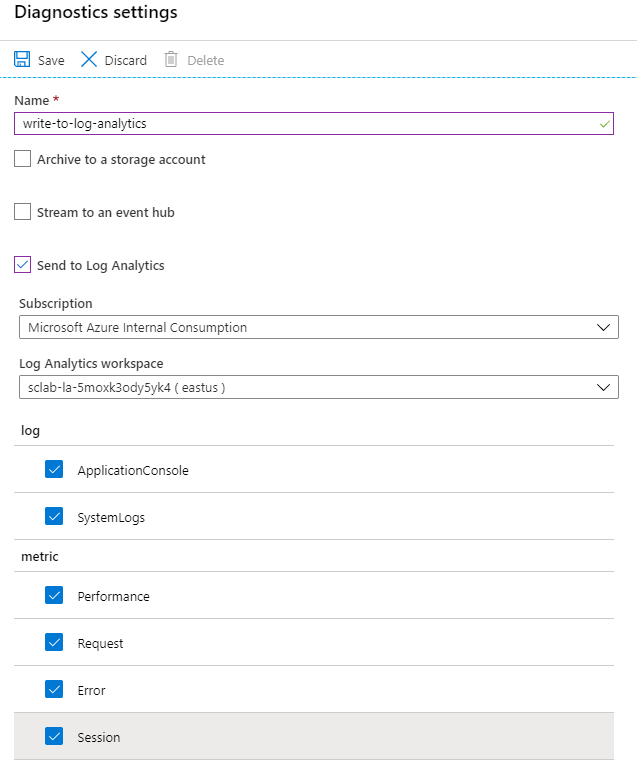

# 03 - 配置应用程序日志

**本教程是[Azure Spring Cloud 培训](../README.md)系列之一**

现在，我们部署了一个应用程序，我们将配置日志分析，以便如果出了问题,我们可以快速搜索应用程序的日志。我们将在稍后部分查看如何使用日志分析(Log Analytics)，但由于日志条目的收集会有些延后，我们将先配置收集日志，再继续后面的培训。

---

## 配置日志聚合

实际上，有三种方法可以访问您的应用程序的日志：[Azure存储](https://docs.microsoft.com/en-us/azure/storage/common/storage-introduction/?WT.mc_id=azurespringcloud-github-judubois),[Azure活动中心](https://docs.microsoft.com/en-us/azure/event-hubs/?WT.mc_id=azurespringcloud-github-judubois)和[日志分析](https://docs.microsoft.com/en-us/azure/azure-monitor/log-query/get-started-portal/?WT.mc_id=azurespringcloud-github-judubois).我们将专注于日志分析，因为它是最常见的，并且已集成到Azure Spring Cloud中。

[日志分析](https://docs.microsoft.com/en-us/azure/azure-monitor/log-query/get-started-portal/?WT.mc_id=azurespringcloud-github-judubois)是[Azure Monitor](https://azure.microsoft.com/en-us/services/monitor/?WT.mc_id=azurespringcloud-github-judubois)中的一部分，也已经很好地集成到Azure Spring Cloud，我们也将用来做指标监测。

完成[第 00 节](../00-setup-your-environment/README.md)的设置后，您应该有一个日志分析工作区命名`sclab-la-<unique string>`在您的资源组。我们现在必须配置 Azure Spring Cloud实例，将其数据发送到此工作区。

-   导航到 Azure 门户中的 Azure Spring Cloud实例，并在导航窗格的"监控"部分选择"诊断设置"：

\[]

-   单击"添加诊断设置"并配置您的实例，将其**所有**日志发送到我们刚刚创建的日志分析工作区。
-   填写此处显示的值并单击"保存"。

---

⬅️上一个教程：[02 - 构建一个简单的Spring Boot微服务](../02-build-a-simple-spring-boot-microservice/README.md)

➡️下一个教程：[04 - 配置Spring Cloud Config Server](../04-configure-a-spring-cloud-config-server/README.md)
