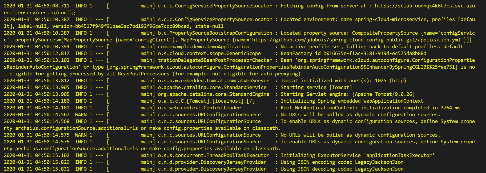
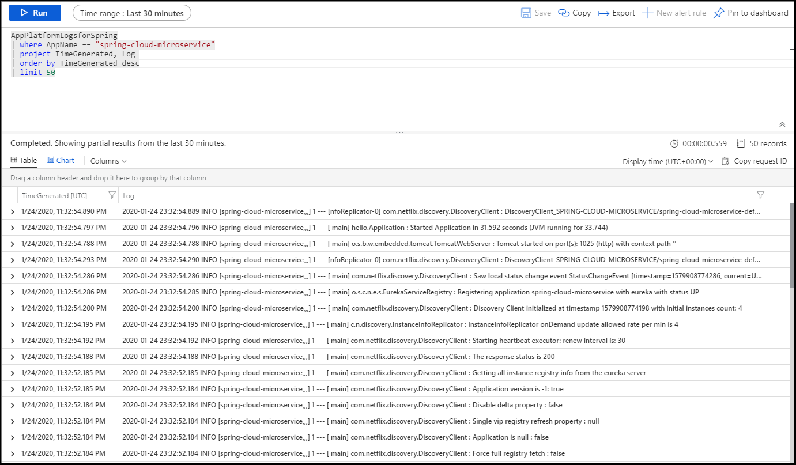

# 05 - 使用Spring Cloud功能构建Spring Boot微服务

**本教程是[Azure Spring Cloud 培训](../README.md)系列之一**

在此部分中，我们将构建与第 2 节中的类似服务，但增加了两个重要的Spring Cloud功能。首先，我们将此服务添加到Spring Cloud注册表，供其他服务发现。其次，我们将使用Spring Cloud Config将 Git 存储库中的设置注入应用程序，并将其显示在屏幕上。

---

## 我们要建立什么

本教程建立在以前的教程：我们将再次建立一个简单的Sping Boot微服务，就像 [02 - 构建一个简单的Spring Boot微服务](../02-build-a-simple-spring-boot-microservice/README.md)，但这次它将使用两个主要的Spring Cloud功能：

-   它将连接到一个Sping Cloud Service Registry，以便它可以发现其他微服务，以及本身被发现！

-   它将从我们在上一个教程中配置的Sping Cloud Config Server获得配置，[04 - 配置Sping Cloud Config服务器](../04-configure-a-spring-cloud-config-server/README.md)

对于这两个功能，其实就是添加官方Spring Boot starter就能实现的简单问题，Azure Spring Cloud会负责解决一切其他相关的底层功能。

## 创建简单的Spring Cloud微服务

我们在本教程中创建的微服务[在这里](spring-cloud-microservice/).

为了创建我们的微服务，我们将从命令行调用Sping Initalizer服务：

```bash
curl https://start.spring.io/starter.tgz -d dependencies=web,cloud-eureka,cloud-config-client -d baseDir=spring-cloud-microservice -d bootVersion=2.3.8 -d javaVersion=1.8 | tar -xzvf -
```

> 这一次，我们添加`Eureka Discovery Client`和`Config Client` Spring Boot starters，将分别自动使用自带的Spring Cloud服务注册表和Spring Cloud配置服务器。

## 添加新的Sping  MVC 控制器

可以使用VS Code打开创建的应用，在DemoApplication类同一目录下，创建一个新类名为`HelloController`内容如下：

```java
package com.example.demo;

import org.springframework.beans.factory.annotation.Value;
import org.springframework.web.bind.annotation.GetMapping;
import org.springframework.web.bind.annotation.RestController;

@RestController
public class HelloController {

    @Value("${application.message:Not configured by a Spring Cloud Server}")
    private String message;

    @GetMapping("/hello")
    public String hello() {
        return message + '\n';
    }
}
```

## 在本地测试项目

在将微服务部署到 Azure Spring Cloud之前，我们先在本地运行一下。

> 💡当您看到异常堆栈(Exception)日志时，不要惊慌：
> 
> 那是因为Spring Cloud正在尝试连接我们尚未提供的本地配置服务器。该应用程序仍可使用本地设置和默认值正常运行。

运行`simple-cloud-microservice`本地：

```bash
cd spring-cloud-microservice
./mvnw spring-boot:run &
cd ..
```

请求`/hello` Endpoint 应返回"Not configured by a Spring Cloud Server"消息。

```bash
curl http://127.0.0.1:8080/hello
```

kill本地运行的微服务：

```bash
kill %1
```

## 在Azure Spring Cloud上创建和部署应用程序

如在[02 - 构建一个简单的Spring Boot微服务](../02-build-a-simple-spring-boot-microservice/README.md)，创建一个特定的`spring-cloud-microservice`应用在您的Azure Spring Cloud实例中：

```bash
az spring-cloud app create -n spring-cloud-microservice
```

现在，您可以构建您的"Spring Cloud微服务"项目，并将其部署到 Azure Spring Cloud：

```bash
cd spring-cloud-microservice
./mvnw clean package -DskipTests
az spring-cloud app deploy -n spring-cloud-microservice --jar-path target/demo-0.0.1-SNAPSHOT.jar
cd ..
```

## 在云中测试项目

转到(G)[Azure Portal](https://portal.azure.com/):

-   在资源组中查找您的 Azure Spring Cloud实例
-   转到"应用"
    -   验证`spring-cloud-microservice`有一个`Registration status`之`1/1`.这表明它在Spring Cloud Service Registry注册成功。
    -   选择`spring-cloud-microservice`了解有关微服务的更多信息。
-   复制/粘贴提供的"测试终点"。

您现在可以再次使用cURL来测试`/hello`端点，这一次，它是由Azure Spring Cloud服务，并配置使用Sping 配置服务器从[04 - 配置Sping Cloud Config服务器](../04-configure-a-spring-cloud-config-server/README.md).

因此，请求`/hello`端点应返回我们在`application.yml`文件，来自Sping Cloud Config服务器：

```bash
Configured by Azure Spring Cloud
```

## 流式传输应用程序日志

当您在计算机上运行应用程序时，您可以在主机上看到它的输出。当您在 Azure Spring Cloud上运行微服务时，您还可以通过 Azure CLI 查看其控制台输出：

```bash
az spring-cloud app logs --name spring-cloud-microservice -f
```

_请注意，日志可能需要几分钟才能显示出来。_

您应该看到控制台输出`spring-cloud-microservice`在终端上滚动：



按 CTRL+C 停止跟随输出并返回Shell。

## 查询应用程序日志

像我们刚才所做的那样流式处理控制台输出可能有助于了解微服务的即时状态。然而，有时有必要进一步回顾过去或寻找一些具体的东西。这很容易通过日志分析来完成。在第 3 节中，我们启用了 Azure 日志分析中的日志聚合。此类设置更改可能需要 1-2 分钟才能应用，因此，到现在，您应该能够查询 Azure 日志分析。

[打开Azure Portal](https://portal.azure.com/)并导航到您的Azure Spring Cloud实例。单击"日志"。这是之前创建的日志分析工作区的快捷方式。如果出现教程，可以随时跳过它。

此工作区允许您在聚合日志上运行查询。最常见的查询是从特定应用程序获取最新日志：

**重要：** Spring Boot应用程序日志具有专用`AppPlatformLogsforSpring`类型。

下面是如何获得其50最新的日志`AppPlatformLogsforSpring`我们刚刚部署的微服务类型：

将此文本插入文本区域，其中指出"在此处键入您的查询或单击要开始的示例查询"。 单击查询的文本，然后单击"运行"。

```sql
AppPlatformLogsforSpring
| where AppName == "spring-cloud-microservice"
| project TimeGenerated, Log
| order by TimeGenerated desc
| limit 50
```



> 💡 Azure Spring Cloud微服务的控制台输出也可能需要 1-2 分钟才能读入日志分析。

## 结论

恭喜您，您已经部署了完整的Spring Cloud微服务，使用Spring Cloud服务注册表和Spring Cloud配置服务器！

如果您需要检查您的代码，最终项目可在["Spring Cloud Microservice"文件夹](spring-cloud-microservice/).

---

⬅️上一个教程：[04 - 配置Sping Cloud Config服务器](../04-configure-a-spring-cloud-config-server/README.md)

➡️下一个教程：[06 - 使用Cosmos DB 构建 Reactive Spring Boot微服务](../06-build-a-reactive-spring-boot-microservice-using-cosmosdb/README.md)
