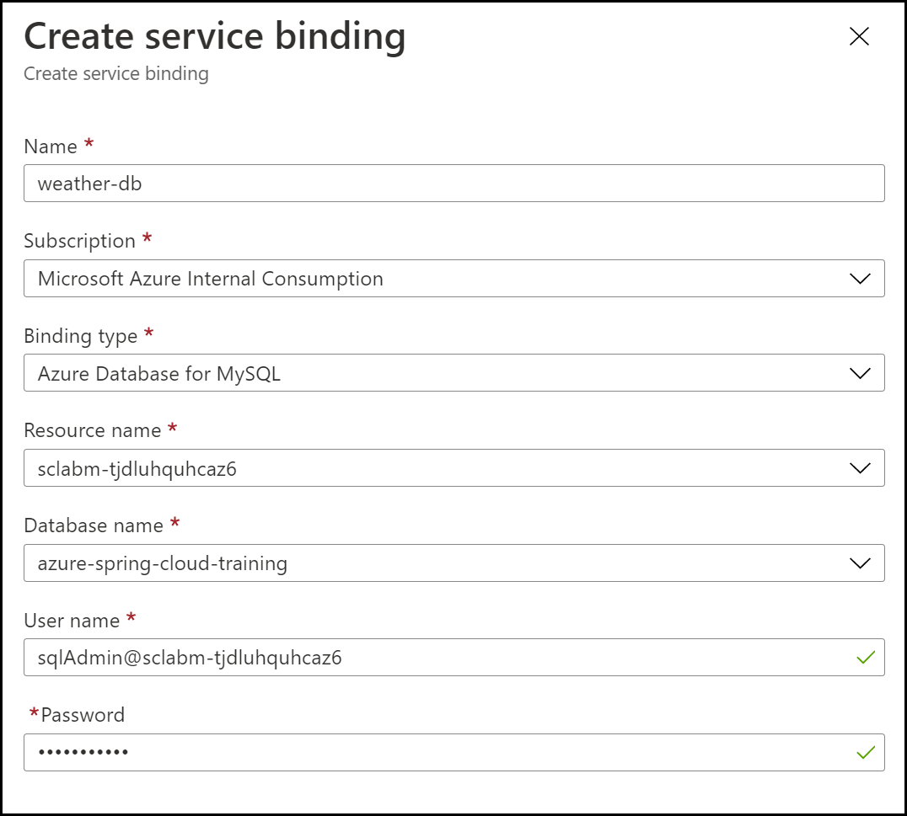

# 07 - 使用 MySQL 构建Spring Boot微服务

**本教程是[Azure Spring Cloud 培训](../README.md)系列之一**


在此部分中，我们将构建另一个数据驱动的微服务。这一次，我们将使用一个关系数据库，一个[由Azure管理的 MySQL 数据库](https://docs.microsoft.com/en-us/azure/mysql/?WT.mc_id=azurespringcloud-github-judubois).我们将使用 Java 持久性 API （JPA） 来访问数据，这也是Java 生态里主流的方式。

---

## 在Azure Spring Cloud上创建应用程序

如在[02 - 构建一个简单的Spring Boot微服务](../02-build-a-simple-spring-boot-microservice/README.md)，创建一个特定的`weather-service`应用在您的Azure Spring Cloud实例中：

```bash
az spring-cloud app create -n weather-service
```

## 配置 MySQL 服务器实例

在遵循第 00 节中的步骤后，您应该有一个名为 MySQL 实例的 Azure 数据库`sclabm-<unique string>`在您的资源组中。

然而，在我们使用它之前，我们需要执行几个任务：

1.  创建 MySQL 防火墙规则，以便从我们的本地环境中进行连接。
2.  创建 MySQL 防火墙规则，允许来自 Azure 服务的连接。这将启用来自Azure Spring Cloud的连接。
3.  创建一个MySQL数据库。

> 💡当提示密码时，输入您在部署 ARM 模板时指定的 MySQL 密码[第 00 节](../00-setup-your-environment/README.md).

```bash
# Obtain the info on the MYSQL server in our resource group:
MYSQL_INFO=$(az mysql server list --query '[0]')
MYSQL_SERVERNAME=$(az mysql server list --query '[0].name' -o tsv)
MYSQL_USERNAME="$(az mysql server list --query '[0].administratorLogin' -o tsv)@${MYSQL_SERVERNAME}"
MYSQL_HOST="$(az mysql server list --query '[0].fullyQualifiedDomainName' -o tsv)"

# Create a firewall rule to allow connections from your machine:
MY_IP=$(curl whatismyip.akamai.com 2>/dev/null)
az mysql server firewall-rule create \
    --server-name $MYSQL_SERVERNAME \
    --name "connect-from-lab" \
    --start-ip-address "$MY_IP" \
    --end-ip-address "$MY_IP"

# Create a firewall rule to allow connections from Azure services:
az mysql server firewall-rule create \
    --server-name $MYSQL_SERVERNAME \
    --name "connect-from-azure" \
    --start-ip-address "0.0.0.0" \
    --end-ip-address "0.0.0.0"

# Create a MySQL database
az mysql db create \
    --name "azure-spring-cloud-training" \
    --server-name $MYSQL_SERVERNAME

# Display MySQL username (to be used in the next section)
echo "Your MySQL username is: ${MYSQL_USERNAME}"

```

## 将 MySQL 数据库绑定到应用程序

正如我们在上一节中为Cosmos DB所做的那样，为 MySQL 数据库创建一个绑定服务，使其可用于 Azure Spring Cloud微服务。
在[Azure门户](https://portal.azure.com/?WT.mc_id=azurespringcloud-github-judubois):

-   导航到您的Azure Spring Cloud实例
-   单击应用
-   单击`weather-service`.
-   单击"服务绑定"，然后点击"创建服务绑定"。
-   如图所示填充服务绑定字段。
    -   用户名将显示在上面部分的最后一行输出中。
    -   密码是您在第 0 节中指定的密码。默认值为`super$ecr3t`.
-   单击`Create`创建数据库绑定



## 创建Spring Boot微服务

现在，我们已经准备了Azure Spring Cloud实例并配置了服务绑定，现在可以开始实现`weather-service`的代码。 完整的代码[可参考这里](weather-service/)，但建议按照下面步骤一步一步实现.

我们将从命令行调用Spring Initalizer服务来创建我们的微服务：

```bash
curl https://start.spring.io/starter.tgz -d dependencies=web,data-jpa,mysql,cloud-eureka,cloud-config-client -d baseDir=weather-service -d bootVersion=2.3.8 -d javaVersion=1.8 | tar -xzvf -
```

> 我们使用`Spring Web`,`Spring Data JPA`,`MySQL Driver`,`Eureka Discovery Client`和`Config Client`组件。

## 添加Spring代码从数据库获取数据

在`DemoApplication`类同一目录下，创建一个名为`Weather` 的JPA 实体：

```java
package com.example.demo;

import javax.persistence.Entity;
import javax.persistence.Id;

@Entity
public class Weather {

    @Id
    private String city;

    private String description;

    private String icon;

    public String getCity() {
        return city;
    }

    public void setCity(String city) {
        this.city = city;
    }

    public String getDescription() {
        return description;
    }

    public void setDescription(String description) {
        this.description = description;
    }

    public String getIcon() {
        return icon;
    }

    public void setIcon(String icon) {
        this.icon = icon;
    }
}
```

然后，创建一个Spring Data Repository来管理此实体，称为`WeatherRepository`:

```java
package com.example.demo;

import org.springframework.data.repository.CrudRepository;

public interface WeatherRepository extends CrudRepository<Weather, String> {
}
```

再添加一个Spring MVC控制器为`WeatherController`:

```java
package com.example.demo;

import org.springframework.stereotype.Controller;
import org.springframework.web.bind.annotation.*;

@RestController
@RequestMapping(path="/weather")
public class WeatherController {

    private final WeatherRepository weatherRepository;

    public WeatherController(WeatherRepository weatherRepository) {
        this.weatherRepository = weatherRepository;
    }

    @GetMapping("/city")
    public @ResponseBody Weather getWeatherForCity(@RequestParam("name") String cityName) {
        return weatherRepository.findById(cityName).get();
    }
}
```

## 在 MySQL 中添加样本数据

为了让Hibernate自动创建您的数据库，打开`src/main/resources/application.properties`文件并添加：

```properties
spring.jpa.hibernate.ddl-auto=create
```

然后，为了让Spring Boot在启动时添加示例数据，创建`src/main/resources/import.sql`文件并添加：

```sql
INSERT INTO `azure-spring-cloud-training`.`weather` (`city`, `description`, `icon`) VALUES ('Paris, France', 'Very cloudy!', 'weather-fog');
INSERT INTO `azure-spring-cloud-training`.`weather` (`city`, `description`, `icon`) VALUES ('London, UK', 'Quite cloudy', 'weather-pouring');
```

> 我们正在使用的图标是从<https://materialdesignicons.com/>获得-如果你愿意，你可以选择他们的其他天气图标。

## 部署应用程序

您现在可以构建您的"天气服务"项目，并将其发送到 Azure Spring Cloud：

```bash
cd weather-service
./mvnw clean package -DskipTests
az spring-cloud app deploy -n weather-service --jar-path target/demo-0.0.1-SNAPSHOT.jar
cd ..
```

## 在云中测试项目

-   转到 Azure Spring Cloud实例中的"应用"。
    -   验证`weather-service`有一个`Registration status`其中说`1/1`.这表明它在Spring Cloud Service Registry注册成功。
    -   选择`weather-service` 查看有关微服务的更多信息。
-   复制/粘贴提供的"测试终点"。您可能需要单击`See more`才能看到。

您现在可以使用cURL来测试`/weather/city`端点。例如，测试`Paris, France`城市，附加到测试终点的末尾：`/weather/city?name=Paris%2C%20France`.

```json
{"city":"Paris, France","description":"Very cloudy!","icon":"weather-fog"}
```

如果您需要参考代码，最终完成的项目可在["weather-service"文件夹](weather-service/).

---

⬅️上一个教程：[06 - 使用Cosmos DB构建Reactive Spring Boot微服务](../06-build-a-reactive-spring-boot-microservice-using-cosmosdb/README.md)

➡️下一个教程：[08 - 构建Spring Cloud网关](../08-build-a-spring-cloud-gateway/README.md)
