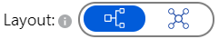

# 09 - 综上所述，一个完整的微服务Stack

**本教程是[Azure Spring Cloud 培训](../README.md)系列之一**

现在，我们已经公开了两个微服务，我们将添加一个用户界面，看看他们的实际效果。然后，我们将使用 Azure Monitor 监控访问我们服务以及服务之间的流量，并跟踪指标。

---

## 在微服务堆栈中添加前端

我们现在有一个完整的微服务堆栈：

-   基于Spring Cloud Gateway的网关。
-   Reactive`city-service`微服务，将其数据存储在Cosmos DB上。
-   `weather-service`微服务，将其数据存储在MySQL上

为了完成此架构，我们需要添加一个前端：

-   我们已经建立了一个VueJS应用程序，参考["weather-app"文件夹](weather-app/).
-   此前端可以使用相同的域名托管在 Azure Spring Cloud中（本教程中并非如此，这就是为什么我们之前在网关中启用了 CORS 的原因）。
-   如果您熟悉 NodeJS 和 Vue CLI，则可以通过命令行在本地运行此命令`npm install && vue ui`.

这与了解Spring Cloud无关，为了简化这部分，我们已经建立了一个运行前端：

**<https://spring-training.azureedge.net/>**

该网站在 Azure 存储上托管，并通过 Azure CDN 提供服务，以获得最佳性能。

使用流览器转到(G)<https://spring-training.azureedge.net/>，在输入框中输入您的Spring Cloud网关的公共网址，然后单击"Go"。您应该看到以下屏幕：

注：Gateway URL最后不能带"/"

## 查看分布式跟踪以更好地了解架构

在第 1 节中，我们已经通过添加`--enable-java-agent`标记到创建Azure Spring Cloud实例的命令，启用了分布式跟踪的功能。

现在，您可以在 VueJS 应用程序上使用<https://spring-training.azureedge.net/>在微服务堆栈上生成一些流量。

> 💡跟踪数据可能需要几分钟才能被系统采集到，因此请利用这段时间生成一些负载。

在 Azure Portal 中的"应用洞察(Application Insights)"菜单中，您现在应该可以访问完整的应用程序地图以及一些性能指标，让您找到性能瓶颈在哪。

> 💡 如果您的应用地图看起来与上图不同，请从右上角的布局开关中选择分层视图：
>
> 

## 查看性能指标

在`Performance`标签，在那里你可以看到应用程序的响应时间和请求计数。

有关更详细的数据，导航到`Dependencies`选项卡中的选项卡`Performance`标签，你可以看到你所有的依赖关系和他们的响应时间和请求计数。

## 缩放应用

现在，已启用分布式跟踪，我们可以根据我们的需要对应用程序进行扩展。

-   转到(G)[Azure门户网站](https://portal.azure.com/).
-   转到 Azure Spring Cloud服务器的概述页面，并在菜单中选择"应用"。
    -   选择一项服务，然后单击菜单中的"Scale Out"。选择要扩展的服务。  
        
    -   修改实例数量以手动扩展服务。您还可以根据指标设置自定义自动缩放。
        

---

⬅️上一个教程：[08 - 构建Spring Cloud网关](../08-build-a-spring-cloud-gateway/README.md)

➡️下一个教程：[10 - 蓝/绿部署](../10-blue-green-deployment/README.md)
