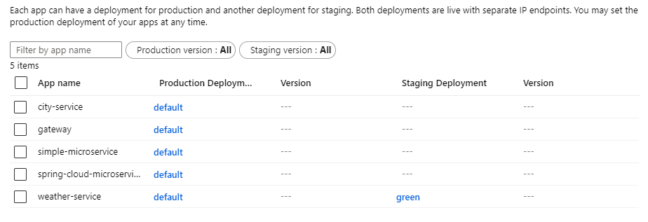
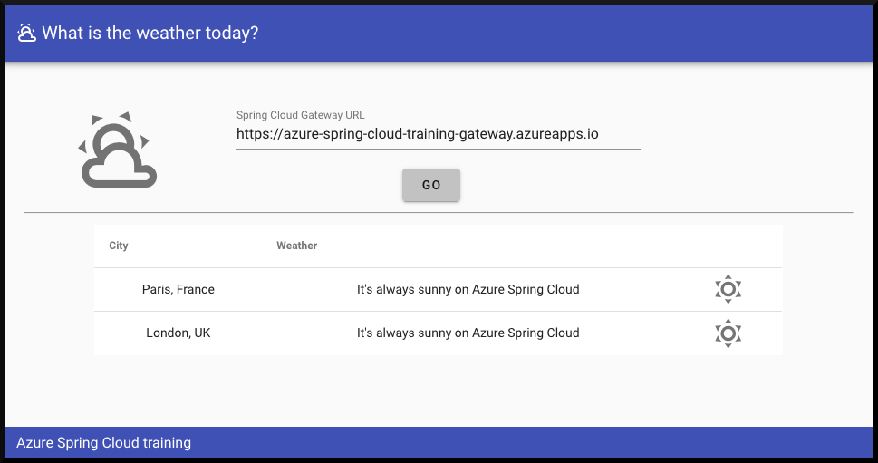

# 10 - 蓝/绿部署

**本教程是[Azure Spring Cloud 培训](../README.md)系列之一**


蓝绿部署模式允许您在生产基础设施上测试最新的应用程序更改，但在测试完成之前不会向最终用户暴露这些更改。在本节中，我们将与 Azure CLI 一起执行蓝绿部署。虽然我们将手动完成部署步骤，但我们也可以使用 Azure CLI 命令在 CI/CD Pipeline中实现自动化。

---

我们将部署新版本的"weather-service"微服务，这是基于之前的实验[07 - 使用 MySQL 构建Spring Boot微服务](../07-build-a-spring-boot-microservice-using-mysql/README.md).

我们在本教程中开发的微服务[可参考这里](weather-service/)，这是基于之前开发的一个稍作修改的服务版本。

## 修改当前应用程序

在"weather-service"应用程序中，提交当前代码并切换到新的分支，来进行修改。

打开`WeatherController`类和修改其`getWeatherForCity()`方法，让它总是返回阳光明媚的天气（这样我们在前端更容易的看到版本变更是否生效）：

```java
package com.example.demo;

import org.springframework.stereotype.Controller;
import org.springframework.web.bind.annotation.*;

@Controller
@RequestMapping(path="/weather")
public class WeatherController {

    private final WeatherRepository weatherRepository;

    public WeatherController(WeatherRepository weatherRepository) {
        this.weatherRepository = weatherRepository;
    }

    @GetMapping("/city")
    public @ResponseBody Weather getWeatherForCity(@RequestParam("name") String cityName) {
        return weatherRepository.findById(cityName).map(weather -> {
            weather.setDescription("It's always sunny on Azure Spring Cloud");
            weather.setIcon("weather-sunny");
            return weather;
        }).get();
    }
}
```

## 将新应用程序部署到新的"绿色"部署

构建应用程序的新版本并将其部署到新版本`deployment`叫`green`:

```bash
cd weather-service
./mvnw clean package -DskipTests
az spring-cloud app deployment create --name green --app weather-service --jar-path target/demo-0.0.1-SNAPSHOT.jar
cd ..
```

一旦应用程序部署成功，如果你去<https://spring-training.azureedge.net/>您仍将看到的是修改之前的版本，因为新版本的微服务现在处于暂存(Stage)区域，尚未在生产中。

导航到Azure Spring Cloud实例[Azure门户网站](https://portal.azure.com/?WT.mc_id=azurespringcloud-github-judubois)然后单击"部署"（在"设置"下）。现在，您应该在"阶段部署"列中看到"绿色"部署：



您可以测试`green`, 通过调用与第7节相同的URL，但需要替换部署名称`default`为`green`:

```bash
curl https://***.test.azuremicroservices.io/weather-service/green/weather/city?name=Paris%2C%20France
```

您应该看到最近修改的结果：

```json
{"city":"Paris, France","description":"It's always sunny on Azure Spring Cloud","icon":"weather-sunny"}
```

注意：我们不会通过`gateway`来调用。绿色部署的目的是在将正式生产流量路由到微型服务之前，对微服务的更改进行测试。因此，如果您通过公共网关网址访问`weather-service`，正如您在第 8 节所做的那样，您将被路由到服务的原始版本。

把这个`green`部署到生产中，您可以使用命令行：

```bash
az spring-cloud app set-deployment -n weather-service --deployment green
```

另一种解决方案是使用[Azure门户网站](https://portal.azure.com/):

-   查找您的Azure Spring Cloud实例
-   单击"部署"菜单
-   选择`weather-service`应用程序并单击"设置部署"

> 如果您想重复使用部署名称，请首先删除该名称下以前的部署：
>
> ```bash
> az spring-cloud app deployment delete --name green --app weather-service
> ```

一旦您交换了部署，就会看到`green`是激活的，您需要等待几秒钟, 让`gateway`应用从 Spring Cloud Service Registry 同步和使用这个新版本。之后，您将能够看到新的修改数据：



---

⬅️上一个教程：[09 - 综上所述，一个完整的微服务堆栈](../09-putting-it-all-together-a-complete-microservice-stack/README.md)

➡️下一个教程：[11 - 配置 CI/CD](../11-configure-ci-cd/README.md)
