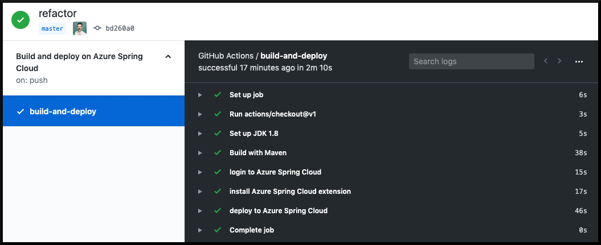

# 11 - 配置 CI/CD

**本教程是[Azure Spring Cloud 培训](../README.md)系列之一**


在本节中，我们将使用 GitHub  Action对 Azure Spring Cloud实施持续部署。为了简化，我们不会在本节中实施蓝绿部署，但在完成教程后，您也就知道如何实现自动蓝绿部署了。

---

我们的微服务和网关很容易手动部署，但当然最好实现所有这些任务的自动化！我们将使用[Github Action](https://github.com/features/actions)作为一个持续集成/持续部署平台（简称CI/CD）。这种配置相当简单，因此将其移植到另一个 CI/CD 平台也应该很轻易了。

我们将自动化部署`weather-service`，这是在之前实现的 - [07 - 使用 MySQL 构建Spring Boot微服务](../07-build-a-spring-boot-microservice-using-mysql/README.md). 其他的 `city-service`微服务和Gateway网关也是完全一样的配置步骤，所以你只需重复复制/粘贴这教程的脚本即可。

## 配置Github

[创建新的 GitHub 存储库](https://github.com/new)并从`weather-service`微服务提交代码到该存储库：

> 🛑确保您替换 Git URL 为自己的 github 存储库（确保您使用 HTTPS URL，而不是 SSH URL）。这应该是一个跟您在第 4 节配置的存储库不同的。如果弹出登录对话，请使用常规 GitHub 凭据来登录。

```bash
cd weather-service
git init
git add .
git commit -m 'Initial commit'
git remote add origin <GIT HTTPS URL HERE>
git push origin master
cd ..
```

您现在需要允许从 GitHub Workflow访问您的 Azure Spring Cloud实例。打开终端并键入以下命令，替换`$AZ_RESOURCE_GROUP`与您的资源组的名称。

🛑确保将资源组的名称分配给变量`AZ_RESOURCE_GROUP`或在下面的命令中替换其值。

```bash
# Prevents a Git bash issue. Not necessary outside of Windows:
export MSYS_NO_PATHCONV=1

# Get the ARM resource ID of the resource group
RESOURCE_ID=$(az group show --name "$AZ_RESOURCE_GROUP" --query id -o tsv)

# Create a service principal with a Contributor role to the resource group.
SPNAME="sp-$(az spring-cloud list --query '[].name' -o tsv)"
az ad sp create-for-rbac --name "${SPNAME}" --role contributor --scopes "$RESOURCE_ID" --sdk-auth -o json
```

这应该输出一个JSON文本，你需要复制保留下来。

然后，在 GitHub 项目中，选择`Settings > Secrets`并添加一个新的秘密称为`AZURE_CREDENTIALS`.粘贴你刚刚复制到那个Secrect的JSON文本。

## 创建一个Github Action

在`weather-service`目录，创建一个新的目录称为`.github/workflows`并在里面添加一个yml文件`azure-spring-cloud.yml`。此文件是 GitHub Workflow，将使用我们上面刚刚配置的Secrect将应用程序部署到您的 Azure Spring Cloud实例。

在该文件中，复制/粘贴以下内容，并按提示替换内容：

> 🛑在下面的yaml, 您必须将Azure Spring Cloud实例的名称和资源组的名称替换为`<AZ_SPRING_CLOUD_NAME>`，`<AZ_RESOURCE_GROUP>`。

```yaml
name: Build and deploy to Azure Spring Cloud

on: [push]

jobs:
  build-and-deploy:
    runs-on: ubuntu-latest
    steps:
    - uses: actions/checkout@v2
    - name: Set up JDK 1.8
      uses: actions/setup-java@v1
      with:
        java-version: 1.8
    - name: Build with Maven
      run: mvn package -DskipTests
    - name: Login to Azure Spring Cloud
      uses: azure/login@v1
      with:
        creds: ${{ secrets.AZURE_CREDENTIALS }}
    - name: Install Azure Spring Cloud extension
      run: az extension add -y --name spring-cloud
    - name: Deploy to Azure Spring Cloud
      run: az spring-cloud app deploy --resource-group <AZ_RESOURCE_GROUP> --service <AZ_SPRING_CLOUD_NAME> --name weather-service --jar-path target/demo-0.0.1-SNAPSHOT.jar
```

此Workflow有以下几点：

-   设置了JDK
-   使用 Maven 编译和打包应用程序
-   使用我们刚刚配置的凭据验证到Azure Spring Cloud
-   将 Azure Spring Cloud扩展添加到 Azure CLI（此步骤应在服务最终发布时可略去）
-   它将应用程序部署到您的 Azure Spring Cloud实例

当代码被Push到存储库时，此Workflow被配置为触发。
还有很多其他[触发 GitHub  Action的事件](https://help.github.com/en/articles/events-that-trigger-workflows).例如，每次在项目上创建新标签时，也可以触发自动部署。

## 测试Github Action

您现在可以Commit 并 Push 我们刚刚创建的文件 `azure-spring-cloud.yml`。

去您的 GitHub 项目`Actions`选项卡，您应该会看到您的项目是自动构建并部署到您的 Azure Spring Cloud实例：



恭喜！现在每次你`git push`您的代码后，您的微服务将自动部署到生产环境了。

---

⬅️上一个教程：[10 - 蓝/绿部署](../10-blue-green-deployment/README.md)

➡️下一个教程：[12 - 微服务间的相互调用](../12-making-microservices-talk-to-each-other/README.md)
