

# 使用Azure Boards进行敏捷规划和项目组合管理

> 更多Lab可以参考 https://aka.ms/devopslabs

*    
[主页](https://azuredevopslabs.com//default.html)/使用Azure Boards进行敏捷规划和项目组合管理

在本实验中，您将学习AzureBoards提供的敏捷计划和项目组合管理工具和流程，以及它们如何帮助您快速规划，管理和跟踪整个team的工作。您将探索产品backlog，sprintbacklog和任务板，它们可用于跟踪Iterations过程中的工作流程。我们还将研究此版本中工具的增强功能，以适应更大的team和组织。

是否需要其他学习？在Microsoft Learn上查看[**针对软件开发**](https://docs.microsoft.com/en-us/learn/modules/choose-an-agile-approach/)的 [**敏捷方法**](https://docs.microsoft.com/en-us/learn/modules/choose-an-agile-approach/)模块。

*   本实验要求您先完成<a href="../prereq/">先决条件</a>说明中任务1 。（此练习无需克隆，请跳过先决条件中的任务2）
  

### 任务1：创建及使用teams, areas, and iterations

1.  导航到Azure DevOps上的Parts Unlimited项目。它将类似于[https://dev.azure.com/YOURACCOUNT/Parts%20Unlimited](https://dev.azure.com/YOURACCOUNT/Parts%20Unlimited)。
    
2.  使用页面左下方的**Project settings**导航打开设置页面。
    
    
    
3.  选择**Teams**选项卡。此项目中已经有几个team，但是您将为此实验创建一个新的team。点击**New team**。
    
    
    
4.  使用 **“ PUL-Web”**作为 **Team name**，其他保留默认值，然后单击**Create team** 。
    
    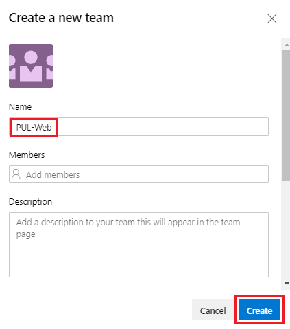
    
5.  选择新创建的team以查看其详细信息。
    
    
    
6.  默认情况下，新team只有您一个成员。您可以使用此视图来管理成员资格，通知，仪表板等。但是首先，您将需要定义team的日程安排和范围。单击**Iterations and area Paths**。
    
    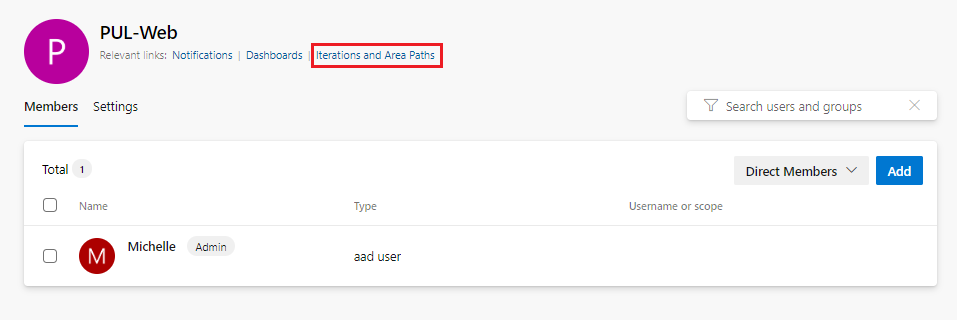
    
7.  选择**Iterations**选项卡，然后单**Select Iteration**。该team将使用与其他team相同的Iterations计划，但是如果这对您的组织更好，您可以采用其他方法。
    
    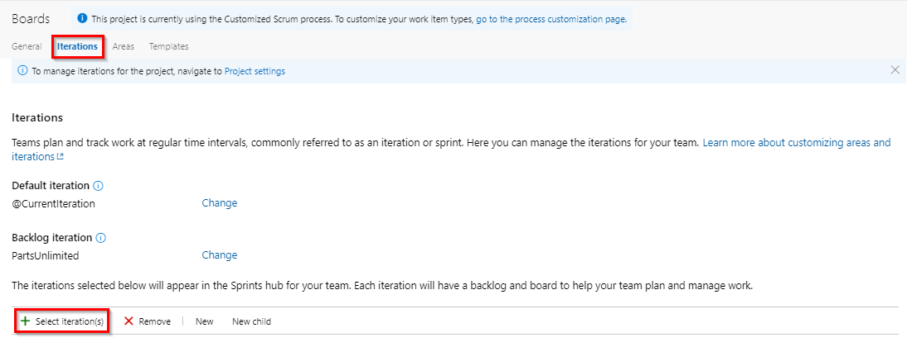
    
8.  选择**Parts Unlimited\Sprint 1**，然后单击**Save and close**。请注意，第一个sprint已经通过。这是因为演示数据生成器旨在构建项目历史记录，以使该sprint发生在过去。
    
    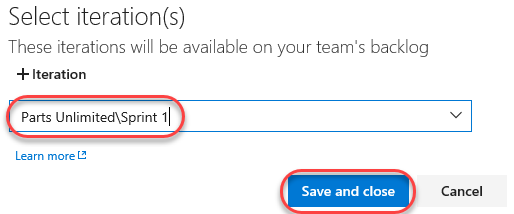
    
9.  重复此过程以添加**Sprint 2**和**Sprint 3**（如上一步所述添加它们）。第二个sprint是我们当前的Iterations，第三个sprint是在不久的将来。
    
    

    
10.  选择**Areas**选项卡。默认情况下，存在与team名称匹配的Area。
    
   
    
11.  从area下拉列表中，选择**Include sub areas**。所有team的默认设置是排除sub areas路径。我们将对其进行更改以包括sub areas，以便team可以看到所有team的所有work items。可选地，管理team还可以选择不包括子area，从而在将work items分配给team之后立即将其从其视图中删除。
    
   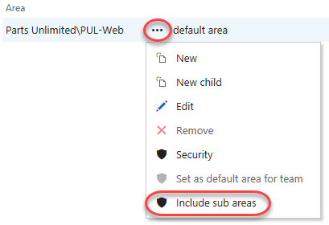
    

### Task 2: 创建及使用work items-work items ###

work items在Azure DevOps中扮演着重要角色。无论是描述要完成的工作，版本发布，测试定义还是其他关键项，work items都是现代项目的主力军。在此任务中，您将集中于使用各种work items来设置计划，以扩展带有产品培训部分的Parts Unlimited网站。虽然要扩大公司产品，如此重要的部分可能会令人生畏，但Azure DevOps和Scrum流程使其非常易于管理。

该任务旨在说明您可以使用多种方式创建不同类型的work items，并演示平台上可用功能的广泛性。因此，这些步骤不应被视为项目管理的规定性指导。这些功能旨在具有足够的灵活性以适合您的过程需求，因此您可以随时进行探索和试验。

1.  导航到**Overview \| Dashboards**。
    
    
    
2.  选择**Parts Unlimited Team**的 **Overview** 仪表板。
    
    
    
3.  在Azure DevOps中创建work items的方法有很多，我们将探讨其中的一些方法，在Dashboards的右下角可以发现**New Work Item** 表单，键入** Product training **，然后选择**Epic**类型。点击**Create**。
    
     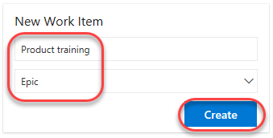
    
4.  将新work items分配给您自己，然后将**Areas**设置为**Parts Unlimited \\ PUL-Web**。将“**Iterations”**设置为**Parts Unlimited\Sprint 2** ，然后单击**Save & Close**。通常，您希望填写尽可能多的信息，但是出于本实验的目的，您可以在此处精益求精。
    
    
    
5.  导航到**Boards \| Work Items**。
    
    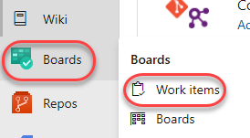
    
6.  找到为**Product training**新创建的epic，然后将其打开。
    
    
    
7.  work items表单包含您可能想要了解的有关work items的所有信息。这包括有关分配给谁的详细信息，其在许多参数中的状态以及自创建以来如何处理的所有相关信息和历史记录。**Related Work**是重点关注的领域之一。向此epic中添加功能的方法之一是选择**Add link \| New item**。
    
    
    
8.  将**work items类型**设置为**Feature**，并将**Title** 设置为**Training dashboard**。单击**OK**。
    
    
    
9.  该**Assignment**，**Area**和**Iteration**应该已经设置为与epic相同，甚至被链接到创建它的父项。点击**保存并关闭**。
    
    
    
10.  导航到 **Boards**视图。
    
   
    
11.  选择**PUL-Web Boards**。这将为该特定team打开Boards。
    
   
    
12.  将Boards从显示**Backlog**切换为显示**Features**。这将很容易的添加Task和其他work items到Features。
    
   
    
13.  从**Training dashboard**下拉列表中，选择**Add Product Backlog Item** 。
    
   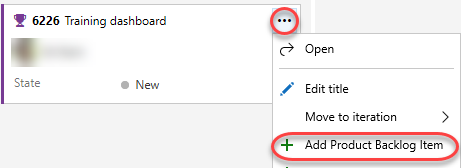
    
14.  将第一个backlog项目命名为**As a customer, I want to view new tutorials**，然后按**Enter键**保存。这将创建一个新的**Product Backlog Item**（PBI）work items，该work items是feature 的子项，并共享其area和Iterations。
    
   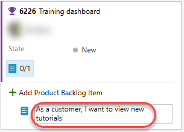
    
15.  添加另外两个PBI，这些PBI旨在使客户能够查看他们最近查看的教程并请求新的教程。
    
   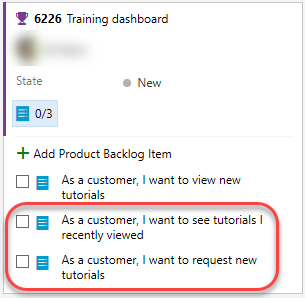
    
16.  将任务板视图切换回**Backlog items**。
    
   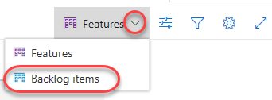
    
17.  待办事项（Backlog items）的状态定义了相关事项完成情况的状态。尽管您可以使用该表单打开和编辑work items，但将卡拖到板上更容易。将第一个work items拖到**Approved**。
    
   
    
18.  您还可以展开work items卡，以方便地进行可编辑的详细信息。
    
   
    
19.  将移动的PBI分配给您自己。
    
   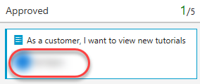
    
20.  将第二个work items目拖到**Committed**阶段。
    
   
    
21.  将最后一个PBI拖到**Done**阶段。
    
   
    
22.  任务板(task board)是backlog的一个视图。通过单击**View as Backlog** 来查看表格形式。
    
   
    
23.  单击**Expand**按钮，它使您可以查看这些work items下的嵌套任务。创建work items的另一种简单方法是使用待办事项列表上的**Add**按钮。单击它可将新任务添加到第一个backlog项目。
    
   
    
24.  将**Title**设置为**Add page for most recent tutorials**。将**Remaining Work**设置为**5**，将**Activity**为**Development**。点击**Save & Close**。
    
   
    
25.  添加另一个任务：**Optimize data query for most recent tutorials**。将其**Remaining Work**设置为**3**，将其**Activity**为**Design**。点击**Save & Close**。
    
   
    

### 任务3：管理sprint和容量

您的team通常在sprint的第一天举行的sprint计划会议期间建立sprint backlog。每个sprint对应一个有时间限制的间隔，该间隔支持您的team使用敏捷流程和工具进行工作的能力。在计划会议期间，您的产品负责人与您的team一起确定哪些故事或待办事项以在sprint中完成。

计划会议通常包括两个部分。在第一部分中，team和产品所有者根据以前的sprint经验，确定team认为可以在sprint中完成的backlog项目。这些项目将添加到sprint待办事项列表中。在第二部分中，您的team确定如何开发和测试每个项目。然后，他们定义并估计完成每个项目所需的任务。最后，您的team承诺根据这些估计来实施部分或全部项目。

1.  您的sprint待办事项应包含您的team在分配的时间内成功计划和完成工作所需的所有信息，从而避免在该阶段最有一刻才尽力去做。在开始计划sprint之前，您将需要创建，确定优先级并估算backlog并定义sprint。使用导航栏导航到**Sprints**视图。
    
    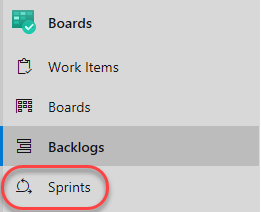
    
2.  从**View options**下拉列表中，选择**Work details**面板选项。
    
    
    
3.  当前的sprint范围非常有限。**To do**阶段有两个任务，需要进行8个小时的估计工作。此时，尚未分配任何任务。
    
    
    
4.  将**Add page**任务分配给自己。请注意，这将更新容量视图。
    
    
    
5.  选择**Capacity**选项卡。通过此视图，您可以定义用户可以执行的活动以及达到的容量级别。在这种情况下，将您的容量设置为每天允许**1**小时的**Development**。请注意，您可以为每个用户添加其他活动，以防他们做的事不只是开发。
    
    
    
6.  但是，假设您要去度假。点击**Days off**下的**0 days**。
    
    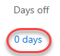
    
7.  将您的假期设置为在当前sprint期间（不用按照以下截图的时间，请按照你做这个实验接下来的几周内）跨越五个工作日。单击**OK**。
    
    
    
8.  点击**Save**。
    
    
    
9.  返回**Taskboard**。
    
    
    
10.  请注意，容量视图（ capacity view）已更新以反映您的可用宽度。这个确切的数字可能会有所不同，但是对于此处的屏幕快照，sprint容量为11小时（11个工作日内每天1小时）。
    
   
    
11.  看板（Boards）的一项便利功能是您可以轻松地在线更新关键数据。定期更新**Remaining Work**估算值是一个好习惯，以反映每个任务的预期时间。假设您已经查看了**Add page**任务的工作，发现实际上所需的时间比最初预期的要长。将其设置为该sprint的总容量。
    
   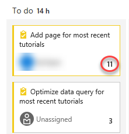
    
12.  请注意，这是如何最大程度地扩展**Development**和您的个人能力的。由于它们足够大以覆盖分配的任务，因此它们保持绿色。但是，由于其他任务需要额外的3个小时，因此超出了**Teams**的整体能力。
    
   
    
13.  解决此容量问题的一种方法是将任务移至将来的Iterations。有几种方法可以完成此操作。首先，您可以在此处打开任务并在对话框中对其进行编辑。另一方面，**Backlog**视图提供了一个**嵌入式**菜单选项来移动它。现在不要移动它。
    
   
    
14.  返回到**Taskboard**视图。
    
   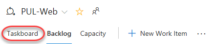
    
15.  从**View options**下拉菜单中选择**People**。
    
   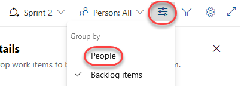
    
16.  这将调整您的视图，以便您可以按人（而不是按backlog项目）查看任务的进度。
    
   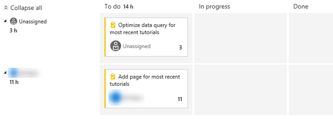
    
17.  还有很多可用的自定义。单击**Configure team settings**按钮。
    
   
    
18.  在**Styles**选项卡上，单击**Add Styling rule**，然后将**Name**设置为**Development**。选择绿色**Card color**。如果符合以下规则标准，这会将所有卡涂成绿色。
    
   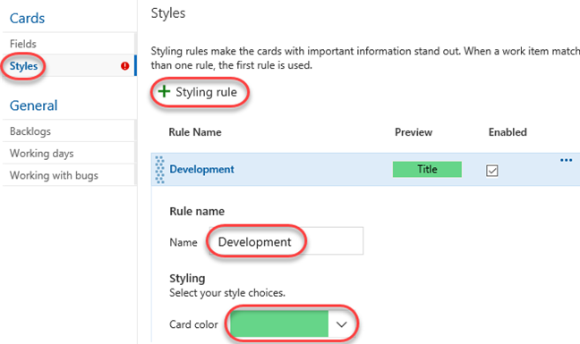
    
19.  为**Activity = Development**添加规则。这会将分配给**Development**activit的所有卡设置为绿色。
    
   
    
20.  **Backlogs**选项卡允许您设置可用于导航的级别。默认情况下不包含epic，但您可以在此处进行更改。
    
   
    
21.  您还可以指定team遵循的**Working days**。这适用于capacity和burndown计算。
    
   
    
22.  **Working with bugs**选项卡允许您指定bug在Boards看板上的呈现方式。
    
   
    
23.  单击**Save and close**以保存样式规则。
    
   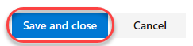
    
24.  与**Development**相关的任务现在是绿色的，非常容易识别。
    
   
### 任务4：客户化看板（Kanban boards）

为了最大限度地提高团队持续交付高质量软件的能力，看板强调了两个主要实践。首先，可视化工作流程，要求您映射团队的工作流阶段，并配置看板以匹配。第二，约束正在进行工作的数量，要求您设置正在工作数量（work-in-progress简称WIP）限制。然后，您就可以在看板上跟踪进度，并监控关键指标，以减少提前期或周期时间。看板将您的backlog（待办事项）变成一个交互式的招牌板，提供一个可视化的工作流程。随着工作从构思到完成的进行，你会更新黑板上的项目。每一列代表一个工作阶段，每一张卡片代表一个用户故事（蓝牌）或一个bug（红牌）。但是，每个团队都会随着时间的推移开发自己的流程，因此定制Kanban Board以匹配团队工作方式的能力至关重要。
1.  导航到**Boards**。
    
    
    
2.  单击**Configure team settings**按钮。
    
    
    
3.  team正在强调处理数据的工作，因此，与访问或存储数据相关的任何任务都应特别注意。选择**Tag colors**标签。点击**Add tag color**输入标签**data**。每当backlog的项目或错误用**data**标记时，该标记将突出显示。
    
    
    
4.  您还可以指定要在卡片上包含的**Annotations**，以使其更易于阅读和浏览。启用注释后，可以通过单击每个卡上的可视化文件轻松访问该类型的子work items。
    
    
    
5.  **Tests**选项卡使您可以配置测试在卡上的显示方式和行为。
    
    
    
6.  单击**Save and close**。
    
    
    
7.  打开**view new tutorials**backlog项。
    
    
    
8.  为**data**和**ux**添加标签。点击**Save & Close**。
    
    
    
9.  请注意，这两个标签现在在卡上可见，尽管**数据**标签在配置时突出显示为黄色。
    
    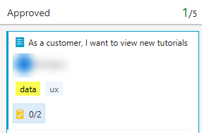
    
10.  单击**Configure team settings**按钮。
    
   
    
11.  选择**Columns**选项卡。本部分允许您向工作流程添加新的阶段。单击**Add Column**然后将**Name**设置为**QA Approved**。将在*WIP limit**设置为**1**，这表示在此阶段一次只能有一个work items目。通常，您可以将其设置得更高一些，但是这里只有两个work items来演示该功能。移动舞台，使其发生在**Committed**和**Done**之间。
    
   
    
12.  单击**Save and close**。
    
   
    
13.  现在，您将在工作流程中看到新的阶段。
    
   
    
14.  将work items从**Committed**和**Done**移到**QA Approved**。
    
   
    
15.  现在，该载物台超出了其在**WIP**限制，并以红色显示为警告。
    
   
    
16.  将**recently viewed**backlog项目移回**Committed**。
    
   
    
17.  单击**Configure team settings**按钮。
    
   
    
18.  返回到**Columns**选项卡，然后选择**QA Approved**。在将工作移入列与开始工作之间通常存在滞后。为了克服这种滞后并显示实际的工作状态，您可以打开拆分列。拆分时，每列包含两个子列：**Doing**和**Done**。拆分列使您的team可以实现拉模型。如果没有拆分列，team将向前推进工作，以表明他们已经完成了工作阶段。但是，将其推进到下一个阶段并不一定意味着team成员立即开始对该项目进行工作。选中将**Split column into doing and done**来为此创建两个单独的列。
    
   
    
19.  当您的team更新从一个阶段到下一个阶段的工作状态时，这有助于他们就**完成（Done）**达成共识。通过为每个看板列指定**Definition of done**，可以帮助您共享将项目移至下游阶段之前需要完成的基本任务。添加使用markdown**完成**的**定义**，例如**Passes all tests**。单击**Save and close**。
    
   
    
20.  请注意**QA Approved**阶段现在具有**Doing**和**Done**列。
    
   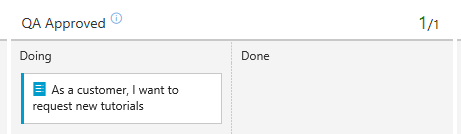
    
21.  您也可以单击列标题旁边的图标以阅读**Definition of done**。
    
   
    
22.  单击**Configure team settings**按钮。
    
   
    
23.  您的看板支持您可视化从新到完成的工作流程的能力。添加**swimlanes**，还可以可视化支持不同服务级别类的工作状态。您可以创建swimlanes泳道来表示支持您的跟踪需求的任何其他维度。在**Swimlanes**选项卡上，单击**添加Swimlane**然后**Name**设置为**Expedite**。单击**Save and close**。
    
   
    
24.  将**Committed**work items拖放**QA Approved | Doing** , 这样做是为了在QA带宽(bandwidth)可用时将其识别为优先事项。
    
   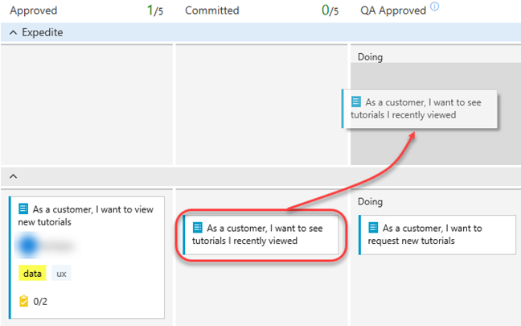
    
25.  如果您想查看具有更多work items目的更复杂的电路板，请从team下拉列表中选择**Parts Unlimited Team**。
    
   
    
26.  该板为您提供了一个试验和查看结果的场所。
    
   
    

### 任务5: 定义Dashboards
1.  选择**Overview | Dashboards**。
    
    
    
2.  从仪表板Dashboards下拉菜单中，选择**Parts Unlimited Team Overview**。仪表板使team可以可视化状态并监视整个项目的进度。看到的信息一目了然，您可以做出明智的决定，而不必深入到team项目站点的其他部分。“Overview”页面提供对默认team仪表板的访问，您可以通过添加，删除或重新排列widget磁贴来对其进行自定义。每个图块都对应一个小部件，该小部件可提供对一个或多个特征或功能的访问。
    
    
    
3.  在信息中心下拉菜单中，选择**New dashboard**。
    
    
    
4.  将**Nmae**设置为**Product training**，然后team下拉菜单选择**PUL-Web**。点击**Create**。
    
    
    
5.  单击**Add a widget**。
    
    
    
6.  在**Add Widget**面板中，搜索**sprint**以查找专注于**sprint的**现有widget。选择**Sprint Overview**，然后单击**Add**。
    
    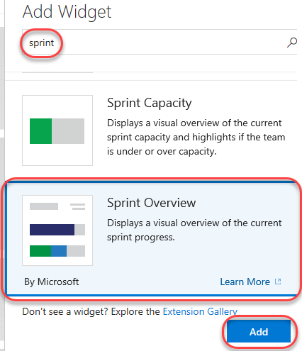
    
7.  许多小部件都有您可以配置的选项。单击**Settings**按钮。
    
    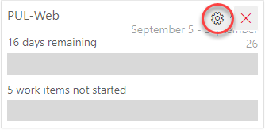
    
8.  设置的数量和深度将因小部件而异。单击**Close**以关闭。
    
    
    
9.  再次在小部件中搜索**sprint**然后添加**Sprint Capacity**小部件(widget)。
    
    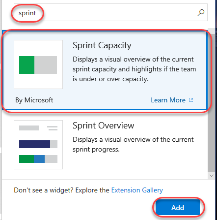
    
10.  单击**Done Editing**。
    
   
    
11.  现在，您可以在自定义仪表板上查看当前sprint的两个重要方面。
    
   
    
12.  自定义仪表板的另一种方法是基于work items查询生成图表，您可以将其共享到仪表板。选择**Boards | Queries**。
    
   
    
13.  点击**New query**。
    
   
    
14.  将第一项设置为**Work Item Type = Task**，将第二项设置为**Area Path = Parts Unlimited\PUL-Web**。
    
   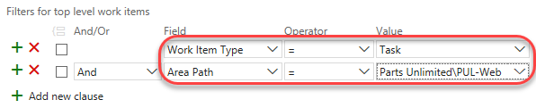
    
15.  点击**Save query**。
    
   
    
16.  将**Name**设置为**Web tasks**，将**Folder**设为**Shared Queries**。单击**OK**。
    
   
    
17.  选择**Charts**选项卡，然后单击**New chart**。
    
   
    
18.  点击**New chart**。
    
   
    
19.  将图表的**Name**设置为**Web tasks - By assignment**，将**Group by**设置为**Assigned To**。单击**OK**保存。
    
   
    
20.  您现在可以将此图表添加到仪表板。
    
   
    
### 任务6: 客户化 team流程
在Azure DevOps中，您可以通过流程自定义工作跟踪体验。流程定义了work items跟踪系统以及您通过Azure DevOps访问的其他子系统的构建块。每当您创建team项目时，都将选择包含项目所需构建基块的过程。

Azure DevOps支持两种流程类型。首先，核心系统流程（Scrum，Agile和CMMI系统进程）被锁定。您无法自定义这些过程。第二种类型，即继承的流程，是从核心系统流程创建的。您可以自定义这些流程。

此外，所有进程都是共享的。也就是说，一个或多个team项目可以引用一个流程。您可以自定义流程，而不是自定义单个team项目。对流程所做的更改会自动更新所有引用该流程的team项目。

创建继承的流程后，您可以对其进行自定义，基于该流程创建team项目，并迁移现有的team项目以对其进行引用。在将Gitteam项目迁移到继承的流程之前，无法对其进行自定义。

在此任务中，我们将创建一个继承自Scrum的新流程。我们将要做的一项更改是添加一个backlog项目字段，该字段旨在跟踪专有的PartsUnlimited Ticket ID。

1.  单击左上角的**Azure DevOps**徽标导航到帐户根目录。
    
    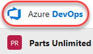
    
2.  在左下角，点击**Organization settings**。
    
    
    
3.  选择**Boards**下的**Process**。
    
    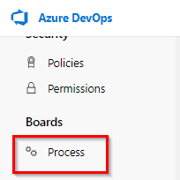
    
4.  从**Scrum**下拉列表中，选择**Create inherited process**。
    
    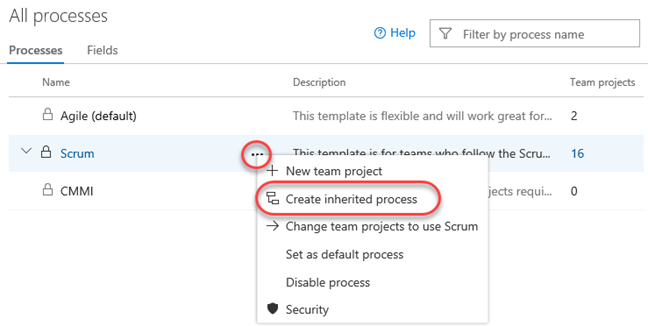
    
5.  将继承的进程的名称设置为**Customized Scrum**，然后单击**Create process**。
    
    
    
6.  打开**Customized Scrum**。您可能需要刷新浏览器才能看到它。
    
    
    
7.  选择**Product Backlog Item**。
    
    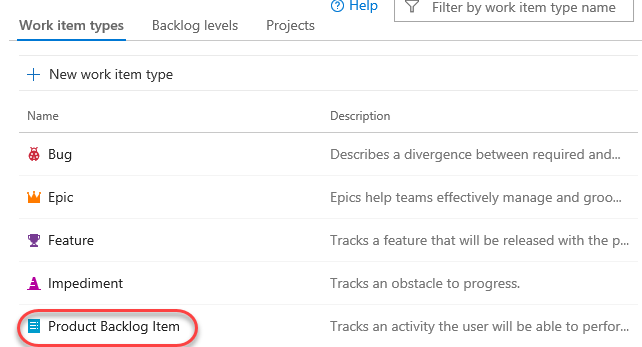
    
8.  单击**New field**。
    
    
    
9.  将字段的**Name**设置为**PUL Ticket ID**。
    
    
    
10.  在**Layout**选项卡上，将**Label**设置为**Ticket ID**。同时为**Create a new group** 创建一个新组**PartsUnlimited**，然后单击**Add field**。
    
   
    
11.  现在已经配置了自定义流程，让我们切换Parts Unlimited项目以使用它。使用上部导航栏返回到**All processes**根目录。
    
   
    
12.  我们的项目当前使用**Scrum**，因此请选择该过程。
    
   
    
13.  切换到**Projects**选项卡。
    
   
    
14.  从**Parts Unlimited**的下拉菜单中。选择**Change process**。
    
   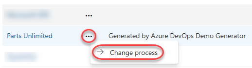
    
15.  选择**Customized Scrum**过程，然后单击**Save**。
    
   
    
16.  使用徽标链接返回到帐户仪表板。
    
   
    
17.  打开**Parts Unlimited**门户。
    
   
    
18.  选择**Boards | Work Items**。
    
   
    
19.  打开第一个backlog项目。
    
   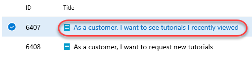
    
20.  现在，您将在流程定制过程中定义的**PartsUnlimited**组下看到**Ticket ID**字段。您可以像对待其他任何文本字段一样对待它。
    
   
    
21.  保存work items后，Azure DevOps还将保存新的自定义信息，以便可用于查询以及其余的Azure DevOps。
    

您可以观看以下视频，引导您完成本实验中介绍的所有步骤

<figure class="video_container">
  <iframe width="560" height="315" src="https://www.youtube.com/embed/WWUf5OWeBD0" frameborder="0" allowfullscreen="true"> </iframe>
</figure>

