---
标题：通过Azure Pipelines拥抱持续交付
布局：页面
侧边栏：vsts
固定链接：/ labs / azuredevops / continuousdeployment /
文件夹：/ labs / azuredevops / continuousdeployment /
版本：实验室版本-1.38.0
已更新：最近更新-2020年10月11日
redirect_from：“ / labs / vsts / continuousdeployment / index.htm”
---

 </ div>
<aname="概述"></a>

＃＃ 概述 ＃＃

在本实验中，您将了解Azure Pipelines中可用的版本管理功能，这些功能可自动部署应用程序。这些功能可帮助开发和运营团队与Azure DevOps Server集成，以配置和自动化其自动生成的复杂部署，从而更轻松地定位到目标阶段。开发团队还可以对发布流程进行建模，并跟踪批准，签署和可视化发布状态。

 是否需要其他学习？在<a href="https://docs.microsoft.com/zh-cn/learn/modules/create-release-pipeline/" target="_blank"> <b> <u>中创建发布管道Microsoft Learn上的Azure Pipelines </ u> </ b> </a>模块。</ div>

###先决条件###

-一个Azure帐户（可从[https://azure.com/free](https://azure.com/free）免费获得）。

-按照<a href="../prereq/">先决条件</a>说明完成任务1。

##练习1：使用Azure DevOps拥抱持续交付##

###任务1：设置Azure资源###

1.首先创建此练习所需的Azure资源。其中包括一个数据库和两个应用程序服务：一个用于质量检查，另一个用于生产。通过[https://portal.azure.com]（https://portal.azure.com/）登录到您的帐户。

1.单击**创建资源**并搜索**“ sql” **。

    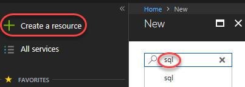
 
1.选择“ SQL数据库”。

    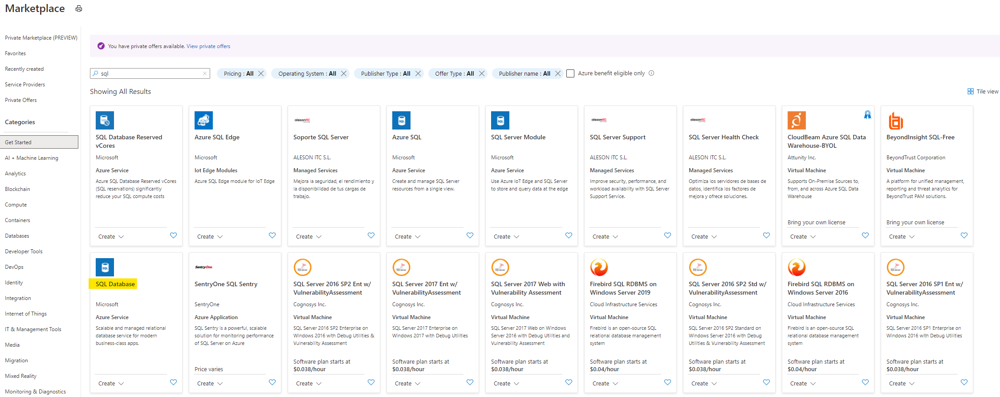

1.单击**创建**。

1.在“资源组”下，单击“新建”。

    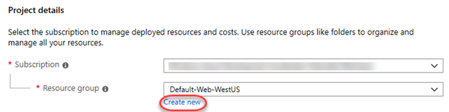

1.输入“ partsunlimited” **的“名称”，然后单击“确定”。

    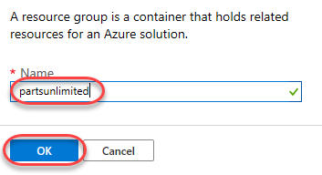

1.输入“ partsunlimited” **的“数据库名称” **，然后单击“ Create new”以创建新服务器。

    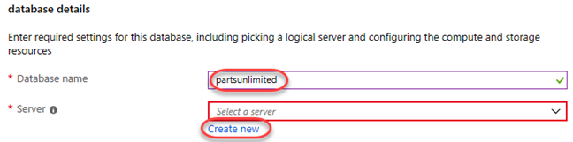

1.为“服务器名称”输入唯一的名称，例如输入您的名称。输入您可以记住的管理员用户名和密码。请注意，**“ P2ssw0rd” **符合密码要求。单击“确定”以确认这些选项。

    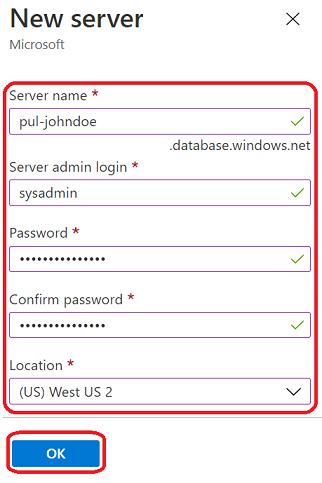

1.在“计算+存储”中，选择“配置数据库”。单击**查找基本，标准和高级？**，保留标准的默认值，然后单击**应用**。

    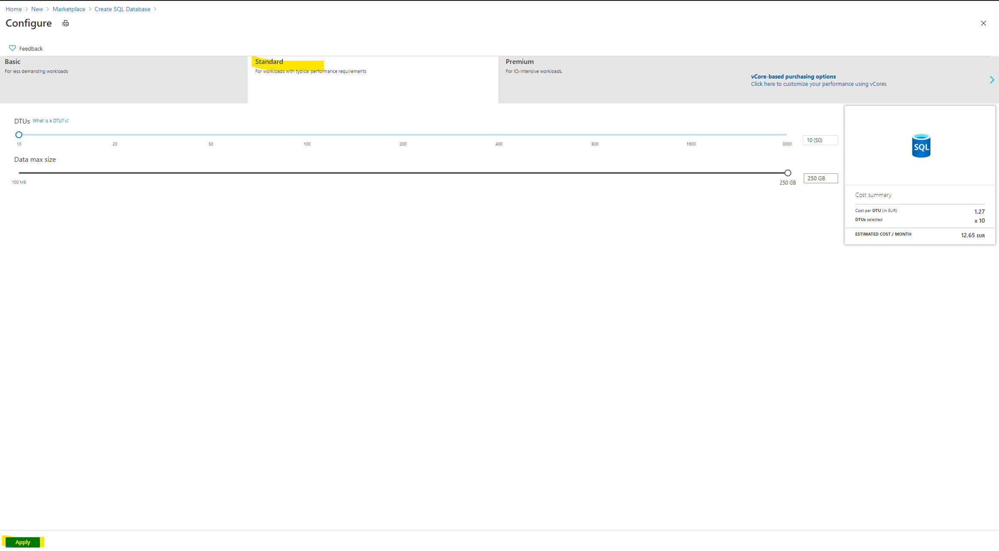

1.点击“查看+创建”。

    

1.单击**创建**。这需要一些时间才能完成，但是当它在后台运行时，您可以继续进行下一步。

    

1.单击**创建资源**并搜索**“网络” **。

    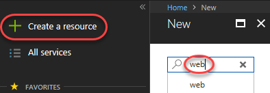

1.选择“ Web App”模板。

    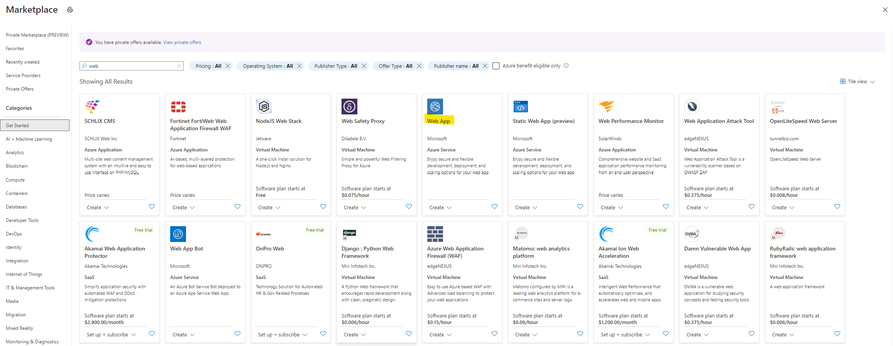

1.单击**创建**。

1.在“项目详细信息”下，选择用于数据库的相同“订阅”和“资源组”。

    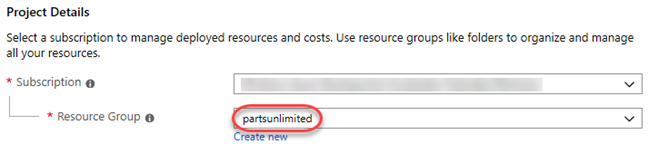

1.对于“名称”，输入一个唯一的名称，例如使用您的名称作为一部分。由于这将用于我们的质量检查部署，因此请在名称后加上**“-qa” **。选择** ASP.NET 4.8运行时堆栈**。

    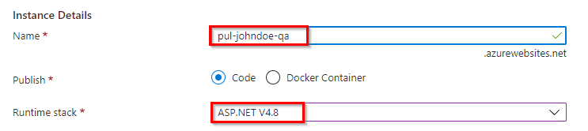

1.在“应用服务计划”上，选择“新建”，并将其命名为“计划”。将尺寸更改为** S1 **（在生产中）。

    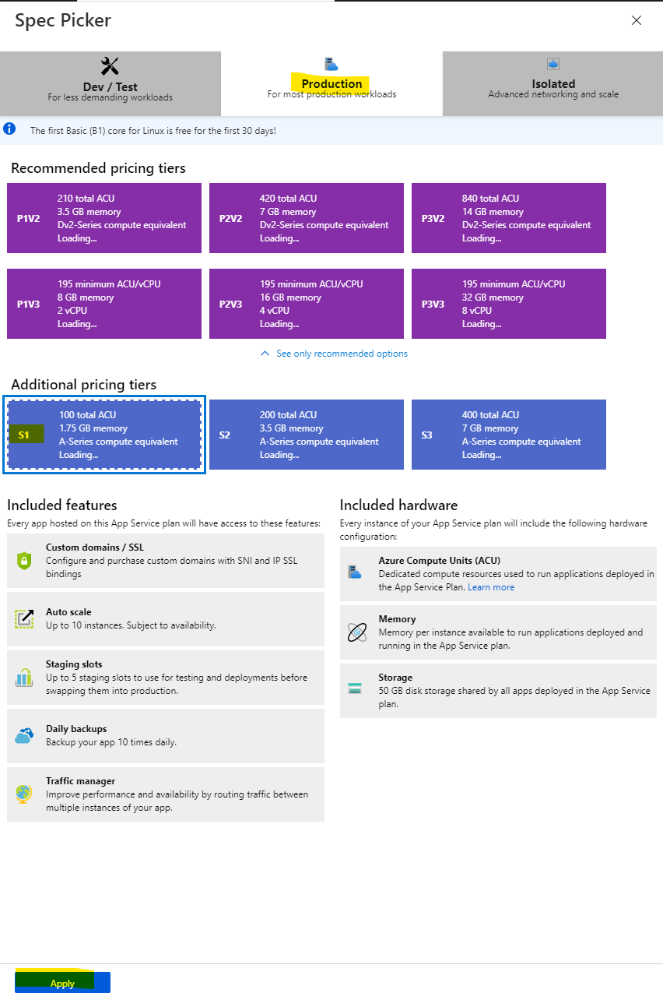

1.单击**查看并创建**。

    

1.单击**创建**。

    

1.重复上述过程，为生产阶段创建第二个应用程序服务。这次，在** Name **后面附加**“-prod” **。 **您可以使用之前为质量检查创建的同一应用服务计划**。

    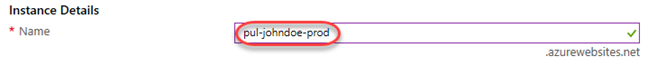

1.创建Azure资源后，继续并配置SQL Server。

1.单击左侧菜单中的“资源组”选项卡。找到并单击** partsunlimited **组。

1.单击之前创建的SQL Server资源。

1.从“安全性”部分中选择“防火墙和虚拟网络”选项卡。

1.将“允许Azure服务和资源访问此服务器” **设置为“是”，以允许App Services访问此SQL Server。

1.单击选项卡顶部的**保存**。

1.继续执行下一个任务。将此浏览器选项卡保持打开状态，以便以后使用。

###任务2：创建质量检查阶段的连续发布###

1.在新的浏览器选项卡中导航到Azure DevOps上的团队项目。它应该位于[https://dev.azure.com/YOURACCOUNT/Parts%20Unlimited](https://dev.azure.com/YOURACCOUNT/Parts Unlimited）。

1.导航到** Pipelines \ |发布**。

    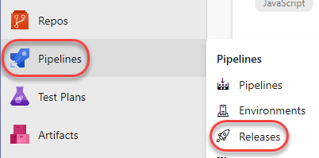

1. **删除**现有的** PartsUnlimitedE2E **发布管道。我们将从这里重新开始。

    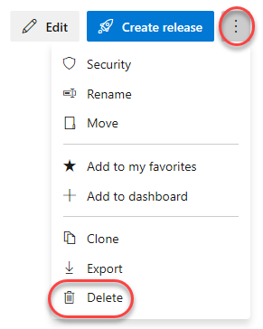

1.单击**新建管道**。

    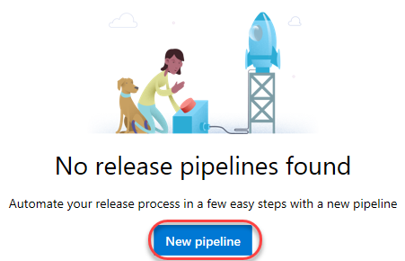

1.有许多启动模板可供选择，或者甚至可以从一个空的过程模板开始。在这种情况下，请选择“ Azure App Service部署”，然后单击“应用”。

    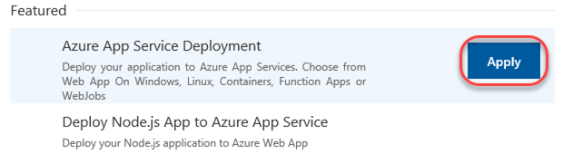

1.将默认阶段重命名为“ QA” **。该模板将部署到质量检查，然后部署到生产阶段。我们将首先设置这个。

    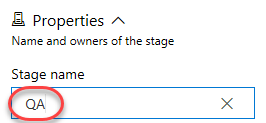

1.将发布管道重命名为**“ PUL-CICD” **。

    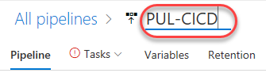

1.要定义的第一件事就是应该部署的内容。单击“工件”部分中的“添加”以指定要部署的工件。

    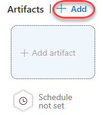

1.工件的类型很多，但是这将非常简单：通过该Team项目中已经存在的** PartsUnlimitedE2E **构建管道构建的项目。点击**添加**。

    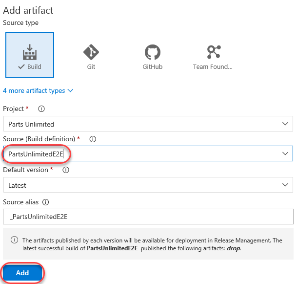

1.现在已经定义了工件，是时候配置部署以进行质量检查了。在“质量检查”阶段中单击“ 1个工作，1个任务”。

    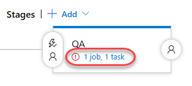

1.选择之前用于创建资源的“ Azure订阅”，然后单击“授权”。如果需要创建与与其他Microsoft帐户关联的Azure帐户的连接，请单击“新建”并遵循该工作流程，然后再继续。

    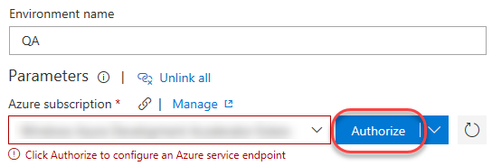

1.按照工作流程授权对您的Azure帐户的访问。

1.输入创建质量检查应用程序服务时先前使用的“应用程序服务名称”。

    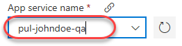

1.返回到“管道”选项卡。

    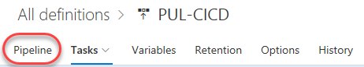

1.单击“触发器”按钮以定义哪些触发器将调用此部署。

    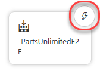

1. **启用**连续部署触发器**。添加一个指向“构建管道的默认分支”的“构建分支过滤器”。构建完成后，这将启动部署。

    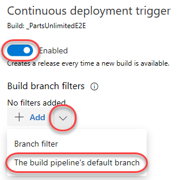

1. **保存**发布管道。

    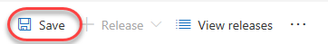

###任务3：配置Azure应用程序服务###

1.返回浏览器选项卡，打开对Azure门户的访问。

1.单击左侧菜单中的“资源组”选项卡。找到并单击先前创建的“ partsunlimited **”组。

    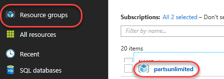

1.单击您的SQL数据库（类似** pul-johndoe / partsunlimited **）。确保单击创建的数据库而不是服务器。请注意，数据库和服务器可能需要花费几分钟的时间，因此不时单击“刷新”按钮以进行检入。

    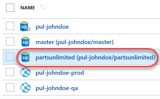

1.在新刀片中，单击“显示数据库连接字符串”。

    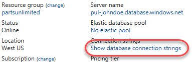

1.这将为您提供基于平台的连接字符串列表。将** ADO.NET **字符串复制到剪贴板，以便您可以配置新网站以使用它。关闭此刀片。

    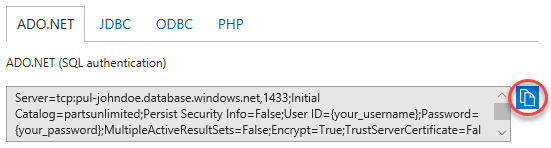

1.打开一个新的** Notepad **实例，然后将连接字符串粘贴到其中。如果剪贴板副本发生任何事情，这将使以后的编辑和检索变得更加容易。

1.使用面包屑导航返回** partsunlimited **资源组。

    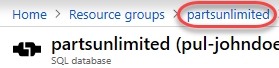

1.单击之前创建的“ QA”应用程序服务。

    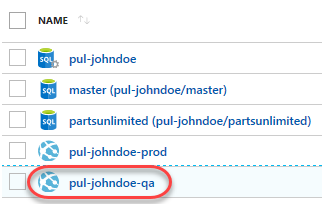

1.从“设置”部分中选择“配置”选项卡。

    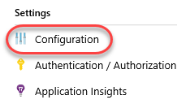

1.在此刀片上，您可以配置应用程序的设置，例如连接字符串。点击**新连接字符串**。

    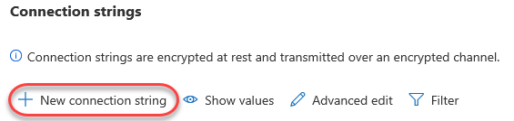

1.找到“连接字符串”部分，并使用键“ DefaultConnectionString” **和从剪贴板粘贴的值添加一个新条目。您需要找到“ {your_username}”和“ {your_password}”部分，并将它们（包括花括号）替换为之前输入的实际SQL凭据。确保将“类型”设置为“ SQLAzure”，然后单击“确定”。

    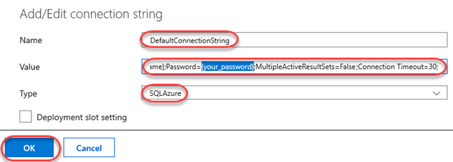

1.单击**保存**进行提交。

    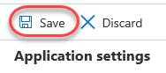

1.重复上述过程，将相同的连接字符串添加到生产应用程序服务。

###任务4：调用持续交付版本以进行质量检查###

1.返回浏览器选项卡，打开您的Azure DevOps项目。

1.现在已经有了发布管道，是时候提交更改以便调用构建和发布了。在本实验的过程中，您需要进行一些类似的更改，因此建议对** Code \ |使用单独的选项卡。文件**，以使过程的这一部分分开。

    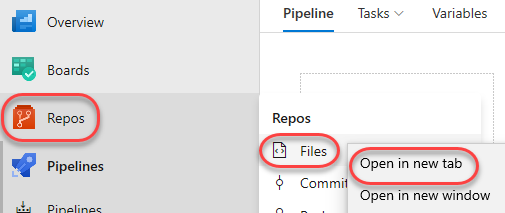

1.导航到** PartsUnlimited-aspnet45 / src / PartsUnlimitedWebsite / Views / Shared / _Layout.cshtml **。这是一个文件，它定义了网站的总体布局，并且是进行更改的好地方，该更改在部署后将很容易看到。

    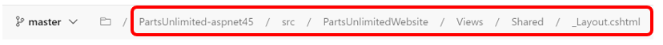

1.单击**编辑**以内联编辑文件。

    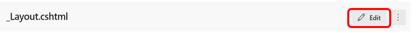

1.找到“零件无限制徽标” **，并在其后添加文本“ v2.0” **。部署后检查起来很容易。

    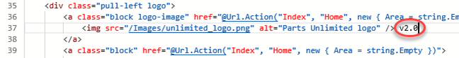

1. **将更改提交回仓库。这将启动基于预先配置的构建管道的构建。

    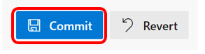

1.导航到** Pipelines **中心。

    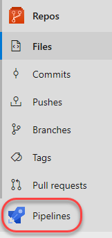

1.打开** PartsUnlimitedE2E **的最新版本。它可能正在排队，正在进行或已经完成。

    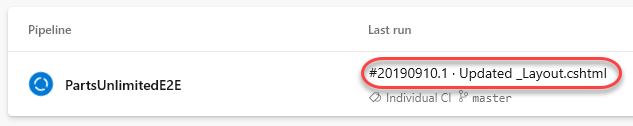

1.按照构建进行操作，直到完成。

    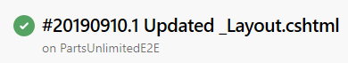

1.单击“发布”选项卡以查看新版本的进展。

    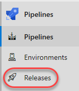

1.单击版本。与构建一样，到达此处时，它可能正在排队，正在进行中或已经完成。

    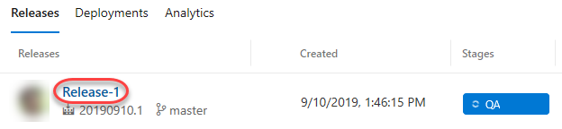

1.按照发行版进行操作，直到成功为止。

    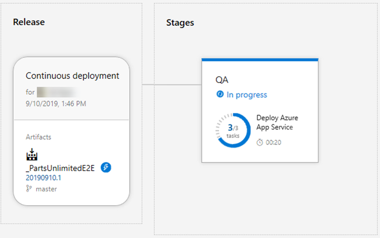

1.现在，您可以根据需要关闭此选项卡。

    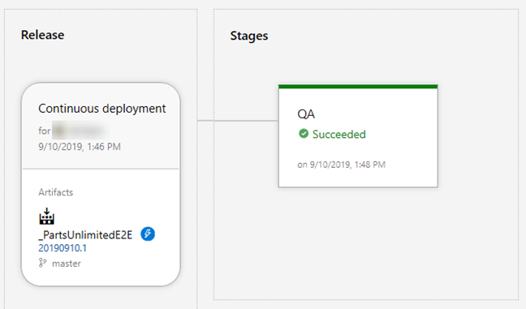

1.在新的浏览器选项卡中，导航到质量检查站点。这将是您的应用程序服务的名称加上**“。azurewebsites.net” **。它应显示先前添加的** v2.0 **。

    
     ######

###任务5：在生产阶段创建门控版本###

1.返回到Azure DevOps浏览器选项卡。

1.单击** Pipelines> Pipelines **，然后单击** Edit **（右上角）以修改版本定义。

1.随着发布管道变得越来越复杂，定义门以确保整个发布管道的质量变得很重要。由于我们将要部署的下一阶段是生产，因此我们需要确保同时包括自动质量门和手动审批门。返回到发布管道浏览器选项卡，然后在“ QA”阶段单击“克隆”。由于生产阶段实际上是相同的，因此我们可以重用几乎所有现有配置。

    

1.将新阶段添加到当前阶段之后，这就是我们想要的。但是，在我们认为质量保证部署成功之前，我们需要定义部署后条件。在“质量检查”阶段中，单击“部署后条件”按钮。

    

1. **启用**门**选项。

    

1.有几种可用的门可以自动测试几乎所有您需要的东西，以确保部署状况良好。这些可能是Azure函数或REST API的返回值，对Azure的警报查询或Azure DevOps中的工作项查询。您还可以配置平台在第一次评估门之前应延迟的时间。在这种情况下，请将其更改为** 0 **，这样它将在部署后立即对其进行测试。然后点击**添加** \ | **查询工作项**。

    

1.选择“查询”作为“共享查询”严重错误**。我们将制定政策，确保在解决所有关键错误之前，不能将质量检查部署视为成功。

    

1.展开**评估选项**，并将**两次重新评估门之间的时间**更新为** 5 **。如果此门操作失败，我们希望它每5分钟重新评估一次查询，直到清除为止，因为工程师将需要一些时间来确认那些关键错误已在当前版本中得到修复。但是，如果未清除这些错误并且发行版本未手动失败，则此配置将在1天后自动使登机门失败。

    

1.为了使查询门工作，Project Build Service将需要对查询具有读取权限。转到** Azure板>查询>所有>共享查询>“ ...”>安全**。

    

1.搜索**“（您的项目名称）构建服务” **（如果默认情况下不包含）（不是Project Collection Build Service！），然后授予它“读取>允许”权限。

    

1.现在，我们可以将重点转移到生产阶段。选择“复制质量检查”阶段。

    

1.将其重命名为**“ Prod” **。

    

1.单击其“部署前条件”按钮。

    

1. **启用** **部署前批准**，然后将自己添加为**批准者**。这里的想法是，直到质量检查部署成功后，才要求您批准生产部署。届时，此列表中的某人将需要批准将部署部署到生产环境。另外，请选中“如果请求释放版本的用户不批准”复选框，请选中该复选框。出于本实验的目的，您可以批准所需的发行版。

    

1.单击** Prod **阶段的** 1个作业，1个任务**。

    

1.更新** App服务名称**以反映“ **-prod **”（而不是**“-qa” **）。

    

1. **保存**发布管道。

    

1.在**“ PartsUnlimited-aspnet45 / src / PartsUnlimitedWebsite / Views / Shared / _Layout.cshtml” **上重复更改代码库的过程，随后在新选项卡中进行。这次，将版本号从**“ 2.0” **更新为**“ 3.0” **。这将调用发布管道。

1.与以前一样，遵循该发行版，直到将其部署到质量检查中为止。单击以跟踪该发行版本身（一旦可用）。

1.最终，质量检查部署会出现问题。尽管部署成功，但质量门之一失败了。这将需要解决，才能批准该阶段。单击“查看部署后的门”按钮。

    

1.看来“查询工作项”门失败。这意味着必须清除一个严重的错误。

    

1.在** Boards \ |中打开一个新标签。查询**以查找错误。

    

1.使用“全部”选项卡上的查询列表打开“共享查询”。严重错误**查询。

    

1.单击打开一个错误。

    

1.通常，您会检查该站点以确认该错误已修复，但是我们将在此处跳过并标记为“完成”。单击**保存**，然后关闭选项卡。

    

1.返回到发布管道选项卡。根据时间的不同，Azure DevOps最多可能需要五分钟才能再次检查查询。完成后，将清除错误并批准发布。然后，您可以单击“批准”以批准部署到生产环境。

    

1.确认部署。

    

1.单击**进行中**链接以遵循发布工作流程。

    

1.发布可能要花一点时间才能开始并完成。

    

1.发布完成后，打开生产应用程序服务URL的新选项卡。它应该与您的质量检查URL相同，但应使用**“-prod” **而不是**“-qa” **。注意** v3.0 **。

    

###任务6：使用部署槽###

1.返回浏览器窗口，该窗口打开到Azure门户。

1. Azure App Services提供了“部署插槽”，这是应用程序部署的并行目标。使用部署插槽的最常见情况是为应用程序提供一个过渡阶段，以使其针对生产服务运行，但不替换当前的生产应用程序。如果登台部署通过审核，则可以通过单击按钮立即将其“交换”为生产插槽。另外一个好处是，如果新版本发现了问题，交换可以迅速撤消。找到之前创建的资源组，然后单击“产品**”应用程序服务。

    

1.选择“部署插槽”选项卡。如果您看到一条消息，表明您当前的定价层不支持广告位，请按照工作流程将此服务升级到**生产**层或更高级别，然后返回此处。您可能需要刷新浏览器才能启用“添加插槽”选项。

    

1.单击**添加插槽**。请注意，“生产”插槽被视为“默认”插槽，在用户体验中未显示为单独的插槽。

    

1.输入“阶段” **的名称**，然后选择与现有部署匹配的“配置源”（应该只有一个）。单击**添加**以创建插槽。

    

1.使用** Prod **阶段管道编辑器返回到Azure DevOps选项卡。

1.选择“部署Azure应用服务”任务。

    

1.选中“部署到插槽...”，然后将“资源组”和“插槽”设置为之前创建的资源。

    

1. **保存**发布管道。

    

1.按照先前的工作流程，通过将布局模板从**“ 3.0” **更新为**“ PartsUnlimited-aspnet45 / src / PartsUnlimitedWebsite / Views / Shared / _Layout.cshtml” **，对代码库进行更改**“ 4.0” **。

1.按照发布流程进行部署，并在需要时批准将其发布到生产环境。

1.生产部署完成后，刷新该浏览器选项卡。请注意，由于部署已推送到其他插槽，因此不应进行任何更改。

    

1.在“ staging”插槽中打开一个新选项卡。这将与您的生产URL相同，但在域内的应用程序服务名称后会附加**“-staging” **。这应该反映出新的** v4.0 **。

    

1.返回浏览器窗口，打开“ Azure门户” **。单击部署插槽刀片中的“交换”。

    

1.这里的默认选项正是我们想要的：交换生产插槽和登台插槽。点击**交换**。请注意，如果您的应用程序依赖于插槽级别的配置设置（例如连接字符串或标记为“插槽”的应用程序设置），那么工作进程将重新启动。如果您在这种情况下工作，并且想在交换完成之前对应用程序进行预热，则可以选择“使用预览交换”交换类型。

    

1.返回到“产品”浏览器窗口（不是暂存槽）并刷新。现在将是4.0版本。

    