

## 概述 ##

在本实验中，您将学习如何使用Azure Pipelines中的生成和发布为应用程序配置持续集成（CI）和持续部署（CD）。这个可编写脚本的CI / CD系统既是基于Web的又是跨平台的，同时还提供了用于可视化复杂工作流的现代界面。尽管我们不会在本实验中演示所有跨平台的可能性，但需要指出的是，您还可以针对iOS，Android，Java（使用Ant，Maven或Gradle）和Linux进行构建。

是否需要其他学习方法？请查看 <a href="https://docs.microsoft.com/en-us/learn/modules/create-a-build-pipeline/" target="_blank"><b><u> 在Microsoft Learn上使用Azure Pipelines </u></b></a> 模块创建biuld流水线.

### 先决条件 ###

- 本实验要求您先完成 <a href="../prereq/">先决条件</a> 说明中任务1 。

## 练习1：Azure DevOps构建简介 ##

### 任务1：从模板创建基本构建流水线 ###

1. 导航到你的Azure DevOps上的team project。

2. 导航到**Pipelines \| Pipelines**。

  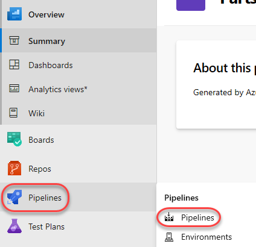

3. 打开（单击）现有的流水线 **PartsUnlimitedE2E**（由demo生成器工具创建），然后单击 **Edit**  。

 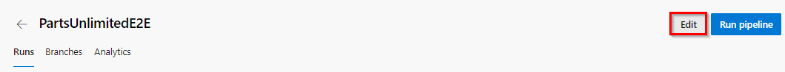

4. 为了不在稍后实验中触发两个流水线，请为模板创建的流水线禁用CI触发器（取消选中），然后 **Save**。

 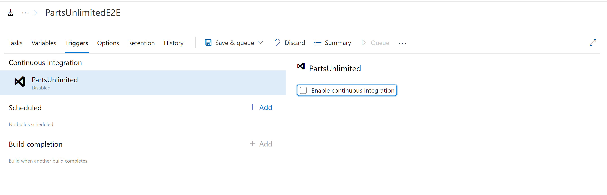

5. 导航回到 **Pipelines \| Pipelines**，然后单击**New pipeline**以创建新的构建流水线。

 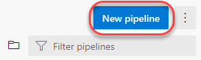

6. 构建流水线的默认选项涉及使用YAML定义过程。如果您对此感兴趣，请使用另外的Lab。对于本实验，使用经典模式。单击**use the classic editor**。

 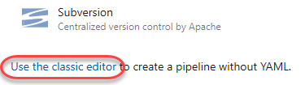

7. 您需要做的第一件事是配置源存储库。每个主要平台都可用，但是这里我们需要所有默认选项。该版本将使用Repos中 **PartsUnlimited**的 **master**分支。保留默认设置，然后单击 **Continue**。

 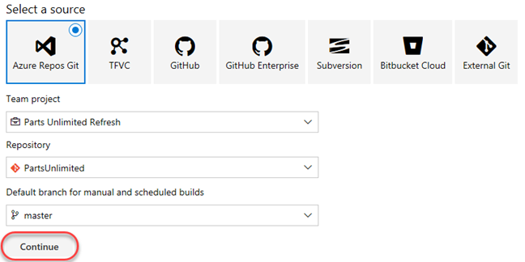

8. 找到**ASP.NET**模板，然后单击 **Apply**将此模板应用于生成定义。请注意，有许多选项应涵盖我们所有的主流方案。出于此处的目的，我们将仅使用基线（baseline）ASP.NET模板来构建项目。

 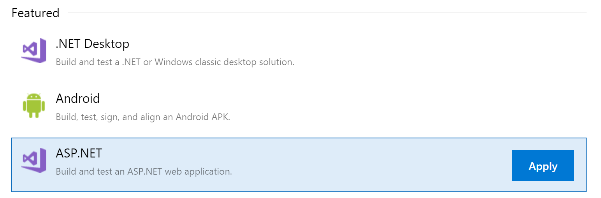

9. 此构建(Biuld)流水线的过程很容易遵循。获取源代码后，Azure DevOps将使用NuGet还原任何依赖程序包。然后，将构建并测试该项目。然后将结果发布到已配置的目标。

 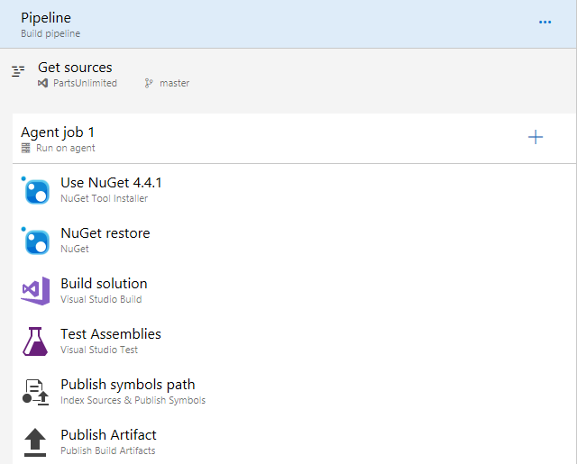

10. 选择**Variables** 选项卡。在这里，您可以配置在构建(Biuld)期间要使用的特殊参数，例如配置或平台。

 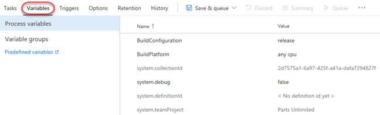

11. 选择 **Triggers** 选项卡。这些触发器使您能够按计划，其他构建完成或对源进行更改时自动调用构建。选中**Enable continuous integration**，以便在提交源更改时都会调用此构建。

 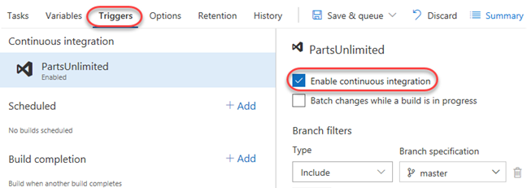

12. 选择**Options**选项卡。本节包括与构建工作流程相关的各种选项。请注意，通常您将在任务本身的配置视图中为特定的构建任务配置选项。

 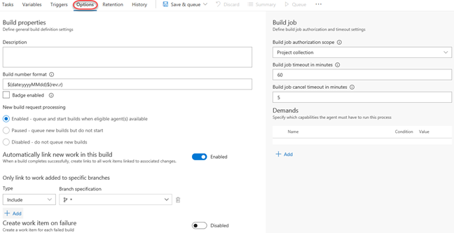

13. 选择**Retention**选项卡。右键单击 **go to the project settings to configure**，然后选择**Open in new tab**。

 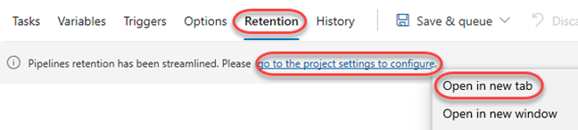

14. 此部分使您可以配置保留哪些流水线运行以及保留多长时间。关闭选项卡。

 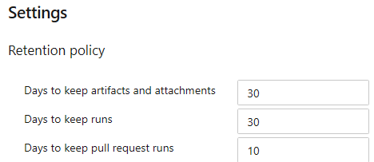

15. 选择 **History** 选项卡。这里还没有任何东西，但是它将显示您对构建定义进行的更改的历史记录。

 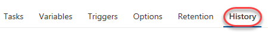

16. 选择 **Save & Queue \| Save & Queue** 保存并排队一个新的版本。

 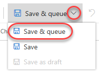

17. 通过单击**Save and run**接受默认选项。

 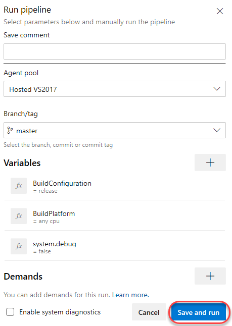

### 任务2：跟踪和审查构建(biuld) ###

1. 根据负载，构建可能需要在队列中等待片刻。

 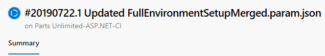

2. 构建开始后，您将能够跟踪每个任务的控制台输出。点击**Agent job 1**。

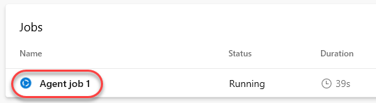

3. 如果您要查看较早的任务，您可以滚动右窗格以查看其日志。

 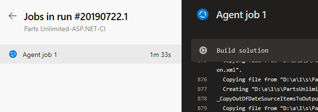

4. 构建将最终成功。您可以通过单击“后退”按钮返回到摘要视图。

 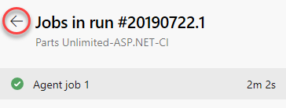

5. 摘要视图提供有关构建的概述详细信息，包括有关提交（commit），测试和Artifacts的详细信息。

 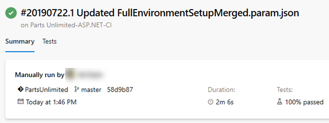

6. 选择 **Tests**选项卡以查看此版本的测试性能。注意，您还可以轻松访问流水线编辑器，可以将新的构建排队，也可以下载该构建的Artifacts。

 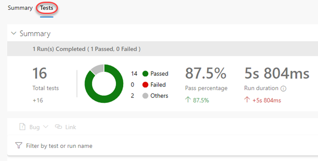

### 任务3：调用持续集成版本 ###

1. 较早已经配置了这个构建（Biuld）以支持持续集成。使用**Repos \| Files**浏览该项目的Code。

 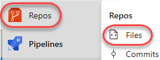

2. 打开文件 **PartsUnlimited-aspnet45/src/PartsUnlimitedWebsite/Views/Home/Index.cshtml**。

 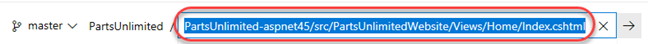

3. 单击**Edit**。

 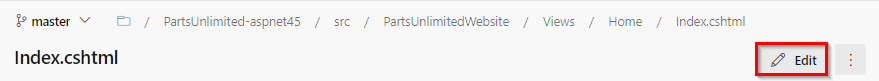

4. 进行较小的外观更改，例如通过调整文档标题。点击**Commit**。

 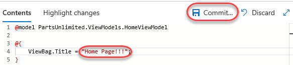

5. 接受默认的提交详细信息，然后单击**Commit**。

 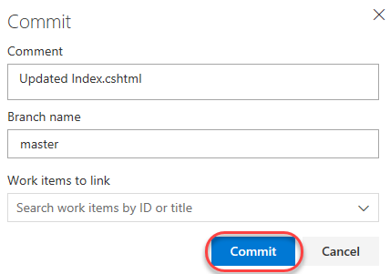

6. 建造应该在短期内进行。选择**Pipelines \| Pipelines**，以查看是否正在进行中。

 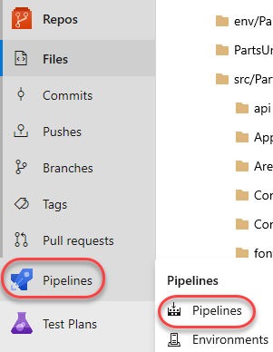

7. 现在，您应该看到一个新的构建，（注意 **.2** ），正在进行中，并且它是由您的更改触发的。单击内部版本以对其进行跟踪。请注意，它可能在另一个配置为持续集成的构建流水线后面排队。

 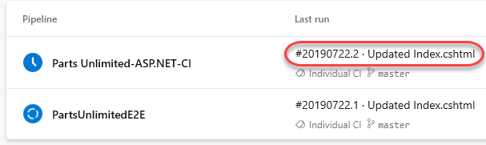

8. 此构建应像先前的构建一样运行并成功。

=======
 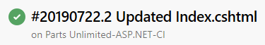
>>>>>>> 491ae5a7aa89c1525fd86591ee73dab29629079d
