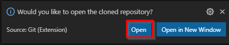
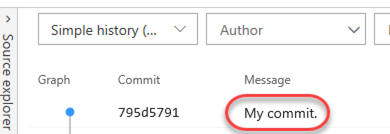

<div class =“ rw-ui-container”> </ div>
<aname="概述"></a>

## 概述 ##

Azure DevOps支持两种类型的版本控制，Git和Team Foundation版本控制（TFVC）。这是两个版本控制系统的快速概述：

-**Team Foundation Version Control (TFVC)**:TFVC是集中式版本控制系统。通常，团队成员在其开发机器上每个文件只有一个版本。历史数据仅在服务器上维护。分支是基于路径的，并在服务器上创建。

-**Git**: Git是一个分布式版本控制系统。 Git存储库可以位于本地（例如，在开发人员的机器上）。每个开发人员在其开发机上都有源存储库的副本。开发人员可以在其开发机器上提交每组更改，并执行版本控制操作（例如历史记录）并在没有网络连接的情况下进行比较。

Git是新项目的默认版本控制提供程序。除非您特别需要TFVC中的集中式版本控制功能，否则应在项目中使用Git进行版本控制。

在本实验中，您将学习如何建立本地Git存储库，可以轻松地将其与Azure DevOps中的集中式Git存储库同步。此外，您还将了解有关Git分支和合并支持的信息。您将使用Visual Studio Code，但是相同的过程适用于将任何与Git兼容的客户端与Azure DevOps一起使用。

<a name="Prerequisites"> </a>
### 先决条件 ###

-安装[Visual Studio Code](https://code.visualstudio.com/) 及扩展包 [C#](https://marketplace.visualstudio.com/items?itemName=ms-dotnettools.csharp)

-[适用于Windows的Git]（https://gitforwindows.org/）2.21. 0或更高版本。

-本实验要求您从[先决条件说明](../prereq) 中完成任务1（跳过克隆，在练习中完成）。

<a name="Exercise1"> </a>
## 练习1：配置实验室环境 ##

<a name="Ex1Task1"> </a>
### 任务1：配置Visual Studio Code ###

1. 打开**Visual Studio Code**。在此任务中，您将配置Git凭据帮助器以安全地存储用于与Azure DevOps通信的Git凭据。如果您已经配置了凭据助手和Git身份，则可以跳到下一个任务。

1. 从主菜单中，选择 **Terminal \| New Terminal**以打开终端窗口。

1. 执行以下命令以配置凭据帮助器。

    ```
    git config --global credential.helper wincred
    ```
1. 下面的命令将为Git提交配置您的用户名和电子邮件。将参数替换为您的首选用户名并通过电子邮件发送并执行它们。

    ```
    git config --global user.name "John Doe"
    git config --global user.email johndoe@example.com
    ```

  
<a name="Exercise2"> </a>
## 练习2：克隆现有存储库 ##

<a name="Ex2Task1"> </a>
### 任务1：克隆现有存储库 ###

1. 在浏览器选项卡中，导航到Azure DevOps上的team project。

1. 获取Git存储库的本地副本称为“克隆(cloning)”。每个主流开发工具都支持此功能，并且将能够连接到Azure Repos来获取最新的可使用资源。从左侧服务导航栏导航到**Repos**。

      

1. 单击**Clone**。

   

1. 单击克隆的URL右侧的“复制到剪贴板”图标。您可以将此URL插入任何与Git兼容的工具中，以获取代码库的副本。

   

1. 打开**Visual Studio Code**的实例。

1. 按**Ctrl+Shift+P**显示**Command Palette**。命令面板提供了一种轻松便捷的方法来访问各种任务，包括第三方扩展提供的任务。

1. 执行**Git：Clone**命令。输入**Git** 使其进入候选列表可能会有所帮助。

   

1. 将URL粘贴到您的仓库中，然后按**Enter**。

   

1. 选择一个本地路径以克隆存储库。

1. 出现提示时，登录到您的Azure DevOps帐户。

1. 克隆完成后，单击**Open**以打开克隆的存储库。您可以忽略有关打开项目的任何警告。解决方案可能不是处于可构建状态，但这没关系，因为我们将专注于与Git一起工作，并且不需要构建项目本身。

   


<a name="Exercise3"> </a>
## 练习3：通过提交（commits）保存工作 ##

当您对文件进行更改时，Git会将更改记录在本地存储库中。您可以通过暂存更改来选择要提交的更改。提交总是针对您本地的Git存储库，因此您不必担心提交必须是完美的或准备与他人共享。您可以在继续工作时进行更多提交，并在准备好将其共享时将更改推送给其他人。

提交（commit）中有什么内容？

Git提交（commit）包含以下内容：

-文件在提交（commit）中已更改。 Git在提交中将所有文件更改的内容保留在您的存储库中。这样可以使其保持快速并允许智能合并。

-对父提交的引用。 Git使用这些引用来管理您的代码历史记录。

-描述提交（commit）的消息。您在创建提交时将此消息提供给Git。保持此消息的描述性是一个好主意，但要切合实际。

<a name="Ex3Task1"> </a>
### 任务1：提交更改 ###

1. 从“资源管理器”选项卡中，打开 **/PartsUnlimited-aspnet45/src/PartsUnlimitedWebsite/Models/CartItem.cs**。

   

1. 在文件中添加注释。评论的内容并不重要，因为目标只是进行更改。按**Ctrl+S**保存文件。

   

1. 选择**Source Control**选项卡以查看解决方案的一项更改。

   

1. 输入**My commit**的提交消息，然后按**Ctrl+Enter**在本地提交。

   

1. 如果询问您是否要自动进行更改并直接提交更改，请单击**Always**。我们将在稍后的实验中讨论**staging**。

   

1. 单击**Synchronize Changes**按钮以将您的更改与服务器同步。如果出现提示，请确认同步。

   

<a name="Ex3Task2"> </a>
### 任务2：审阅提交 ###

1. 切换到Azure DevOps浏览器选项卡。您可以在**Repos**中心的**Commits**选项卡下查看Azure DevOps上的最新提交。

   

1. 最近的提交应该在顶部。

   

<a name="Ex3Task3"> </a>
### 任务3：暂存（Staging）更改 ###

暂存更改（Staging）使您可以有选择地将某些文件添加到提交中，而忽略其他文件中所做的更改。

1. 返回到**Visual Studio Code**。

1. 通过编辑您之前的注释并保存文件来更新打开的**CartItem.cs**类。

   

1. 同时打开**Category.cs**。

   

1. 在**Category.cs**中添加一个新注释，这样将有两个具有更改的文件。保存文件。

   

1. 在**Source Control** 选项卡上，为**CartItem.cs**单击**Stage Changes**按钮。

   

1. 这将准备只提交**CartItem.cs**，而先不提交**Category.cs**。

   

1. 输入 **"Added comments"**的comment。从 **More Actions** 下拉列表中，选择**Commit Staged**。

   

1. 单击**Synchronize Changes**按钮以将提交的更改与服务器同步。请注意，由于仅提交了分阶段的更改，因此其他更改仍在本地挂起。

   

<a name="Exercise4"> </a>
## 练习4：查看历史记录 ##

Git使用存储在每个提交中的父级参考信息来管理开发的完整历史记录。您可以轻松地查看此提交历史记录，以找出何时进行文件更改，并使用终端或从许多可用的Visual Studio Code扩展之一中确定代码版本之间的差异。您还可以使用Azure DevOps门户查看更改。

Git对**Branches and Merges**功能的使用通过请求请求起作用，因此开发的提交历史记录不一定会形成一条按时间顺序排列的直线。当您使用历史记录比较版本时，请考虑两次提交之间的文件更改，而不是两个时间点之间的文件更改。 master分支中文件的最新更改可能来自两周前在feature分支中创建的提交，但直到昨天才合并。

<a name="Ex4Task1"> </a>
### 任务1：比较文件 ###

1. 在**Source Control**选项卡中，选择**Category.cs**。

   

1. 将打开一个比较视图，使您可以轻松找到所做的更改。在这种情况下，这只是一条评论。

   


1. 转到**Azure DevOps** 中的 **Commits**视图，以找到一些源分支和合并。这些提供了一种方便的方式来可视化对源进行更改的时间和方式。

   

1. 从**Merged PR 27**下拉菜单中，选择**Browse Files**。

   

1. 此视图提供了在该提交时浏览源状态的功能，因此您可以查看和下载这些文件。

   

<a name="Exercise5"> </a>
## 练习5：使用分支branch ##

您可以从Web上的“分支”视图在Azure DevOps Git存储库中管理工作。您还可以自定义视图以跟踪您最关心的**Branches**，以便您可以掌握团队所做的更改。

向分支提交更改不会影响其他分支，您可以与其他分支共享分支，而不必将更改合并到主项目中。您还可以创建新分支，以将功能或错误修复的更改与您的主分支和其他工作隔离开。由于分支是轻量级的，因此在分支之间进行切换既快捷又容易。当使用分支时，Git不会创建源的多个副本，而是在您开始处理分支时使用提交中存储的历史记录信息在分支上重新创建文件。您的Git工作流程应创建并使用分支机构来管理功能和错误修正。 Git工作流程的其余部分，例如共享代码和使用拉取请求查看代码，全部通过分支进行。隔离分支中的工作使通过简单地更改当前分支来更改正在处理的内容变得非常简单。

<a name="Ex5Task1"> </a>
### 任务1：在本地存储库中创建一个新分支 ###

1. 返回到 **Visual Studio Code**。

1. 单击左下方的**master**分支。

   

1. 选择 **Create new branch from...**。

   

1. 为新分支输入名称**dev** 并按**Enter**。

   

1. 选择**master**作为参考分支。

   

1. 您现在正在该分支上工作。

   

<a name="Ex5Task2"> </a>
### 任务2：使用分支 ###

Git跟踪正在处理的分支，并确保在签出（checkout）分支时文件与该分支上的最新提交相匹配。分支使您可以同时使用同一本地Git存储库中的多个版本的源代码。您可以使用Visual Studio Code来发布，签出和删除分支。

1. 单击分支旁边的**Publish changes**按钮。

   

1. 在“ Azure DevOps”浏览器选项卡中，选择**Branches**。

   

1. 您应该看到新推送的**dev**分支。单击更多操作下拉菜单，然后选择**Delete branch**按钮将其删除。确认删除。

   

1. 返回到 **Visual Studio Code**。

1. 单击**dev**分支。

   

1. 请注意，列出了两个**dev**分支。本地（**dev**）分支在那里，因为在删除服务器分支时不会将其删除。服务器 (**origin/dev**)在那里，因为它尚未被修剪。选择**master**分支以将其签出。

   

1. 按**Ctrl+Shift+P**打开**Command Palette**。

1. 开始输入**Git: Delete**，然后在可见时选择**Git: Delete Branch**。

   

1. 只有一个本地分支要删除，因此选择它。

   

1. 单击**master**分支。

   

1. 请注意，本地**dev**分支已消失，但远程**origin/dev**仍在显示。

   

1. 按**Ctrl+Shift+P**打开**Command Palette**。

1. 开始输入**Git: Fetch**，然后在可见时选择**Git：Fetch（Prune）**。此命令将更新本地快照中的原始分支，并删除不再存在的原始分支。

   

1. 您可以通过选择屏幕底部的**Output**窗口来准确检查这些任务在做什么。

   

1. 请注意，如果在输出控制台中看不到Git日志，则可能需要选择**Git**作为源。

   

1. 单击**master**分支。

   

1. **origin/dev**分支不应再出现在列表中。

   

<a name="Exercise6"> </a>
## 练习6：从Azure DevOps管理分支 ##

除了Visual Studio Code中可用的所有功能之外，您还可以从Azure DevOps门户管理回购分支。

<a name="Ex6Task1"> </a>
### 任务1：创建一个新分支 ###

1. 切换到Azure DevOps浏览器选项卡。

1. 导航到**Repos \| Branches**。点击**New branch**。

   

1. 为新分支输入名称 **"release"**。使用**Work items to link** 下拉菜单选择一个或多个工作项目以链接到该新分支。点击**创建分支**以创建它。

   

1. 创建分支后，该分支将在列表中可用。

   

1. 返回到 **Visual Studio Code**。

1. 按**Ctrl+Shift+P**打开**Command Palette**。

1. 开始输入**Git: Fetch**，然后在可见时选择**Git：Fetch**。此命令将更新本地快照中的原始分支。

   

1. 单击**master**分支。

   

1. 选择**origin/release**。这将创建一个新的本地分支，称为**release**并将其签出。

   

<a name="Ex6Task2"> </a>
### 任务2：删除分支 ###

1. 返回到Azure DevOps，然后从更多操作下拉列表中单击 **Delete branch**以将其删除。

   

1. 如果需要，可以通过搜索确切的分支名称来 **Restore branch**。选择**Restore branch**，如下所示。

   

<a name="Ex6Task3"> </a>
### 任务3：锁定分支 ###

对于防止可能与重要合并冲突的新更改或将分支置于只读状态，锁定是理想的选择。另外，如果您只是想确保在合并分支之前对其进行更改，则可以使用分支策略和拉取请求而不是锁定请求。

锁定不会阻止克隆存储库或将分支中所做的更新提取到本地存储库中。如果您锁定分支，请与您的团队分享原因，并确保他们知道解锁分支后如何使用分支。

1. 从**master**上下文菜单中，选择**Lock**。

   

1. 分支现已锁定。

   

1. 现在，使用相同的流程来 **Unlock** 分支。

   

<a name="Ex6Task4"> </a>
### 任务4：标记发行版 ###

1. 尽管看起来似乎不多，但是产品团队已决定该网站需要的版本正是v1. 1。为了将其标记为此类，请导航至 **Tags** 标签。

   

1. 点击**New Tag**。

   

1. **name**里输入**v1.1** ，**Description**里输入**Great release!**。点击**创建**。

   

1. 现在，您已经在此版本中标记了该项目。您可以出于多种原因标记提交，Azure DevOps提供了编辑和删除它们以及管理其权限的灵活性。

     <a name=""> </a>
   

<a name="Exercise7"> </a>
## 练习7：管理存储库 ##

您可以在team project中创建Git仓库，以管理项目的源代码。每个Git存储库都有其自己的权限集和分支，以使其自身与项目中的其他工作隔离。

<a name="Ex7Task1"> </a>
### 任务1：从Azure DevOps创建新的存储库 ###

1. 从项目的**Add**下拉列表中，选择**New repository**。

   

1. 将**Repository name**设置为**New Repo**。请注意，您还可以选择创建一个名为**README.md**的文件。这将是当有人在浏览器中导航到存储库根目录时呈现的默认markdown文件。此外，您可以使用**.gitignore**文件预先配置存储库。该文件基于命名模式和/或路径指定从源代码管理中忽略哪些文件。有多个模板可用，其中包括基于要创建的项目类型而忽略的常见模式和路径。点击**Create**。

   

1. 就是这样。您的仓库已准备就绪。现在，您可以使用Visual Studio或您选择的工具克隆它。

   

<a name="Ex7Task2"> </a>
### 任务2：删除并重命名Git仓库 ###

1. 有时您需要重命名或删除存储库，这很容易。打开**Project settings**。

   

1. 在**Repos**下选择**Repositories**。


   


1. 从**New Repo**下拉菜单中，选择**Delete repository**。或者，您可以在此处重命名。

   

1. 输入名称**New Repo**确认仓库，然后单击**Delete**。

   
