<div class="rw-ui-container"></div>
<a name="概述"></a>


## 概述 ##

**Azure Artifacts**是一个扩展，可轻松发现，安装和发布Azure DevOps中的NuGet，npm和Maven程序包。它与Build等其他枢纽深度集成，因此包管理可以成为您现有工作流程的无缝组成部分。

<div class="bg-slap">Want additional learning? Check out the <a href="https://docs.microsoft.com/en-us/learn/modules/manage-build-dependencies/" target="_blank"><b><u> Manage build dependencies with Azure Artifacts </u></b></a> module on Microsoft Learn.</div>

<a name="Prerequisites"></a>
### 先决条件 ###

- Visual Studio 2017或更高版本

- 本实验要求您按照 <a href="../prereq/">先决条件</a>指令完成任务1和2。

<a name="Exercise1"> </a>
## 练习1：使用Azure Artifacts ##

**Azure Artifacts**是Azure DevOps Services和Azure DevOps Server的扩展。它已预安装在Azure DevOps Services，Azure DevOps Server 2019，Team Foundation Server（TFS）2017和2018中。

<a name="Ex1Task1"> </a>
### 任务1：创建并连接到Feed ###

1. 导航到 **Artifacts** 中心(hub)。

   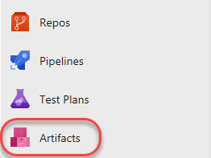
   
2. 点击 **Create feed**。该Feed将是可供组织内用户使用的NuGet软件包的集合，并且将与公共NuGet Feed一起作为对等源。本实验中的场景将重点放在使用Azure Artifacts的工作流上，因此实际的体系结构和开发决策仅是演示性的。

   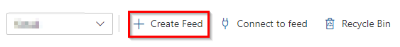

3. 此提要（Feed）将包含可以在该组织中的各个项目之间共享的通用功能。选择此实验的范围作为 **Organization** 。将名称设置为 **"PartsUnlimitedShared"** ，然后单击 **Create**。保留默认选项。

   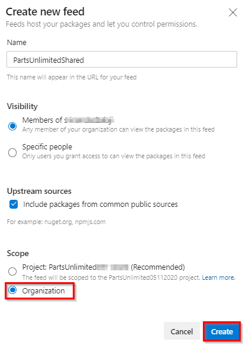

4. 任何想要连接到此NuGet feed的用户都必须配置其环境。点击**Connect to feed**。

   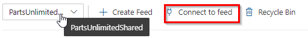

    

5. 在 **Connect to feed** 窗口中，选择 **Visual Studio** 并复制 **Source** URL。这是Visual Studio和NuGet唯一需要开始利用New Feed的优势。在浏览器中将对话框保持打开状态。

  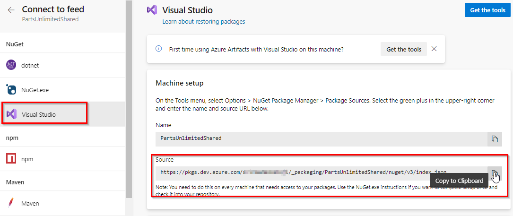

6. 启动 **Visual Studio**的 **新** 实例。请勿使用通过克隆 **Parts Unlimited** 而打开的实例。

7. 选择 **Tools \| NuGet Package Manager \| Package Manager Settings**。
     
    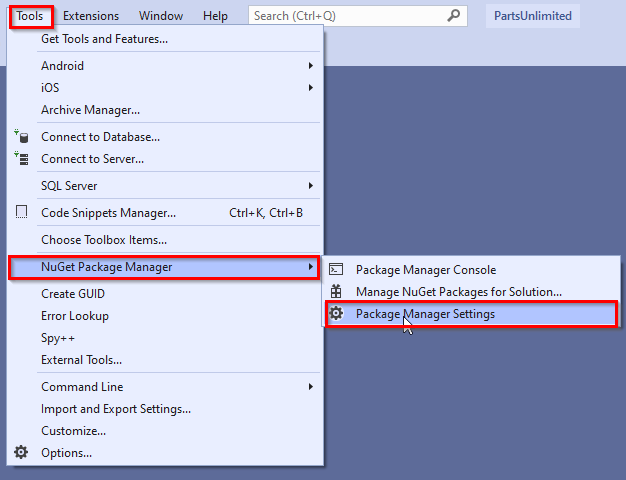
8. 找到 **Package Sources** 部分，然后单击 **Add** 按钮以添加新的软件包来源。

   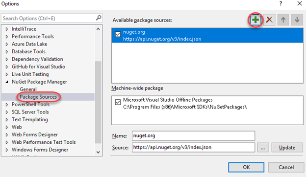

9. 将 **Name** 设置为 **"PartsUnlimitedShared"** ，并粘贴先前复制的 **Source**  URL。单击 **Update** ，然后单击 **OK**。现在，Visual Studio已连接到新的提要。

   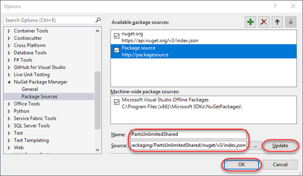

10. 关闭并重新打开用于克隆PartsUnlimited存储库的另一个Visual Studio实例（ <a href="../prereq/"> 先决条件 </a> 任务2），以便它显示此新源。

<a name="Ex1Task2"> </a>
### 任务2：创建和发布NuGet包 ###

1. 从 **Visual Studio**的主菜单中，选择 **File \| New \| Project** （VS2019中的“创建新项目”）。现在，我们将创建一个共享程序集，该程序集将以NuGet程序包的形式发布，以便其他团队可以集成该程序集并保持最新状态，而不必直接与项目源代码合作。

2. 在 **Visual C#** 部分中，选择 **Class Library (.NET Framework)** 模板，然后将 **Name** 设置为 **"PartsUnlimited.Shared"**。单击 **OK** 以创建项目。
（如果使用VS2019，请在查找器中查找“类”，然后选择 **Class Library (.NET Framework)**并选择版本4.5.1）

    
  VS2017

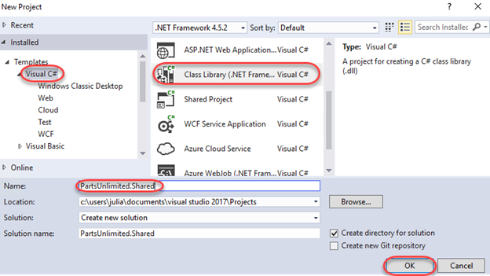

   VS2019

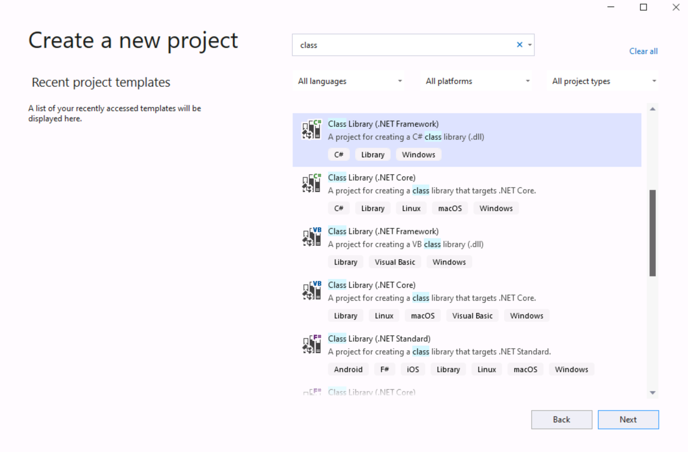
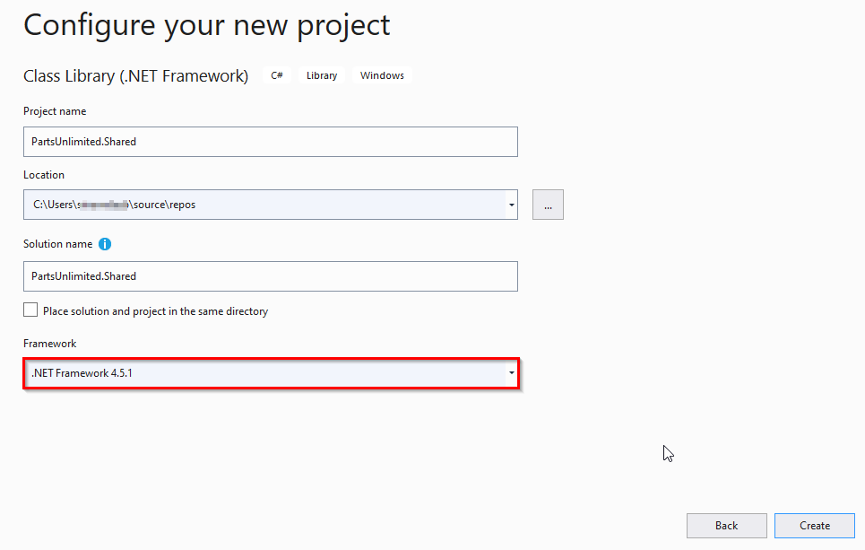


3. 在 **Solution Explorer**，删除 **Class1. cs**。

   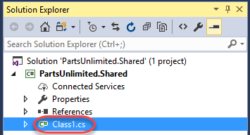

4. 右键单击项目节点，然后选择 **Properties**。

   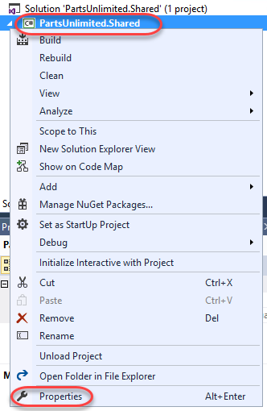

5. 将 **Target framework** 设置为 **.NET Framework 4.5.1** ，然后单击k **Yes** 以确认更改。 （如果使用VS2019，请确认相同）

   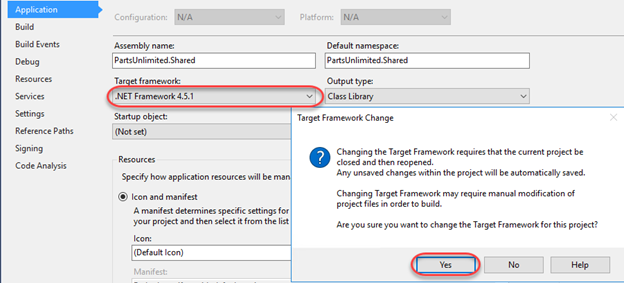

6. 按 **Ctrl+Shift+B** 生成项目。在下一个任务中，我们将使用 **NuGet.exe** 直接从生成的项目中生成NuGet包，但是它要求首先构建项目。

7. 返回到Azure DevOps浏览器选项卡。在之前创建的提要上，单击 **Connect to Feed** \| **NuGet.exe** \| **Get the tools**

   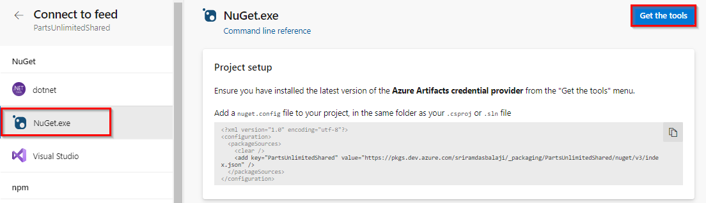

8. 单击 **Download the latest Nuget**

   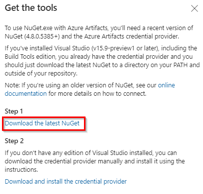

9. 在打开的窗口中，选择nuget.exe版本 **v5.5.1**


10. 返回 **Visual Studio**。在 **Solution Explorer**中，右键单击 **PartsUnlimited.Shared** 项目节点，然后选择 **Open Folder in File Explorer**。

   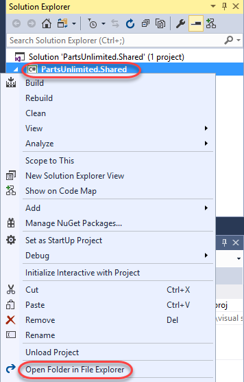

11. 将下载的 **nuget.exe** 文件移动到包含 **.csproj** 文件的文件夹中。

   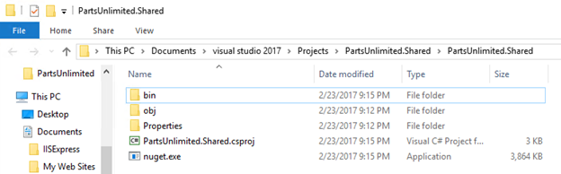

12. 在同一 **Windows Explorer** 窗口中，选择**File \| Open Windows PowerShell \| Open Windows PowerShell as administrator** 。

   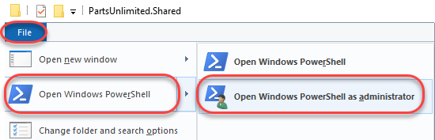

13. 执行以下行，从项目中创建一个 **.nupkg** 文件。请注意，这是将NuGet位打包在一起以进行部署的快捷方式。 NuGet是非常可定制的，并为为消费者提供详细信息提供了极大的灵活性。您可以在[NuGet程序包创建页面]上了解更多信息。 / nuget / create-packages / overview-and-workflow）。

    ```
    ./nuget.exe pack ./PartsUnlimited.Shared.csproj
    ```
14.  NuGet根据能够从项目中提取的信息构建一个最小的程序包。例如，请注意名称为 **PartsUnlimited.Shared.1.0.0.nupkg** 。该版本号是从程序集中提取的。

   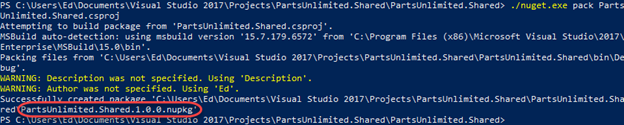

15. 返回 **Visual Studio**。在 **Solution Explorer**中，打开 **Properties\AssemblyInfo.cs** 。

   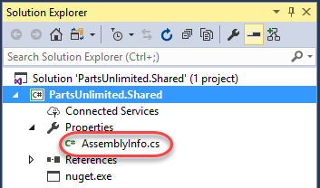

16.   **AssemblyVersion** 属性指定要构建到程序集中的版本号。每个NuGet发行版都需要一个唯一的版本号，因此，如果我们继续使用此方法来创建软件包，则需要记住在构建之前将其递增。

   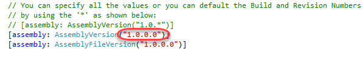

17. 返回 **PowerShell** 窗口并执行以下命令（它应该在一行上）。请注意，您需要提供一个“ API密钥”，该密钥可以是任何非空字符串。我们在这里使用 **"VSTS"** 。询问时使用您的Azure DevOps凭据登录。

    ```
    ./nuget.exe push -source "PartsUnlimitedShared" -ApiKey VSTS PartsUnlimited.Shared.1.0.0.nupkg
    ```
18. 该命令应在几秒钟后成功执行。

   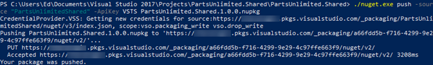

19. 返回浏览器窗口，打开对Azure DevOps并 **refresh** 该窗口。现在，您应该看到该组织的NuGet包已在Feed中发布。单击它以查看详细信息。

   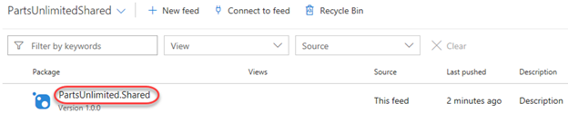

20. 详细信息已导入，现在可供其他人使用。

   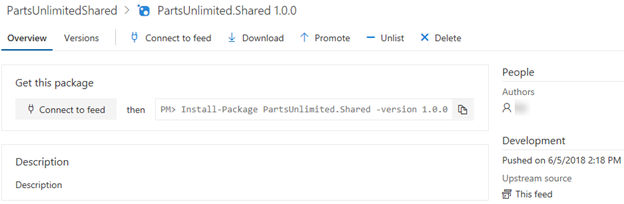

<a name="Ex1Task3"> </a>
### 任务3：导入NuGet包 ###

1. 切换到 **Visual Studio** ，打开完整的 **Parts Unlimited** 实例。

2. 在 **Solution Explorer** 中，右键单击 **PartsUnlimitedWebsite** 项目下的 **References** 节点，然后选择**Manage NuGet Packages** 。

   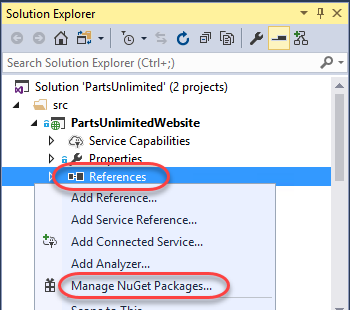

3. 单击 **Browse** 选项卡，然后将 **Package source** 更改为 **PartsUnlimitedShared**。唯一的软件包将是我们刚刚添加的软件包，因此请单击 **Install** 以将其添加到项目中。

   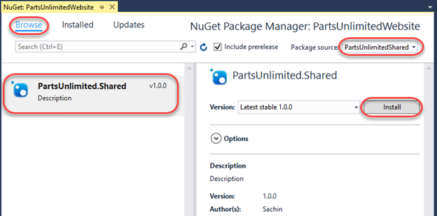

4. 如果询问，请单击 **OK**确认添加。

   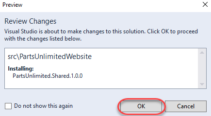

5. 按 **Ctrl+Shift+B** 生成项目。它应该成功。 NuGet包尚未添加任何值，但至少我们知道它在那里。

<a name="Ex1Task4"></a>
### 任务4：更新NuGet软件包 ###

1. 切换到 **Visual Studio** ，打开 **PartsUnlimited.Shared** 项目的（NuGet源项目）。

2. 在 **Solution Explorer**中，右键单击 **PartsUnlimited.Shared** 项目节点，然后选择 **Add \| New Item** 。

   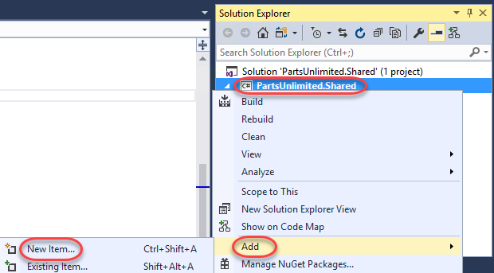

3. 选择 **Class** 模板，然后输入 **Name "TaxService.cs"** 。点击 **Add** 以添加课程。我们可以假装将tax calculation合并到此共享的类中并进行集中管理，以便其他团队可以简单地使用NuGet程序包。

   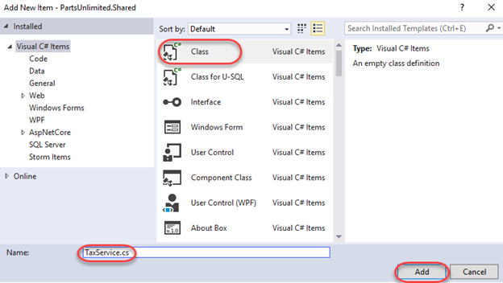

4. 用下面的代码替换新文件中的代码。目前，它将仅硬编码10％的比率。

    ```c#
    namespace PartsUnlimited.Shared
    {
        public class TaxService
        {
            static public decimal CalculateTax(decimal taxable, string postalCode)
            {
                return taxable * (decimal).1;
            }
        }
    }
    ```
5. 由于我们正在更新程序集（和程序包），请返回 **AssemblyInfo.cs** 并将 **AssemblyVersion** 更新为 **1. 1. 0.0**。

   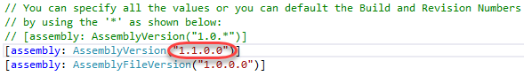

6. 按 **Ctrl+Shift+B** 生成项目。

7. 返回 **PowerShell** 窗口并执行以下行以重新打包NuGet程序包。请注意，新软件包将具有更新的版本号。

    ```
    ./nuget.exe pack PartsUnlimited.Shared.csproj
    ```
8. 执行以下行以发布更新的软件包。请注意，版本号已更改以反映新的软件包。

    ```
    ./nuget.exe push -source "PartsUnlimitedShared" -ApiKey VSTS PartsUnlimited.Shared.1.1.0.nupkg
    ```
9. 返回浏览器窗口，打开对Azure DevOps的页面并刷新页面。您仍将查看该软件包的1.0.0版本，但是可以通过选择**Versions** 标签并选择**1.1.0**来更改该版本。

   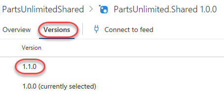

10. 切换回打开 **PartsUnlimited** 主项目（带有 **PartsUnlimitedWebsite**）的 **Visual Studio** 实例。

11. 在 **Solution Explorer**中，打开 **PartsUnlimitedWebsite\Utils\DefaultShippingTaxCalculator.cs** 。

   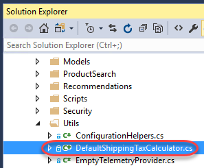

12. 在**20**行附近找到 **CalculateTax** 的调用，并在它的开头添加qualifier  **"artsUnlimited.Shared.TaxService. "**。原始代码称为该类内部的方法，因此我们要添加到该行开头的代码将其重定向到NuGet程序集中的代码。但是，由于该项目尚未更新NuGet软件包，因此它仍引用1. 0.0.0，并且没有可用的这些新更改，因此将无法构建代码。

   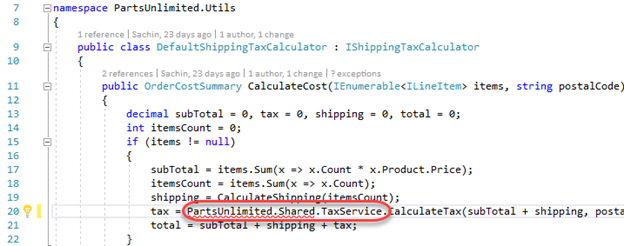

13. 在 **Solution Explorer**中，右键单击 **References** 节点，然后选择 **Manage NuGet Packages**。

   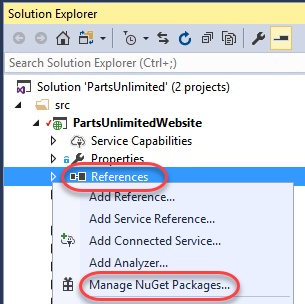

14.  NuGet知道我们的更新，因此请单击 **Updates** 选项卡以查看详细信息。单击 **Updates** 以放下新版本。如果  **Update** 选项卡尚未更新，您仍然可以从 **Browse** 选项卡更新软件包。请注意，可能有许多可用的NuGet更新，但是您只需要更新  **PartsUnlimited.Shared**。请注意，该软件包可能需要一些时间才能完全可用于更新。如果出现错误，请稍等片刻，然后重试。

   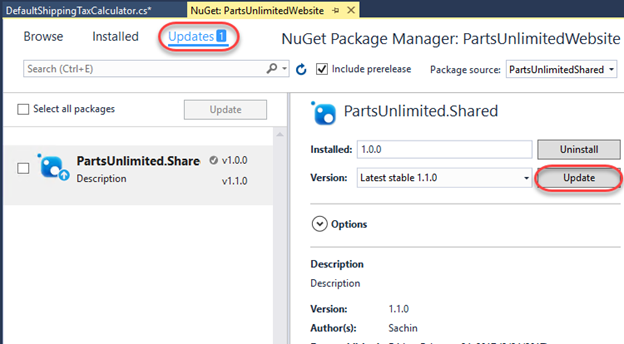

15.  如果询问，请单击 **OK** 以批准更新。

16.  按 **F5** 生成并运行该站点。它应该按预期工作。
