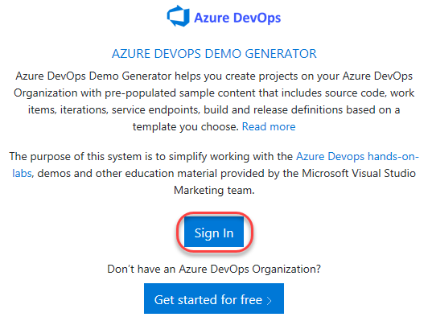
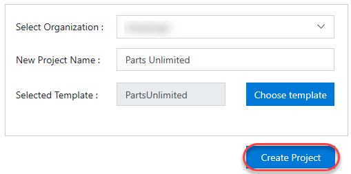
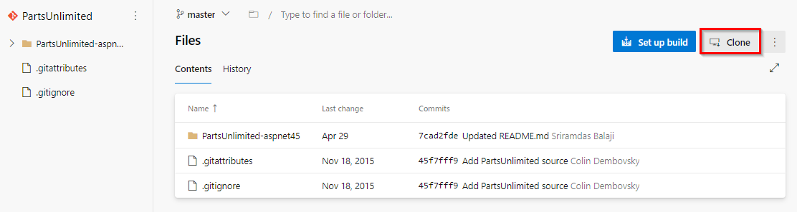
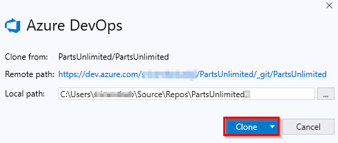
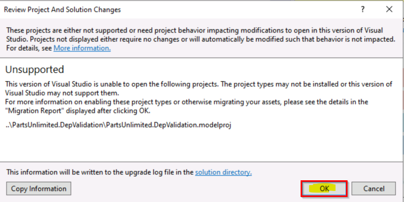

## 概述 ##
某些Azure DevOps实验需要预先配置的 **Parts Unlimited** 团队项目。本文档概述了设置所需数据的必需步骤。

### 任务1：配置Parts Unlimited团队项目 ###

1. 导航到[https://azuredevopsdemogenerator.azurewebsites.net](https://azuredevopsdemogenerator.azurewebsites.net/).。该实用工具网站将自动在您的帐户中创建一个新Azure Azure DevOps项目的过程，该项目中已预先填充了实验所需的内容（work items, repos,等）。有关该网站的更多信息，请参见[https://docs.microsoft.com/en-us/azure/devops/demo-gen](https://docs.microsoft.com/en-us/azure/devops/demo-gen).

1. 使用与您的Azure DevOps订阅关联的Microsoft帐户登录。

   

1.  **Accept** 访问您的订阅的权限请求。

1. 选择您的Azure DevOps组织，然后输入项目名称 **"Parts Unlimited"**。点击 **Choose Template**。

   

1. 选择 **PartsUnlimited** 模板，然后单击 **Select Template**。

   

1. 单击 **Create Project** ，然后等待该过程完成。

   

### 任务2：在Visual Studio中配置Parts Unlimited解决方案 ###

1. 有些实验会要求您在 **Visual Studio** 中打开 **Parts Unlimited** 解决方案。如果您的实验不需要这样做，则可以跳过此任务。

1. 导航到您的Azure DevOps team project以获取“ Parts Unlimited”。类似于[https://dev.azure.com/YOURACCOUNT/Parts%20Unlimited](https://dev.azure.com/YOURACCOUNT/Parts Unlimited).

1. 导航到 **Repos** 中心。

   

1. 单击 **Clone** ，然后选择 **Clone in Visual Studio** （如果其他选项显示为默认值，请在下拉列表中选择它）。
   
   

1. 按照工作流程在Visual Studio中克隆和配置项目。单击 **Clone** 以在本地复制存储库。

   

1. 在 **Team Explorer**中，双击 **Solutions** 部分中的 **PartsUnlimited.sln** 以打开解决方案。如果看到关于不支持的项目类型的任何警告，则可以忽略（只需在提示窗口中单击“确定”，然后忽略在浏览器中打开的迁移报告）

   

   

1. 将Visual Studio保持打开状态以供您在实验中使用。
