In this exercise, you are going to import the MyShuttle2 repo in your VSTS account into your VM for editing in Eclipse.

This exercise assumes you have completed Exercise 1, have created a Team Project that uses Git for version control, and imported the MyShuttle2 GitHub repo into your team project. This exercise uses a team project named **jdev-labs**, though your team project name may differ.

## Connect to VSTS from Eclipse

1. Click on the Eclipse icon in the toolbar to launch the Eclipse Java IDE.

    

1. The first time you run Eclipse, it will prompt for configuring the default workspace. select the option **Use this as the default and do not ask again** to use the default workspace on startup.

    

1. When the Welcome dialog appears, on the Help Menu select Install New Software.

    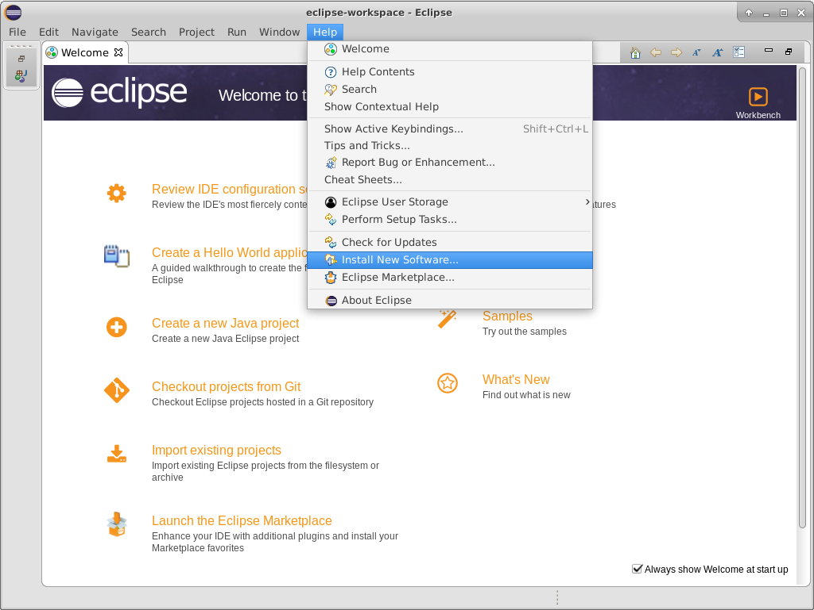

1. Choose the Add button to add a new repository. Use Team Explorer Everywhere as the name. The location of the update site is http://dl.microsoft.com/eclipse and click OK.

    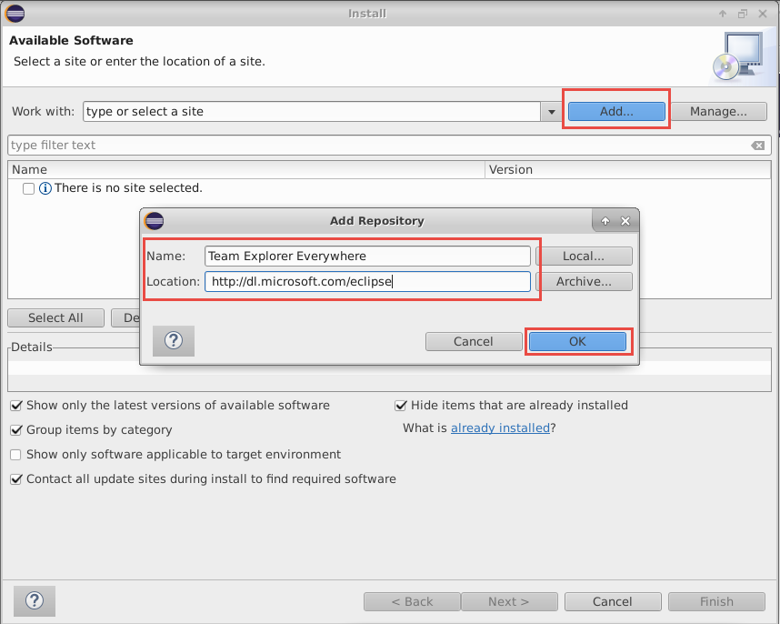

1. In the list of available software in the Install dialog box, select the Team Explorer Everywhere plugin. If you do not see this option, use the pull-down menu for **Work with:**, locate the update site URL you provided earlier in the list, select it and then select the plug-in mentioned above.

    

1. Click Next twice. Accept the license agreement and click Finish. Eclipse will need to restart.

1. When Eclipse restarts, the Welcome dialog will appear again. Select **Windows -> Show View and select Other...**

    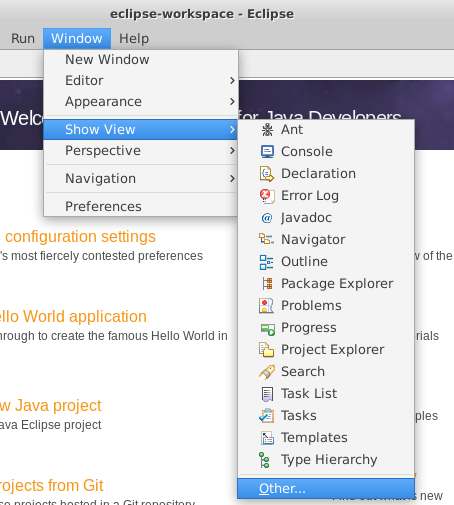

1. Locate Team Explorer, select the Team Explorer View, and click OK.

    

1. Click on **Connect to Team Services ...** to sign in to your VSTS account.

    

1. Choose the option **Connect to a Team Foundation Server or Team Services account** and click **Servers...**. In the **Add/Remove Team Foundation Server** panel, click **Add...** and type the name of the VSTS account (`https://{your-account-name}.visualstudio.com`) in the **Add Team Foundation Server** panel. Click OK.

    

1. The **Follow the instructions to complete sign-in** window will pop-up. Click on the hyperlink to be redirected to the Device Login page in a browser on the VM (may have a black background for security purposes).

    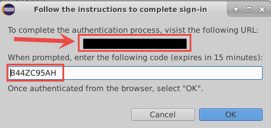

1. Copy the code in the text field in Eclipse and paste it into the browser page, then click **Continue**. Then sign in with your credentials used to access VSTS. If you provide incorrect credentials, you can try again by closing Eclipse, deleting the **~/.microsoft/Team Explorer/4.0/*** folder, and launching Eclipse again.

    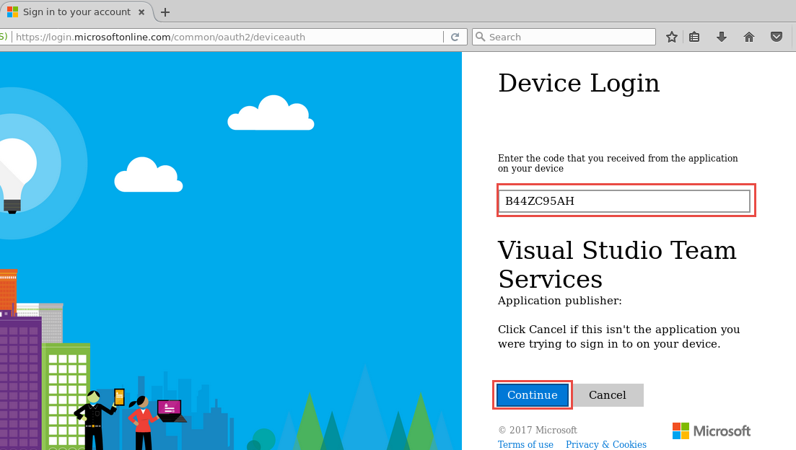

    

1. In Eclipse, click OK in the device login window. The VSTS account should now show up in the list of servers to connect. Click Close to close the current window.

    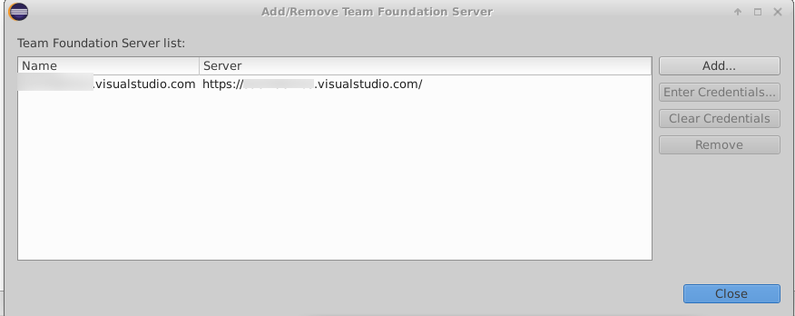

## Clone MyShuttle2 from VSTS with Eclipse

1. Once you are authenticated, click Next in the **Add Existing Team Project** window to view the team projects in VSTS.

    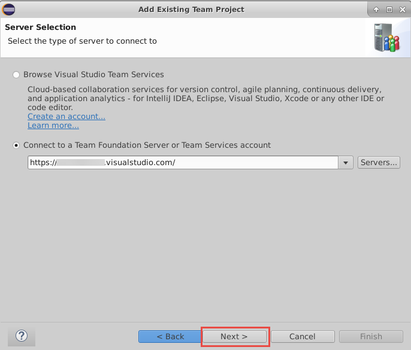

    Select the desired team project in Eclipse and click Finish.

1. In the Team Explorer Everywhere panel, choose the **Git Repositories** option. Select the MyShuttle2 repo in the team project, right-click the repo and select **Import Repository**.

    

    

1. Leave the defaults for the parent directory and the repo folder name and click Next. This will clone the repo onto the VM.

    

1. In the **Import Projects from Team Foundation Server** window, click Cancel to import the project as a Maven project instead of an Eclipse project.

    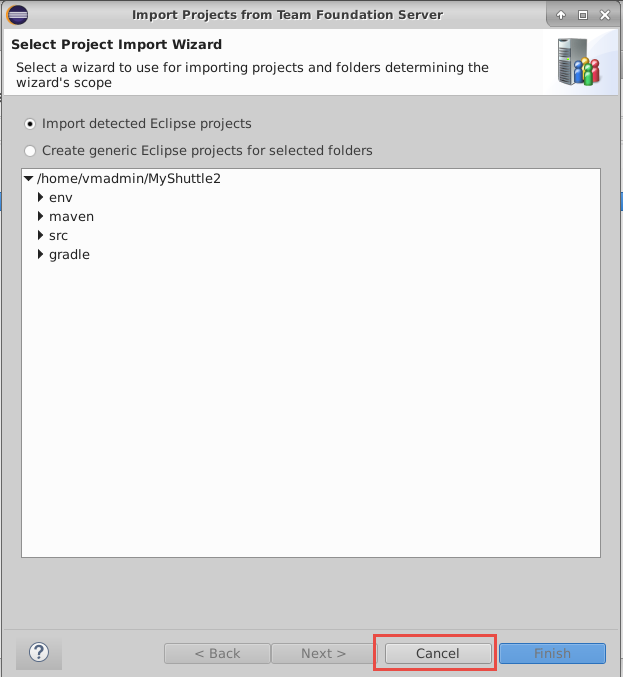

1. In Eclipse, navigate to File -> Import... to launch the "Import" window.

    

1. In the Import window, expand the Maven folder, choose **Existing Maven projects** and click Next.

    

1. To provide the root directory, click Browse or type the root directory path of /home/vmadmin/MyShuttle2. The pom.xml file should appear under projects to indicate the Maven project. Additionally, choose **Add project(s) to working set** to access the project separately in the Package Explorer. Click Finish.

    

1. Click on **Window -> Show View -> Package Explorer** in the toolbar at the top of Eclipse to view the myshuttle project in the Package Explorer. You may have to minimize other windows to view the Package Explorer.

    

    

## Clone MyShuttleCalc from VSTS with Eclipse

1. Repeat the repository cloning for MyShuttleCalc.

1. In the Team Explorer Everywhere panel, choose the **Git Repositories** option. Select the MyShuttleCalc repo in the team project, right-click the repo and select **Import Repository**.

    

    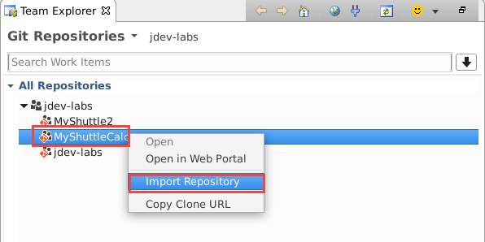

1. Leave the defaults for the parent directory and repo folder name and click Next. This will clone the repo onto the VM.

    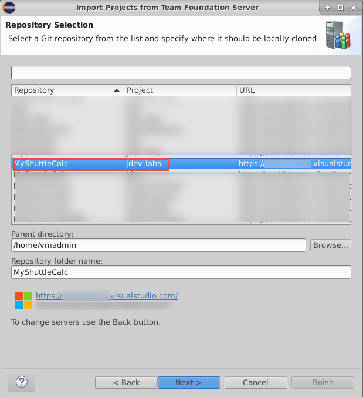

1. In the **Import Projects from Team Foundation Server** window, click Cancel to import the project as a Maven project instead of an Eclipse project.

    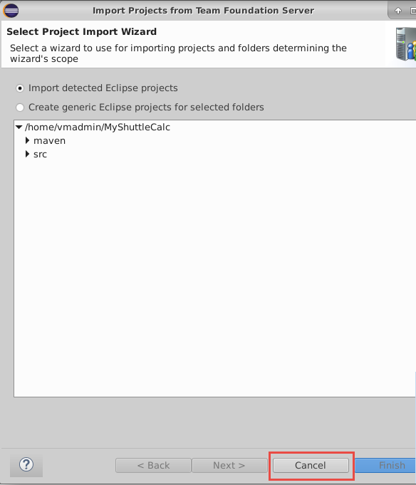

1. In Eclipse, navigate to **File -> Import...** to launch the "Import" window.

    

1. In the Import window, expand the Maven folder and choose **Existing Maven projects** and click Next.

    

1. To select the root directory, click Browse or type the root directory path of /home/vmadmin/MyShuttleCalc. The pom.xml file should appear under projects to indicate the Maven project. Select **Add project(s) to working set** to add myshuttle to access the project separately in the Package Explorer window. Click Finish.

    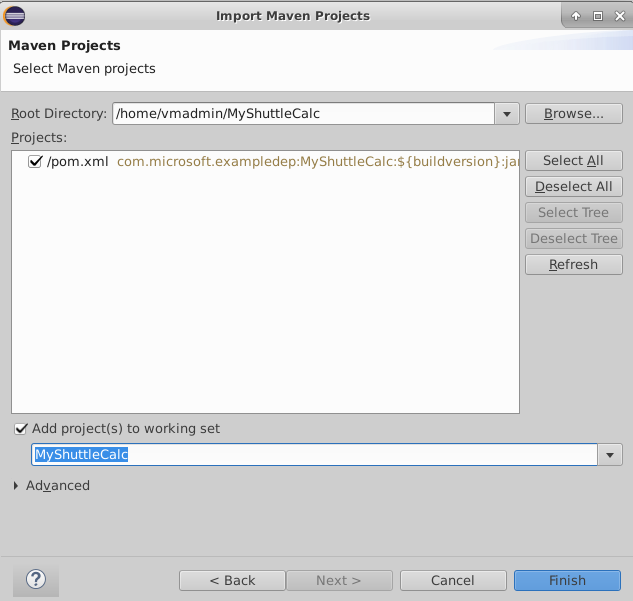

1. Click on **Window -> Show View -> Package Explorer** in the toolbar at the top of Eclipse to view the myshuttle project in the Package Explorer. You may have to minimize other windows to view the Package Explorer.

    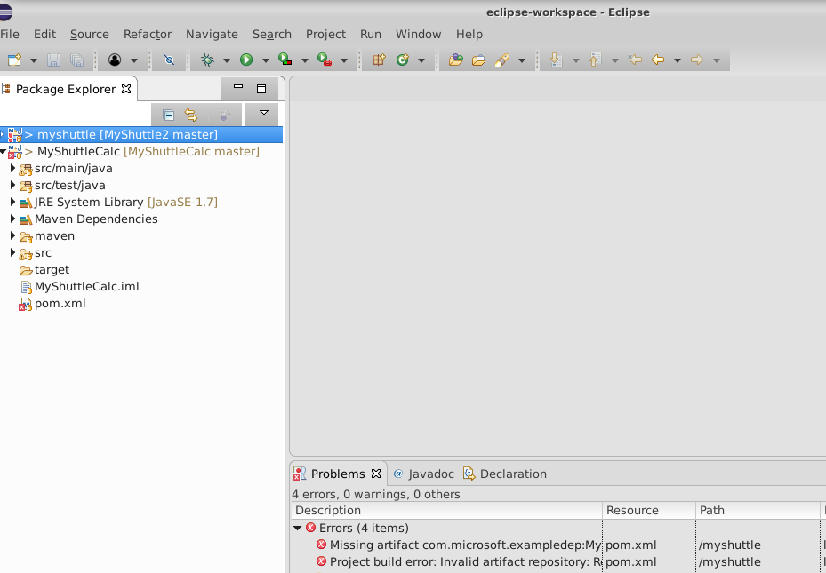