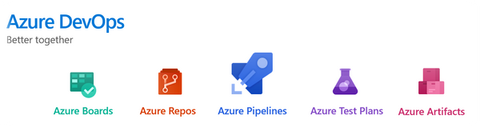
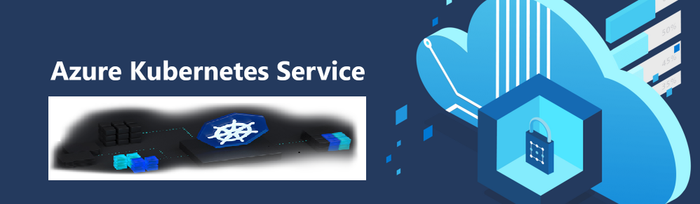

# OCP PTS&CSAUnicorn 动手实验

    
&emsp;
&emsp;
&emsp;
&emsp;
&emsp;
&emsp;   

## Azure DevOps
通过一个虚拟客户场景，使用DevOps原理及运用Azure DevOps工具帮助客户实现敏捷开发和自动化交付

- [使用Azure Boards进行敏捷规划和项目组合管理](azuredevopslabs/labs/azuredevops/agile/readme.md)
- [在Visual Studio Code和Azure DevOps中使用Git进行版本控制](azuredevopslabs/labs/azuredevops/git/readme.md)
- [使用Azure Artifacts进行程序包管理](azuredevopslabs/labs/azuredevops/packagemanagement/readme.md)
- [使用Azure Pipelines实现持续集成](azuredevopslabs/labs/azuredevops/continuousintegration/readme.md)
- [通过Azure Pipelines拥抱持续交付](azuredevopslabs/labs/azuredevops/yaml/readme.md)
- [使用Azure Test Plans进行测试计划和管理](azuredevopslabs/labs/azuredevops/testmanagement/readme.md)
- [使用Azure Test Plans测试计划进行探索性测试](azuredevopslabs/labs/azuredevops/exploratorytesting/readme.md)

&emsp;
&emsp;
&emsp;

## 云原生-Azure Cloud Native 
本次动手实验目的是帮助一个虚拟客户建立概念验证（POC），以将其代码迁移到更易于管理的流程，其中涉及对租户代码进行容器化，更好的DevOps工作流程以及为其提供的简单的后端数据库迁移。

&emsp;
&emsp;

- [云原生应用 -动手实验前的准备](MCW-Cloud-native-applications/Hands-on%20lab/%E4%BA%91%E5%8E%9F%E7%94%9F%E5%BA%94%E7%94%A8%20-%E5%8A%A8%E6%89%8B%E5%AE%9E%E9%AA%8C%E5%89%8D%E7%9A%84%E5%87%86%E5%A4%87.md)
  
- [云原生应用 -开发者版本实验](MCW-Cloud-native-applications/Hands-on%20lab/%E4%BA%91%E5%8E%9F%E7%94%9F%E5%BA%94%E7%94%A8%20-%E5%BC%80%E5%8F%91%E8%80%85%E7%89%88%E6%9C%AC%E5%AE%9E%E9%AA%8C.md)
  * <a href="MCW-Cloud-native-applications/Hands-on%20lab/%E4%BA%91%E5%8E%9F%E7%94%9F%E5%BA%94%E7%94%A8%20-%E5%BC%80%E5%8F%91%E8%80%85%E7%89%88%E6%9C%AC%E5%AE%9E%E9%AA%8C.md#exercise-1-create-and-run-a-docker-application">练习1：创建并运行Docker应用程序</a>
  * <a href="MCW-Cloud-native-applications/Hands-on%20lab/%E4%BA%91%E5%8E%9F%E7%94%9F%E5%BA%94%E7%94%A8%20-%E5%BC%80%E5%8F%91%E8%80%85%E7%89%88%E6%9C%AC%E5%AE%9E%E9%AA%8C.md#exercise-2-migrate-mongodb-to-cosmos-db-using-azure-database-migration-service">练习2：使用Azure数据库迁移服务将MongoDB迁移到Cosmos DB</a>
  * <a href="MCW-Cloud-native-applications/Hands-on%20lab/%E4%BA%91%E5%8E%9F%E7%94%9F%E5%BA%94%E7%94%A8%20-%E5%BC%80%E5%8F%91%E8%80%85%E7%89%88%E6%9C%AC%E5%AE%9E%E9%AA%8C.md#exercise-3-deploy-the-solution-to-azure-kubernetes-service">练习3：将解决方案部署到Azure Kubernetes服务</a>
  * <a href="MCW-Cloud-native-applications/Hands-on%20lab/%E4%BA%91%E5%8E%9F%E7%94%9F%E5%BA%94%E7%94%A8%20-%E5%BC%80%E5%8F%91%E8%80%85%E7%89%88%E6%9C%AC%E5%AE%9E%E9%AA%8C.md#exercise-4-scale-the-application-and-test-ha">练习4：扩展应用程序并测试HA</a>
  * <a href="MCW-Cloud-native-applications/Hands-on%20lab/%E4%BA%91%E5%8E%9F%E7%94%9F%E5%BA%94%E7%94%A8%20-%E5%BC%80%E5%8F%91%E8%80%85%E7%89%88%E6%9C%AC%E5%AE%9E%E9%AA%8C.md#exercise-5-working-with-services-and-routing-application-traffic">练习5：使用服务和路由应用程序流量</a>
  
- [白板设计](MCW-Cloud-native-applications/Whiteboard%20design%20session)
  * [学生指南](MCW-Cloud-native-applications/Whiteboard%20design%20session/%E7%99%BD%E6%9D%BF%E8%AE%BE%E8%AE%A1%E5%AD%A6%E7%94%9F%E6%8C%87%E5%8D%97.md)
  * [讲师指南](MCW-Cloud-native-applications/Whiteboard%20design%20session/%E7%99%BD%E6%9D%BF%E8%AE%BE%E8%AE%A1%E8%AE%B2%E5%B8%88%E6%8C%87%E5%8D%97.md)	
  * [讲师胶片](MCW-Cloud-native-applications/Whiteboard%20design%20session/%E7%99%BD%E6%9D%BF%E8%AE%BE%E8%AE%A1%E8%AE%B2%E5%B8%88presentation.pptx)	
  &emsp;
  &emsp;
  &emsp;

## Azure Spring Cloud
本次动手实验广泛使用命令行。 从一个简单的演示到更复杂的示例，非常快速地进行编码并在平台上运行。在完成所有指南之后，您应该对Azure Spring Cloud提供的所有内容都有比较深入的了解。

- [00 - 实验准备](azure-spring-cloud-training/00-setup-your-environment/README.md)
- [01 - 创建Azure Spring Cloud集群](azure-spring-cloud-training/01-create-an-azure-spring-cloud-instance/README.md)
- [02 - 构建一个简单的Spring Boot微服务](azure-spring-cloud-training/02-build-a-simple-spring-boot-microservice/README.md)
- [03 - 配置应用日志](azure-spring-cloud-training/03-configure-monitoring/README.md)
- [04 - 配置Spring Cloud Config server](azure-spring-cloud-training/04-configure-a-spring-cloud-config-server/README.md)
- [05 - 使用Spring Cloud实现Spring Boot微服务](azure-spring-cloud-training/05-build-a-spring-boot-microservice-using-spring-cloud-features/README.md)
- [06 - 集成Cosmos DB构建reactive Spring Boot微服务 ](azure-spring-cloud-training/06-build-a-reactive-spring-boot-microservice-using-cosmosdb/README.md)
- [07 - 集成Mysql构建reactive Spring Boot微服务](azure-spring-cloud-training/07-build-a-spring-boot-microservice-using-mysql/README.md)
- [08 - 构建Spring Cloud网关](azure-spring-cloud-training/08-build-a-spring-cloud-gateway/README.md)
- [09 - 实现完整的微服务栈](azure-spring-cloud-training/09-putting-it-all-together-a-complete-microservice-stack/README.md)
- [10 - 蓝绿部署](azure-spring-cloud-training/10-blue-green-deployment/README.md)
- [11 - 配置CI/CD](azure-spring-cloud-training/11-configure-ci-cd/README.md)
- [12 - 微服务交互](azure-spring-cloud-training/12-making-microservices-talk-to-each-other/README.md)
- [总结思考](99-conclusion/README.md)

## Azure订阅获取

Azure海外使用账号申请可以参考[链接](http://www.cnblogs.com/meowmeow/p/7773226.html?from=groupmessage&isappinstalled=0)
